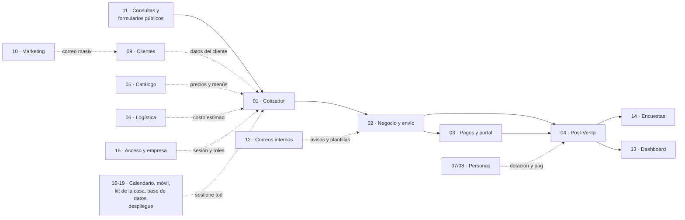

# Mapa del sistema Eventia

> Construido contra el código en el commit 0de0ddb el 11-09-2026.

## Cómo usar este mapa

### Para Felipe

Cuando pidas un cambio, dile a Claude qué módulo toca — o pídele que lo busque en el **Índice de mapas** de más abajo. Si el mapa de ese módulo dice "BORRADOR SIN VERIFICAR" en su primera línea, pide primero que lo verifiquen contra el código antes de construir nada encima. Y si el cambio cae dentro de una de las **zonas de riesgo** (las 15 de más abajo, o la sección de riesgos del mapa del módulo), pide que te muestren qué se puede romper antes de dar el visto bueno.

### Para una sesión de Claude

En orden:

1. Leer este índice completo.
2. Leer el mapa del módulo que toca el cambio y su sección de zonas de riesgo (sección 8 en la mayoría; en 18_BASE_DE_DATOS.md es la sección 7, y en 19_DESPLIEGUE_Y_OPERACION.md es la 8 con otra numeración de secciones — el nombre siempre es "Zonas de riesgo").
3. Si el cambio es un proceso de punta a punta y no solo una pantalla suelta, leer su flujo en `flujos/` (índice en [flujos/00_INDICE_DE_FLUJOS.md](flujos/00_INDICE_DE_FLUJOS.md)).
4. Revisar [21_INCIDENTES_Y_LECCIONES.md](21_INCIDENTES_Y_LECCIONES.md) por si esa zona ya tuvo un incidente parecido.
5. Consultar el grafo con el comando `graphify affected` sobre la pieza concreta que se va a tocar (archivo, función o tabla). El grafo vive en `graphify-out/` y se regenera solo con el gancho de git — no hay que pedirlo a mano.
6. Si el mapa que se está usando está marcado como borrador, verificarlo contra el código antes de confiar en él.

Ver también [20_CONEXIONES_Y_ZONAS_DE_RIESGO.md](20_CONEXIONES_Y_ZONAS_DE_RIESGO.md) para las conexiones entre módulos que cruzan más de dos mapas a la vez.

## El sistema en una página

Eventia son **dos programas que se publican por separado y comparten una sola base de datos**:

- **El motor** (`api-rest/`, NestJS): la única pieza que conversa con la base, con la llave de servicio de Supabase. Vive en Railway, en un proyecto que se llama "eventia-dev" pero que, pese al nombre, **es producción**.
- **La app** (`frontend/`, React + Vite): lo que ve la gente. Vive en Netlify y responde en www.eventi-app.com. Solo usa Supabase para iniciar sesión; todo lo demás lo pide al motor por REST.
- **La base de datos**: una sola Postgres en Supabase, compartida por todas las empresas. El motor separa los datos de cada una filtrando por `company_id` en cada consulta — no hay una base por empresa.
- **Laboratorio**: la rama `pruebas`, donde se programa y se prueba. Ahí los 9 relojes automáticos y varios correos no corren (o corren con freno).
- **Producción**: la rama `main`. Un PR de `pruebas` a `main`, revisado por Felipe, la publica. Ahí sí corren los relojes, los correos salen de verdad y el respaldo diario se ejecuta.

## La vida de un evento, de punta a punta

| Etapa | Qué pasa | Módulo | Flujo |
|---|---|---|---|
| 1. Llega el interesado | Llena el formulario público. Si el tipo de evento es "consulta", queda una consulta liviana y a los 10 minutos un reloj manda el brochure; si es "cotización", nace el cliente y un requerimiento | [11_CONSULTAS_Y_FORMULARIOS_PUBLICOS.md](11_CONSULTAS_Y_FORMULARIOS_PUBLICOS.md) | [flujos/01_CONSULTA_PUBLICA_A_COTIZACION.md](flujos/01_CONSULTA_PUBLICA_A_COTIZACION.md) |
| 2. Se arma el precio | Vendedor, operaciones o administrador llenan casillas y fijos en el cotizador, con datos de Catálogo, Logística y Clientes | [01_COTIZADOR.md](01_COTIZADOR.md), [05_CATALOGO_DE_SERVICIOS.md](05_CATALOGO_DE_SERVICIOS.md), [06_LOGISTICA_COMPRAS_E_INVENTARIO.md](06_LOGISTICA_COMPRAS_E_INVENTARIO.md), [09_CLIENTES.md](09_CLIENTES.md) | [flujos/02_CREAR_Y_GUARDAR_COTIZACION.md](flujos/02_CREAR_Y_GUARDAR_COTIZACION.md) |
| 3. Se envía | El botón "Enviar cotización" manda un correo tipo con el PDF que el motor genera imprimiendo la misma hoja | [02_NEGOCIO_ENVIO_Y_SEGUIMIENTO.md](02_NEGOCIO_ENVIO_Y_SEGUIMIENTO.md) | [flujos/03_ENVIAR_COTIZACION_POR_CORREO.md](flujos/03_ENVIAR_COTIZACION_POR_CORREO.md) |
| 4. Se negocia | Tablero del embudo, bitácora de seguimiento, toques automáticos a los 7 y 14 días | [02_NEGOCIO_ENVIO_Y_SEGUIMIENTO.md](02_NEGOCIO_ENVIO_Y_SEGUIMIENTO.md) | — |
| 5. Se acepta | Nace el plan de pagos (cuotas que deben sumar el total exacto) | [03_PAGOS_REEMBOLSOS_Y_PORTAL.md](03_PAGOS_REEMBOLSOS_Y_PORTAL.md) | [flujos/04_ACEPTAR_COTIZACION_Y_PLAN_DE_PAGOS.md](flujos/04_ACEPTAR_COTIZACION_Y_PLAN_DE_PAGOS.md) |
| 6. Vive en Post-Venta | Seguimiento, pagos, documentos, servicios, gestión y cocina; si cambia el total, la cascada reajusta cuotas y reembolsos solos | [04_POST_VENTA.md](04_POST_VENTA.md) | [flujos/05_CAMBIAR_TOTAL_DE_EVENTO_ACEPTADO.md](flujos/05_CAMBIAR_TOTAL_DE_EVENTO_ACEPTADO.md), [flujos/06_REGISTRAR_ABONO_Y_COMPROBANTE.md](flujos/06_REGISTRAR_ABONO_Y_COMPROBANTE.md) |
| 6b. (si se cae) | Se anula un evento aceptado, con motivo | [04_POST_VENTA.md](04_POST_VENTA.md) | [flujos/07_CANCELAR_EVENTO_ACEPTADO.md](flujos/07_CANCELAR_EVENTO_ACEPTADO.md) |
| 7. Se ejecuta | Se planifica y confirma al personal del evento; Logística junta compras y provisión | [07_PERSONAS_DIRECTORIO_Y_PLANIFICACION.md](07_PERSONAS_DIRECTORIO_Y_PLANIFICACION.md), [06_LOGISTICA_COMPRAS_E_INVENTARIO.md](06_LOGISTICA_COMPRAS_E_INVENTARIO.md) | [flujos/09_PLANIFICAR_PERSONAL_DE_EVENTO_Y_DIA.md](flujos/09_PLANIFICAR_PERSONAL_DE_EVENTO_Y_DIA.md), [flujos/11_COSTOS_COMPRAS_Y_PROVISION.md](flujos/11_COSTOS_COMPRAS_Y_PROVISION.md) |
| 8. Se marca realizado | La cotización queda congelada; se manda la encuesta de satisfacción una sola vez | [04_POST_VENTA.md](04_POST_VENTA.md), [14_ENCUESTAS_DE_SATISFACCION.md](14_ENCUESTAS_DE_SATISFACCION.md) | [flujos/08_MARCAR_EVENTO_REALIZADO.md](flujos/08_MARCAR_EVENTO_REALIZADO.md) |
| 9. Se liquida al personal | Se cierran jornadas, se reparte propina, se arma la nómina y se paga | [08_PERSONAS_LIQUIDACION_NOMINA_E_HISTORICO.md](08_PERSONAS_LIQUIDACION_NOMINA_E_HISTORICO.md) | [flujos/10_LIQUIDAR_PAGAR_Y_ARCHIVAR_PERSONAL.md](flujos/10_LIQUIDAR_PAGAR_Y_ARCHIVAR_PERSONAL.md) |

Corriendo por debajo de todo el tiempo: [13_DASHBOARD_Y_ANALITICA.md](13_DASHBOARD_Y_ANALITICA.md) resume las cifras; [12_CORREOS_INTERNOS_Y_NOTIFICACIONES.md](12_CORREOS_INTERNOS_Y_NOTIFICACIONES.md) manda los avisos; [10_MARKETING.md](10_MARKETING.md) sigue en paralelo con campañas a la cartera de clientes; [15_ACCESO_EMPRESA_USUARIOS_Y_PLANES.md](15_ACCESO_EMPRESA_USUARIOS_Y_PLANES.md) decide quién puede hacer cada paso; y [16_CALENDARIO_MOVIL_E_INFRAESTRUCTURA_DEL_MOTOR.md](16_CALENDARIO_MOVIL_E_INFRAESTRUCTURA_DEL_MOTOR.md), [17_KIT_DE_LA_CASA_Y_BASE_DE_LA_APP.md](17_KIT_DE_LA_CASA_Y_BASE_DE_LA_APP.md), [18_BASE_DE_DATOS.md](18_BASE_DE_DATOS.md) y [19_DESPLIEGUE_Y_OPERACION.md](19_DESPLIEGUE_Y_OPERACION.md) sostienen todo lo anterior. Ver [flujos/13_UN_DIA_DE_RELOJES_EN_PRODUCCION.md](flujos/13_UN_DIA_DE_RELOJES_EN_PRODUCCION.md), [flujos/14_UNA_PETICION_DE_PUNTA_A_PUNTA.md](flujos/14_UNA_PETICION_DE_PUNTA_A_PUNTA.md) y [flujos/15_DEL_DASHBOARD_A_LA_BASE.md](flujos/15_DEL_DASHBOARD_A_LA_BASE.md).

## Índice de mapas

| Mapa | Qué cubre | Estado | Tablas principales | Riesgo al tocarlo |
|---|---|---|---|---|
| [01_COTIZADOR.md](01_COTIZADOR.md) | Armar el precio de un evento: casillas por persona, fijos, descuento/IVA/propina, margen, menús guardados, paquetes y el formulario público | Verificado | `quotations`, `variable_services`, `fixed_services`, `payments`, `refunds` | La fórmula de dinero y `QuotationsService.update` son compartidos por medio sistema; la cascada de plata no siempre filtra por empresa |
| [02_NEGOCIO_ENVIO_Y_SEGUIMIENTO.md](02_NEGOCIO_ENVIO_Y_SEGUIMIENTO.md) | Tablero del embudo, ficha del negocio, enviar cotización con PDF, cambios de estado, bitácora de seguimiento | Verificado | `quotations`, `quotation_followups`, `event_documents` | El envío del PDF depende de una sola clase CSS (`.qv-hoja`); si se rompe, no sale ninguna cotización |
| [03_PAGOS_REEMBOLSOS_Y_PORTAL.md](03_PAGOS_REEMBOLSOS_Y_PORTAL.md) | Plan de pagos, abonos, reembolsos automáticos, portal sin clave del mandante, relojes de vencidos | Verificado | `payments`, `payment_transactions`, `refunds`, `portal_receipts` | Varios repositorios de pagos y reembolsos no filtran por `company_id` |
| [04_POST_VENTA.md](04_POST_VENTA.md) | La vida del evento ya ganado: seguimiento, pagos, documentos, servicios, gestión, cocina; marcar realizado o anular | Verificado | `quotations`, `event_documents`, `event_resources`, `event_staff` | El candado de "evento realizado" vive al inicio de `QuotationsService.update`; moverlo de ahí descongela todo |
| [05_CATALOGO_DE_SERVICIOS.md](05_CATALOGO_DE_SERVICIOS.md) | Servicios variables y fijos, categorías y secciones, menús guardados, paquetes | Verificado | `variable_services`, `fixed_services`, `service_groups`, `service_group_collections` | Varios repositorios devuelven la respuesta cruda de Supabase sin revisar error: un fallo de base puede anunciarse como éxito |
| [06_LOGISTICA_COMPRAS_E_INVENTARIO.md](06_LOGISTICA_COMPRAS_E_INVENTARIO.md) | Proveedores, insumos, mobiliario, recetas, compras, provisión y costo estimado del evento | Verificado | `supplies`, `management_resources`, `furniture_items`, `event_resources` | `consolidateEvent` no tiene ninguna prueba y alimenta el costo en 7 pantallas distintas |
| [07_PERSONAS_DIRECTORIO_Y_PLANIFICACION.md](07_PERSONAS_DIRECTORIO_Y_PLANIFICACION.md) | Ficha de cada persona, cargos, sábana de planificación de 28 días, sillas por evento | Verificado | `people`, `event_staff`, `person_reviews`, `day_notes` | La proyección de planta ya borró turnos reales dos veces; el motor no protege `/people` por rol |
| [08_PERSONAS_LIQUIDACION_NOMINA_E_HISTORICO.md](08_PERSONAS_LIQUIDACION_NOMINA_E_HISTORICO.md) | Liquidar jornadas, repartir propina por puntos, armar y pagar nómina, histórico | Verificado | `event_staff`, `staff_sheets`, `tip_pools`, `payrolls` | El filtro de qué está pendiente de pago ya pagó de más una vez ($100.000, 16-08) |
| [09_CLIENTES.md](09_CLIENTES.md) | Clientes, personas de contacto, contacto principal, portal, ficha 360 | Verificado | `clients`, `client_contacts`, `client_types` | El correo de envío se engancha al contacto por nombre exacto: renombrar a una persona puede desengancharla de sus cotizaciones |
| [10_MARKETING.md](10_MARKETING.md) | Campañas de correo, audiencias, bajas y supresión, aperturas/clics/rebotes | Verificado | `marketing_campaigns`, `marketing_sends`, `marketing_audiences`, `marketing_suppressions` | El envío manual no tiene candado de una sola vez: un doble clic puede duplicar el envío de una campaña completa |
| [11_CONSULTAS_Y_FORMULARIOS_PUBLICOS.md](11_CONSULTAS_Y_FORMULARIOS_PUBLICOS.md) | Formulario público, embudo de consultas, brochure automático a los 10 minutos, requerimientos | Verificado | `consultas`, `consulta_config`, `event_types` | El balde de brochures es compartido entre empresas; el candado de dueño mal tocado puede filtrar el PDF de otra |
| [12_CORREOS_INTERNOS_Y_NOTIFICACIONES.md](12_CORREOS_INTERNOS_Y_NOTIFICACIONES.md) | La puerta única de correo del motor (`EmailService.sendEmail`), interruptores, avisos internos, push móvil | Verificado | `companies` (notifications), `user_profiles`, `push_devices` | Hay correos que parecen enviados y no salieron: un interruptor roto y una casilla marcada "enviada" sin que saliera nada |
| [13_DASHBOARD_Y_ANALITICA.md](13_DASHBOARD_Y_ANALITICA.md) | Panel de KPIs, Ingresos y Caja, pipeline, análisis, cosecha del mes | Verificado | `quotations`, `payments`, `event_staff`, funciones SQL `get_*` | El aislamiento entre empresas vive dentro de cada función SQL, fuera de las migraciones versionadas |
| [14_ENCUESTAS_DE_SATISFACCION.md](14_ENCUESTAS_DE_SATISFACCION.md) | Encuesta al mandante tras el evento realizado, plantilla fija, respuestas, promedio en ficha 360 | Verificado | `customer_satisfaction_survey_templates`, `customer_satisfaction_survey_responses` | La lectura de respuestas por empresa no usa `!inner`: podría mostrar respuestas de otra empresa |
| [15_ACCESO_EMPRESA_USUARIOS_Y_PLANES.md](15_ACCESO_EMPRESA_USUARIOS_Y_PLANES.md) | Login, recuperar clave, empresa de cada usuario, roles, marca de la empresa, planes, super-admin | Verificado | `user_profiles`, `companies`, `leads`, `auth.users` | Varias rutas de usuarios y empresas no filtran por la empresa de la sesión; `/plans/confirmation` activa premium sin verificar el pago |
| [16_CALENDARIO_MOVIL_E_INFRAESTRUCTURA_DEL_MOTOR.md](16_CALENDARIO_MOVIL_E_INFRAESTRUCTURA_DEL_MOTOR.md) | Calendario de eventos, API de Eventia Móvil (push y cocina), arranque del motor, CORS, respaldo diario, los 9 relojes | Verificado | `push_devices`, `notifications`, `kitchen_checklist_marks` | Todo lo automático depende de `NODE_ENV=production`; escalar a más de una réplica rompe los candados que viven en memoria |
| [17_KIT_DE_LA_CASA_Y_BASE_DE_LA_APP.md](17_KIT_DE_LA_CASA_Y_BASE_DE_LA_APP.md) | Componentes compartidos de la app (buscador, modal, números, fechas), menú, sesión, portero de tamaño | Verificado | `user_profiles`, `companies` (solo autenticación) | `permissions.ts` (app) y `@Roles` (motor) son dos copias que ya no coinciden en varias rutas |
| [18_BASE_DE_DATOS.md](18_BASE_DE_DATOS.md) | Las 58 tablas vigentes de Supabase, relaciones, jsonb, funciones y triggers, quién lee y escribe cada una | Verificado | (documento transversal: 58 tablas) | Una tabla nueva sin `GRANT` a `service_role` deja toda pantalla que la use con error 42501 |
| [19_DESPLIEGUE_Y_OPERACION.md](19_DESPLIEGUE_Y_OPERACION.md) | Ramas y ambientes, build y pruebas del motor y la app, portero, variables de entorno, relojes de producción | Verificado | bucket `backups`, función `get_backup_tables` | Railway solo reconstruye el motor si el commit toca `api-rest/`; un commit que solo cambia el frontend puede creerse desplegado y no estarlo |

Todos los mapas de este índice están, según su propia cabecera, "verificado una vez contra el código" al commit 0de0ddb (11-09-2026). Si alguno cambia a "BORRADOR SIN VERIFICAR" en una revisión futura, esa fila debe marcarse como borrador aquí también.

## Glosario de la casa

- **Cotización**: el presupuesto de un evento armado en el cotizador. Pasa por estados: solicitada, enviada, en negociación, aceptada, realizada, rechazada o cancelada.
- **Requerimiento**: una solicitud de cotización que todavía no se ha cotizado, en la bandeja `/requests`.
- **Negocio**: la ficha de una cotización desde que existe hasta que se gana o se pierde (`/negocio/:id`).
- **Mandante**: la persona de contacto de un cliente (empresa, colegio) que efectivamente encarga y recibe el evento.
- **Casilla**: la fila del cotizador donde se elige un servicio variable (categoría, audiencia, número de personas, día).
- **Sección fija**: una sección del catálogo cuyos servicios entran solos a la cotización, sin que el vendedor los busque.
- **Fijo**: un servicio fijo del evento (salón, audiovisual, decoración): se cobra por evento, no por persona.
- **Menú guardado**: una categoría con servicios y cantidades ya armada, para reutilizar en otra cotización.
- **Paquete**: una combinación guardada de menús, servicios sueltos y fijos.
- **Cascada**: el reajuste automático de cuotas y reembolsos que dispara `QuotationsService.update` cuando cambia el total de una cotización aceptada.
- **Cuota**: cada pago programado del plan de pagos de un evento aceptado.
- **Abono**: un pago parcial registrado contra una cuota.
- **Reembolso**: la devolución que se genera sola cuando el total de un evento aceptado baja por debajo de lo ya pagado.
- **Portal (del mandante)**: la página pública sin clave (`/portal/:token`) donde el contacto ve su saldo, sus cuotas y sube "Ya transferí".
- **Portero**: el script del CI que rechaza el commit si un archivo copia código a mano o crece sobre su techo congelado (`frontend/scripts/portero-kit-de-la-casa.sh`).
- **Higuera** (patrón): extraer una pieza nueva a su propio archivo en vez de agrandar un archivo ya congelado por el portero.
- **Bitácora**: las notas de seguimiento de un negocio, con fecha de próximo contacto.
- **Marca**: los datos de identidad visual de una empresa (logo, colores, tagline) usados en correos, PDF y portal.
- **Audiencia**: el grupo de contactos elegido para una campaña de marketing.
- **Supresión**: la lista de correos dados de baja o rebotados que marketing no debe volver a usar.
- **Consulta**: un interesado que llenó el formulario público con un tipo de evento "consulta" (matrimonios, paseos de curso, graduaciones); no crea cliente ni cotización, solo un registro liviano que recibe un brochure automático.
- **Embudo**: el trayecto de una consulta o un requerimiento hasta convertirse en cotización.
- **Liquidación**: el cierre de las jornadas de una persona en un evento o día de staff, con reparto de propina.
- **Pozo de propina**: el monto de propina de un evento o día que se reparte por puntos entre el personal que trabajó.
- **Día de staff**: un día del restaurante tratado como un evento permanente, para efectos de dotación y propina.
- **Nómina**: el conjunto de liquidaciones ya cerradas, consolidadas por RUT, lista para pagar persona a persona.
- **Histórico**: lo que ya se pagó, y los días marcados sin propina.
- **Evento congelado / realizado**: una cotización marcada como realizada; queda bloqueada para edición salvo lo que sigue vivo (cobranza).
- **Ficha 360**: la vista del cliente con lo cotizado, lo vendido, la conversión, el saldo y la satisfacción.
- **Torre de Control**: el área oculta de super-admin, protegida por una lista de correos, no por rol.
- **Candado**: una regla que impide una escritura fuera de las condiciones esperadas (por ejemplo, el candado de evento realizado o el candado de familia de unidades de un insumo).
- **Laboratorio**: el ambiente de pruebas (rama `pruebas`). Ahí los relojes automáticos y ciertos correos no corren, o corren con freno.
- **Producción**: el ambiente real (rama `main`). Ahí corren los 9 relojes, los correos salen de verdad y el respaldo diario se ejecuta.

## Las 15 zonas de mayor riesgo del sistema

1. **La fórmula de dinero (`computeMoney`, `api-rest/src/quotations/utils/money.ts`)** es compartida por el cotizador, Post-Venta y la verificación del motor a la vez, vía el alias `@dinero`. Tocarla cambia el total de cotizaciones viejas al volver a guardarse y, si están aceptadas, mueve sus cuotas. → [01_COTIZADOR.md](01_COTIZADOR.md), [04_POST_VENTA.md](04_POST_VENTA.md)
2. **El aislamiento por empresa en la cascada de plata**: `QuotationsService.update` lee la cotización con `findOne(id)` sin comparar `company_id`, y varios métodos de pagos y reembolsos (`RefundsService.create/updateAmount/remove`, `PaymentsService.update`, `deletePaymentPlan`) tampoco filtran por empresa antes de escribir. → [01_COTIZADOR.md](01_COTIZADOR.md), [03_PAGOS_REEMBOLSOS_Y_PORTAL.md](03_PAGOS_REEMBOLSOS_Y_PORTAL.md)
3. **`GET /quotations/:id` es público y no filtra por empresa**: hay que dejarlo así porque de él dependen la encuesta pública y varias pantallas, pero hoy devuelve todas las columnas de `quotations`, costos internos de proveedor incluidos. → [01_COTIZADOR.md](01_COTIZADOR.md), [04_POST_VENTA.md](04_POST_VENTA.md)
4. **El envío de toda cotización depende de una sola clase CSS**, `.qv-hoja`: el motor abre la hoja de impresión con un navegador invisible y espera ese selector con 15 segundos de tope; si no aparece, el envío muere, y si aparece antes de tiempo, imprime una hoja incompleta. → [02_NEGOCIO_ENVIO_Y_SEGUIMIENTO.md](02_NEGOCIO_ENVIO_Y_SEGUIMIENTO.md)
5. **`people.controller.ts` no tiene ningún `@Roles`**: cualquier sesión con login, sin importar el cargo, puede leer RUT y cuentas bancarias de toda la gente y marcar pagos, porque la restricción de "solo administrador" existe únicamente en la pantalla. → [07_PERSONAS_DIRECTORIO_Y_PLANIFICACION.md](07_PERSONAS_DIRECTORIO_Y_PLANIFICACION.md), [08_PERSONAS_LIQUIDACION_NOMINA_E_HISTORICO.md](08_PERSONAS_LIQUIDACION_NOMINA_E_HISTORICO.md)
6. **`GET`/`PATCH /users/:id` y `GET /companies/:id` no filtran por la empresa de la sesión**: con el id correcto se puede leer o editar un usuario de otra empresa, o leer la ficha completa de otra empresa (datos de cobro incluidos). → [15_ACCESO_EMPRESA_USUARIOS_Y_PLANES.md](15_ACCESO_EMPRESA_USUARIOS_Y_PLANES.md)
7. **`PATCH /super-admin/companies/:id` no usa una clase DTO**: el body no se filtra, así que cualquier columna de `companies` queda editable sin control desde la Torre de Control. → [15_ACCESO_EMPRESA_USUARIOS_Y_PLANES.md](15_ACCESO_EMPRESA_USUARIOS_Y_PLANES.md)
8. **`/plans/confirmation` deja `is_premium = true` sin que nada verifique que el pago en Mercado Pago realmente ocurrió**: cualquier sesión que llegue a esa ruta se activa premium gratis. → [15_ACCESO_EMPRESA_USUARIOS_Y_PLANES.md](15_ACCESO_EMPRESA_USUARIOS_Y_PLANES.md)
9. **`NODE_ENV=production` es el candado maestro del motor**: si se cae o se cambia por error, se apagan en silencio los 9 relojes (cobranza, seguimiento, campañas, respaldo, etc.), el webhook de Resend deja de exigir firma, y queda abierto `POST /email-previews`. → [16_CALENDARIO_MOVIL_E_INFRAESTRUCTURA_DEL_MOTOR.md](16_CALENDARIO_MOVIL_E_INFRAESTRUCTURA_DEL_MOTOR.md), [19_DESPLIEGUE_Y_OPERACION.md](19_DESPLIEGUE_Y_OPERACION.md)
10. **Escalar el motor a más de una réplica en Railway rompería los candados de una sola vez**: los relojes sin bloqueo entre instancias, la memoria en RAM y el `Set` que evita el doble envío de cotizaciones viven todos en la memoria de un solo proceso; con dos réplicas, correos y respaldos podrían duplicarse. → [16_CALENDARIO_MOVIL_E_INFRAESTRUCTURA_DEL_MOTOR.md](16_CALENDARIO_MOVIL_E_INFRAESTRUCTURA_DEL_MOTOR.md), [19_DESPLIEGUE_Y_OPERACION.md](19_DESPLIEGUE_Y_OPERACION.md)
11. **El registro "BACKUP OK" no garantiza un respaldo completo**: si una tabla falla durante el respaldo diario, queda incompleta y el archivo se sube igual con ese mismo mensaje de éxito. → [16_CALENDARIO_MOVIL_E_INFRAESTRUCTURA_DEL_MOTOR.md](16_CALENDARIO_MOVIL_E_INFRAESTRUCTURA_DEL_MOTOR.md), [19_DESPLIEGUE_Y_OPERACION.md](19_DESPLIEGUE_Y_OPERACION.md)
12. **Los filtros que deciden qué jornada está pendiente de pago** (`jornadasPendientes`, `estaLiquidado`) ya causaron un pago de más real: el 16-08 un filtro más laxo metió $100.000 de eventos sin liquidar en una nómina. → [08_PERSONAS_LIQUIDACION_NOMINA_E_HISTORICO.md](08_PERSONAS_LIQUIDACION_NOMINA_E_HISTORICO.md)
13. **La proyección automática de planta** (`proyectarPlanta`, `laMandaronAUnEvento`) ya borró turnos de gente real dos veces (16-08: días con propina de un freelance; 18-08: el turno de 4 plantas del evento #423) y repartió propina mal una vez (04-09: a alguien en su día de descanso). → [07_PERSONAS_DIRECTORIO_Y_PLANIFICACION.md](07_PERSONAS_DIRECTORIO_Y_PLANIFICACION.md)
14. **Las respuestas de la encuesta de satisfacción se filtran por empresa sobre una tabla embebida sin `!inner`**: la documentación de Supabase confirma que sin `!inner` las filas vuelven igual (consultada el 11-09-2026), así que una empresa podría llegar a ver respuestas de otra. Falta probarlo en vivo. → [14_ENCUESTAS_DE_SATISFACCION.md](14_ENCUESTAS_DE_SATISFACCION.md)
15. **Hay correos que el sistema cree enviados y nunca salieron**: el interruptor "Recibimos tu solicitud" no apaga nada, y la encuesta de satisfacción queda marcada como enviada aunque `RESEND_API_KEY` falte, `EMAILS_SILENCED` esté activo o Resend falle — la pantalla igual dice "se envió". → [12_CORREOS_INTERNOS_Y_NOTIFICACIONES.md](12_CORREOS_INTERNOS_Y_NOTIFICACIONES.md), [14_ENCUESTAS_DE_SATISFACCION.md](14_ENCUESTAS_DE_SATISFACCION.md)

## Medición en producción del 11-09-2026

Se midió en "Cotizador-dev" (producción), solo leyendo el esquema, para no exagerar ni subestimar las zonas de aislamiento entre empresas.

- **Qué ids se pueden adivinar.** `quotations.id`, `payments.id` y `user_profiles.id` son UUID aleatorios (`gen_random_uuid()`), así que las zonas 2 y 6 exigen conocer un UUID ajeno. La zona 3 es distinta: el portal del mandante entrega los UUID de todas sus cotizaciones (x5-01 del doc 20), y la ruta pública devuelve `provisioned_cost`, `provisioned_people` y `provisioned_services`, que sí existen como columnas en producción.
- **Los ids del catálogo son correlativos.** `service_groups.id`, `service_group_collections.id` y `fixed_services.id` son identity: basta recorrer números.
- **Por eso la puerta entre empresas más fácil de recorrer es el catálogo, no la plata.** `DELETE /service-groups/:id` y `DELETE /service-group-collections/:id` (cargo ventas o más) borran menús guardados y paquetes solo por id. `PATCH /services/fixed/:id` (solo administrador) cambia el precio de un servicio fijo solo por id. Una sesión de otra empresa puede hacerlo con datos ajenos. → [flujos/16_CAMBIAR_EL_CATALOGO.md](flujos/16_CAMBIAR_EL_CATALOGO.md), pasos 8, 23 y 24.
- **Cuántas empresas hay.** Producción tiene 3 empresas con datos: el aislamiento ya no es teórico.

Nada de esto está arreglado. Cada arreglo necesita plan y OK de Felipe.

## Cómo mantener vivo este mapa

Todo cambio que altere un flujo, una regla, un endpoint o una tabla actualiza el mapa del módulo correspondiente **en el mismo commit** y renueva su línea de estado en la cabecera de ese archivo. El grafo de Graphify (`graphify-out/`) se actualiza solo, con el gancho de git — no hay que regenerarlo a mano.

El estado de cada documento se lee de su propia cabecera, no de este índice: los mapas que dicen **"verificado una vez contra el código"** se pueden citar con confianza (con la fecha y el commit que ahí figuran); los que digan **"BORRADOR SIN VERIFICAR"** deben aparecer marcados como borrador en cualquier tabla o enlace que los mencione, incluido este índice, hasta que se verifiquen.
