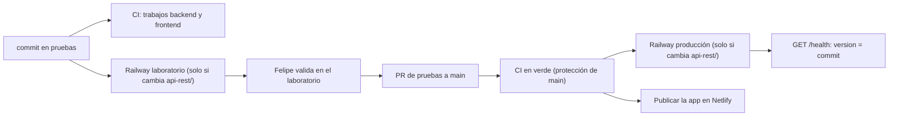

# Mapa: Despliegue y operación
> **Estado: verificado una vez contra el código** (commit bd6a0e1, 11-09-2026), actualizado el 11-09-2026 con las migraciones 107-109 y el estado del sprint 1. Falta la etapa de completar lo que no quedó escrito. Parte del atlas de docs/arquitectura/mapa; el índice es 00_MAPA_DEL_SISTEMA.md.

## 1. Visión general

**En simple, para Felipe:** Eventia son dos programas que se publican por separado. El motor vive en Railway y la app en Netlify, y los dos comparten una sola base en Supabase. Todo cambio pasa primero por la rama `pruebas` (el laboratorio). GitHub lo revisa solo (CI), Felipe lo valida en el laboratorio y recién con un PR a `main` llega a producción. El motor se publica solo cuando entra a la rama. La app, según todo lo que muestra el repositorio, se compila y se publica aparte. La base de datos se migra siempre a mano.

| Pieza | Carpeta | Dónde vive | Cómo llega | Evidencia |
|---|---|---|---|---|
| Motor (NestJS 11, Node 20) | `api-rest/` | Railway: proyecto `eventia-dev`, entorno `production`, servicio `api-rest`. Dominio `api-rest-production-d404.up.railway.app` | Solo, desde GitHub, **si cambia algo bajo `api-rest/`** | encabezado de `.github/workflows/ci.yml`; commits `f374372` y `6ea9586`; `docs/pendiente-despliegue.md`; respaldo de `BajasService.baseApi` |
| App (React 18 + Vite 5) | `frontend/` | Netlify: sitio `eventia-dev`, que responde en `https://www.eventi-app.com` (alias `https://eventia-dev.netlify.app`) | Compilada y publicada; la evidencia apunta a publicación a mano (ver §4) | `frontend/netlify.toml`; `docs/pendiente-despliegue.md`; lista CORS de `api-rest/src/main.ts` |
| Base de datos | `docs/migrations/` | Supabase | Siempre a mano (SQL en el panel) | `CLAUDE.md`, sección "Database & migrations" → mapa `18_BASE_DE_DATOS.md` |
| Revisor automático | `.github/workflows/ci.yml` | GitHub Actions | En cada push y en cada PR a `main` | `ci.yml` |

**Ojo con los nombres.** El "-dev" de `eventia-dev`, en Railway y en Netlify, **no** significa desarrollo: es producción. `docs/pendiente-despliegue.md` dice "proyecto **eventia-dev**, entorno **production**" y "el sitio de siempre (*eventia-dev*, el que responde en www.eventi-app.com)".

**Lo que NO está en el repositorio.** No hay `railway.json`, `Dockerfile`, `Procfile` ni configuración de Nixpacks o Railpack. El comando de construcción, el de arranque, la versión de Node y las variables del motor viven en el panel de Railway. Lo único de hosting que está versionado es `frontend/netlify.toml`, `frontend/public/_redirects` y `frontend/public/_headers`.

**El atlas llegó a producción por la PR #109.** El 11-09-2026 se fusionó a `main` (commit `bd6a0e1`): los 39 documentos de `docs/arquitectura/mapa`, la sección nueva de `CLAUDE.md` ("EL MAPA DEL SISTEMA Y EL GRAFO — ANTES DE TOCAR CÓDIGO"), `.gitignore`, `.gitattributes`, `.graphifyignore` y las tres migraciones de seguridad `107_cerrar_tablas_abiertas.sql`, `108_cerrar_el_grifo.sql` y `109_candado_get_backup_tables.sql` (detalle en mapa 18; el candado de la 109 se explica también en §7 de este mapa). Ni una línea de código de la app. Y como ninguno de esos archivos vive bajo `api-rest/`, aplica la misma regla de más abajo ("solo construye si cambia algo bajo `api-rest/`"): el laboratorio siguió 24 horas sin reiniciarse después de tres subidas de documentos seguidas ese mismo día.

**Conexiones con otros mapas.** Aquí se documenta cómo se construye, se revisa, se publica y se opera. El detalle funcional está en:
- `02_NEGOCIO_ENVIO_Y_SEGUIMIENTO.md`: el PDF que imprime Chromium.
- `03_PAGOS_REEMBOLSOS_Y_PORTAL.md`: el reloj que vence cuotas.
- `10_MARKETING.md`: el reloj de campañas y el webhook de Resend.
- `11_CONSULTAS_Y_FORMULARIOS_PUBLICOS.md`: el reloj del embudo.
- `12_CORREOS_INTERNOS_Y_NOTIFICACIONES.md`: cobranza, seguimiento, resumen semanal y el silenciador.
- `15_ACCESO_EMPRESA_USUARIOS_Y_PLANES.md`: super-admin y recuperación de clave.
- `16_CALENDARIO_MOVIL_E_INFRAESTRUCTURA_DEL_MOTOR.md`: límite de frecuencia, logs, caché, Swagger y push.
- `17_KIT_DE_LA_CASA_Y_BASE_DE_LA_APP.md`: las piezas que vigila el portero y la red contra pantalla blanca.
- `18_BASE_DE_DATOS.md`: migraciones y `get_backup_tables()` (candado de permisos desde la migración 109, 11-09-2026).

## 2. Ramas y ambientes

### Las ramas

| Rama | Qué es | Evidencia |
|---|---|---|
| `main` | **Producción.** Un merge aquí publica el motor de producción. | `ci.yml`: "main = despliegue automático del backend en Railway" y "Con la protección de la rama main, NADA con esto en rojo puede llegar a producción" |
| `pruebas` | **Laboratorio.** Aquí se programa. Railway construye el motor del laboratorio desde esta rama. | Los PR #79 al #108 de `main` son todos "Merge pull request #N from Felipevargas989/pruebas" (`git log --merges --first-parent main`). Commit `6ea9586`: "Railway saltó el build de pruebas" |
| `feature/*` | La convención escrita en `CLAUDE.md`. Se usó hasta fines de agosto (PR #55 a #62 del 26-08). Quedan más de 30 ramas locales y decenas remotas sin uso. | `git branch -a`; `CLAUDE.md`, sección "Git & PR workflow" |
| `restaurar-produccion` | Rama del incidente del 25-08: `4a28e53` "Modulo de Marketing completo (#52)" entró a `main` y `ae3ab4c` lo revirtió (#53) con el cuerpo "revertir la fusión no autorizada de marketing". Volvió revisado el 26-08 como `f6650e0` (#54). | `git log --first-parent main`; `git log restaurar-produccion` |

En el commit verificado, `main`, `pruebas`, `origin/main` y `origin/pruebas` apuntan al mismo commit (`0de0ddb`).

**Regla del ritual** (`docs/arquitectura/09_PLAN_DE_HOMOLOGACION.md`, "Reglas del ritual", regla 3): "Laboratorio → Felipe valida → producción. Nunca saltarse el medio." El incidente del 25-08 muestra el costo: un merge a `main` sin autorización llegó a producción y hubo que revertirlo el mismo día.

### Los dos ambientes

| Aspecto | Laboratorio | Producción | Evidencia |
|---|---|---|---|
| Rama | `pruebas` | `main` | ver arriba |
| Motor | Railway, entorno de laboratorio (nombre no confirmado en el repo) | Railway `eventia-dev` / `production` / `api-rest` | `docs/pendiente-despliegue.md`; commit `6ea9586` |
| Base | Proyecto Supabase espejo ("la base espejo") | Proyecto Supabase de producción | comentario de `ES_LABORATORIO` en `frontend/src/layout/Layout.tsx` |
| Relojes (`@Cron`) | Apagados | Encendidos | `api-rest/src/app.module.ts`; `docs/arquitectura/mapa/10_MARKETING.md`, capítulo "Programar envío" |
| Correos del `EmailService` | Suprimidos con `EMAILS_SILENCED=1` | Salen | comentario en `EmailService.sendEmail` |
| Probador `POST /email-previews` | Disponible | Responde 404 | `EmailPreviewsController.sendPreviews` |
| Webhook de Resend sin secreto | Se acepta con advertencia | Se rechaza | `BajasService.verificarFirmaSvix` |
| Respaldo diario | No corre | Corre | `BackupCronService.enabled` |
| Google Analytics | No reporta | Solo si el dominio termina en `eventi-app.com` | `esProduccion` en `frontend/src/lib/analytics.ts` |
| Letrero "🧪 LABORATORIO" | Sí | No | `Layout.tsx` |
| Llaves VAPID (push del móvil) | Sí (según comentario del 28-07) | "prod aún no las tiene" (mismo comentario) | encabezado de `api-rest/src/movil/movil.service.ts` |

### Cómo saber dónde estás parado
1. **En la app:** si `VITE_SUPABASE_URL` contiene el identificador del proyecto de laboratorio, escrito a mano en la constante `ES_LABORATORIO` de `Layout.tsx`, aparece el letrero "🧪 LABORATORIO". Nació porque "Felipe entró al lab sin querer" (28-07). Ojo: la app decide si es laboratorio **por la base**, no por el dominio.
2. **En el motor:** `GET /health` devuelve `version`, los 7 primeros caracteres del commit que corre (§3). Hay que compararlo con el último merge de la rama.
3. **La app no tiene** un marcador de versión equivalente a `/health` (no se encontró en el código).

### Desarrollo local
- `startApi.sh` (`cd api-rest && npm run start:dev`) y `startFront.sh` (`cd frontend && npm run dev`, puerto 5173).
- En el Mac de Felipe, Node no está en el PATH: `export PATH="$HOME/.local/node20/bin:$PATH"` (doc 09, "Reglas del ritual", regla 2).
- CORS acepta `http://localhost:5173`, `http://localhost:4173` (`vite preview`), `http://127.0.0.1:5173` y `http://127.0.0.1:3000` (`main.ts`).
- El PDF en local necesita `PUPPETEER_EXECUTABLE_PATH` apuntando al Chrome instalado (`docs/arquitectura/13_ENVIO_DE_COTIZACIONES.md`; `EnvioCotizacionService.generarPdf`).
- Sin `NODE_ENV=production`, en local no corren relojes ni respaldo.

## 3. Motor: construcción, pruebas y despliegue

### Versión de Node
`api-rest/.nvmrc` = `20`; `engines.node` = `>=20.0.0` en `api-rest/package.json`; el CI usa `node-version: 20`. La versión de Node que usa Railway no está en el repo.

### Scripts (`api-rest/package.json`)

| Script | Qué hace | Nota |
|---|---|---|
| `build` | `nest build` → `dist/` | `nest-cli.json`: `deleteOutDir: true` y plugin `@nestjs/swagger` con `introspectComments` |
| `start:prod` | `node dist/main` | No se confirmó si Railway usa este o `start` |
| `start` / `start:dev` / `start:debug` | `nest start` (con `--watch` / `--debug`) | Desarrollo |
| `lint` | `eslint "{src,apps,libs,test}/**/*.ts" --fix` | **Reescribe archivos.** El CI no usa este script (§5) |
| `format` | `prettier --write "src/**/*.ts" "test/**/*.ts"` | `.prettierrc`: comillas simples, coma final, `prettier-plugin-organize-imports` |
| `test` | `jest` con la config de `package.json`: raíz `src`, `.*\.spec\.ts$`, `ts-jest`, alias `^src/(.*)$` | 61 archivos `*.spec.ts` al 11-09 |
| `test:unit` | `jest --config ./testConfig/jest.unit.config.js` | Mismo alcance que `test` |
| `test:e2e` | `jest --config ./test/jest-e2e.json` | Es la plantilla de Nest: `test/app.e2e-spec.ts` espera `GET /` → "Hello World!" y no existe controlador en `/`. No corre en CI |
| `test:cov` / `test:watch` / `test:debug` | Variantes de jest | — |

### Compilación y chequeo de tipos
- `api-rest/tsconfig.json` tiene `incremental: true`. Commit `3ffd267` (28-07): "El build local incremental daba verde; el CI (limpio) mostró la verdad". Por eso vale el build limpio del CI.
- El chequeo de tipos se corre **dentro de `api-rest/`**: `npx tsc --noEmit -p tsconfig.json`. Desde la raíz "no revisa nada y pasa en verde" (`CLAUDE.md`). Commit `dd437f1` (15-08): una edición borró 18 métodos de `people.service.ts`, el chequeo desde la raíz dio verde y "El build de Railway falló con 18 errores".
- **Compilar no garantiza arrancar.** Commit `1f9af18` (25-08): "El deploy del laboratorio moría en bucle al arrancar" por `FiltroSegmentoDto` declarado después de usarse en un decorador; "El build compila igual (por eso la compuerta no lo pilló); la verificación nueva es cargar el módulo compilado con node".

### Arranque (`bootstrap` en `api-rest/src/main.ts`)
1. `NestFactory.create(AppModule, { rawBody: true, bufferLogs: true })`. `rawBody` existe para verificar la firma Svix del webhook de Resend (mapa 10).
2. `validateEnv()` (`api-rest/src/config/validate-env.ts`): si falta una variable **crítica** (`SUPABASE_URL`, `SUPABASE_SERVICE_ROLE_KEY`, `PORT`), lanza "CONFIGURACIÓN INCOMPLETA — el servidor no puede partir… Se definen en Railway → servicio api-rest → Variables". Las **importantes** solo generan la advertencia "⚠️ CONFIGURACIÓN INCOMPLETA (el servidor parte igual…)". Nació de "RESEND_API_KEY faltó 5 días y el servidor partió igual". Lo protege `validate-env.spec.ts`.
3. `trust proxy` = 1: "Railway pone un proxy adelante". Sin esto, el límite de frecuencia castigaría a todos juntos (mapa 16).
4. CORS: `FRONTEND_URL`, `MOVIL_URL`, `https://www.eventi-app.com`, `https://eventia-dev.netlify.app` y los localhost. `maxAge: 86400`.
5. Logger pino y `ValidationPipe` global con `whitelist`, `forbidNonWhitelisted` y `transform`.
6. Swagger en `/docs`, **público en todos los ambientes**, con versión `RAILWAY_GIT_COMMIT_SHA` (7 caracteres) o `dev`.
7. `app.listen(PORT)`. No hay prefijo global de rutas ni llamada a `enableShutdownHooks`.

### `GET /health`
- `HealthController.check` en `api-rest/src/health/health.controller.ts`, marcado `@Public()`. Nació en la Fase 2 Bloque A (commit `26f2198`, 27-07).
- Responde `{ status: 'ok', version, uptime_seconds, timestamp }`. `version` son los 7 primeros caracteres de `RAILWAY_GIT_COMMIT_SHA`, o `"desarrollo"` si no existe.
- **No toca la base.** "ok" significa que el proceso está vivo, no que Supabase responda.
- Pasa por el `ThrottlerGuard` global (300 por minuto por IP, `app.module.ts`).
- Uso tras publicar: `version` debe coincidir con el commit que se fusionó, y `uptime_seconds` debe haber vuelto a cero. Si la versión no cambió, Railway saltó o no terminó el build (ver abajo).

### Despliegue en Railway
- **Solo desde GitHub.** Commit `f374372` (17-08): "Un commit vacío Railway lo salta (SKIPPED): solo construye si cambia algo bajo api-rest/".
- **Un commit solo de frontend no relanza el motor.** Commit `6ea9586` (20-08): "Railway saltó el build de pruebas por un commit solo-frontend y dejó el despliegue anterior sin conmutar. Cambio real bajo api-rest/ para relanzarlo".
- **Un commit que solo toca documentación tampoco relanza el motor**, por la misma regla. Las tres subidas del atlas el 11-09-2026 (39 documentos de `docs/arquitectura/mapa`, la sección nueva de `CLAUDE.md`, `.gitignore`/`.gitattributes`/`.graphifyignore` y las migraciones 107-109 en `docs/migrations`) no tocan `api-rest/`: el laboratorio siguió 24 horas sin reiniciarse.
- **Si el constructor de Railway falla**, se reintenta con un cambio real bajo `api-rest/` (commits `ee9f41f` y `f374372`, 17-08).
- **Si el build falla, lo anterior sigue vivo.** "el despliegue anterior sigue vivo, así que la web no se cae" (`docs/pendiente-despliegue.md`).

### Chromium para generar el PDF
- Dependencias: `puppeteer-core` `^24.43.1` y `@sparticuz/chromium` `^147.0.0` (`api-rest/package.json`).
- `EnvioCotizacionService.generarPdf` (`api-rest/src/quotations/envio-cotizacion.service.ts`):
  - Con `PUPPETEER_EXECUTABLE_PATH` usa ese Chrome con `--no-sandbox --disable-dev-shm-usage`. Sin la variable usa `chromium.args` y `chromium.executablePath()`.
  - Abre `${FRONTEND_URL}/imprimir/${token}` (espera `networkidle0` hasta 45 s), espera `.qv-hoja` hasta 15 s y las fuentes hasta 10 s, e imprime en A4.
  - Un navegador por envío, cerrado en `finally`. `enviosEnCurso` (un `Set` en memoria) evita envíos dobles.
- **Dependencias de sistema** (encabezado de `docs/arquitectura/13_ENVIO_DE_COTIZACIONES.md` — un documento fuera de este atlas `mapa/`; no confundir con `mapa/13_DASHBOARD_Y_ANALITICA.md`, que es otro tema): `RAILPACK_DEPLOY_APT_PACKAGES` con nss, nspr, expat, gbm, xkbcommon, drm, fontconfig y fuentes Liberation/DejaVu, "ya declaradas en lab y producción; sin ellas Chromium no arranca o imprime sin letras". La sección "Chromium en Railway" del mismo documento dice lo contrario (§9).
- **Memoria:** "~300–400 MB por impresión. Aceptado por Felipe; monitorear en Railway tras el pase" (`docs/arquitectura/13_ENVIO_DE_COTIZACIONES.md`).
- **El PDF depende de la app publicada.** El Chromium del motor carga la ruta pública `/imprimir/:token` del frontend (`frontend/src/App.tsx`), que a su vez llama a la API de su propio build (`VITE_EVENTIA_API_REST`). El flujo completo está en el mapa 02 y en `flujos/03_ENVIAR_COTIZACION_POR_CORREO.md`.

### Qué pasa en cada despliegue o reinicio del motor
- La caché en RAM parte vacía (`api-rest/src/cache/memoria.ts`: "un redeploy la parte de cero (bien)"). Un reinicio también es herramienta de operación: `api-rest/REINICIOS.md` anota el del 12-08 en el laboratorio "para vaciar el caché de permisos (rol cambiado directo en la base…)".
- `enviosEnCurso` se vacía.
- En producción, `BackupCronService.onModuleInit` revisa a los 20 s si existe el respaldo del día y lo genera si falta (§7).
- Si `RUN_FOLLOWUPS_ON_BOOT=1`, `QuotationsCronService.onApplicationBootstrap` corre el seguimiento comercial al encender, **en cualquier ambiente**.
- `/health` muestra `uptime_seconds` en cero y la `version` nueva.

### Orden cuando un cambio cruza capas
1. **Migración que agrega columnas → motor → app.** El `ValidationPipe` con `forbidNonWhitelisted` rechaza campos desconocidos. `docs/pendiente-despliegue.md` lo explica con `tip_amount`: si se sube la app antes que el motor, "cada vez que alguien del equipo apriete Guardar en una cotización, el sistema le va a dar error. No algunas. Todas".
2. **Migración que quita permisos o cierra puertas → después.** Commit `91252a1` (28-07), migración 39: "aplicar tras desplegar y publicar".
3. **La fórmula del dinero viaja en los dos.** `frontend/vite.config.ts` y `frontend/tsconfig.json` definen el alias `@dinero` → `api-rest/src/quotations/utils/money.ts`, que se compila **dentro** de la app. Un cambio ahí relanza el motor en Railway (está bajo `api-rest/`), pero la app sigue con la fórmula vieja hasta que se vuelva a publicar.

## 4. App: construcción, pruebas y despliegue

### Versión de Node
`frontend/.nvmrc` = `20`; `engines.node` = `>=20`; CI con Node 20. **Pero** `frontend/netlify.toml` fija `NODE_VERSION = "18"` (§9). `vitest` 4.1.10 exige `^20.0.0 || ^22.0.0 || >=24.0.0`; `vite` 5.4.21 acepta `^18.0.0 || >=20.0.0` (según sus `package.json` en `node_modules`).

### Scripts (`frontend/package.json`)

| Script | Qué hace |
|---|---|
| `dev` | `vite` (puerto 5173) |
| `build` | `tsc && vite build`: tipos y luego construcción. Lo usa el CI |
| `build:skip-ts` | `vite build` sin revisar tipos |
| `build:netlify` | `npm ci && tsc && vite build`: el comando de `netlify.toml` |
| `lint` | `eslint . --ext ts,tsx --report-unused-disable-directives --max-warnings 0`. Con 87 problemas medidos, este script **siempre falla**; el CI usa techo (§5) |
| `format` | `prettier --write "src/**/*.{ts,tsx,js,jsx,json,css,md}"` |
| `test` / `test:watch` | `vitest run` / `vitest` |
| `portero` | `bash scripts/portero-kit-de-la-casa.sh` |
| `preview` | `vite preview` (puerto 4173, aceptado por CORS) |

### Configuración de construcción
- `frontend/tsconfig.json`: `noEmit`, `strict`, `include: ["src"]` y `paths` con `@dinero`. `tsconfig.node.json` (compuesto) cubre `vite.config.ts`.
- **Hay dos configuraciones de Vite versionadas:** `vite.config.ts` y `vite.config.js` (más `vite.config.d.ts` y dos `*.tsbuildinfo`). Vite busca en este orden: `vite.config.js`, `.mjs`, `.ts`… (`DEFAULT_CONFIG_FILES` en `frontend/node_modules/vite/dist/node/constants.js`). **Manda el `.js`.** Hoy dicen lo mismo (plugin react, alias `@dinero`, `server.fs.allow` a la carpeta padre) y los dos cambiaron por última vez en el commit `1c609d3` (27-07).
- Vitest no tiene archivo propio y usa esa misma configuración, con entorno `node` por defecto. Los 5 archivos de componentes declaran `// @vitest-environment jsdom`: `SelectWithSearch.test.tsx`, `AgregadorDeItems.test.tsx`, `TablaDeJornadas.test.tsx`, `RutInput.test.tsx` y `HoraInput.test.tsx`. En total hay 19 archivos `*.test.ts(x)` bajo `frontend/src`.
- **Las variables `VITE_*` quedan grabadas al compilar.** `import.meta.env` se reemplaza en el build: cambiar una variable exige recompilar y republicar. `frontend/src/lib/supabase.ts` lanza "Missing Supabase environment variables" si faltan, y la app no parte.

### Netlify
- `frontend/netlify.toml`: `command = "npm run build:netlify"`, `publish = "dist"`. Entorno: `NODE_VERSION = "18"`, `NPM_FLAGS = "--legacy-peer-deps"`, `NPM_CONFIG_PRODUCTION = "false"` (instala `tsc` y `vite`, que son devDependencies) y `NPM_CONFIG_OPTIONAL = "true"`. Redirección `/*` → `/index.html` 200.
- `frontend/.npmrc`: `optional=true`, `legacy-peer-deps=true`, `ignore-scripts=false`.
- `optionalDependencies`: `@rollup/rollup-linux-x64-gnu` fijado en `4.6.1` (binario de Linux para construir). El `package-lock.json` trae además `4.62.3` anidado bajo `rollup`.
- **`frontend/public/_redirects`** (`/*  /index.html  200`), en el repo desde el commit `91252a1` (28-07): "nace con cada build, se acabó recrearlo a mano en cada publicación (ya nos mordió 2 veces)". Sin él, los enlaces directos dan 404: `/portal/:token`, `/imprimir/:token` (el PDF), `/customer-satisfaction-survey/:companyId/:quotationId` y `/public-quotation/:company_id`.
- **`frontend/public/_headers`** (commit `7fb4298`, 12-08): `/assets/*` con `Cache-Control: public, max-age=31536000, immutable`. `index.html` no se cachea, así que "las versiones nuevas llegan igual de inmediato".

### Cómo se publica
El repositorio no lo deja escrito como procedimiento. Lo que sí muestra:
- `docs/pendiente-despliegue.md` (25-07): "Yo compilo la web de nuevo y la publico en el sitio de siempre".
- `ci.yml`: "las llaves REALES se inyectan solo al construir para publicar (03_COMO_PUBLICAR)". Ese documento no está en el repo.
- `frontend/.gitignore` ignora `.netlify/`, la carpeta que crea la CLI de Netlify al enlazar un sitio.
- Commit `98e3563` (09-09): "d45fd19 subió sin compilar".

Conclusión con reserva: la app se compila y se publica a mano. No se pudo confirmar si Netlify **además** construye solo desde GitHub con `netlify.toml` (§10).

### Después de publicar una versión nueva
Una pestaña abierta con la versión anterior pide piezas (`/assets/*.js`) que ya no existen. Hay dos redes:
- El listener `vite:preloadError` de `frontend/src/main.tsx` (03-08) recarga una vez, con candado de 10 s en `sessionStorage` (`eventia_recarga`).
- `RedDeSeguridad` (`frontend/src/components/RedDeSeguridad.tsx`, 02-09) ataja la caída de una página perezosa, como la pantalla blanca del 01-09 "subiendo un comprobante en producción".

El detalle está en el mapa 17.

## 5. Puertas de calidad: pruebas, lint, portero y CI

### El CI (`.github/workflows/ci.yml`)
Se dispara con `push` (cualquier rama) y con `pull_request` a `main`. Tiene dos trabajos, y **sus nombres importan**: "esos nombres son los que la protección de main exige en verde. Si se renombran acá, hay que renombrarlos también en la protección".

| Trabajo | Pasos, en orden |
|---|---|
| `backend` (`working-directory: api-rest`) | checkout → Node 20 con caché de `api-rest/package-lock.json` → `npm ci` → `npm run build` → `npx jest --silent` (el paso se llama "Pruebas (29 suites)") → lint con techo 19 |
| `frontend` (`working-directory: frontend`) | Variables falsas `VITE_EVENTIA_API_REST` y `VITE_SUPABASE_URL` = `https://ci.invalid`, `VITE_SUPABASE_ANON_KEY` = `ci` → checkout → Node 20 → `npm ci` → `npm run build` → `npm run test` (vitest) → lint con techo 87 → portero |

**Qué NO revisa el CI:** que se haya aplicado la migración; que Railway haya desplegado; que la app se haya publicado en Netlify; que `/health` responda; el formato Prettier del frontend; las pruebas e2e; que el motor compilado **arranque** (la lección de `1f9af18`).

### Techos de lint ("la deuda solo baja")
Los dos pasos cuentan el número de `N problems` que imprime ESLint y fallan si supera el techo:
- **Backend:** `npx eslint "src/**/*.ts"`, sin `--fix` y solo sobre `src`. Techo **19**. Historia: 237 → 20 (commit `0dd6b75`, 28-07) → 19 (`3ffd267`).
- **Frontend:** `npx eslint . --ext ts,tsx --report-unused-disable-directives`. Techo **87**. Historia del 04-09: la configuración "que nunca hubo", con 153 (`c02da35`) → 98 (`ec67f7d`) → 89 (`ea61a18`) → 87 (`8123c99`).
- **Regla:** cuando la deuda baja, se baja el número en `ci.yml` en el mismo commit.

Configuraciones:
- `api-rest/eslint.config.mjs` (formato plano, ESLint 9): `recommendedTypeChecked` de typescript-eslint, **`eslint-plugin-prettier/recommended`** (las diferencias de formato cuentan como problemas del techo), `no-explicit-any` apagado, `no-floating-promises` como aviso y `unbound-method` apagado en `*.spec.ts`.
- `frontend/.eslintrc.cjs` (formato clásico, ESLint 8): `eslint:recommended`, `@typescript-eslint/recommended`, `react-hooks/recommended`, `react-refresh/only-export-components` como aviso, `no-explicit-any` apagado y `no-unused-vars` como error, con la convención `^_` para "sin usar a propósito".

### El portero del kit de la casa (`frontend/scripts/portero-kit-de-la-casa.sh`)
- Se ancla solo a `frontend/` (`cd "$(dirname "$0")/.."`). Si no ve `src/`, se detiene con error en vez de aprobar: "un portero que aprueba cuando no sabe dónde está es peor que no tener portero" (commit `4cd65f7`).
- `buscar` borra los comentarios antes de contar. Recorre `.ts`/`.tsx` de `src` **excepto** `src/components/*`, y puede excluir la "casa de la pieza" (por ejemplo `src/utils/rut.ts`).
- Techos vigentes en el script: lista plegable con buscador a mano **0**; `<select` **0**; panel flotante a mano **13**; `alert(` **0**; `confirm(` **0**; `type="number"` **0**; dígito verificador del RUT a mano **0**; lista de bancos a mano **0**; estado de persona a mano **0**; `type="time"` **0**.
- **Cerca de tamaño** (26-08, commit `00ed7b6`): archivos de más de 800 líneas en `src` **y en `../api-rest/src`**, techo **27**. Además, 7 gigantes congelados por nombre: `QuotationForm.tsx` 3936, `PostVentaPage.tsx` 3180, `DashboardPage.tsx` 2798, `ServiciosTab.tsx` 2285, `people.service.ts` 2040, `ComprasTab.tsx` 1794 y `FichasTab.tsx` 1599. Si uno baja más de 100 líneas bajo su techo, el script sugiere "bajó: nuevo techo".
- Si alguna regla baja, el portero imprime "La deuda BAJÓ. Baja también el techo…" pero **no falla**. Bajar el techo queda a disciplina de quien hace el commit.
- El detalle de cada pieza está en el mapa 17.

### Compuertas antes de empujar (doc 09, "Reglas del ritual", regla 2)
`npx tsc --noEmit` = 0 · `npm run test` · `npm run build` · `npm run portero`, con Node 20 en el PATH. En el motor, el `tsc` va **dentro de `api-rest/`** (`CLAUDE.md`). Para medir el lint como el CI hay que copiar los comandos de `ci.yml`, **no** usar `npm run lint`.

### Pre-commit y hooks de git
- `.pre-commit-config.yaml` es una plantilla de otro proyecto. Su encabezado dice "Google Drive Clone project", trae hooks de Python (`check-ast`, `debug-statements`, `requirements-txt-fixer`), sus bloques comentados apuntan a `nest-api-rest/` y `nest-graphql/`, que no existen, y el Prettier local hace `source ~/.zshrc`.
- En este Mac, `.git/hooks` solo tiene `post-checkout` y `post-commit` de graphify, que reconstruyen `graphify-out/` (ignorado en `.gitignore`). **No hay hook `pre-commit` instalado**: ese archivo hoy no hace nada.

## 6. Variables de entorno (solo nombres y para qué sirven)

Los valores del motor se definen en "Railway → servicio api-rest → Variables" (mensaje de `validateEnv`). Los de la app se inyectan al construir (`ci.yml`). Laboratorio y producción tienen juegos distintos.

### Motor (`api-rest`)

| Variable | Peso en `validateEnv` | Para qué | Dónde se lee |
|---|---|---|---|
| `SUPABASE_URL` | Crítica | Conexión a la base | `SupabaseService`, `AuthService` |
| `SUPABASE_SERVICE_ROLE_KEY` | Crítica | Llave de servicio (salta RLS; aislamiento por `company_id`, mapa 18) | `SupabaseService`, `AuthService` |
| `PORT` | Crítica | Puerto de escucha | `main.ts` |
| `FRONTEND_URL` | Importante | CORS; enlaces en correos; **base de la hoja que imprime Chromium** | `main.ts`, `ConsultasService`, `MarketingService`, `EnvioCotizacionService.frontendUrl` (respaldo `https://www.eventi-app.com`) |
| `RESEND_API_KEY` | Importante | Todo correo; respaldo del secreto de firmas | `EmailService`, `MarketingService`, `ConsultasService`, `EnvioCotizacionService`, `BajasService.secreto` |
| `SUPABASE_PASSWORD_RECOVERY_REDIRECT_URL` | Importante | Enlace de recuperar clave | `AuthService`; `docs/password-recovery.md` |
| `SUPER_ADMIN_EMAILS` | Importante | Lista de super-admins (mapa 15) | `SuperAdminService` |
| `PUBLIC_API_URL` | Importante | Dirección pública del motor para el enlace de baja | `BajasService.baseApi` |
| `RESEND_WEBHOOK_SECRET` | Importante | Firma Svix del webhook; sin ella producción rechaza | `BajasService.verificarFirmaSvix` |
| `MARKETING_BAJA_SECRET` | Importante | HMAC de la baja y del token de impresión del PDF | `BajasService.secreto`, `EnvioCotizacionService.secreto` |
| `MARKETING_FROM` | No validada | Remitente de campañas | `MarketingService` |
| `MOVIL_URL` | No validada | Origen CORS de la app móvil (vacía = sin efecto) | `main.ts` |
| `VAPID_PUBLIC_KEY`, `VAPID_PRIVATE_KEY`, `VAPID_SUBJECT` | No validadas | Push del móvil; sin las dos llaves: "Push del móvil dormido" | `MovilService` |
| `NODE_ENV` | No validada | `production` enciende relojes y respaldo, cierra el webhook sin firma y apaga el probador | `app.module.ts`, `BackupCronService`, `BajasService`, `EmailPreviewsController` |
| `EMAILS_SILENCED` | No validada (solo laboratorio) | `1` suprime los correos **del `EmailService.sendEmail`** | `EmailService.sendEmail` |
| `RUN_FOLLOWUPS_ON_BOOT` | No validada (palanca puntual) | `1` corre el seguimiento al encender; "Retirar la variable tras usarla" | `QuotationsCronService.onApplicationBootstrap` |
| `PUPPETEER_EXECUTABLE_PATH` | No validada (solo local) | Chrome local para el PDF | `EnvioCotizacionService.generarPdf` |
| `RAILWAY_GIT_COMMIT_SHA` | La pone Railway | Versión en `/health` y en Swagger | `HealthController.check`, `main.ts` |
| `RAILWAY_PUBLIC_DOMAIN` | La pone Railway | Respaldo de `PUBLIC_API_URL` | `BajasService.baseApi` |
| `RAILPACK_DEPLOY_APT_PACKAGES` | De construcción en Railway, no la lee el código | Librerías de sistema de Chromium | Doc 13 |

`api-rest/.env.example` solo trae 7 de estas variables: `SUPABASE_URL`, `SUPABASE_SERVICE_ROLE_KEY`, `SUPABASE_PASSWORD_RECOVERY_REDIRECT_URL`, `FRONTEND_URL`, `PORT`, `RESEND_API_KEY` y `SUPER_ADMIN_EMAILS`.

### App (`frontend`)

| Variable | Para qué | Dónde se lee |
|---|---|---|
| `VITE_SUPABASE_URL` | Cliente Supabase (sesión); además decide el letrero de laboratorio | `frontend/src/lib/supabase.ts`, `Layout.tsx` (`ES_LABORATORIO`) |
| `VITE_SUPABASE_ANON_KEY` | Llave anónima de Supabase | `frontend/src/lib/supabase.ts` |
| `VITE_EVENTIA_API_REST` | URL base del motor para Axios | `frontend/src/services/api.ts` |

`frontend/.env.example` trae las tres. En la construcción de Netlify además rigen `NODE_VERSION`, `NPM_FLAGS`, `NPM_CONFIG_PRODUCTION` y `NPM_CONFIG_OPTIONAL` (`netlify.toml`).

## 7. Relojes y comportamiento que solo existe en producción

### El interruptor
`ScheduleModule.forRoot({ cronJobs: process.env.NODE_ENV === 'production' })` en `api-rest/src/app.module.ts` (opción `cronJobs` de `@nestjs/schedule` 6.0.1). Si `NODE_ENV` no es `production`, **ningún `@Cron` se registra**. Ningún reloj declara `timeZone`: corren con la hora del servidor, y los comentarios asumen UTC ("Lunes 11:00 UTC = 07:00 de Chile (horario de invierno)", "07:00 UTC = madrugada en Chile").

| Reloj (método) | Archivo | Cuándo | Qué hace | Candado anti-doble | Mapa |
|---|---|---|---|---|---|
| `PaymentsService.updateOverduePayments` | `api-rest/src/payments/payments.service.ts` | `EVERY_DAY_AT_1AM` | Cuotas PENDIENTE vencidas pasan a VENCIDO | No | 03 |
| `PaymentsCronService.checkUpcomingOverduePayments` | `api-rest/src/payments/payments-cron.service.ts` | `EVERY_DAY_AT_11AM` | Recordatorio de cuotas por vencer | No | 03 / 12 |
| `PaymentsCronService.checkOverduePayments` | idem | `EVERY_DAY_AT_11AM` | Aviso de cuotas vencidas | No | 03 / 12 |
| `QuotationsCronService.sendQuotationFollowUps` | `api-rest/src/quotations/quotations-cron.service.ts` | `0 11 * * *` | Seguimiento día 7 y 14 al mandante | No | 02 / 12 |
| `QuotationsCronService.sendWeeklyDigest` | idem | `0 11 * * 1` | Resumen semanal de los lunes | No | 12 |
| `MovilService.cicloAvisos` | `api-rest/src/movil/movil.service.ts` | `*/30 * * * *` | Avisos push; no hace nada sin llaves VAPID | `dedupe_key` en `notifications` | 16 |
| `MarketingCronService.despacharProgramadas` | `api-rest/src/marketing/marketing-cron.service.ts` | `EVERY_MINUTE` | Campañas programadas cuya hora llegó | `tomarProgramada` | 10 |
| `ConsultasCronService.despachar` | `api-rest/src/consultas/consultas-cron.service.ts` | `EVERY_MINUTE` | Brochure 10 minutos después de la consulta | `tomarEnvio` | 11 |
| `BackupCronService.dailyBackup` | `api-rest/src/backup/backup-cron.service.ts` | `0 7 * * *` | Respaldo diario de la base | Además revisa `enabled` | este mapa |

### El respaldo diario (`BackupCronService`, `api-rest/src/backup/backup-cron.service.ts`)
- **Qué respalda:** todas las tablas públicas. La lista la entrega la función `get_backup_tables()` (RPC), así que "las tablas nuevas entran solas". Lee de a 1000 filas, arma un JSON con `{ generated_at, reason, tables }`, lo comprime con gzip y lo sube al bucket **privado `backups` del mismo proyecto Supabase** como `eventia_YYYY-MM-DD.json.gz` (con `upsert`).
- **Candado de esa función, desde el 11-09-2026.** `get_backup_tables()` es `SECURITY DEFINER`; hasta esa fecha cualquiera con la llave pública podía llamarla por `/rest/v1/rpc/get_backup_tables` y ver el nombre de todas las tablas de `public` (sin leer datos). La migración `109_candado_get_backup_tables.sql` revocó el `EXECUTE` de `PUBLIC` y de `anon`/`authenticated`, y confirmó el de `service_role` — el mismo rol que usa este cron para llamarla. Aplicada en lab y producción. La función en sí (su cuerpo, dónde se creó) sigue sin estar versionada en `docs/migrations`.
- **Cuándo:** a las 07:00 del reloj del servidor. Además, en producción, `onModuleInit` espera 20 s tras cada arranque y genera el respaldo del día si falta (`backupIfMissingToday`), así que cada despliegue deja uno fresco.
- **Retención:** 30 días (`cleanupOld`).
- **Fallos:** solo quedan en el log ("BACKUP FALLÓ"). Si **una tabla** falla, se anota "Backup: tabla X falló", el ciclo sigue con esa tabla parcial y al final igual se registra "BACKUP OK".
- **Restaurar:** a mano. Se descarga el archivo desde Storage → `backups` y se reinsertan las tablas (comentario de la clase). No hay script de restauración en el repo.

### Otros comportamientos que dependen del ambiente
- **Webhook de Resend:** sin `RESEND_WEBHOOK_SECRET`, en producción "RECHAZADO"; fuera de producción se procesa "sin verificar" (`BajasService.verificarFirmaSvix`).
- **`POST /email-previews`:** 404 en producción; es "una herramienta del laboratorio" (`EmailPreviewsController.sendPreviews`, mapa 12).
- **El silenciador del laboratorio no es total.** `EMAILS_SILENCED=1` solo corta `EmailService.sendEmail`. Crean su propio cliente `new Resend(...)` y **no pasan por el silenciador**: `MarketingService` (prueba y lotes de campañas), `ConsultasService` (brochure), `EnvioCotizacionService` (envío con PDF) y `EmailService.sendPreviewBatch` (este último a propósito). En el laboratorio los relojes están apagados, pero una acción manual (prueba de campaña, enviar campaña, enviar cotización) manda correos reales. Así se validó el envío de cotizaciones: "validado por Felipe en el laboratorio con envíos reales" (`docs/arquitectura/13_ENVIO_DE_COTIZACIONES.md`).
- **`RUN_FOLLOWUPS_ON_BOOT=1` no mira `NODE_ENV`:** corre en cualquier ambiente donde esté puesta.
- **Validar un reloj** exige producción. `docs/arquitectura/mapa/10_MARKETING.md` ("Envío, programación y resultados"): "el disparo real se valida en producción con una audiencia de una sola persona" (ese párrafo y el comentario de cabecera de `MarketingCronService` citan "doc 11", pero el capítulo "Programar envío" vive en el 10 — `mapa/11_CONSULTAS_Y_FORMULARIOS_PUBLICOS.md` no tiene ningún capítulo con ese nombre).
- **Google Analytics** solo se carga si el dominio termina en `eventi-app.com` (`initGA` / `esProduccion`); el alias de Netlify no reporta.

## 8. Zonas de riesgo

1. **Si tocas los nombres de los trabajos `backend` o `frontend` en `ci.yml`**, la protección de `main` deja de encontrarlos. Evidencia: encabezado de `ci.yml`.
2. **Si ESLint se cae** (configuración rota, plugin faltante), el techo de lint pasa en verde. El paso manda los errores a `2>/dev/null`, busca el texto "N problems" y, si no lo encuentra, usa `ERRORES=${ERRORES:-0}`; cero siempre está bajo el techo. Así fue en el frontend hasta el 04-09: "cada npm run lint moría sin revisar nada". Evidencia: pasos de lint de `ci.yml`.
3. **Si corres `npm run lint` en `api-rest/`**, se aplica `--fix` sobre `src`, `test` y otras carpetas: reescribe archivos. Y como el backend incluye `eslint-plugin-prettier`, un archivo sin formatear suma problemas al techo 19. En `frontend/`, `npm run lint` falla siempre por `--max-warnings 0`. Evidencia: scripts de ambos `package.json`, `api-rest/eslint.config.mjs`, `ci.yml`.
4. **Si revisas tipos del motor desde la raíz**, el chequeo no revisa nada y da verde. Evidencia: `CLAUDE.md`; commit `dd437f1` (18 métodos borrados que cazó Railway).
5. **Si confías en el build incremental local**, puede esconder errores que el CI limpio encuentra. Y un build verde no garantiza que el motor arranque. Evidencia: `api-rest/tsconfig.json` (`incremental: true`); commits `3ffd267` y `1f9af18` (laboratorio muriendo en bucle al arrancar).
6. **Si haces un commit que solo toca `frontend/` esperando relanzar el motor**, Railway lo salta y el motor queda en la versión anterior. Evidencia: commits `f374372` y `6ea9586`. Se detecta comparando `version` en `/health`.
7. **Si publicas la app antes que el motor** cuando la app manda un campo nuevo, cada guardado falla por `forbidNonWhitelisted`. Evidencia: `ValidationPipe` en `main.ts`; `docs/pendiente-despliegue.md`, "Por qué primero el backend".
8. **Si cambias `api-rest/src/quotations/utils/money.ts`**, cambia la fórmula de la app, pero solo se relanza el motor. Hasta republicar la app, cotizador y motor calculan distinto. Evidencia: alias `@dinero` en `frontend/vite.config.ts`, `vite.config.js` y `frontend/tsconfig.json`.
9. **Si editas solo `frontend/vite.config.ts`**, el cambio no tiene efecto: Vite carga primero `vite.config.js`, que también está versionado. Evidencia: `DEFAULT_CONFIG_FILES` en `frontend/node_modules/vite/dist/node/constants.js`; `git ls-files`.
10. **Si quitas `NODE_ENV=production` del motor de producción**, se apagan en silencio los 9 relojes (cobranza, vencimientos, seguimiento, resumen, push, campañas programadas, embudo y respaldo), el webhook acepta eventos sin firma y el probador de correos queda abierto. Si lo pones en el laboratorio, los relojes corren contra la base espejo. Evidencia: `app.module.ts`, `BackupCronService.enabled`, `BajasService.verificarFirmaSvix`, `EmailPreviewsController.sendPreviews`.
11. **Si confías en `EMAILS_SILENCED` para que el laboratorio no escriba a nadie**, los envíos de marketing, embudo y cotizaciones salen igual. Evidencia: `new Resend(...)` en `MarketingService`, `ConsultasService` y `EnvioCotizacionService`, fuera de `EmailService.sendEmail`.
12. **Si dejas puesta `RUN_FOLLOWUPS_ON_BOOT=1`**, cada reinicio o despliegue vuelve a mandar los toques del día 7 y 14. Evidencia: comentario de `QuotationsCronService.onApplicationBootstrap`.
13. **Si escalas el motor a más de una réplica**, los relojes sin candado (vencimientos, cobranza, seguimiento, resumen, respaldo) corren una vez por réplica y duplican correos, y la caché en RAM y el freno `enviosEnCurso` dejan de proteger entre procesos. Evidencia: tabla de §7; `api-rest/src/cache/memoria.ts` ("La memoria vive en el proceso"); `EnvioCotizacionService.enviosEnCurso`.
14. **Si cambias `FRONTEND_URL`** (o apunta a la app de otro ambiente), se rompen el CORS y los enlaces de correo. Además, Chromium imprime una hoja que llama a otra API con un token firmado con otro secreto: 404 y envío fallido. Evidencia: `EnvioCotizacionService.generarPdf`, `frontendUrl` y `hojaParaImprimir`; `baseURL` en `frontend/src/services/api.ts`.
15. **Si quitas `frontend/public/_redirects` o la redirección de `netlify.toml`**, dan 404 el portal, la encuesta, la cotización pública y la hoja `/imprimir/:token`, y con eso el PDF. Evidencia: commit `91252a1` ("ya nos mordió 2 veces"); rutas en `frontend/src/App.tsx`.
16. **Si quitas las librerías de sistema de Chromium en Railway, o subes demasiado la carga de impresiones**, Chromium no arranca, imprime sin letras o consume ~300–400 MB por PDF. Si pones `PUPPETEER_EXECUTABLE_PATH` en Railway, busca un Chrome que no existe. Evidencia: `docs/arquitectura/13_ENVIO_DE_COTIZACIONES.md` (encabezado y "Chromium en Railway"); `EnvioCotizacionService.generarPdf`.
17. **Si agregas una variable a `CRITICAS` en `validate-env.ts`**, todo ambiente que no la tenga deja de arrancar. En Railway el deploy nuevo falla y queda el anterior. Evidencia: `validateEnv`; `validate-env.spec.ts`.
18. **Si agregas líneas a un archivo de `api-rest/src`**, el trabajo `frontend` del CI puede quedar en rojo: la cerca de tamaño del portero mide también el motor, y `people.service.ts` es un gigante congelado. Evidencia: `carpetasDeTamano` y `congelar` en el portero.
19. **Si lees "BACKUP OK" como garantía**, puede haber tablas incompletas: una tabla que falla se anota en el log y el respaldo se sube igual. Además, el respaldo vive en el mismo proyecto Supabase que respalda. Evidencia: `BackupCronService.runBackup`.
20. **Si fusionas ramas remotas viejas** (`origin/feature/automated-db-backup`, `origin/feature/post-venta`, `origin/feature/service-multicategory`), traen el commit `b01afc5`, que borra `frontend/netlify.toml`. Evidencia: `git branch -a --contains b01afc5`.

## 9. Contradicciones entre documentos y configuración

1. **Cómo se despliega el motor.**
   - `docs/pendiente-despliegue.md` (25-07): "Railway, en este proyecto, no se despliega solo desde GitHub: se sube a mano desde el computador con `railway up`".
   - `ci.yml`: "main = despliegue automático del backend en Railway". Los commits `f374372` y `6ea9586` (17 y 20-08) describen builds disparados por commits y saltados cuando no cambia `api-rest/`.
2. **`_redirects`.**
   - `docs/pendiente-despliegue.md`: "hay que dejar a mano el archivo `_redirects`… porque no está en `frontend/public/`".
   - El archivo existe en `frontend/public/_redirects` desde el commit `91252a1` (28-07).
3. **Qué revisa el CI.**
   - `CLAUDE.md` ("Commands"): "ESLint/type-check/test hooks are intentionally commented out, so CI does not enforce them".
   - `ci.yml` corre build (con `tsc` en el frontend), jest, vitest, techos de lint y portero.
4. **Pruebas del frontend.**
   - `CLAUDE.md`: "There is no frontend test suite".
   - Hay 19 archivos `*.test.ts(x)`, el script `test` es `vitest run` y el CI lo ejecuta.
5. **Lint del frontend.**
   - `CLAUDE.md`: "`npm run lint` — ESLint, `--max-warnings 0`", como si fuera la compuerta.
   - `ci.yml` usa techo 87 con otro comando; el script documentado falla siempre.
6. **Ramas y PR.**
   - `CLAUDE.md` ("Git & PR workflow"): trabajo en `feature/<nombre>`, PR desde la rama feature a `main`, y prefijos `[database]`, `[backend]`, `[frontend]`.
   - Los PR #79 a #108 vienen de `pruebas`, y el historial usa también `[docs]`, `[ci]`, `[marketing]`, `[people]`, `[correo]` y `[panel]`.
7. **Los relojes.**
   - `CLAUDE.md`: "Scheduled jobs live in `*-cron.service.ts` (e.g. `quotations-cron.service.ts`, `analyitics-cront.service.ts`)".
   - No existe ningún archivo de reloj de analytics. Hay `@Cron` fuera de `*-cron.service.ts`: `PaymentsService.updateOverduePayments` y `MovilService.cicloAvisos`.
8. **Variables del motor.**
   - `CLAUDE.md` y `api-rest/.env.example` listan 7 variables.
   - `validate-env.ts` exige además `PUBLIC_API_URL`, `RESEND_WEBHOOK_SECRET` y `MARKETING_BAJA_SECRET`, y el código lee otras 10 (§6).
9. **Chromium en Railway (`docs/arquitectura/13_ENVIO_DE_COTIZACIONES.md` contra sí mismo).**
   - Encabezado: librerías "declaradas en Railway (`RAILPACK_DEPLOY_APT_PACKAGES`…) — ya declaradas en lab y producción".
   - Sección "Chromium en Railway": `@sparticuz/chromium` "trae el binario y sus librerías empaquetadas — no hay que tocar la imagen de Nixpacks ni agregar configuración a Railway".
   - También nombra dos constructores distintos (Railpack y Nixpacks). El repo no tiene configuración de Railway que lo resuelva.
10. **Versión de Node de la app.**
    - `frontend/netlify.toml`: `NODE_VERSION = "18"`.
    - `frontend/.nvmrc` = 20, `engines` `>=20`, CI con 20, y `vitest` 4.1.10 exige Node 20 o superior. El commit `26f2198` (27-07, "Fase 2 Bloque A: salud, validación de config y Node fijado") agregó `frontend/.nvmrc`, sin tocar `netlify.toml`.
11. **Techos del portero en `CLAUDE.md`.**
    - La tabla dice panel flotante **15**; el texto dice que "dropped 14 → 13"; el script tiene **13**.
    - `CLAUDE.md` mantiene como deuda conocida "6 hand-rolled dropdowns with search", mientras el techo del script es **0** desde el commit `105bca7` (14-08: "CERO desplegables a mano").
12. **El campo de hora en el portero (el script contra sí mismo).** El comentario dice "Techo 1 A PROPÓSITO: hoy existe UNO hecho a mano en la ficha de cocina de Post-Venta"; la llamada `revisar 'campo de hora nativo (type="time")'` tiene techo **0**.
13. **Alcance del portero.**
    - Doc 09 ("Lo que el portero NO vigila todavía"): "Solo mira dentro de `pages/`".
    - El script recorre todo `src` salvo `src/components/*`, y la cerca de tamaño incluye `../api-rest/src`.
14. **Etiqueta de pruebas del CI.** El paso se llama "Pruebas (29 suites)" (commit `7277c4e`, 27-07); hoy hay 61 archivos `*.spec.ts`.
15. **Documentos citados que no están en el repo.** `ci.yml` remite a "03_COMO_PUBLICAR" y doc 09 (regla 6) a "`04_ESTADO_ACTUAL.md` — es el único punto de encuentro entre sesiones"; ninguno existe en el repositorio.
16. **Pre-commit.**
    - `CLAUDE.md`: "Pre-commit (`.pre-commit-config.yaml`) only runs Prettier `format`… plus basic file hygiene".
    - El archivo es una plantilla ajena ("Google Drive Clone project", hooks de Python, rutas `nest-api-rest/` y `nest-graphql/`) y no hay hook `pre-commit` instalado en `.git/hooks`.
17. **Dónde vive la app.**
    - El commit `b01afc5` (25-07, "[frontend] remove Netlify config; app is deployed on Railway") vive en tres ramas remotas viejas.
    - `main` conserva `frontend/netlify.toml`, `CLAUDE.md` dice "deployed on Netlify" y `main.ts` acepta el alias de Netlify.
18. **README de las apps.** `frontend/README.md` describe una ruta `/setup`, "Row Level Security (RLS) habilitado en todas las tablas" y "12 cuotas" automáticas. `CLAUDE.md` dice que el motor usa la llave de servicio y "bypasses RLS". `api-rest/README.md` es la plantilla de NestJS. Ninguno de los dos sirve como guía de despliegue.
19. **Pruebas e2e.** `CLAUDE.md` lista `npm run test:e2e` como comando válido, pero `api-rest/test/app.e2e-spec.ts` prueba `GET /` → "Hello World!" y el motor no tiene controlador en `/`.

## 10. Preguntas abiertas

1. ¿Netlify construye y publica solo desde GitHub (¿qué rama?) usando `netlify.toml`, o la app se publica siempre a mano con la CLI? Si es a mano, ¿dónde está escrito el procedimiento (`03_COMO_PUBLICAR`) y cómo se verifica que el `dist` publicado sea el recién compilado (commit `98e3563`: "d45fd19 subió sin compilar")?
2. ¿Existe una app de laboratorio publicada? ¿En qué dominio, y qué `FRONTEND_URL` tiene el motor de laboratorio? De eso dependen el CORS y el PDF del laboratorio.
3. ¿Qué valor tiene `NODE_ENV` en cada entorno de Railway y quién lo fija? El código exige `production` en producción y otro valor en el laboratorio, pero el repo no lo muestra.
4. ¿Qué comandos de construcción y arranque usa Railway (`npm run build` + `npm run start:prod`, u otro) y con qué Node? No hay archivo de configuración de Railway.
5. ¿La regla "solo construye si cambia `api-rest/`" está configurada igual en laboratorio y producción? Solo consta en cuerpos de commits.
6. ¿La protección de `main` exige hoy los trabajos `backend` y `frontend` en verde? ¿Exige revisión? Solo lo afirma el comentario de `ci.yml`.
7. ¿`RAILPACK_DEPLOY_APT_PACKAGES` está declarado en ambos entornos y es realmente necesario? `docs/arquitectura/13_ENVIO_DE_COTIZACIONES.md` se contradice al respecto.
8. ¿En qué zona horaria corre el contenedor de Railway? Los comentarios de los relojes asumen UTC.
9. ¿Las llaves VAPID ya están en producción? El comentario de `movil.service.ts` (28-07) dice que no.
10. ¿Cuántas réplicas y cuánta memoria tiene el servicio `api-rest` en Railway? Es relevante por Chromium (~300–400 MB por PDF) y por los relojes sin candado.
11. ¿Hay algún monitoreo externo que consulte `GET /health` o los logs de "BACKUP FALLÓ"? En el repo no hay nada.
12. ¿Se ha probado alguna vez restaurar un respaldo del bucket `backups`? No hay script ni registro de prueba.
13. ¿Qué pasa con un envío de cotización o un reloj a medio correr cuando Railway reemplaza el contenedor? `main.ts` no llama `enableShutdownHooks`.
14. ¿`docs/pendiente-despliegue.md` (25-07) sigue vigente o es histórico? Sus cinco commits pendientes y la pregunta de la cotización 157 no tienen cierre escrito en el repo.
15. ¿Qué Node usa efectivamente Netlify al construir: el 18 de `netlify.toml` o el 20 de `.nvmrc`? Y si es 18, ¿el build pasa pese a que `vitest` exige 20?
16. ¿Se deben borrar o archivar las ramas `feature/*` viejas (locales y remotas), en especial las que contienen `b01afc5`?
