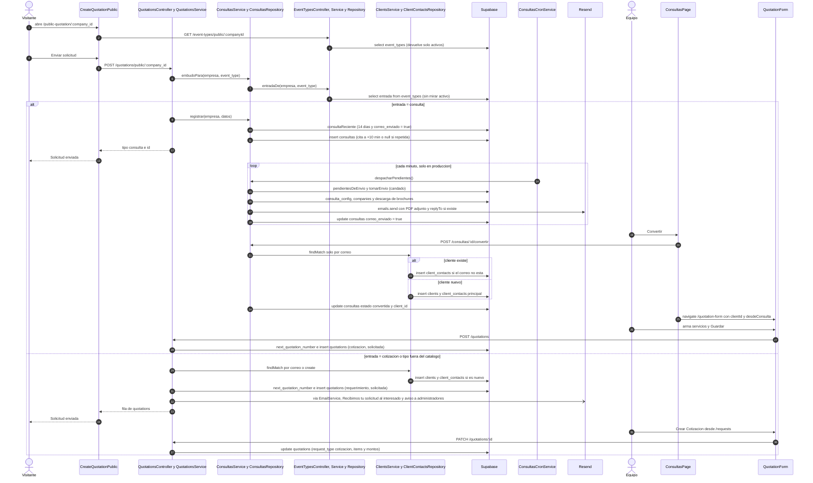

# Flujo: De la consulta en el formulario público a cotización
> **Estado: verificado una vez contra el código** (commit 0de0ddb, 11-09-2026). Falta la etapa de completar lo que no quedó escrito.

> Verificado contra el código en el commit 0de0ddb el 11-09-2026, con una segunda pasada escéptica el mismo día. Parte del atlas: el índice de flujos va en `00_INDICE_DE_FLUJOS.md` (esta misma carpeta) y el mapa del sistema en `../00_MAPA_DEL_SISTEMA.md`. Al verificar, ninguno de los dos existía todavía.

Documentos que mandan sobre este flujo: `docs/arquitectura/12_MODULO_DE_CONSULTAS.md` (el embudo) y, desde que la cotización existe, `docs/arquitectura/13_ENVIO_DE_COTIZACIONES.md`.

## 1. En palabras simples

Un interesado llena el formulario público de la empresa (el link de la página web). Lo que pasa después lo decide **el tipo de evento que eligió**: en el catálogo, cada tipo está marcado como 'Cotización' o como 'Consulta'.

- **Tipo 'Cotización'** (la entrada de siempre): el sistema reconoce al cliente por su correo o lo crea, deja un **requerimiento** en estado 'Solicitada', le manda al interesado un "Recibimos tu solicitud" y avisa por correo a los administradores.
- **Tipo 'Consulta'** (el embudo de matrimonios, paseos de curso y graduaciones): **no** se crea cliente ni cotización. Queda una consulta liviana y, **10 minutos después**, el reloj del motor le manda el brochure con la marca de la empresa. Si ese mismo correo ya lo recibió para ese tipo en los últimos **14 días**, no se le repite. No hay aviso interno: el equipo la ve en la bandeja **Consultas**.
- Cuando el interesado contesta (eso se ve en Outlook; el sistema no lee el buzón), alguien aprieta **Convertir**. El cliente nace o se reconoce por correo, la persona queda como contacto y se abre el cotizador con el tipo, la fecha, las personas y el contacto ya puestos. La cotización nace recién al guardar, en 'Solicitada'.

## 2. El recorrido paso a paso

### Paso 0. Preparar el embudo (una vez, antes de que llegue nadie)

1. **Quién:** una persona con sesión en `/consultas`, que aprieta el botón "Tipos de evento". Archivo: `frontend/src/pages/consultas/ConsultasPage.tsx`, componentes `ConfiguracionDelEmbudo` y `FilaDeTipo`. Puede hacerlo cualquier cargo que vea Consultas, **recepción incluida**: la ruta pide `SECTION_ROLES.quotations` y ni `EventTypesController`, ni `ConsultasController`, ni `StorageController` tienen `@Roles` (`RolesGuard` deja pasar las rutas sin `@Roles` con solo tener sesión).
2. **Crear un tipo:** `createEventType` (`frontend/src/services/eventTypes.service.ts`) → `POST /event-types` (`CrearTipoDeEventoDto`: `name` de hasta 80 caracteres) → `EventTypesController.crear` → `EventTypesService.crear`, que recorta el nombre y responde 400 "El tipo necesita un nombre" si queda vacío → `EventTypesRepository.crear`. Inserta en `event_types` (`company_id`, `name`); `entrada` nace en 'cotizacion', `activo` en true y `sort_order` queda nulo (migración 105). Si el nombre ya existe (error 23505), responde 400 "Ese tipo de evento ya existe".
3. **Elegir la entrada o inactivar:** `actualizarEventType` → `PATCH /event-types/:id` (`ActualizarTipoDto`) → `EventTypesService.actualizar` → `EventTypesRepository.actualizar`. Hace UPDATE de `event_types.entrada` ('cotizacion' o 'consulta') o de `event_types.activo`. Responde 400 "Nada que cambiar" si no viene ninguno de los dos y 404 si el tipo no es de la empresa.
4. **Eliminar:** `deleteEventType` → `DELETE /event-types/:id` → `EventTypesService.eliminar`. Primero `EventTypesRepository.porId` (404 si no existe); luego `EventTypesRepository.usosDe` cuenta las filas de `quotations` y `consultas` que tienen ese nombre en `event_type`. Si hay alguna, responde 400 y el tipo solo se puede inactivar; si no, `EventTypesRepository.eliminar` hace el DELETE.
5. **Subir el brochure:** `PanelDeCorreo.subirArchivo` (`frontend/src/pages/consultas/PanelDeCorreo.tsx`; la pantalla exige `application/pdf`) → `uploadConsultaBrochure` → `subir` (`frontend/src/services/storage.service.ts`, que además pasa `validateImageFile`: imagen o PDF de hasta 5 MB) → `POST /storage/upload` con `kind: 'consulta-brochure'` y `category` = nombre del tipo → `StorageController.upload` → `StorageService.upload`. Solo acepta imágenes o PDF (`MIMES`), de hasta 5 MB (`MAX_BYTES`). Lo guarda en el balde privado `payment-receipts` (`BUCKET_PRIVADO`), en la ruta `c{empresa}/consulta-brochures/{tipo}/{sello}_{archivo}`, con el tipo y el nombre del archivo pasados por `sanitize` (sin tildes y con todo lo que no sea letra, número, punto, guion o guion bajo cambiado por `_`) y el sello de `stamp()`. Como el balde es privado, devuelve esa **ruta** como `url`.
6. **Guardar la configuración:** `guardarConfigDeConsulta` → `PUT /consultas/config/:eventType` (`GuardarConfigDto`: `texto` de hasta 4000 caracteres y `brochures` validados con `BrochureDto`) → `ConsultasController.guardarConfig` → `ConsultasService.guardarConfig`. Acepta como máximo 2 brochures y aplica el candado de dueño: cada `path` debe empezar con `c{empresa}/`. Luego `ConsultasRepository.guardarConfig` hace upsert en `consulta_config` (`company_id`, `event_type`, `texto`, `brochures`) con `onConflict: 'company_id,event_type'`.
7. **Cachés:** `onCambio` invalida `['consultas','config']`. Crear, actualizar o eliminar tipos invalida `['eventTypes']`; como es un prefijo, alcanza también a `['eventTypes','admin']` y a `eventTypesQueryOptions` del cotizador. Guardar el texto cierra el panel (Felipe, 06-09); subir o quitar un PDF no lo cierra.

### Paso 1. El visitante abre el formulario

1. **Quién:** una persona externa, sin sesión. Ruta pública `/public-quotation/:company_id` (`frontend/src/App.tsx`) → componente `CreateQuotationPublic` (`frontend/src/pages/quotations/CreateQuotationPublic.tsx`).
2. **Qué carga al montar (`useEffect`):**
   - `getCompanyPublic` → `GET /companies/public/:id` (`CompaniesController.findOnePublic`, `@Public`): marca, banner y sitio web.
   - `getClientTypesPublic` → `GET /clients/types/public/:company_id`.
   - `getEventTypesPublic` → `GET /event-types/public/:companyId` (`@Public`, `@Throttle` de 30 por minuto) → `EventTypesService.listarPublico` → `EventTypesRepository.listarPublico`, que devuelve solo los tipos **activos** y solo su `name`, en el orden de `sort_order` y nombre.
3. **Respaldo:** si esas lecturas fallan, usa `CLIENT_TYPES` y `Object.values(EventType)` (los 8 tipos históricos del enum). El valor inicial del tipo de evento es `EventType.ALMUERZO_O_CENA`.
4. No escribe en la base. No usa React Query: son `useState` y `useEffect`.

### Paso 2. Completa y envía

1. `handleSubmit` valida, en este orden:
   - primero la organización (`company_name`): es obligatoria si el tipo de cliente no contiene "particular" (comparado sin tildes y en minúsculas). Si falta, muestra "Cuéntanos por quién cotizas" y corta ahí. La etiqueta del campo cambia según palabras clave del tipo: colegio o universidad, tour, iglesia, empresa o convenio; si no calza ninguna, dice "Nombre de la organización";
   - nombre obligatorio;
   - correo con formato válido;
   - teléfono pasado por `normalizePhone` (`utils/phone`), que debe quedar como `+56` seguido de 9 dígitos.
2. Arma el cuerpo con todo el formulario, más:
   - `phone` ya normalizado;
   - `people_count` = adultos + niños (convención del Cotizador 2.0: `children_count` es parte del total);
   - `children_count`;
   - `company_name`, solo si se pidió;
   - `budget_estimate`, si se escribió.
3. `createQuotationPublic` (`frontend/src/services/quotations.service.ts`) → `apiRequest` → `POST /quotations/public/:company_id`.
4. Sea cual sea la rama, la pantalla muestra lo mismo: "¡Solicitud enviada!". Si falla, muestra un error honesto con "Reintentar envío" (arreglo del 22-07: antes mostraba éxito aunque fallara). Mientras envía, el botón queda deshabilitado (`loading`).

### Paso 3. La puerta del motor bifurca

1. **Controlador:** `QuotationsController.createPublic` (`api-rest/src/quotations/quotations.controller.ts`), con `@Public()` y `@Throttle` de 10 por minuto. `AuthGuard` y `RolesGuard` lo dejan pasar por ser `@Public`; `ThrottlerGuard` corre igual (techo general de 300 por minuto por IP en `app.module.ts`, que esta ruta baja a 10).
2. **Validación:** el `ValidationPipe` global (`whitelist`, `forbidNonWhitelisted`, `transform`) valida `CreateQuotationPublicDto`:
   - `email` (`@IsEmail`, obligatorio) y `phone` (obligatorio);
   - `name` y `client_type`, obligatorios (heredados de `CreateClientDto`);
   - `event_type`, obligatorio, como texto libre y no enum (comentario en `create-quotation.dto.ts`);
   - `event_date` (`@IsDateString`, obligatorio);
   - `people_count` de al menos 1;
   - `company_name` (hasta 160 caracteres) y `budget_estimate` (de 0 hacia arriba), ambos opcionales.
3. **Ojo con `company_id`:** llega desde la URL **sin pipe**. En ejecución es texto; así lo advierte el comentario de `EmailService.sendEmail`.
4. **`QuotationsService.createPublic`:**
   - Si viene `budget_estimate`, antepone "Presupuesto estimado: $N" a `observations`. Modifica el mismo DTO, así que ambas ramas lo heredan.
   - `ConsultasService.embudoPara(company_id, event_type)` → `EventTypesService.entradaDe` → `EventTypesRepository.entradaDe` lee `event_types.entrada` por `company_id` y `name`, **sin mirar `activo`**. Devuelve true solo si la entrada es 'consulta'. Un tipo que no está en el catálogo da `null` y sigue por la rama cotización.

### Rama A. El tipo entra como CONSULTA

#### Paso A1. Registrar la consulta (en la misma petición)

1. `ConsultasService.registrar(company_id, datos)` (`api-rest/src/consultas/consultas.service.ts`).
2. `ConsultasRepository.consultaReciente` busca en `consultas` una fila que cumpla todo esto:
   - misma empresa y mismo `event_type`;
   - `correo_enviado = true`;
   - `email` ILIKE el correo, con los comodines `%` y `_` escapados;
   - `created_at` dentro de 14 días (`DIAS_SIN_REPETIR`).
3. `ConsultasRepository.crear` hace INSERT en `consultas` con:
   - los datos del interesado: `company_id`, `name`, `email` (recortado), `phone`, `client_type`, `company_name` (recortado, o `null`);
   - los del evento: `event_type`, `event_date`, `people_count`, `children_count`, `observations`;
   - `estado = 'respondida'` y `correo_enviado = false`;
   - `correo_programado_para` = ahora + 10 minutos (`RETRASO_DEL_CORREO_MS`), o `null` si la consulta es repetida;
   - `client_id = null`.
4. Responde `{ tipo: 'consulta', id }`.
5. **Efectos:** en este momento no sale ningún correo. No hay confirmación "Recibimos tu solicitud", no hay aviso interno y no se crea cliente ni cotización. Si es repetida, solo queda anotado en el log.

#### Paso A2. El reloj despacha el brochure

1. **Quién:** `ConsultasCronService.despachar` (`api-rest/src/consultas/consultas-cron.service.ts`), con `@Cron(CronExpression.EVERY_MINUTE)`. Solo corre si `NODE_ENV === 'production'` (`ScheduleModule.forRoot({ cronJobs: ... })` en `api-rest/src/app.module.ts`).
2. `ConsultasService.despacharPendientes`:
   1. `ConsultasRepository.pendientesDeEnvio(ahora)` busca, en todas las empresas, filas de `consultas` con `correo_enviado = false`, `correo_programado_para` no nulo y menor o igual a ahora, y `created_at` de las últimas 24 horas. Toma como máximo 20 por vuelta, sin orden fijo.
   2. Por cada una, `ConsultasRepository.tomarEnvio(id, company_id)` hace UPDATE de `correo_programado_para = null`, solo si todavía no era nulo. Ese es el candado atómico: si otro reloj ya la tomó, la salta.
   3. `ConsultasRepository.config(company_id, event_type)` vuelve a leer `consulta_config`. Si en esos 10 minutos cambió el brochure, sale el nuevo.
   4. `enviarBrochure`:
      - `CompaniesRepository.findOne` (`companies`, `select('*')`) → `marcaDesdeFila` (`api-rest/src/marketing/marca.ts`); si la empresa no aparece, usa la marca mínima ('Eventia');
      - se quedan solo los brochures cuyo `path` empieza con `c{empresa}/`, y `ConsultasRepository.descargarBrochure` los baja del balde `payment-receipts`;
      - el texto es `consulta_config.texto` o, si no hay, `TEXTO_DE_LA_CASA`; `{nombre}` se reemplaza por el primer nombre y cada párrafo pasa por `escaparHtml`;
      - el HTML se arma con `plantillaCampana` (`api-rest/src/marketing/plantilla.ts`), sin `bajaUrl` (no hay línea de baja) y sin `cotizarUrl` (no hay botón de cotizar).
   5. Envío por **Resend directo** (`new Resend(RESEND_API_KEY)`, sin pasar por `EmailService`):
      - `from`: `{empresa} <hola@eventi-app.com>`;
      - `to`: el correo de la consulta;
      - asunto: `{empresa}: valores para tu {tipo en lenguaje natural}`;
      - los PDF van adjuntos en base64;
      - `replyTo` **solo si** la empresa tiene `notifications.replyTo`.
   6. Si Resend responde bien, `ConsultasRepository.actualizar` pone `consultas.correo_enviado = true`.
   7. Si algo falla (la relectura de la config, la marca, el storage, Resend o el propio `actualizar`), el error queda en el log. La consulta queda con `correo_programado_para = null` y, salvo que el correo ya hubiera salido, con `correo_enviado = false`. No se reintenta.

#### Paso A3. El equipo mira la bandeja

1. **Quién:** cualquier cargo con la sección `quotations`: recepción, vendedor, operaciones y administrador (`frontend/src/constants/permissions.ts`). Entra por `Sidebar` → "Consultas" → ruta `/consultas`, protegida con `PermissionGuard allowedRoles={SECTION_ROLES.quotations}`.
2. **Lecturas:**
   - `useQuery(['consultas'])` → `getConsultas` → `GET /consultas` → `ConsultasController.listar` → `ConsultasService.listar` → `ConsultasRepository.listar`: las 500 más nuevas de la empresa.
   - `useQuery(['consultas','config'])` → `getConfigsDeConsulta` → `GET /consultas/config` → `ConsultasService.configs`.
3. **Filtros:** chips Todas, Respondidas, Convertidas y Descartadas (por `estado`) y búsqueda con `matchesSearch` por nombre, correo, teléfono y tipo.
4. **Chips de estado** (`chipEstado`, `textoEstado`; el estado de la consulta manda sobre el del correo):

   | Chip | Cuándo |
   |---|---|
   | "Convertida" (azul) | `estado = 'convertida'` |
   | "Descartada" (gris) | `estado = 'descartada'` |
   | "Sale a las HH:MM" (azul, hora de Chile) | `correo_enviado = false` y `correo_programado_para` con hora |
   | "Sin brochure" (ámbar) | `correo_enviado = false` y sin cita: el envío falló o la consulta era repetida. Se ven iguales y hasta el tooltip es el mismo |
   | "Respondida" (verde) | `correo_enviado = true` |

5. Es solo lectura: no escribe nada.

#### Paso A4. El interesado contesta (fuera del sistema)

El texto de la casa (`TEXTO_DE_LA_CASA`) invita a "respóndenos este mismo correo"; un texto propio del tipo puede no hacerlo. La respuesta llega al `replyTo` de la empresa si existe; si no, a `hola@eventi-app.com`. Una persona la lee en Outlook. Es una decisión explícita del doc 12: el sistema no lee el buzón.

#### Paso A5. Convertir (o descartar)

1. **Quién:** una persona en la bandeja aprieta "Convertir" → confirma en `ConfirmInline` → `convertir.mutate(id)` → `convertirConsulta` → `POST /consultas/:id/convertir` → `ConsultasController.convertir`. No tiene `@Roles`, así que basta con tener sesión.
2. `ConsultasService.convertir(+id, company_id)`:
   1. `ConsultasRepository.una`; si la consulta no existe, responde 404.
   2. Si ya está 'convertida' y tiene `client_id`, devuelve lo mismo sin tocar nada (idempotente).
   3. `ClientsService.findMatch(empresa, email, undefined)` → `ClientsRepository.findMatch` compara el correo (en minúsculas y sin espacios) con `clients.email` de toda la empresa y, si no encuentra, con `client_contacts.email`. **El teléfono no participa**, porque se pasa `undefined`.
   4. **Si el cliente ya existe:** `ClientContactsRepository.findByClient`. Si ningún contacto tiene ese correo, `ClientContactsRepository.create` hace INSERT en `client_contacts` (`client_id`, `name`, `email`, `phone`, `is_primary = false`, `company_id`, `portal_token` aleatorio). Es mejor esfuerzo: si falla, solo queda en el log.
   5. **Si el cliente es nuevo:** `ClientsService.create({ name: company_name || name, contact_person: name, email, phone, client_type: client_type ?? 'Particulares' })` → `ClientsRepository.create` hace INSERT en `clients`. Luego viene la "garantía de nacimiento": `ClientContactsRepository.create` inserta la persona principal en `client_contacts` con `is_primary = true` (también mejor esfuerzo).
   6. `ConsultasRepository.actualizar` pone `consultas.estado = 'convertida'` y `consultas.client_id`.
   7. Responde `{ consulta, client_id, contact_name }`.
3. **Pantalla (`onSuccess`):** muestra un toast, invalida `['consultas']` y `['clients']`, y navega a `/quotation-form` con `state.clientId` y `state.desdeConsulta` (`event_type`, `event_date`, `people_count`, `children_count`, `contact_name`).
4. **Descartar:** el basurero solo aparece si `estado = 'respondida'` → confirma en `ConfirmInline` → `descartarConsulta` → `POST /consultas/:id/descartar` → `ConsultasService.descartar`. Responde 404 si la consulta no existe y 400 si ya está convertida; si no, hace UPDATE de `consultas.estado = 'descartada'`.

#### Paso A6. El cotizador precargado y el guardado

1. **Ruta:** `/quotation-form`, con `PermissionGuard allowedRoles={SECTION_ROLES.quotations_edit}`. Entran vendedor, operaciones y administrador; **recepción no** (ve "Permisos Insuficientes").
2. **`QuotationForm`** (`frontend/src/pages/quotations/QuotationForm.tsx`):
   - lee `useQuery(clientsQueryOptions)` (caché `['clients']`);
   - un efecto pone `client_id = navClientId` cuando la lista de clientes ya cargó;
   - el efecto de montaje de `desdeConsulta` completa el tipo, la fecha (`slice(0,10)`), las personas y los niños (con `!= null`, revisión 06-09) y el `contact_name`;
   - el formulario parte con `quotation_status = 'solicitada'` y `request_type = 'cotizacion'`;
   - `getClientContacts` carga los contactos del cliente.
3. **Guardar:** el vendedor arma los servicios y guarda → `createQuotation` → `POST /quotations` → `QuotationsController.create` (recepción solo puede crear requerimientos) → `QuotationsService.create(dto, empresa, user.id)`:
   - `assertMoneyMatches` rehace los totales desde los ítems (`api-rest/src/quotations/utils/money.ts`) y rechaza el guardado si no calzan al peso;
   - `QuotationsRepository.nextQuotationNumber` llama a la función `next_quotation_number` (tabla `company_quotation_counters`, migración 38);
   - `getEventDateUtc` deja la fecha en medianoche UTC;
   - `QuotationsRepository.resolveContactId(client_id, contact_name)` busca en `client_contacts` de ese cliente un nombre idéntico (recortado y sin distinguir mayúsculas);
   - `QuotationsRepository.create` hace INSERT en `quotations` (detalle en la sección 4).
4. **Pantalla:** toast "Cotización guardada.", `olvidarFiltrosTablero` y `volver()`, que hace `navigate(-1)` (en este recorrido, de vuelta a la bandeja) o, si no hay historia propia, lleva a `/quotations`. El estado queda tal como estaba en el formulario, porque `estadoAlGuardar` (`frontend/src/utils/estadoCotizacion.ts`) lo devuelve sin cambios.
5. **Efectos:**
   - no sale ningún correo;
   - `PanelInvalidationInterceptor` borra de memoria el panel de análisis de la empresa;
   - la consulta **no** guarda el id de la cotización.
6. De aquí en adelante sigue el envío por correo (doc 13).

### Rama B. El tipo entra como COTIZACIÓN (o no está en el catálogo)

#### Paso B1. El cliente, por correo

1. `ClientsService.findMatch(company_id, email, undefined)`, con el mismo algoritmo del paso A5.
2. **Sin match:** `ClientsService.create({ client_type, email, name: company_name || name, contact_person: name, phone })` hace INSERT en `clients` y luego en `client_contacts` (persona principal, con `portal_token`).
3. **Con match:** usa ese cliente y **no** agrega a la persona como contacto. Esto es distinto de `convertir`, que sí la agrega.

#### Paso B2. El requerimiento

1. Arma un `CreateQuotationDto` con:
   - `client_id`, `event_type`, `people_count`, `children_count` (o 0) y `event_date`;
   - `contact_name` = el nombre de quien llenó el formulario;
   - `observations` = `[Desde formulario publico] --- ` seguido de las observaciones;
   - `quotation_status = 'solicitada'` y `request_type = 'requerimiento'`.
2. `QuotationsService.create(dto, company_id, undefined)` sigue el mismo camino que en A6, pero sin ítems ni montos (`hasMoneyToVerify` da falso) y con `user_id` vacío → INSERT en `quotations`.

#### Paso B3. Correos inmediatos

Van dentro de un `try` que solo atrapa los errores de buscar el token y los administradores; los envíos se lanzan sin esperar la respuesta (`void`), y `sendEmail` anota en el log por su cuenta cuando Resend devuelve error:

1. `QuotationsRepository.findContactPortalToken(client_contact_id)` devuelve `null` si no quedó contacto vinculado.
2. **Al interesado:** `EmailService.sendEmail(email, NEW_PUBLIC_QUOTATION_CLIENT, company_id, undefined, portalToken)`. Asunto "Recibimos tu solicitud — {empresa}", armado en `sendEmail` (el texto de `EMAIL_SUBJECTS` para este correo no se usa). Remitente `{empresa} <hola@eventi-app.com>` y `replyTo` de la empresa si existe. Usa `newPublicQuotationClientTemplate` con la marca (`getBranding`) y agrega el botón del portal solo si hay token y `FRONTEND_URL`.
3. **A los administradores:** `UsersService.findAll(company_id, ADMINISTRADOR)` → `EmailService.sendEmail(correos, NEW_PUBLIC_QUOTATION_ADMIN, company_id, {clientName, peopleCount, eventType, eventDate, phone, email, observations, organizacion, presupuesto})`. Asunto "Solicitud de cotización recibida desde link público"; remitente `EMAIL_FROM` (`Eventia <hola@eventi-app.com>`), sin `replyTo`. Usa `newPublicQuotationAdminTemplate` (título "Nueva solicitud de cotización"), con el botón "Ver la solicitud" fijo a `https://www.eventi-app.com/requests`.
4. Responde la fila de `quotations`, y la pantalla muestra "¡Solicitud enviada!".

#### Paso B4. El equipo lo ve y lo convierte en cotización

1. **Dónde aparece:**
   - `RequestsPage` (`/requests`): `useQuery(['requirements'])` → `getQuotations(REQUERIMIENTO, [SOLICITADA])` → `GET /quotations` → `QuotationsService.findAll` → `QuotationsRepository.findAll`. `QuotationsPage` comparte esa misma caché (misma clave y misma consulta).
   - La fila HOY del Dashboard, solo para administrador: `getHoyAlerts` → `GET /analytics/hoy` (`HoyController`, `@Roles(ADMIN_ONLY)`, en `api-rest/src/analytics/hoy.controller.ts`) → `HoyRepository.alerts`. No lista los requerimientos: devuelve cuántos hay en 'solicitada' y los días del más antiguo.
2. **Crear la cotización:** el botón "Crear Cotización" solo aparece con `quotations_edit` → `/quotation-form/:id` → `QuotationForm` la carga con `getQuotationById` y, como `request_type = 'requerimiento'`, marca `isFromRequirement = true`.
3. **Guardar:** el formulario manda `request_type = 'cotizacion'` porque `isFromRequirement` está encendido, y el estado sin cambios (`estadoAlGuardar`) → `updateQuotation` → `PATCH /quotations/:id` → `QuotationsService.update(id, dto, empresa, rol)`:
   - aplica el candado de evento realizado y la regla de que recepción no toca cotizaciones;
   - corre `assertMoneyMatches` y la guardia de estados;
   - si viene `contact_name`, `resolveContactId` vuelve a vincular `client_contact_id`;
   - `QUOTATION_IS_SENT` y `sent_at` solo se disparan si el estado pasa a 'enviada', y desde el cotizador no pasa;
   - hace UPDATE de `quotations` con `request_type = 'cotizacion'`, los ítems y los montos.
4. **Pantalla:** toast y `volver()`.

## 3. Diagrama

## 4. Datos que cambian

| tabla | columnas | en qué paso | quién escribe |
|---|---|---|---|
| `event_types` | INSERT `company_id`, `name` (`entrada` = 'cotizacion' y `activo` = true por defecto); UPDATE `entrada` o `activo`; DELETE si no tiene uso | 0 (se lee en 1 y 3) | `EventTypesRepository.crear` / `actualizar` / `eliminar`, vía `/event-types`, desde la pestaña Tipos de evento |
| Balde de storage `payment-receipts` | archivo `c{empresa}/consulta-brochures/{tipo}/{sello}_{archivo}` (tipo y archivo saneados) | 0 (se descarga en A2) | `StorageService.upload`, vía `POST /storage/upload` |
| `consulta_config` | upsert de `texto` y `brochures` (jsonb `[{nombre, path, bytes}]`) por `(company_id, event_type)` | 0 (se relee en A2) | `ConsultasRepository.guardarConfig`, vía `PUT /consultas/config/:eventType` |
| `consultas` | INSERT de todas las columnas: `estado = 'respondida'`, `correo_enviado = false`, `correo_programado_para` (+10 min o `null`), `client_id = null` | A1 | `ConsultasRepository.crear` (puerta pública, sin sesión) |
| `consultas` | `correo_programado_para = null` | A2 | `ConsultasRepository.tomarEnvio` (reloj) |
| `consultas` | `correo_enviado = true` | A2, solo si Resend respondió bien | `ConsultasRepository.actualizar` (reloj) |
| `consultas` | `estado = 'convertida'` y `client_id` | A5 | `ConsultasRepository.actualizar`, desde `ConsultasService.convertir` |
| `consultas` | `estado = 'descartada'` | A5 (descartar) | `ConsultasRepository.actualizar`, desde `ConsultasService.descartar` |
| `clients` | INSERT `name` (organización o persona), `email`, `phone`, `client_type`, `contact_person`, `company_id` | A5 (cliente nuevo) y B1 (sin match) | `ClientsRepository.create`, vía `ClientsService.create` |
| `client_contacts` | INSERT `client_id`, `name`, `email`, `phone`, `is_primary = true`, `company_id`, `portal_token` | A5 (cliente nuevo) y B1 (sin match) | `ClientContactsRepository.create`, dentro de `ClientsService.create` (garantía de nacimiento) |
| `client_contacts` | INSERT con `is_primary = false` | A5 (cliente existente sin ese correo) | `ClientContactsRepository.create`, desde `ConsultasService.convertir` |
| `company_quotation_counters` | upsert de `last_number`: si la empresa no tiene fila, la crea con el máximo real + 1; si la tiene, la actualiza a `GREATEST(last_number, máximo real) + 1`, bloqueando la fila | A6 y B2 | función `next_quotation_number` (migración 38), vía `QuotationsRepository.nextQuotationNumber` |
| `quotations` | INSERT `client_id`, `event_type`, `people_count`, `children_count`, `contact_name`, `client_contact_id`, `observations` ("[Desde formulario publico] --- …"), `event_date` (UTC), `event_end_date = null`, `company_id`, `quotation_number`, `quotation_status = 'solicitada'`, `request_type = 'requerimiento'`, montos en 0, `tip_percentage = null`, `requires_invoice` y `has_contract` en false, `items` vacío, `payment_plan_type` por defecto, `user_id` vacío | B2 | `QuotationsRepository.create` (puerta pública) |
| `quotations` | INSERT con `items`, montos verificados, `tip_*`, `discount_*`, `contact_name`, `client_contact_id`, `event_end_date`, `request_type = 'cotizacion'`, `quotation_status = 'solicitada'`, `user_id` | A6 | `QuotationsRepository.create`, vía `POST /quotations` |
| `quotations` | UPDATE `request_type = 'cotizacion'`, ítems, montos, datos del evento y `client_contact_id` (si viene `contact_name`) | B4 | `QuotationsRepository.update`, vía `PATCH /quotations/:id` |

## 5. Efectos automáticos y colaterales

### Correos

| Correo | Cuándo | A quién | Pieza | Detalles que importan |
|---|---|---|---|---|
| Brochure del embudo | A2, 10 minutos o un poco más después (en la vuelta del reloj que sigue a la cita) | interesado | `ConsultasService.enviarBrochure`, Resend directo | `from` `{empresa} <hola@eventi-app.com>`; `replyTo` solo si la empresa tiene `notifications.replyTo`; **sin copia oculta** al buzón de la empresa (el envío de cotizaciones del doc 13 sí la tiene); no pasa por `EmailService` |
| "Recibimos tu solicitud" | B3, al instante | interesado | `EmailService.sendEmail(NEW_PUBLIC_QUOTATION_CLIENT)` | asunto "Recibimos tu solicitud — {empresa}"; `from` con el nombre de la empresa y `replyTo` de la empresa si existe; botón del portal solo si quedó `client_contact_id` y hay `FRONTEND_URL`. `shouldSendEmail` solo se consulta cuando la 4.ª posición (`companyId`) es número; en esta llamada la empresa va en la 3.ª, así que según el código **el interruptor por empresa no se consulta** |
| Aviso interno | B3, al instante | todos los administradores de la empresa | `EmailService.sendEmail(NEW_PUBLIC_QUOTATION_ADMIN)` | asunto "Solicitud de cotización recibida desde link público" y título "Nueva solicitud de cotización"; `from` `Eventia <hola@eventi-app.com>`; botón fijo a `https://www.eventi-app.com/requests` |

- **En la rama consulta no hay aviso interno ni confirmación inmediata.** El único correo es el brochure.
- Convertir y guardar en el cotizador **no mandan correos**.
- Silenciador del laboratorio: `EMAILS_SILENCED=1` apaga todo lo que sale por `EmailService.sendEmail` (los correos de B3), pero **no apaga el brochure**, porque ese sale por Resend directo (grep de `EMAILS_SILENCED`: solo aparece en `email.service.ts`).

### Relojes

- `ConsultasCronService.despachar`: cada minuto, solo en producción.
- `QuotationsCronService.sendWeeklyDigest` (`@Cron('0 11 * * 1')`: lunes a las 11:00 según el reloj del servidor, porque el decorador no fija zona) cuenta en `pipeline.solicitadas` todas las filas en 'solicitada', sin filtrar `request_type`. Por eso el requerimiento de B2 y la cotización de A6 aparecen en el resumen semanal de los administradores.
- `QuotationsCronService.sendQuotationFollowUps` (diario, seguimiento de 7 y 14 días) **no** las toca mientras no pasen a 'enviada': `findFollowUps` solo busca cotizaciones enviadas.
- Las consultas no entran a analytics ni al pipeline (doc 12, "Lo que a propósito NO hace").

### Cascadas en código (no hay triggers en la base)

- `ClientsService.create` intenta crear siempre la persona principal (garantía de nacimiento del 31-07, mejor esfuerzo).
- `ClientContactsRepository.create` le da a todo contacto su `portal_token` (migración 48).
- En `docs/migrations`, los `CREATE TRIGGER` solo aparecen sobre `people` y `event_staff`; no hay triggers sobre `consultas`, `clients`, `client_contacts` ni `quotations`.

### Cachés del motor

- `PanelInvalidationInterceptor` (`api-rest/src/cache/panel-invalidation.interceptor.ts`) borra el `cachePanel` de la empresa en cada petición que no sea GET (POST, PUT, PATCH o DELETE) **con sesión** y que termine bien. Por eso también lo borran `PUT /consultas/config`, `POST /storage/upload` y convertir.
- La puerta pública no trae `req.user`, así que **el requerimiento de la rama B no invalida el panel**. El Dashboard puede mostrar números viejos hasta 1 hora (`cachePanel.set(..., HORA_MS)` en `AnalyticsService`) o hasta la próxima escritura con sesión de esa empresa. El comentario de `cache/memoria.ts` ("nunca se ven números viejos") no contempla este caso.
- En A6 y B4 sí se invalida, porque son escrituras con sesión.

### Cachés de la app (React Query, `frontend/src/lib/queryClient.ts`: `staleTime` 30 s, `refetchOnWindowFocus`, `gcTime` 30 min)

- `['consultas']`: no se consulta sola cada cierto tiempo. El chip "Sale a las HH:MM" **no cambia solo** a "Respondida"; se actualiza al volver a la pestaña o al entrar de nuevo pasados 30 segundos. Las consultas nuevas tampoco aparecen hasta ese refresco.
- `['consultas','config']`: la invalida `PanelDeCorreo` (`onCambio`) y también `refrescar()` de la bandeja (por el prefijo `['consultas']`).
- `['eventTypes']` y `['eventTypes','admin']`: se invalidan al crear, actualizar o eliminar tipos. El formulario público no usa caché y lee el catálogo en cada carga.
- `['clients']`: se invalida al convertir. El comentario explica que sin eso el selector del cotizador buscaba en una lista vieja y quedaba vacío.
- `['requirements']` (en `RequestsPage` y `QuotationsPage`): el requerimiento de la rama B aparece cuando esa caché se revalida; no hay aviso en vivo.
- `['dashboard-hoy', empresa]`: la fila HOY del Dashboard. `HoyRepository` lee Supabase directo y no usa `cachePanel`, así que el conteo de requerimientos de la rama B aparece apenas esta caché de la app se revalida.
- `['quotations', …]`: **crear** desde el cotizador no la invalida; el tablero se entera por `staleTime` o por foco. `olvidarFiltrosTablero` limpia los filtros para que la tarjeta nueva no quede escondida.
- Al cerrar sesión, `queryClient.clear()` (`AuthContext.signOut`).

## 6. Reglas de negocio que gobiernan el flujo

1. **Separar la consulta de la cotización.** Doc 12, Felipe, 05-09-2026: las cotizaciones de matrimonio, paseo de curso y graduación *"entran por cientos, enviamos la cotización tipo y solo algunos contestan"*. Cada curioso quedaba como cotización.
2. **La entrada la decide el tipo de evento, no el brochure.** Doc 12, punto 1 (segunda vuelta de Felipe, 05-09): *"ahí mismo se puede marcar como cotización o consulta como una categoría"*. Código: `ConsultasService.embudoPara` → `event_types.entrada`.
   - **Contradicción entre comentarios y código:** siguen diciendo que el embudo lo activa tener brochure el JSDoc de `ConsultasController`, la cabecera de `consultas.service.ts` (que en cambio ya habla de los 10 minutos), el comentario del embudo en `QuotationsService.createPublic` y el texto de la bandeja vacía en `ConsultasPage` ("Llegarán solas cuando un tipo de evento tenga brochure configurado"). Y dicen que el brochure sale "al tiro" el comentario de `createPublic`, la cabecera de `ConsultasPage` y la explicación de `ConfiguracionDelEmbudo` ("recibe el correo con brochure al tiro"). El código y el doc 12 dicen categoría y 10 minutos.
3. **Tipo de CLIENTE y tipo de EVENTO son ejes separados;** el embudo solo mira el tipo de evento. Evidencia: doc 12 y el comentario de `EventTypesService`.
4. **Un tipo que no está en el catálogo entra como cotización.** Evidencia: comentario de `EventTypesRepository.entradaDe` ("tipo histórico").
5. **La respuesta automática espera 10 minutos.** Felipe, 05-09: *"un delay de 10 min para las respuestas automáticas"*; una respuesta instantánea delata al robot. Evidencia: migración 106 y `RETRASO_DEL_CORREO_MS`. El reloj es del motor porque Resend no programa correos con adjuntos (`consultas-cron.service.ts`).
6. **La configuración se relee al enviar.** Evidencia: doc 12 y `despacharPendientes`.
7. **Nunca reintentos infinitos.** Si el envío falla, queda a la vista como no enviada y el reloj solo mira las últimas 24 horas. Evidencia: doc 12, `pendientesDeEnvio` y `tomarEnvio`.
8. **Regla de una vez (14 días).** Evidencia: doc 12, punto 4, y `DIAS_SIN_REPETIR`. Matiz del código: solo cuentan los envíos que **salieron** (`correo_enviado = true`) y la ventana se mide por `created_at` de la consulta anterior.
9. **Máximo 2 brochures por tipo, y siempre de la empresa.** Evidencia: `guardarConfig` (revisión 06-09: "el balde es COMPARTIDO entre empresas") y un segundo cinturón en `enviarBrochure`.
10. **Un tipo en uso no se elimina, se inactiva; renombrar no existe en v1** (el histórico guarda el texto). Evidencia: doc 12, `EventTypesService.eliminar` y migración 105.
11. **Un tipo de cliente usado por consultas no se puede eliminar,** porque al convertir nacerían clientes con un tipo huérfano. Evidencia: `ClientsRepository.removeType` (comentario del 05-09).
12. **"Tus datos" son SIEMPRE la persona de contacto; el CLIENTE es la organización si la hay.** Evidencia: doc 12, sección "La persona y el cliente"; `createPublic` y `convertir` usan `company_name || name`.
13. **Anti-duplicados SOLO por correo.** Felipe, 05-09: la gente cambia de empresa o colegio y conserva su número. Evidencia: `createPublic` (comentario "Anti-duplicados (22-07, afinado 05-09)") y `convertir` pasan `undefined` como teléfono. `ClientsRepository.findMatch` todavía sabe comparar teléfonos, pero esta puerta no lo usa.
14. **Convertir es un clic humano; no se lee el buzón.** Evidencia: doc 12, punto 6.
15. **Al convertir, quien consultó queda como persona de contacto.** Felipe, 05-09: *"persona de contacto no me trajo a nadie"*. Evidencia: `convertir`.
16. **Convertir es idempotente y una consulta convertida no se descarta.** Evidencia: `convertir`, `descartar` y sus pruebas.
17. **El CRM no se ensucia con curiosos:** consultar no crea cliente. Evidencia: doc 12, "Lo que a propósito NO hace".
18. **Correo y teléfono obligatorios también en el servidor.** Regla de Felipe del 30-07. Evidencia: `CreateQuotationPublicDto` ("hoyo pillado el 30-07").
19. **`event_type` es texto libre, no enum.** Evidencia: `create-quotation.dto.ts`.
20. **El presupuesto estimado viaja dentro de las observaciones.** Evidencia: doc 12 y `createPublic`.
    - **Contradicción:** el doc 12 dice que queda *"visible en requerimientos y consultas"*, pero la bandeja no muestra `observations`, y la interfaz `Consulta` de `frontend/src/services/consultas.service.ts` ni siquiera trae `company_name`.
21. **El guardado del cotizador no fuerza 'enviada'.** Felipe, 18-08: "NADIE FUERZA ENVIADA". Evidencia: `estadoAlGuardar`.
22. **Recepción registra requerimientos; no crea ni edita cotizaciones.** Evidencia: `QuotationsController.create` (28-07), `QuotationsService.update` (12-08) y la ruta del cotizador con `quotations_edit` (12-08).
23. **La cuenta la hace la casa.** Evidencia: `assertMoneyMatches` (27-07). **Número atómico:** migración 38.
24. **El formulario público nunca finge éxito.** Evidencia: `CreateQuotationPublic` (22-07).
25. **Techos de la puerta pública:** 10 solicitudes por minuto y 30 lecturas del catálogo por minuto (`@Throttle`, por IP).
26. **Los relojes corren solo en producción.** Evidencia: `app.module.ts`.
27. **El brochure lleva la marca completa de marketing, sin link de baja ni botón de cotizar.** Felipe, 05-09: *"aprovechemos esa configuración que ya la hicimos"*. Evidencia: `enviarBrochure`.

## 7. Si cambias algo en este flujo

1. **Si cambias** el orden de los parámetros del constructor de `QuotationsService` (por ejemplo, mover `consultasService` al medio), **pasa** que se rompen decenas de pruebas de una vez, **porque** las pruebas arman el servicio por posición. Evidencia: comentario del constructor, *"insertarla al medio rompió 34 de una (05-09)"*.
2. **Si agregas** una tabla nueva al flujo sin `GRANT` a `service_role`, **pasa** que todo responde "permission denied", **porque** el motor entra con service_role. Evidencia: migraciones 104 y 105 ("quemadura del 05-09 en el lab").
3. **Si quitas** el escape de comodines en `ConsultasRepository.consultaReciente`, **pasa** que interesados nuevos se quedan sin brochure, **porque** un `_` en ILIKE calza con correos ajenos que difieren en un carácter. Evidencia: comentario de la revisión 06-09 ("ana_soto@…").
4. **Si quitas** el candado de dueño (`path` que empieza con `c{empresa}/`) en `guardarConfig` o en `enviarBrochure`, **pasa** que el correo de una empresa puede adjuntar PDFs de otra, **porque** el balde `payment-receipts` es compartido y el `path` viaja como texto libre. Evidencia: esos comentarios y las pruebas "el candado de dueño" y "el reloj tampoco adjunta rutas ajenas".
5. **Si vuelves** a validar `event_type` con un enum, **pasa** que el formulario y el cotizador rechazan los tipos creados en pantalla, **porque** el catálogo es administrable. Evidencia: comentario en `create-quotation.dto.ts`.
6. **Si heredas** `email` y `phone` desde `CreateClientDto` en `CreateQuotationPublicDto`, **pasa** que la API acepta solicitudes sin correo, **porque** se arrastra su `ValidateIf`. Evidencia: comentario "hoyo pillado el 30-07".
7. **Si vuelves** a pasar el teléfono a `findMatch` en `createPublic` o en `convertir`, **pasa** que las solicitudes se enganchan a la organización vieja de la persona, **porque** la gente conserva su número al cambiar de empresa. Evidencia: regla de Felipe del 05-09 en ambos métodos y en el doc 12.
8. **Si cambias** `NODE_ENV` o la condición de `ScheduleModule`, **pasa** que las consultas quedan citadas y el brochure no sale nunca, **porque** el reloj solo corre en producción. Además, después de 24 horas `pendientesDeEnvio` las ignora y el chip se queda para siempre en "Sale a las HH:MM" (`textoEstado` mira `correo_programado_para`). Evidencia: `app.module.ts`, `pendientesDeEnvio` y `textoEstado`.
9. **Si haces** que el reloj reintente (por ejemplo, sin limpiar `correo_programado_para` en `tomarEnvio`), **pasa** que un brochure roto o un Resend caído manda un correo por minuto, **porque** el candado es la única barrera. Evidencia: doc 12 ("jamás reintentos infinitos") y las pruebas del reloj.
10. **Si cambias** la entrada de un tipo o lo inactivas creyendo que eso frena los envíos, **pasa** que las consultas ya citadas igual reciben el brochure, **porque** el reloj no vuelve a mirar `event_types` (solo relee `consulta_config`). Por otro lado, un tipo inactivo que llega igual (por el valor inicial `EventType.ALMUERZO_O_CENA` del formulario, que `SelectWithSearch` muestra aunque ya no esté en la lista, o por la API directa) se enruta según su `entrada`, **porque** `entradaDe` no filtra `activo`. Evidencia: `despacharPendientes`, `EventTypesRepository.entradaDe`, el estado inicial de `CreateQuotationPublic` y CLAUDE.md (`SelectWithSearch` muestra la etiqueta guardada aunque haya salido del catálogo).
11. **Si renombras** un tipo directamente en la base, **pasa** que `consulta_config`, `consultas` y `quotations` quedan huérfanas del catálogo, **porque** todas guardan el nombre como texto (la PK de `consulta_config` es `(company_id, event_type)`). Evidencia: doc 12 ("renombrar NO existe en v1") y migración 104.
12. **Si quitas** la invalidación de `['clients']` en `convertir.onSuccess`, **pasa** que el cotizador se abre sin el cliente puesto, **porque** el efecto de `navClientId` lo busca en la lista cacheada. Evidencia: comentario en `ConsultasPage`.
13. **Si cambias** los campos de `desdeConsulta`, o vuelves a filtrar por "verdadero/falso", **pasa** que el cotizador no trae la fecha o el nombre, o pierde un 0 legítimo, **porque** el efecto de montaje copia campo por campo. Evidencia: Felipe, 05-09, *"no trajo la fecha y tampoco el nombre del cliente"*, y la revisión 06-09.
14. **Si vuelves** a forzar 'enviada' al guardar desde un requerimiento, **pasa** que el cliente recibe "cotización enviada" con una cotización a medias, **porque** `QuotationsService.update` manda `QUOTATION_IS_SENT` al pasar a 'enviada'. Evidencia: `estadoAlGuardar` (18-08) y `update`.
15. **Si quitas** campos del objeto `newQuotation` en `QuotationsService.create`, **pasa** que esos datos se pierden sin aviso (niños, propina, último día), **porque** el insert solo lleva lo que está en ese objeto. Evidencia: comentarios del "bug del 19-07".
16. **Si cambias** el orden de los parámetros de `EmailService.sendEmail`, **pasa** que la marca, el portal o el aviso interno salen mal, **porque** en `NEW_PUBLIC_QUOTATION_*` la empresa viaja en la 3.ª posición, a veces como texto, y la solicitud del aviso en la 4.ª. Evidencia: overloads y comentarios en `email.service.ts`.
17. **Si agregas** otro correo del embudo por Resend directo, **pasa** que el silenciador del laboratorio no lo apaga, **porque** `EMAILS_SILENCED` solo vive en `EmailService.sendEmail`. Evidencia: grep de `EMAILS_SILENCED`.
18. **Si subes** el segundo PDF usando la lista del render en vez de `guardar.data`, **pasa** que pisa al primero, **porque** la query todavía no se refrescó. Evidencia: `PanelDeCorreo`, revisión 06-09.
19. **Si le pones** al administrador de tipos un respaldo con ids falsos, **pasa** que el switch de entrada falla, **porque** hace PATCH por id. Evidencia: comentario de `ConfiguracionDelEmbudo` (05-09).
20. **Si verificas** tipos del motor desde la raíz del repo, **pasa** un falso verde, **porque** `tsc` desde la raíz no revisa nada; hay que correrlo dentro de `api-rest/`. Evidencia: CLAUDE.md (el 15-08-2026 pasó un commit que borraba 18 métodos y lo pilló Railway).

## 8. Casos borde y estados raros

### Si falla un paso a la mitad

- **Rama B:** el cliente se crea pero falla el insert de `quotations` (por ejemplo, el número, o la fecha del caso de más abajo). Queda un cliente con su contacto y sin requerimiento; el visitante ve el error y reintenta, y el reintento lo reconoce por correo, así que no lo duplica. Evidencia: el orden de `createPublic` y `findMatch`.
- **Rama B:** falla la persona principal (mejor esfuerzo en `ClientsService.create`). El cliente queda sin contacto, `resolveContactId` no vincula a nadie y el "Recibimos tu solicitud" sale sin botón de portal.
- **Rama B:** fallan los correos. Solo queda en el log (Resend devuelve el error y `sendEmail` lo anota); el requerimiento existe igual.
- **Reloj:** `tomarEnvio` se lleva la consulta y el proceso muere antes de enviar. Queda "Sin brochure" y nadie reintenta.
- **Reloj:** Resend envía, pero falla el `actualizar` de `correo_enviado`. El correo salió, la bandeja dice "Sin brochure" y la regla de 14 días no lo cuenta.
- **Reloj:** un brochure que está en la config fue borrado del storage. La descarga falla dentro del `try` y no sale **nada**, ni siquiera el texto. Si la ruta es ajena, se filtra y el correo sale sin ese PDF.
- **Empresa sin `notifications.replyTo`:** la respuesta del interesado va a `hola@eventi-app.com` y no a la casilla de la empresa.
- **Convertir:** el cliente se crea pero falla el `actualizar` de la consulta. Sigue 'respondida'; al volver a convertir, el cliente se encuentra por correo y no se duplica.
- **Convertir sin guardar:** la persona cierra el cotizador. La consulta queda 'convertida' **sin cotización**; el botón Convertir desaparece para las convertidas y `consultas` no guarda el id de la cotización, así que hay que armarla desde el cliente.
- **Recepción convierte:** el motor lo acepta (`ConsultasController` no tiene `@Roles`), el cliente nace y la consulta queda convertida, pero `/quotation-form` le muestra "Permisos Insuficientes" por no tener `quotations_edit`.

### Si se repite

- **Dos envíos reales del mismo formulario** (otra pestaña, o reintento después de un timeout que sí llegó): quedan dos consultas o dos requerimientos. Solo frena el `@Throttle` de 10 por minuto por IP.
- **El mismo correo consulta dos veces en menos de 10 minutos:** llegan **dos brochures**. La regla de 14 días exige `correo_enviado = true`, y el primero todavía no ha salido.
- **El mismo correo con otro tipo de evento:** recibe los dos brochures, porque la regla es por tipo.
- **Una consulta repetida** se ve igual que una fallida ("Sin brochure"), y el tooltip tampoco las distingue: ambas dicen "El brochure no salió (o ya lo recibió hace poco)". Solo el log del motor sabe cuál fue.
- **Convertir dos veces** la misma consulta: la segunda devuelve lo mismo si la primera terminó.

### Si dos personas actúan a la vez

- **Dos personas convierten la misma consulta nueva al mismo tiempo:** las dos pasan `findMatch` sin cliente y pueden nacer **dos clientes duplicados**; no hay candado. Lo mismo pasa con dos solicitudes simultáneas de un correo nuevo en la rama B.
- **Dos instancias del reloj:** `tomarEnvio` asegura un solo envío.
- **Una persona descarta mientras otra convierte:** `descartar` rechaza si ya está convertida, pero `convertir` no revisa si está 'descartada', y la pantalla muestra "Convertir" también en las descartadas. **Una consulta descartada se puede convertir.**

### Si el dato viene incompleto o raro

- **Tipo que no está en el catálogo** (histórico o por API directa): entra como cotización.
- **Llamada directa a la API sin `observations`** en la rama B: queda `[Desde formulario publico] --- undefined`, por la plantilla de texto. El formulario web siempre manda texto.
- **`event_date` con hora por API directa en la rama B:** `@IsDateString` acepta una fecha con hora, pero `getEventDateUtc` le pega `T00:00:00Z` y la fecha queda inválida; `toISOString` lanza error y la petición falla **después** de haber creado el cliente. En la rama A esa misma fecha entra a la columna `date` de `consultas` sin problema. Leído en el código, no ejecutado.
- **Presupuesto duplicado en el aviso interno:** sale como fila propia y también dentro de "Comentario del cliente", porque `createPublic` lo antepone a `observations` antes de armar el aviso.
- **Cliente existente con un contacto que tiene el mismo correo pero otro nombre:** `convertir` no agrega a la persona, el `contact_name` de la consulta no calza por nombre en `resolveContactId` y la cotización queda con `client_contact_id` nulo. Eso afecta al portal y al destinatario del envío por correo (doc 13).
- **Rama B con cliente existente:** la persona no se agrega como contacto. Si no hay un contacto con ese nombre exacto, el requerimiento queda sin mandante vinculado y el correo sale sin botón de portal.
- **Consulta sin `client_type`:** al convertir queda como 'Particulares'.
- **Tipo marcado 'consulta' sin brochure:** el correo sale solo con texto (doc 12; la pantalla lo advierte en ámbar con "sin brochure — configurar").
- **Asunto del brochure:** `nombreNatural` solo conoce 5 tipos; los demás van en minúsculas tal cual.
- **Más de 20 consultas citadas en el mismo minuto:** las que sobran salen en las vueltas siguientes. La bandeja muestra solo las 500 más nuevas.

## 9. Pruebas que protegen el flujo y huecos

### Lo que está protegido

`api-rest/src/consultas/tests/consultas.service.spec.ts` (con Resend y el repositorio simulados):

- la categoría decide (tipo 'cotizacion' no filtra; tipo 'consulta' sí) y el veredicto no lee la config;
- `registrar` cita el envío a +10 minutos y no envía;
- una consulta repetida queda sin cita;
- el reloj relee la config, envía y marca;
- si otro reloj se la llevó, no envía dos veces;
- si el envío falla, la consulta queda no enviada;
- `convertir` encuentra al cliente existente y es idempotente;
- un cliente existente recibe al consultante como contacto, sin duplicarlo si el correo ya está (sin distinguir mayúsculas);
- el candado de dueño en `guardarConfig`;
- el reloj no adjunta rutas ajenas;
- una consulta convertida no se descarta.

`api-rest/src/quotations/tests/unit/quotations.service.spec.ts` y `candado-evento-realizado.spec.ts` solo simulan `ConsultasService.embudoPara` (que devuelve `null`) para poder armar `QuotationsService`. **No prueban la bifurcación.**

### Huecos

- `QuotationsService.createPublic`: no tiene pruebas (grep de `createPublic` en los specs: 0). Queda sin cubrir la bifurcación, el anexo del presupuesto, el nombre del cliente por organización, el prefijo "[Desde formulario publico]" y los dos correos.
- `ClientsRepository.findMatch` (correo en la ficha y en las personas): sin pruebas.
- `EventTypesService` y `EventTypesRepository`: sin pruebas propias (`entradaDe` nulo que va a cotización, eliminar un tipo en uso, `listarPublico` solo con activos).
- `ConsultasRepository` real: sin pruebas del escape de ILIKE, la ventana de 24 horas, el límite de 20 ni el candado en la base. La spec simula el repositorio.
- `enviarBrochure`: no se verifican el asunto, el `from`, el `replyTo`, el reemplazo de `{nombre}` ni el escape del texto.
- Sin pruebas para el doble brochure dentro de los 10 minutos, la conversión concurrente, la conversión de una descartada ni la de recepción.
- Frontend: no hay suite de pruebas (CLAUDE.md). Quedan sin cubrir la precarga de `desdeConsulta`, la invalidación de `['clients']`, las validaciones del formulario público y los chips de la bandeja.
- e2e: `api-rest/test/app.e2e-spec.ts` solo prueba `GET /`.

## 10. Preguntas abiertas

1. **¿El motor del laboratorio corre con `NODE_ENV = 'production'`?** Si no, el reloj no corre y las consultas del lab nunca reciben brochure. Si sí, `EMAILS_SILENCED` no apaga el brochure y saldría un correo real. No se puede verificar desde el código (la configuración de Railway queda fuera de alcance).
2. **¿Todas las empresas tienen "Responder a" (`notifications.replyTo`)?** El doc 12 dice "replyTo a la casilla de la empresa", pero el código solo lo pone si existe; si no, las respuestas van a `hola@eventi-app.com`. El doc 13 afirma que en producción es contacto@.
3. **¿Es a propósito que la rama consulta no avise internamente?** El doc 12 no lo dice ni en un sentido ni en otro.
4. **¿La consulta debería guardar el id de la cotización, o marcarse 'convertida' recién al guardar?** Hoy queda convertida aunque no se guarde nada en el cotizador.
5. **¿Recepción debe poder convertir y configurar el embudo?** El motor lo permite (sin `@Roles` en consultas, tipos de evento ni storage) y el cotizador la rebota (`quotations_edit`).
6. **¿Una consulta descartada debe poder convertirse?** Hoy la pantalla y el motor lo permiten.
7. **¿Se quiere evitar el doble brochure** cuando el mismo correo consulta dos veces dentro de los 10 minutos?
8. **El interruptor "Recibimos tu solicitud" de Configuración → Notificaciones no hace nada.** La pantalla lo ofrece (`frontend/src/pages/configuration/constants.ts`, grupo "Para Clientes"), pero en esta llamada `sendEmail` no consulta `shouldSendEmail` porque la 4.ª posición va vacía. ¿Se conecta o se saca de la pantalla?
9. **Doc 12 contra código:** el presupuesto *"visible en … consultas"* no se ve en la bandeja (no muestra `observations` ni `company_name`). ¿Se agrega a la pantalla o se corrige el doc?
10. **Comentarios y textos viejos:** `ConsultasController`, la cabecera de `ConsultasService`, el comentario en `createPublic` y dos textos de `ConsultasPage` dicen que el embudo lo activa el brochure o que sale "al tiro". ¿Se actualizan?
11. **`company_id` sin validar en `POST /quotations/public/:company_id`:** ¿qué responde con una empresa inexistente o con texto? No verificado (no se ejecutó nada).
12. **Dashboard:** la solicitud pública no invalida `cachePanel`. ¿Es aceptable un atraso de hasta 1 hora? No verifiqué si `AnalyticsService` excluye los requerimientos de sus conteos. La fila HOY no pasa por esa memoria (`HoyRepository` lee directo).
13. **"Recibimos tu solicitud" saluda con un genérico "¡Hola!"** porque su plantilla no recibe el nombre, aunque `createPublic` lo tiene. ¿Se personaliza?
14. **Remarketing:** usar las consultas no convertidas como audiencia del módulo de Marketing es "a futuro" en el doc 12 y no está construido.
15. **¿En qué zona horaria corre el servidor de producción?** El resumen semanal dice `0 11 * * 1` sin zona; la hora real depende del reloj del servidor. No se puede verificar desde el código.
