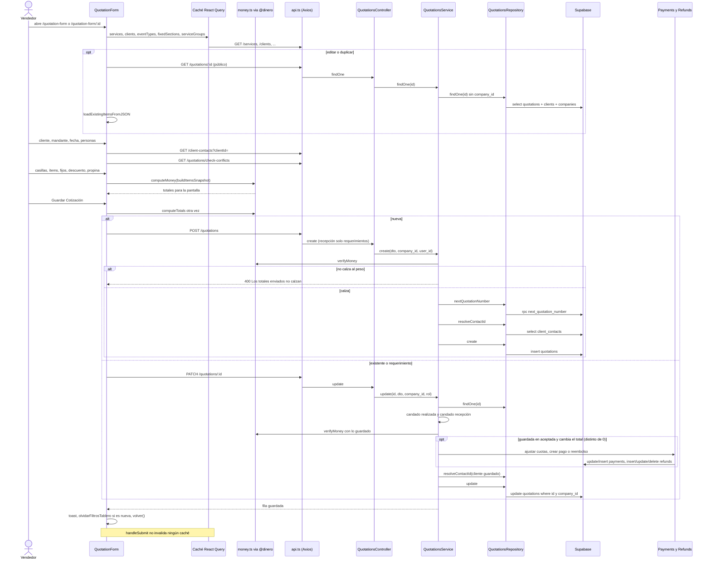

# Flujo: Crear y guardar una cotización en el cotizador
> **Estado: verificado una vez contra el código** (commit 0de0ddb, 11-09-2026). Falta la etapa de completar lo que no quedó escrito.

> Verificado contra el código en el commit 0de0ddb el 11-09-2026, con una segunda pasada escéptica el mismo día. Parte del atlas: el índice de flujos va en `00_INDICE_DE_FLUJOS.md` (esta misma carpeta) y el mapa del sistema en `../00_MAPA_DEL_SISTEMA.md`. Al verificar, ninguno de los dos existía todavía.

## 1. En palabras simples

Un vendedor (o alguien de operaciones o administración) abre el cotizador, elige al cliente y a la persona que encarga el evento (el "mandante"), el tipo de evento, la fecha y cuántos adultos y niños van. Después arma el evento en "casillas": cada casilla es una categoría del catálogo (por ejemplo, un almuerzo), con sus platos, para cuántas personas y qué día. Algunas categorías traen ítems fijos que entran solos (pan y pebre, por ejemplo). Aparte se agregan los servicios fijos del evento (salón, decoración), un descuento y, si corresponde, la propina del equipo.

Mientras se arma, la pantalla va mostrando el total. Al apretar **Guardar Cotización**, la pantalla vuelve a hacer la cuenta, manda todo al motor y el motor **rehace la cuenta por su lado**: si un solo peso no calza, rechaza el guardado. Si calza, la cotización nueva recibe su número y queda **solicitada**. Si se estaba editando una cotización ya aceptada y cambió el total, el motor ajusta solo el plan de pagos (achica o agranda cuotas, o genera un reembolso).

## 2. El recorrido paso a paso

### A. Entrar a la pantalla

1. **Quién actúa:** la persona, desde otra pantalla. **Rutas:** `quotation-form` (nueva) y `quotation-form/:id` (editar) en `frontend/src/App.tsx`, las dos detrás de `PermissionGuard` con `SECTION_ROLES.quotations_edit` = `ROLE_GROUPS.SALES_AND_UP` (vendedor, operaciones, administrador) en `frontend/src/constants/permissions.ts`. Recepción ve el tablero pero no el cotizador (comentario del 12-08 en `App.tsx`: "Si escribe la dirección a mano, la pantalla la rebota"). Puertas de entrada verificadas:
   - `frontend/src/pages/quotations/QuotationsPage.tsx`: botón que hace `navigate("/quotation-form")`.
   - `frontend/src/pages/ClientDetailPage.tsx` (solo si `puedeEditar`): "Nueva cotización" con `state.clientId`; lápiz `navigate(`/quotation-form/${q.id}`)`; "Duplicar" con `state.duplicateFrom`.
   - `frontend/src/pages/consultas/ConsultasPage.tsx`, mutación `convertir`: llama a `convertirConsulta` (`frontend/src/services/consultas.service.ts`) → `POST /consultas/:id/convertir` → `ConsultasController.convertir` → `ConsultasService.convertir` (`api-rest/src/consultas/consultas.service.ts`). Ese servicio busca el cliente **solo por correo** (`ClientsService.findMatch`, regla del 05-09); si no existe lo crea con `ClientsService.create` (que le crea su persona principal, ver paso 5); si existe y el correo no está entre sus contactos, agrega al consultante como contacto no principal. Después **marca la consulta como `convertida`** con su `client_id` en la tabla `consultas` y devuelve `contact_name` = nombre del consultante. Es idempotente: una consulta ya convertida devuelve lo mismo sin duplicar. Recién entonces la pantalla invalida `["consultas"]` y `["clients"]` y abre el cotizador con `state.clientId` y `state.desdeConsulta` (tipo, fecha, personas, niños y `contact_name`).
   - `frontend/src/pages/RequestsPage.tsx`: abre `/quotation-form/${request.id}` sobre un **requerimiento**.
   - `frontend/src/pages/customerSatisfactionSurveys/components/AnswersView.tsx`: abre el formulario en otra pestaña (`window.open`).
   - La página es `React.lazy` (`importQuotationForm` en `App.tsx`) y además se precarga en silencio 2,5 s después de abrir la app (`precargar`, 28-07).

2. **Quién actúa:** la pantalla al montarse (`QuotationForm` en `frontend/src/pages/quotations/QuotationForm.tsx`). Carga en paralelo, casi todo por React Query (caché compartido, `staleTime` 30 s y `refetchOnWindowFocus` por defecto en `frontend/src/lib/queryClient.ts`):
   - Catálogo: `useServices()` (`frontend/src/hooks/useServices.ts`), llave `["services"]`, `GET /services` (`findAllServices`). Arma `products` (un producto por vínculo servicio–categoría, `buildProductsFromLinks`; `codigo` = id del servicio en texto), `fixedServices`, `orderedCategories`, `categoryLinks`, `inactiveCategories` y `calculatePrice` (que delega en `resolveFixedServicePrice` de `@dinero`). Su `loading` es `isPending`: mientras carga por primera vez, la pantalla muestra solo un spinner.
   - Tipos de evento vivos: `eventTypesQueryOptions` (`frontend/src/services/eventTypes.service.ts`), llave `["eventTypes"]` (si falla, respaldo con los valores del enum `EventType`).
   - Clientes: `clientsQueryOptions`, llave `["clients"]`, `GET /clients`.
   - Tipos de cliente: `clientTypesQueryOptions`, llave `["clientTypes"]`.
   - Secciones de fijos: llave `["fixedSections"]`, `GET /services/fixed-sections` (`getFixedSections`).
   - Secciones de categoría: `getCategorySections` → `GET /sections`, **sin caché**, en un `useEffect`.
   - Menús guardados y paquetes: `useServiceGroups()` (llave `["serviceGroups"]`) y `useServiceGroupCollections()` (llave `["serviceGroupCollections"]`).
   - Base de costos para el cuadro de margen (solo administrador y operaciones, `puedeVerMargen`): llave `["logistica", "compras", "base", company.id]`, `getBaseCatalogo`, `staleTime` 5 min.

3. **Quién actúa:** la pantalla, según cómo se entró (`useEffect` que llama a `fetchQuotationData`):
   - **Editar** (`:id`): `getQuotationById` → `GET /quotations/:id` → `QuotationsController.findOne` (**marcado `@Public()`**, con un TODO porque lo usa la encuesta pública) → `QuotationsService.findOne` → `QuotationsRepository.findOne`, que hace `select *` de `quotations` con `clients(name,email)` y `companies(name)` **filtrando solo por `id`, sin `company_id`**, con `.single()`. La respuesta viaja con la forma `{ data, error }` de Supabase. Si viene `error`, toast "No se pudo cargar la cotización." y vuelta a `/quotations`. Si el `request_type` es `requerimiento`, se enciende `isFromRequirement`.
   - **Duplicar** (`duplicateFrom`): pide la cotización de origen y arma una copia **sintética** sin `id`, sin número, sin `user_id` ni `tip_amount`, con `event_date` vacío, `event_end_date` null, `quotation_status` = `solicitada`, `request_type` = `cotizacion` y una marca interna `__items_source_id`. Sí copia cliente, tipo, personas, niños, montos, `items`, `tip_percentage`, `contact_name`, `observations`, `has_contract`, `requires_invoice` y `payment_plan_type`.
   - **Desde consulta** (`desdeConsulta`, solo si no hay `id` ni `duplicateFrom`): precarga tipo, fecha (primeros 10 caracteres), personas, niños y `contact_name` en `formData` (personas y niños con `!= null`, para que un 0 legítimo también viaje, revisión 06-09).
   - **Nueva con cliente** (`navClientId`): pone `client_id` apenas hay clientes cargados.

4. **Quién actúa:** la pantalla, cuando cambia `quotation` (`useEffect` sobre `quotation`). Copia los campos a `formData` (quitando `__items_source_id`, porque el motor rechaza campos desconocidos), recorta las fechas a `yyyy-mm-dd`, deduce el modo de descuento (`$` si `discount_amount > 0`), la propina (`tipEnabled = tip_percentage != null`, `tipPct` = el guardado o 10), marca `isEditingExisting = !!quotation.id` y reconstruye las casillas con `loadExistingItemsFromJSON`:
   - Cada `variable_services[i]` que traiga `items` pasa a ser una casilla con `selectedCategory`, `selectedCategoryId` (`category_id`), `day` (o 1), `audience` (`ninos` o `adultos`) y `people`, que queda "automático" (`undefined`) si coincide con el total de su audiencia y como ajuste manual si no.
   - Cada `fixed_services[i]` pasa a ser un fijo elegido con `precio_calculado` = el `precio` **guardado** (no el de hoy).
   - Al editar, los ítems salen de la misma respuesta (FASE VELOCIDAD, 28-07). Al duplicar, `loadItemsFromDatabase` hace un **segundo** `GET /quotations/:id` a la cotización de origen.
   - Si hay `user_id`, `fetchCreatorUser` pide el usuario creador (`getUser`) solo para mostrar "creada por" junto al número.

### B. Datos del evento

5. **Cliente.** `SelectWithSearch` → `handleClientSelect`: pone `client_id` y deja `contact_name` en `null` si el cliente cambió. Si el cliente no existe, "+ Nuevo cliente" abre un modal → `handleCreateClient` (valida antes con `validateCompleteClientForm`) → `createClient` → `POST /clients` → `ClientsController.create` → `ClientsService.create` (`api-rest/src/clients/clients.service.ts`): inserta en `clients` y, por la **garantía de nacimiento** (31-07), crea su persona principal en `client_contacts` con `ClientContactsRepository.create` (`is_primary: true`, nombre = `contact_person` o el nombre del cliente, correo y teléfono del contacto o del cliente; si falla, solo queda en el log). La pantalla mete el cliente al caché `["clients"]` con `setQueryData`, invalida esa llave y lo deja seleccionado.

6. **Mandante (persona de contacto).** Un `useEffect` sobre `formData.client_id` llama a `getClientContacts` (`frontend/src/services/clientContacts.service.ts`) → `GET /client-contacts?clientId=` → `ClientContactsController.findByClient` → `ClientContactsRepository.findByClient` (las dos clases viven en `api-rest/src/clients/client-contacts.controller.ts`; tabla `client_contacts` filtrada por `company_id` y `client_id`). La lista suma además el `contact_person` histórico del cliente si no está repetido. "+ Nueva persona" → `addClientContact` (valida teléfono y correo con `phoneProblem`/`emailProblem`) → `createClientContact` (le quita `company_id` antes de mandar; la empresa sale de la sesión) → `POST /client-contacts` → `ClientContactsController.create` → `ClientContactsRepository.create`, que inserta en `client_contacts` (`is_primary` si el cliente no tenía personas). Si ese POST falla, `addClientContact` no muestra aviso: solo apaga `savingContact`. En la cotización se guarda **solo el nombre** como texto (`contact_name`); el vínculo real (`client_contact_id`) lo resuelve el motor al guardar (pasos 16 y 18).

7. **Tipo de evento, fechas y choque de agenda.** Tipo: `SelectWithSearch` con los tipos vivos. Fecha de inicio: si el "último día" queda antes, se borra **avisando** (`endDateCleared`). Cada cambio de fecha dispara `useDateAvailability` (`frontend/src/hooks/useDateAvailability.ts`, con el id propio como `excludeId`) → `checkConflictsWithExistingQuotations` → `GET /quotations/check-conflicts` → `QuotationsController.checkConflictsWithExistingQuotations` → `QuotationsService.checkConflictsWithExistingQuotations`, que lee con `QuotationsRepository.findAll` las `quotations` de la empresa en estados solicitada, enviada, en negociación y aceptada, compara rangos y **excluye la propia** (`exclude_id`, 18-08). Solo avisa ("Hay más eventos programados en estas fechas." con enlace al calendario, o "Fecha disponible"), no bloquea. El número de días (`eventDaysCount`, tope 60) habilita el selector de día en casillas y fijos.

8. **Adultos y niños.** Dos `NumberInput`: al tocarlos, `people_count` = adultos + niños (el TOTAL) y `children_count` = niños. Si la suma queda en 0, `people_count` queda `undefined` y el botón Guardar se bloquea ("Falta: asistentes"). Una cotización nueva parte con `people_count` = 1.

### C. Armar los servicios

9. **Casillas por categoría** (`serviceBoxes`, estado local). "+ Agregar servicio" → `addServiceBox` crea una casilla vacía. El basurero (`removeServiceBox`) aparece solo si hay más de una.
   - Elegir categoría → `updateServiceBox(boxId, "selectedCategory", …)`: la casilla queda atada al id del catálogo (`selectedCategoryId`, buscado por nombre en `orderedCategories`, 06-08) y **siembra sola los ítems de la sección fija** de esa categoría (`defaultServicesFor`: la `category_sections` con `is_default` y sus vínculos en `categoryLinks`, solo activos). Una vez elegida, la categoría no se cambia (el selector queda deshabilitado): se borra la casilla y se hace otra.
   - Agregar un ítem: `AgregadorDeItems` con `opcionesDe(box)` (ordenado por sección, sin inactivos ni los de la sección fija) → `updateServiceBox(boxId, "selectedItem", codigo)` → toma `precio` del catálogo **de hoy** (`products`) y suma 1 a la cantidad si ya estaba.
   - Cantidad: `QuantitySelector` → `updateServiceQuantity`; en 0 se quita, salvo los ítems de la sección fija (`min` 1 y `updateServiceQuantity` los ignora bajo 1).
   - Quitar un ítem de la sección fija solo en esta cotización: `QuitarFijo` (pieza `frontend/src/components/FijoDeCategoria`, con confirmación, oculta si la edición está restringida) → `quitarFijo` (regla del 09-09, caso CCU #408).
   - Audiencia (solo si hay niños): botones Adultos/Niños, que reinician `people` a automático.
   - Personas de la casilla: `NumberInput`; vacío o igual a su audiencia = automático (`boxPeople`).
   - Día: `SectionChipSelect` si el evento dura más de un día.
   - Orden: flechas → `moveBox`. Plegar: `toggleBoxCollapsed` (solo en la sesión, no se guarda).
   - Menú guardado de la categoría: "Usar un menú guardado de esta categoría…" → `MenusGuardados` (`frontend/src/pages/quotations/MenusGuardados.tsx`) → `loadGroupIntoBox` → `buildBoxFromGroup` (precios **vivos** del grupo, y agrega los ítems de la sección fija que falten; conserva día, audiencia y personas de la casilla). "Guardar como menú" → `confirmSaveGroup` (traduce cada `codigo` a `variable_service_id` y guarda con el nombre vigente de la categoría) → `saveGroup` de `useServiceGroups` → `createServiceGroup` → `POST /service-groups`, que escribe **al tiro** en `service_groups` y `service_group_items`, aunque la cotización nunca se guarde.

10. **Paquetes.** `SelectorDePaquetes` (`frontend/src/components/selects/SelectorDePaquetes.tsx`) → `loadCollectionAsBoxes`: **agrega** al final (no reemplaza, 14-08) las casillas de sus menús, los servicios sueltos agrupados por categoría (13-08) y sus fijos (`fijosDelPaquete` en `paqueteFijos.ts`, con precio de hoy calculado con el `people_count` de ese momento, 28-08). Borra solo las casillas en blanco. "Crear paquete" → `confirmCreateCollection` (exige nombre y al menos un menú) → `saveCollection` de `useServiceGroupCollections` → `createServiceGroupCollection` → `POST /service-group-collections` (tablas `service_group_collections`, `service_group_collection_items`, `service_group_collection_services`, `service_group_collection_fixed_services`), también al tiro.

11. **Servicios fijos del evento** (`selectedFixedServices`). Siempre hay una fila vacía (un `useEffect` llama a `addNewFixedServiceSlot` si no hay ninguna). Elegir en su `AgregadorDeItems` (fijos activos, ordenados por sección con `fixedOrderOf`) → `handleFixedServiceSelect`, que **agrega** una fila nueva con `calculatePrice(service, formData.people_count)` = `resolveFixedServicePrice` (fijo = `precio`; `fijo_variable` = `precio + precio_por_persona × personas`; `variable_con_limites` = `precio_por_persona × personas` entre mínimo y máximo), redondeado y **guardado como `precio_calculado`**. Día: `SectionChipSelect` con "todo el evento" (0) si el evento dura más de un día. Quitar → `removeFixedService`. El precio **no se recalcula** si después cambian las personas: en `QuotationForm.tsx`, `calculatePrice` solo se llama al elegir el fijo y al cargar un paquete.

12. **Descuento y propina.** Descuento (solo se muestra si el rol tiene tope > 0): modo `%` o `$` (`discType`); tope por rol en `getMaxDiscountForRole` (administrador 40, vendedor y operaciones 15, recepción 0), aplicado solo como `max` del `NumberInput` de porcentaje y como texto "Máximo: …". Propina: casilla `tipEnabled` y `tipPct` (10 por defecto).

### D. La cuenta en vivo

13. **Quién actúa:** dos `useEffect` que llaman a `calculateTotals` cada vez que cambian casillas, fijos, personas y niños (el primero) o descuento, modo y propina (el segundo).
   - `calculateTotals` → `computeTotals` → `computeMoney` importado desde `@dinero`, alias que apunta **al archivo del backend** `api-rest/src/quotations/utils/money.ts` (`frontend/vite.config.ts` y `frontend/tsconfig.json`, Fase 1.2 del 27-07). La cuenta se hace **sobre la foto** `buildItemsSnapshot()`, que es exactamente lo que se guarda.
   - El resultado se escribe en `formData` (`value_per_person`, `fixed_value`, `subtotal_amount`, `total_amount`) y en `tipAmountUI`.
   - El panel "Resumen" calcula **solo para mostrar** Neto e IVA sobre el total sin propina (`(total − propina) / 1.19`), el "Total con IVA", el desglose adultos/niños y el total a pagar. Nada de eso se guarda.
   - "Margen y costos" (`margenCotizador`): `consolidateEvent` de `frontend/src/utils/eventConsolidation.ts` sobre la misma foto; también es solo pantalla.
   - `frontend/src/utils/quotationMoney.ts` **no participa en esta cuenta**: solo contiene `tipAmountOf` y `saleWithoutTip` (espejo de `api-rest/src/quotations/utils/tip.ts`), que usan después `DashboardPage.tsx` y `GestionTab.tsx`; `AnalyticsService` usa el espejo del motor.

### E. Guardar

14. **Quién actúa:** la persona aprieta **Guardar Cotización** (botón con `onClick={handleSubmit}`, deshabilitado solo mientras `loading` o si `isQuotationFormValid()` es falso: cliente, tipo, fecha y asistentes; al lado muestra "Falta: …"). `handleSubmit`:
   1. Si no hay `user`, corta. Si falta `contact_name`, toast "Falta el mandante: elige quién encarga el evento (o créalo con «+ Nuevo contacto»)." y corta (07-08). Ojo: el botón real se llama "+ Nueva persona".
   2. `setLoading(true)`.
   3. `itemsData = buildItemsSnapshot()` y `t = computeTotals()` **otra vez**, en el momento (regla del 25-07).
   4. Arma `quotationData` (spread de `formData`, con `event_end_date` o `null`, `children_count`, `tip_percentage` = `tipPct` o `null`, `tip_amount` = `t.tipAmount` redondeado, `request_type` = `cotizacion` si viene de requerimiento, el descuento solo en su modo activo, montos redondeados desde `t`, `items`, y `quotation_status` = `estadoAlGuardar(formData.quotation_status, isFromRequirement)`, que en `frontend/src/utils/estadoCotizacion.ts` devuelve **el mismo estado del formulario**).
   5. Arma `editableFields`, **la lista única** de campos para crear y actualizar (20-07).
   6. Si hay `quotation.id` o `isFromRequirement` → `updateQuotation(editableFields, id)` → `PATCH /quotations/:id` (pasos 17 y 18). Si no → `createQuotation({...quotationData, ...editableFields})` → `POST /quotations` (pasos 15 y 16).
   - Transporte: `apiRequest` en `frontend/src/services/api.ts` (Axios), que agrega el JWT de Supabase y reintenta una vez tras refrescar la sesión si recibe 401. Un error HTTP **se lanza** desde `apiRequest` y cae en el `catch` de `handleSubmit`; el `{ error }` que devuelven `createQuotation` y `updateQuotation` sale de `response.error` y normalmente viene vacío.

15. **Motor, crear: puerta.** El `ValidationPipe` global (`api-rest/src/main.ts`, `whitelist` + `forbidNonWhitelisted` + `transform`) valida contra `CreateQuotationDto` (`api-rest/src/quotations/dto/create-quotation.dto.ts`): exige `client_id`, `event_type`, `event_date` (fecha ISO), `quotation_status` y `request_type`; `people_count` debe ser ≥ 1 y los montos ≥ 0. `items` es `@IsObject()` **sin validación interna**. El `AuthGuard` (`api-rest/src/auth/auth.guard.ts`) deja en `request.user` `id`, `company_id`, `role` y `email`. `QuotationsController.create` (usuario vía `@CurrentUser()`): si el rol es `recepcion` y `request_type` no es `requerimiento` → 403 "Recepción puede registrar requerimientos, no crear cotizaciones." (28-07).

16. **Motor, crear: `QuotationsService.create`** (`api-rest/src/quotations/quotations.service.ts`):
   1. `assertMoneyMatches`: `hasMoneyToVerify` (pasa de largo si no hay ítems y todo viene en 0) y `verifyMoney`, que rehace `computeMoney` y compara al peso `fixed_value`, `value_per_person`, `subtotal_amount`, `discount_amount` (en modo % exige 0), `tip_amount` y `total_amount`. Si algo no calza: `BadRequestException` "Los totales enviados no calzan con los ítems de la cotización (…)" y log de error. **Esto ocurre antes de pedir número.**
   2. `QuotationsRepository.nextQuotationNumber` → RPC `next_quotation_number` (migración 38, `docs/migrations/38_numero_cotizacion_unico.sql`): upsert en `company_quotation_counters` con `last_number = GREATEST(last_number, MAX real) + 1` y devuelve ese número. Hay además la restricción `UNIQUE (company_id, quotation_number)` y la función no la pueden ejecutar `anon` ni `authenticated`.
   3. `getEventDateUtc` (`api-rest/src/utils/dates.ts`) convierte `event_date` y `event_end_date` a medianoche UTC en texto ISO.
   4. `QuotationsRepository.resolveContactId(client_id, contact_name)`: lee `client_contacts` **filtrando solo por `client_id`** y busca el nombre igual (con `trim` y sin mayúsculas) → `client_contact_id` o `null`.
   5. Arma `newQuotation` **campo por campo** (lista explícita, bug del 19-07): fuerza `payment_plan_type` = `default`, `company_id` del usuario, `user_id`, `tip_amount` redondeado y ≥ 0, `requires_invoice`/`has_contract` en `false` si no vienen, `items` o `{fixed_services: [], variable_services: []}`.
   6. `QuotationsRepository.create` → `insert` en `quotations` con `.select().single()` y devuelve la fila.

17. **Motor, actualizar: puerta.** `UpdateQuotationDto` = `PartialType(CreateQuotationDto)` (mismo `ValidationPipe`, todo opcional). `QuotationsController.update` registra en el log el DTO **completo con `JSON.stringify`** (no con `logSafe`) y pasa `company_id` y rol al servicio.

18. **Motor, actualizar: `QuotationsService.update`** (todo dentro de un `try/catch` que registra y relanza):
   1. `QuotationsRepository.findOne(id)` (sin filtro de empresa). Si hay error lo lanza; si no hay fila, lanza `Error('Quotation not found')` (sale como 500, no 404).
   2. **Candado del evento realizado** (13-08): si la guardada está `realizada` → 400 con el mensaje `EVENTO_REALIZADO_CONGELADO` (`api-rest/src/quotations/constants/constants.ts`), para todos los roles.
   3. Recepción solo edita requerimientos (12-08) → 403 "Recepción puede editar requerimientos, no cotizaciones."
   4. Si el parche toca plata o personas (el cotizador siempre lo hace), `assertMoneyMatches` mezclando lo que viene con lo guardado.
   5. Guardia de estados: pasar de post-venta (aceptada, realizada, cancelada) a pre-venta con dinero registrado → 400; sin dinero, `PaymentsService.deletePaymentPlan`. **Desde el cotizador no se activa**, porque el estado viaja igual al guardado.
   6. **Cascada del plan de pagos** si la guardada está `aceptada` (la anuncia antes `AvisoPlanDePagos`, caso 501):
      - Lee cuotas `pendiente` y `vencido` con `PaymentsService.findAllPaymentsFromQuotation` (ordenadas por `payment_number` ascendente).
      - Solo corre si el `total_amount` nuevo viene y **no es 0** (la condición es `updateQuotationDto.total_amount && …`).
      - Si el total **baja**: sin cuotas pendientes ni vencidas → `RefundsService.create` (tabla `refunds`); con cuotas → recorre desde la última (mayor `payment_number`) hacia atrás y a cada una le descuenta hasta su saldo pendiente (monto − transacciones) con `PaymentsService.update({amount})`; lo que sobre va a reembolso.
      - Si el total **sube**: primero consume reembolsos pendientes del más antiguo al más nuevo (`findPendingByQuotation`, `updateAmount`, `remove`, TAREA #42); el resto agranda la última cuota pendiente o vencida o, si no hay ninguna, crea una con `PaymentsService.createPayment` ("Pago creado por diferencia de total_amount").
   7. Correo `QUOTATION_IS_SENT` solo si el estado **cambia** a `enviada` (no ocurre desde el cotizador).
   8. Si viene `contact_name` → `resolveContactId(quotation.client_id, …)` con el cliente **guardado**, no con el del parche → escribe `client_contact_id` en el parche.
   9. `sent_at` solo si pasa a `enviada` (no ocurre desde el cotizador).
   10. `QuotationsRepository.update` → `update` en `quotations` con `.eq('id')` y `.eq('company_id')` y `.select().single()`. El parche se escribe tal cual: a diferencia de `create`, **`event_date` y `event_end_date` no pasan por `getEventDateUtc`** y llegan a la base como `yyyy-mm-dd` (ver pregunta abierta 14).

19. **Vuelta a la pantalla.** Si todo salió bien: toast "Cotización actualizada." si `isEditingExisting` (hay `quotation.id`, lo que incluye un requerimiento convertido) o "Cotización guardada." si no. Solo en el segundo caso, `olvidarFiltrosTablero(user.id)` borra de `sessionStorage` la llave `eventia_quotations_filtros_tablero_<userId>` (`frontend/src/pages/quotations/filtrosTablero.ts`), para que la tarjeta nueva aparezca sí o sí. Luego `volver()` hace `navigate(-1)` o va a `/quotations` si no hay historia. Si falla: toast "No se pudo guardar la cotización: " + `humanizeApiError(error)`. **`handleSubmit` no invalida ningún caché de React Query**; en `QuotationForm.tsx` solo lo hacen el borrado (`["quotations"]` y `["requirements"]`) y la creación de cliente (`["clients"]`): ver sección 5.

## 3. Diagrama



## 4. Datos que cambian

| tabla | columnas | en qué paso | quién escribe |
|---|---|---|---|
| `quotations` (crear) | `client_id`, `event_type`, `event_date`, `event_end_date`, `people_count`, `children_count`, `contact_name`, `client_contact_id`, `observations`, `company_id`, `user_id`, `quotation_number`, `quotation_status`, `request_type`, `requires_invoice`, `has_contract`, `payment_plan_type` (siempre `default`), `value_per_person`, `fixed_value`, `subtotal_amount`, `discount_percentage`, `discount_amount`, `tip_percentage`, `tip_amount`, `total_amount`, `items` | 16 | `QuotationsService.create` → `QuotationsRepository.create` |
| `company_quotation_counters` | `last_number` (upsert por `company_id`) | 16 | función SQL `next_quotation_number` (migración 38), vía `QuotationsRepository.nextQuotationNumber` |
| `quotations` (actualizar) | los de `editableFields`: `client_id`, `event_type`, `event_date`, `event_end_date`, `request_type`, `value_per_person`, `fixed_value`, `subtotal_amount`, `total_amount`, `items`, `quotation_status`, `people_count`, `discount_percentage`, `discount_amount`, `observations`, `children_count`, `tip_percentage`, `tip_amount`, `contact_name`; más `client_contact_id` que agrega el servicio | 18 | `QuotationsService.update` → `QuotationsRepository.update` |
| `payments` | `amount` de cuotas pendientes o vencidas; fila nueva con `quotation_id`, `amount`, `notes`, `status` = `pendiente`, `payment_number` siguiente y `due_date` = `event_date` + 7 días (o hoy) | 18.6, solo si la guardada está `aceptada` y cambia el total | `PaymentsService.update` (→ `updatePayment`) y `PaymentsService.createPayment` |
| `refunds` | fila nueva (`amount`, `quotation_id`, `is_paid` = false); `amount` achicado; fila borrada de verdad (`delete`) | 18.6, igual que arriba | `RefundsService.create`, `updateAmount`, `remove` |
| `clients` + `client_contacts` | cliente nuevo y su persona principal (`is_primary: true`) | 5, solo si se usa "+ Nuevo cliente" | `ClientsService.create` (persona vía `ClientContactsRepository.create`) |
| `client_contacts` | persona nueva (`company_id` de la sesión, `client_id`, `name`, `email`, `phone`, `is_primary`) | 6, solo si se usa "+ Nueva persona" | `ClientContactsRepository.create`, vía `ClientContactsController.create` |
| `service_groups`, `service_group_items` | menú nuevo | 9, "Guardar como menú" (independiente del guardado de la cotización) | `useServiceGroups().saveGroup` → `POST /service-groups` |
| `service_group_collections` y sus tres tablas hijas | paquete nuevo | 10, "Crear paquete" (independiente) | `useServiceGroupCollections().saveCollection` → `POST /service-group-collections` |
| `consultas` | `estado` = `convertida`, `client_id` | 1, al convertir (antes de abrir el cotizador) | `ConsultasService.convertir` |
| `clients` / `client_contacts` | cliente nuevo con su persona principal, o el consultante como contacto no principal de un cliente existente | 1, al convertir, solo si hace falta | `ConsultasService.convertir` (vía `ClientsService.create` o `ClientContactsRepository.create`) |
| `sessionStorage` del navegador | se borra `eventia_quotations_filtros_tablero_<userId>` | 19, solo al crear | `olvidarFiltrosTablero` |

### Qué queda dentro de `quotations.items`

Lo arma `buildItemsSnapshot()` en `QuotationForm.tsx`:

```text
items = {
  variable_services: [            // una entrada por casilla con categoría e ítems, en el orden de pantalla
    { category, category_id, day, audience, people,
      items: [ { codigo, nombre, precio, categoria, quantity } ] }
  ],
  fixed_services: [               // sin filas vacías, ordenados por sección del catálogo (fixedOrderOf)
    { codigo, nombre, day, precio /* = precio_calculado ya resuelto */, categoria, quantity,
      tipo_calculo, min_precio, max_precio, precio_por_persona }
  ]
}
```

- `day` se topa en `eventDaysCount` al guardar; en fijos, 0 = todo el evento.
- `people` va **resuelto** (el número, aunque sea automático), para que la foto quede completa aunque después cambien los contadores.
- `category_id` conserva el id guardado si el catálogo no lo resuelve.
- Las casillas sin categoría o sin ítems no se guardan. `codigo` es el id del servicio en texto (`useServices`).

Los tipos del motor (`QuotationItem`, `VariableService` y `FixedService` en `api-rest/src/quotations/entities/quotation.entity.ts`) y los del frontend (`frontend/src/types/quotations.types.ts`) **no declaran** `category_id`, `day`, `audience` ni `people`: la forma real vive en `buildItemsSnapshot`, y `money.ts` solo declara lo que necesita para la cuenta (`VariableBox` con `audience`, `people` e `items`; `SnapshotItem`).

### Cómo sale cada columna de monto (`computeMoney` en `api-rest/src/quotations/utils/money.ts`)

| columna | fórmula |
|---|---|
| (interno) variables | Σ por casilla de (Σ `precio` × `quantity`) × `people` de la casilla, redondeado. Casilla vieja sin `people` = `people_count` del evento. Cantidad ausente o 0 vale 1 |
| `fixed_value` | Σ precio del fijo × `quantity`, redondeado. Si `precio` es 0 y `precio_por_persona` > 0 (foto anterior al 24-07), se resuelve con la regla del catálogo |
| `value_per_person` | Σ del valor por persona de las casillas de **adultos** cuyo `people` es exactamente el total de adultos (columna histórica), redondeado |
| `subtotal_amount` | variables + `fixed_value` |
| `discount_percentage` / `discount_amount` | solo viaja con valor el modo activo; el otro va en 0. En modo %: monto = subtotal × % (tope 100) y la columna `discount_amount` queda en 0. En modo $: monto topado al subtotal |
| `tip_percentage` | `tipPct` si la propina está encendida; `null` si está apagada |
| `tip_amount` | variables × % / 100, redondeado (tope 100). No depende del descuento ni lleva IVA |
| `total_amount` | (subtotal − descuento) + propina |

**No se guarda:** Neto, IVA, desglose adultos/niños, margen y costo estimado, paquetes aplicados, casillas plegadas, `groupName`. Tampoco `sent_at`, que no lo toca este flujo. Al editar tampoco viajan `requires_invoice`, `has_contract` ni `payment_plan_type`: no están en `editableFields`.

## 5. Efectos automáticos y colaterales

**Correos.** Guardar desde el cotizador **no manda correos**. El único correo posible en `QuotationsService.update` es `QUOTATION_IS_SENT`, y sale solo cuando el estado **cambia** a `enviada`. El cotizador guarda siempre el estado que tenía (`estadoAlGuardar`, sin selector de estado en la pantalla). Antes del 18-08, un requerimiento convertido se forzaba a `enviada` y ese guardado le mandaba el correo al cliente con la cotización a medio armar (comentario en `estadoCotizacion.ts` y en `handleSubmit`). El envío real va por otro flujo (`POST /quotations/:id/enviar-correo`, `docs/arquitectura/13_ENVIO_DE_COTIZACIONES.md`).

**Plan de pagos (cascada).** Solo al editar una cotización `aceptada` cuyo total cambió a un valor distinto de 0 (paso 18.6). Las escrituras en `payments` y `refunds` se hacen **una por una, sin transacción, y antes** del `update` de `quotations`. `AvisoPlanDePagos` (`frontend/src/components/AvisoPlanDePagos.tsx`) avisa en pantalla antes de guardar si la aceptada ya tiene cuotas (llave `["payments", quotationId]`, `staleTime` 30 s).

**Número de cotización.** Cada creación que pasa la verificación de plata consume un número del contador, aunque después falle el `insert`: la RPC es una llamada aparte.

**Relojes.** Guardar no dispara ningún reloj. Los que leen lo guardado después están en `api-rest/src/quotations/quotations-cron.service.ts`: `sendQuotationFollowUps` (diario 11:00 UTC, solo cotizaciones `enviada` con `sent_at`, que este flujo no toca) y `sendWeeklyDigest` (lunes 11:00 UTC). Los relojes corren solo con `NODE_ENV=production` (`ScheduleModule.forRoot({ cronJobs: … })` en `app.module.ts`).

**Quién consume lo guardado** (si cambia la forma de `items` o de los montos, se rompen):
- Correo de cotización: `api-rest/src/quotations/correo-cotizacion.ts` (lee `items`).
- Hoja pública del PDF: `api-rest/src/quotations/hoja-publica.ts` y `frontend/src/utils/quotationPrintDoc.ts` (leen `items`).
- Compras: `LogisticsRepository.findAcceptedEvents` y `findWonEventsSince` leen `items`.
- Post-Venta: `ServiciosTab.tsx`, `FichaCocinaSection.tsx` y `GestionTab.tsx` (lee `items` y usa `tipAmountOf`/`saleWithoutTip`), en `frontend/src/pages/postventa/`.
- Calendario: `frontend/src/pages/calendar/Calendar.tsx` (lee `items.variable_services` del detalle). Personas: `frontend/src/pages/personas/serviciosDelDia.ts`.
- Dashboard: `frontend/src/pages/dashboard/DashboardPage.tsx` (`saleWithoutTip`). Analytics: `AnalyticsService` (`saleWithoutTip` del `tip.ts` del motor) y las funciones SQL de `db_functions_analytics_23_07.sql` (raíz del repositorio), que suman `total_amount` directo.

**Compras (evento provisionado).** Editar desde el cotizador una aceptada ya provisionada **no limpia** `provisioned_at`, `provisioned_cost`, `provisioned_people` ni `provisioned_services`, y el cotizador no tiene la regla que sí tiene `ServiciosTab.tsx` ("Evento provisionado: solo un administrador puede disminuir el número de personas."): `QuotationForm.tsx` no menciona `provisioned`.

**Personas.** `PeopleRepository.diasDeEvento` lee `event_date` y `event_end_date` al momento de usarlos (`PeopleService.traerPlantaAlEvento`). Acortar el rango en el cotizador no toca `event_staff`: no hay cascada en `QuotationsService.update`. Ver pregunta abierta.

**Cachés de la app que quedan desactualizados.** `handleSubmit` no llama a `invalidateQueries`. Lo que se refresca depende de cada pantalla al volver:
- Tablero `["quotations", "embudo-y-rechazadas"]` (`QuotationsPage.tsx`): `staleTime` 30 s por defecto y `placeholderData: keepPreviousData`. Por la semántica por defecto de React Query, si se vuelve antes de 30 s desde la última carga, puede no volver a pedir la lista hasta que la ventana recupere el foco. No medido: ver preguntas abiertas.
- Requerimientos `["requirements"]` (`QuotationsPage.tsx` y `RequestsPage.tsx`): un requerimiento recién convertido en cotización puede seguir en la lista hasta que el caché venza.
- Ficha del negocio (`NegocioPage.tsx`): `["quotation", id]` tiene `staleTime: 0` y se recarga al volver; `["quotations", "ficha-lista"]` usa los 30 s por defecto.
- No se tocan `["quotations", "calendar"]`, `["payments", id]` (aunque la cascada haya cambiado cuotas), las llaves de Post-Venta, `["clients"]` (cuyo comentario en `frontend/src/services/clients.service.ts` dice "caché que se invalida tras cada guardado" y trae `quotation_count`) ni las de logística.
- Sí se toca `["clients"]` al crear un cliente desde el modal (paso 5).

**Registro (logs en Railway).** `QuotationsController.update`, `QuotationsRepository.create` y `QuotationsRepository.update` escriben el objeto completo con `JSON.stringify`, incluidos `contact_name` y `observations`. `api-rest/src/logging/log-safe.ts` (Fase 3, 28-07) declara esos dos campos en `CAMPOS_SENSIBLES`; `QuotationsController.create` y `QuotationsService.create` sí usan `logSafe`.

## 6. Reglas de negocio que gobiernan el flujo

- **Mandante obligatorio** (07-08, Felipe): sin él no hay a quién llamar, ni destinatario de seguimiento y correos ("correos a personas y punto", 30-07), y la cosecha del mes pierde una de sus tres patas. Se valida solo en pantalla (`handleSubmit`); el DTO lo deja opcional.
- **Quién cotiza.** La ruta del cotizador es para vendedor, operaciones y administrador (12-08). En el motor, recepción solo crea y edita **requerimientos** (`QuotationsController.create`, 28-07; `QuotationsService.update`, 12-08).
- **Tope de descuento por rol** (`getMaxDiscountForRole`): administrador 40 %, vendedor y operaciones 15 %, recepción 0. **Solo en pantalla**: `NumberInput` dispara `onChange` aunque el valor pase el máximo (comentario de "LA REGLA ÚNICA DEL SISTEMA" del 22-07 en `frontend/src/components/inputs/NumberInput.tsx`: "es el formulario padre quien bloquea su botón mientras tanto"), `isQuotationFormValid` no revisa el descuento y el motor no tiene tope.
- **Aceptada: solo administrador y operaciones editan** (`isRestrictedEditing`). **Solo en pantalla**: deshabilita los campos pero no el botón Guardar, y `QuotationsService.update` no revisa esa regla.
- **Evento realizado congelado** (13-08, Felipe: "El realizado es un estado de que YA SE HIZO", comentario en `constants.ts`; y en `QuotationForm.tsx`: "no hay nada en el cotizador que se debiera modificar"): se congela todo, también para el administrador. Vive en el motor (`EVENTO_REALIZADO_CONGELADO` en `constants.ts`, dentro de `update` y `remove`) y en pantalla se refleja con `esEventoCongelado`.
- **Estado al guardar** (18-08, Felipe: "debería quedar en solicitada hasta que se envíe"): se guarda con el estado del formulario; una cotización nueva nace `solicitada` (`estadoAlGuardar`).
- **La cuenta la hace la casa** (Fase 1, 27-07): el motor rehace los totales desde los ítems y rechaza si no calzan al peso. **Fase 1.2** (27-07): hay una sola fórmula, en `money.ts`, que el frontend importa tal cual con `@dinero`.
- **Los totales se calculan al guardar, no se leen de `formData`** (25-07): antes se guardó el porcentaje nuevo con el total viejo ("le pasó a la 248 de Valle del Sol, y a otras tres", comentario de `computeTotals`).
- **Propina** (24-07, Felipe): pasa por la empresa pero **no es venta ni margen**, va entera al equipo (`tip.ts`). Es un % sobre los servicios variables, después del IVA y sin IVA. **El monto se guarda** (`tip_amount`, migración 37, 25-07): el porcentaje es la regla y el monto es el hecho.
- **Descuento:** solo viaja el modo activo; el monto se topa al subtotal para que subtotal − descuento dé siempre el total guardado (comentario en `handleSubmit`; convención de la migración 6: si `discount_amount` > 0 manda el monto).
- **Número único y atómico por empresa** (migración 38, 27-07): antes era "último + 1" con carrera.
- **Sección fija de la categoría:** sus ítems entran solos y no se quitan. Única excepción, en esa sola cotización y con confirmación (Felipe 09-09: 99 % de las veces se quedan; CCU #408 fue el 1 %).
- **Categoría por id** (06-08): renombrar en el catálogo no rompe cotizaciones guardadas.
- **Cada casilla multiplica por su audiencia o por su ajuste manual** (Cotizador 2.0); `people_count` es el total y `children_count` los niños.
- **Precio de un fijo "por persona":** queda **resuelto** en la foto al agregarlo; "de ahí en adelante es un hecho guardado" (comentario de `resolveFixedServicePrice`).
- **Paquete = plantilla que suma, no reemplaza** (14-08, Felipe: "un paquete es una base de trabajo, una plantilla"). Trae servicios sueltos (13-08) y fijos con precio de hoy (28-08); si el fijo salió del catálogo, se salta ("nunca se inventa un precio" en `paqueteFijos.ts`; la prueba lo dice "jamás se inventa un precio").
- **Choque de fechas:** avisa, no bloquea, y excluye la propia (18-08).
- **Duplicar:** copia todo menos la fecha; número y estado nuevos.
- **Fechas del evento en medianoche UTC** (`getEventDateUtc` al crear; en pantalla `formatISOUTCDateToString`, según `CLAUDE.md`).
- **Mandante vinculado por nombre** (migración 48): el motor resuelve `client_contact_id` desde `contact_name`.
- **Al crear, el tablero olvida sus filtros** (`olvidarFiltrosTablero`); **"volver" regresa a donde venías** (04-08).

## 7. Si cambias algo en este flujo

- **Si cambias** `handleSubmit` para leer los montos desde `formData` en vez de pedir `computeTotals()` al momento, **pasa** que vuelve a guardarse el porcentaje nuevo con el total viejo, **porque** `formData` se actualiza en un `useEffect` después de pintar. Evidencia: comentarios "EL CÁLCULO DEVUELVE, NO GUARDA (25-07-2026)" sobre `computeTotals` y "LOS TOTALES SE CALCULAN ACÁ" en `handleSubmit` (caso 248 de Valle del Sol y otras tres).
- **Si agregas** un número nuevo al total (recargo, impuesto) en la pantalla y no en `computeMoney`, **pasa** que **todo guardado recibe 400** "Los totales enviados no calzan", **porque** `verifyMoney` rehace la cuenta con `money.ts`. Va **solo** en `api-rest/src/quotations/utils/money.ts`: la pantalla lo importa por `@dinero` y lo usan también `ServiciosTab.tsx` y `useServices.ts`. Ojo: el encabezado de `money.ts` todavía dice "se cambia ALLÁ y ACÁ", pero desde la Fase 1.2 (`frontend/vite.config.ts`) es un solo archivo.
- **Si cambias** `money.ts` (redondeos, tope, la regla de fotos viejas en `fixedPrice` o la de `boxPeople` para casillas sin `people`), **pasa** que cotizaciones ya guardadas dejan de pasar la verificación la próxima vez que alguien las edite, desde el cotizador o desde Post-Venta, **porque** `QuotationsService.update` verifica mezclando el parche con `quotation.items` guardado. Evidencia: `update`, paso 4; pruebas `describe('fotos viejas (anteriores al 24-07)')` en `money.spec.ts`.
- **Si sacas** un campo de `editableFields`, **pasa** que al editar ese dato se pierde o queda como estaba sin aviso, **porque** el PATCH manda solo esa lista. Evidencia: comentario "así no puede repetirse el bug de children_count/tip/contacto perdidos al editar (20-07-2026)". Lo mismo con el objeto `newQuotation` de `QuotationsService.create`: "si faltan en el insert, se botan en silencio (bug del 19-07)".
- **Si agregas** una columna a `quotations` que el cotizador deba guardar, **pasa** que hay que tocar cinco lugares o algo falla: `CreateQuotationDto` (sin él, el `ValidationPipe` con `forbidNonWhitelisted` rechaza el cuerpo entero), `editableFields`, `newQuotation` en `create`, las entidades e interfaces de ambas apps, y `COLUMNAS_LISTA` en `QuotationsRepository.findAll` si la lista la necesita ("OJO: columna nueva en la tabla ⇒ agregarla acá"). Además, la migración va en `docs/migrations/` y se corre a mano en Supabase.
- **Si haces** que `estadoAlGuardar` vuelva a forzar `enviada` (o agregas un selector de estado al cotizador), **pasa** que el guardado le manda al cliente el correo `QUOTATION_IS_SENT` y sella `sent_at`, que arranca los recordatorios del día 7 y 14, **porque** `QuotationsService.update` reacciona a cualquier cambio a `enviada`. Evidencia: comentario de Felipe del 18-08 en `estadoCotizacion.ts` y prueba `describe("estadoAlGuardar (Felipe, 18-08): nadie fuerza 'enviada'")` en `estadoCotizacion.test.ts`.
- **Si cambias** la fórmula de la propina, **pasa** que las cotizaciones con `tip_amount` > 0 conservan su monto (bien), pero `tipAmountOf` reconstruye las filas con monto 0 y porcentaje > 0 con **su propia** fórmula (variables = subtotal − fijos), no con `money.ts`. Si cambias solo `money.ts`, pantalla y motor calculan distinto que ese respaldo; hay que cambiar `tip.ts` y `quotationMoney.ts` juntos (espejos) además de `money.ts`. Antecedente, en `docs/migrations/37_tip_amount.sql`: el relleno ciego le habría inventado propina a filas importadas; "En los datos reales del 25-07 eran nueve cotizaciones y $2.023.600 de ventas que se iban a evaporar" del Dashboard.
- **Si mueves** `nextQuotationNumber` antes de `assertMoneyMatches`, **pasa** que cada guardado rechazado quema un número, **porque** el contador avanza con cada llamada a `next_quotation_number`. Hoy la verificación va primero ("FASE 1: verificar la plata antes de cualquier otra cosa").
- **Si tocas** la cascada de pagos de `QuotationsService.update` (orden de cuotas, compensación de reembolsos), **pasa** que el aviso `AvisoPlanDePagos` miente y el plan puede quedar descuadrado, **porque** el aviso describe esa cascada con palabras. Antecedentes: caso 501 (commit 3b3563c del 06-09, "el plan de pagos nunca más nace descuadrado") y TAREA #42. `PaymentsRepository.findAllPaymentsFromQuotation` ordena por `payment_number` con el aviso "be careful when changing this". Hay pruebas parciales en `quotations.service.spec.ts` (ver sección 9).
- **Si cambias** el orden de los candados en `update` (realizado primero, después rol), **pasa** que un evento realizado podría editarse, **porque** el candado debe regir para todos, incluido el administrador ("Va antes que el filtro de rol a propósito"). Pruebas en `candado-evento-realizado.spec.ts`.
- **Si confías** en el motor para el tope de descuento por rol o para "aceptada solo la editan administrador y operaciones", **pasa** que no hay protección, **porque** ambas reglas viven solo en `QuotationForm.tsx` (`getMaxDiscountForRole`, `isRestrictedEditing`) y el motor no las revisa.
- **Si cambias** cómo `resolveContactId` compara nombres, **pasa** que `client_contact_id` queda en `null` y la cotización deja de aparecer en el portal del mandante (`findAllByContact`) y de recibir correos, **porque** "la correspondencia sigue a la persona" (`resolveRecipient`). Hoy compara el nombre exacto, con `trim` y sin mayúsculas.
- **Si quitas** la separación de `__items_source_id` al hidratar `formData`, **pasa** que duplicar responde 400, **porque** ese campo viajaría en el POST y `forbidNonWhitelisted` lo rechaza (comentario en el `useEffect` sobre `quotation`).
- **Si cambias** los textos de `FIELD_MESSAGES` en `frontend/src/utils/apiErrors.ts`, ojo: hoy el rechazo por plata que nombra `discount_amount` se muestra como "El descuento no es válido" y el que nombra `total_amount` o `subtotal_amount` (sin descuento) como "Los totales no son válidos", **porque** `humanizeApiError` toma la primera expresión que calza con el mensaje del motor, y se pierde la instrucción "Actualiza la página e intenta guardar de nuevo". Si el descalce es solo `fixed_value`, `value_per_person` o `tip_amount`, se ve el mensaje crudo completo.
- **Si agregas** código a `QuotationForm.tsx`, **pasa** que el portero rechaza el build, **porque** el archivo está congelado en 3936 líneas (`congelar` en `frontend/scripts/portero-kit-de-la-casa.sh`) y hoy tiene 3928. Hay que sacar la pieza a su propio archivo, como `MenusGuardados.tsx` (commit 14cda8f del 09-09, que bajó el techo de 3945 a 3936), `PkgFijosPicker.tsx` o `paqueteFijos.ts` (el código llama "higuera" a estas extracciones).
- **Si vuelves privado** `GET /quotations/:id`, **pasa** que se rompe la encuesta pública, **porque** el comentario del controlador dice que es público por eso. **Si le agregas** campos internos a esa respuesta, quedan expuestos a cualquiera que tenga el id.

## 8. Casos borde y estados raros

- **Doble clic o dos pestañas creando:** el botón se deshabilita con `loading`, pero es estado de React y no hay llave de idempotencia. Dos POST casi simultáneos crearían dos cotizaciones con números distintos (el contador lo garantiza) y los mismos datos.
- **Dos personas editando la misma cotización** (por ejemplo, cotizador y Post-Venta `ServiciosTab.tsx`, que también manda `items` y montos por `PATCH /quotations/:id`): gana el último guardado y `items` se reemplaza entero. `QuotationsRepository.update` filtra solo por `id` y `company_id`, sin versión. En una aceptada, cada guardado corre la cascada contra el total guardado en ese momento.
- **Falla a la mitad de una edición de aceptada:** la cascada escribe cuotas y reembolsos uno por uno, sin transacción, antes del `update` final. Si ese `update` falla, el plan ya quedó ajustado al total nuevo y la cotización conserva el viejo.
- **Total de una aceptada que baja a 0** (se quitan todos los servicios): la cascada **no corre**, porque la condición es `updateQuotationDto.total_amount && …` y 0 es falso. La cotización queda en $0 con sus cuotas intactas y sin reembolso.
- **Falla después de pedir número al crear:** el número queda consumido y aparece un salto en la numeración.
- **El catálogo cambió de precio:** lo guardado conserva el precio de la foto. Al editar una cotización vieja, los ítems cargados mantienen su precio antiguo y los que se agregan entran con el de hoy, así que pueden convivir. **Duplicar** copia los precios antiguos (`loadExistingItemsFromJSON` usa `item.precio`). Cargar un menú o paquete trae precios vivos (`buildBoxFromGroup`, `fijosDelPaquete`).
- **Se cambian las personas después de agregar un fijo "por persona":** `precio_calculado` no se recalcula (solo se calcula en `handleFixedServiceSelect` y `loadCollectionAsBoxes`). El motor lo acepta porque el `precio` no es 0, así que se guarda con el precio calculado para la cantidad anterior.
- **Se cambia el cliente al editar:** `handleClientSelect` borra `contact_name` y obliga a elegir mandante, pero `QuotationsService.update` busca el contacto en el cliente **guardado** (`resolveContactId(quotation.client_id, …)`), no en el nuevo. Lo más probable es que `client_contact_id` quede en `null` o apunte a otra persona.
- **Se acorta el rango de fechas:** el `day` de casillas y fijos se topa al guardar (`Math.min(…, eventDaysCount)`), lo que puede juntar servicios en el último día. Las cuotas del plan y el personal asignado no se mueven solos (un aviso parecido sale al cambiar la fecha en `EventoCajitas.tsx`: "Ojo: las cuotas del plan de pagos y los servicios de temporada no se mueven solos.").
- **Cotización realizada:** la pantalla la congela, pero el botón Guardar sigue habilitado; si se aprieta, el motor responde 400 con `EVENTO_REALIZADO_CONGELADO`.
- **Vendedor en una aceptada:** ve los campos bloqueados, pero puede apretar Guardar; el PATCH reenvía los mismos datos y el motor lo acepta.
- **Descuento sobre el tope del rol:** el campo se pone rojo y vibra, pero el valor pasa y se guarda.
- **Cotización sin ítems y con todo en 0:** `hasMoneyToVerify` devuelve falso y se guarda igual, con `items` vacío. El cotizador no exige al menos un servicio.
- **Casillas antiguas (antes del Cotizador 2.0) sin `people` ni `audience`:** se cargan como adultos automáticos; al volver a guardar se escribe `people` resuelto. Si los contadores no cambiaron, el total da lo mismo.
- **Categoría desactivada después de cotizar:** la casilla vieja la conserva (el filtro de `serviceCategories` deja pasar la ya elegida), pero sus ítems inactivos no se ofrecen para agregar.
- **Consulta convertida que nunca se guarda:** la consulta queda `convertida`, con cliente y sin cotización (`ConsultasService.convertir` marca antes de abrir el cotizador). Si se vuelve a convertir, devuelve lo mismo sin duplicar.
- **Requerimiento convertido:** se guarda por PATCH con `request_type` = `cotizacion`, conserva su estado (los requerimientos nacen `solicitada` en `QuotationsService.createPublic`) y su número. El toast dice "Cotización actualizada." y el tablero no olvida sus filtros. El caché `["requirements"]` puede seguir mostrándolo un rato.
- **Id de otra empresa en la URL:** la lectura (`GET /quotations/:id`, público y sin filtro de empresa) la muestra. Al guardar, `QuotationsService.update` no compara `quotation.company_id` con la empresa del usuario antes de la cascada (sí lo hacen `markEventDone`, `unmarkEventDone` y `setHarvestStatus`); el filtro de empresa llega recién en `QuotationsRepository.update`. En la cascada, `RefundsService.create`, `findPendingByQuotation`, `updateAmount`, `remove` y `PaymentsService.update` no reciben empresa, y `findAllPaymentsFromQuotation` filtra con `.eq('quotations.company_id', …)` sobre un embebido sin `!inner`. Ver pregunta abierta 3.
- **Mandante nuevo que no se pudo crear:** `addClientContact` no avisa si el POST falla; el mini-formulario queda abierto sin mensaje.
- **Sesión vencida:** `api.ts` refresca y reintenta una vez. Si no puede, el guardado falla con el toast genérico y **lo armado sigue en pantalla**: no hay borrador guardado ni aviso al salir de la página (`QuotationForm.tsx` no usa `beforeunload`).

## 9. Pruebas que protegen el flujo y huecos

**Protegen (y corren en CI, `.github/workflows/ci.yml`: `npx jest` en backend, `npm run test` con vitest en frontend, el portero y los techos de lint de ambas apps):**
- `api-rest/src/quotations/tests/unit/money.spec.ts`: `computeMoney` (sin ítems, variables × personas más fijos, niños por audiencia, descuento % y $ con topes, propina sobre variables, propina `null`, casillas viejas, cantidad ausente), `verifyMoney` (guardado normal, total adulterado, descuento inventado, modo % con monto en 0, propina que no sale de su %), `hasMoneyToVerify` y fotos anteriores al 24-07.
- `api-rest/src/quotations/tests/unit/quotations.service.spec.ts`: `update()` (errores de lectura, candado de recepción, estado distinto de aceptada, y en aceptada: error al leer cuotas, total igual, total menor **sin** cuotas → reembolso, total mayor **sin** cuotas → pago nuevo, total mayor **con** cuotas → agranda la última) y `checkConflictsWithExistingQuotations()` con `exclude_id`.
- `api-rest/src/quotations/tests/unit/candado-evento-realizado.spec.ts`: no se edita propina, montos ni fecha de un realizado, rige para el administrador, la aceptada se edita normal, las salidas de estado se cierran, y el borrado.
- `frontend/src/utils/estadoCotizacion.test.ts`: `estadoAlGuardar` no fuerza `enviada`.
- `frontend/src/utils/quotationMoney.test.ts`: `tipAmountOf` y `saleWithoutTip`.
- `frontend/src/pages/quotations/paqueteFijos.test.ts`: fijos del paquete con precio de hoy y salto de los que salieron del catálogo.
- El portero congela el tamaño de `QuotationForm.tsx`.

**Huecos:**
- **`QuotationsService.create` no tiene pruebas**: ni el rechazo por plata, ni el orden verificación → número, ni `resolveContactId`, ni el `tip_amount` en el insert. `quotations.service.spec.ts` no tiene un `describe` de `create`.
- La cascada tiene huecos: no hay prueba de **total menor con cuotas** (descuento desde la última cuota), ni de la compensación de reembolsos pendientes (TAREA #42: `findPendingByQuotation` está simulado siempre vacío), ni del total que baja a 0, ni de la guardia de estados.
- `api-rest/src/quotations/tests/quotations.controller.spec.ts` solo prueba "should be defined": no hay prueba del 403 de recepción al crear.
- No hay pruebas de `QuotationForm.tsx`: `buildItemsSnapshot`, `editableFields` (el que evitó el bug del 20-07), `loadExistingItemsFromJSON` ni la paridad pantalla–motor con una foto real completa.
- No hay prueba de que `resolveContactId` en `update` use el cliente correcto, ni del filtro de empresa antes de la cascada.
- Las reglas solo de pantalla (tope de descuento por rol, aceptada solo para administrador y operaciones) no tienen prueba ni respaldo en el motor.
- No hay prueba de concurrencia ni de fallo a mitad de la cascada.
- No hay prueba de extremo a extremo del guardado.

## 10. Preguntas abiertas

1. **`updated_at` al editar:** la tabla tiene `DEFAULT now()` (`docs/migrations/0_initial_models.sql`), pero en `docs/migrations` el único disparador de `updated_at` es el de `event_staff` (migración 71), y el código de cotizaciones no escribe la columna. ¿Se mueve al guardar? Hay que mirarlo en la base.
2. **Tablero tras crear:** ¿aparece siempre la tarjeta nueva al volver? `handleSubmit` no invalida `["quotations"]` y el tablero depende del `staleTime` de 30 s. No lo medí en el navegador.
3. **Empresa en la cascada de `QuotationsService.update`:** no compara `quotation.company_id` antes de la cascada de pagos. Lo verificado: `RefundsService.create` inserta sin empresa, `RefundsRepository.findPendingByQuotation`, `updateAmount` y `remove` filtran solo por `quotation_id` o `id`, y `PaymentsService.update` llama a `updatePayment(id, dto)` sin empresa. `PaymentsRepository.findAllPaymentsFromQuotation` sí recibe `companyId`, pero lo aplica con `.eq('quotations.company_id', …)` sobre `quotations (…)` **sin `!inner`** (`findAllPaymentsWithTransactions`, en el mismo archivo, sí usa `!inner`); en PostgREST ese filtro no descarta las filas de `payments`. Si es así, un PATCH con el id de una cotización aceptada de otra empresa podría ajustar cuotas y crear o borrar reembolsos antes de que falle el `update` final. No lo probé contra la base.
4. **`GET /quotations/:id` público y sin filtro de empresa:** expone `items`, montos y costos provisionados a quien tenga el UUID. El controlador lo justifica por la encuesta pública y deja un TODO. ¿Se acepta el riesgo?
5. **Cambio de cliente al editar:** `resolveContactId` usa el cliente guardado. ¿Es un error conocido o nunca se cambia de cliente al editar?
6. **Fijo "por persona" con personas cambiadas:** ¿se quiere que el precio quede congelado al agregarlo ("hecho guardado") también mientras la cotización se sigue armando, o se debería recalcular al cambiar asistentes?
7. **Reglas solo de pantalla:** ¿el tope de descuento por rol y "aceptada solo la editan administrador y operaciones" deberían vivir también en el motor?
8. **Evento provisionado:** `ServiciosTab.tsx` impide a quien no es administrador bajar personas en un evento provisionado; el cotizador no. ¿Es intencional?
9. **Personas y fechas:** si el rango del evento se acorta en el cotizador, ¿qué pasa con las filas de `event_staff` de los días que quedaron fuera?
10. **Contradicciones de documentación con el código** (anotadas sin elegir):
    - `CLAUDE.md` dice que `utils/quotationMoney` es "the single source of truth for quotation totals". El código muestra que ese archivo solo tiene `tipAmountOf` y `saleWithoutTip`, y que la cuenta de totales vive en `api-rest/src/quotations/utils/money.ts` vía `@dinero`.
    - `CLAUDE.md` dice "There is no frontend test suite". `frontend/package.json` tiene `"test": "vitest run"`, hay 19 archivos `*.test.ts(x)` en `frontend/src` y `ci.yml` corre "Pruebas (vitest)".
    - `CLAUDE.md` cita `frontend/databaseSchema/database_schema.sql`, que no existe en este commit.
    - El encabezado de `money.ts` pide cambiar la fórmula "ALLÁ y ACÁ", pero desde la Fase 1.2 es un solo archivo compartido.
    - El comentario de `clientsQueryOptions` dice que `["clients"]` es un "caché que se invalida tras cada guardado"; guardar una cotización no lo invalida.
11. **Logs con datos personales:** `QuotationsController.update` y `QuotationsRepository.create`/`update` registran `contact_name` y `observations` sin `logSafe`. ¿Se corrige como en la Fase 3?
12. **Forma de `items` sin contrato:** el DTO acepta cualquier objeto (`@IsObject()` sin validación interna) y los tipos `QuotationItem` de ambas apps no declaran `category_id`, `day`, `audience` ni `people`. ¿Se formaliza?
13. **`requires_invoice` y `has_contract`:** el cotizador los copia al duplicar y los manda al crear, pero no los edita ni los manda al actualizar. ¿Dónde se editan? No lo seguí en este flujo.
14. **Fechas al editar:** `create` guarda `event_date` con `getEventDateUtc` (`…T00:00:00.000Z`), pero `update` escribe tal cual el `yyyy-mm-dd` que manda el cotizador en una columna `timestamp with time zone`. Si la sesión de Postgres está en UTC da lo mismo; no verifiqué la zona horaria de la base.
15. **Texto del botón de mandante:** el toast de `handleSubmit` dice «+ Nuevo contacto», pero el botón de la pantalla dice "+ Nueva persona". ¿Se unifica?
