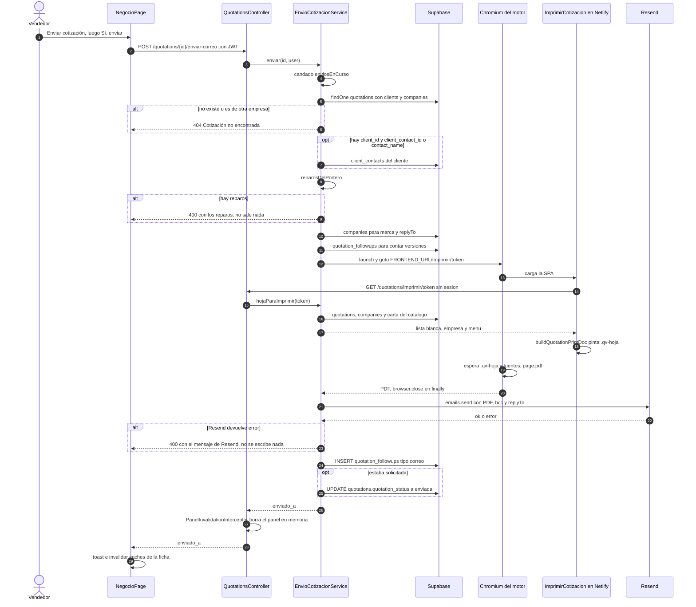

# Flujo: Enviar la cotización por correo con PDF

> **Estado: verificado una vez contra el código** (commit 0de0ddb, 11-09-2026). Falta la etapa de completar lo que no quedó escrito. Parte del atlas; índice de flujos en flujos/00_INDICE_DE_FLUJOS.md y del sistema en ../00_MAPA_DEL_SISTEMA.md.

Documento de arquitectura que manda sobre este flujo: `docs/arquitectura/13_ENVIO_DE_COTIZACIONES.md` (en adelante, "doc 13"). Donde el código y el doc 13 no calzan, se anotan las dos evidencias sin elegir.

## 1. En palabras simples

El vendedor está en la ficha del negocio y aprieta **"Enviar cotización"**. La pantalla le pregunta a qué correo saldrá y él confirma.

El motor revisa tres cosas antes de mandar nada: que haya un correo de destino, que el total no sea $0 y que ningún servicio tenga precio $0. Si algo falla, avisa qué corregir y no sale nada.

Si todo está bien, el motor abre un navegador invisible, entra a la misma hoja de cotización que ve el equipo (con un pase que dura 15 minutos) y la imprime en PDF. Después manda por Resend un correo con la marca de la empresa, el detalle de valores y el PDF adjunto. Si la empresa tiene configurado un buzón "Responder a", las respuestas del cliente llegan ahí y ese buzón recibe además una copia oculta; si no lo tiene, las respuestas van al correo de quien apretó el botón y no hay copia.

Al final anota el envío en la bitácora de Seguimiento. Si la cotización estaba **Solicitada**, la deja **Enviada**; en cualquier otro estado no la toca. Si ya había envíos anteriores, el correo dice "Hemos actualizado tu cotización" y conserva el mismo asunto, para que todo quede en un solo hilo.

## 2. El recorrido paso a paso

**Paso 1. La ficha carga sus datos.** Actúa: persona (cualquier rol con la sección `quotations`).
- Ruta `negocio/:id` en `frontend/src/App.tsx`, protegida por `PermissionGuard` con `SECTION_ROLES.quotations` = `ROLE_GROUPS.RECEPTION_AND_UP` (recepción, vendedor, operaciones, administrador; `frontend/src/constants/permissions.ts`).
- Componente `NegocioPage` (`frontend/src/pages/quotations/NegocioPage.tsx`):
  - `listaQuery`, clave `["quotations", "ficha-lista"]`: llama a `getQuotations` (`frontend/src/services/quotations.service.ts`) → `GET /quotations?request_type=cotizacion&statuses=…` con los siete estados. Pasa por `QuotationsController.findAll` y `QuotationsService.findAll` y termina en `QuotationsRepository.findAll`, que es la lista liviana (sin `items`): `COLUMNAS_LISTA` más `mandante:client_contacts!quotations_client_contact_id_fkey(name)`, `clients(name, email, client_type, contact_person, phone, client_contacts(name, phone, email))` y `companies(name)`.
  - `detalleQuery`, clave `["quotation", id]` con `staleTime: 0`: llama a `getQuotationById` → `GET /quotations/:id` → `QuotationsService.findOne` → `QuotationsRepository.findOne`. Ojo: esa ruta del controller lleva `@Public()` (su comentario dice que la usa la encuesta pública, con un TODO de separarla) y el repositorio no filtra por empresa.
- `fila` es la fila de la lista con ese `id`. Si no aparece (por ejemplo, un requerimiento), la página muestra "No se encontró esta cotización." y no dibuja nada más.
- `contactoDe(fila)` calcula el nombre, teléfono y correo del mandante que se mostrarán en el encabezado y en la confirmación.
- Tablas: solo lectura (`quotations`, `clients`, `client_contacts`, `companies`).

**Paso 2. Botón y confirmación.** Actúa: persona en `NegocioPage`.
- El botón "Enviar cotización" (ícono `Send`) aparece **siempre**, en cualquier estado y para cualquier rol que entre a la ficha. No depende de `puedeEditar` ni del estado: el commit 912c912 (10-09) quitó el filtro `seSigueCotizando` que había agregado 5a0d714 ese mismo día.
- El clic ejecuta `setConfirmandoEnvio(true)`, que muestra `ConfirmInline` con uno de estos textos:
  - "Se enviará el correo con el PDF adjunto a {contacto.email}.", si `contactoDe` encontró correo.
  - "¿Enviar la cotización por correo?", si no lo encontró.
- `busy={enviandoCorreo}` deshabilita los dos botones mientras dura la llamada. Hasta aquí nada viaja al motor.

**Paso 3. La llamada HTTP.** Actúa: pantalla.
- "Sí, enviar" ejecuta `enviarPorCorreo` (en `NegocioPage`), que llama a `enviarCotizacionPorCorreo(fila.id)` (`frontend/src/services/quotations.service.ts`).
- Esta usa `apiRequest` con `POST /quotations/:id/enviar-correo` y cuerpo `{}`.
- Instancia `api` (`frontend/src/services/api.ts`):
  - Adjunta el JWT de Supabase.
  - Ante un 401, refresca la sesión y reintenta una sola vez.
  - **No tiene `timeout` configurado**: la pantalla espera lo que tarde el motor.

**Paso 4. Las puertas del motor.** Actúa: motor NestJS.
- `AuthGuard` (`api-rest/src/auth/auth.guard.ts`) valida el JWT y deja `request.user = { id, company_id, role, email }`. No adjunta `full_name`.
- `ThrottlerGuard` global: 300 peticiones por minuto por IP (`ThrottlerModule.forRoot` en `api-rest/src/app.module.ts`).
- `RolesGuard` (`api-rest/src/auth/roles.guard.ts`): la ruta no tiene `@Roles`, así que basta con tener sesión.
- `QuotationsController.enviarPorCorreo` (`api-rest/src/quotations/quotations.controller.ts`) toma el `id` de la ruta y el usuario con `@CurrentUser()` (`api-rest/src/auth/user.decorator.ts`), escribe el log `POST /quotations/{id}/enviar-correo` y llama a `EnvioCotizacionService.enviar(id, user)`. No declara `@Body`: el `{}` que manda la pantalla no se lee.
- Cableado: `EnvioCotizacionService` está en los `providers` de `QuotationsModule` (`api-rest/src/quotations/quotations.module.ts`), que importa `ClientsModule` (exporta `ClientContactsRepository`), `CompaniesModule` (exporta `CompaniesRepository`) y `QuotationFollowupsModule` (exporta `QuotationFollowupsService`).

**Paso 5. Candado anti doble envío.** Actúa: `EnvioCotizacionService.enviar` (`api-rest/src/quotations/envio-cotizacion.service.ts`).
- Si el id ya está en `enviosEnCurso` (un `Set` en la memoria del proceso), responde 400: "Ya hay un envío de esta cotización en curso: espera unos segundos.".
- Si no está, lo agrega y llama a `enviarDeVerdad`. El `finally` lo saca siempre, salga bien o mal.

**Paso 6. Leer la cotización y validar la empresa.** Actúa: `enviarDeVerdad`.
- `QuotationsRepository.findOne(id)`: `quotations.*` más `clients(name, email)` y `companies(name)`. Este método del repositorio **no filtra por empresa**.
- El candado lo pone el service: si no existe o si `company_id !== user.company_id`, responde 404 "Cotización no encontrada".

**Paso 7. Elegir el destinatario.** Actúa: `EnvioCotizacionService.correoDeDestino`.
- Si hay `client_id` y además (`client_contact_id` o `contact_name`):
  1. Llama a `ClientContactsRepository.findByClient(company_id, client_id)`. Esa clase vive dentro de `api-rest/src/clients/client-contacts.controller.ts`; lee la tabla `client_contacts` filtrada por `company_id` y `client_id`.
  2. Busca el contacto primero por `id === client_contact_id` y después por nombre con `trim().toLowerCase()`, que **sí distingue tildes**.
  3. Si ese contacto tiene correo, se usa ese.
- En cualquier otro caso usa `clients.email` (del join del paso 6).
- Nombre para el saludo: si se usó el correo del contacto, el nombre de ese contacto (o `contact_name`); si se cayó al correo del cliente, `contact_name` y, si está vacío, el nombre del cliente.
- Si la lectura de contactos falla, el error no es `HttpException`: el motor responde 500 antes de llegar al portero.

**Paso 8. El portero del envío.** Actúa: `reparosDelPortero(q, correo)` (`api-rest/src/quotations/correo-cotizacion.ts`).
- Frena en tres casos:
  1. No hay correo de destino.
  2. `total_amount` redondeado es ≤ 0.
  3. Hay un ítem en `items.variable_services[].items[]` o en `items.fixed_services[]` con `precio` vacío o ≤ 0. Nombra hasta tres.
- Si hay reparos, responde 400 con todos los mensajes juntos. **Nada se imprime, nada sale, nada se escribe.**

**Paso 9. La marca.** Actúa: `enviarDeVerdad`.
- `CompaniesRepository.findOne(company_id)` lee `companies.*`. Un error distinto de `PGRST116` se relanza.
- `marcaDesdeFila` (`api-rest/src/marketing/marca.ts`) arma la marca:
  - nombre (o 'Eventia'), logo, banner, tagline, WhatsApp, redes;
  - `colorPrimario` (por defecto `#134686`) y `colorSecundario`;
  - `replyTo`, tomado de `companies.notifications.replyTo`.

**Paso 10. ¿Qué versión es?** Actúa: `enviarDeVerdad`, que usa otro módulo (bitácora).
- `QuotationFollowupsService.findByQuotation(company_id, id)` llama a `QuotationFollowupsRepository.findByQuotation`, que lee `quotation_followups.*` por empresa y cotización.
- Cuenta las notas con `tipo === 'correo'` cuyo `note` empieza con `MARCA_DE_ENVIO` ("Cotización enviada por correo"). `numeroDeVersion` = esa cuenta + 1.
- Si la lectura falla: queda el log "no se pudo leer la bitácora" y el correo sale como versión 1.
- Log: `enviar cotizacion {id} a {correo}`.

**Paso 11. Firmar el pase de impresión.** Actúa: `EnvioCotizacionService.generarPdf`.
- `firmarTokenImpresion(id, secreto, Date.now())` (`api-rest/src/quotations/firma-impresion.ts`):
  - arma `base64url("{id}|{vencimiento}")` + `.` + firma HMAC-SHA256 en base64url;
  - `VIDA_DEL_TOKEN_MS` = 15 minutos.
- Secreto (`EnvioCotizacionService.secreto`): `MARKETING_BAJA_SECRET`; si falta, `RESEND_API_KEY`.
- URL: `FRONTEND_URL` sin barra final (si falta, `https://www.eventi-app.com`) + `/imprimir/{token}` (`EnvioCotizacionService.frontendUrl`).

**Paso 12. Abrir el navegador invisible.** Actúa: `generarPdf`.
- `puppeteer.launch` (`puppeteer-core`):
  - si existe `PUPPETEER_EXECUTABLE_PATH`: Chrome local con `--no-sandbox --disable-dev-shm-usage`;
  - si no: binario de `@sparticuz/chromium` con sus `args`.
  - En ambos casos `headless: true`.
- `page.goto(url, { waitUntil: 'networkidle0', timeout: 45_000 })`.

**Paso 13. La hoja pública en el frontend.** Actúa: el Chromium del motor, dentro del frontend en Netlify.
- `frontend/netlify.toml` reescribe `/*` a `/index.html` (estado 200), así que Netlify sirve la SPA también para `/imprimir/{token}`.
- En `frontend/src/App.tsx`, la ruta pública `/imprimir/:token` queda fuera del `Layout` y sin `PermissionGuard` (sí dentro de `AuthProvider` y del `Suspense` general, como todas). Carga en diferido (lazy) `ImprimirCotizacion` (`frontend/src/pages/quotations/ImprimirCotizacion.tsx`).
- Su `useEffect` llama a `getHojaParaImprimir(token)` (`frontend/src/services/quotations.service.ts`), que usa el mismo `apiRequest` para hacer `GET /quotations/imprimir/:token` contra `VITE_EVENTIA_API_REST`. Ese navegador no tiene sesión de Supabase: el interceptor de `api.ts` no encuentra token y la llamada va sin JWT.

**Paso 14. La puerta pública del motor.** Actúa: motor.
- `QuotationsController.hojaParaImprimir` lleva `@Public()` y `@Throttle({ default: { limit: 30, ttl: 60_000 } })`. Está declarada antes de `@Get(':id')`; el comentario advierte que, si no, "esa ruta se la come".
- CORS: el origen de la hoja tiene que estar en `app.enableCors` (`api-rest/src/main.ts`): `FRONTEND_URL`, `MOVIL_URL`, `https://www.eventi-app.com`, `https://eventia-dev.netlify.app` y los localhost.
- `EnvioCotizacionService.hojaParaImprimir(token)`:
  1. `validarTokenImpresion` compara la firma con `timingSafeEqual` y revisa el vencimiento. Si no vale: 404 sin mensaje.
  2. `QuotationsRepository.findOne(id)`. Si no existe: 404.
  3. `CompaniesRepository.findOne(company_id)`. Aquí no se revisa el error: si falla, la hoja sale con nombre de empresa vacío y sin logo ni colores.
  4. Responde `{ quotation: listaBlancaDeHoja(q), empresa: { name, logo_url, colors }, menu }`, con `menu` = `QuotationsRepository.cartaDelCatalogo(company_id)`.
- `listaBlancaDeHoja` (`api-rest/src/quotations/hoja-publica.ts`) deja pasar solo `quotation_number`, `people_count`, `children_count`, `event_type`, `event_date`, `event_end_date`, `created_at`, `total_amount`, `subtotal_amount`, `tip_percentage`, `observations`, `contact_name`, `items` y `clients.name`. Es la misma lista que usa `QuotationsService.getPortalQuotation` (portal del mandante); el portal le pasa además el nombre del cliente como respaldo y la hoja de impresión no.
- `cartaDelCatalogo` lee `service_categories`, `category_sections` y `variable_service_categories` de la empresa.
- Esta puerta **no revisa empresa ni estado**: la única llave es el token.

**Paso 15. Pintar la hoja.** Actúa: `ImprimirCotizacion`.
- `buildQuotationPrintDoc(quotation, empresa, menu)` (`frontend/src/utils/quotationPrintDoc.ts`) devuelve `{ css, body }`:
  - contenedor `.qv-hoja`;
  - tipografía Inter con `@font-face` desde `fonts.gstatic.com`;
  - fechas del evento en UTC y fecha de emisión (`created_at`) en `America/Santiago`;
  - color primario de la empresa si es `#rrggbb`; si no, `#1e3a8a` (distinto del respaldo del correo, ver sección 8).
- `ImprimirCotizacion` inyecta el `<style>` y el `body` con `dangerouslySetInnerHTML`.
- Si la API falla, muestra "Este enlace no está disponible." **sin** `.qv-hoja`.
- No carga `paged.polyfill.js`; eso solo lo hace `openQuotationPrintWindow` en la impresión manual. En el PDF adjunto, la paginación la hace Chromium con el CSS de impresión.

**Paso 16. Imprimir.** Actúa: `generarPdf`.
- Espera `page.waitForSelector('.qv-hoja', { timeout: 15_000 })`.
- Luego `Promise.race` entre `document.fonts.ready` y 10 segundos.
- `page.pdf({ format: 'a4', printBackground: true, margin: 10mm arriba/abajo, 8mm izquierda/derecha })` entrega un `Buffer`.
- `finally { browser.close() }` cierra el navegador siempre.
- De vuelta en `enviarDeVerdad` se arma el nombre del adjunto: `Cotizacion_N{quotation_number}_{nombre de la marca solo con letras y números}.pdf`. Las letras con tilde se conservan: la expresión borra todo lo que no sea `\p{L}` o `\p{N}`.

**Paso 17. Armar el correo.** Actúa: `correoDeCotizacion(q, marca, destino.nombre, numeroDeVersion)` (`api-rest/src/quotations/correo-cotizacion.ts`).
- Asunto: `Cotización {event_type} {cliente} — {día de semana} {fecha}`, **idéntico en todas las versiones**. La fecha sale de `fechaLargaDelEvento`, en UTC.
- Título: `Cotización N.º {número}`.
- Cuerpo, en orden:
  1. Saludo "Hola {primer nombre}:", con la primera letra en mayúscula.
  2. Párrafo de primera vez ("¡Gracias por cotizar con nosotros!…") o de reenvío ("Hemos actualizado tu cotización…").
  3. Bloque "Valores · Servicios de alimentación" (solo si hay filas): adultos y niños con valor por persona, los grupos parciales en su propia fila y "Subtotal alimentación".
  4. Bloque "Servicios fijos del evento" (solo si hay fijos), con "Subtotal servicios fijos".
  5. Resumen alineado a la derecha: Subtotal y Descuento (si hay descuento), Neto, "IVA (19%)", "Total con IVA" y "Propina sugerida (N% alimentación)" (si hay propina), y TOTAL en la barra del color primario.
  6. Condiciones neutras y cierre.
  7. Sello "Versión enviada el … a las HH:MM h · Cotización N.º {número}" en hora de Chile (`selloDeVersion`).
- Dentro del cuerpo, el color primario solo entra si es `#rrggbb`; si no, se usa `#134686`. La franja de subtotales usa el color secundario solo si es claro; si no, `#f9fafb`. **Ojo:** esa validación vive solo en `correoDeCotizacion`. El envoltorio `plantillaCampana` pinta el encabezado y el pie con `marca.colorPrimario` tal como viene de `marcaDesdeFila`, que solo le quita espacios.
- `totalesDeCotizacion` calca la matemática de la hoja:
  - propina = % sobre alimentación;
  - total con IVA = `total_amount − propina`;
  - neto = total con IVA / 1,19.
- Envoltorio: `plantillaCampana({ marca, titulo, cuerpoHtml, iconosBase: FRONTEND_URL })` (`api-rest/src/marketing/plantilla.ts`):
  - sin `bajaUrl`: no hay línea de baja;
  - sin `cotizarUrl`: no hay botón "Cotiza aquí";
  - sin preencabezado;
  - si la empresa tiene WhatsApp, **sí** aparece el botón "Escríbenos al WhatsApp";
  - los íconos se cargan desde `{FRONTEND_URL}/correo/*.png`.

**Paso 18. Enviar por Resend.** Actúa: `enviarDeVerdad`.
- Llama a `new Resend(RESEND_API_KEY).emails.send` con:
  - `from`: `"{marca.nombre} <hola@eventi-app.com>"`;
  - `to`: `[destino]`;
  - `bcc`: `[marca.replyTo]`, solo si hay `replyTo` y es distinto del destino (sin importar mayúsculas);
  - `subject` y `html`;
  - `attachments`: `[{ filename, content: base64 }]`;
  - `replyTo`: `marca.replyTo` o, si no hay, `user.email`.
- Si Resend devuelve error: 400 con el mensaje de Resend. **Hasta aquí no se escribió nada en la base.**
- Este correo **no pasa por `EmailService.sendEmail`**, así que los interruptores de avisos de la empresa (`EmailService.shouldSendEmail`, `companies.notifications.emails`) no lo afectan.

**Paso 19. Anotar en la bitácora.** Actúa: `enviarDeVerdad`, que usa el módulo `quotation-followups`.
- Llama a `QuotationFollowupsService.create(user, { quotation_id, note, tipo: 'correo' })`, con `note` = "Cotización enviada por correo a {correo}, con el PDF adjunto.". Desde la versión 2 agrega " (versión N)" después del correo.
- El service recorta la nota y valida la empresa con `QuotationFollowupsRepository.findOwnedQuotation` (si no calza, 403, que en este flujo termina en el log de abajo).
- `QuotationFollowupsRepository.create` inserta en `quotation_followups`:
  - `company_id`, `quotation_id`;
  - `author_user_id` = `user.id`;
  - `author_name` = `user.full_name || user.email` (como el `AuthGuard` no adjunta `full_name`, en la práctica queda el correo del usuario);
  - `note`, `tipo` = 'correo', `next_contact_date` = null;
  - `created_at` lo pone la base (`DEFAULT now()` en `docs/migrations/59_bitacora_comercial.sql`).
- Si falla: solo queda el log "bitácora del envío falló". El correo ya salió.
- Es una llamada directa al service, no pasa por el `ValidationPipe` del DTO. Igual, 'correo' está en `@IsIn` de `CreateQuotationFollowupDto`.

**Paso 20. Mover el estado.** Actúa: `enviarDeVerdad`.
- Solo si `q.quotation_status === 'solicitada'` (el valor leído en el paso 6): `QuotationsRepository.update(id, { quotation_status: 'enviada' }, company_id)`. Hace UPDATE de `quotations.quotation_status`, filtrado por `id` y `company_id`.
- **No escribe `sent_at` ni `updated_at`.** No pasa por `QuotationsService.update`, así que tampoco dispara:
  - su correo `QUOTATION_IS_SENT`;
  - su sello de `sent_at`;
  - su candado de recepción.
- Si falla: queda el log "no se pudo marcar como enviada". El correo ya salió.
- En los demás estados no toca nada: enviada, en negociación, aceptada, rechazada, cancelada y realizada.

**Paso 21. Respuesta e interceptor.** Actúa: motor.
- `enviar` saca el id de `enviosEnCurso` y devuelve `{ enviado_a }`.
- `PanelInvalidationInterceptor` (`api-rest/src/cache/panel-invalidation.interceptor.ts`, registrado como `APP_INTERCEPTOR`) ve un POST terminado sin error y llama a `invalidarPanelEmpresa(company_id)`. El panel de análisis de esa empresa se recalcula en la próxima visita.

**Paso 22. De vuelta en la pantalla.** Actúa: `NegocioPage.enviarPorCorreo`.
- `toast.success("Cotización enviada a {enviado_a}.")`. Este es el correo real, que puede ser distinto del que mostró la confirmación (ver sección 8).
- Invalida tres claves de caché:
  - `["followups", id]`: **ninguna consulta usa esa clave**, así que no refresca nada;
  - `["quotation", id]`: vuelve a pedir el detalle;
  - `["quotations", "ficha-lista"]`: vuelve a pedir la lista, y el chip pasa a "Enviada".
- En `finally` apaga `enviandoCorreo` y cierra la confirmación.
- Si hubo error: `toast.error(humanizeApiError(e))` (`frontend/src/utils/apiErrors.ts`).
  - Muestra el `message` del motor: reparos del portero, candado o error de Resend.
  - Ante un fallo no controlado muestra el texto genérico de Nest ("Internal server error"). No hay filtro global de excepciones: no aparecen `useGlobalFilters` ni `APP_FILTER`.
  - Si un mensaje calzara con alguno de los patrones de `FIELD_MESSAGES` (`event_date`, `total_amount`, etc.), se reemplaza por su traducción; los textos de este flujo no calzan.
  - Sin respuesta y con un error que diga "network": "No hay conexión con el servidor. ¿Está corriendo la API?". Con respuesta sin `message` (por ejemplo, un error de proxy sin JSON): el texto por defecto "Revisa los campos obligatorios e intenta de nuevo.", que no tiene nada que ver con el envío.

**Paso 23. Días después (reloj).** Actúa: `QuotationsCronService` (`api-rest/src/quotations/quotations-cron.service.ts`). Los relojes corren solo con `NODE_ENV=production` (`ScheduleModule.forRoot({ cronJobs: … })` en `api-rest/src/app.module.ts`).
- `sendQuotationFollowUps` (`@Cron('0 11 * * *')`, 11:00 UTC) llama a `QuotationsRepository.findFollowUps`, que exige `quotation_status = 'enviada'`, `sent_at` dentro de la ventana del día 7 o del 14 **y** `event_date` desde hoy. El paso 20 no sella `sent_at`, así que **una cotización que pasó a Enviada con este botón no recibe esos dos toques**.
- `sendWeeklyDigest` (`@Cron('0 11 * * 1')`) la cuenta en `pipeline.enviadas` del resumen del lunes.

## 3. Diagrama

## 4. Datos que cambian

| tabla | columnas | en qué paso | quién escribe |
|---|---|---|---|
| `quotation_followups` | INSERT: `company_id`, `quotation_id`, `author_user_id`, `author_name`, `note`, `tipo` = 'correo', `next_contact_date` = null (`created_at` por defecto de la base) | 19 | `QuotationFollowupsService.create` → `QuotationFollowupsRepository.create` |
| `quotations` | `quotation_status`: 'solicitada' → 'enviada' (solo si estaba solicitada) | 20 | `EnvioCotizacionService.enviarDeVerdad` → `QuotationsRepository.update` |
| `quotations` | `sent_at`: **no cambia** (el sello solo lo pone `QuotationsService.update`, migración 51) | 20 | nadie en este flujo |
| `quotations` | `updated_at`: **no cambia** según el código (en `docs/migrations/0_initial_models.sql` es `DEFAULT now()`, que solo aplica al insertar; en `docs/migrations` los únicos triggers son de `people` y `event_staff`, migraciones 68 y 71, ninguno sobre `quotations`) | 20 | nadie en este flujo (ver pregunta abierta) |
| `client_contacts`, `clients`, `companies`, `service_categories`, `category_sections`, `variable_service_categories`, y `quotation_followups` antes de escribir | solo lectura | 1, 6, 7, 9, 10, 14 | — |
| Fuera de la base: `enviosEnCurso` (Set en memoria) | agrega y saca el id | 5, 21 | `EnvioCotizacionService.enviar` |
| Fuera de la base: memoria del panel de análisis | se borra la entrada de la empresa | 21 | `PanelInvalidationInterceptor` → `invalidarPanelEmpresa` |
| Fuera de la base: buzón del cliente y buzón "Responder a" | correo con PDF (Para) y copia oculta (CCO) | 18 | Resend |

## 5. Efectos automáticos y colaterales

**Correos que salen**
- Un correo al destinatario con el PDF adjunto, enviado por Resend directo (no por `EmailService`).
- Copia oculta al "Responder a" de la empresa (`companies.notifications.replyTo`) cuando existe y es distinto del destinatario.
- Las respuestas del cliente van a `replyTo`, o al correo del usuario que envió si la empresa no tiene "Responder a".

**Correos y relojes que NO se disparan (y por qué importa)**
- **No sale** el correo `QUOTATION_IS_SENT` ("Cotización enviada para su evento", `api-rest/src/email/constants/index.ts`). Ese correo lo manda `QuotationsService.update` cuando el estado pasa a Enviada; este flujo usa el repositorio directo.
- **No se sella `sent_at`**. Consecuencias:
  - El reloj `QuotationsCronService.sendQuotationFollowUps` (toques amables de los días 7 y 14, diseño de Felipe del 30-07, commit 9d6d5e2) **no encuentra** estas cotizaciones, porque `QuotationsRepository.findFollowUps` filtra por `sent_at`.
  - `HiloSeguimiento` (`frontend/src/pages/quotations/SeguimientoPanel.tsx`) no pinta su entrada de sistema "Cotización enviada al cliente", que depende de `quotation.sent_at`. Sí aparece la nota de bitácora del paso 19.
- Los interruptores de avisos de la empresa (`EmailService.shouldSendEmail`) **no aplican** a este correo: apagar avisos al cliente en Configuración no lo detiene.
- El resumen semanal `sendWeeklyDigest` contará la cotización en "enviadas" el lunes siguiente.

**Cascadas**
- No hay cascada de plan de pagos, reembolsos ni documentos: ni `QuotationsService.update` ni `PaymentsService` entran en este flujo.

**Cachés del motor**
- `PanelInvalidationInterceptor` borra el panel de análisis de la empresa, solo si el POST terminó bien.
- El perfil del usuario en `AuthGuard` (`cachePerfiles`, 1 hora) no se toca.

**Cachés de la app (React Query, `frontend/src/lib/queryClient.ts`: `staleTime` 30 s, `refetchOnWindowFocus` activo)**
- Se refrescan al instante: `["quotations", "ficha-lista"]` (el chip de estado de la ficha) y `["quotation", id]` (el detalle).
- **Queda desactualizado: el hilo de la bitácora.** `NegocioPage` invalida `["followups", id]`, pero `HiloSeguimiento` usa `["seguimientos", quotation.id]` (búsqueda en `frontend/src`: la clave `"followups"` solo aparece en `NegocioPage`). Como esa consulta tiene `staleTime: 0`, la nota nueva aparece cuando el componente se vuelve a montar (cambiar de pestaña o recargar) o cuando la ventana recupera el foco. El doc 13 dice "Al enviar se refrescan la bitácora, la ficha y la lista"; el código no refresca la bitácora. Lo mismo pasa con la invalidación de `NegocioPage` en el flujo de motivo de pérdida.
- **No se invalidan**:
  - el semáforo `["seguimientos", "map"]` (`QuotationsPage`, `PostVentaPage`);
  - el tablero `["quotations", "embudo-y-rechazadas"]`;
  - el calendario `["quotations", "calendar"]`;
  - la búsqueda de cerradas `["quotations", "cerradas-busqueda"]`.
  
  Se ponen al día cuando se vuelven a montar con datos de más de 30 segundos o con el foco de ventana.

**Registros (logs)**
- El motor escribe el correo del destinatario (`enviar cotizacion {id} a {correo}`).
- El controller de la hoja escribe "token oculto", pero `LoggerModule` solo redacta `req.headers.authorization` y `req.headers.cookie` (`api-rest/src/app.module.ts`). Si pino-http registra la URL de cada petición, el token de impresión quedaría en el log. Ver preguntas abiertas.

**Infraestructura**
- Un Chromium por envío, cerrado en `finally`. El doc 13 estima "~300–400 MB por impresión" y pide monitorear la memoria en Railway.
- Cada envío hace que el frontend en Netlify sirva la SPA y que la hoja pida su API.

## 6. Reglas de negocio que gobiernan el flujo

1. **Una sola plantilla de PDF.** El motor no dibuja un segundo PDF: imprime la hoja de `buildQuotationPrintDoc`, la misma del visor (`QuotationViewer`) y del portal. Evidencia: doc 13, "La regla de oro"; comentarios de `EnvioCotizacionService` y `ImprimirCotizacion`.
2. **Correo determinista, sin LLM.** Doc 13, "Decisiones de alcance". Las reglas de la skill de correos están hechas código en `correoDeCotizacion`: día de semana calculado, sin guion largo en el cuerpo, sin "no dudes", sin promesa de bloqueo de fecha. La prueba `correo-cotizacion.spec.ts` ("sin guion largo ni promesas de bloqueo en el cuerpo") lo protege.
3. **El botón de Outlook se eliminó (05-09).** Felipe, validando en el laboratorio: "me gusta el botón pero eliminaria el botón correo". Evidencia: doc 13 y el comentario en `NegocioPage` ("El botón de Outlook vivió aquí hasta el 05-09-2026").
4. **El portero tiene tres frenos y ninguno es por estado.** Sin correo, total $0 o servicio en $0. Doc 13: "Sin frenos por estado de la cotización: quien aprieta el botón decide". Código: `reparosDelPortero`.
5. **Destinatario: primero el contacto, después el cliente.** Doc 13, "El destinatario". Código: `correoDeDestino`. La versión de la pantalla (`contactoDe`) no es idéntica (ver secciones 7 y 8).
6. **Copia oculta al "Responder a" (Felipe, 08-09-2026, commit 86ed9e8).** Así ese buzón guarda la conversación completa. Es oculta a propósito: en copia visible, "responder a todos" pondría el buzón dos veces. Si el destino es ese mismo buzón, no se duplica. Evidencia: comentario en `enviarDeVerdad` y pruebas de `envio-cotizacion.service.spec.ts`.
7. **Hilo único: el mismo asunto en todas las versiones (Felipe, 05-09).** Sus palabras: "puede estar bien que esté en el mismo hilo toda la conversación". El 05-09 se probó un asunto por versión (84d93cb, "Cotización actualizada … (vN)") y ese mismo día se volvió al asunto idéntico (e2afb75). Lo que distingue las versiones es el sello de fecha y hora al pie; los "..." de Gmail son un costo cosmético asumido. Evidencia: comentarios en `correoDeCotizacion` y `enviarDeVerdad`. **Contradicción documento/código:** el encabezado del doc 13 todavía dice que de la validación salió el reenvío con "asunto propio"; el código usa el mismo asunto en todas las versiones (`correoDeCotizacion`, commit e2afb75, posterior a 84d93cb).
8. **El reenvío avisa la actualización.** Desde la versión 2, el correo abre con "Hemos actualizado tu cotización… el PDF adjunto reemplaza al anterior" (commit 6c86afc, 05-09). La versión se calcula desde la bitácora, con `MARCA_DE_ENVIO`.
9. **El estado se mueve solo en la primera salida (Felipe, 10-09-2026).** Sus palabras: "cuando alguien aprieta el botón enviar cotización debería cambiarse automáticamente el estado a enviada… si ya está enviada no hacer nada, si aparece en negociación y es un correo de ajuste o actualización mantenerse en el estado que está". Código: `ESTADO_ANTES_DE_ENVIAR` / `ESTADO_TRAS_ENVIAR` en `envio-cotizacion.service.ts`.
10. **El botón no se toca (Felipe, 10-09).** Sus palabras: "el botón no hay que tocarlo… es la única acción que debe tener el apretar el botón". El commit 912c912 revirtió el filtro por estado que había agregado 5a0d714.
11. **Siempre Neto + IVA + TOTAL, nunca el neto solo.** La propina se descuenta del total antes de calcular el IVA, como en la hoja. El bloque va alineado a la derecha en todos los clientes de correo (Felipe, 09-09, commit 2d6b751). Evidencia: `totalesDeCotizacion` y el comentario de `bloqueResumen`.
12. **Fechas.** Las del evento van en UTC medianoche (`fechaLargaDelEvento` con `timeZone: 'UTC'`); el sello de versión va en hora de Chile (`selloDeVersion` con `America/Santiago`). La hoja hace lo mismo (`quotationPrintDoc.ts`).
13. **Token de impresión.** HMAC-SHA256 con 15 minutos de vida; si está vencido o adulterado, responde 404 "sin pistas, igual que el portal" (`firma-impresion.ts`). La lista blanca es compartida con el portal: "Los costos internos jamás pasan por aquí" (`hoja-publica.ts`).
14. **Si falla lo que viene después del envío, no se rompe.** Si fallan la bitácora o el marcado de estado, el correo ya salió: queda en el log y no se lanza error (comentarios en `enviarDeVerdad`; pruebas "si la bitácora falla…" y "si marcar el estado falla…").
15. **Blindajes de la revisión del 06-09** (commits ceb49f9 y 116f0e2; el mensaje de cada uno dice que Felipe los aprobó):
    - candado anti doble envío (`enviosEnCurso`), 116f0e2;
    - tope de 10 s a la espera de fuentes, ceb49f9 (su mensaje: "un CDN pegado colgaba el envío para siempre");
    - color primario validado `#rrggbb` dentro del cuerpo del correo, 116f0e2 (el envoltorio `plantillaCampana` no lo valida, ver paso 17);
    - escape canónico `escaparHtml` (`api-rest/src/email/templates/utils/index.ts`), 116f0e2;
    - `MARCA_DE_ENVIO` como constante compartida entre la nota y el conteo, 116f0e2.
16. **Plantilla armada en tablas para Outlook de escritorio (Felipe, 10-09-2026).** Lo pidió al ver "las respuestas se están viendo así": franjas grises y botones aplastados. Evidencia: comentario en `plantillaCampana`. Esta plantilla la comparten Marketing, el embudo de consultas y este correo.
17. **Chromium en Railway.** Doc 13 (encabezado): el motor necesita las librerías declaradas en `RAILPACK_DEPLOY_APT_PACKAGES` ("sin ellas Chromium no arranca o imprime sin letras"). El mismo doc 13, en su sección "Chromium en Railway", dice que `@sparticuz/chromium` "trae el binario y sus librerías empaquetadas — no hay que tocar la imagen de Nixpacks ni agregar configuración a Railway". **El documento se contradice a sí mismo**; el repositorio no tiene archivo de configuración de Railway que lo resuelva.

## 7. Si cambias algo en este flujo

1. **Si cambias** el texto de `MARCA_DE_ENVIO` o el comienzo de la nota de bitácora, **pasa** que los reenvíos vuelven a salir como primera vez ("¡Gracias por cotizar…!") y sin "(versión N)", **porque** la versión se calcula contando notas `tipo = 'correo'` que empiezan con ese texto. Evidencia: el comentario de `MARCA_DE_ENVIO` ("cambiarla rompe el conteo de las notas históricas: no tocar sin migrar los textos"; hoy quedó separado de su constante, encima de `ESTADO_ANTES_DE_ENVIAR`) y `enviarDeVerdad`.
2. **Si cambias** la clase `.qv-hoja` o pintas algo con esa clase mientras la hoja carga o falla, **pasa** que el motor imprime una hoja vacía o de error, o espera 15 s y aborta el envío, **porque** `generarPdf` usa `waitForSelector('.qv-hoja')` como señal de que llegaron los datos. Evidencia: comentario de `ImprimirCotizacion` ("no renderizar nada con esa clase en los estados de carga o error").
3. **Si quitas** el tope de 10 s a `document.fonts.ready`, **pasa** que un CDN de fuentes pegado cuelga el envío sin límite, **porque** era la única espera sin tope del método. Evidencia: comentario en `generarPdf` y commit ceb49f9 (revisión del 06-09).
4. **Si quitas** `enviosEnCurso`, **pasa** que un doble clic o un reintento del proxy duplica el correo al cliente, **porque** el PDF tarda varios segundos. Evidencia: comentario "Cotizaciones con un envío EN CURSO (revisión 06-09)". Ojo: el candado vive en la memoria de UN proceso (ver sección 8).
5. **Si cambias** el asunto para que varíe por versión, **pasa** que se rompe el hilo único que Felipe decidió, **porque** el cliente vería cada versión en una conversación distinta. Evidencia: 84d93cb y e2afb75 (05-09); prueba "el reenvío conserva el asunto (hilo único)…".
6. **Si cambias** la copia oculta a copia visible (CC), **pasa** que "responder a todos" pone el buzón dos veces, **porque** ya está como Responder-a. Evidencia: comentario en `enviarDeVerdad` (Felipe, 08-09) y la prueba que exige `cc` indefinido.
7. **Si cambias** `plantillaCampana`, **pasa** que cambian a la vez el correo de cotización, las campañas de Marketing y el correo del embudo; y si dejas de usar tablas, Outlook de escritorio vuelve a mostrar franjas grises y botones aplastados, **porque** es una pieza compartida y Outlook dibuja con el motor de Word. Evidencia: comentarios en `plantilla.ts` (10-09 y 05-09).
8. **Si mandas** el cambio de estado por `QuotationsService.update` en vez de por el repositorio, **pasa** lo siguiente según el código:
   - sale además el correo `QUOTATION_IS_SENT` al mandante (dos correos seguidos), si `resolveRecipient` encuentra destinatario y los avisos de la empresa no lo apagan (`EmailService.shouldSendEmail`);
   - se sella `sent_at`, con lo que se encienden los toques de los días 7 y 14;
   - recepción recibe 403 si la cotización no es requerimiento;
   
   **porque** `QuotationsService.update` hace esas tres cosas al pasar a Enviada. **Contradicción documento/código:** el doc 13 y el comentario del service dicen que se evita ese camino porque "dispara la CASCADA del plan de pagos". En `QuotationsService.update`, la cascada de pagos solo corre cuando la cotización *guardada* está Aceptada o cuando se vuelve de post-venta a pre-venta, y ninguna aplica a Solicitada → Enviada.
9. **Si dejas** el marcado como está (por repositorio), **pasa** que las cotizaciones que pasan a Enviada con el botón nunca reciben los toques de los días 7 y 14, **porque** `QuotationsRepository.findFollowUps` filtra por `sent_at` y este flujo no lo escribe. Evidencia: `enviarDeVerdad`, `findFollowUps` y `docs/migrations/51_seguimiento_sent_at.sql` ("la llena el backend al marcar 'enviada'").
10. **Si cambias** la regla del destinatario en un solo lado (`contactoDe` en `NegocioPage` o `correoDeDestino` en el motor), **pasa** que la confirmación promete un correo y el envío sale a otro, **porque** ya hoy no son idénticas (ver sección 8). El doc 13 dice que la regla "se replica en el motor". Hay además otras dos variantes: `QuotationsService.resolveRecipient` (correos `QUOTATION_IS_SENT` y encuesta) y `findContactById` en el reloj de seguimiento.
11. **Si agregas** un campo nuevo a la hoja (`PrintQuotation` / `buildQuotationPrintDoc`), **pasa** que el visor interno lo muestra, pero el PDF adjunto y el portal no, **porque** las puertas públicas solo devuelven `listaBlancaDeHoja`. Y **si agregas** a esa lista un campo de costos, **pasa** que se filtra al cliente por el portal y por el PDF. Evidencia: `hoja-publica.ts` ("Una sola lista para ambas puertas").
12. **Si cambias** la matemática o las filas de la hoja (`quotationPrintDoc.ts`), **pasa** que el cuerpo del correo deja de coincidir con el PDF adjunto, **porque** `totalesDeCotizacion` y `correoDeCotizacion` son un calco manual. Evidencia: comentario de `correo-cotizacion.ts` ("Si la hoja cambia, este archivo cambia con ella").
13. **Si cambias** `FRONTEND_URL` del motor, o el `VITE_EVENTIA_API_REST` del frontend al que apunta, **pasa** que el navegador invisible abre una hoja que le pregunta a OTRO motor. Ese motor no reconoce el token (otro secreto) o no tiene la cotización, responde 404, la hoja muestra "Este enlace no está disponible" y el envío aborta en `waitForSelector`, **porque** la firma y la verificación tienen que ocurrir en el mismo motor. Si `FRONTEND_URL` falta, el código usa `https://www.eventi-app.com`, que es producción. El origen de la hoja también tiene que estar en `enableCors` (`main.ts`).
14. **Si cambias** `MARKETING_BAJA_SECRET`, **pasa** que los tokens de impresión en vuelo (máximo 15 minutos) dejan de valer, y también cambian las firmas de las bajas de Marketing, **porque** el secreto es compartido (`EnvioCotizacionService.secreto` y `api-rest/src/marketing/bajas.service.ts`).
15. **Si quitas** las librerías de navegador del ambiente de Railway, **pasa** que Chromium no arranca o imprime sin letras, según el encabezado del doc 13. Evidencia: doc 13 y la memoria del proyecto ("ojo librerías RAILPACK del chromium y memoria Railway"). La contradicción interna del doc está en la sección 6, regla 17.
16. **Si abres** varios envíos en paralelo o quitas el `finally { browser.close() }`, **pasa** que la memoria del motor se dispara, **porque** cada impresión levanta un Chromium de unos 300–400 MB (doc 13, "Riesgo conocido: memoria"). **Contradicción documento/código:** el doc 13 (paso 4 del circuito) dice "un envío a la vez", pero `enviosEnCurso` solo bloquea la MISMA cotización; dos cotizaciones distintas pueden imprimir al mismo tiempo, cada una con su Chromium.
17. **Si bajas** el `@Throttle` de 30 por minuto de `hojaParaImprimir` o aumenta mucho el volumen, **pasa** que las impresiones que excedan el límite reciben 429, la hoja no pinta y el envío falla, **porque** todas las impresiones salen desde la IP del motor. Evidencia: decorador en `QuotationsController.hojaParaImprimir` y `trust proxy` en `main.ts`.
18. **Si corriges** la clave de caché en `NegocioPage` (`["followups", id]` → `["seguimientos", id]`), **pasa** que la nota del envío aparece al instante en el hilo, **porque** hoy la invalidación no calza con ninguna consulta.
19. **Si agregas** `@Roles` a `enviarPorCorreo` o condicionas el botón a `puedeEditar`, **pasa** que recepción deja de poder enviar. Hoy puede enviar y, de paso, mover Solicitada → Enviada, algo que `QuotationsService.update` le prohíbe en cotizaciones.

## 8. Casos borde y estados raros

**Fallas a mitad de camino**
- **El portero frena:** 400 con todos los reparos. No se imprime, no sale correo, no se escribe nada. Reintentar es seguro.
- **Falla la lectura de contactos (paso 7) o la de la empresa (paso 9, con error distinto de `PGRST116`):** error no controlado, 500 genérico ("Internal server error"). No se imprime, no sale nada. Reintentar es seguro.
- **Chromium no arranca, `goto` supera 45 s o `.qv-hoja` no aparece en 15 s:** la excepción no es `HttpException`, así que el motor responde el 500 genérico y la pantalla muestra "Internal server error". No sale correo ni se escribe nada. Reintentar es seguro.
- **Resend rechaza:** 400 con el mensaje de Resend. El PDF se generó pero se descarta; no se escribe nada. Reintentar es seguro.
- **Resend aceptó pero la conexión HTTP se corta** (proxy, red del vendedor): el motor sigue, escribe la bitácora y el estado, pero la pantalla muestra error. Si el vendedor reintenta:
  - con el primer envío aún en curso, recibe el 400 del candado;
  - si ya terminó, **sale un segundo correo al cliente** como "versión 2" ("Hemos actualizado tu cotización").
  
  La instancia `api` del frontend no tiene `timeout`; el del proxy de Railway no está en el código.
- **Falla la bitácora después del envío:** el correo salió y queda solo un log. El siguiente envío contará una versión menos (puede volver a decir "¡Gracias por cotizar…!").
- **Falla el marcado de estado:** el correo salió y la cotización sigue Solicitada; el siguiente envío lo vuelve a intentar.
- **Falla la lectura de la bitácora (paso 10):** el correo sale como versión 1 aunque haya envíos previos.

**Repeticiones y concurrencia**
- **Doble clic:** `ConfirmInline` con `busy` deshabilita los botones, y `enviosEnCurso` protege en el motor.
- **Dos personas a la vez sobre la misma cotización:** la segunda recibe 400 mientras la primera esté en curso, pero **solo si ambas peticiones caen en el mismo proceso**. `enviosEnCurso` es memoria local; si Railway corre más de una instancia o el proceso se reinicia, no protege. El código no dice cuántas instancias hay.
- **Dos envíos seguidos a propósito:** el segundo sale como versión 2, con el mismo asunto y un sello de hora distinto. Es el comportamiento esperado.
- **Cambio manual de chip + botón:** si alguien pasa la cotización a Enviada con el chip de la ficha (`cambiarEstado` → `updateQuotation` → `PATCH /quotations/:id` → `QuotationsService.update`), el mandante recibe `QUOTATION_IS_SENT` y queda sellado `sent_at`. Si después aprieta el botón, recibe además el correo con PDF. Si el orden es al revés (botón primero), no hay `QUOTATION_IS_SENT` ni `sent_at`.
- **Editar o borrar la nota de bitácora del envío:** su autor (el usuario que envió) puede hacerlo (`QuotationFollowupsService.update` / `remove` con `assertAuthor`), y eso cambia el conteo de versiones. Una nota manual de tipo "correo" que empiece con "Cotización enviada por correo" también cuenta como envío.

**Destinatario: la pantalla y el motor no calculan igual**
- `contactoDe` (pantalla):
  - Con `contact_name`, busca en `clients.client_contacts` con `normalizeText` (sin tildes, en minúsculas) y usa el correo de ese contacto, **sin respaldo** al correo del cliente.
  - Sin `contact_name`, usa `clients.email`.
- `correoDeDestino` (motor): busca por `client_contact_id` y, si no, por nombre con `trim().toLowerCase()` (**con tildes**). Si el contacto no tiene correo, **cae al correo del cliente**.
- **Cotización con `client_contact_id` pero sin `contact_name`:** la pantalla muestra y promete `clients.email`; el motor busca el contacto por su id y, si ese contacto tiene correo, envía ahí.
- **Mandante sin correo:** la pantalla pregunta "¿Enviar la cotización por correo?" sin decir a quién, y el motor envía al correo general del cliente. El vendedor lo descubre recién en el toast.
- **Nombre del mandante con tildes distintas** a las del contacto guardado (por ejemplo "Maria" y "María"): la pantalla encuentra al contacto y muestra su correo. `resolveContactId` probablemente no lo vinculó, porque también compara con tildes, y el motor no lo calza por nombre, así que envía al correo general del cliente. **La confirmación prometió un correo y salió a otro.**

**Datos incompletos o raros**
- **Cotización de otra empresa:** 404.
- **Cotización borrada entre el paso 6 y la impresión:** la hoja pública responde 404, no aparece `.qv-hoja` y el envío aborta.
- **Sin `client_id`:** no se buscan contactos; se usa `clients.email` del join, que puede venir vacío, y entonces frena el portero.
- **Grupos variables sin ítems:** el portero no los cuenta como reparo; solo exige total mayor que 0.
- **`event_date` vacío:** `CreateQuotationDto` lo exige, pero si una fila vieja lo tuviera nulo, `fechaLargaDelEvento` armaría una fecha de 1970 en el asunto. No se verificó si existen filas así.
- **Estados cerrados (aceptada, rechazada, cancelada, realizada):** el botón está y el envío funciona; el estado no se toca. El candado del evento realizado vive en `QuotationsService.update`, que este flujo no usa.
- **Requerimientos:** la ficha solo carga `request_type` COTIZACION, así que para un requerimiento `fila` es null: la página muestra "No se encontró esta cotización." y el botón ni aparece. El motor no revisa `request_type`: una llamada directa a la ruta sí enviaría.
- **Empresa sin color primario válido:** el PDF usa `#1e3a8a` (`buildQuotationPrintDoc`) y el cuerpo del correo `#134686` (`correoDeCotizacion`): dos azules distintos en el mismo envío. Si el color guardado viene malformado, el cuerpo lo reemplaza, pero el encabezado y el pie de `plantillaCampana` lo usan tal cual.
- **Empresa sin "Responder a":** no hay copia oculta y las respuestas van al correo del usuario que envió.
- **Empresa con WhatsApp configurado:** el correo lleva el botón "Escríbenos al WhatsApp".
- **El token de impresión es un pase de solo lectura:** durante 15 minutos cualquiera que lo tenga ve la lista blanca de esa cotización.

## 9. Pruebas que protegen el flujo y huecos

**Pruebas existentes (Jest, motor)**
- `api-rest/src/quotations/tests/unit/envio-cotizacion.service.spec.ts`. Con Chromium y Resend simulados, prueba la orquestación:
  - circuito feliz (PDF adjunto, navegador cerrado, correo al contacto, asunto con la fecha, nombre del archivo, `replyTo` del vendedor sin copia, nota `tipo: 'correo'`);
  - respaldo al correo del cliente;
  - copia oculta al "Responder a", y sin duplicar cuando el destino es ese buzón (sin importar mayúsculas);
  - el portero frena antes de imprimir;
  - cotización de otra empresa: 404;
  - versión 2 con "Hemos actualizado tu cotización", y una nota previa de otro tipo no cuenta como envío;
  - la bitácora que falla no rompe;
  - Solicitada → Enviada, y el estado no se mueve en enviada, en negociación, aceptada ni rechazada (`it.each`; cancelada y realizada no se prueban);
  - el marcado que falla no rompe;
  - token basura en la hoja pública: 404.
- `api-rest/src/quotations/tests/unit/correo-cotizacion.spec.ts`:
  - el portero (sin reparos, y los tres frenos);
  - la matemática de la hoja (neto + IVA, propina);
  - el correo tipo: asunto con día de semana calculado, saludo, estructura de valores, propina, hilo único con sello de versión, sin guion largo ni promesa de bloqueo;
  - el token: firma y validación, vencido o adulterado.
- `api-rest/src/quotations/tests/quotations.controller.spec.ts`: solo registra un simulacro de `EnvioCotizacionService`; no prueba las rutas.
- `api-rest/src/quotation-followups/tests/`: pruebas del service y controller de la bitácora.
- Regla de CLAUDE.md: el chequeo de tipos del motor se corre dentro de `api-rest/` (`npx tsc --noEmit -p tsconfig.json`); desde la raíz no revisa nada y pasa en verde (en CLAUDE.md, "checks NOTHING").

**Huecos**
- Nada prueba que Chromium imprima de verdad, ni con las librerías de Railway.
- El frontend no tiene suite de pruebas (CLAUDE.md): sin cobertura para `ImprimirCotizacion`, `contactoDe`, la confirmación ni las invalidaciones de caché. Tampoco nada detecta la clave `["followups", id]` que no calza.
- Nada prueba que `contactoDe` y `correoDeDestino` elijan el mismo correo.
- Nada prueba el candado `enviosEnCurso` (doble envío simultáneo).
- Nada prueba `sent_at`, ni la relación con el reloj de seguimiento de los días 7 y 14.
- Nada prueba el camino feliz de `hojaParaImprimir` (token válido → lista blanca, empresa, menú), ni que `listaBlancaDeHoja` excluya costos.
- Nada prueba el orden de rutas `imprimir/:token` antes de `:id`, ni `@Public` y `@Throttle` de la hoja.
- Nada prueba que un error de Resend corte el flujo antes de escribir la bitácora y el estado: el simulacro de Resend siempre responde `{ error: null }`.
- Nada prueba el texto de la nota con "(versión N)".
- Nada prueba el nombre del adjunto con marcas que tengan símbolos, ni el botón de WhatsApp dentro del correo.
- El e2e (`api-rest/test/app.e2e-spec.ts`) es el de fábrica ("Hello World") y no cubre nada de este flujo.

## 10. Preguntas abiertas

1. **`sent_at` y los toques de los días 7 y 14.** ¿El botón debería sellar `sent_at` al pasar Solicitada → Enviada? Hoy no lo hace (`enviarDeVerdad`), así que el reloj `sendQuotationFollowUps` nunca les escribe a esas cotizaciones (`findFollowUps`). Ni el doc 13 ni el commit 5a0d714 lo mencionan.
2. **¿Por qué el repositorio y no `QuotationsService.update`?** El doc 13 dice que es para evitar "la cascada del plan de pagos". En el código, esa transición por el service no toca pagos: dispararía el correo `QUOTATION_IS_SENT` y el sello `sent_at`. ¿El motivo real era no mandar dos correos? Hay que confirmarlo con Felipe y actualizar el doc 13.
3. **¿Recepción debe poder enviar?** No tiene `@Roles` ni `puedeEditar`, y al enviar mueve el estado de una cotización, algo que `QuotationsService.update` le prohíbe.
4. **¿Se unifica la regla del destinatario?** Hoy hay cuatro variantes: `contactoDe`, `correoDeDestino`, `resolveRecipient` y `findContactById` del reloj. Difieren en tildes y en si caen o no al correo del cliente.
5. **El hilo de la bitácora tras enviar.** Hay que verificar en la app si la nota aparece sin recargar. El código invalida `["followups", id]` y el hilo usa `["seguimientos", id]`; el doc 13 dice que la bitácora se refresca.
6. **Librerías de Chromium en Railway.** ¿Está declarado `RAILPACK_DEPLOY_APT_PACKAGES` en laboratorio y producción? El doc 13 dice las dos cosas y el repositorio no tiene configuración de Railway. No se revisó Railway (fuera del alcance de esta tarea).
7. **¿Cuántas instancias del motor corren en Railway?** Si son más de una, `enviosEnCurso` no evita el doble envío entre instancias.
8. **¿Qué tiempo límite tiene el proxy de Railway** para un POST que tarda varios segundos (hasta 45 + 15 + 10 s de esperas, más Resend)? No está en el código.
9. **¿pino-http registra la URL completa de `GET /quotations/imprimir/:token`?** La redacción configurada solo cubre `authorization` y `cookie`. También queda en el log el correo del destinatario.
10. **¿El botón de WhatsApp dentro del correo es deseado?** El doc 13 dice "sin botones de campaña"; `plantillaCampana` lo agrega igual cuando la empresa tiene WhatsApp.
11. **¿Es intencional que este correo ignore los interruptores de avisos al cliente** (`EmailService.shouldSendEmail`)?
12. **¿`quotations.updated_at` tiene algún trigger en la base real?** En `docs/migrations` no aparece, y este flujo no lo escribe. No se consultó la base (prohibido en esta tarea).
13. **`FRONTEND_URL` ausente en un ambiente** hace que el motor imprima contra `https://www.eventi-app.com` (producción). ¿Está definida en laboratorio? `api-rest/src/config/validate-env.ts` solo la marca como IMPORTANTE (advertencia), no como crítica.
