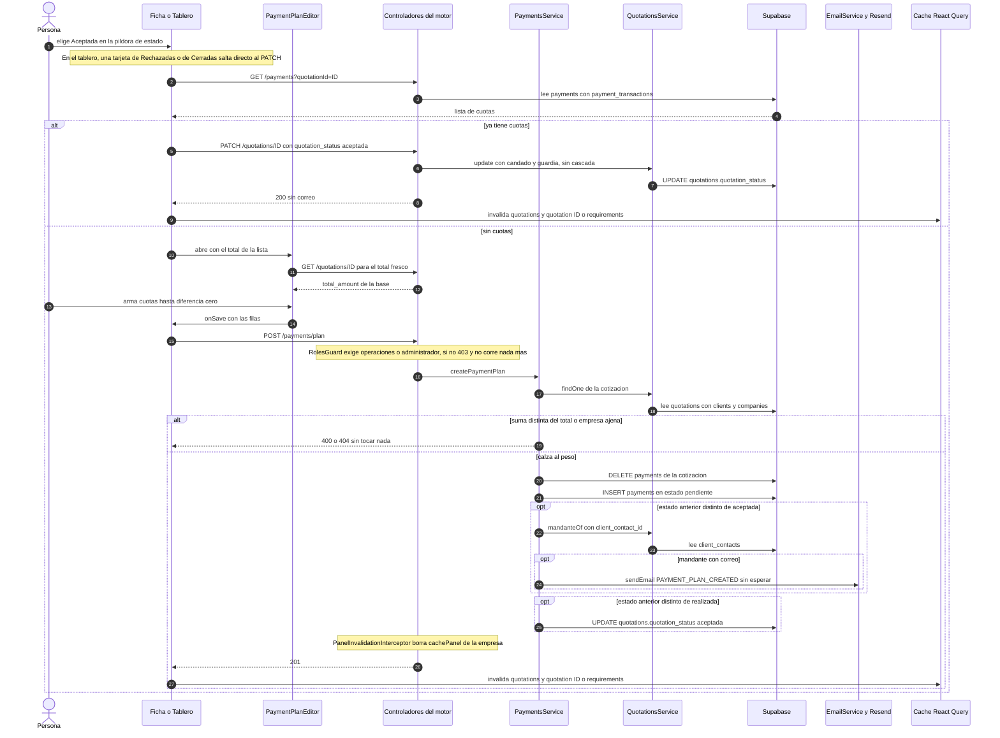

# Flujo: Aceptar una cotización y crear su plan de pagos
> **Estado: verificado una vez contra el código** (commit 0de0ddb, 11-09-2026). Falta la etapa de completar lo que no quedó escrito.

> Verificado contra el código en el commit 0de0ddb (rama `pruebas`) el 11-09-2026, con una segunda pasada escéptica el mismo día. Parte del atlas: el índice de flujos (`00_INDICE_DE_FLUJOS.md`, en esta misma carpeta) y el mapa del sistema (`../00_MAPA_DEL_SISTEMA.md`) están previstos, pero **aún no existían** al verificar. El flujo siguiente, cambiar el total de un evento aceptado, está en `05_CAMBIAR_TOTAL_DE_EVENTO_ACEPTADO.md`.

## 1. En palabras simples

El cliente dijo que sí. Quien vende cambia el estado a **Aceptada** desde la ficha del negocio o desde el tablero de Cotizaciones.
Si el evento todavía no tiene cuotas, se abre el editor del plan de pagos con una sola cuota por el total. Se puede partir en varias cuotas, cada una con comentario, fecha y monto.
El motor no deja guardar un plan que no sume, al peso, el total que tiene la cotización en la base en ese momento.
Al guardar, el motor borra las cuotas anteriores, crea las nuevas, le escribe al mandante con su plan y deja la cotización Aceptada.
Desde ahí el evento aparece en Post-Venta (que se arma con las cuotas, no con el estado), en Calendario, Compras y Mobiliario, Personas, el Dashboard y el portal del cliente, y entra al ciclo automático de cobranza.
Si la cotización ya tenía cuotas (por ejemplo, un guardado anterior alcanzó a crearlas pero no a cambiar el estado, paso 13), no se abre el editor: solo cambia el estado y no sale correo.
En el tablero hay además una puerta sin editor: una rechazada o una anulada que se acepta desde su franja o desde la búsqueda cambia de estado directo, sin mirar cuotas (paso 3).

## 2. El recorrido paso a paso

1. **Quién puede partir.**
   - Persona con rol `vendedor`, `operaciones` o `administrador`. En pantalla la puerta es `SECTION_ROLES.quotations_edit = ROLE_GROUPS.SALES_AND_UP` (`frontend/src/constants/permissions.ts`), usada como `puedeEditar` en `QuotationsPage.tsx` y `NegocioPage.tsx`. Sin ese permiso la píldora de estado solo informa.
   - Ojo: guardar el plan (paso 8) exige `operaciones` o `administrador` en el motor. Un vendedor llega hasta el editor y recién ahí rebota (secciones 7 y 8).

2. **Puerta A: la ficha del negocio** (persona en `/negocio/:id`).
   - Archivo: `frontend/src/pages/quotations/NegocioPage.tsx`, componente `NegocioPage`. La fila sale de `listaQuery` (clave `["quotations","ficha-lista"]`, `getQuotations` tipo cotización con los siete estados). El detalle sale de `detalleQuery` (`["quotation", id]`, `staleTime 0`).
   - El chip de estado abre menú solo si el estado actual está en `ESTADOS_VIVOS_FICHA` (solicitada, enviada, en_negociacion, rechazada). El menú ofrece solicitada, enviada, en_negociacion, aceptada y rechazada. Anulada (`cancelada`) no va: "es destino exclusivo de lo aceptado (regla de Felipe 04-08)".
   - Elegir Aceptada llama `cambiarEstado('aceptada')` → paso 4.

3. **Puerta B: el tablero de Cotizaciones** (persona en `/quotations`).
   - Archivo: `frontend/src/pages/quotations/QuotationsPage.tsx`, componente `QuotationsPage`, pieza `estadoPill` con sus opciones `statusOptionsFor`. Un realizado no ofrece salida. Anulada solo aparece para una aceptada vista por administrador, o si ya estaba anulada.
   - La píldora vive en tres lugares:
     - las tarjetas de las tres columnas del embudo (solicitada, enviada, en negociación);
     - la franja plegada de Rechazadas;
     - la lista "Cerradas que coinciden" que aparece al buscar (clave `["quotations","cerradas-busqueda"]`: aceptada, cancelada, realizada).
   - No hay columna Aceptada: arrastrar una tarjeta (`onDrop`) no sirve para aceptar.
   - Elegir Aceptada llama `handleStatusChange` → `applyStatusChange(quotationId, 'aceptada')`.
   - **Hueco de esta puerta.** La rama de aceptación de `applyStatusChange` solo corre si la cotización está en `quotations`. Esa variable es solo la lista de las tres columnas vivas: las rechazadas se filtran y las cerradas nunca están. Una tarjeta de la franja de Rechazadas o de "Cerradas que coinciden" salta directo al parche genérico del paso 5, sin revisar cuotas ni abrir el editor (sección 8).

4. **Detección de plan existente** (la hace el navegador, no el motor).
   - `cambiarEstado` (ficha) y `applyStatusChange` (tablero) llaman `getPaymentsByQuotationId(id)` de `frontend/src/services/payments.service.ts`.
   - Endpoint `GET /payments?quotationId={id}` → `PaymentsController.findAllPaymensFromQuotation` → `PaymentsService.findAllPaymentsFromQuotation` → `PaymentsRepository.findAllPaymentsFromQuotation`.
   - Lee `payments` con `quotations(company_id, quotation_number, clients(name))` y `payment_transactions`, pone `.eq('quotations.company_id', companyId)` y ordena por `payment_number`. No escribe nada.
   - Ojo con ese filtro: la relación `quotations` va sin `!inner` (a diferencia de `findAllPaymentsWithTransactions`, que sí usa `quotations!inner`). Por cómo trabaja PostgREST, un filtro sobre una relación sin `!inner` vacía la relación pero no descarta las filas de `payments`. Deducido, no probado (sección 10).
   - El servicio del frontend desenvuelve la respuesta `{ data, error }` y devuelve la lista. Hasta el 06-09 devolvía la caja y "el plan ya existía" nunca se detectaba (commit `7819da0`).
   - Con cuotas → paso 5. Sin cuotas → paso 6.

5. **Rama "ya tenía cuotas" (y puerta genérica del tablero).**
   - Pantalla: `updateQuotation({ quotation_status: 'aceptada' }, id)` de `frontend/src/services/quotations.service.ts`.
   - Endpoint `PATCH /quotations/{id}` → `QuotationsController.update` (sin `@Roles`: cualquier rol autenticado) → `QuotationsService.update(id, dto, companyId, role)`. El servicio, en orden:
     1. `QuotationsRepository.findOne(id)` lee `quotations` con `clients(name, email)` y `companies(name)`.
     2. Candado: si el estado actual es `realizada`, 400 con `EVENTO_REALIZADO_CONGELADO` (`api-rest/src/quotations/constants/constants.ts`).
     3. Recepción sobre una cotización (no requerimiento): 403.
     4. Revisión de plata (`assertMoneyMatches`): no corre, el parche no trae montos.
     5. "GUARDIA DE ESTADOS": solo aplica si el destino es de pre-venta. Aceptada no lo es.
     6. Cascada del plan: solo corre si el estado ACTUAL ya es `aceptada`. No es el caso.
     7. Correo `QUOTATION_IS_SENT`: solo para destino enviada. No aplica.
     8. `QuotationsRepository.update(id, dto, companyId)`: `UPDATE quotations SET quotation_status = 'aceptada' WHERE id = … AND company_id = …`. La lectura del punto 1 no filtra empresa; este `UPDATE` sí.
   - Efectos: **sin correo al cliente**. `PanelInvalidationInterceptor` borra el panel de análisis en memoria (paso 14).
   - Vuelta a la pantalla:
     - ficha: toast "Cotización aceptada (el plan de pagos ya existía)." y `refrescarEstado`, que invalida `["quotations"]` y `["quotation", id]`;
     - tablero: mismo toast; invalida `["quotations"]` y `["requirements"]`;
     - puerta genérica del paso 3: el toast dice "Estado actualizado a aceptada.".

6. **Rama "sin cuotas": se abre `PaymentPlanEditor`.**
   - Quién abre: la ficha (`setPlanAbierto(true)`) o el tablero (`setQuotationForPaymentPlan` + `setShowPaymentPlanEditor(true)`). Todavía no se grabó nada: "el estado se graba cuando se guarde el plan de pagos" (comentario en `applyStatusChange`).
   - Archivo: `frontend/src/components/PaymentPlanEditor.tsx`.
   - Recibe de la fila de la lista: id, número, cliente, `total_amount` y `event_date`. Ese total sale de la caché de la lista, que React Query da por fresca 30 segundos (`staleTime: 30_000` por defecto en `frontend/src/lib/queryClient.ts`). El comentario del editor habla de "hasta 30 segundos de atraso", pero `staleTime` no es un tope: pasado ese plazo la lista solo se vuelve a pedir al montar la pantalla, al volver a la pestaña o al invalidarse, así que con la pantalla quieta puede estar más vieja.
   - Pide el total fresco con `useQuery(["quotation","fresca", id])`, `getQuotationById` y `staleTime 0`. Viaja por `GET /quotations/{id}` (`@Public`) → `QuotationsService.findOne` → `QuotationsRepository.findOne`. Si llega distinto y la fila inicial sigue intacta, la re-sincroniza.
   - Arranca con una fila:
     - "Cuota 1", vencimiento hoy (fecha local del navegador) y monto igual al total que tenga en ese momento (el de la lista, o el fresco si ya estaba en caché);
     - "Agregar cuota" crea otra fila con lo que falta asignar (vacía si no falta nada);
     - el % es informativo;
     - la línea de suma se pinta verde, ámbar (falta) o roja (sobra).
   - "Aceptar plan y cotización" solo se habilita si cada fila tiene monto mayor que 0, fecha y comentario, y la diferencia contra `total` es exactamente 0. `total` es el fresco cuando ya llegó; mientras no llega, es el de la lista (ese hueco lo cubre el portero del paso 9).
   - `handleSave` entrega filas `{ payment_type: comentario, amount: Math.round(monto), due_date: 'aaaa-mm-dd', notes: '' }`. **No hay bloqueo mientras guarda.** Cancelar cierra sin tocar nada.

7. **La pantalla arma las cuotas y llama al motor.**
   - `handlePaymentPlanSave` (tablero) o `guardarPlan` (ficha) convierten cada fila en `CreatePayment` (`frontend/src/types/payments.types.ts`):
     - `quotation_id` y `payment_number` (posición + 1);
     - `amount` y `due_date = new Date('aaaa-mm-dd')` (medianoche UTC);
     - `status: 'pendiente'`, `payment_type` y `notes`.
   - Llamada: `createPaymentPlan(id, pagos)` → `POST /payments/plan` con `{ quotation_id, payments }`.

8. **Controlador y validación.**
   - `PaymentsController.createPaymentPlan` (`api-rest/src/payments/payments.controller.ts`) lleva `@Roles(...OPERATIONS_AND_UP)`. El `RolesGuard` global (`api-rest/src/auth/roles.guard.ts`) responde 403 "Tu cargo no tiene permiso para esta función." a vendedor y recepción.
   - `CreatePaymentPlanDto` (`api-rest/src/payments/dto/create-payment-plan.dto.ts`): `quotation_id` texto no vacío, y `payments` con `@IsArray` + `@IsNotEmpty`. **Las cuotas no se validan una por una** (no hay `@ValidateNested` ni `@Type`): viajan tal cual hasta el insert.

9. **El portero de cuadratura** (`PaymentsService.createPaymentPlan`, paso "0").
   - Lee la cotización de la base con `QuotationsService.findOne(quotation_id)`.
   - Si no existe o su `company_id` no es el del usuario: 404 "Cotización no encontrada".
   - Suma `Math.round(amount)` de las cuotas y la compara con `Math.round(total_amount)`. Si no calzan: 400 "Las cuotas suman $X pero la cotización vale $Y. El total pudo cambiar hace poco: recarga la página y arma el plan de nuevo."
   - Hasta aquí no se borró ni escribió nada.

10. **Se borra el plan anterior.** `PaymentsRepository.deletePaymentsByQuotationId(quotation_id, companyId)` hace `DELETE FROM payments WHERE quotation_id = …`. La consulta no filtra por empresa (el `companyId` solo va al log); protege el portero del paso 9. **El `error` que devuelve no se revisa.**

11. **Se insertan las cuotas nuevas.**
    - `PaymentsRepository.createPaymentPlan(payments)` hace `INSERT INTO payments` del arreglo recibido.
    - Columnas que llegan: `quotation_id`, `payment_number`, `amount`, `due_date`, `status` (`pendiente`), `payment_type` y `notes`.
    - La base pone `id`, `created_at` y `updated_at`. `paid_date` y `payment_method` quedan vacíos. En esa foto del esquema `due_date` es columna `date`, así que la medianoche UTC del paso 7 queda como el día a secas (`docs/migrations/0_initial_models.sql`, solo de contexto).
    - **El `error` que devuelve no se revisa.**

12. **Correo "Cotización aceptada - Plan de pagos" al mandante.**
    - Condición: el estado ANTERIOR de la cotización no era `aceptada`.
    - `QuotationsService.mandanteOf(client_contact_id)` → `QuotationsRepository.findContactById`: nombre, correo y `portal_token` del contacto vinculado (tabla `client_contacts`). Sin `client_contact_id` devuelve `null` sin consultar.
    - Sin correo: `logger.warn` "PAYMENT_PLAN_CREATED sin destinatario…" y no sale nada.
    - Con correo: `void EmailService.sendEmail(correo, EmailStructure.PAYMENT_PLAN_CREATED, { clientName, companyName, quotationNumber, payments }, companyId, portalToken)`. El `void` significa que el motor no espera el envío. Por lo mismo, el `try/catch` que envuelve el bloque atrapa un error de `mandanteOf`, pero no un rechazo de la promesa de `sendEmail`.
    - Dentro de `sendEmail` (`api-rest/src/email/email.service.ts`):
      - con `EMAILS_SILENCED=1` (laboratorio) solo se anota;
      - `shouldSendEmail` lee `companies.notifications.emails.paymentPlanCreated`: sin configuración queda encendido y solo un `false` explícito lo apaga (interruptor "Plan de Pagos" en `frontend/src/pages/configuration/constants.ts`). Si falla la lectura de la empresa o no la encuentra, devuelve `false` y el correo no sale;
      - arma la marca de la empresa con `getBranding` y el botón al portal con `FRONTEND_URL` + `portal_token`;
      - usa la plantilla `paymentPlanCreatedTemplate` (`api-rest/src/email/templates/paymentPlanCreated/paymentPlanCreated.ts`) y el asunto `EMAIL_SUBJECTS[PAYMENT_PLAN_CREATED]`;
      - sale con remitente "<empresa> <hola@eventi-app.com>" y "responder a" de la empresa;
      - si Resend devuelve error, solo queda en el log.

13. **La cotización queda Aceptada.**
    - Condición: el estado actual no es `realizada` ("PUERTA DE ATRÁS TAPADA (13-08)").
    - `QuotationsRepository.update(quotation_id, { quotation_status: 'aceptada' }, companyId)` hace `UPDATE quotations SET quotation_status = 'aceptada' WHERE id = … AND company_id = …`.
    - Va directo al repositorio: no pasa por `QuotationsService.update`, así que no corren el candado, la guardia ni la cascada. Si falla, lanza error y la petición termina en 500 con las cuotas ya creadas y el correo ya disparado.

14. **Cierre en el motor.** `PanelInvalidationInterceptor` (`api-rest/src/cache/panel-invalidation.interceptor.ts`, registrado como `APP_INTERCEPTOR` en `api-rest/src/app.module.ts`) llama `invalidarPanelEmpresa(companyId)` al terminar bien cualquier petición que no sea GET y traiga usuario con empresa. Eso borra `cachePanel` de la empresa (`api-rest/src/cache/memoria.ts`). Respuesta: 201 sin cuerpo útil.

15. **Vuelta a la pantalla.**
    - **Tablero** (`handlePaymentPlanSave`): toast "Plan de pagos creado y cotización aceptada. Se envió el correo de confirmación al cliente.". Cierra el editor e invalida `["quotations"]` y `["requirements"]`. La tarjeta desaparece del tablero, que solo pide solicitada, enviada, en negociación y rechazada. Al buscar reaparece en "Cerradas que coinciden", con enlace "→ Post-Venta" solo para quien ve Post-Venta.
    - **Ficha** (`guardarPlan`): mismo toast, cierra el editor y llama `refrescarEstado`. El chip queda fijo en Aceptada, porque ya no está en `ESTADOS_VIVOS_FICHA`.
    - **Si algo falló:** toast con `error.message` y el editor queda abierto. Ese mensaje es el genérico de axios ("Request failed with status code 400" o 403), no el texto del motor (sección 7).

16. **Lo que se activa aguas abajo.** No hay eventos ni colas: cada módulo mira el estado o las cuotas la próxima vez que consulta. Ni `createPaymentPlan` ni `QuotationsService.update` llaman a logística ni a personas.
    - **Post-Venta** (`frontend/src/pages/postventa/PostVentaPage.tsx`, `fetchEvents`, clave `["postventa","events"]`, `staleTime 0`):
      - se arma con `GET /payments/transactions` (`PaymentsService.findAllPaymentsWithTransactions` → `PaymentsRepository.findAllPaymentsWithTransactions`), agrupando por `quotation_id`;
      - **el evento aparece porque tiene cuotas, no por su estado**;
      - Post-Venta es de operaciones para arriba (`SECTION_ROLES.payments`).
    - **Calendario** (`frontend/src/pages/calendar/Calendar.tsx`, `["quotations","calendar"]`): el filtro por defecto es Aceptada + Realizada.
    - **Logística**:
      - el radar de `MobiliarioTab.tsx` (`["logistica","eventos-aceptados", companyId]`, 60 s) lee `getAcceptedEvents` → `LogisticsRepository.findAcceptedEvents` (solo `aceptada`);
      - `ComprasTab.tsx` (`["logistica","compras","estado", companyId]`) lee `getEstadoCompras` → `GET /logistics/estado-compras`, que usa `LogisticsService.findAcceptedEvents` (también solo `aceptada`);
      - `GestionTab.tsx` de Post-Venta (`["postventa","gestion", …]`, `staleTime 0`) lee lo mismo;
      - los márgenes del Dashboard leen `getWonEventsSince` → `LogisticsRepository.findWonEventsSince` (aceptada y realizada).
    - **Personas**:
      - `SemanaTab.tsx` (`["people","eventos-semana"]`) y `FichasTab.tsx` (`eventosQueryOptions`, `["people","eventos-semana", SEIS_MESES_ATRAS]`, 5 min) listan eventos aceptados y realizados con `getQuotations`;
      - **no se crea nada en `event_staff`**: el personal se asigna a mano;
      - `people.repository.ts` solo valida empresa y días del evento (`esCotizacionDeLaEmpresa`, `diasDeEvento`).
    - **Portal del mandante** (`QuotationsService.getPortalData`): muestra las cuotas de sus cotizaciones aceptadas y realizadas.
    - **Hilo de seguimiento**: la cotización pasa a modo operación (`ESTADOS_OPERATIVOS_SEGUIMIENTO` en `SeguimientoPanel.tsx`) y deja de calcular semáforo (`ESTADOS_VIVOS` en `QuotationsPage.tsx`).
    - **Servicios y cotizador**: con Aceptada y cuotas, `ServiciosTab.tsx` apaga el guardado automático y `AvisoPlanDePagos.tsx` muestra el aviso ámbar. Desde aquí, cambiar el total dispara la cascada de `QuotationsService.update` (sección 5).
    - **Relojes** que empiezan a considerar el evento y sus cuotas: sección 5.

## 3. Diagrama

## 4. Datos que cambian

| Tabla | Columnas | En qué paso | Quién escribe |
|---|---|---|---|
| `payments` | se borran todas las filas de la cotización | 10 | `PaymentsRepository.deletePaymentsByQuotationId`, llamado por `PaymentsService.createPaymentPlan` |
| `payments` | inserta `quotation_id`, `payment_number`, `amount`, `due_date`, `status = 'pendiente'`, `payment_type`, `notes` (la base pone `id`, `created_at`, `updated_at`) | 11 | `PaymentsRepository.createPaymentPlan`, llamado por `PaymentsService.createPaymentPlan` |
| `quotations` | `quotation_status = 'aceptada'` (rama sin cuotas; no si está realizada) | 13 | `QuotationsRepository.update`, llamado por `PaymentsService.createPaymentPlan` |
| `quotations` | `quotation_status = 'aceptada'` (rama con cuotas y puerta genérica del tablero) | 5 | `QuotationsRepository.update`, llamado por `QuotationsService.update` |
| `payments`, `payment_transactions`, `quotations`, `clients`, `companies`, `client_contacts` | solo lectura | 4, 6, 9, 12 | repositorios de pagos y cotizaciones |
| Memoria del motor `cachePanel` | entradas de la empresa (`"{companyId}:…"`) | 5 y 14 | `PanelInvalidationInterceptor` → `invalidarPanelEmpresa` |
| Resend (externo) | un correo al mandante | 12 | `EmailService.sendEmail` |
| `payments` (después, fuera del clic) | `status`: `pendiente` → `vencido` | cron diario | `PaymentsService.updateOverduePayments` → `PaymentsRepository.updateOverduePayments` |

## 5. Efectos automáticos y colaterales

### Correos
- `PAYMENT_PLAN_CREATED` al mandante: solo en la rama sin cuotas y solo si el estado anterior no era `aceptada` (paso 12). No sale sin correo del mandante, con el interruptor apagado, con `EMAILS_SILENCED=1` ni si `shouldSendEmail` no logra leer la empresa.
- La rama "ya tenía cuotas" y la puerta genérica del tablero **no envían correo**.
- Los toasts de `handlePaymentPlanSave` y `guardarPlan` dicen "Se envió el correo de confirmación al cliente." **siempre**, aunque el motor no lo haya enviado.
- No hay aviso interno al equipo por la aceptación.

### Relojes que empiezan a mirar este evento
Todos corren solo con `NODE_ENV=production` (`ScheduleModule.forRoot({ cronJobs: … })` en `api-rest/src/app.module.ts`). La zona horaria del servidor no está confirmada (sección 10).
- `PaymentsService.updateOverduePayments` (`EVERY_DAY_AT_1AM`): pasa a `vencido` toda cuota `pendiente` con `due_date` menor o igual a ahora.
- `PaymentsCronService.checkUpcomingOverduePayments` (`EVERY_DAY_AT_11AM`): `PAYMENT_REMINDER` al mandante 3 días antes y el día del vencimiento (solo cuotas `pendiente`), más `PAYMENT_REMINDER_ADMIN` a los administradores.
- `PaymentsCronService.checkOverduePayments` (`EVERY_DAY_AT_11AM`): `PAYMENT_OVERDUE` a los 7 días de vencida (cuotas `vencido`), más aviso a administradores. Máximo 3 toques por cuota (`api-rest/src/payments/constants/index.ts`, decisión de Felipe del 29-07).
- `QuotationsCronService.sendQuotationFollowUps` (11:00 UTC según su comentario): los toques de los días 7 y 14 solo buscan `enviada` (`QuotationsRepository.findFollowUps`). Al aceptarse, se detienen.
- `QuotationsCronService.sendWeeklyDigest` (lunes): suma los eventos aceptados de la semana al resumen de administradores.
- `MovilService.cicloAvisos` (cada 30 minutos, `avisosDeEmpresa`), solo para empresas con teléfonos en `push_devices`: los eventos aceptados y realizados generan avisos de "Pago vencido" (cuota no pagada, con `due_date` anterior a hoy y abonos que no la cubren) y "Evento próximo" (de hoy a 3 días). Cada aviso se inserta en la tabla `notifications` con clave anti-repetición y se empuja a los teléfonos.

### Cascadas posteriores (no ocurren en este clic, pero nacen de él)
- **Cambiar el total** de una aceptada con cuotas (`QuotationsService.update`, bloque "If quotation_states is accepted"):
  - solo mira cuotas `pendiente` o `vencido`;
  - si baja: descuenta desde la última de esas cuotas, y si no alcanza (o no hay) crea un reembolso;
  - si sube: primero consume reembolsos pendientes (TAREA #42); el resto agranda la última de esas cuotas o, si no hay, crea una cuota nueva con `PaymentsService.createPayment`.
- **Volver a pre-venta** ("GUARDIA DE ESTADOS" en `QuotationsService.update`): sin dinero registrado borra el plan con `PaymentsService.deletePaymentPlan`; con dinero, 400 "usa Anular evento".
- **Marcar realizado** (`POST /quotations/{id}/realizado`, `QuotationsService.markEventDone`): exige que esté `aceptada`.

### Cachés del motor
- `cachePanel` (panel de análisis, 1 hora) se borra al terminar el POST o el PATCH (pasos 5 y 14). `cacheTokens` y `cachePerfiles` no se invalidan.

### Cachés de la app (React Query)

| Clave | Quién la usa | ¿Se entera? |
|---|---|---|
| `["quotations", …]` (`embudo-y-rechazadas`, `ficha-lista`, `cerradas-busqueda`, `calendar`) | tablero, ficha, calendario | Sí: ambas pantallas invalidan el prefijo `["quotations"]` |
| `["requirements"]` | tablero | Sí, desde el tablero |
| `["quotation", id]` | ficha, ficha de Post-Venta, Calendario, ficha del cliente | Sí desde la ficha; el tablero no la invalida. Post-Venta la pide con `staleTime 0` |
| `["quotation","fresca", id]` | editor del plan | `staleTime 0`: se pide al abrir |
| `["postventa","events"]`, `["postventa","gestion", …]` | Post-Venta | No se invalida; `staleTime 0` la refresca al entrar |
| `["payments", id]` | `AvisoPlanDePagos` (cotizador y Servicios), `ServiciosTab` | No se invalida (fresca 30 s). En el caso común no había caché previa: la consulta estaba apagada mientras la cotización no era aceptada |
| `["people","eventos-semana"]` y `["people","eventos-semana", SEIS_MESES_ATRAS]` | Personas | No se invalida: fresca 30 s (Semana) y 5 min (Fichas) |
| `["logistica","eventos-aceptados", companyId]` | radar de Mobiliario | No se invalida: fresca 60 s |
| `["logistica","compras","estado", companyId]` | Compras | No se invalida: fresca 30 s (por defecto) |
| `["dashboard-margin-events", …]` | márgenes del Dashboard | No se invalida: fresca 30 s (por defecto) |
| `["dashboard-hoy", …]` | fila HOY del Dashboard | No se invalida: se vuelve a pedir sola cada 5 min (`refetchInterval`) |
| `["clientSummary", id]` | ficha del cliente | No se invalida: fresca 30 s (por defecto) |

Los plazos son `staleTime`: cuánto tiempo React Query da un dato por fresco, no un tope de antigüedad. `refetchOnWindowFocus: true` (global, `frontend/src/lib/queryClient.ts`) ayuda: al volver a la pestaña, lo que ya está viejo se vuelve a pedir.

## 6. Reglas de negocio que gobiernan el flujo

1. **Aceptar es aceptar CON plan de pagos, pero solo lo cuida la pantalla.** El editor lo anuncia: "Al aceptar, la cotización queda Aceptada y el evento pasa a Post-Venta con estas cuotas para el seguimiento de pagos." (`PaymentPlanEditor.tsx`). El motor no lo exige: `PATCH /quotations/{id}` acepta `aceptada` sin mirar cuotas (`QuotationsService.update`).
2. **Plan simple, sin plantillas.** "Parte con una sola cuota por el total: el caso 'una cuota' es solo apretar Aceptar. Sin plantillas preseteadas: rara vez le achuntaban a la realidad." (cabecera de `PaymentPlanEditor.tsx`; commit `9b988f6`).
3. **El plan calza al peso con el total de la base (caso 501, 06-09).**
   - La regla, en el código: "La cuenta la hace la casa: acá, contra la base, no contra la memoria del navegador." (`PaymentsService.createPaymentPlan`).
   - El incidente: la cuota de la 501 nació con el doble del total, porque la lista aún mostraba el total de antes de corregir un tipeo de personas (174→87) (commit `3b3563c`).
   - Tres cinturones aprobados por Felipe: portero en el motor, total fresco en el editor y aviso ámbar al editar una aceptada con plan.
4. **Si ya hay cuotas, aceptar no rehace el plan:** solo cambia el estado (`cambiarEstado`, `applyStatusChange`).
   - Volver de Anulada a Aceptada no pasa por esa revisión: solo se puede desde el tablero ("Cerradas que coinciden") y va por el parche genérico del paso 3.
   - Conserva la historia de pagos porque anular no borra cuotas ("sus pagos y comprobantes quedan como historia", comentario sobre `doCancelEvent` en `PostVentaPage.tsx`) y ese parche tampoco las toca.
5. **Correos a personas y punto (30-07).** La plata le escribe al mandante vinculado (`client_contact_id`). Sin correo, no se envía: "mejor silencio que un enlace de portal en una casilla desconocida" (`QuotationsService.resolveRecipient`; `mandanteOf` sigue la misma regla, sin el respaldo por nombre escrito que todavía tiene `resolveRecipient`).
6. **El correo del plan va solo en la primera aceptación** (condición `quotation_status !== ACEPTADA` en `createPaymentPlan`).
7. **Sin configuración, todo encendido (Felipe, 29-07).** Solo un `false` explícito apaga un correo al cliente (`EmailService.shouldSendEmail`).
8. **El candado del evento realizado (13-08).**
   - La regla: "El realizado es un estado de que YA SE HIZO. Puede faltar cobrar, facturar, etc., pero ya se hizo." (`api-rest/src/quotations/constants/constants.ts`).
   - Rehacer el plan de un realizado sigue permitido ("la cobranza no se congela").
   - Lo que no puede hacer `createPaymentPlan` es devolverlo a Aceptada (commit `f937453`).
9. **Guardia de estados (19-07, commit `854bfee`).**
   - Volver de post-venta a pre-venta borra el plan si no hay dinero registrado. El código lista aceptada, realizada y cancelada como post-venta, pero desde el 13-08 un realizado ni llega a la guardia: el candado lo rechaza antes (`QuotationsService.update`).
   - Con dinero, se rechaza y se manda a Anular.
   - El tablero tiene la ventanita "Volver a pre-venta" para confirmar, pero en la práctica no aparece: `handleStatusChange` busca la cotización en `quotations`, que solo trae el embudo vivo (solicitada, enviada, en negociación). Una aceptada o anulada solo se ve en "Cerradas que coinciden", y desde ahí el cambio a pre-venta sale sin confirmación. Deducido del código, no probado (secciones 8 y 10).
10. **Anulada es destino exclusivo de lo aceptado (Felipe, 04-08).** En el tablero solo la ofrece a un administrador (`statusOptionsFor`).
11. **Quién hace qué.**
    - Cambiar el estado: vendedor para arriba (`quotations_edit`).
    - Crear el plan: operaciones para arriba (`@Roles(...OPERATIONS_AND_UP)` en `POST /payments/plan`).
    - Ver Post-Venta: operaciones para arriba (`SECTION_ROLES.payments`).
    - Recepción no toca cotizaciones (`QuotationsService.update`, 12-08).
12. **Plan vivo = guardado manual (06-09, commit `77e13a6`).** Con aceptada y cuotas, la pestaña Servicios no guarda sola, porque cada guardado dispara la cascada del plan. Felipe: "guarda automática cambia las cuotas mientras estoy en proceso de aplicar el descuento".
13. **Cobranza con máximo 3 toques por cuota (29-07):** 3 días antes, el día del vencimiento y 7 días después (`api-rest/src/payments/constants/index.ts`).
14. **Cuadratura de cuota (Felipe, 20-07-2026).** Tras cualquier abono, toda cuota queda 100% pagada o 100% pendiente; un pago parcial la divide (`PaymentsService.normalizePaymentAfterTransactions`). No corre al crear el plan, pero gobierna estas cuotas desde el primer abono.

## 7. Si cambias algo en este flujo

1. **Si cambias** cómo el editor obtiene el total (quitar `["quotation","fresca", id]`) o **si quitas** el portero de `createPaymentPlan`, **pasa** que vuelven a nacer cuotas descuadradas, como la 501 con el doble del total, **porque** la lista que abre el editor trae un total de caché que puede estar viejo (30 segundos de `staleTime`, o más si la pantalla no se ha vuelto a pedir; paso 6). Evidencia: commit `3b3563c`; `PaymentsService.createPaymentPlan` paso 0; `frontend/src/lib/queryClient.ts`.
2. **Si cambias** lo que devuelve `getPaymentsByQuotationId` (por ejemplo, volver a entregar `{ data: { data } }`), **pasa** que "el plan ya existía" deja de detectarse. Re-aceptar abre el editor y recrea el plan, Servicios vuelve a guardar solo con plan vivo y el aviso ámbar desaparece. **Porque** cuatro consumidores le preguntan el largo a esa lista: `applyStatusChange`, `cambiarEstado`, `AvisoPlanDePagos` y `ServiciosTab`. Evidencia: commit `7819da0` (06-09).
3. **Si cambias** la escritura del estado en `createPaymentPlan` para que no mire `realizada`, **pasa** que rehacer la cobranza de un evento realizado lo des-realiza en silencio, **porque** esa escritura va directo al repositorio y se salta el candado de `QuotationsService.update`. Evidencia: comentario "PUERTA DE ATRÁS TAPADA (13-08)" en `PaymentsService.createPaymentPlan`; commit `f937453`.
4. **Si cambias** esa misma escritura para que pase por `QuotationsService.update`, **pasa** que rehacer el plan de un realizado empieza a fallar con 400, **porque** `update` aplica el candado (y la cascada si ya estaba aceptada). Evidencia: `api-rest/src/quotations/tests/unit/candado-evento-realizado.spec.ts` ("lo posterior al evento sigue vivo": las escrituras legítimas no pasan por `update()`); `docs/arquitectura/13_ENVIO_DE_COTIZACIONES.md` justifica la misma elección para el envío.
5. **Si cambias** el tipo `CreatePayment` del frontend (por ejemplo, agregar un campo que no es columna) o el orden borrar→insertar, **pasa** que el insert puede fallar sin que nadie se entere:
   - el plan viejo queda borrado y no nace el nuevo;
   - el correo sale igual;
   - la cotización queda Aceptada sin cuotas, invisible en Post-Venta.

   **Porque:**
   - `PaymentsRepository.deletePaymentsByQuotationId` y `PaymentsRepository.createPaymentPlan` devuelven `{ error }` y el servicio no lo revisa;
   - las cuotas no se validan en `CreatePaymentPlanDto`;
   - Post-Venta se arma desde `payments`.

   Evidencia: `PaymentsService.createPaymentPlan`, `CreatePaymentPlanDto`, `PostVentaPage.fetchEvents`.
6. **Si cambias** los permisos de un lado sin el otro, **pasa** lo que ya pasa hoy: un vendedor abre el editor, arma las cuotas y recién al final recibe 403, **porque** la pantalla deja cambiar el estado a `SALES_AND_UP` y el motor crea el plan solo para `OPERATIONS_AND_UP`. Evidencia: `SECTION_ROLES.quotations_edit` en `frontend/src/constants/permissions.ts`; `@Roles(...OPERATIONS_AND_UP)` en `PaymentsController.createPaymentPlan`.
7. **Si cambias** el mensaje del portero pensando que la persona lo lee, **pasa** que nada cambia en pantalla, **porque** `handlePaymentPlanSave` y `guardarPlan` muestran `error.message` de axios ("Request failed with status code 400") y no `error.response.data.message`. El interceptor de `frontend/src/services/api.ts` no reescribe el mensaje. En cambio, `applyStatusChange` y `cambiarEstado` sí leen el mensaje del motor. Evidencia: esas cuatro funciones; existe `utils/apiErrors` (`humanizeApiError`) justamente para esto.
8. **Si agregas** una puerta nueva para aceptar (columna Aceptada en el tablero, estado desde el cotizador, app móvil), **pasa** que la cotización puede quedar Aceptada sin plan, **porque** el ritual "revisar cuotas → editor → `POST /payments/plan`" vive copiado en cada pantalla y el motor no lo exige. Ya pasa en la franja de Rechazadas y en "Cerradas que coinciden" (paso 3). Evidencia: `QuotationsPage.applyStatusChange` (`quotations.find`).
9. **Si cambias** el texto `'paymentPlanCreated'` de `EmailStructure` en una sola de las dos apps, **pasa** que el interruptor "Plan de Pagos" de Configuración deja de apagar el correo, **porque** `shouldSendEmail` busca la llave por ese texto y la pantalla la guarda con `frontend/src/types/notifications.ts`. Evidencia: `api-rest/src/email/types/index.ts`, `frontend/src/pages/configuration/constants.ts`.
10. **Si cambias** la fecha por defecto de la primera cuota (hoy) o el estado inicial `pendiente`, **pasa** que cambia cuándo la cuota se marca vencida y si recibe el recordatorio del día, **porque** el cron de vencidos usa "menor o igual a ahora" y el recordatorio del día solo busca cuotas `pendiente`. Evidencia: `PaymentsRepository.updateOverduePayments`, `PaymentsCronService.checkUpcomingOrOverduePayments` (ver sección 10).
11. **Si cambias** el orden de `PaymentsRepository.findAllPaymentsFromQuotation`, **pasa** que la cascada toma como "última cuota" otra distinta, **porque** `QuotationsService.update` usa `payments[payments.length - 1]` y recorre al revés. Evidencia: comentario "be careful when changing this, it will affect the payment number in update payment plan".
12. **Si tocas** `PaymentPlanEditor`, **ten presente** que:
    - es un modal hecho a mano (`fixed inset-0`), y CLAUDE.md pide `components/Modal` para cualquier diálogo; no figura en su lista de deuda conocida;
    - no bloquea el botón mientras guarda (Tanda A3 de `docs/arquitectura/09_PLAN_DE_HOMOLOGACION.md`).

## 8. Casos borde y estados raros

- **Doble clic en "Aceptar plan y cotización".**
  - No hay bloqueo en `PaymentPlanEditor.handleSave`, `handlePaymentPlanSave` ni `guardarPlan`: salen dos `POST /payments/plan` y ambos pasan el portero.
  - Si los dos borrados ocurren antes de los dos inserts, quedan dos juegos de cuotas con los mismos números, y salen dos correos (ambos ven el estado anterior).
  - No encontré en `docs/migrations` una restricción única sobre `payments (quotation_id, payment_number)`.
  - `docs/arquitectura/09_PLAN_DE_HOMOLOGACION.md` (Tanda A3) lo tiene anotado: "doble clic = dos planes de pago".
- **Dos personas a la vez.**
  - La detección de plan existente la hace el navegador (paso 4). Si otra persona crea un plan entre esa revisión y el guardado, el segundo `createPaymentPlan` borra el primero y lo reemplaza sin avisar.
  - Si el primero ya tenía abonos, el borrado choca con la llave `payment_transactions_payment_id_fkey` (sin borrado en cascada según `docs/migrations/0_initial_models.sql`).
  - Como ese error no se revisa, el insert agrega un segundo juego de cuotas encima de las que tienen plata.
- **El total cambió con el editor abierto.** El portero rechaza con 400, pero la persona ve "Request failed with status code 400" y no el "recarga la página" del motor. En el tablero va con el prefijo "No se pudo crear el plan de pagos:".
- **Montos con decimales.**
  - `NumberInput` acepta coma decimal. La diferencia se calcula con los montos sin redondear y cada fila se redondea al guardar, así que la suma puede quedar a $1 del total.
  - El documento 09 (Tanda A4) dice "el plan puede quedar $1 sobre el total". Con el portero del 06-09, hoy ese caso termina en rechazo 400.
- **Cotización con total $0.**
  - El editor exige monto mayor que 0 en cada fila y no deja guardar: una cotización de $0 no se puede aceptar por el editor.
  - Por API, un arreglo vacío pasaría `@IsNotEmpty` y el portero (0 = 0), y la cotización quedaría Aceptada sin cuotas. No probado.
- **Falla el insert.**
  - Queda borrado el plan anterior y no hay cuotas nuevas.
  - El correo sale con cuotas que no existen, la cotización queda Aceptada y el motor responde 201.
  - Sin cuotas el evento no aparece en Post-Venta, pero sí en Calendario, Compras, Personas y Dashboard.
- **Falla la escritura del estado (paso 13).**
  - Respuesta 500 con cuotas creadas y correo disparado; la cotización sigue en su estado anterior.
  - Reintentar desde el mismo editor abierto borra y recrea las cuotas y manda otro correo.
  - Cerrar y volver a elegir Aceptada entra por "ya tenía cuotas" y solo cambia el estado.
- **Falla el correo.** Solo queda en el log (`EmailService.sendEmail`); el flujo sigue.
- **Mandante sin correo o cotización sin `client_contact_id`.** No sale correo; el toast igual dice que se envió.
- **Rechazada desde la franja, o Anulada desde "Cerradas que coinciden" (tablero).**
  - Pasan por `PATCH /quotations/{id}` sin revisar cuotas ni abrir el editor (paso 3).
  - La anulada conserva sus cuotas y vuelve a la lista por defecto de Post-Venta, sin correo. En rigor nunca salió de Post-Venta: los anulados quedan fuera de la lista por defecto, pero se ven con el filtro (`cancelled` en `PostVentaPage.tsx`).
  - **La rechazada queda Aceptada sin plan y sin correo**, fuera de Post-Venta.
  - Desde la ficha, la misma rechazada sí pasa por el editor.
- **Aceptada o anulada devuelta a pre-venta desde la búsqueda del tablero.**
  - No aparece la ventanita "Volver a pre-venta" (sección 6, regla 9): el `PATCH` sale directo.
  - Si no hay dinero registrado, `QuotationsService.update` borra el plan con `PaymentsService.deletePaymentPlan`, sin revisar el `error` de ese borrado.
- **Vendedor.** Llega al editor y recibe 403 al guardar, con mensaje genérico.
- **Recepción.** No ve el menú de estado. Si llamara al motor igual, `QuotationsService.update` responde 403 y `POST /payments/plan` también.
- **Evento realizado.** Las pantallas no ofrecen Aceptada. Por API directa, `createPaymentPlan` rehace las cuotas sin tocar el estado, pero **sí envía** el correo "¡Tu cotización quedó aceptada!", porque la condición del correo es "distinto de aceptada".
- **Cuotas con otro `quotation_id` dentro del arreglo** (petición armada a mano).
  - El portero solo revisa el `quotation_id` de afuera; el insert usa el `quotation_id` de cada cuota.
  - Una petición así borraría el plan de una cotización propia e insertaría cuotas en otra, incluso de otra empresa.
  - Deducido del código, no probado. Choca con la regla de CLAUDE.md: el aislamiento por empresa lo hace el código, no la base.
- **Requerimientos.** No hay camino: la ficha y el tablero cargan solo tipo cotización para este menú, y `RequestsPage.tsx` no cambia estados.
- **Cuota que vence hoy o antes.** Nace `pendiente` y el próximo cron de la 1 AM la pasa a `vencido` (usa "menor o igual"). Ver sección 10.
- **Laboratorio.** Con `EMAILS_SILENCED=1` no sale ningún correo, y fuera de producción no corre ningún cron.

## 9. Pruebas que protegen el flujo y huecos

**Pruebas que existen**
- `api-rest/src/payments/tests/payments.service.spec.ts`, bloque "createPaymentPlan: el portero de cuadratura": rechaza un plan que no calza con el total actual sin borrar ni insertar nada, y la cotización de otra empresa da 404.
- `api-rest/src/quotations/tests/unit/candado-evento-realizado.spec.ts`:
  - un realizado no puede pasar a aceptada, cancelada, en_negociacion ni rechazada por `update()`, y no se borra su plan;
  - `unmarkEventDone` vuelve a aceptada por el repositorio.
- `api-rest/src/quotations/tests/unit/quotations.service.spec.ts`, bloque "if quotation_status is ACEPTADA": la cascada al editar una cotización aceptada.
- `payments.service.spec.ts` cubre además lo que viene después: `updatePaymentSchedule`, `normalizePaymentAfterTransactions` y `fechaDelUltimoAbono`.

**Huecos**
- No hay prueba del camino feliz de `createPaymentPlan`: que borre, inserte, mande el correo solo en la primera aceptación y deje el estado aceptada.
- No encontré prueba de que `createPaymentPlan` no des-realice un evento (la puerta del 13-08). El candado se prueba solo sobre `QuotationsService.update`.
- No encontré prueba de la guardia de estados (volver a pre-venta con y sin dinero).
- No hay prueba de qué pasa si falla el borrado o el insert.
- `api-rest/src/payments/tests/payments.controller.spec.ts` no prueba el permiso de `POST /payments/plan`.
- `api-rest/test/app.e2e-spec.ts` no toca este flujo.
- Frontend: no hay pruebas de `PaymentPlanEditor`, `applyStatusChange`, `cambiarEstado` ni del desenvuelto de `getPaymentsByQuotationId`.
- Contradicción documento/código: CLAUDE.md dice "There is no frontend test suite", pero `frontend/package.json` tiene `vitest` ("test": "vitest run") y existen archivos `*.test.ts(x)` (por ejemplo `frontend/src/utils/estadoCotizacion.test.ts`).

## 10. Preguntas abiertas

1. ¿Debe el motor impedir que una cotización quede Aceptada sin cuotas? Hoy `QuotationsService.update` lo permite, y el tablero lo usa en la franja de Rechazadas y en "Cerradas que coinciden".
2. ¿Un vendedor debe poder crear el plan? La pantalla lo deja llegar al editor (`SALES_AND_UP`) y el motor lo rechaza (`OPERATIONS_AND_UP`).
3. ¿Una cuota que vence hoy está pendiente o vencida? El código tiene reglas distintas:
   - `PaymentsRepository.updateOverduePayments` usa `due_date` menor o igual a ahora;
   - `PaymentsService.updatePaymentSchedule` usa `due_date < hoy`;
   - `PaymentsService.normalizePaymentAfterTransactions` compara la medianoche UTC contra ahora;
   - `MovilService.avisosDeEmpresa` usa `due_date < hoy`.

   Si el cron de la 1 AM la marca vencida antes del de las 11 AM, el recordatorio del mismo día (que busca `pendiente`) no saldría. No se verificó en la base. Tampoco está confirmada la zona horaria del servidor en Railway para `EVERY_DAY_AT_1AM` y `EVERY_DAY_AT_11AM`.
4. ¿En producción `payment_transactions_payment_id_fkey` impide borrar cuotas con abonos? Lo dice la foto `docs/migrations/0_initial_models.sql`, que es solo de contexto; no se verificó en la base.
5. ¿Cómo se acepta una cotización de $0 (por ejemplo, una cortesía)? El editor lo impide.
6. ¿Es intencional que `createPaymentPlan` sobre un realizado le mande al cliente el correo "quedó aceptada"?
7. ¿Se tapa el hueco de las cuotas con otro `quotation_id` dentro del arreglo? Está deducido del código, no probado.
8. `docs/arquitectura/09_PLAN_DE_HOMOLOGACION.md` sigue listando `PaymentPlanEditor` en las Tandas A3 (doble clic) y A4 ($1 de redondeo). A3 sigue vigente en el código. A4 cambió de forma con el portero del 06-09: hoy rechaza en vez de guardar. ¿Se actualiza el documento?
9. En la ficha, la pestaña Servicios recibe `paidAmount={0}` con el comentario "En pre-venta no hay pagos aún", pero la pestaña sigue visible después de aceptar. `ServiciosTab` usa ese valor solo para el cartel que aparece tras guardar un total más bajo: con 0, aunque lo abonado supere el total nuevo, muestra "El total bajó" en vez de "Se generó un reembolso" (el reembolso real lo decide la cascada del motor). ¿Debería recibir lo abonado real?
10. En `QuotationsPage.tsx` un comentario dice "Sin arrastre por ahora", pero el tablero tiene manejo de arrastre (`onDrop`) entre sus tres columnas. ¿Cuál vale? No afecta la aceptación, porque no hay columna Aceptada.
11. `MovilService.cicloAvisos` guarda sus avisos en la tabla `notifications` (con clave anti-repetición) y los empuja a los teléfonos de `push_devices`. "Evento próximo" sale para toda aceptada o realizada, tenga o no plan de pagos. ¿Debería exigirlo?
12. ¿`PaymentsRepository.findAllPaymentsFromQuotation` filtra de verdad por empresa? Pone `.eq('quotations.company_id', …)` sobre una relación sin `!inner`; por cómo trabaja PostgREST, eso no descartaría cuotas de otra empresa (paso 4). En este flujo el id sale de una lista ya filtrada, pero `GET /payments?quotationId=` recibe el id desde afuera. No probado.
13. ¿Se quiere de verdad la confirmación "Volver a pre-venta" del tablero? Hoy su condición nunca se cumple (sección 6, regla 9), y una aceptada sin abonos vuelve a pre-venta, perdiendo su plan, con un solo clic desde la búsqueda.
