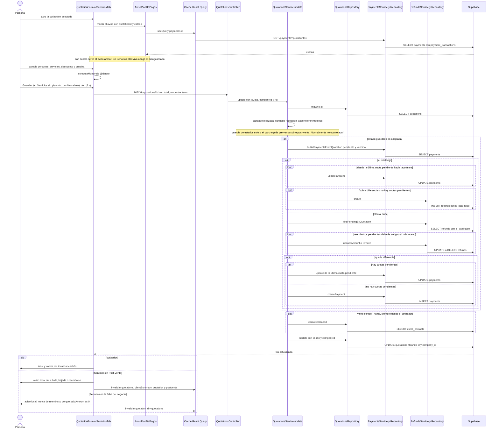

# Flujo: Cambiar el total de un evento aceptado: la cascada
> **Estado: verificado una vez contra el código** (commit 0de0ddb, 11-09-2026). Falta la etapa de completar lo que no quedó escrito.

> Verificado contra el código en el commit 0de0ddb (rama `pruebas`) el 11-09-2026, con una segunda pasada escéptica el mismo día. Parte del atlas: el índice de flujos (`00_INDICE_DE_FLUJOS.md`, en esta misma carpeta) y el mapa del sistema (`../00_MAPA_DEL_SISTEMA.md`) están previstos, pero **aún no existían** al verificar. El flujo anterior, aceptar y crear el plan, está en `04_ACEPTAR_COTIZACION_Y_PLAN_DE_PAGOS.md`.

## 1. En palabras simples

Cuando un evento ya está **aceptado** y tiene plan de cuotas, cualquier cambio que mueva el total (personas, servicios, descuento o propina) no solo cambia la cotización: el motor reacomoda solo la plata del cliente.

- Si el total **baja**, la diferencia se descuenta de las cuotas que faltan por pagar, empezando por la última. Si no alcanza (el cliente ya pagó más que el total nuevo), queda anotado un **reembolso pendiente**.
- Si el total **sube**, primero se "come" los reembolsos pendientes (para no deberle y cobrarle al mismo cliente a la vez) y lo que sobra se suma a la **última cuota pendiente**, o nace una cuota nueva si ya no quedan.

Se gatilla desde dos pantallas: el **cotizador** y la pestaña **Servicios** (en Post-Venta y en la ficha del negocio). Desde el caso 501 (06-09) las dos avisan en ámbar antes de guardar, y Servicios deja de guardar sola cuando hay plan vivo. Ojo: son escrituras sueltas, una tras otra, **sin transacción**.

## 2. El recorrido paso a paso

**Antes del flujo (precondición)**

1. **Existe un plan de pagos.** Alguien aceptó la cotización desde el tablero (`frontend/src/pages/quotations/QuotationsPage.tsx`: `applyStatusChange` abre el editor y `handlePaymentPlanSave` guarda) o desde la ficha (`frontend/src/pages/quotations/NegocioPage.tsx`, `guardarPlan`), armando las cuotas en `frontend/src/components/PaymentPlanEditor.tsx`. Viaja por `POST /payments/plan` (solo operaciones y administrador: `@Roles(...OPERATIONS_AND_UP)`) → `PaymentsController.createPaymentPlan` → `PaymentsService.createPaymentPlan`. Desde el caso 501 ese método lee la cotización con `QuotationsService.findOne` (404 si es de otra empresa) y exige que la suma de cuotas, redondeada, calce al peso con el `quotations.total_amount` actual. Después borra y reinserta las cuotas (`PaymentsRepository.deletePaymentsByQuotationId` + `PaymentsRepository.createPaymentPlan`, tabla `payments`), manda `PAYMENT_PLAN_CREATED` al mandante si la cotización no estaba ya aceptada, y deja `quotations.quotation_status = 'aceptada'`, salvo que ya esté `realizada`. Ese flujo tiene su propio mapa (`04_ACEPTAR_COTIZACION_Y_PLAN_DE_PAGOS.md`). Aquí solo importa que desde ese momento hay filas en `payments`.

**Entrada A: el cotizador**

2. **Una persona abre la cotización** en `frontend/src/pages/quotations/QuotationForm.tsx`. La ruta `quotation-form/:id` de `frontend/src/App.tsx` pide `SECTION_ROLES.quotations_edit`: vendedor, operaciones o administrador; recepción no entra. El efecto `fetchQuotationData` llama a `getQuotationById` (`frontend/src/services/quotations.service.ts`) → `GET /quotations/:id` (`QuotationsController.findOne`, marcado `@Public()`) → `QuotationsService.findOne` → `QuotationsRepository.findOne`. La respuesta queda en estado local (`setQuotation` y luego `setFormData`), no en React Query: el formulario trabaja sobre una **foto** del momento en que se abrió, estado incluido. `isEditingExisting` queda verdadero porque la cotización trae `id`. `isRestrictedEditing` deshabilita los campos en dos casos: evento `realizada` (para todos los roles) o evento `aceptada` con un rol que no es administrador ni operaciones. En el segundo caso muestra "🔒 Solo Admin/Operaciones pueden editar cotizaciones aceptadas". O sea, un vendedor abre la aceptada, pero no la puede cambiar desde aquí.
3. **El aviso ámbar consulta el plan.** `AvisoPlanDePagos` (`frontend/src/components/AvisoPlanDePagos.tsx`) recibe `quotationId` (solo si `isEditingExisting`) y `estado`. Si el estado es `aceptada`, hace `useQuery` con la llave `["payments", id]` y `staleTime` de 30 s → `getPaymentsByQuotationId` (`frontend/src/services/payments.service.ts`: saca la lista de la respuesta `{ data, error }` del motor y la devuelve envuelta **una sola vez**, como `{ data: lista }`; por eso el aviso lee `.data`) → `GET /payments?quotationId=` → `PaymentsController.findAllPaymensFromQuotation` → `PaymentsService.findAllPaymentsFromQuotation` → `PaymentsRepository.findAllPaymentsFromQuotation` (lee `payments` con sus `payment_transactions`). Si hay al menos una cuota, pinta "⚠ Este evento ya tiene plan de pagos" y explica la cascada.
4. **La persona edita** ítems, personas, descuento o propina. La pantalla recalcula con `computeTotals`, que llama a `computeMoney` importado desde `@dinero`. Ese alias (en `frontend/tsconfig.json` y `frontend/vite.config.ts`) apunta al **mismo archivo del motor**: `api-rest/src/quotations/utils/money.ts`.
5. **Aprieta Guardar.** El botón queda deshabilitado mientras `loading` o si faltan obligatorios (`isQuotationFormValid`). `handleSubmit` primero exige mandante: si `contact_name` viene vacío, muestra el toast "Falta el mandante…" y no viaja nada. Luego vuelve a llamar `computeTotals()` en ese instante y arma `editableFields`: `client_id`, `event_type`, `event_date`, `event_end_date`, `request_type`, `value_per_person`, `fixed_value`, `subtotal_amount`, `total_amount`, `items`, `quotation_status`, `people_count`, `discount_percentage`, `discount_amount`, `observations`, `children_count`, `tip_percentage`, `tip_amount` y `contact_name`. El `quotation_status` es el del formulario (`estadoAlGuardar` en `frontend/src/utils/estadoCotizacion.ts` lo devuelve tal cual), es decir, el que tenía la cotización **cuando se abrió la pantalla**; no se relee al guardar. Llama a `updateQuotation(editableFields, id)` → `PATCH /quotations/:id` por `apiRequest` (`frontend/src/services/api.ts`: JWT y un reintento en 401). Sigue en el paso 9.

**Entrada B: la pestaña Servicios**

6. **Una persona abre Servicios.**
   - **En Post-Venta** (rutas `post-venta` y `post-venta/:id` de `frontend/src/App.tsx`, que piden `SECTION_ROLES.payments`: solo operaciones y administrador), el modal `EventModal` de `frontend/src/pages/postventa/PostVentaPage.tsx` carga la cotización con la llave `["quotation", event.quotationId]` y `staleTime` 0, y monta `<ServiciosTab quote paidAmount={event.paid} onSaved={onDataChanged}>`, donde `onDataChanged` es `refreshAfterSave`. `event.paid` sale de `fetchEvents`: `getPaymentsWithTransactions` (`frontend/src/services/paymentTransactions.service.ts`) → `GET /payments/transactions` → `PaymentsService.findAllPaymentsWithTransactions`, que calcula el `paid_amount` de cada cuota como la suma bruta de sus abonos. `fetchEvents` suma esos `paid_amount`.
   - **En la ficha del negocio**, `NegocioPage.tsx` monta la misma pestaña ("Servicios", llave interna `cotizacion`) con `paidAmount={0}` y un `onSaved` propio. La pestaña aparece solo si `puedeEditar` (`SECTION_ROLES.quotations_edit`: vendedor, operaciones o administrador) y **no filtra por estado**. `ServiciosTab` usa el rol solo para el tope de descuento, para mostrar costos y para bajar personas de un evento provisionado. Resultado: un vendedor puede cambiar el total de una aceptada desde la ficha, cosa que el cotizador le bloquea (paso 2).
7. **Detecta plan vivo.** `ServiciosTab` (`frontend/src/pages/postventa/ServiciosTab.tsx`) hace la misma consulta `["payments", id]` que el aviso (una sola petición real), habilitada solo si `quote.quotation_status === "aceptada"`. `planVivo` es verdadero si está aceptada y la lista trae cuotas. En ese caso pinta `<AvisoPlanDePagos conGuardadoManual>`: "El guardado automático está apagado en esta pestaña…".
8. **Edita y guarda.** Cada cambio recalcula con `computeMoney` (misma cuenta). `save()` tiene tres disparadores:
   - el temporizador de 1,5 s sobre ítems, personas, descuento y propina;
   - el de 20 s o el `onBlur` del campo de comentarios;
   - el botón "Guardar cambios" → `guardarManual`, que guarda siempre.

   Los dos primeros pasan por `autoGuardar`, que **sale sin hacer nada si `planVivo`** (o si el evento está congelado) y que no manda nada si la huella (`huellaActual`) no cambió. `save()` frena si el evento está provisionado y alguien que no es administrador baja personas. También serializa los guardados (`vueloRef` / `pendienteRef`), anota `prevTotal = quote.total_amount` y llama a `updateQuotation` con `people_count`, `children_count`, `discount_percentage`, `discount_amount`, `value_per_person`, `fixed_value`, `subtotal_amount`, `total_amount`, `tip_percentage`, `tip_amount`, `observations` e `items`, **sin** `quotation_status` → `PATCH /quotations/:id`.

**En el motor (común a las dos entradas)**

9. **Puerta de entrada.** Corren los guardias globales de `api-rest/src/app.module.ts`: `AuthGuard` valida el JWT, `ThrottlerGuard` limita la frecuencia y `RolesGuard` no frena nada aquí, porque `PATCH /quotations/:id` no lleva `@Roles`. El `ValidationPipe` global (`api-rest/src/main.ts`, con `whitelist` y `forbidNonWhitelisted`) valida contra `UpdateQuotationDto` (`api-rest/src/quotations/dto/update-quotation.dto.ts`, que es `PartialType(CreateQuotationDto)`; `total_amount` es `@IsNumber() @IsOptional() @Min(0)`). `QuotationsController.update` toma el usuario con `@CurrentUser()` y pasa `id`, el cuerpo, `user.company_id` y el rol a `QuotationsService.update` (`api-rest/src/quotations/quotations.service.ts`).
10. **Lee la cotización guardada.** `QuotationsRepository.findOne(id)` hace `SELECT` en `quotations` con `clients(name, email)` y `companies(name)`, filtrando **solo por id** (sin `company_id`).
11. **Candado del evento realizado (13-08).** Si el `quotation_status` guardado es `realizada` → 400 con `EVENTO_REALIZADO_CONGELADO` (`api-rest/src/quotations/constants/constants.ts`). No se escribe nada.
12. **Candado de recepción (12-08).** Si el rol es `recepcion` y la fila no es un requerimiento → 403.
13. **La cuenta la hace la casa (Fase 1, 27-07).** Si el parche trae `items`, `people_count`, `children_count` o algún campo de plata (`total_amount`, `subtotal_amount`, `fixed_value`, `value_per_person`, descuento o propina), `assertMoneyMatches` mezcla parche y valores guardados. Si no hay ítems y todo lo declarado vale 0, `hasMoneyToVerify` lo deja pasar sin revisar. Si no, `verifyMoney` (`utils/money.ts`) rehace el total desde los ítems, y si algo no calza al peso → 400 "Los totales enviados no calzan con los ítems de la cotización…". Hasta aquí no se ha escrito nada.
14. **Guardia de estados (19-07).** Solo actúa si el parche pide un estado de pre-venta y el guardado es de post-venta. Busca las cuotas: con dinero → 400 ("usa «Anular evento» en Post-Venta"); sin dinero → `PaymentsService.deletePaymentPlan` → `PaymentsRepository.deletePaymentsByQuotationId` (`DELETE` en `payments`). **Normalmente no ocurre en este flujo**: Servicios no manda estado, y el cotizador manda el estado con que se abrió la pantalla, que suele ser el guardado. La excepción es una pantalla abierta antes de la aceptación (sección 8).
15. **¿Hay cascada?** Solo si el estado **guardado** es `aceptada`. Pide las cuotas `pendiente` y `vencido` con `PaymentsService.findAllPaymentsFromQuotation([id], companyId, [PENDIENTE, VENCIDO])` → `PaymentsRepository.findAllPaymentsFromQuotation`, ordenadas por `payment_number` ascendente y con sus `payment_transactions`. Si la lectura devuelve error, se lanza y no se escribe nada.
16. **Rama BAJA** (el `total_amount` del parche es verdadero y menor que el guardado). `amountToReduce = guardado − nuevo`.
    - **Sin cuotas pendientes:** `RefundsService.create({ amount, quotation_id })` → `RefundsRepository.create` → `INSERT` en `refunds` con `is_paid = false`.
    - **Con cuotas pendientes:** recorre la lista **al revés** (de la última a la primera). Para cada cuota calcula lo pendiente (`amount − Σ payment_transactions.amount`).
      - Si lo pendiente es mayor que el resto → `PaymentsService.update(id, { amount: amount − resto })` y termina.
      - Si no → deja la cuota en `amount − pendiente` (normalmente **$0**, porque las cuotas pendientes casi nunca tienen abonos) y sigue con la anterior.
      - Cada `PaymentsService.update` es `PaymentsRepository.updatePayment` → `UPDATE payments SET amount` por id.
    - **Si al final queda resto** → `RefundsService.create` por ese resto.
17. **Rama SUBE** (el nuevo es mayor que el guardado). `amountToCharge = nuevo − guardado`.
    - **Compensación (tarea #42, 19-07):** `RefundsService.findPendingByQuotation(id)` → `RefundsRepository.findPendingByQuotation` (`refunds` con `is_paid = false`, del más antiguo al más nuevo por `created_at`). Si un reembolso es mayor que el resto → `RefundsService.updateAmount` (`UPDATE refunds SET amount`) y el resto queda en 0. Si no → `RefundsService.remove` (`DELETE` en `refunds`) y el resto baja en ese monto.
    - **Queda resto y hay cuotas pendientes:** se suma a la **última pendiente** (`payments[payments.length - 1]`) → `PaymentsService.update` → `UPDATE payments SET amount`.
    - **Queda resto y no hay pendientes:** `PaymentsService.createPayment` vuelve a leer **todas** las cuotas (`PaymentsRepository.findAllPaymentsFromQuotation` sin filtro de estado) para sacar el `payment_number` (último + 1), y lee la cotización con `QuotationsRepository.findOne` para la `due_date` (fecha del evento + 7 días, u hoy si no hay fecha). Si una de esas lecturas falla, lanza. Después `PaymentsRepository.createPayment` → `INSERT` en `payments` con `status = 'pendiente'` y `notes = 'Pago creado por diferencia de total_amount'`. No manda `payment_type`, así que la fila queda con el valor por defecto de la columna (`'Pago Regular'` en `docs/migrations/0_initial_models.sql`; ninguna migración posterior lo cambia).
18. **El resto del parche**, en el orden del código:
    - Si el parche pasa a `enviada` y la guardada no lo estaba, se manda el correo `QUOTATION_IS_SENT` (no aplica en estas entradas).
    - Si viene `contact_name` (el cotizador siempre lo manda) → `QuotationsRepository.resolveContactId(quotation.client_id, contact_name)` busca en `client_contacts` de ese cliente un nombre igual, sin distinguir mayúsculas, y fija `client_contact_id`. Si no calza, lo deja en `null`.
    - Si pasa a `enviada`, se sella `sent_at` (tampoco aplica).
19. **Escribe la cotización.** `QuotationsRepository.update(id, dto, companyId)` → `UPDATE quotations … WHERE id = … AND company_id = …` con `.select().single()` y devuelve la fila. Es la **última** escritura del flujo: la plata ya se movió antes.

**De vuelta en la pantalla**

20. **Cotizador:** toast "Cotización actualizada." y `volver()` (`navigate(-1)` o `/quotations`). **No invalida ningún caché** de React Query. Si falla, toast con `humanizeApiError(error)`, que muestra el motivo del motor.
21. **Servicios:** con `prevTotal` y el total nuevo arma el aviso local `notice`.
    - Tipos: `up`, `down` o `refund`. El monto de reembolso se calcula en pantalla como `paidAmount − total nuevo`; no se lee del motor. En pre-venta (`solicitada`, `enviada`, `en_negociacion`, `rechazada`) no hay cartel. En `cancelada` sí lo hay, aunque ahí el motor no mueve nada (sección 5).
    - Luego `onSaved()`. En Post-Venta, `refreshAfterSave` invalida `["quotations"]`, `["clientSummary"]`, `["quotation"]` y `["postventa"]`; esta última arrastra `["postventa","events"]` y `["postventa","refunds",id]`, las dos con `staleTime` 0. En la ficha se invalidan `["quotation", id]` y `["quotations"]`.
    - Se actualiza `huellaRef`.
    - Si falla, `catch { return false; }` descarta el motivo y solo se ve "No se pudo guardar — reintenta o usa Guardar".

**Después: los relojes (solo en producción; `ScheduleModule.forRoot({ cronJobs: process.env.NODE_ENV === 'production' })` en `api-rest/src/app.module.ts`)**

22. **1 AM:** `PaymentsService.updateOverduePayments` → `PaymentsRepository.updateOverduePayments` pasa a `vencido` toda cuota `pendiente` cuya `due_date` ya se cumplió. Incluye la cuota nueva del paso 17 si nació con fecha pasada.
23. **11 AM:** dos relojes de `api-rest/src/payments/payments-cron.service.ts`, con sus constantes en `api-rest/src/payments/constants/index.ts`:
    - `PaymentsCronService.checkUpcomingOverduePayments`: cuotas `pendiente` que vencen en 3 días o hoy (`UPCOMING_OVERDUE_PAYMENTS_DAYS_NOTIFICATION = [3, 0]`).
    - `PaymentsCronService.checkOverduePayments`: cuotas `vencido` con 7 días de atraso (`OVERDUE_PAYMENTS_DAYS_NOTIFICATION = [-7]`).
    - Los dos leen con `PaymentsRepository.findAllPaymentsWithTransactions` y mandan `PAYMENT_REMINDER` / `PAYMENT_OVERDUE` al mandante (solo si tiene correo) y la versión admin a los administradores, con el `amount` **ya reacomodado** y sin filtrar por monto.

## 3. Diagrama

## 4. Datos que cambian

| tabla | columnas | en qué paso | quién escribe |
|---|---|---|---|
| `payments` | `amount` de una o varias cuotas pendientes/vencidas, desde la última | 16 (baja) | `QuotationsService.update` → `PaymentsService.update` → `PaymentsRepository.updatePayment` |
| `payments` | `amount` de la última cuota pendiente/vencida | 17 (sube) | `QuotationsService.update` → `PaymentsService.update` → `PaymentsRepository.updatePayment` |
| `payments` | fila nueva: `quotation_id`, `amount`, `notes`, `status = 'pendiente'`, `payment_number`, `due_date`; `payment_type` queda con el valor por defecto de la base | 17 (sube sin pendientes) | `PaymentsService.createPayment` → `PaymentsRepository.createPayment` |
| `refunds` | fila nueva: `amount`, `quotation_id`, `is_paid = false` (sin `refund_date`, `payment_method` ni `receipt_url`, que se llenan al registrar) | 16 (baja) | `RefundsService.create` → `RefundsRepository.create` |
| `refunds` | `amount` del reembolso pendiente que se achica | 17 (sube) | `RefundsService.updateAmount` → `RefundsRepository.updateAmount` |
| `refunds` | fila borrada (reembolso pendiente consumido entero) | 17 (sube) | `RefundsService.remove` → `RefundsRepository.remove` |
| `quotations` | `total_amount`, `subtotal_amount`, `fixed_value`, `value_per_person`, `discount_percentage`, `discount_amount`, `tip_percentage`, `tip_amount`, `people_count`, `children_count`, `items`, `observations` | 19 | `QuotationsRepository.update` (las dos entradas) |
| `quotations` | además `client_id`, `event_type`, `event_date`, `event_end_date`, `request_type`, `quotation_status` (el que tenía al abrir la pantalla), `contact_name`, `client_contact_id` (o `null` si el nombre no calza) | 18 y 19 | `QuotationsRepository.update` (solo el cotizador) |
| `payments` | todas las filas de la cotización (`DELETE`) | 14 | `PaymentsService.deletePaymentPlan`: solo si el parche pide volver a pre-venta sin dinero; normalmente no ocurre desde estas dos pantallas, salvo con una pantalla vieja del cotizador (sección 8) |
| `payments` | `status = 'vencido'` | 22 | reloj `PaymentsService.updateOverduePayments` |

## 5. Efectos automáticos y colaterales

**Correos**
- La cascada en sí **no manda correo** al cliente ni avisa internamente que su plan cambió.
- Los recordatorios de cobranza (paso 23) leen el `amount` nuevo: el mandante puede recibir el recordatorio de una cuota agrandada o achicada sin ningún aviso previo. También los administradores.
- El correo `PAYMENT_PLAN_CREATED` pertenece al flujo de crear el plan, no a este.

**Relojes**
- 1 AM marca vencidas (paso 22) y 11 AM manda cobranza (paso 23). Solo en producción.

**Cascadas en el motor**
- Baja: cuotas y, si sobra, reembolso.
- Sube: reembolsos pendientes y después cuota.
- Todo dentro de `QuotationsService.update`, antes de guardar la cotización.

**Otras pantallas que leen lo mismo en vivo (sin cálculo guardado)**
- Portal del mandante: `QuotationsService.getPortalData` lee `payments` y `RefundsService.paidMapByCompany`. El mandante ve las cuotas nuevas al recargar.
- Alertas de "Hoy": `HoyRepository.alerts` en `api-rest/src/analytics/hoy.controller.ts` suma cuotas `pendiente` y `vencido` de cotizaciones no canceladas, descontando sus abonos.
- Caja del dashboard: `AnalyticsService` en `api-rest/src/analytics/analytics.service.ts` lee `payments` con `findAllPaymentsFromQuotation`.

**Cachés de la app**
- **Cotizador:** no invalida nada. El tablero (`["quotations","embudo-y-rechazadas"]` en `QuotationsPage.tsx`) usa el `staleTime` por defecto de 30 s de `frontend/src/lib/queryClient.ts` y puede mostrar el total viejo al volver. Esa fue la raíz del caso 501 (ver sección 7).
- **`["payments", id]`** (aviso y `planVivo`): nadie la invalida en este flujo, vive 30 s.
- **Post-Venta:** `refreshAfterSave` invalida `["quotations"]`, `["clientSummary"]`, `["quotation"]` y `["postventa"]`.
- **Ficha del negocio:** solo `["quotation", id]` y `["quotations"]`. `["postventa","events"]` igual se revalida al entrar a Post-Venta porque tiene `staleTime` 0.
- **Dashboard** (`["dashboard", …]`, `["dashboard-complete", …]`, `["dashboard-margin-events", …]`, `["dashboard-tendencia", …]` en `frontend/src/pages/dashboard/DashboardPage.tsx`): no se invalida desde aquí; se refresca con su propia política.

**Avisos de pantalla que no calzan con el motor**
- El aviso `up` de `ServiciosTab.save` y el texto de `AvisoPlanDePagos` no mencionan que, al subir, **primero se consumen reembolsos pendientes** (tarea #42). Si había uno, la pantalla dice que se agrandó la última cuota cuando en realidad se achicó el reembolso.
- El aviso `refund` pide registrarlo "en la pestaña Comprobantes", pero `ReembolsosManager` vive dentro de la pestaña `pagos` de `PostVentaPage.tsx`. "Comprobantes" es la bandeja de comprobantes subidos desde el portal.
- En la ficha del negocio (`paidAmount={0}`) el aviso de reembolso **nunca aparece**, aunque el motor lo cree.
- La pantalla calcula el reembolso como `paidAmount − total nuevo`. El motor lo calcula como lo que no alcanzó a descontarse de cuotas pendientes. Dan lo mismo solo si las cuotas suman exactamente el total y las pagadas están completas.
- En una `cancelada`, `ServiciosTab.save` igual pinta "Se ajustó el plan de pagos automáticamente…", porque su lista de pre-venta no incluye `cancelada`. El motor, en cambio, no toca cuotas ni reembolsos (regla 1 de la sección 6).

## 6. Reglas de negocio que gobiernan el flujo

1. **La cascada solo corre si el estado guardado es `aceptada`.** Evidencia: `if (quotation.quotation_status === QuotationStatus.ACEPTADA)` en `QuotationsService.update`. Una `cancelada` que se edite cambia el total sin tocar cuotas ni reembolsos (ver pregunta abierta).
2. **Un evento realizado no se toca (13-08, regla de Felipe).** El candado va antes del filtro de rol y rige también para el administrador. Cita en `constants.ts`: *"El realizado es un estado de que YA SE HIZO. Puede faltar cobrar, facturar, etc., pero ya se hizo."* La cobranza sigue viva porque pagos y reembolsos no pasan por esta puerta.
3. **La cuenta la hace la casa (Fase 1, 27-07-2026).** El motor rehace los totales desde los ítems con la misma fórmula del cotizador y rechaza lo que no calce al peso **antes** de mover plata. Evidencia: `assertMoneyMatches` y el encabezado de `api-rest/src/quotations/utils/money.ts` ("la de acá es la que manda").
4. **Al bajar, se descuenta desde la cuota de vencimiento más lejano.** Comentario en `update`: *"The remaining balance stays concentrated in the earliest pending installments."* La lógica original de la baja es de octubre de 2025 (commits `f97f279`, `7965c01`, `0d2b616`).
5. **Reembolso solo por lo que no alcanza a descontarse** de las cuotas pendientes, o por la diferencia entera si no quedan pendientes.
6. **Al subir, primero se compensa con reembolsos pendientes (tarea #42, 19-07-2026, commit `74de429`).** Comentario: *"Así nunca conviven 'te debo' y 'me debes'."* y *"Los reembolsos YA PAGADOS no se tocan: esa plata ya salió."*
7. **Lo que sobra va a la última cuota pendiente o vencida; si no hay, nace una cuota a 7 días del evento (o con fecha de hoy si la cotización no tiene fecha).** Evidencia: rama 2.2 de `update` y `PaymentsService.createPayment`.
8. **El aviso ámbar anuncia la cascada antes del guardar (caso 501, 06-09-2026).** Pedido de Felipe citado en `AvisoPlanDePagos.tsx`: *"un aviso ámbar como el de evento provisionado"*. El componente aclara que la cascada existía desde siempre: el aviso solo la anuncia.
9. **Con plan vivo, Servicios no guarda sola (06-09-2026, commit `77e13a6`).** Palabras de Felipe en el commit: *"guarda automática cambia las cuotas mientras estoy en proceso de aplicar el descuento"*. Evidencia: `if (planVivo) return;` en `autoGuardar`.
10. **Un plan nunca nace descuadrado (caso 501, 06-09-2026, commit `3b3563c`).** `PaymentsService.createPaymentPlan` rechaza un plan cuya suma no calce con el total actual. `PaymentPlanEditor` pide el total fresco al motor (`["quotation","fresca",id]`, `staleTime` 0).
11. **Cuadratura de cuotas (Felipe, 20-07-2026).** Toda cuota queda 100 % pagada o 100 % pendiente (`PaymentsService.normalizePaymentAfterTransactions`). Por eso la cascada puede suponer que una cuota pendiente casi nunca tiene abonos.
12. **Guardia de estados (19-07-2026, commit `854bfee`).** Salir de post-venta hacia pre-venta con dinero registrado se rechaza y manda a "Anular evento"; sin dinero, se borra el plan.
13. **Recepción edita requerimientos, no cotizaciones (12-08).** Evidencia: `ForbiddenException` en `update`.
14. **Solo administrador y operaciones editan una aceptada en el cotizador.** Es regla **de pantalla** (`isRestrictedEditing` en `QuotationForm.tsx`). El motor solo frena a recepción, y la pestaña Servicios de la ficha del negocio no aplica esta regla: la muestra a vendedores sin mirar el estado (paso 6).
15. **Evento provisionado: bajar personas es solo para administradores.** Regla de pantalla en `ServiciosTab.save`.
16. **El envío de cotización NO pasa por `update`, a propósito.** `docs/arquitectura/13_ENVIO_DE_COTIZACIONES.md`: el cambio de estado va por el repositorio porque *"ese camino dispara la cascada del plan de pagos, que aquí no tiene nada que hacer"*.

## 7. Si cambias algo en este flujo

1. **Si cambias** el freno `if (planVivo) return;` de `autoGuardar` en `ServiciosTab.tsx`, o vuelves a encender el reloj de 1,5 s con plan vivo, **pasa** que cada pausa al tipear un descuento mueve cuotas y reembolsos a medio camino, **porque** cada `PATCH` con un total distinto dispara la cascada y la cascada no es simétrica: la baja vacía cuotas desde la última y la subida apila todo en la última pendiente. Evidencia: segunda vuelta del caso 501 (commit `77e13a6`, 06-09). El dato quedó reparado a mano en producción: "cuota única $2.447.500 pagada, abono real $2.617.600, reembolso $170.100 pendiente".
2. **Si cambias** la llave `["payments", id]` en `AvisoPlanDePagos` o en `ServiciosTab`, o el desenvuelto de `getPaymentsByQuotationId`, **pasa** que `planVivo` queda falso y Servicios vuelve a guardar sola sobre un plan vivo, **porque** el freno depende de medir el largo de esa lista. Evidencia: comentario en `frontend/src/services/payments.service.ts`: *"caza del 06-09: la doble envoltura dejaba a TODOS los consumidores preguntándole el largo a la caja y no a la lista… el freno del guardado automático de Servicios no se activaba"* (commit `7819da0`).
3. **Si cambias** el portero de `PaymentsService.createPaymentPlan`, el total fresco de `PaymentPlanEditor` o la política de caché del tablero, **pasa** otra vez la 501: una cuota que nace con el total viejo, **porque** el cotizador no invalida cachés al guardar y el tablero puede mostrar un total de hasta 30 s de antigüedad. Evidencia: commit `3b3563c` (06-09): *"La cuota de la 501 nació con el DOBLE del total: el editor del plan cuadró contra el total viejo que la lista aún mostraba tras corregir un tipeo de personas (174→87)"*. Dato reparado a mano ($2.984.100).
4. **Si cambias** el orden de `QuotationsService.update` (hoy: primero cuotas y reembolsos, al final `QuotationsRepository.update`) o metes un paso que pueda fallar entre ambos, **pasa** que un reintento aplica la diferencia **dos veces**, **porque** no hay transacción y la diferencia se calcula contra el total guardado, que sigue siendo el viejo si el `UPDATE` final falló. Evidencia: secuencia de `await` sueltos en `update`; ningún `rpc` ni transacción.
5. **Si cambias** el `.order('payment_number', { ascending: true })` de `PaymentsRepository.findAllPaymentsFromQuotation`, **pasa** que "la última cuota" deja de ser la de vencimiento más lejano y `createPayment` puede repetir `payment_number`, **porque** tanto la cascada (`[...payments].reverse()` y `payments[payments.length - 1]`) como `createPayment` confían en ese orden. Evidencia: el propio comentario *"be careful when changing this, it will affect the payment number in update payment plan"*.
6. **Si cambias** cómo llegan o se suman los montos (un `select` distinto, un tipo de columna), **pasa** que `lastPayment.amount + amountToCharge` o `sum + transaction.amount` podrían **pegar textos en vez de sumar**, **porque** la cascada no convierte con `Number()`. `createOverflowPaymentTransaction` y `normalizePaymentAfterTransactions` sí convierten. Evidencia: comentario del 24-08 en `normalizePaymentAfterTransactions` sobre la cuota fantasma de $0 de la #486 (*"Supabase entrega los numeric como TEXTO"*). No está confirmado que afecte a esta lectura: ver pregunta abierta 1.
7. **Si cambias** otro camino (envío de correo, seguimiento, portal) para que escriba por `QuotationsService.update` en vez de ir directo al repositorio, **pasa** que ese camino gatilla la cascada si el parche trae `total_amount`, **porque** `update` es "la puerta ancha" por la que pasan Servicios, el cotizador, la fecha y el desplegable de estado. Evidencia: comentario del candado en `update` y `docs/arquitectura/13_ENVIO_DE_COTIZACIONES.md`.
8. **Si cambias** el orden de los parámetros del constructor de `QuotationsService`, **pasa** que se rompen decenas de pruebas de una, **porque** las pruebas arman el servicio por posición. Evidencia: *"AL FINAL a propósito: las pruebas arman este servicio por posición — insertarla al medio rompió 34 de una (05-09)"*.
9. **Si cambias** `computeMoney` copiándolo en el frontend en vez de usar el alias `@dinero`, **pasa** que el motor rechaza guardados con 400 "Los totales enviados no calzan…", **porque** pantalla y motor deben dar el mismo peso. Evidencia: encabezado de `utils/money.ts` y comentario de `computeTotals` en `QuotationForm.tsx` (FASE 1.2, 27-07).
10. **Si cambias** la condición `updateQuotationDto.total_amount && …`, **pasa** que cambia qué ocurre con un total en $0: hoy la cascada **se salta** (0 es falso) y las cuotas quedan intactas, **porque** el DTO permite `@Min(0)`. Evidencia: condiciones de las ramas 2.1 y 2.2 en `update`.
11. **Si cambias** el candado de `realizada` (o lo mueves después del filtro de rol), **pasa** que se reabren montos de eventos que ya son historia contable, **porque** esta es la única puerta que los protege. Evidencia: `api-rest/src/quotations/tests/unit/candado-evento-realizado.spec.ts` y la regla del 13-08.
12. **Si cambias** la cascada (por ejemplo, borrar cuotas en $0 o compensar reembolsos al bajar), **pasa** que los textos de `AvisoPlanDePagos` y de `notice` en `ServiciosTab` quedan mintiendo, **porque** describen la cascada con palabras propias y no leen el resultado del motor. Ya hay cinco desalineaciones anotadas en la sección 5.

## 8. Casos borde y estados raros

**Fallas a la mitad**
- **No hay transacción.** Si falla una escritura, lo anterior queda hecho.
- **Hay errores que se tragan en silencio.** `PaymentsService.update` y `RefundsService.create` devuelven el `{ data, error }` de Supabase sin revisarlo, y `PaymentsService.createPayment` hace lo mismo con su `INSERT` (sus dos lecturas previas sí lanzan). `supabase-js` no lanza por su cuenta y `QuotationsService.update` no mira esos resultados. Una cuota que no se actualizó no detiene nada y el total de la cotización igual se guarda, dejando cuotas y total descuadrados. En cambio `RefundsService.findPendingByQuotation`, `updateAmount` y `remove` sí lanzan.
- **Si falla el `UPDATE` final** de `quotations`, la plata ya se movió y el total guardado sigue viejo. Un reintento vuelve a calcular la misma diferencia y la aplica **de nuevo**.

**Repetición**
- Guardar dos veces el mismo total no mueve nada: la diferencia es 0.
- En Servicios, `vueloRef` evita dos guardados en vuelo y el botón se deshabilita con `saving`.
- En el cotizador, el botón se deshabilita con `loading`.
- `guardarManual` guarda aunque nada haya cambiado: viaja un `PATCH` idéntico, sin cascada.

**Dos personas a la vez** (por ejemplo, una en el cotizador y otra en Servicios, o dos pestañas)
- Ambas leen el mismo total guardado y cada una aplica su propia diferencia sobre las cuotas.
- El total final es el del último `UPDATE`, pero las cuotas cargan **los dos ajustes**, y queda descuadre.
- No hay bloqueo optimista ni versión de fila.

**Estados raros que la cascada deja**
- **Cuotas en $0 que quedan vivas.** Al bajar, una cuota vaciada queda con `amount = 0` y su estado `pendiente` o `vencido`: no se borra. El reloj de 1 AM la puede marcar vencida y el de cobranza no filtra por monto. En Post-Venta, `fetchEvents` puede marcar el evento como "vencido" por una cuota de $0 si el saldo aún es positivo. Una cuota de $0 vencida ya apareció como "fantasma" en la #486, aunque nació de otro bug (montos sumados como texto, comentario del 24-08 en `normalizePaymentAfterTransactions`).
- **El alza puede caer en una cuota ya vencida:** la última pendiente puede tener estado `vencido`, y entonces la deuda nueva nace vencida.
- **La cuota nueva por diferencia** nace con `due_date` = evento + 7 días. Si el evento ya pasó hace más de una semana, nace con fecha pasada y el reloj de 1 AM la vence. No manda `payment_type`: queda el valor por defecto de la columna.
- **Total a $0:** la cascada se salta; cuotas y reembolsos quedan como estaban.
- **Varios reembolsos pendientes:** la baja no suma al reembolso existente, crea uno nuevo cada vez. La subida los consume del más antiguo al más nuevo.
- **Estado y total en el mismo parche:** si un `PATCH` pide volver a pre-venta sin dinero y a la vez cambia el total, la guardia borra el plan (paso 14) y la cascada corre después con la lista vacía. Crearía un reembolso o una cuota nueva sobre una cotización que vuelve a pre-venta. Servicios no manda estado y el tablero manda solo estado, así que por ahí no pasa. **Por el cotizador sí podría pasar con una pantalla vieja**: alguien abre una cotización en negociación, otra persona la acepta y crea el plan, y la primera guarda con otro total. El formulario manda el estado de su foto (`en_negociacion`) y el guardado ya es `aceptada`: se borra el plan, nace un reembolso o una cuota por la diferencia y la cotización vuelve a pre-venta, sin aviso ámbar (el aviso mira el estado de la foto). Es una deducción del código, no probada en ejecución.
- **`cancelada`:** no hay candado ni cascada. Si alguien edita el total de un evento anulado, cuotas y reembolsos no se enteran.

**Datos incompletos o desfasados**
- `payments` nulo se trata como lista vacía.
- Una solicitud sin ítems y con todo en 0 pasa sin verificación (`hasMoneyToVerify`).
- **El aviso de Servicios puede quedar desfasado:** usa `prevTotal = quote.total_amount` de la prop. Si el refresco del guardado anterior aún no llega, el aviso muestra una diferencia equivocada. Solo es visual: el motor compara contra la base.
- **`planVivo` puede venir de un caché viejo:** `["payments", id]` no se invalida al crear el plan en otra pantalla. Durante la revalidación, un caché de "0 cuotas" deja el autoguardado encendido. Es poco probable: hace falta un cambio y 1,5 s de calma antes de que llegue la respuesta.
- **Errores tragados en Servicios:** el motivo del 400 (totales que no calzan, candado) no se muestra; solo "No se pudo guardar — reintenta o usa Guardar".

**Aislamiento por empresa: probable hueco, no probado en ejecución**
- `QuotationsRepository.findOne(id)` no filtra por empresa.
- `PaymentsRepository.findAllPaymentsFromQuotation` filtra `.eq('quotations.company_id', companyId)` sobre un embebido declarado **sin `!inner`**. En PostgREST ese filtro vacía el embebido pero no descarta la fila de `payments`. El mismo repositorio usa `!inner` justo cuando quiere acotar por empresa: `findPaymentById`, `RefundsRepository.findByQuotation`, `HoyRepository.alerts`.
- `PaymentsRepository.updatePayment` y los métodos de `RefundsRepository` que usa la cascada filtran solo por id o `quotation_id`.
- Resultado posible: un `PATCH` con el id de una cotización aceptada de **otra empresa** movería sus cuotas y reembolsos. El `UPDATE` final sí filtra por `company_id` y fallaría, pero después de mover la plata.
- `CLAUDE.md` dice que todo método de repositorio filtra por `company_id`, y estos no lo hacen.

## 9. Pruebas que protegen el flujo y huecos

**Lo que hay** (Jest, `api-rest/`):
- `api-rest/src/quotations/tests/unit/quotations.service.spec.ts`, `describe('update()')`:
  - error y nulo al leer la cotización;
  - candado de recepción (tres casos);
  - estado distinto de aceptada llega a `repo.update`.
- El mismo archivo, bloque `if quotation_status is ACEPTADA`:
  - error al leer cuotas;
  - mismo total;
  - **baja sin cuotas → reembolso**;
  - **sube sin cuotas → `createPayment`** con la nota "Pago creado por diferencia de total_amount";
  - **sube con cuotas → la última crece**.
- `api-rest/src/quotations/tests/unit/candado-evento-realizado.spec.ts`:
  - un realizado rechaza cambiar propina, montos (`total_amount`), fecha y personas, también al administrador;
  - una ACEPTADA se sigue editando;
  - un realizado no puede pasar a aceptada, cancelada, en negociación ni rechazada, y no se borra su plan.
- `api-rest/src/payments/tests/payments.service.spec.ts`:
  - `createPaymentPlan: el portero de cuadratura` (caso 501): rechaza sin borrar nada, y la cotización de otra empresa da 404;
  - `normalizePaymentAfterTransactions`: el pago exacto no crea cuota de $0; el parcial divide.

**Huecos** (nada de esto tiene prueba):
- **Baja con cuotas pendientes:** reparto desde la última, cuotas que quedan en $0, resto que termina en reembolso. Es el corazón de la cascada.
- **Compensación con reembolsos pendientes** (tarea #42): el mock de `findPendingByQuotation` siempre devuelve `[]`; ni achicar ni borrar un reembolso están probados.
- Total en $0 (la cascada se salta).
- Errores de `PaymentsService.update`, `createPayment` y `RefundsService.create` (hoy silenciosos).
- Falla del `UPDATE` final después de mover la plata, y el reintento duplicado.
- Montos que llegan como texto.
- Aislamiento por empresa en la cascada.
- Guardia de estados combinada con cambio de total.
- **Frontend: no hay suite de pruebas** (`CLAUDE.md`). `AvisoPlanDePagos`, `planVivo`, el freno de `autoGuardar`, el cálculo de `notice` y el total fresco de `PaymentPlanEditor` solo se protegen con revisión manual.

## 10. Preguntas abiertas

1. **¿Los montos `numeric` llegan como número o como texto en `findAllPaymentsFromQuotation` y `findPendingByQuotation`?**
   - A favor de texto: el comentario del 24-08 en `normalizePaymentAfterTransactions` (*"Supabase entrega los numeric como TEXTO"*) y la nota que lo repite en `createOverflowPaymentTransaction`. Las columnas `payments.amount` y `payment_transactions.amount` son `numeric` (`docs/migrations/0_initial_models.sql`).
   - En contra: `PaymentsService.findAllPaymentsWithTransactions` y `QuotationsService.getPortalData` suman `t.amount` sin `Number()` y Post-Venta muestra lo pagado todos los días.
   - Si fuera texto en la lectura de la cascada, la subida concatenaría (`lastPayment.amount + amountToCharge`). Hay que medirlo en el laboratorio, no suponerlo.
2. **¿Es real el hueco de aislamiento por empresa** descrito en la sección 8 (embebido sin `!inner`, `findOne` sin `company_id`)? Confirmarlo en el laboratorio con dos empresas antes de arreglar.
3. **¿Una cotización `cancelada` debe cascadear?** Hoy no tiene candado ni cascada, y no encontré regla escrita que diga cuál es la intención.
4. **¿Las cuotas que la baja deja en $0 deberían borrarse?** Hoy quedan vivas, pueden vencer y entrar a la cobranza. No encontré una decisión escrita.
5. **¿Qué debe pasar si el total baja a $0 en un evento aceptado?** Hoy la cascada se salta por la condición `total_amount &&`. No se sabe si es intención o descuido.
6. **¿Dónde se debe registrar un reembolso?** El aviso de `ServiciosTab` dice "pestaña Comprobantes", pero `ReembolsosManager` está en la pestaña `pagos`. Falta confirmar el texto correcto con Felipe.
7. **En la ficha del negocio, `ServiciosTab` recibe `paidAmount={0}` también para aceptadas.** El comentario de `NegocioPage.tsx` supone pre-venta ("En pre-venta no hay pagos aún"). ¿Se debe pasar lo pagado real o esconder la pestaña en post-venta?
8. **¿Un vendedor debe poder cambiar el total de una aceptada desde la ficha del negocio?** Ya verificado: Post-Venta entero pide `SECTION_ROLES.payments` (operaciones y administrador) en `App.tsx`, y `ServiciosTab` no bloquea por rol. Pero la ficha (`NegocioPage.tsx`) muestra la pestaña con `SECTION_ROLES.quotations_edit`, que incluye al vendedor, sin mirar el estado. El cotizador se lo impide (`isRestrictedEditing`) y el motor solo frena a recepción. Falta que Felipe diga cuál de las dos reglas es la buena.
9. **El comentario de `QuotationsService.update` dice que la llaman "el cron de seguimiento" y "el portal de pagos" sin rol**, pero en el código solo encontré a `QuotationsController.update` como llamador. ¿El comentario quedó viejo?
10. **La guardia de estados lee `paid_amount` en filas de `findAllPaymentsFromQuotation`,** que no traen esa propiedad: `payments` no tiene esa columna (`docs/migrations/0_initial_models.sql`, y ninguna migración la agrega) y solo `findAllPaymentsWithTransactions` la calcula. En la práctica la guardia depende solo de que haya `payment_transactions`. ¿Existe alguna cuota `pagado` sin transacciones que se colaría?
11. **¿El motor debería aplicar el tope de descuento por rol** (40 % administrador, 15 % vendedor y operaciones) que `ServiciosTab` y el cotizador aplican en pantalla (`getMaxDiscountForRole`)? Hoy no lo hace: `CreateQuotationDto` solo pide `@Min(0)` en `discount_percentage` y `utils/money.ts` topa el porcentaje en 100. Un `PATCH` directo podría bajar el total más allá del tope del rol.
