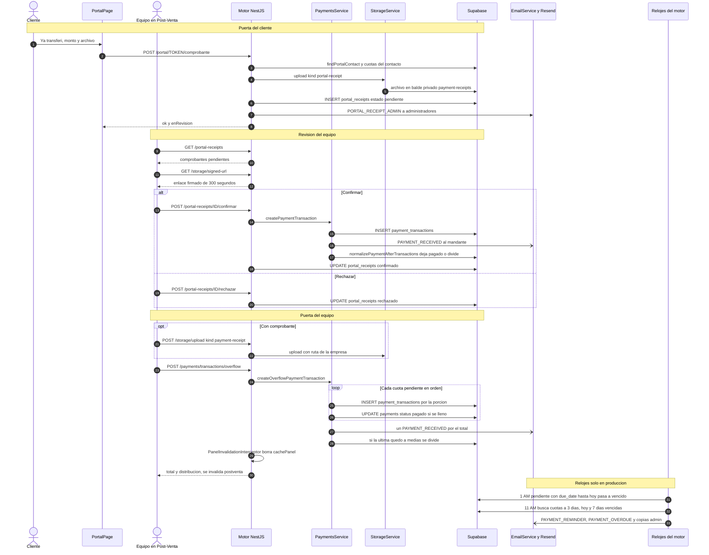

# Flujo: Registrar un abono o comprobante hasta la cuota pagada

> **Estado: verificado una vez contra el código** (commit 0de0ddb, 11-09-2026). Falta la etapa de completar lo que no quedó escrito. Parte del atlas; índice de flujos en flujos/00_INDICE_DE_FLUJOS.md y del sistema en ../00_MAPA_DEL_SISTEMA.md.

## 1. En palabras simples

Cuando un evento se acepta nace su plan de cuotas. La plata que entra no se escribe encima de la cuota: se anota como un **registro de pago** (un abono) colgado de ella, y después el sistema **cuadra** la cuota.

Hay dos puertas. **El equipo** registra el pago en Post-Venta, y si el monto alcanza para más de una cuota se **derrama** a las siguientes. **El cliente**, desde su portal, aprieta "Ya transferí" y sube el comprobante. Eso **no** es un pago: queda "por confirmar" hasta que alguien del equipo lo revisa. En palabras del código, *la plata nunca se registra sola*.

La regla de cuadratura es de Felipe (20-07-2026): tras cualquier registro, la cuota queda 100 % pagada o 100 % pendiente. Si el pago fue parcial, la cuota se parte en dos.

Al cliente le llega "Pago recibido", y a los administradores un aviso cuando el cliente sube un comprobante. Todos los días un reloj marca las cuotas vencidas y manda como máximo tres recordatorios por cuota. El Dashboard, la Caja, la ficha del cliente y el portal leen estas mismas tablas: no existe una tabla de saldos aparte.

## 2. El recorrido paso a paso

### Bloque A — El equipo registra un pago en Post-Venta

1. **Persona de operaciones o administración, en pantalla.** Entra a `/post-venta/:id`, pestaña Pagos. La ruta está protegida por `PermissionGuard` con `SECTION_ROLES.payments` (`OPERATIONS_AND_UP`) en `frontend/src/App.tsx`. El formulario es `RegistrarPagoPanel`, en `frontend/src/pages/postventa/PostVentaPage.tsx`, y hace esto:
   - arma `pending` (cuotas con `amount - paid_amount > 0`, en orden de número);
   - calcula el tope `maxAmount` (la suma de los saldos) y muestra una vista previa del derrame;
   - `recibirComprobante` rechaza archivos que no sean imagen o PDF, o que pesen más de 5 MB;
   - si `maxAmount <= 0`, el panel no se dibuja. El corte va después de todos los hooks: el comentario advierte que un `return` temprano dio pantalla blanca justo al registrar el pago que deja el saldo en cero.

2. **Pantalla → almacenamiento (solo si hay archivo).**
   - `uploadPaymentReceipt(file, quotationId, pending[0].id)`, en `frontend/src/services/storage.service.ts`, pasa por `subir`, que repite en el navegador el filtro de tipo y tamaño (`validateImageFile`), y llama a `POST /storage/upload` (multipart, `kind=payment-receipt`).
   - `StorageController.upload` pasa a `StorageService.upload` (`api-rest/src/storage/storage.service.ts`), que valida el tipo (`image/jpeg`, `image/jpg`, `image/png`, `image/webp`, `application/pdf`) y el tamaño (5 MB).
   - La ruta la arma el motor con la empresa de la sesión: `c<empresa>/payment-receipts/<cotización>/<cuota>/receipt_<fecha-hora>.<ext>`. El archivo se sube al balde **privado** `payment-receipts` con la llave de servicio.
   - Devuelve la **ruta**, no una URL.
   - Ojo: la ruta lleva el id de la **primera** cuota pendiente aunque el pago se derrame a varias, y todas las transacciones del derrame guardan esa misma ruta.

3. **Pantalla → motor.** `createOverflowPayment`, en `frontend/src/services/paymentTransactions.service.ts`, llama a `POST /payments/transactions/overflow`.
   - Envía `quotation_id`, `amount` (redondeado), `payment_method`, `transaction_date`, `notes` y `receipt_photo_url`.
   - El medio de pago es uno de los `PAYMENT_METHODS` de la pantalla: Transferencia, Efectivo, Cheque, Tarjeta u Otro.
   - El cuerpo se valida con `CreateOverflowTransactionDto` (monto mínimo 1).
   - Lo recibe `PaymentsController.createOverflowPaymentTransaction`, con `@Roles(...OPERATIONS_AND_UP)`.

4. **Servicio: el derrame.** Lo hace `PaymentsService.createOverflowPaymentTransaction`:
   - Lee las cuotas `pendiente` y `vencido` de la cotización con `PaymentsRepository.findAllPaymentsFromQuotation`, ordenadas por `payment_number` ascendente. Si no hay ninguna, lanza "No hay cuotas pendientes para esta cotización".
   - Calcula el saldo de cada cuota con `Number()` (el comentario dice "Numeric llega como texto") y rechaza el pago si supera el saldo total.
   - Recorre las cuotas en orden. En cada una, `PaymentsRepository.createPaymentTransaction` inserta una fila en `payment_transactions` con la porción que le toca. Si esa porción llena la cuota, `PaymentsRepository.updatePayment` deja `payments.status = 'pagado'`.
   - Manda **un solo** correo `PAYMENT_RECEIVED` por el total (ver paso 20).
   - Si la última cuota tocada quedó a medias, llama a `normalizePaymentAfterTransactions` para partirla (paso 18).
   - Devuelve `{ total, distribution }`.
   - Todo error, incluido el del tope, se relanza como `new Error(error)`: al navegador le llega un 500 genérico, no un 400 con el mensaje. En la práctica la pantalla ya bloquea montos sobre el saldo (`amountValid`).

5. **Efecto automático: se borra el caché del panel.** El interceptor global `PanelInvalidationInterceptor` (`api-rest/src/cache/panel-invalidation.interceptor.ts`, registrado como `APP_INTERCEPTOR` en `api-rest/src/app.module.ts`) detecta una petición que no es GET (aquí, un POST) con `req.user.company_id` y, recién cuando terminó bien (`tap`), llama a `invalidarPanelEmpresa` (`api-rest/src/cache/memoria.ts`), que borra de `cachePanel` todas las claves `<empresa>:` (los paneles `dash` y `stats`).

6. **Vuelta a la pantalla.**
   - Aparece un toast de éxito ("repartido en N cuotas" si corresponde) y el formulario se cierra.
   - Se llama a `onChanged`, que es `refreshAfterSave`. Esa función invalida en React Query las claves `["quotations"]`, `["clientSummary"]`, `["quotation"]` y `["postventa"]`.
   - La última vuelve a ejecutar `fetchEvents` (`GET /payments/transactions` + clientes + reembolsos pagados), y la cuota aparece como `pagado`.

### Bloque B — El cliente sube su comprobante desde el portal

7. **El cliente abre su portal.** Entra a `/portal/:token` (ruta pública en `frontend/src/App.tsx`; página `frontend/src/pages/portal/PortalPage.tsx`). `cargar()` llama a `GET /portal/:token`, que recibe `PortalController.getPortal` (`@Public`) y pasa a `QuotationsService.getPortalData`:
   - Si el token tiene menos de 40 caracteres, responde 404 sin pistas.
   - `QuotationsRepository.findPortalContact(token)` busca el contacto por `client_contacts.portal_token` (migración 48).
   - `QuotationsRepository.findAllByContact` trae las cotizaciones de ese contacto (`quotations.client_contact_id`) en estado `enviada`, `en_negociacion`, `aceptada` o `realizada`.
   - Para las aceptadas y realizadas lee:
     - las cuotas, con `PaymentsService.findAllPaymentsFromQuotation`;
     - los reembolsos pagados, con `RefundsService.paidMapByCompany`;
     - las cuotas con comprobante pendiente, con `PortalReceiptsRepository.pendingPaymentIds`.
   - Por cada cuota arma:
     - `estado`: si no está pagada y `vence < hoy`, se muestra vencida;
     - `abonado`;
     - `pagadaEl`, que es la `transaction_date` más reciente;
     - `enRevision`.

8. **El cliente llena el formulario.**
   - En una cuota que no está pagada ni tiene `enRevision`, aprieta "Ya transferí — enviar mi comprobante".
   - El monto viene precargado con `monto - abonado`, y ese valor es también el tope (`compMax`).
   - Adjunta el archivo. El campo solo filtra `accept="image/*,application/pdf"`; la página no revisa el tamaño.
   - `enviarComprobante` valida que el monto sea mayor que 0 y no supere el tope, y hace `POST /portal/:token/comprobante` en multipart con `file`, `payment_id` y `declared_amount`.

9. **El motor valida y guarda.** La petición llega a `PortalController.submitReceipt`, que tiene `@Public`, `@Throttle` de 10 por minuto, `FileInterceptor('file')` y el DTO `SubmitPortalReceiptDto`. De ahí pasa a `QuotationsService.submitPortalReceipt`:
   - Si el token es inválido o el contacto no tiene cliente, responde 404.
   - El monto se redondea y tiene que ser mayor que 0.
   - La cuota tiene que pertenecer a una cotización **de este contacto**. Si no, responde 404.
   - Si la cuota ya está `pagado`, responde 400 "Esta cuota ya está pagada". Si el monto supera lo pendiente, responde 400.
   - Recién después de esas validaciones, `StorageService.upload` con `kind: 'portal-receipt'` aplica los mismos filtros del paso 2 (sin archivo → 400 "No llegó ningún archivo"; solo JPG, PNG, WebP o PDF; máximo 5 MB) y guarda el archivo en el balde privado con la ruta `c<empresa>/portal-receipts/<cotización>/<fecha-hora>_<nombre saneado>`.
   - Como el portal acepta `image/*`, una imagen en otro formato (por ejemplo GIF) pasa el navegador y el motor la rechaza con 400; el portal muestra ese mensaje (`compError`).
   - `PortalReceiptsRepository.insert` crea la fila en `portal_receipts` con `company_id`, `quotation_id`, `payment_id`, `client_contact_id`, `file_url` (la ruta) y `declared_amount`. La base completa `status = 'pendiente'` y `created_at`.

10. **Efecto automático: aviso al equipo.** Va dentro de un try/catch: si el correo falla, el comprobante queda guardado igual.
    - `UsersService.findAll(companyId, ADMINISTRADOR)` obtiene los administradores y `EmailService.sendEmail(admins, PORTAL_RECEIPT_ADMIN, …)` les escribe.
    - Asunto: "💸 Comprobante por confirmar — <mandante> · cot. N° <n>". Plantilla: `api-rest/src/email/templates/portalReceipt/admin.ts`, que dice "entra a Post-Venta → Comprobantes".
    - El motor responde `{ ok: true, enRevision: true }`.
    - Como la petición es pública (no hay `req.user`), el interceptor **no** borra el caché del panel. Es correcto: todavía no cambió la plata.

11. **Vuelta al portal.** `cargar()` se ejecuta de nuevo: la cuota muestra el chip azul "comprobante en revisión" y el botón desaparece.

### Bloque C — El equipo revisa el comprobante

12. **Aviso en el Dashboard.** `frontend/src/pages/dashboard/DashboardPage.tsx` es sección solo de administrador.
    - La consulta `["postventa","comprobantes"]` (`staleTime` 0) llama a `listPortalReceipts` → `GET /portal-receipts` → `PortalReceiptsController.list` → `PortalReceiptsRepository.listPending(companyId)`.
    - Esa lectura trae los comprobantes en estado `pendiente`, con número de cotización, cliente, número de cuota y contacto, del más antiguo al más nuevo.
    - Si hay alguno, en "Para actuar hoy" aparece la tarjeta "💸 Comprobantes del portal · por confirmar", que lleva a `/post-venta`.

13. **Bandeja en Post-Venta.** Usa la misma clave `["postventa","comprobantes"]`, con `staleTime` de 2 minutos y un sondeo cada 5 minutos. El sondeo se bajó el 17-08 por el reclamo "cargar comprobantes está lento".
    - El botón "💸 Comprobantes (n)" abre la bandeja.
    - Dentro de la ficha del evento, en la pestaña Pagos, un aviso ámbar dice "Este evento tiene N comprobante(s) del portal por confirmar". Su `onOpenReceipts` vuelve a la lista (`navigate("/post-venta")`) y abre la misma bandeja.

14. **Ver el archivo.** `FileViewLink` (`frontend/src/components/FileViewLink.tsx`) llama a `resolveStorageUrl`, que hace `GET /storage/signed-url?src=<ruta>` y llega a `StorageService.signedUrl`:
    - `extraerRuta` y `verificarDueno` revisan que el primer tramo `c<empresa>` sea la empresa de la sesión (las rutas viejas se verifican buscando su cotización).
    - Devuelve un enlace firmado que dura 300 segundos.

15. **Confirmar.** El botón "Confirmar y registrar pago" ejecuta `actuarComprobante(id, 'confirmar')` → `confirmPortalReceipt` (`frontend/src/services/portalReceipts.service.ts`) → `POST /portal-receipts/:id/confirmar` con cuerpo `{}`. Lo recibe `PortalReceiptsController.confirm`, con `@Roles(...OPERATIONS_AND_UP)`:
    - `PortalReceiptsRepository.findOne(id, companyId)` busca el comprobante. Si no existe, no está `pendiente` o no tiene `payment_id`, responde 400 "Este comprobante ya fue revisado o no es válido".
    - Registra el pago por **la puerta de siempre**: `PaymentsService.createPaymentTransaction` (paso 17), con estos datos:
      - `payment_id` y `quotation_id` del comprobante;
      - `amount` = `Number(declared_amount)` (la columna es `numeric`);
      - `payment_method` = `dto.payment_method || 'Transferencia bancaria'`;
      - `transaction_date` = la fecha de hoy en UTC (`new Date().toISOString().slice(0,10)`);
      - `notes` = 'Comprobante recibido por el portal del cliente';
      - `receipt_photo_url` = `file_url`.
    - Recién después, `PortalReceiptsRepository.review(id, 'confirmado')` escribe `status`, `review_note = null` y `reviewed_at = now`.
    - El interceptor borra el caché del panel, porque aquí sí hay `req.user`.
    - En pantalla, `queryClient.invalidateQueries({ queryKey: ["postventa"] })` refresca la bandeja y la lista de eventos.

16. **Rechazar.**
    - Va en dos toques: el primer "Rechazar" abre el campo "Motivo (opcional)"; el segundo ejecuta `actuarComprobante(id, 'rechazar')` → `rejectPortalReceipt(id, note)` → `POST /portal-receipts/:id/rechazar` → `PortalReceiptsController.reject`, con `@Roles(...OPERATIONS_AND_UP)`.
    - El comprobante tiene que estar `pendiente` (si no, 400 "Este comprobante ya fue revisado"); luego `review(id, 'rechazado', note)`.
    - Es un POST con sesión, así que el interceptor también borra el caché del panel aunque la plata no cambió (su comentario dice que borra de más a propósito). En pantalla, `actuarComprobante` invalida `["postventa"]`.
    - No sale correo al cliente, y `getPortalData` no muestra `review_note`: en el portal, la cuota simplemente vuelve a ofrecer "Ya transferí".
    - El archivo queda en el balde.

### Bloque D — Registro individual y cuadratura (común a las dos puertas)

17. **Registro individual.** `PaymentsService.createPaymentTransaction` llama a `createOrUpdatePaymentTransaction(payload, companyId, isUpdate = false)`, que sigue estos pasos:
    1. `PaymentsRepository.findPaymentById(payment_id, companyId)`: une con `quotations!inner` y filtra por empresa.
    2. `PaymentsRepository.findAllTransactionsByPaymentId`.
    3. Calcula `current_paid` como la suma de `t.amount` (**sin** `Number()`) y `new_paid = current_paid + amount`. Si supera `payment.amount`, lanza "El monto total no puede exceder …".
    4. `PaymentsRepository.createPaymentTransaction` inserta en `payment_transactions`.
    5. Envía el correo `PAYMENT_RECEIVED` (paso 20).
    6. Llama a `normalizePaymentAfterTransactions`.

    Hoy, el único que usa esta puerta para crear un registro suelto es la confirmación del portal. La ruta `POST /payments/transactions` (`PaymentsController.createPaymentTransaction`, `@Roles(...OPERATIONS_AND_UP)`) existe, pero el frontend no la llama: en `frontend/src/services/paymentTransactions.service.ts`, `PAYMENTS_TRANSACTIONS` solo se usa con GET, PATCH y DELETE, y Post-Venta siempre crea por el derrame.

    Los errores se relanzan como `new Error(error)` y no como `HttpException`, así que al navegador le llega un 500 genérico.

18. **Cuadratura de la cuota.** Es `PaymentsService.normalizePaymentAfterTransactions` (privada; regla de Felipe del 20-07-2026):
    - Suma lo abonado con `Number()`. Este arreglo es del 24-08: la suma de textos "0"+"20800" daba "020800" y paría una cuota fantasma de $0 (la cuota 12 de la #486, Quillón).
    - Considera la cuota vencida si `new Date(due_date) < new Date()` (`overdue`).
    - **Abonado 0:** `status` pasa a `vencido` o `pendiente` según la fecha, y `paid_date = null`.
    - **Abonado igual o mayor que el monto:** `status = 'pagado'`. **Esta es la cuota pagada.**
    - **Abonado entre 0 y el monto: división.**
      - Las cuotas posteriores corren su `payment_number` en +1, de la última hacia atrás.
      - La cuota queda con `amount` = lo abonado y `status = 'pagado'`.
      - `createPayment` crea una cuota nueva con `payment_number + 1`, `amount` = el remanente y **el mismo `due_date`**. Nace `vencido` o `pendiente` según la fecha, y copia `payment_type` y `notes`.
    - `paid_date` nunca recibe una fecha en este flujo: la fecha de pago se deduce del último abono (`fechaDelUltimoAbono`, en el mismo archivo).

19. **Rectificar o eliminar un registro.** Pasa por la misma cuadratura.
    - **Rectificar (lápiz del registro).** Abre `EditRegistroModal`, que puede subir un archivo nuevo con `uploadPaymentReceipt(file, quotationId, tx.payment_id, tx.id)` y luego llama a `PATCH /payments/transactions/:id` → `PaymentsService.updatePaymentTransaction` → `createOrUpdatePaymentTransaction(isUpdate = true)`:
      - busca el registro con `findPaymentTransactionById` (sin filtro de empresa) y la cuota con `findPaymentById` (con filtro);
      - valida que no exceda la cuota; si excede, el mensaje sugiere eliminar y volver a registrar para que el pago se derrame;
      - hace `updatePaymentTransaction` y cuadra;
      - no manda correo.
    - **Eliminar (basurero del registro).** Pide confirmación con `ConfirmInline` y llama a `DELETE /payments/transactions/:id` → `PaymentsService.removePaymentTransaction`:
      - lee el registro, lo borra con `PaymentsRepository.removePaymentTransaction` (sin filtro de empresa) y cuadra la cuota, que vuelve a `pendiente` o `vencido` si queda en cero;
      - el archivo del comprobante no se borra.
    - Las dos acciones vuelven por `onDataChanged`, que es `refreshAfterSave` (paso 6).

20. **Correo "Pago recibido" al cliente.** `EmailService.sendEmail(mandante.email, PAYMENT_RECEIVED, { clientName, companyName, amount, paymentMethod, transactionDate }, companyId, portalToken)` se lanza con `void`: nadie espera su resultado.
    - **Destinatario:** solo el mandante, obtenido con `QuotationsService.mandanteOf(quotation.client_contact_id)`. Es la regla "correos a personas y punto" (30-07). Sin correo, solo queda un `warn` en el log.
    - **Dentro de `EmailService.sendEmail`:**
      - con `EMAILS_SILENCED=1` no sale nada (es el silenciador del laboratorio);
      - como `PAYMENT_RECEIVED` está en `EMAILS_SEND_TO_CLIENT`, `shouldSendEmail` revisa `companies.notifications.emails`. Sin configuración, el correo está encendido. El interruptor "Pago Recibido" está en `frontend/src/pages/configuration/constants.ts`;
      - el remitente lleva el nombre de la empresa, con `replyTo` de la empresa y botón al portal.
    - **Asunto:** "Pago recibido ✓ — <empresa>". **Plantilla:** `api-rest/src/email/templates/paymentReceived/paymentReceived.ts`.

### Bloque E — Relojes

Solo corren con `NODE_ENV === 'production'` (`ScheduleModule.forRoot({ cronJobs: … })` en `api-rest/src/app.module.ts`). Usan la hora del servidor; el comentario de `api-rest/src/quotations/quotations-cron.service.ts` habla de "11:00 UTC".

21. **1 AM: marcar vencidas.** `PaymentsService.updateOverduePayments` (`@Cron(EVERY_DAY_AT_1AM)`) llama a `PaymentsRepository.updateOverduePayments`, que hace `payments.status = 'vencido'` donde `status = 'pendiente'` y `due_date <= ahora` (`.lte` con la hora ISO actual). Aplica a todas las empresas, sin mirar abonos ni el estado de la cotización.

22. **11 AM: recordatorios.** Corren dos tareas, ambas con `@Cron(EVERY_DAY_AT_11AM)`:
    - **`PaymentsCronService.checkUpcomingOverduePayments`:** cuotas `pendiente` que vencen en 3 días o hoy → correo `PAYMENT_REMINDER`.
    - **`PaymentsCronService.checkOverduePayments`:** cuotas `vencido` con 7 días de vencidas → correo `PAYMENT_OVERDUE`.
    - Los hitos están en `api-rest/src/payments/constants/index.ts`.
    - Las dos usan `checkUpcomingOrOverduePayments`:
      - calcula las fechas con `normalizeDateToUtc` y lee `PaymentsRepository.findAllPaymentsWithTransactions(undefined, [estado], fechas)`;
      - por cada cuota escribe al mandante (si tiene correo, con enlace al portal) y a los administradores (`PAYMENT_REMINDER_ADMIN` o `PAYMENT_OVERDUE_ADMIN`);
      - el monto del correo es `payment.amount`, o sea el monto completo de la cuota.

23. **Cada 30 minutos: aviso push al móvil.** `MovilService.cicloAvisos` (`api-rest/src/movil/movil.service.ts`) solo corre si existen `VAPID_PUBLIC_KEY` y `VAPID_PRIVATE_KEY`, y solo para empresas con `push_devices`.
    - `avisosDeEmpresa` busca cuotas con `status` distinto de `pagado`, de cotizaciones con `request_type = 'cotizacion'` en estado aceptada o realizada, con `due_date < hoy` (fecha UTC) y abonado menor que el monto.
    - Inserta cada aviso en `notifications` con `dedupe_key = vencido-<cuota>-<fecha>` y lo empuja al teléfono.
    - El comentario del archivo dice que producción aún no tiene las llaves.

### Bloque F — Dónde se ve la cuota pagada (lecturas)

24. **Post-Venta.**
    - `GET /payments/transactions` llega a `PaymentsService.findAllPaymentsWithTransactions`, que agrega `paid_amount`, `payment_count` y `last_payment_date` (`fechaDelUltimoAbono`).
    - `fetchEvents` arma por evento `total`, `paid`, `refunded`, el saldo neto y el estado: `pagado` si el saldo es 0 o menos; `vencido` si alguna cuota lo está según `cuotaStatus`.

25. **Dashboard, fila "Hoy".** `GET /analytics/hoy` (`ADMIN_ONLY`) llega a `HoyRepository.alerts` (`api-rest/src/analytics/hoy.controller.ts`).
    - Lee las cuotas `pendiente` y `vencido` de cotizaciones no canceladas, y sus abonos de a 200 ids.
    - `sumarPorCobrar` calcula `porCobrar.pendiente` y `porCobrar.vencido`.
    - En pantalla usa la clave `["dashboard-hoy", company.id]`, con sondeo cada 5 minutos. No tiene caché en el motor.

26. **Dashboard, panel de Caja.** `GET /analytics/dashboard` llega a `AnalyticsService.getDashboardStats`:
    - Primero mira `cachePanel`, con clave `<empresa>:dash:<desde>:<hasta>` y vida de 1 hora.
    - Si no está en caché, lee las cuotas de lo creado en el período más lo concretado (sin canceladas) y arma `totalPaymentsDetailByMonth`:
      - **cobrado:** cuotas `pagado`, en el mes del último abono (con `paid_date` de respaldo; regla del 28-08);
      - **por cobrar:** el saldo real (monto menos abonos), en el mes de vencimiento;
      - desglose por evento (31-08).
    - Se muestra en la mitad CAJA de `frontend/src/pages/dashboard/IngresosYCaja.tsx`.

27. **Portal y ficha del cliente.**
    - El portal recalcula todo en cada visita (paso 7).
    - La ficha 360° usa `GET /clients/:id/summary`, que llega a `ClientsRepository.findSummary` y trae las cuotas `pendiente` y `vencido`. `frontend/src/pages/ClientDetailPage.tsx` suma su **monto completo** como saldo pendiente, sin restar abonos.

## 3. Diagrama

## 4. Datos que cambian

| tabla | columnas | en qué paso | quién escribe |
|---|---|---|---|
| `portal_receipts` | INSERT `company_id`, `quotation_id`, `payment_id`, `client_contact_id`, `file_url`, `declared_amount` (la base pone `status='pendiente'` y `created_at`) | 9 | `PortalReceiptsRepository.insert`, llamado por `QuotationsService.submitPortalReceipt` |
| `portal_receipts` | UPDATE `status` (`confirmado` o `rechazado`), `review_note`, `reviewed_at` | 15, 16 | `PortalReceiptsRepository.review`, llamado por `PortalReceiptsController.confirm` y `reject` |
| `payment_transactions` | INSERT `payment_id`, `quotation_id`, `amount`, `payment_method`, `transaction_date`, `notes`, `receipt_photo_url` (`created_by` nunca se llena) | 4, 15-17 | `PaymentsRepository.createPaymentTransaction`, desde `createOverflowPaymentTransaction` o `createOrUpdatePaymentTransaction` |
| `payment_transactions` | UPDATE `amount`, `payment_method`, `transaction_date`, `notes`, `receipt_photo_url` | 19 | `PaymentsRepository.updatePaymentTransaction` |
| `payment_transactions` | DELETE de la fila | 19 | `PaymentsRepository.removePaymentTransaction` |
| `payments` | UPDATE `status='pagado'` | 4, 18 | `PaymentsRepository.updatePayment` (derrame y cuadratura) |
| `payments` | UPDATE `status` a `pendiente` o `vencido` y `paid_date=null` | 18 (abonado 0) | `normalizePaymentAfterTransactions` |
| `payments` | UPDATE `amount` y `status` de la cuota dividida; `payment_number` +1 de las posteriores | 18 | `normalizePaymentAfterTransactions` |
| `payments` | INSERT de la cuota remanente: `quotation_id`, `payment_number`, `amount`, `due_date`, `status`, `payment_type`, `notes` | 18 | `PaymentsRepository.createPayment` |
| `payments` | UPDATE `status='vencido'` | 21 | `PaymentsRepository.updateOverduePayments` (reloj de la 1 AM) |
| `notifications` | INSERT `company_id`, `dedupe_key`, `tipo='vencido'`, `titulo`, `detalle`, `destino` | 23 | `MovilService.cicloAvisos` |
| Balde `payment-receipts` (Supabase Storage) | archivo nuevo en `c<empresa>/portal-receipts/...` o `c<empresa>/payment-receipts/...` | 2, 9, 19 | `StorageService.upload` |
| Memoria del motor `cachePanel` | borra las claves `<empresa>:` | 5, 15, 16, 19 | `PanelInvalidationInterceptor` → `invalidarPanelEmpresa` |
| Caché de React Query (navegador) | invalida `["postventa"]`, `["quotations"]`, `["clientSummary"]`, `["quotation"]` | 6, 19 | `refreshAfterSave` en `PostVentaPage.tsx` |
| Caché de React Query (navegador) | invalida solo `["postventa"]` (lista de eventos y bandeja) | 15, 16 | `actuarComprobante` en `PostVentaPage.tsx` |

`payments.updated_at` no lo escribe ningún código de este flujo, y no encontré un trigger en `docs/migrations` (ver preguntas abiertas).

## 5. Efectos automáticos y colaterales

**Correos**
- **`PAYMENT_RECEIVED` (al mandante).**
  - Sale uno por cada registro individual (confirmación del portal) y uno por cada derrame completo. No sale al rectificar ni al eliminar.
  - Se lanza con `void`: si Resend falla, solo queda el log "Resend devolvió error para …".
  - Pasa por `shouldSendEmail` (el interruptor de la empresa).
- **`PORTAL_RECEIPT_ADMIN` (a los administradores).**
  - Sale al subir un comprobante. Se espera con `await` dentro de un try/catch.
  - No pasa por `shouldSendEmail`, porque no está en `EMAILS_SEND_TO_CLIENT`.
- **`PAYMENT_REMINDER` y `PAYMENT_OVERDUE` (al mandante), más `PAYMENT_REMINDER_ADMIN` y `PAYMENT_OVERDUE_ADMIN` (a los administradores).** Los dispara el reloj de las 11 AM.
- **Lo que no existe:** un correo "tu comprobante fue confirmado" distinto del `PAYMENT_RECEIVED`, y un correo al rechazar.

**Relojes**
- **1 AM:** marca vencidas (`updateOverduePayments`).
- **11 AM:** dos tareas de recordatorio (`PaymentsCronService`).
- **Cada 30 minutos:** push del móvil (`MovilService.cicloAvisos`), dormido si no hay llaves VAPID.

**Cascadas en la base**
- El derrame toca varias cuotas.
- La división renumera las cuotas posteriores y crea una cuota nueva, que recibe un id nuevo. En el móvil eso produce un `dedupe_key` nuevo y, con él, un push nuevo.
- `portal_receipts.payment_id` tiene `ON DELETE SET NULL` y `portal_receipts.quotation_id` tiene `ON DELETE CASCADE` (migración 49).
- `payments.quotation_id` y `payment_transactions.quotation_id` apuntan a `quotations` sin cascada (`docs/migrations/0_initial_models.sql`; el comentario de `QuotationsRepository.assertDeletable` suma `refunds` y las respuestas de encuesta). Por eso no se puede borrar una cotización con registros ni con plan de pagos: `assertDeletable` (26-07) traduce ese bloqueo a un mensaje claro y, si hay plan pero no plata, indica pasarla a un estado de pre-venta.
- `payment_transactions.payment_id` tampoco tiene cascada: una cuota no se puede borrar mientras tenga registros (ver pregunta abierta 13).

**Caché del motor (`cachePanel`, en `api-rest/src/cache/memoria.ts`)**
- Se borra con cualquier POST, PATCH o DELETE autenticado de la empresa.
- **No** se borra cuando la base cambia por un reloj ni cuando alguien edita directo en Supabase: en esos casos el panel puede quedar hasta 1 hora con números viejos.
  - El reloj de la 1 AM no altera las cifras del panel: `getDashboardStats` solo distingue `pagado` de "no pagado".
  - Una edición manual en la base sí las altera.
- La fila "Hoy" (`HoyRepository.alerts`) no tiene caché en el motor.
- Un redeploy vacía toda la memoria.

**Caché del navegador (React Query, `frontend/src/lib/queryClient.ts`: `staleTime` 30 s por defecto, `refetchOnWindowFocus`)**
- **Lo que `refreshAfterSave` no invalida:**
  - `["dashboard", …]` (panel de Caja);
  - `["dashboard-hoy", …]`;
  - `["payments", quotationId]`, que usan `AvisoPlanDePagos` y `ServiciosTab` con `staleTime` 30 s.
  
  Esas vistas se ponen al día por su `staleTime`, al volver el foco a la pestaña o con el sondeo de 5 minutos de "Hoy".
- **El Dashboard y Post-Venta comparten la clave `["postventa","comprobantes"]`:** confirmar un comprobante en Post-Venta también actualiza la tarjeta del Dashboard.
- **El portal no usa caché, pero tampoco se entera solo:** si el equipo confirma mientras el cliente tiene la página abierta, el cliente sigue viendo "en revisión" hasta recargar.

**Archivos**
- No se borran al rechazar un comprobante ni al eliminar un registro.
- Tampoco se borran si la subida salió bien pero el paso siguiente falló: quedan huérfanos en el balde.

## 6. Reglas de negocio que gobiernan el flujo

1. **La plata nunca se registra sola.** Lo que sube el cliente queda pendiente hasta que el equipo lo confirma. Evidencia: cabecera de `api-rest/src/quotations/portal-receipts.controller.ts`; `docs/migrations/49_comprobantes_portal.sql` (30-07-2026, "Portal Fase 2b").
2. **Cuadratura: la cuota queda 100 % pagada o 100 % pendiente, y un pago parcial la divide.** La cuota remanente hereda el vencimiento: si la original estaba vencida, nace vencida. Evidencia: `PaymentsService.normalizePaymentAfterTransactions` ("Regla de cuadratura (Felipe, 20-07-2026)").
3. **Derrame desde la cuota más próxima hacia adelante, con un solo correo por el total.** Evidencia: `CreateOverflowTransactionDto` y `PaymentsService.createOverflowPaymentTransaction`; commit b88983d (17-07-2026).
4. **Topes en todas las puertas.**
   - **Derrame:** no más que el saldo total.
   - **Registro individual:** no más que la cuota. Para pagar de más, el mensaje manda a eliminar y volver a registrar.
   - **Portal:** no más que lo pendiente de la cuota, y solo en cuotas no pagadas.
   
   Evidencia: `createOverflowPaymentTransaction`, `createOrUpdatePaymentTransaction`, `QuotationsService.submitPortalReceipt`.
5. **"Correos a personas y punto" (30-07).** Los correos de plata solo van al mandante vinculado a la cotización. Sin persona con correo, no se envía nada. Evidencia: comentarios en `createOrUpdatePaymentTransaction`, `createOverflowPaymentTransaction` y `PaymentsCronService.checkUpcomingOrOverduePayments`.
6. **Anti-spam: como máximo 3 toques por cuota** (3 días antes, el día del vencimiento y a los 7 días de vencida). Antes eran hasta 6. Evidencia: `api-rest/src/payments/constants/index.ts` ("decisión de Felipe 29-07").
7. **Si la empresa no configuró sus avisos, todo está encendido** (Felipe, 29-07). Evidencia: `EmailService.shouldSendEmail`.
8. **La fecha de cobro es la del último abono, no la del primero ni la del vencimiento.** Evidencia:
   - `fechaDelUltimoAbono` (28-08): de 52 cuotas pagadas en varios abonos, 38 mostraban la fecha equivocada;
   - `AnalyticsService.getDashboardStats`: 55 de 174 cuotas pagadas caían en el mes equivocado, por $101.066.964.
9. **"Por cobrar" es el saldo real (monto menos abonos), nunca el monto completo.** Evidencia: `sumarPorCobrar` (#332, 07-08-2026) y `getDashboardStats` (caso Brito Pradenas, 28-08).
10. **Los reembolsos no suman como deuda por cobrar.** Evidencia: comentario en `HoyRepository.alerts` (07-08; la #93 pagó de más).
11. **A una cuota con dinero registrado no se le edita la fecha ni la nota: se rectifica el registro.** Evidencia: `PaymentsService.updatePaymentSchedule` y `UpdatePaymentScheduleDto` (calendario Nivel A, 29-07).
12. **Los comprobantes van en un balde privado.** La ruta la arma el motor con la empresa de la sesión, y para verlos se entrega un enlace firmado de 300 segundos. Evidencia: cabecera "MISIÓN STORAGE" de `StorageService`; `docs/migrations/42_storage_candado.sql` (aplicada en producción el 28-07).
13. **El evento realizado se congela, pero la cobranza sigue viva.** Rehacer el plan de un realizado no lo devuelve a "aceptada". Evidencia: `api-rest/src/quotations/tests/unit/candado-evento-realizado.spec.ts` (13-08); `PaymentsService.createPaymentPlan` ("PUERTA DE ATRÁS TAPADA").
14. **Medios de pago unificados: Transferencia, Efectivo, Cheque, Tarjeta y Otro.** Evidencia: `docs/migrations/102_unificar-medios-de-pago.sql` (Felipe, 28-08) y `PAYMENT_METHODS` en `PostVentaPage.tsx`.
    - **Contradicción:** `PortalReceiptsController.confirm` sigue escribiendo `'Transferencia bancaria'`, la etiqueta que esa migración reemplazó.
15. **Un evento anulado conserva sus pagos como historia, pero sale de la Caja y de la fila "Hoy".** Evidencia: comentario de `doCancelEvent` en `PostVentaPage.tsx`; filtro de canceladas en `getDashboardStats`; `.neq('quotations.quotation_status','cancelada')` en `HoyRepository.alerts`.
16. **Una cotización con pagos registrados no se borra ni vuelve a pre-venta: se anula.** Evidencia: `QuotationsRepository.assertDeletable` (26-07) y la "GUARDIA DE ESTADOS" en `QuotationsService.update`.
17. **El portal es de la persona.** Un contacto tiene un solo enlace secreto de al menos 40 caracteres, ve todas sus cotizaciones y solo las suyas. Un token malo responde 404 sin pistas. Evidencia: `QuotationsService.getPortalData`; `docs/migrations/48_portal_del_mandante.sql` (30-07).

## 7. Si cambias algo en este flujo

1. **Si cambias** una suma de montos que vienen de la base y le quitas el `Number()`, **pasa** que un pago exacto puede dividir la cuota y parir una cuota fantasma de $0, vencida, **porque** según el comentario del 24-08 los `numeric` llegan como texto, y "0"+"20800" se compara alfabéticamente. Evidencia: `normalizePaymentAfterTransactions`; la prueba "un pago exacto marca la cuota pagada y NO pare una cuota de $0"; commit c23c966 (24-08); cuota 12 de la #486.
2. **Si cambias** el "por cobrar" para que use `payments.amount` en vez del monto menos abonos, **pasa** que el Dashboard vuelve a mostrar deuda inflada, **porque** las cuotas antiguas conservan su monto original aunque tengan abonos. Evidencia: `sumarPorCobrar` y `api-rest/src/analytics/tests/por-cobrar.spec.ts` (#332, 07-08); `getDashboardStats` (28-08).
3. **Si cambias** la fecha de cobro para que use la primera transacción o el vencimiento, **pasa** que la Caja pone plata en el mes equivocado, **porque** la consulta no ordena las transacciones. Evidencia: `fechaDelUltimoAbono`; commit 5670078 (29-08); `analytics.service.spec.ts` ("el mes del cobro").
4. **Si cambias** el orden `payment_number asc` de `PaymentsRepository.findAllPaymentsFromQuotation`, **pasa** que el derrame llena las cuotas en otro orden y `PaymentsService.createPayment` (la usa `QuotationsService.update` para agregar una cuota cuando sube el total) calcula mal el número siguiente, **porque** los dos confían en ese orden: el derrame recorre la lista tal como llega y `createPayment` toma la última fila + 1. La división del paso 18 no depende de ese orden, porque ordena por su cuenta. Evidencia: el comentario "be careful when changing this, it will affect the payment number in update payment plan" en esa consulta.
5. **Si cambias** la confirmación del portal para que inserte el pago directo en la tabla, **pasa** que la cuota no se cuadra ni sale el correo, **porque** la cuadratura y el correo viven en `createOrUpdatePaymentTransaction`. Evidencia: el comentario "El pago REAL se registra por la puerta de siempre" en `PortalReceiptsController.confirm`.
6. **Si cambias** el orden dentro de `PortalReceiptsController.confirm` (marcar revisado antes de registrar el pago), **pasa** que una falla del pago deja el comprobante "confirmado" sin plata registrada, **porque** no hay transacción de base de datos que envuelva los dos pasos. Evidencia: `PortalReceiptsController.confirm`.
7. **Si cambias** los medios de pago o su valor por defecto, **pasa** que el informe por medio de pago sale partido, **porque** ya pasó: había "Transferencia" 13 contra "Transferencia bancaria" 198, y se corrigió con la migración 102. Hoy la pantalla manda `{}` y `confirm` escribe `'Transferencia bancaria'`, así que cada comprobante confirmado vuelve a crear la etiqueta vieja. Evidencia: `docs/migrations/102_unificar-medios-de-pago.sql`, `confirmPortalReceipt` y `PortalReceiptsController.confirm`.
8. **Si cambias** la forma de las rutas de archivo para que no empiecen con `c<empresa>`, **pasa** que `verificarDueno` las rechaza o las trata como rutas viejas, **porque** el candado de dueño se basa en ese primer tramo. Evidencia: `StorageService.verificarDueno` y `api-rest/src/storage/tests/storage.service.spec.ts`.
9. **Si cambias** estados o montos de cuotas directo en la base o con un reloj nuevo, **pasa** que el panel de Caja puede mostrar hasta una hora de números viejos, **porque** solo las escrituras HTTP autenticadas borran `cachePanel`. Evidencia: `api-rest/src/cache/memoria.ts` y `PanelInvalidationInterceptor`. Hay un antecedente con otro caché en memoria en `api-rest/REINICIOS.md` (12-08: un rol cambiado directo en la base seguía viejo en memoria).
10. **Si cambias** los hitos `UPCOMING_OVERDUE_PAYMENTS_DAYS_NOTIFICATION` u `OVERDUE_PAYMENTS_DAYS_NOTIFICATION`, **pasa** que cambian los toques al cliente, pero la pantalla de Configuración sigue diciendo "3 días antes… y el mismo día" y "7 días después de vencida", **porque** ese texto está escrito a mano. Evidencia: `api-rest/src/payments/constants/index.ts` y `frontend/src/pages/configuration/constants.ts`.
11. **Si cambias** la hora del reloj de vencidas o su comparación `.lte('due_date', ahora)`, **pasa** que cambia qué cuotas encuentra el recordatorio "vence hoy" de las 11 AM, **porque** ese recordatorio busca cuotas `pendiente` que vencen hoy, y el reloj de la 1 AM ya marcó como `vencido` lo que vence hasta hoy. Evidencia: `PaymentsRepository.updateOverduePayments` y `PaymentsCronService.checkUpcomingOrOverduePayments` (ver pregunta abierta 2).
12. **Si copias** el filtro de empresa de `findAllPaymentsFromQuotation` en una consulta nueva, **pasa** que el filtro no protege nada, **porque** `.eq('quotations.company_id', …)` sobre una tabla unida sin `!inner` no recorta las filas de `payments` en PostgREST. En cambio, `findPaymentById` y `findAllPaymentsWithTransactions` sí usan `quotations!inner`. Evidencia: `api-rest/src/payments/payments.repository.ts`; CLAUDE.md ("tenant isolation is enforced in application code").
13. **Si cambias** `RegistrarPagoPanel` y pones un `return` antes de los hooks, **pasa** que la pantalla queda en blanco al registrar el pago que deja el saldo en cero, **porque** React descuadra los hooks. Evidencia: el comentario "OJO: este corte va DESPUÉS de todos los hooks" en `RegistrarPagoPanel`.
14. **Si cambias** el tope del portal para aceptar más que la cuota, **pasa** que la confirmación falla con un 500 y el comprobante queda pendiente sin aviso en pantalla, **porque** `createOrUpdatePaymentTransaction` no derrama y `actuarComprobante` ignora el `{ error }` que devuelve `confirmPortalReceipt`. Evidencia: `QuotationsService.submitPortalReceipt`, `createOrUpdatePaymentTransaction` y `portalReceipts.service.ts`.
15. **Si cambias** el balde `payment-receipts` a público o subes archivos desde el navegador, **pasa** que cualquiera con el enlace ve comprobantes bancarios, **porque** así estaba antes del 28-07. Evidencia: cabecera de `StorageService` y `docs/migrations/42_storage_candado.sql`.

## 8. Casos borde y estados raros

**Fallas a mitad de camino**
- **El derrame falla en la segunda cuota.**
  - Los INSERT y UPDATE van uno por uno, sin transacción: lo que alcanzó a escribirse queda escrito. La pantalla recibe un 500 genérico, no sale correo y la última cuota puede quedar a medias sin dividirse.
  - **Riesgo según el código:** si la persona reintenta por el **monto completo**, el nuevo derrame parte de lo que quedó pendiente, así que la parte que ya había entrado se registra dos veces (no hay nada que lo impida si el monto cabe en el saldo restante).
- **El archivo sube pero el pago falla** (Post-Venta) **o falla el INSERT de `portal_receipts`** (portal): el archivo queda huérfano en el balde.
- **Confirmación: el pago se registró pero falló `review`.**
  - El comprobante sigue `pendiente` con la plata ya registrada.
  - Un segundo "Confirmar" choca con el tope de la cuota (que ya está llena o dividida), da 500 y no dice nada en pantalla.
  - Solo "Rechazar" lo saca de la bandeja, aunque el pago sí entró.
- **Errores que se pierden en silencio.**
  - `confirmPortalReceipt` y `rejectPortalReceipt` devuelven `{ error }` y `actuarComprobante` no lo revisa: una falla solo se nota porque el comprobante sigue en la lista.
  - `listPortalReceipts` devuelve `[]` si el motor falla, así que la tarjeta del Dashboard desaparece.
  - `getHoyAlerts` devuelve ceros si el motor falla.

**Repeticiones y simultaneidad**
- **Dos personas confirman el mismo comprobante, o registran dos derrames a la vez.** `procesandoComp` solo bloquea el botón en el navegador de quien aprieta. En la base no hay transacción, bloqueo ni restricción única: las dos lecturas pueden pasar el tope antes de que la otra inserte, y quedaría un pago doble. Esto es posible según el código; no está medido.
- **El cliente sube dos comprobantes para la misma cuota.**
  - La pantalla lo impide (muestra el chip "en revisión"), pero `submitPortalReceipt` no revisa si ya hay uno pendiente. Con dos pestañas abiertas, o llamando a la API directo, quedan dos pendientes.
  - Si el primero se confirma y divide la cuota, el segundo sigue apuntando a la cuota original, que ya quedó pagada: al confirmarlo falla con 500, en silencio.
- **Un comprobante pendiente pierde su cuota.** Si la cuota se borra (por ejemplo, al rehacer el plan), `payment_id` pasa a `null` por `ON DELETE SET NULL`. `confirm` responde entonces 400 "no es válido", y solo queda rechazarlo.

**Fechas y zonas horarias**
- **Dos reglas distintas para una cuota que "vence hoy":**
  - **Vencida el mismo día:** el reloj de la 1 AM (`.lte('due_date', ahora)`) y `normalizePaymentAfterTransactions` (`new Date(due_date) < new Date()`, con el vencimiento leído como medianoche UTC).
  - **Vencida recién al día siguiente** (`<` estricto contra "hoy"): `cuotaStatus` en Post-Venta, con la fecha local del navegador (su comentario dice "vence hoy = aún pendiente"), y con la fecha UTC del servidor `updatePaymentSchedule`, `getPortalData`, `sumarPorCobrar` y `MovilService.avisosDeEmpresa`.
  
  Como `cuotaStatus`, `getPortalData` y `sumarPorCobrar` respetan primero el `status` guardado, en la práctica se muestra lo que haya marcado el reloj. El push del móvil mira solo la fecha: por una cuota que vence hoy, avisa recién mañana.
- **La fecha de una confirmación es la fecha UTC.** En Chile, una confirmación hecha de noche (desde las 20:00 o 21:00, según horario) queda con fecha del día siguiente. Si es el último día del mes, la Caja la cuenta en el mes siguiente (paso 26).
- **La cuota remanente de una división hereda el vencimiento.** Si la original ya pasó su día "7 después", la remanente no recibirá ningún recordatorio más: el reloj busca fechas exactas.

**Datos incompletos o viejos**
- **Mandante sin correo:** no hay "Pago recibido" y los recordatorios solo llegan a los administradores. Queda un `warn` en el log.
- **Cuotas con abonos parciales que no quedaron divididas.** El comentario de `HoyRepository.alerts` cita la #332 el 07-08: una cuota de $1.623.600 con $800.000 abonados. En esos casos el recordatorio pide `payment.amount` completo, y la ficha del cliente (`ClientDetailPage`) suma el monto completo como saldo. No verifiqué por qué camino quedan hoy cuotas así.
- **Evento anulado con cuotas pendientes.** Anular no toca las cuotas, y ni `updateOverduePayments` ni `findAllPaymentsWithTransactions` (usada por el reloj) filtran por estado de la cotización. Según el código, el cliente de un evento anulado puede seguir recibiendo recordatorios con un enlace a un portal que ya no le muestra ese evento, porque `findAllByContact` excluye las canceladas.
- **Evento realizado:** se puede seguir cobrando; el candado no aplica a pagos.
- **Montos como texto.** `createOrUpdatePaymentTransaction`, `findAllPaymentsWithTransactions` (`paid_amount`), `getPortalData` (`abonado`), `submitPortalReceipt` y `QuotationsService.update` suman `t.amount` sin `Number()`. Ver la pregunta abierta 1.
- **`quotation_id` que no calza.** `createOrUpdatePaymentTransaction` no verifica que el `quotation_id` del cuerpo sea el de la cuota. El correo se busca con ese `quotation_id` (`QuotationsService.findOne`, sin filtro de empresa).

**Aislamiento entre empresas** (según el código y la semántica de PostgREST; no probado en ejecución)
- `PaymentsRepository.findAllPaymentsFromQuotation` filtra `quotations.company_id` sin `!inner`. En consecuencia:
  - `GET /payments?quotationId=` con una cotización de otra empresa devolvería sus cuotas (con `quotations: null`);
  - `POST /payments/transactions/overflow` con un `quotation_id` ajeno leería y escribiría cuotas de otra empresa, y le mandaría el correo a su mandante.
  
  Hace falta un usuario autenticado con rol de operaciones y conocer el UUID de la cotización.
- `DELETE /payments/:id` (`PaymentsService.removePayment`) no recibe la empresa.
- `PaymentsService.removePaymentTransaction` borra por id numérico sin filtrar por empresa: solo la cuadratura posterior filtra.

**Límites técnicos**
- **Archivos grandes.** `FileInterceptor('file')` no define `limits`, así que el tope de 5 MB se revisa **después** de recibir el archivo completo en memoria (`StorageService.upload`). El portal tampoco revisa el tamaño antes de enviar.
- **Frecuencia en el portal:** 10 subidas por minuto (`@Throttle`); el techo general es de 300 por minuto (`ThrottlerModule`).

## 9. Pruebas que protegen el flujo y huecos

**Lo que está cubierto**
- **`api-rest/src/payments/tests/payments.service.spec.ts`:**
  - el portero del plan (caso 501);
  - `updatePaymentSchedule`: una cuota pagada o con abonos es intocable, y el estado se re-cuadra al mover la fecha;
  - `normalizePaymentAfterTransactions`: un pago exacto no pare una cuota de $0, y un pago parcial divide con el remanente bien restado (con montos en texto);
  - `fechaDelUltimoAbono`.
- **`api-rest/src/analytics/tests/por-cobrar.spec.ts`:** `sumarPorCobrar` descuenta abonos, deja de contar la cuota abonada, no descuenta un abono de más de otra cuota, separa vencido por estado y por fecha, y suma montos en texto.
- **`api-rest/src/analytics/tests/analytics.service.spec.ts`:** "el mes del cobro (28-08)", incluidas la cuota vieja sin abonos y la no pagada.
- **`api-rest/src/storage/tests/storage.service.spec.ts`:** el candado de dueño (firmar y borrar), las rutas viejas y la URL pública vieja, los tipos no permitidos y la ruta con empresa.
- **`api-rest/src/quotations/tests/unit/candado-evento-realizado.spec.ts`:** el realizado no pierde su plan de pagos.
- **`api-rest/src/payments/tests/payments.controller.spec.ts`:** solo "should be defined".
- **Frontend:** no hay suite de pruebas (CLAUDE.md).

**Huecos**
- `createOverflowPaymentTransaction` (el derrame) no tiene ninguna prueba.
- `createOrUpdatePaymentTransaction` no tiene pruebas del tope, del correo, de la rectificación ni de la suma sin `Number()`.
- `QuotationsService.submitPortalReceipt` y `getPortalData`: las specs solo simulan `pendingPaymentIds`. Ninguna prueba ejerce las reglas (cuota ajena → 404, pagada → 400, tope, token corto).
- `PortalReceiptsController.confirm` y `reject` no tienen pruebas: ni el orden pago → revisión, ni el valor por defecto del medio de pago, ni el rechazo de un comprobante ya revisado.
- `PaymentsCronService` y `PaymentsService.updateOverduePayments` no tienen pruebas: hitos, fechas UTC, la relación entre la 1 AM y las 11 AM, y destinatarios de los correos de administración.
- La división **con cuotas posteriores** (renumeración) no está probada: el test usa una lista de hermanas vacía. `removePaymentTransaction` tampoco.
- `PanelInvalidationInterceptor` no tiene prueba.
- No hay pruebas de aislamiento por empresa en `findAllPaymentsFromQuotation`, `removePayment` y `removePaymentTransaction`.
- No hay pruebas del `EmailService` para los correos de pago: `api-rest/src/email/tests/email.service.spec.ts` no menciona `PAYMENT_*` ni `PORTAL_RECEIPT_ADMIN`.

## 10. Preguntas abiertas

1. **¿Los `numeric` llegan como texto o como número?**
   - **Evidencia a favor de "texto":** el comentario del 24-08 en `normalizePaymentAfterTransactions`, el de `createOverflowPaymentTransaction` y las pruebas con `'20800'`.
   - **Evidencia en contra:** `findAllPaymentsWithTransactions`, `createOrUpdatePaymentTransaction`, `getPortalData` y `submitPortalReceipt` suman sin `Number()`. Si siempre llegara texto, Post-Venta mostraría sumas absurdas, y un comentario en `getDashboardStats` dice que "Post-Venta siempre mostró el saldo bien".
   
   Hay que medirlo en una respuesta real de Supabase.
2. **¿Sale alguna vez el recordatorio "Hoy vence tu cuota" (hito 0)?** El reloj de la 1 AM pasa a `vencido` las cuotas `pendiente` con `due_date <= ahora`. El de las 11 AM busca cuotas `pendiente` con `due_date = hoy`. Depende de la zona horaria del servidor y de cómo Postgres compara `date` con la hora ISO. Revisar en los logs de Railway la línea "No payments found for status pendiente…" o la bitácora de Resend.
3. **¿Llegan los correos `PAYMENT_REMINDER_ADMIN` y `PAYMENT_OVERDUE_ADMIN`?** En `EmailService.sendEmail` esos casos arman `sendTo = [to as string]`, pero `PaymentsCronService` les pasa un arreglo de correos: queda un arreglo dentro de otro rumbo a Resend. Buscar "Resend devolvió error para paymentReminderAdmin" en el log.
4. **¿Es intencional que `PortalReceiptsController.confirm` escriba `'Transferencia bancaria'`** después de que la migración 102 unificó a `'Transferencia'`?
5. **¿Hay eventos `cancelada` con cuotas `pendiente` o `vencido` que sigan recibiendo recordatorios?** El reloj no filtra por estado de la cotización.
6. **¿Se confirma el hueco de aislamiento?** Es decir, que `findAllPaymentsFromQuotation` (sin `!inner`) devuelve y deja escribir cuotas de otra empresa, y que `removePayment` y `removePaymentTransaction` borran sin filtro de empresa. No se probó en ejecución, y un hallazgo no autoriza a cambiarlo.
7. **¿Existe un trigger que actualice `payments.updated_at`?** No lo encontré en `docs/migrations`, y el código nunca lo escribe.
8. **¿Qué zona horaria usa el servidor de producción para los `@Cron`?** No encontré una variable `TZ` en `api-rest`; el comentario de `quotations-cron.service.ts` dice UTC.
9. **¿Deben poder leer `GET /portal-receipts`, `GET /payments` y `GET /payments/transactions` los roles recepción y vendedor?** Hoy pueden: esas rutas no tienen `@Roles`, y `RolesGuard` (`api-rest/src/auth/roles.guard.ts`) deja pasar una ruta sin marca con solo la sesión ("compatibilidad: se van marcando rutas por etapas"). La pantalla sí esconde Post-Venta a esos roles (`SECTION_ROLES.payments`).
10. **¿Debe enterarse el cliente cuando se rechaza su comprobante?** Hoy no hay correo y `review_note` no se muestra en el portal.
11. **¿Se limpian alguna vez los archivos** de comprobantes rechazados y de registros eliminados?
12. **¿Producción ya tiene llaves VAPID** para el push de pagos vencidos? El comentario de `movil.service.ts` dice que no.
13. **¿Qué pasa al rehacer un plan que ya tiene registros?** `PaymentsService.createPaymentPlan` no revisa el error de `deletePaymentsByQuotationId`, y la llave foránea de `payment_transactions` bloquearía ese borrado. ¿Pueden quedar el plan viejo y el nuevo juntos? Pertenece al flujo del plan de pagos; aquí solo se anota.
14. **¿Se quiere saber quién registró cada pago?** `payment_transactions.created_by` existe pero ningún camino lo llena.
15. **¿Falta un documento de pagos y del portal en `docs/arquitectura`?** No existe. Las decisiones de este flujo viven solo en los comentarios del código y en las migraciones 42, 48, 49 y 102.
