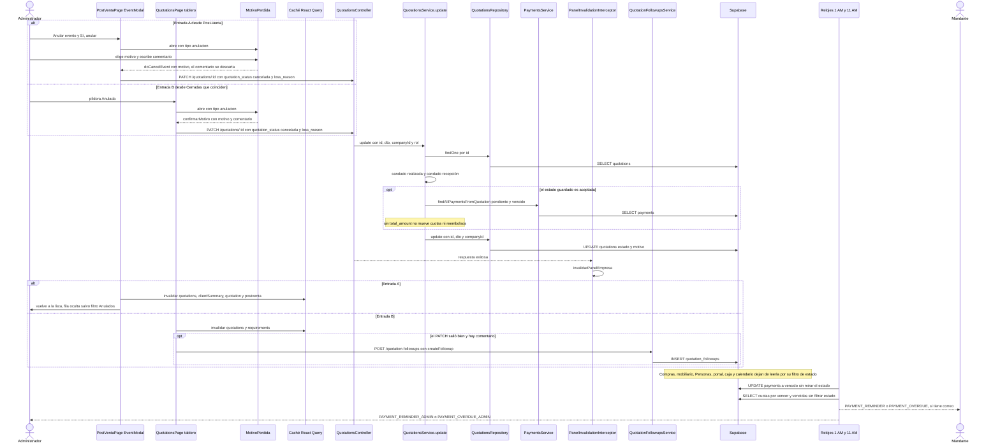

# Flujo: Cancelar (anular) un evento aceptado
> **Estado: verificado una vez contra el código** (commit 0de0ddb, 11-09-2026). Falta la etapa de completar lo que no quedó escrito.

> Verificado contra el código en el commit 0de0ddb (rama `pruebas`) el 11-09-2026, con una segunda pasada escéptica el mismo día. Parte del atlas: el índice de flujos va en `00_INDICE_DE_FLUJOS.md` (esta misma carpeta) y el mapa del sistema en `../00_MAPA_DEL_SISTEMA.md`. Al verificar, ninguno de los dos existía todavía.

## 1. En palabras simples

Cuando un evento ya ganado se cae, el administrador lo **anula** desde su ficha en Post-Venta (o, más escondido, desde la búsqueda del tablero de Cotizaciones) y elige por qué se cayó. En la base es **un solo cambio**: la cotización pasa a `cancelada` (en pantalla dice "Anulada") y guarda el motivo. No se borra nada.

El evento "se apaga" porque cada módulo deja de leerlo: sale de Compras, del radar de mobiliario, de la semana de Personas, de la caja del Dashboard, del portal del cliente y del calendario por defecto, y su fecha queda libre. **Todo lo que ya existía se queda**: cuotas, abonos, comprobantes, reembolsos, gente asignada y compras provisionadas.

Ojo con dos cosas: anular **no genera reembolso** (y no hay botón para crear uno), y los **relojes de cobranza no miran si el evento está anulado**: sus cuotas pendientes se vencen y al mandante le siguen llegando recordatorios.

## 2. El recorrido paso a paso

**Antes del flujo (precondición)**

1. **Existe un evento `aceptada` con plan de cuotas** (flujo 04). Post-Venta solo lista eventos con al menos una fila en `payments`: `fetchEvents` arma las filas agrupando cuotas. Una aceptada sin cuotas no aparece en Post-Venta y solo se puede anular por la entrada B.

**Entrada A: "Anular evento" en Post-Venta (la principal)**

2. **El administrador abre `/post-venta`.** `PostVentaPage` (`frontend/src/pages/postventa/PostVentaPage.tsx`) usa `eventsQuery`, llave `["postventa","events"]`, `staleTime` 0. `fetchEvents` pide en paralelo:
   - `getPaymentsWithTransactions` → `GET /payments/transactions` → `PaymentsController` → `PaymentsService.findAllPaymentsWithTransactions` → `PaymentsRepository.findAllPaymentsWithTransactions`, que embebe `quotations!inner(... quotation_status ...)`;
   - `getClients`;
   - `getPaidRefundsByQuotation` → `GET /refunds/paid-map`.

   Cada `EventRow` lleva `cancelled: qStatus === "cancelada"` y `done: qStatus === "realizada"`.
3. **Abre el evento** en `/post-venta/:id`. `EventModal` vive en el mismo archivo y toma el evento de las filas (`selected`). Carga la cotización con `quoteQuery`, llave `["quotation", id]`, `staleTime` 0. El botón "Anular evento" solo se pinta si:
   - `canCancel` (`userRole === "administrador"`);
   - el evento no está `done` ni `cancelled`;
   - no se está confirmando "Marcar realizado" (`confirmDone`).
4. **Clic en "Anular evento"** → `setConfirmCancel(true)`: pregunta en línea "¿Anular este evento?" con "Sí, anular" y "No". Está hecha a mano dentro de `EventModal`, no con `ConfirmInline`.
5. **"Sí, anular"** → `doCancelEvent()` sin motivo → `setPidiendoMotivo(true)` → abre `MotivoPerdida` (`frontend/src/components/MotivoPerdida.tsx`) con `tipo="anulacion"`:
   - lista `MOTIVOS_ANULACION`: `cliente_cancelo`, `cambio_fecha`, `problema_pago`, `no_pudimos`, `otro`;
   - el motivo es obligatorio; con `otro` el comentario también.
6. **"Confirmar"** → `onConfirmar={(motivo) => void doCancelEvent(motivo)}`.
   - **El comentario se descarta**, aunque el modal diga que "queda en el hilo de seguimiento".
   - `doCancelEvent(motivo)` activa `cancelling` y llama `updateQuotation({ quotation_status: QuotationStatus.CANCELADA, loss_reason: motivo }, event.quotationId)` (`frontend/src/services/quotations.service.ts`).
   - `apiRequest` (`frontend/src/services/api.ts`) manda `PATCH /quotations/:id` con el JWT y un reintento en 401; cualquier otro error lanza. Sigue en el paso 11.

**Entrada B: el tablero de Cotizaciones**

7. **El administrador busca en `/quotations`** (`frontend/src/pages/quotations/QuotationsPage.tsx`). Las aceptadas no están en el embudo (`quotationsQuery`, llave `["quotations","embudo-y-rechazadas"]`, solo solicitada, enviada, en_negociacion y rechazada). Aparecen en "Cerradas que coinciden" solo mientras hay texto en el buscador (`cerradasQuery`, llave `["quotations","cerradas-busqueda"]`, `enabled` con `busquedaActiva`, estados aceptada, cancelada y realizada), cada una con su píldora `estadoPill`.
8. **El menú de la píldora** solo se abre si el rol puede editar cotizaciones (`puedeEditar`, `SECTION_ROLES.quotations_edit`); si no, la píldora es solo una etiqueta. Las opciones salen de `statusOptionsFor(q)`. Agrega "cancelada" (etiqueta "Anulada") solo si la cotización está `aceptada` y el rol está en `ROLE_GROUPS.ADMIN_ONLY`, o si ya está anulada. Elegir el mismo estado no hace nada (`st !== quotation.quotation_status`).
9. **Elige "Anulada"** → `handleStatusChange`. No es vuelta a pre-venta; como el destino es `cancelada`, abre `MotivoPerdida tipo="anulacion"` (`setPidiendoMotivo`).
10. **"Confirmar"** → `confirmarMotivo(motivo, comentario)` → `applyStatusChange(id, "cancelada", motivo)` → `updateQuotation({ quotation_status, loss_reason })` → `PATCH /quotations/:id`.
    - Aquí el comentario sí se guarda, pero solo si el `PATCH` salió bien (`applyStatusChange` devuelve `true`). Si viene, `createFollowup({ quotation_id, note })` (`frontend/src/services/quotationFollowups.service.ts`) → `POST /quotation-followups` → `QuotationFollowupsService.create`, que primero revisa que la cotización sea de la empresa (`findOwnedQuotation`) → `INSERT` en `quotation_followups`. Un error se traga con `.catch(() => {})`.
    - La ficha del negocio (`frontend/src/pages/quotations/NegocioPage.tsx`) **no ofrece anular**: su menú solo abre en `ESTADOS_VIVOS_FICHA` y la lista de opciones no trae cancelada (comentario "Cancelada NO va", commit `55b2888`).

**En el motor (común a las dos entradas)**

11. **Puerta de entrada.** Guardias globales de `api-rest/src/app.module.ts`, en orden:
    - `AuthGuard` valida el JWT;
    - `ThrottlerGuard`;
    - `RolesGuard` (`api-rest/src/auth/roles.guard.ts`) **deja pasar a cualquier rol**, porque `QuotationsController.update` no tiene `@Roles` y sin metadatos devuelve `true`.

    El `ValidationPipe` global valida contra `UpdateQuotationDto` (`PartialType(CreateQuotationDto)`): `quotation_status` con `@IsEnum(QuotationStatus)` y `loss_reason` con `@IsString() @IsOptional()`. Es texto libre: el motor no valida la lista de motivos.
12. **Lee la cotización.** `QuotationsController.update` pasa `id`, el cuerpo, `user.company_id` y el rol a `QuotationsService.update` (`api-rest/src/quotations/quotations.service.ts`). `QuotationsRepository.findOne(id)` hace `SELECT` en `quotations` con `clients` y `companies`, filtrando solo por id.
13. **Candados.**
    - Si la guardada es `realizada` → 400 con `EVENTO_REALIZADO_CONGELADO` (`api-rest/src/quotations/constants/constants.ts`).
    - Si el rol es `recepcion` y no es requerimiento → 403.
14. **Lo que no corre.** `assertMoneyMatches` se salta, porque el parche no trae plata. La guardia de estados también, porque `cancelada` no está en `PRE_SALE_STATUSES`.
15. **El bloque de cascada lee pero no escribe.** Como la **guardada** es `aceptada`, entra y llama `PaymentsService.findAllPaymentsFromQuotation([id], companyId, [PENDIENTE, VENCIDO])`.
    - Si esa lectura trae error, lanza y la anulación falla sin escribir nada.
    - Como no viaja `total_amount`, ninguna rama mueve cuotas ni reembolsos.
16. **Sin correo.** El único correo de `update` es `QUOTATION_IS_SENT` al pasar a enviada, y `EmailStructure` (`api-rest/src/email/types/index.ts`) no tiene plantilla de anulación. Tampoco viaja `contact_name` ni se sella `sent_at`.
17. **La única escritura.** `QuotationsRepository.update(id, dto, companyId)` → `UPDATE quotations SET quotation_status = 'cancelada', loss_reason = <motivo> WHERE id = … AND company_id = …` con `.select().single()`.
18. **Se borra la memoria del panel.** Si la respuesta sale bien, el interceptor global `PanelInvalidationInterceptor` (`api-rest/src/cache/panel-invalidation.interceptor.ts`) llama `invalidarPanelEmpresa(companyId)` (`api-rest/src/cache/memoria.ts`). Eso borra de `cachePanel` todas las llaves que empiezan con `<companyId>:`: el panel de `AnalyticsService.getDashboardStats` (`<companyId>:dash:…`) y las estadísticas de `AnalyticsService.getCompleteStats` (`<companyId>:stats:…`). El interceptor no hace nada en los `GET`.

**De vuelta en la pantalla**

19. **Post-Venta.** `onDataChanged()` (es `refreshAfterSave`, llamado sin `await`) invalida `["quotations"]`, `["clientSummary"]`, `["quotation"]` y `["postventa"]`. Enseguida `onClose()` → `navigate("/post-venta")`.
    - La fila vuelve con `cancelled: true`. Sin filtro de evento, `filtered` la esconde (`kind !== "cancelado"`); se ve marcando "🚫 Anulados".
    - `totals` la salta ("los anulados no cuentan en los totales").
    - En vez de la barra de progreso muestra la píldora gris "Cancelado".
    - Si falla, `setCancelError("No se pudo anular el evento. Intenta de nuevo.")` descarta el motivo del motor, y el `finally` cierra el modal de motivo.
20. **Tablero.** Toast `Estado actualizado a cancelada.` (valor crudo, no "Anulada"), luego `fetchQuotations()` y `fetchRequirements()`, que invalidan `["quotations"]` y `["requirements"]`. Si falla, el toast trae el mensaje del motor y el modal de motivo queda abierto.
21. **Así queda la ficha de un anulado.**
    - Encabezado con píldora "CANCELADO".
    - Se esconden "Marcar realizado", "Anular evento" y la sugerencia "Este evento ya pasó".
    - **Lo demás sigue abierto**: la pestaña Pagos con `RegistrarPagoPanel` y `ReembolsosManager`; Servicios con guardado automático (`esEventoCongelado` solo congela `realizada` y `planVivo` exige `aceptada`); la fecha en `EventoCajitas`; Gestión y Cocina.

**Qué se apaga en cada módulo (nadie escribe: cada uno deja de leerlo)**

22. **Compras y mobiliario.**
    - Compras: `ComprasTab` → `getEstadoCompras` → `GET /logistics/estado-compras` → `LogisticsController.estadoCompras` → `LogisticsService.findAcceptedEvents` → `LogisticsRepository.findAcceptedEvents` (solo `aceptada`).
    - Mobiliario: el radar de `MobiliarioTab` (`["logistica","eventos-aceptados", companyId]`) → `getAcceptedEvents` (`frontend/src/services/logistics.service.ts`) → `GET /logistics/purchasing/accepted-events` → la misma función.
    - La pestaña Gestión de los demás eventos (`GestionTab`, receta `gestionQueryOpts`) saca `allEvents` de ese mismo `getAcceptedEvents`.
    - Márgenes del Dashboard: `getWonEventsSince` → `LogisticsRepository.findWonEventsSince` (aceptada y realizada).
23. **Personas.** `SemanaTab` (`["people","eventos-semana"]`) y `FichasTab` (`["people","eventos-semana", SEIS_MESES_ATRAS]`) piden `getQuotations(undefined, [ACEPTADA, REALIZADA])`. Las filas de `event_staff` del evento **se quedan**: `ResumenDelDia` las muestra como `huerfanos` en el bloque ámbar "Puestos en un evento que ya no está en la lista", con el texto "El evento se anuló o volvió a pre-venta. Si ya no van, hay que avisarles."
24. **Calendario.**
    - `Calendar.tsx` trae los 7 estados en `["quotations","calendar"]` y filtra en pantalla.
    - `getInitialStatuses` parte con aceptada y realizada; `?filter=all` también excluye rechazadas y anuladas.
    - Con "Anulada" marcada, el evento se pinta gris (`hexEstado`, `#9ca3af`). El clic (`handleNavigateToQuotation`) abre `/post-venta/:id` en pestaña nueva si el rol puede editar (`puedeEditar`); si no, va a `/negocio/:id`.
    - **La fecha queda libre:** `QuotationsService.checkConflictsWithExistingQuotations` solo cuenta solicitada, enviada, en_negociacion y aceptada.
25. **Dashboard.**
    - `AnalyticsService.getDashboardStats` cuenta la anulada en el desglose por estado y en el embudo (zona "perdida") según su fecha de creación.
    - La **saca de la caja** (`quotations_ids` filtra `!== QuotationStatus.CANCELADA`) y de ventas y eventos concretados (`concretadas` = aceptada y realizada).
    - "Por qué perdimos" (`perdidasQuery`, `["dashboard-motivos", …]`) lee rechazadas y canceladas con `updated_at || created_at` desde el inicio del período y agrupa `loss_reason` con `etiquetaMotivo`.
    - La RPC `get_quotation_status_stats` (una de las consultas de `AnalyticsService.getCompleteStats`; su definición está en `db_functions_analytics_23_07.sql`, en la raíz del repo) cuenta por `created_at`, con canceladas incluidas.
    - Fila HOY: `HoyRepository.alerts` (`api-rest/src/analytics/hoy.controller.ts`) excluye cuotas de canceladas con `.neq('quotations.quotation_status', 'cancelada')`, y los eventos próximos solo cuentan `aceptada`.
26. **Portal del mandante.** `QuotationsRepository.findAllByContact` solo trae enviada, en_negociacion, aceptada y realizada. El evento y sus cuotas desaparecen de `QuotationsService.getPortalData` y de `saldoTotal`, y `getPortalQuotation` y `submitPortalReceipt` responden 404 para ese evento.
27. **Avisos del equipo.**
    - App móvil: `MovilService.avisosDeEmpresa` (`api-rest/src/movil/movil.service.ts`, reloj `*/30 * * * *`) lee solicitada, enviada, aceptada y realizada; nunca cancelada. Los avisos de pago vencido y de evento en los próximos 3 días salen solo de aceptada y realizada, así que el anulado deja de generarlos.
    - Resumen semanal: `QuotationsCronService.sendWeeklyDigest` (lunes) solo cuenta `ACEPTADA`.

**Lo que NO se apaga (relojes y lecturas sin filtro de estado)**

28. **1 AM:** `PaymentsService.updateOverduePayments` → `PaymentsRepository.updateOverduePayments` pasa a `vencido` toda cuota `pendiente` con `due_date` cumplida, **sin mirar el estado de la cotización**.
29. **11 AM:** `PaymentsCronService.checkUpcomingOverduePayments` y `checkOverduePayments` (`api-rest/src/payments/payments-cron.service.ts`) llaman `PaymentsRepository.findAllPaymentsWithTransactions(undefined, [status], fechas)`.
    - Esa lectura trae `quotation_status` pero **no filtra por él**.
    - Manda `PAYMENT_REMINDER` o `PAYMENT_OVERDUE` al mandante, con el enlace a un portal que ya no muestra el evento, y la versión admin a los administradores.
    - Al mandante lo frenan solo dos cosas: que no tenga correo (queda un aviso en el log) o el interruptor por empresa y por plantilla de `EmailService.shouldSendEmail`, que solo se consulta para las plantillas de `EMAILS_SEND_TO_CLIENT` (`api-rest/src/email/constants/index.ts`).
    - `PAYMENT_REMINDER_ADMIN` y `PAYMENT_OVERDUE_ADMIN` no están en esa lista: a los administradores les llega igual.
30. **Ficha del cliente.** `ClientsRepository.findSummary` trae las cuotas `pendiente` y `vencido` de **todas** las cotizaciones del cliente, sin mirar su estado. `ClientDetailPage` (`frontend/src/pages/ClientDetailPage.tsx`) las suma en `saldoPendiente` y, fila por fila, pinta "debe $X" con `pendingByQuotation`, también en la fila del anulado.
31. **Bandeja de comprobantes.** `GET /portal-receipts` → `PortalReceiptsController.list` → `PortalReceiptsRepository.listPending` (las dos clases viven en `api-rest/src/quotations/portal-receipts.controller.ts`). Filtra por empresa y por comprobante `pendiente`, no por el estado de la cotización.
    - Un comprobante subido antes de anular sigue en la bandeja de Post-Venta y en la fila HOY del Dashboard: las dos leen `listPortalReceipts` con la llave `["postventa","comprobantes"]`.
    - `PortalReceiptsController.confirm` (`OPERATIONS_AND_UP`) lo registra con `PaymentsService.createPaymentTransaction`.

## 3. Diagrama

## 4. Datos que cambian

| tabla | columnas | en qué paso | quién escribe |
|---|---|---|---|
| `quotations` | `quotation_status = 'cancelada'` y `loss_reason` | 17 | `QuotationsRepository.update`, llamado por `QuotationsService.update` (las dos entradas) |
| `quotation_followups` | fila nueva con `quotation_id` y `note` (el comentario del motivo) | 10 (solo tablero) | `QuotationFollowupsService.create` vía `createFollowup` |
| memoria del motor (`cachePanel`) | entradas de la empresa (`<companyId>:dash:…` y `<companyId>:stats:…`) borradas | 18 | `PanelInvalidationInterceptor` → `invalidarPanelEmpresa` |
| `payments` | `status = 'vencido'` en cuotas pendientes con fecha cumplida, incluidas las del anulado | 28 (cada noche, después) | reloj `PaymentsService.updateOverduePayments` |
| `payment_transactions` | fila nueva si alguien registra un abono o confirma un comprobante del anulado | 21 y 31 (posible, fuera del flujo) | `PaymentsService.createPaymentTransaction` |

**Se conserva sin tocar:**
- `payments`: cuotas, montos y números;
- `payment_transactions`;
- `refunds`, pendientes y pagados;
- `portal_receipts` y `event_documents`;
- `quotation_followups` anteriores;
- `event_staff`: gente asignada, jornadas y propinas;
- `event_supply_provisions`, y en `quotations` los campos `provisioned_at`, `provisioned_cost`, `provisioned_people` y `provisioned_services`;
- los recursos y la ficha de cocina del evento;
- `survey_sent_at`.

No existe una columna con la fecha de anulación.

## 5. Efectos automáticos y colaterales

**Correos**
- **Al anular, ninguno.** No hay plantilla de anulación ni al cliente ni al equipo (`EmailStructure`).
- **Después, la cobranza sigue.** `PAYMENT_REMINDER` (3 días antes y el día del vencimiento) y `PAYMENT_OVERDUE` (7 días vencida) salen para las cuotas del anulado, al mandante y a los administradores (pasos 28 y 29). Los días vienen de `UPCOMING_OVERDUE_PAYMENTS_DAYS_NOTIFICATION` y `OVERDUE_PAYMENTS_DAYS_NOTIFICATION` en `api-rest/src/payments/constants/index.ts`.
- **La encuesta no sale:** `QuotationsService.markEventDone` exige `aceptada`, y en Post-Venta "Marcar realizado" se esconde.

**Relojes**
- 1 AM vence las cuotas del anulado y 11 AM manda la cobranza. Solo corren en producción (`ScheduleModule` en `api-rest/src/app.module.ts`, ver `CLAUDE.md`).
- Los avisos de la app móvil (cada 30 minutos) y el resumen semanal de los lunes dejan de mencionar el evento.

**Cascadas**
- **No hay ninguna.** El cambio es una columna de texto: no borra en cascada y en `docs/migrations` no hay trigger sobre `quotations`.
- La cascada de cuotas de `update` se salta porque no viaja `total_amount`.

**Avisos internos**
- Personas: bloque ámbar de `huerfanos` en `ResumenDelDia` para desconvocar a la gente.
- Seguimiento: `SeguimientoPanel.tsx` trata `cancelada` como ARCHIVO. No está en `ESTADOS_VIVOS_SEGUIMIENTO` ni en `ESTADOS_OPERATIVOS_SEGUIMIENTO`, así que sus compromisos quedan inertes.
- La lista de Post-Venta pinta la marca ámbar o roja de seguimiento con `pendienteDe` (llave `["seguimientos","map"]`), sin mirar el estado. Un anulado con compromiso vencido la muestra si se filtra "Anulados".

**Cachés de la app (frontend)**
- **Post-Venta invalida:**
  - `["quotations"]`, que arrastra el tablero, `["quotations","calendar"]`, `["quotations","cerradas-busqueda"]` y `["quotations","ficha-lista"]`;
  - `["clientSummary"]` y `["quotation"]`;
  - `["postventa"]`, que arrastra `["postventa","events"]`, `["postventa","refunds",id]`, `["postventa","comprobantes"]` (la comparte la fila HOY del Dashboard), `["postventa","docs",id]` y `["postventa","gestion", companyId, id]`.
- **El tablero invalida** solo `["quotations"]` y `["requirements"]`. `["postventa","events"]` igual se revalida al entrar, porque tiene `staleTime` 0.
- **Quedan desactualizadas** hasta su propia política (30 s por defecto en `frontend/src/lib/queryClient.ts`, más revalidar al volver a la ventana):
  - Mobiliario: `["logistica","eventos-aceptados", companyId]`, con `staleTime` de 60 s.
  - Compras: `["logistica","compras","estado", companyId]`.
  - Personas: `["people","eventos-semana"]` y `["people","eventos-semana", SEIS_MESES_ATRAS]`.
  - Dashboard: `["dashboard", …]`, `["dashboard-complete", …]`, `["dashboard-margin-events", …]`, `["dashboard-motivos", …]` y `["dashboard-hoy", …]`.
  - `["payments", id]`.
  - Desde el tablero, tampoco se invalida `["clientSummary"]`.
- **La memoria del motor sí se borra al instante** (paso 18): la próxima visita al Dashboard recalcula con la anulada fuera de la caja.

**Palabras que no calzan**
- Post-Venta dice "Cancelado" (fila) y "CANCELADO" (encabezado); su filtro sí dice "🚫 Anulados".
- El toast del tablero dice "cancelada", y `STATUS_LABELS` del motor dice "Cancelada".
- La palabra oficial es "Anulada" (`frontend/src/utils/estadoCotizacion.ts`).

## 6. Reglas de negocio que gobiernan el flujo

1. **Anular es del administrador (18-07-2026, commit `84afd8d`), pero solo en pantalla.** Evidencia: `EventModal.canCancel` y `QuotationsPage.statusOptionsFor` con `ROLE_GROUPS.ADMIN_ONLY`. El motor no lo exige: `QuotationsController.update` no tiene `@Roles` y `RolesGuard` deja pasar sin metadatos. Coincide con `mapa/04_POST_VENTA.md`, sección 8 ("Zonas de riesgo"), punto 10.
2. **Anular conserva la historia de pagos (18-07-2026, commit `91f9b96`).**
   - `constants.ts`, junto a `QuotationStatus.CANCELADA`: *"Evento aceptado que se anula: sale de Post-Venta/Compras pero conserva su historia de pagos."*
   - `EventModal`: *"Sale de Post-Venta, Compras y mobiliario; sus pagos y comprobantes quedan como historia."*
   - El commit explica que el apagado es por lectura: *"those already filter by 'aceptada'"*.
3. **Cancelada y Realizada son destinos exclusivos de lo aceptado (Felipe, 04-08-2026, commit `55b2888`).** *"lo que nunca se ganó se rechaza, no se cancela"*. Evidencia: `statusOptionsFor` y el comentario "Cancelada NO va" en el menú de `NegocioPage`. Es regla de pantalla: `QuotationsService.update` no revisa desde qué estado se anula.
4. **El motivo es obligatorio (06-08-2026, migración 61, commit `21957d5`).**
   - Por qué: el ticket promedio de las ganadas ($3.025.652) y el de las perdidas ($3.028.883) son casi iguales (`docs/migrations/61_motivo_perdida.sql`).
   - Las listas son distintas porque perder una venta y que se caiga un evento "duelen distinto" (`MotivoPerdida.tsx`).
   - El detalle libre debía viajar al hilo de seguimiento. El tablero lo cumple y Post-Venta no: `docs/arquitectura/09_PLAN_DE_HOMOLOGACION.md`, Tanda A4, dice *"el comentario se tira a la basura"*.
5. **Con plata registrada, la salida es anular (19-07-2026, commit `854bfee`).** La guardia de `update` rechaza volver a pre-venta con dinero: *"Si el evento se cayó, usa «Anular evento» en Post-Venta."*
6. **Un realizado no se anula (13-08-2026).** `constants.ts`: *"Anular un evento realizado ya no se puede: un evento que ocurrió no se anula."* En pantalla, el botón se esconde con `event.done` y la píldora del tablero se deshabilita en `realizada`.
7. **Las anuladas no son caja esperada (23-07-2026, commit `1fa7d21`).** Comentario en `AnalyticsService.getDashboardStats`: *"las CANCELADAS quedan fuera (conservan su historia de pagos, pero no son caja esperada)"*.
8. **En Post-Venta los anulados son archivo con filtro propio (21-07 y 29-07-2026, commits `2f4fbc6` y `800ef48`).** Sin filtro se ven vigentes y realizados; los anulados solo con "Anulados", y no suman en los totales.
9. **Lo anulado no es "por cobrar" en la fila HOY.** `HoyRepository.alerts` excluye sus cuotas.
10. **La palabra oficial es "Anulada" (Felipe, 12-08-2026).** La base sigue guardando `cancelada`. Evidencia: `estadoCotizacion.ts` y `estadoCotizacion.test.ts`.
11. **La gente de un evento anulado se desconvoca a mano (15-08-2026, commit `2d120d9`).** *"Gente de eventos anulados: se contaba arriba y no salia en ninguna tabla. Ahora sale en su propio bloque para desconvocarla."*
12. **Un negocio muerto no tiene seguimiento (regla de Close de Felipe).** `SeguimientoPanel.tsx`: *"ARCHIVO (rechazada, cancelada): murió el deal y mató todo seguimiento"*.
13. **Para marketing, la anulada es "no nos compró" (commit `6773cff`).** `SegmentoBuilder` define `NO_ACEPTO = ["rechazada", "cancelada"]`, y `segmento.ts` traduce el alias viejo `anulada` a `cancelada`.
14. **Desde el Calendario, los anulados abren Post-Venta (12-08-2026).** `Calendar.handleNavigateToQuotation`: *"Aceptada, realizada y anulada viven en Post-Venta"*.
15. **Una anulada libera su fecha.** `checkConflictsWithExistingQuotations` no la cuenta como choque.
16. **Los reembolsos nacen solos: no se crean a mano.** `RefundsController` tiene el `@Post()` comentado. `ReembolsosManager`: *"Se generan automáticamente si el total baja por debajo de lo ya pagado; aquí los registras"*. Y la baja solo cascadea en `aceptada` (flujo 05). Resultado: **anular no crea reembolso**.

## 7. Si cambias algo en este flujo

1. **Si cambias** las listas de estados de `LogisticsRepository.findAcceptedEvents`, `findWonEventsSince`, `SemanaTab`/`FichasTab`, `HoyRepository.alerts`, `QuotationsRepository.findAllByContact` o el filtro `!== CANCELADA` de `getDashboardStats` (por ejemplo, para "incluir todo lo post-venta"), **pasa** que el anulado vuelve a pedir compras, reservar mobiliario, aparecer en la semana del personal, sumar caja o mostrarse al cliente, **porque** anular no escribe nada en esos módulos: el apagado depende solo de que cada lectura filtre por estado.
   - Evidencia: commit `91f9b96`.
   - Incidentes de listas mal puestas: `1fa7d21` (23-07): *"done events vanished from every widget"*; `2d120d9` (15-08): la gente de anulados *"se contaba arriba y no salia en ninguna tabla"*.
2. **Si cambias** el texto técnico `cancelada` (por ejemplo, a `anulada` para calzar con la pantalla), **pasa** que se rompen a la vez el motor, los filtros y los datos viejos, **porque**:
   - el texto `'cancelada'` está escrito a mano en el motor (`analytics/hoy.controller.ts`, `marketing/segmento.ts`, `marketing/dto/marketing.dto.ts`) y en la app (`Calendar.tsx`, `ServiciosTab.tsx`, `PostVentaPage.tsx`, `QuotationsPage.tsx`, `NegocioPage.tsx`, `SegmentoBuilder.tsx`, `DashboardPage.tsx`, `services/marketing.service.ts` y `utils/estadoCotizacion.ts`);
   - el resto lo toma de los enums `QuotationStatus.CANCELADA` (`api-rest/src/quotations/constants/constants.ts` y `frontend/src/types/quotations.types.ts`), por ejemplo `analytics.service.ts` y la guardia de `QuotationsService.update`;
   - la columna es texto libre (commit `91f9b96`: *"DB column is free text, no migration"*).

   Evidencia: ya pasó al revés. El filtro de marketing usaba `anulada` y *"no calzaba con NINGUNA fila"* (`segmento.ts`, commit `6773cff`).
3. **Si cambias** el candado del realizado en `QuotationsService.update`, o lo mueves después del cambio de estado, **pasa** que se puede anular un evento que ya ocurrió y sacarlo de la caja y del margen, **porque** en el motor ese candado es lo único que lo impide. Evidencia: `EVENTO_REALIZADO_CONGELADO` y el caso *"cancelada (anular un evento que ya ocurrió)"* de `candado-evento-realizado.spec.ts`. Antes del 13-08, la píldora del tablero des-realizaba un evento *"de un clic"* (comentario de `statusOptionsFor`).
4. **Si agregas** el filtro de estado dentro de `PaymentsRepository.findAllPaymentsWithTransactions` para callar la cobranza de los anulados, **pasa** que desaparecen de Post-Venta (filtro "Anulados") y su ficha dice "No se encontró ese evento en Post-Venta", **porque** esa misma función alimenta `PaymentsCronService` y `GET /payments/transactions` (`fetchEvents`), y `EventModal` sale de esas filas (`selected`). El filtro va en el reloj, no en la lectura compartida. Evidencia: `PaymentsService.findAllPaymentsWithTransactions`, `PaymentsCronService.checkUpcomingOrOverduePayments`, `PostVentaPage`.
5. **Si cambias** `doCancelEvent` para mandar también `total_amount` (por ejemplo, "dejar el total en lo pagado"), **pasa** que corre la cascada de cuotas y reembolsos del flujo 05, **porque** `update` decide la cascada por el estado **guardado** (`aceptada`), no por el de destino. Además:
   - `assertMoneyMatches` rechaza un total que no calce con los ítems;
   - un total en $0 se salta la cascada por la condición `total_amount &&`.

   Evidencia: bloque "1. Check quotation status" de `QuotationsService.update`; `flujos/05_CAMBIAR_TOTAL_DE_EVENTO_ACEPTADO.md`.
6. **Si cambias** el `onConfirmar` de `MotivoPerdida` dentro de `EventModal`, **pasa** que decides si el comentario llega al hilo, **porque** hoy la firma `(motivo) => void doCancelEvent(motivo)` ignora el segundo argumento, aunque el modal promete que "queda en el hilo de seguimiento". El modelo a copiar es `QuotationsPage.confirmarMotivo`: `createFollowup` solo después de un cambio exitoso. Evidencia: `docs/arquitectura/09_PLAN_DE_HOMOLOGACION.md`, Tanda A4.
7. **Si quitas** `onDataChanged()` de `doCancelEvent` o cambias `refreshAfterSave`, **pasa** que al volver a la lista el anulado puede seguir como vigente y dentro de los totales, **porque** es la única invalidación de `["postventa"]` en ese momento. `App.tsx` declara `post-venta` y `post-venta/:id` como rutas hermanas; no verifiqué si React vuelve a montar `PostVentaPage` al navegar entre ellas.
8. **Si cambias** `checkConflictsWithExistingQuotations` para contar los estados post-venta, **pasa** que la fecha de un anulado vuelve a salir ocupada en el cotizador y en `EventoCajitas`, **porque** hoy la anulada libera la fecha solo por no estar en esa lista.
9. **Si cambias** `QuotationsRepository.findAllByContact` para incluir `cancelada`, **pasa** que el mandante puede volver a abrir la hoja y subir comprobantes de cuotas de un evento anulado, **porque** `getPortalQuotation` y `submitPortalReceipt` validan contra esa misma lista. Evidencia: esos dos métodos en `QuotationsService`.
10. **Si confías** en la pantalla para limitar quién anula y desde dónde, **pasa** que un `PATCH` directo de vendedor u operaciones anula igual, incluso desde `enviada`, **porque** la ruta no tiene `@Roles` y `update` no revisa el estado de origen. Evidencia: `QuotationsController.update`, `RolesGuard.canActivate`, `QuotationsService.update`. Verificado leyendo el código, no probado en vivo.
11. **Si cambias** `esEventoCongelado` para congelar también `cancelada`, **pasa** que se apagan en pantalla el guardado de Servicios y la fecha de `EventoCajitas`, pero el motor los sigue aceptando, **porque** el candado del motor solo mira `realizada`. Evidencia: `frontend/src/utils/eventoCongelado.ts`, `QuotationsService.update`.

## 8. Casos borde y estados raros

**Fallas a la mitad**
- **Hay una sola escritura.** Si falla la lectura de cuotas (paso 15) o el `UPDATE` final (paso 17), no queda nada a medias. El interceptor solo borra la memoria del panel cuando la respuesta sale bien.
- **Post-Venta esconde el motivo del error.** "No se pudo anular el evento. Intenta de nuevo." aparece también ante un 400 del candado o un 403, que no se arreglan reintentando. El modal de motivo se cierra igual (`finally`). El tablero sí muestra el mensaje del motor.
- **La nota puede perderse en el tablero.** Si el `PATCH` sale bien pero falla `createFollowup`, el evento queda anulado sin nota y nadie se entera (`.catch(() => {})`).
- **La lista puede mostrar un instante la fila vieja,** porque `onDataChanged()` corre sin `await` antes de `onClose()`.

**Repetición**
- Post-Venta: el botón desaparece con `event.cancelled`, y "Sí, anular" y "Confirmar" se deshabilitan con `cancelling` y `guardando`.
- Tablero: elegir "Anulada" sobre una anulada no hace nada (`st !== quotation.quotation_status`).
- No hay forma en pantalla de corregir el motivo. Por API, otro `PATCH` sobrescribe `loss_reason`.

**Dos personas a la vez**
- **Servicios abierto mientras se anula.** Si operaciones edita Servicios del mismo evento, su siguiente guardado llega a `update` con la guardada `cancelada`: sin cascada ni candado, el total cambia sin tocar cuotas (flujo 05, regla 1). Esa pestaña no se entera de la anulación hasta refrescar `["quotation", id]`.
- **Abonos sobre un anulado.** Se registran sin freno: `PaymentsService.createPaymentTransaction` no mira el estado de la cotización.
- **Dos administradores anulando a la vez.** Queda el último `loss_reason`; no hay versión de fila.

**Estados raros**
- **Anulado con plata pagada.**
  - No nace reembolso y no hay dónde crearlo (`RefundsController` sin `POST`).
  - La plata queda como abonos del evento: se ve en Post-Venta con "Anulados", pero **no entra a la caja del Dashboard**, porque `getDashboardStats` saca todas las cuotas de las canceladas, incluidas las pagadas.
- **Anulado con cuotas pendientes.**
  - Se vencen a la 1 AM y reciben cobranza a las 11 AM.
  - En Post-Venta la fila puede calcular `status = "vencido"` y salir al cruzar "Anulados" con "Vencidos".
  - En la ficha del cliente cuenta como deuda.
- **Aceptada sin plan.** No está en Post-Venta, así que solo se anula desde "Cerradas que coinciden". Después el Calendario (a quien puede editar) la manda a `/post-venta/:id`, que dice "No se encontró ese evento en Post-Venta" (también en `mapa/04_POST_VENTA.md`, sección 8, punto 7).
- **Evento ya pasado y sin marcar realizado.** Se puede anular: el botón solo mira `event.done`.
- **Evento provisionado.** Se anula igual; la foto de costos y `event_supply_provisions` se quedan.
- **Volver atrás.**
  - Hacia `aceptada` desde "Cerradas que coinciden": una anulada muestra el menú completo. `applyStatusChange` busca la cotización en `quotations`, que es solo el embudo (sin aceptadas, anuladas ni realizadas). Como no la encuentra, **no revisa cuotas ni abre el editor de plan**: manda directo el `PATCH` con `quotation_status: 'aceptada'`, con el toast "Estado actualizado a aceptada." y sin correo. Si tenía cuotas, vuelve con ellas, y las que el reloj venció siguen en `vencido`. Si no tenía plan, queda aceptada sin plan.
  - Hacia pre-venta desde el mismo lugar: `handleStatusChange` tampoco la encuentra en `quotations`, así que se salta la ventanita de confirmación (`pendingStatusChange`). En el motor corre la guardia de estados: con dinero, 400; sin dinero, borra el plan.
  - Por API, `PaymentsService.createPaymentPlan` borra y rehace las cuotas, la devuelve a `aceptada` (solo respeta `realizada`) y, como la guardada no es `aceptada`, manda `PAYMENT_PLAN_CREATED` al mandante (`mapa/03_PAGOS_REEMBOLSOS_Y_PORTAL.md`). No encontré un camino en pantalla para una anulada: el tablero solo abre el editor de plan cuando la encuentra en el embudo, y la ficha del negocio no abre su menú en `cancelada`.
  - Post-Venta no tiene botón para des-anular.
- **Anulada sin motivo.** Las anteriores al 06-08, o las anuladas por API sin `loss_reason`, caen en `sinMotivo` de "Por qué perdimos".
- **Comprobante del portal pendiente de antes de anular.** Sigue en la bandeja; confirmarlo registra un abono sobre el anulado.

**Datos incompletos o desfasados**
- **`loss_reason` es texto libre en el motor.** Un valor fuera de la lista se muestra crudo (`etiquetaMotivo` devuelve el valor tal cual).
- **La fecha de "Por qué perdimos".** Ese cuadro filtra por `updated_at || created_at`. El código nunca escribe `updated_at` y en `docs/migrations` no hay trigger para `quotations` (solo `DEFAULT now()` en `0_initial_models.sql`). Si la base tampoco lo actualiza, una anulación de hoy sobre una cotización creada hace un año cae fuera del período. Ver pregunta abierta 5.
- **Aislamiento por empresa.** `findOne` lee solo por id, pero la única escritura (`QuotationsRepository.update`) filtra por `company_id`. Un `PATCH` con el id de otra empresa no escribe nada y termina en error de `.single()`. La lectura de cuotas del paso 15 usa el embebido sin `!inner` (ver flujo 05), pero en este flujo no escribe.

## 9. Pruebas que protegen el flujo y huecos

**Lo que hay**
- `api-rest/src/quotations/tests/unit/candado-evento-realizado.spec.ts`: un realizado no puede pasar a `cancelada` (*"anular un evento que ya ocurrió"*), ni a aceptada, en_negociacion o rechazada, y no se borra su plan. Ojo: la prueba "el candado también rige para el administrador" es de edición (`people_count`), no de anular; las de salida de estado se llaman sin rol.
- `api-rest/src/quotations/tests/unit/quotations.service.spec.ts`, `describe('update()')`: casos genéricos del método (lectura con error, cotización nula, candado de recepción, estado distinto de aceptada y enviada, y la cascada de una aceptada). Ninguno usa `CANCELADA`: el archivo no la menciona.
- `api-rest/src/marketing/tests/segmento.spec.ts`: *"'cancelada' filtra de verdad, y el alias viejo 'anulada' significa lo mismo"*.
- `frontend/src/utils/estadoCotizacion.test.ts`: *"el estado técnico 'cancelada' se muestra como Anulada"* y `etiquetaConEmoji` da "🚫 Anulada".

**Huecos** (nada de esto tiene prueba):
- Aceptada → cancelada escribe `quotation_status` y `loss_reason`, y **no** toca `payments` ni `refunds`.
- Un rol que no es administrador no puede anular: hoy no existe esa regla en el motor.
- Los relojes `updateOverduePayments` y `PaymentsCronService` con cuotas de anulados (hoy las incluyen).
- `getDashboardStats` saca las canceladas de la caja; `HoyRepository.alerts` las excluye.
- `findAcceptedEvents`, `findWonEventsSince`, `findAllByContact` y `checkConflictsWithExistingQuotations` con una cancelada en los datos.
- `submitPortalReceipt` rechaza cuotas de un anulado.
- Frontend: `doCancelEvent`, `canCancel`, `statusOptionsFor`, el filtro y los totales de Post-Venta y los `huerfanos` de `ResumenDelDia` solo se protegen con revisión manual.

## 10. Preguntas abiertas

1. **¿Deben los relojes de cobranza callar los eventos anulados?** Hoy vencen sus cuotas y mandan recordatorios al mandante y a los administradores (pasos 28 y 29). `mapa/04_POST_VENTA.md` (pregunta 5) lo dejó sin revisar; este recorrido confirma que no filtran. Falta saber si es intención.
2. **¿Cómo se devuelve la plata de un evento anulado?** Anular no crea reembolso y el motor no expone `POST /refunds`. ¿Se hace fuera del sistema? ¿Esa plata debe seguir fuera de la caja del Dashboard?
3. **¿Un anulado debe quedar de solo lectura?** El commit `91f9b96` dice *"openable read-only with CANCELADO badge"*, pero hoy Servicios guarda solo, la fecha se edita y se pueden registrar abonos.
4. **¿El motor debe exigir administrador y estado de origen `aceptada` para anular?** Hoy es regla solo de pantalla.
5. **¿La base actualiza `quotations.updated_at` en cada `UPDATE`?** No hay trigger en `docs/migrations`. De eso dependen el período de "Por qué perdimos" y el aviso de HOY de enviadas sin respuesta (`.lt('updated_at', hace7)`). Medir en el laboratorio, no suponer.
6. **¿La liquidación de personal excluye a la gente de un evento anulado?** `PeopleService.liquidacionesPendientes` y todo `api-rest/src/people` no mencionan `quotation_status`. No verifiqué si una jornada de un anulado con ficha cerrada llega a nómina.
7. **¿El saldo pendiente de la ficha del cliente debe contar cuotas de anulados?** Hoy sí (`ClientsRepository.findSummary`).
8. **¿Se debe poder confirmar un comprobante del portal de un evento anulado?** Hoy `PortalReceiptsController.confirm` no mira el estado.
9. **¿Qué palabra usa Post-Venta?** Dice "Cancelado" y "CANCELADO", y el tablero "Estado actualizado a cancelada.", pero la oficial es "Anulada" (12-08).
10. **¿La marca de seguimiento pendiente debe apagarse en los anulados?** `pendienteDe` no mira el estado, mientras `SeguimientoPanel` dice que un negocio muerto no tiene compromisos.

**Contradicciones anotadas (sin elegir)**
- **¿Sale o no de Post-Venta?** `constants.ts` dice que la cancelada "sale de Post-Venta". `PostVentaPage` la mantiene en la lista con el filtro "Anulados". También lo anota `mapa/04_POST_VENTA.md`.
- **¿Solo lectura?** El commit `91f9b96` (18-07) dice "openable read-only". En el código las pestañas siguen editables, porque `esEventoCongelado` solo mira `realizada`.
- **¿Quién dice "Cancelada"?** `docs/arquitectura/09_PLAN_DE_HOMOLOGACION.md` (Tanda B5) dice que la ficha del cliente, el Dashboard y Analytics "siguen diciendo Cancelada". Hoy `DashboardPage` usa `etiquetaEstado("cancelada")` del diccionario (commits `811ae6f` y `013143e`, 14-08), pero `PostVentaPage` sigue con "Cancelado" escrito a mano.
- **El comentario del motivo.** `MotivoPerdida` promete que "queda en el hilo de seguimiento"; en Post-Venta se descarta (doc 09, Tanda A4).
- **¿Hay pruebas en el frontend?** `CLAUDE.md` dice "There is no frontend test suite.", pero existen `frontend/src/utils/estadoCotizacion.test.ts` y otros `.test.ts`, y `frontend/package.json` los corre con Vitest (`"test": "vitest run"`).
