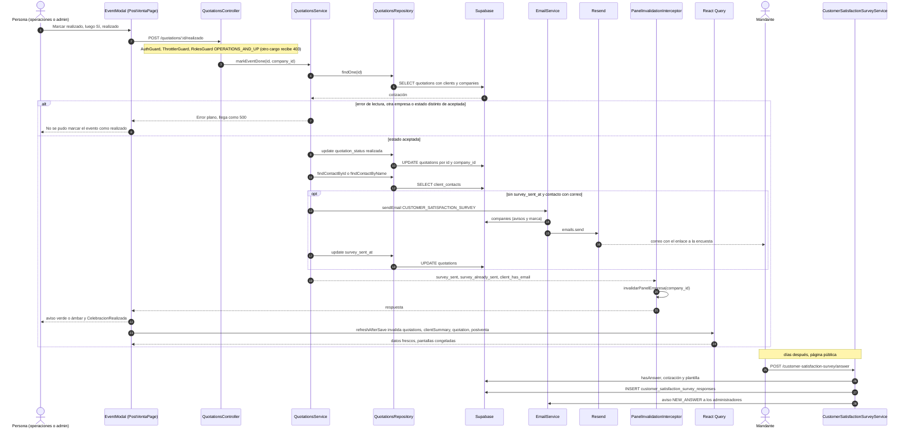

# Flujo: Marcar un evento como realizado
> **Estado: verificado una vez contra el código** (commit 0de0ddb, 11-09-2026). Falta la etapa de completar lo que no quedó escrito.

> Verificado contra el código en el commit 0de0ddb el 11-09-2026, con una segunda pasada escéptica el mismo día. Parte del atlas: el índice de flujos va en `00_INDICE_DE_FLUJOS.md` (esta misma carpeta) y el mapa del sistema en `../00_MAPA_DEL_SISTEMA.md`. Al momento de verificar, ninguno de los dos archivos existía todavía.

## 1. En palabras simples

Cuando el evento ya ocurrió, alguien de operaciones o administración abre la ficha del evento en Post-Venta y aprieta **"Marcar realizado"**. Solo se puede desde `aceptada`. Pasan tres cosas:

- El estado queda en `realizada` y el evento **se congela**: no se tocan servicios, montos, propina, personas ni fecha, y no se borra. La cobranza, los documentos y el seguimiento siguen abiertos.
- Sale **una sola vez** la encuesta de satisfacción al contacto de la cotización, si tiene correo y la empresa no apagó ese correo.
- La pantalla celebra y avisa si todavía queda plata por cobrar.

Lo que **no** hace: no cierra la cobranza (cuotas y recordatorios siguen), no manda el evento a Liquidación de personal (eso lo decide la fecha, no el estado) y no es automático. Como efecto, el evento sale de Compras y del radar de mobiliario, y sigue contando como venta en el Dashboard. Si se marcó por error, solo un administrador puede devolverlo a `aceptada`.

## 2. El recorrido paso a paso

**Antes del flujo (precondición)**

1. **El evento está `aceptada` y tiene cuotas.** Crear el plan (`POST /payments/plan` → `PaymentsController.createPaymentPlan` → `PaymentsService.createPaymentPlan`) deja la cotización en `aceptada`. Además, Post-Venta solo muestra cotizaciones **con cuotas**. `PostVentaPage.fetchEvents` (`frontend/src/pages/postventa/PostVentaPage.tsx`) pide `getPaymentsWithTransactions` (`frontend/src/services/paymentTransactions.service.ts`, `GET /payments/transactions`, `API_ROUTES.PAYMENTS_TRANSACTIONS`), `getClients` y `getPaidRefundsByQuotation`, y arma una fila por `quotation_id`. En el motor, la ruta pasa por `PaymentsController.findAllPaymentsWithTransactions` → `PaymentsService.findAllPaymentsWithTransactions` → `PaymentsRepository.findAllPaymentsWithTransactions` (tabla `payments` con `quotations!inner(... quotation_status ...)` y `payment_transactions`). **Ni la pantalla ni el motor filtran por estado.** Cada fila lleva `cancelled = (estado === "cancelada")` y `done = (estado === "realizada")`. Sin plan no hay fila, y sin fila no hay botón. Ese flujo tiene su propio mapa: `04_ACEPTAR_COTIZACION_Y_PLAN_DE_PAGOS.md`.

**En la pantalla**

2. **Una persona (operaciones o administrador) abre `/post-venta/:id`.** La ruta está envuelta en `PermissionGuard allowedRoles={SECTION_ROLES.payments}` (`frontend/src/App.tsx`), y `payments` es `ROLE_GROUPS.OPERATIONS_AND_UP` (`frontend/src/constants/permissions.ts`). `PostVentaPage` busca el evento en la lista fresca (`selected`). Si no está, muestra "No se encontró ese evento en Post-Venta.". Si está, pinta `EventModal`, que vive dentro de `PostVentaPage.tsx` y, pese al nombre, es una página. Al montar:
   - `quoteQuery` lee la cotización con la llave `["quotation", event.quotationId]` y `staleTime: 0`.
   - `facturasQuery = useQuery(docsQueryOpts(event.quotationId))` usa la llave `["postventa", "docs", quotationId]` y `staleTime: 0`. Es la misma consulta de la pestaña Documentos, y además se precarga con `prefetchQuery`. `sinFactura` es verdadero solo si la consulta **terminó bien** (`isSuccess`) y no trae ningún documento de categoría `facturas` (Felipe, 28-08). Si la consulta falla o no ha llegado, no hay aviso.
   - Si `(event_end_date || event_date)` es anterior a hoy, el evento no está realizado ni anulado y todavía no hay `doneNotice`, pinta en ámbar: "Este evento ya pasó (…): cuando corresponda, márcalo como realizado."
3. **Aprieta "Marcar realizado".** El botón se ve si `!event.cancelled && !event.done`. La pantalla no revisa el rol: basta con haber entrado a Post-Venta. Abre una pregunta en línea (`confirmDone`), armada a mano con dos botones (no usa `ConfirmInline`): "¿Marcar como realizado? Se enviará la encuesta al contacto de la cotización." Si `sinFactura`, agrega en ámbar "Ojo: este evento no tiene ninguna factura cargada en Documentos." Avisa, pero no bloquea. Mientras la pregunta está abierta, se esconde "Anular evento", que de todos modos solo ve el administrador (`canCancel`).
4. **Aprieta "Sí, realizado".** `doMarkDone` pone `markingDone = true`, lo que deshabilita "Sí, realizado" y "No", y limpia `doneError`. Luego llama a `markEventDone(event.quotationId)` (`frontend/src/services/quotations.service.ts`) → `apiRequest` `POST /quotations/:id/realizado`, sin cuerpo. La instancia de Axios agrega el JWT y, si recibe 401, refresca la sesión y reintenta una vez (`frontend/src/services/api.ts`).

**En el motor**

5. **Puertas.** Corren en orden `AuthGuard` (JWT → `request.user`), `ThrottlerGuard` y `RolesGuard`, registrados como `APP_GUARD` en ese orden en `api-rest/src/app.module.ts`. La ruta tiene `@Roles(...OPERATIONS_AND_UP)`, grupo definido en `api-rest/src/auth/roles.decorator.ts`. Otro cargo recibe 403 desde `RolesGuard` (`api-rest/src/auth/roles.guard.ts`): "Tu cargo no tiene permiso para esta función." `QuotationsController.markEventDone` (`api-rest/src/quotations/quotations.controller.ts`) llama a `QuotationsService.markEventDone(id, user.company_id)` (`api-rest/src/quotations/quotations.service.ts`).
6. **Lee y valida.** `QuotationsRepository.findOne(id)` hace `SELECT *, clients(name, email), companies(name)` en `quotations`, **solo por id** y con `.single()`.
   - Si la lectura devuelve error, lo relanza tal cual. Un id que no existe cae aquí: `.single()` entrega el "no hay filas" (`PGRST116`) como error.
   - Si `company_id` no calza → `throw new Error('Quotation not found')`.
   - Si el estado no es `aceptada` → `throw new Error('Only accepted events can be marked as done')`.
   - Ninguno de los tres es una excepción HTTP de Nest. No hay filtro global de excepciones (en `api-rest/src` no aparecen `ExceptionFilter`, `useGlobalFilters` ni `@Catch`), así que los tres llegan como **500**.
7. **Cambia el estado.** `QuotationsRepository.update(id, { quotation_status: 'realizada' }, companyId)` → `UPDATE quotations SET quotation_status = 'realizada' WHERE id = … AND company_id = …`. Va **directo al repositorio**: no pasa por `QuotationsService.update`, así que no corre el candado, ni `assertMoneyMatches`, ni la guardia de estados. El `UPDATE` no exige `quotation_status = 'aceptada'` en el `WHERE` (ver sección 8, "Dos personas a la vez").
8. **Encuesta: ¿ya se mandó?** `alreadySurveyed = Boolean(quotation.survey_sent_at)`, leído en el paso 6, antes de escribir. La columna viene de la migración `docs/migrations/26_event_done_survey.sql`.
9. **Encuesta: ¿a quién?** `QuotationsService.resolveRecipient(quotation)` corre **siempre**, aunque la encuesta ya se haya enviado, porque de ahí sale `client_has_email`:
   - Si hay contacto vinculado (`client_contact_id`), `QuotationsRepository.findContactById` lee `client_contacts` (`name, email, portal_token`). Si ese contacto **no tiene correo, devuelve `null`**, sin buscar un respaldo.
   - Sin contacto vinculado y con `contact_name` escrito, `QuotationsRepository.findContactByName(client_id, contact_name)` busca en `client_contacts` con `ilike` sobre el nombre y `.maybeSingle()`. Como no lleva comodines, es "el mismo nombre, sin distinguir mayúsculas". Si encuentra uno con correo, ese es el destinatario. Si calzan dos contactos, `maybeSingle` devuelve error, el código solo mira `data` y no hay destinatario.
   - Ninguna de las dos lecturas lanza: si fallan, el resultado es "sin destinatario".
   - En ningún caso usa `clients.email`, aunque el comentario de cabecera de `resolveRecipient` todavía enumera la regla vieja del 20-07 (ver sección 10).
10. **Encuesta: el envío** (solo si `!alreadySurveyed && recipient`). `EmailService.sendEmail(recipient.email, EmailStructure.CUSTOMER_SATISFACTION_SURVEY, { clientName, companyName, companyId, quotationId }, company_id, portalToken)` (`api-rest/src/email/email.service.ts`). Por dentro:
    - Con `EMAILS_SILENCED === '1'` (solo el servidor del laboratorio) anota "Correo SUPRIMIDO (laboratorio)" y **retorna sin error**.
    - Como `CUSTOMER_SATISFACTION_SURVEY` está en `EMAILS_SEND_TO_CLIENT` (`api-rest/src/email/constants/index.ts`), `shouldSendEmail` lee la empresa con `companiesRepository.findOne`:
      - error o empresa inexistente → no envía;
      - sin `notifications.emails` → envía (Felipe, 29-07: "todo encendido por defecto");
      - `notifications.emails.customerSatisfactionSurvey === false` → no envía. La llave es el valor del enum `EmailStructure` (`api-rest/src/email/types/index.ts`).

      En los tres casos de "no envía" **retorna sin error**.
    - Arma la marca con `getBranding`. Si hay `portalToken` y `FRONTEND_URL` tiene valor, agrega el botón "Ingresar a mi portal" hacia `FRONTEND_URL/portal/<token>`.
    - Asunto `¿Cómo estuvo tu evento, <clientName>?`. Plantilla `customerSatisfactionSurveyTemplate` (`api-rest/src/email/templates/customerSatisfactionSurvey/template.ts`, copy aprobado por Felipe el 29-07), con el botón "Responder la encuesta (2 min)" hacia `https://www.eventi-app.com/customer-satisfaction-survey/<companyId>/<quotationId>`. **Ese dominio está escrito fijo**, no sale de `FRONTEND_URL`.
    - Remitente `<nombre empresa> <hola@eventi-app.com>`, con "responder a" de la empresa si existe (`notifications.replyTo`). `resend.emails.send`: si Resend **devuelve** error, solo lo anota ("Resend devolvió error…", cura del 05-08) y **no lanza**.
11. **Encuesta: el sello.** Si `sendEmail` terminó sin lanzar, `surveySent = true` y `QuotationsRepository.update(id, { survey_sent_at: <ahora> }, companyId)`. Si algo lanza (plantilla, marca, red o el propio sello), el `catch` anota "Error sending satisfaction survey:" y **el estado sigue realizado**.
12. **Responde** `{ quotation_status: 'realizada', survey_sent, survey_already_sent, client_has_email }`.
13. **Caché del motor.** `PanelInvalidationInterceptor` (`api-rest/src/cache/panel-invalidation.interceptor.ts`, global vía `APP_INTERCEPTOR`) ve una escritura (cualquier método que no sea GET) de un usuario con `company_id`. Si terminó sin error, llama a `invalidarPanelEmpresa(companyId)`, que borra de `cachePanel` (`api-rest/src/cache/memoria.ts`) todas las entradas del panel de análisis de esa empresa. Esa memoria guarda hasta 300 entradas y cada una vive 1 hora (`HORA_MS`, en `AnalyticsService`). La próxima visita al Dashboard lo recalcula. Si el motor lanzó error en los pasos 5 o 6, no se borra nada.

**De vuelta en la pantalla**

14. **Aviso y celebración.** `doMarkDone` arma `doneNotice` = "Evento marcado como realizado. " más una de estas frases:
    - si `survey_sent` → "Se envió la encuesta de satisfacción al cliente.";
    - si `survey_already_sent` → "La encuesta ya se había enviado antes, no se reenvió.";
    - en cualquier otro caso → "No hay correo para el contacto de esta cotización, así que la encuesta no se envió. Puedes agregarle correo en Gestión de Clientes."

    Si `saldo > 0` (`event.total − netPaid`, calculado antes de refrescar), suma "Ojo: quedan $X por cobrar de este evento." El aviso es ámbar si contiene "por cobrar" y verde si no. `client_has_email` no se usa en la pantalla: solo aparece en el tipo `MarkEventDoneResult`. Luego `setConfirmDone(false)` y `setCelebrar(true)` montan `CelebracionRealizada` (`frontend/src/components/CelebracionRealizada.tsx`) con cliente, tipo, personas, `event.total` y "días de gestión" (fecha del evento − `quote.created_at`). Se cierra con clic o Escape.

    **Si la llamada falla** (403, 500 o red, sin distinguir), el `catch` muestra en rojo `doneError`: "No se pudo marcar el evento como realizado. Intenta de nuevo." La pregunta queda abierta y no hay celebración ni refresco.
15. **Refresco.** `onDataChanged()` es `refreshAfterSave`, y `doMarkDone` lo llama sin `await`. Invalida `["quotations"]`, `["clientSummary"]` y `["quotation"]`, y espera `["postventa"]`. React Query vuelve a pedir en el acto las consultas que están **montadas**; las demás quedan marcadas como viejas y se piden cuando su pantalla se monte. Consecuencias:
    - `["postventa", "events"]` (`staleTime 0`) se vuelve a pedir: `event.done = true`. El encabezado muestra la píldora "✓ REALIZADO" (botón solo para `administrador`) y desaparecen "Marcar realizado" y "Anular evento". En la lista, la fila lleva "✓ Realizado" y cae en el filtro "realizado".
    - `["quotation", id]` se vuelve a pedir: `quote.quotation_status = 'realizada'`, y cada pieza se congela:
      - `ServiciosTab`: con `esEventoCongelado` (`frontend/src/utils/eventoCongelado.ts`) muestra el cartel "Evento congelado" y `pointer-events-none`, y `save`, `autoGuardar` y `guardarManual` salen sin hacer nada;
      - `EventoCajitas` (`frontend/src/components/EventoCajitas.tsx`): `EventModal` le pasa `puedeEditarFecha={!esEventoCongelado(quote.quotation_status)}`;
      - `FichaCocinaSection`: con `esEventoCongelado` deshabilita horarios y notas. Imprimir sigue vivo ("Imprimir NO se congela");
      - `GestionTab`: **no** usa `esEventoCongelado`. Compara el literal `quote.quotation_status === "realizada"` y se lo pasa como `congelado` a `GrillaPersonal` y a `EventResourcesSection` (controles apagados y auto-importación frenada).
    - `["postventa", "gestion", companyId, quoteId]` (en el acto si la pestaña Gestión está montada; si no, al abrirla): `getAcceptedEvents` ya no trae este evento.
    - Todo lo que empieza con `["quotations"]`: tablero (`["quotations", "embudo-y-rechazadas"]`), Calendario (`["quotations", "calendar"]`) y ficha del negocio (`["quotations", "ficha-lista"]`). `["clientSummary"]` refresca la ficha 360° del cliente (`ClientDetailPage`).

**Efectos en otros módulos (nadie los llama: leen el estado nuevo)**

16. **Compras y mobiliario.** `LogisticsRepository.findAcceptedEvents` (`api-rest/src/logistics/logistics.repository.ts`) filtra `quotation_status = 'aceptada'`. El evento sale de:
    - `GET /logistics/estado-compras` (`LogisticsController.estadoCompras` → `ComprasTab`, llave `["logistica", "compras", "estado", companyId]`);
    - `GET /logistics/purchasing/accepted-events` (`getAcceptedEvents` → radar de `MobiliarioTab`, llave `["logistica", "eventos-aceptados", companyId]`, `staleTime` 60 s);
    - la competencia por mobiliario de `GestionTab` (`allEvents`): deja de retener sillas y mesas en las fechas de otros eventos.

    `refreshAfterSave` no invalida esas llaves de Logística. Mientras no venza su `staleTime` muestran lo guardado, con el evento adentro: Compras no define uno y usa los 30 s por defecto de `frontend/src/lib/queryClient.ts`; el radar usa 60 s. Pasado ese plazo, se vuelven a pedir al montar la pantalla o al volver a la ventana del navegador (`refetchOnWindowFocus: true`).
17. **Candado de logística.** Desde ahora, `LogisticsRepository.assertEventosEditables` (consulta `quotations` con `quotation_status = 'realizada'`) responde `BadRequestException(EVENTO_REALIZADO_CONGELADO)`, un 400, en estas operaciones: `clearProvisioned`, `deleteSupplyProvisions`, `addEventResources`, `updateEventResource`, `deleteEventResource`, `setServiceTime`, `addKitchenNote` y `deleteKitchenNote`. Con eso quedan cerradas `event_resources`, `event_service_times`, `event_kitchen_notes`, el borrado en `event_supply_provisions` y el borrado de las columnas `provisioned_*` de `quotations`. Quedan abiertas a propósito `markProvisioned` y `upsertSupplyProvisions` ("tomar la foto de costos") y `markDaysPrinted` (reimprimir, tabla `event_day_prints`).
18. **Liquidación de personal: no hay paso automático.**
    - `FichasTab` (`frontend/src/pages/personas/FichasTab.tsx`) lee con `eventosQueryOptions` las cotizaciones `aceptada` y `realizada` de los últimos seis meses (llave `["people", "eventos-semana", SEIS_MESES_ATRAS]`, `staleTime` 5 min).
    - `filas` filtra por **fecha** (`(termino || inicio) <= hoy`) y deja fuera los cierres administrativos. `pendientes` son las que no tienen ficha `cerrada`. El evento aparece en "Eventos por liquidar" cuando pasa su fecha, **esté o no realizado**.
    - `PeopleService.cerrarFicha` (`api-rest/src/people/people.service.ts`) no mira el estado: `api-rest/src/people` no nombra `quotation_status` ni `realizada` en ninguna parte. La nómina toma lo liquidado con `estaLiquidado` (ficha cerrada por evento, o día liquidado).
    - Lo único que el realizado cambia aquí es `GrillaPersonal` (Gestión → Personal), que queda de solo lectura, **y eso es solo de pantalla**.
19. **Cobranza: sigue igual.**
    - No se toca `payments`, `payment_transactions` ni `refunds`.
    - Los totales de Post-Venta excluyen solo lo anulado.
    - `PaymentsCronService.checkUpcomingOverduePayments` y `checkOverduePayments` (diarios 11:00) llaman a `checkUpcomingOrOverduePayments` → `PaymentsRepository.findAllPaymentsWithTransactions`, **sin filtro por estado de la cotización**: los recordatorios siguen.
    - `PaymentsService.updateOverduePayments` (diario 1 AM) → `PaymentsRepository.updateOverduePayments` marca `vencido` sin mirar la cotización.
    - Rehacer el plan (`PaymentsService.createPaymentPlan`) sigue permitido y **no** devuelve el evento a `aceptada` ("PUERTA DE ATRÁS TAPADA", 13-08). **Pero sí vuelve a mandar el correo `PAYMENT_PLAN_CREATED` al mandante**: ese envío está condicionado a `quotation_status !== ACEPTADA`, y un realizado cumple la condición.
    - En el portal del mandante (`QuotationsService.getPortalData`), un realizado con saldo sigue en "confirmados"; con saldo ≤ 0 pasa a "historial". Mientras la encuesta no se responda, muestra `encuestaPath` para invitarla.
    - Estos relojes, y los del paso 21, corren solo en producción: `ScheduleModule.forRoot({ cronJobs: process.env.NODE_ENV === 'production' })` en `api-rest/src/app.module.ts`.
20. **Dashboard.**
    - En `api-rest/src/analytics/analytics.service.ts`, "concretadas" = `aceptada` + `realizada`: ventas, eventos por mes y caja **no cambian**. Solo se mueve el conteo entre estados en `totalQuotationsByStatus` y en el gráfico de embudo, donde ambos estados están en la zona "ganada" (`DashboardPage.tsx`).
    - En `DashboardPage.tsx`, los KPI `totalSales` y `won` suman ambos estados.
    - `DashboardPage.marginData` (de `getWonEventsSince` → `LogisticsRepository.findWonEventsSince`, llave `["dashboard-margin-events", …]`): un evento **realizado sin provisionar** cuenta su salida a proveedores (`salidas`) **en el mes del evento** (Felipe, 29-08). Mientras estaba aceptado y sin provisionar, no contaba.
    - `HoyRepository.alerts` (en `api-rest/src/analytics/hoy.controller.ts`):
      - "eventos próximos 30 días" solo cuenta `aceptada`: un realizado sale;
      - las cuotas pendientes y vencidas excluyen solo `cancelada`: un realizado con deuda sigue contando.
21. **Relojes que leen el estado.**
    - `QuotationsCronService.sendWeeklyDigest` (lunes 11:00 UTC) arma "eventos de esta semana" consultando día por día, de lunes a domingo, solo cotizaciones `ACEPTADA`. Es una foto del lunes: un evento de esa semana que ya estaba marcado realizado cuando corre el reloj (por ejemplo, marcado por adelantado) no sale en el resumen. Marcarlo después no cambia un correo ya enviado.
    - `cicloAvisos` / `avisosDeEmpresa` en `api-rest/src/movil/movil.service.ts` (cada 30 min) tratan `aceptada` y `realizada` igual para "Pago vencido" y para "Evento próximo" (próximos 3 días).
    - El seguimiento comercial (`sendQuotationFollowUps` → `QuotationsRepository.findFollowUps`) solo toca `enviada`: no le afecta.
22. **Marketing.** En `api-rest/src/marketing/segmento.ts`, el filtro `aniversario` exige `quotation_status === 'realizada'` con fecha de evento hace 11 a 13 meses. **Un evento que nadie marcó nunca entra a la audiencia de aniversario.** `monto_min` cuenta `aceptada` + `realizada`. El botón "Nos compró" vive en la pantalla (`frontend/src/pages/marketing/SegmentoBuilder.tsx`, `ACEPTO = ["aceptada", "realizada"]`) y llega al motor como `con_estados`.
23. **El cliente responde (días después, página pública).** `/customer-satisfaction-survey/:companyId/:quotationId` → `CustomerSatisfactionSurveyPublicPage` (`frontend/src/pages/customerSatisfactionSurveys/PublicSurvey.tsx`).
    - Al abrir pide en paralelo la plantilla (`getTemplate` → `GET /customer-satisfaction-survey/template`, `@Public`), la cotización (`getQuotationById` → `GET /quotations/:id`, `@Public`), la empresa (`getCompanyById`) y si ya fue respondida (`isSurveyAnswered` → `GET /customer-satisfaction-survey/answered`, `@Public`). Si ya fue respondida, muestra el agradecimiento en vez del formulario.
    - Al enviar, `createAnswer` → `POST /customer-satisfaction-survey/answer` (`@Public`, `@Throttle` de 10 por minuto) → `CustomerSatisfactionSurveyController.createAnswer` → `CustomerSatisfactionSurveyService.createAnswer` (`api-rest/src/customer_satisfaction_survey/service.ts`):
      1. `hasAnswer`: si ya hay respuesta, 400 "Esta encuesta ya fue respondida. ¡Gracias por tu opinión!" (una respuesta por cotización, 30-07);
      2. `QuotationsService.findOne`;
      3. `CustomerSatisfactionSurveyRepository.getTemplate(companyId)` (`customer_satisfaction_survey_templates`);
      4. `CustomerSatisfactionSurveyRepository.createAnswer` → `INSERT` en `customer_satisfaction_survey_responses` (`quotation_id`, `template_id`, `answers`);
      5. correo `NEW_ANSWER_CUSTOMER_SATISFACTION_SURVEY` a todos los administradores (`UsersService.findAll(companyId, ADMINISTRADOR)`). Si ese correo falla, se traga.

      **No revisa que la cotización esté realizada.**

**La vuelta: deshacer una marca equivocada**

24. **Un administrador pincha la píldora "✓ REALIZADO"** (para los demás es una etiqueta inerte). Aparece "¿Volver a pendiente? Sí / No" → `doUnmarkDone` → `unmarkEventDone` → `POST /quotations/:id/volver-a-pendiente` con `@Roles(...ADMIN_ONLY)` → `QuotationsService.unmarkEventDone`: `findOne`, revisa `company_id`, exige `realizada` (si no, `Error('Only done events can be unmarked')`, que llega como 500) y hace `QuotationsRepository.update(id, { quotation_status: 'aceptada' }, companyId)`. **No borra `survey_sent_at`**: si se vuelve a marcar, la encuesta no se reenvía. Toast: "El evento volvió a pendiente…". Después, `onDataChanged()`. Si falla, toast "No se pudo volver a pendiente. Intenta de nuevo."

## 3. Diagrama

## 4. Datos que cambian

| tabla | columnas | en qué paso | quién escribe |
|---|---|---|---|
| `quotations` | `quotation_status`: `aceptada` → `realizada` | 7 | `QuotationsService.markEventDone` → `QuotationsRepository.update` |
| `quotations` | `survey_sent_at` = ahora (solo la primera vez, y solo si `sendEmail` no lanzó) | 11 | `QuotationsService.markEventDone` → `QuotationsRepository.update` |
| memoria del motor (`cachePanel`) | panel de análisis de la empresa, borrado | 13 | `PanelInvalidationInterceptor` → `invalidarPanelEmpresa` |
| caché del navegador (React Query) | `["quotations"]`, `["clientSummary"]`, `["quotation"]`, `["postventa"]` invalidadas | 15 | `PostVentaPage.refreshAfterSave` |
| `customer_satisfaction_survey_responses` | fila nueva: `quotation_id`, `template_id`, `answers` | 23 | `CustomerSatisfactionSurveyService.createAnswer` → `CustomerSatisfactionSurveyRepository.createAnswer` |
| `quotations` | `quotation_status`: `realizada` → `aceptada` (`survey_sent_at` intacto) | 24 | `QuotationsService.unmarkEventDone` → `QuotationsRepository.update` |
| `payments`, `payment_transactions`, `refunds`, `event_staff`, `staff_sheets` (fichas de personal), `event_resources`, `event_service_times`, `event_kitchen_notes`, `event_supply_provisions` | **ninguna** | — | marcar realizado no las toca. Desde ese momento, las de logística quedan bloqueadas en el motor (paso 17); `event_staff` y `staff_sheets` no |

## 5. Efectos automáticos y colaterales

**Correos**
- **Encuesta al mandante** (`CUSTOMER_SATISFACTION_SURVEY`), una sola vez por cotización, mientras `survey_sent_at` siga vacío. El asunto real es dinámico ("¿Cómo estuvo tu evento, …?"). El de `EMAIL_SUBJECTS` ("Encuesta de satisfacción evento") no se usa en este caso.
- **Aviso interno** `NEW_ANSWER_CUSTOMER_SATISFACTION_SURVEY` a todos los administradores cuando el cliente responde (paso 23).
- **No** hay correo al des-marcar ("Sin correos: la encuesta ya enviada no se puede des-enviar", comentario de `QuotationsService.unmarkEventDone`).
- **Sello sin envío real.** `survey_sent_at` queda puesto aunque el correo **no haya salido**, en cuatro casos: laboratorio silenciado (`EMAILS_SILENCED`), empresa con `customerSatisfactionSurvey` apagado, error al leer la empresa (o empresa inexistente) en `shouldSendEmail`, o error devuelto por Resend. En los cuatro, `sendEmail` retorna sin lanzar, la pantalla dice "Se envió la encuesta" y nunca se reintenta.
- **Correo de plan repetido.** Si después alguien rehace el plan de pagos de un realizado, el mandante recibe de nuevo `PAYMENT_PLAN_CREATED` (paso 19).

**Relojes** (solo en producción, `cronJobs` en `app.module.ts`)
- Ninguno dispara la encuesta: el cron que la mandaba "a ciegas 3 días después" se eliminó (`26_event_done_survey.sql`).
- Siguen corriendo sobre el evento realizado: recordatorios y avisos de cuotas (`PaymentsCronService`, 11:00), paso a `vencido` (`PaymentsService.updateOverduePayments`, 1 AM) y avisos al teléfono (`movil.service.ts`, cada 30 min).
- No lo ven: el resumen semanal si ya estaba marcado cuando corre el lunes (`QuotationsCronService.sendWeeklyDigest`, solo `aceptada`) y "eventos próximos 30 días" de HOY (`HoyRepository.alerts` en `hoy.controller.ts`).

**Cascadas**
- **No hay cascada de plata.** La cascada de cuotas y reembolsos vive en `QuotationsService.update`, que no participa (`markEventDone` escribe directo en el repositorio).
- El congelamiento corta de raíz la cascada futura: cualquier `PATCH /quotations/:id` sobre un realizado responde 400 con `EVENTO_REALIZADO_CONGELADO` antes de tocar nada. El `catch` de `QuotationsService.update` relanza el error tal cual, así que el 400 llega intacto.

**Cachés que se invalidan**
- **En el motor:** `cachePanel` de la empresa (paso 13).
- **En el navegador:** `["quotations"]` (tablero, calendario, ficha del negocio), `["clientSummary"]`, `["quotation"]` (congela Servicios, Cocina, Gestión y la fecha) y `["postventa"]` (lista, gestión, documentos, comprobantes).

**Cachés que quedan desactualizadas un rato** (`refreshAfterSave` no las nombra)
- `["logistica", "compras", "estado", companyId]` (Compras, 30 s por defecto) y `["logistica", "eventos-aceptados", companyId]` (radar de mobiliario, 60 s): el evento puede seguir apareciendo hasta que venza ese plazo y la pantalla se monte de nuevo o la ventana recupere el foco.
- `["people", "eventos-semana", …]` (Liquidación y Planificación, 5 min en `FichasTab`) y `["people", "sheets"]`: no cambian de contenido, porque el realizado no altera esas listas.
- `["dashboard-margin-events", …]`, `["dashboard-tendencia", …]` y demás consultas del Dashboard: se piden de nuevo al volver a entrar, si pasaron sus 30 s por defecto. El motor ya borró su memoria.
- **Otra pestaña u otra persona** con Servicios o el cotizador abiertos sobre el mismo evento conserva `quote` como `aceptada`. Su siguiente guardado (o el auto-guardado de Servicios) recibe 400 con el mensaje del candado.

## 6. Reglas de negocio que gobiernan el flujo

- **El realizado es historia y se congela entero** (13-08-2026, regla de Felipe). *"El realizado es un estado de que YA SE HIZO. Puede faltar cobrar, facturar, etc., pero ya se hizo."*
  - Se congelan ítems, montos, propina, personas y fecha, y no se borra.
  - Lo posterior sigue vivo: pagos, reembolsos, seguimiento, documentos, encuesta y cosecha del mes.
  - Evidencia: comentario sobre `EVENTO_REALIZADO_CONGELADO` en `api-rest/src/quotations/constants/constants.ts`; `QuotationsService.update` y `QuotationsService.remove`.
  - En el cotizador: *"no hay nada en el cotizador que se debiera modificar"* (comentario en `QuotationForm.tsx`, `isRestrictedEditing`).
- **La regla vive en el servidor; la pantalla solo la refleja.** `frontend/src/utils/eventoCongelado.ts`: "Acá NO se repite la regla ni se decide nada; solo se refleja". Mensaje a la persona: `AVISO_EVENTO_CONGELADO`.
- **Solo lo aceptado se realiza** (`markEventDone` exige `aceptada`). Felipe, 04-08: Cancelada y Realizada son "destinos EXCLUSIVOS de lo aceptado"; "Realizada no se elige desde aquí" (comentario de `QuotationsPage.statusOptionsFor`).
- **Una sola salida: volver a `aceptada`, solo el administrador, solo para corregir un error.** "Un evento que ocurrió no se anula" (`constants.ts`).
  - Tablero: `statusOptionsFor` devuelve solo `["realizada"]` y la píldora queda `disabled` (13-08).
  - Ficha del negocio: `ESTADOS_VIVOS_FICHA` no incluye `realizada` (`NegocioPage.tsx`).
  - Post-Venta: "Anular evento" no se muestra si `event.done`.
  - Motor: `unmarkEventDone` con `@Roles(...ADMIN_ONLY)`.
- **La encuesta sale al marcar, y una sola vez.**
  - `survey_sent_at` existe "para que NUNCA se envíe dos veces aunque el evento cambie de estado y se vuelva a marcar realizado" (`26_event_done_survey.sql`).
  - Re-marcar no la reenvía (comentario de `QuotationsController.unmarkEventDone`).
  - Una respuesta por cotización (30-07, "pedido de Felipe", `CustomerSatisfactionSurveyService.createAnswer`).
- **La encuesta va a la persona, no a la ficha del cliente.** `QuotationsService.resolveRecipient` solo usa `client_contacts`. Es la misma línea de "Correos a personas y punto (30-07)" (`payments-cron.service.ts`).
- **Los correos al cliente se apagan por empresa.** Sin configuración, todo encendido (Felipe, 29-07, `EmailService.shouldSendEmail`).
- **Aviso de factura** (Felipe, 28-08): "marcar realizado sin su factura cargada es plata sin respaldo". Avisa, pero no bloquea (`EventModal`, `sinFactura`).
- **Marcar realizado es un acto humano.** Si la fecha pasó, la ficha solo sugiere marcarlo (`EventModal`). El motor no revisa la fecha.
- **Logística congelada, salvo archivo y foto de costos** (13-08). Se cierran recursos, horarios y notas de cocina, porque las notas "son todas PREVIAS al evento". Quedan abiertas "reimprimir la ficha (es un acto de archivo, no una edición) y TOMAR la foto de costos (provisionar), que es justamente lo que congela el margen" (comentario de `LogisticsRepository.assertEventosEditables`).
- **Gestión → Personal tiene dos candados** (Felipe, 18-08): *"Se debería bloquear solo cuando se marca como realizado o bien se liquidan los pagos, esas son las reglas."* Evidencia: `GrillaPersonal.soloLectura` y `docs/arquitectura/10_MODULO_DE_PERSONAS.md`.
- **Se liquida lo que ya pasó, no lo realizado** (Felipe, 15-08): *"no pago un evento de diciembre en agosto"* (`FichasTab.filas`, filtro por fecha).
- **Salidas a proveedores en el Dashboard** (Felipe, 29-08): un realizado sin provisionar sale "el día del evento (nunca el día que lo marcaste realizado: eso pudo ser semanas después y ensuciaría el mes equivocado)" (`DashboardPage.marginData`).
- **Post-Venta cruza dos filtros** (evento y plata). Así, "un realizado con cuotas vencidas SÍ aparece al filtrar 'Vencidos'" (`PostVentaPage`, `filtered`).
- **El Calendario no olvida lo hecho.** Por defecto muestra Aceptada + Realizada (Felipe, 29-07, `Calendar.getInitialStatuses`).
- **La celebración ocurre solo al marcar,** no cada vez que se abre el evento (`EventModal.celebrar`; `CelebracionRealizada`, "modo fiesta" del 05-08).

## 7. Si cambias algo en este flujo

1. **Si cambias** el orden del inicio de `QuotationsService.update` (o sacas el candado), **pasa** que un vendedor vuelve a des-realizar o anular un evento desde el tablero con un clic y sin confirmación, y Servicios o el cotizador vuelven a mover plata de un evento ya hecho. **Porque** esa es "LA puerta ancha": por ahí guardan Servicios, el cotizador, la fecha de la cabecera y el desplegable del tablero, y el candado va antes que el filtro de rol. Evidencia: comentario del candado en `QuotationsService.update`; commit `eb073f7` (13-08: "era un clic sin confirmación, y bastaba rol vendedor"); bloque "las salidas de estado se cierran" de `candado-evento-realizado.spec.ts`.
2. **Si cambias** `PaymentsService.createPaymentPlan` para que vuelva a escribir `aceptada` sin condición, **pasa** que rehacer el plan de cobranza de un realizado lo des-realiza en silencio. **Porque** así era hasta el 13-08 ("PUERTA DE ATRÁS TAPADA"). Evidencia: el `if (quotation?.quotation_status !== QuotationStatus.REALIZADA)` al final de `createPaymentPlan`. No hay prueba que lo proteja (sección 9).
3. **Si mueves** `unmarkEventDone` o `setHarvestStatus` a `QuotationsService.update`, **pasa** que ya no se puede deshacer una marca equivocada ni anotar la cosecha del mes sobre un realizado. **Porque** el candado bloquea toda escritura por `update()` sobre un realizado. Por eso `markEventDone`, `unmarkEventDone` y `setHarvestStatus` escriben directo en `QuotationsRepository.update`. Evidencia: bloque "lo posterior al evento sigue vivo" de `candado-evento-realizado.spec.ts`.
4. **Si agregas** una escritura que ocurra solo por abrir una pantalla del evento, **pasa** que en los realizados queda un cartel rojo permanente. **Porque** el motor la rechaza. Ya ocurrió con la auto-importación de recursos, que se frenó con `congelado` el 13-08. Evidencia: comentario "este efecto es el ÚNICO punto del sistema que escribe por el solo hecho de ABRIR una pantalla" en `EventResourcesSection.tsx`.
5. **Si quitas** el freno `if (congelado)` de `ServiciosTab.save` / `autoGuardar`, **pasa** que el auto-guardado falla solo en bucle y el cartel manda a reintentar para siempre. **Porque** así estaba antes del 13-08. Evidencia: commit `eb073f7` ("Antes fallaba sola y el cartel mandaba a reintentar para siempre").
6. **Si quitas** la tolerancia a `PGRST116` en `QuotationsService.remove`, **pasa** que borrar un id inexistente devuelve 500. **Porque** `findOne` usa `.single()` y "no hay filas" llega como error. Evidencia: commit `eb073f7` ("cura del 500"); prueba "borrar algo que ya no existe NO revienta (lo pilló la cuadrilla)".
7. **Si confías** en `survey_sent_at` como prueba de que el cliente recibió la encuesta, **pasa** que hay eventos sellados sin correo real. **Porque** `EmailService.sendEmail` retorna sin error cuando está silenciado, cuando la empresa lo apagó o no se pudo leer, o cuando Resend devuelve error (que desde el 05-08 solo se anota). Evidencia: `EmailService.sendEmail` (`EMAILS_SILENCED`, `shouldSendEmail`, `resendError`) y `QuotationsService.markEventDone`. Y al revés: si haces que `sendEmail` lance ante un error de Resend, el `catch` de `markEventDone` deja el sello vacío y la pantalla dirá "No hay correo para el contacto", que es falso.
8. **Si cambias** `resolveRecipient` para usar `clients.email` como respaldo, **pasa** que la encuesta le llega a la casilla de la ficha y no a la persona que encargó el evento. **Porque** la línea de la casa es "correos a personas". Ojo: dos comentarios dicen lo contrario y el código no lo hace. Uno es el del objeto que devuelve `markEventDone` ("o cliente con correo cuando no hay contacto asociado"). El otro es la cabecera de `resolveRecipient`, que todavía lista la regla del 20-07 ("cotización sin contacto -> correo del cliente") antes del párrafo del 30-07 que la reemplaza (sección 10).
9. **Si cambias** el filtro `'aceptada'` de `LogisticsRepository.findAcceptedEvents`, **pasa** que los realizados vuelven a Compras, al radar de mobiliario y a la competencia de stock en Gestión, y que Compras intenta desaprovisionarlos y choca con el candado. **Porque** el mismo método alimenta `estado-compras`, `purchasing/accepted-events` y `GestionTab.allEvents`, mientras `clearProvisioned` y `deleteSupplyProvisions` rechazan realizados. Evidencia: `LogisticsController.estadoCompras`, `MobiliarioTab`, `gestionQueryOpts`.
10. **Si renombras** el estado `realizada` o agregas uno parecido, **pasa** que se rompen en silencio el candado del motor y de logística, el congelamiento de pantallas, el aniversario de marketing, los avisos del teléfono, el Dashboard y sus tendencias, Post-Venta y el Calendario. **Porque** la base guarda el estado como "texto libre, sin cambio de esquema" (`26_event_done_survey.sql`) y el valor está repartido:
    - literales `'realizada'` en el motor: `logistics/logistics.repository.ts`, `marketing/segmento.ts`, `marketing/dto/marketing.dto.ts`, `movil/movil.service.ts` y `quotations/quotations.repository.ts`;
    - literales en la pantalla: `utils/eventoCongelado.ts`, `utils/estadoCotizacion.ts`, `PostVentaPage.tsx`, `GestionTab.tsx`, `ServiciosTab.tsx`, `QuotationsPage.tsx`, `SeguimientoPanel.tsx`, `DashboardPage.tsx`, `dashboard/tendencias.ts` (`ES_EVENTO`), `Calendar.tsx`, `ClientsPage.tsx`, `ClientDetailPage.tsx`, `SegmentoBuilder.tsx`, `services/marketing.service.ts` y `types/quotations.types.ts`;
    - vía el enum `QuotationStatus.REALIZADA`: `quotations.service.ts`, `payments.service.ts`, `analytics.service.ts`, `SemanaTab.tsx` y `FichasTab.tsx`.

    HOY no está en la lista: `HoyRepository.alerts` solo nombra `aceptada` y `cancelada`. Evidencia: búsqueda de `realizada` en ambas apps.
11. **Si vuelves** a apagar Gestión → Personal por "el gris" (todas las sillas confirmadas), **pasa** que Felipe no puede agregar a alguien que no había considerado. **Porque** eso pasó el 18-08 y dejó la regla de "solo dos candados". Evidencia: `GrillaPersonal` (comentario "LOS DOS CANDADOS"), commit `5edf20f`.
12. **Si haces** que Liquidación dependa del estado realizado, **pasa** que los eventos que nadie marcó nunca llegan a nómina. **Porque** la marca no es automática y hoy la lista se arma por fecha. Evidencia: `FichasTab.filas`; la sugerencia "márcalo como realizado" en `EventModal`.
13. **Si cambias** la regla de salidas del Dashboard para usar la fecha de la marca, **pasa** que el costo cae en el mes equivocado. **Porque** marcar puede ocurrir semanas después del evento (Felipe, 29-08). Evidencia: `DashboardPage.marginData`.
14. **Si cambias** las llaves de `refreshAfterSave`, **pasa** que tras marcar no se enciende el congelamiento en Servicios, Cocina y Gestión hasta recargar. **Porque** esas piezas leen `quote.quotation_status` de `["quotation", id]`. Evidencia: `PostVentaPage.refreshAfterSave`, `EventModal.quoteQuery`.
15. **Si cambias** el enlace de `customerSatisfactionSurveyTemplate`, **pasa** que el botón del correo apunta a otro sitio. **Porque** el dominio está escrito fijo (`https://www.eventi-app.com/…`), a diferencia del botón del portal, que usa `FRONTEND_URL`. Evidencia: `template.ts` y `EmailService.sendEmail`.

## 8. Casos borde y estados raros

- **El correo falla a medio camino.** El estado ya quedó `realizada` (paso 7) y el `catch` no lo revierte.
  - Si lanzó, `survey_sent_at` queda vacío y la pantalla muestra el mensaje de "No hay correo para el contacto", aunque el contacto sí tenía correo: la rama `else` cubre ambos casos.
  - Reintentar exige que un administrador lo devuelva a `aceptada` y alguien lo vuelva a marcar. No existe botón de "reenviar encuesta". Fuera de `EmailService.sendPreviewBatch`, que manda muestras [PRUEBA] a una casilla de prueba, `markEventDone` es el único que envía `CUSTOMER_SATISFACTION_SURVEY`.
- **El correo sale pero el sello falla.** `surveySent = true` se asigna antes de `update(survey_sent_at)`. Si ese `update` lanza, la respuesta dice "Se envió", pero sin sello, y una re-marca la reenvía.
- **Doble clic.** Los botones se deshabilitan con `markingDone`. **Dos personas a la vez** (o dos pestañas):
  - si las dos leen `aceptada` antes de que la otra escriba, las dos escriben `realizada` (el `UPDATE` no exige el estado anterior), las dos ven `survey_sent_at` vacío y **salen dos encuestas**;
  - si la segunda lee después, recibe `Error('Only accepted events…')` → 500 y ve "No se pudo marcar…", aunque el evento sí quedó realizado.

  Verificado leyendo el código, no probado en vivo.
- **Contacto vinculado sin correo.** No se envía y no hay respaldo al correo del cliente. La pantalla sugiere agregar el correo en Gestión de Clientes, pero agregarlo después no dispara nada (ver el primer caso).
- **Marcar un evento futuro.** El motor no revisa la fecha. El evento se congela, sale de Compras, de "eventos próximos" en HOY y del resumen semanal (si se marcó antes del lunes), sigue en "Evento próximo" del teléfono, y **la encuesta llega antes del evento**.
- **Evento sin plan de pagos.** No aparece en Post-Venta, así que no hay botón. El motor sí lo aceptaría por API, porque solo exige `aceptada`.
- **Evento anulado.** No hay botón (`event.cancelled`). Por API, el motor responde 500 (`Error` plano).
- **Cotización con cuotas en otro estado.** Ni `fetchEvents` ni el motor filtran Post-Venta por estado, y el botón solo mira anulado y realizado. Si una cotización con cuotas no estuviera `aceptada`, el botón se vería y el motor respondería 500. No se midió si hoy existe algún caso así.
- **Cotización de otra empresa.** `findOne` busca solo por id, pero `markEventDone` y `unmarkEventDone` comparan `company_id` antes de escribir, y `QuotationsRepository.update` vuelve a filtrar por `company_id`.
- **Después de realizado: `has_contract`, `requires_invoice` y observaciones.** Ninguna pantalla edita `has_contract` ni `requires_invoice`. `QuotationForm` los carga al abrir, pero `editableFields` (lo que viaja en `updateQuotation`, `PATCH /quotations/:id`) no los incluye; solo `QuotationsService.create` los fija. Las observaciones sí viajan en `editableFields`, así que en un realizado quedan congeladas por el candado. Ver pregunta abierta 10.
- **Planificación sobre un realizado.** `SemanaTab` lista `aceptada` y `realizada`, no usa `esEventoCongelado`, y `api-rest/src/people` no revisa el estado. Sentar gente en un evento realizado no parece bloqueado. Solo `GrillaPersonal` (Gestión) se congela. Verificado leyendo, no probado.
- **Foto de costos tardía.** `markProvisioned` y `upsertSupplyProvisions` no pasan por el candado. Una pantalla de Compras con datos viejos podría provisionar un evento recién realizado. Borrar esa foto sí queda bloqueado (`clearProvisioned`).
- **La encuesta se responde sin estar realizado.** `CustomerSatisfactionSurveyService.createAnswer` no mira el estado. Basta conocer `companyId` y el id (UUID) de la cotización.
- **Des-marcar con encuesta respondida.** La respuesta queda. Como el portal solo invita en realizados, el evento `aceptada` no muestra la invitación.
- **Laboratorio.** Con `EMAILS_SILENCED=1` no sale correo, pero `survey_sent_at` se sella y la pantalla dice "Se envió" (sección 5). Además, el enlace del correo apunta al dominio de producción.

## 9. Pruebas que protegen el flujo y huecos

**Pruebas que existen**

| Archivo | Qué protege |
|---|---|
| `api-rest/src/quotations/tests/unit/candado-evento-realizado.spec.ts` | `update` rechaza propina, montos, fecha y personas de un realizado, también al administrador; una aceptada se edita normal. Un realizado no pasa a `aceptada`, `cancelada`, `en_negociacion` ni `rechazada`, y no se borra su plan. `remove` no borra realizados, tolera `PGRST116` y no borra si la lectura falla. Con un realizado de otra empresa, el candado no dispara y deja que el repositorio (que filtra por `company_id`) responda. `unmarkEventDone` deja `aceptada` y `setHarvestStatus` sigue escribiendo |
| `api-rest/src/logistics/tests/candado-logistica.spec.ts` | En realizados, rechaza recursos nuevos, cambiarlos y borrarlos, cambiar horario, notas de cocina nuevas y borrarlas, borrar la foto de costos y borrar provisiones de insumos; **sí** deja tomar la foto de costos. En vivos, prueba que pasan recursos nuevos, notas de cocina y borrar la foto de costos. Sin filas no consulta la base |
| `api-rest/src/marketing/tests/segmento.spec.ts` | "aniversario: evento realizado hace 11 a 13 meses" y "monto mínimo mira la mayor aceptada/realizada, no las rechazadas" |
| `frontend/src/utils/estadoCotizacion.test.ts` | "REALIZADA es UN SOLO verde, no cinco" (chip, punto y hex) |
| `frontend/src/pages/dashboard/tendencias.test.ts` | Sus datos de prueba usan cotizaciones `realizada` como eventos concretados (no nombra `ES_EVENTO` directamente) |

**Huecos**

- **`QuotationsService.markEventDone` no tiene ni una prueba.** Ningún spec lo llama: nada cubre que exija `aceptada`, que compare `company_id`, que mande la encuesta una sola vez, que selle `survey_sent_at`, que un correo fallido no revierta el estado, ni el cálculo de `survey_already_sent`.
- **`resolveRecipient`** (contacto vinculado sin correo, calce por nombre) no tiene pruebas.
- **La puerta tapada de `PaymentsService.createPaymentPlan`** (no des-realizar) no tiene prueba: ningún spec de pagos menciona `realizada`. Tampoco el reenvío de `PAYMENT_PLAN_CREATED` al rehacer el plan de un realizado.
- **El congelamiento del personal** no existe en el motor (`api-rest/src/people`) y no tiene pruebas. Solo lo sostiene `GrillaPersonal` en pantalla.
- **El caso de dos personas marcando a la vez** (doble encuesta) no está cubierto.
- **Las pantallas** (`EventModal.doMarkDone`, `refreshAfterSave`, el congelamiento en Servicios, Cocina y Gestión) no tienen pruebas.
- **`createAnswer`** no tiene prueba del candado "una respuesta por cotización": `customer_satisfaction_survey.service.spec.ts` solo trae "should be defined".
- Detalle menor: la prueba "la cosecha del mes puede marcar un evento realizado" llama `setHarvestStatus('1', 1, 'contactado', 7)`, con el `userId` y el `estado` en posiciones cruzadas respecto de la firma `(id, companyId, userId, estado)`. Igual comprueba lo que importa (que `update` se llama), pero no el valor guardado.

## 10. Preguntas abiertas

1. **¿La encuesta debe caer al correo de la ficha del cliente cuando el contacto no tiene?** Dos comentarios dicen que sí: el del retorno de `QuotationsService.markEventDone` ("o cliente con correo cuando no hay contacto asociado") y la regla del 20-07 en la cabecera de `resolveRecipient`. El párrafo del 30-07 de esa misma cabecera y el código dicen que no: `resolveRecipient` nunca usa `clients.email`, y `docs/arquitectura/mapa/04_POST_VENTA.md` describe lo que hace el código. Hay que decidir cuál manda y corregir los comentarios.
2. **¿Es correcto sellar `survey_sent_at` y decir "Se envió la encuesta" cuando el correo fue silenciado, apagado por la empresa, bloqueado por no poder leer la empresa o rechazado por Resend?**
3. **¿Hace falta un "reenviar encuesta"** (por ejemplo, tras agregarle correo al contacto)? Hoy el único camino es des-marcar (administrador) y volver a marcar, y solo funciona si `survey_sent_at` quedó vacío.
4. **¿Debe exigirse que la fecha del evento haya pasado para marcarlo realizado?** Hoy el motor no lo revisa.
5. **¿Planificación (`SemanaTab`) y el módulo de personas del motor deben respetar el congelamiento?** `docs/arquitectura/10_MODULO_DE_PERSONAS.md` solo habla de Gestión → Personal.
6. **El pedido de este mapa habla de "paso a liquidación de personas" al marcar realizado, y el código no tiene ese vínculo:** Liquidación se arma por fecha (15-08). ¿Es lo acordado, o falta algo?
7. **¿Es aceptable que `markEventDone` responda 500 ante "otra empresa", "estado no aceptado" o "id inexistente"** (`Error` plano o error de Supabase), en vez de 404 o 400 con un mensaje que la pantalla pueda mostrar?
8. **¿El enlace de la encuesta debe salir de `FRONTEND_URL`** como el botón del portal, en vez del dominio fijo?
9. **¿`createAnswer` debe exigir que la cotización esté `realizada`?**
10. **¿Dónde se corrigen `has_contract` y `requires_invoice`?** Ninguna pantalla los edita hoy, ni antes ni después del evento (no están en `editableFields` de `QuotationForm`). Las observaciones sí se editan, pero el candado las congela en un realizado, aunque la regla dice que "facturar" puede faltar. ¿Deben seguir editables después del evento?
11. **¿Se acepta el riesgo de doble encuesta si dos personas marcan a la vez**, o se agrega la condición `quotation_status = 'aceptada'` al `UPDATE`?
12. **¿El resumen semanal y los "eventos próximos" de HOY deben incluir `realizada`** para los eventos marcados por adelantado?
13. **¿Rehacer el plan de pagos de un realizado debe volver a mandarle al mandante el correo `PAYMENT_PLAN_CREATED`?** Hoy lo manda, porque la condición del envío es "estado distinto de `aceptada`".
