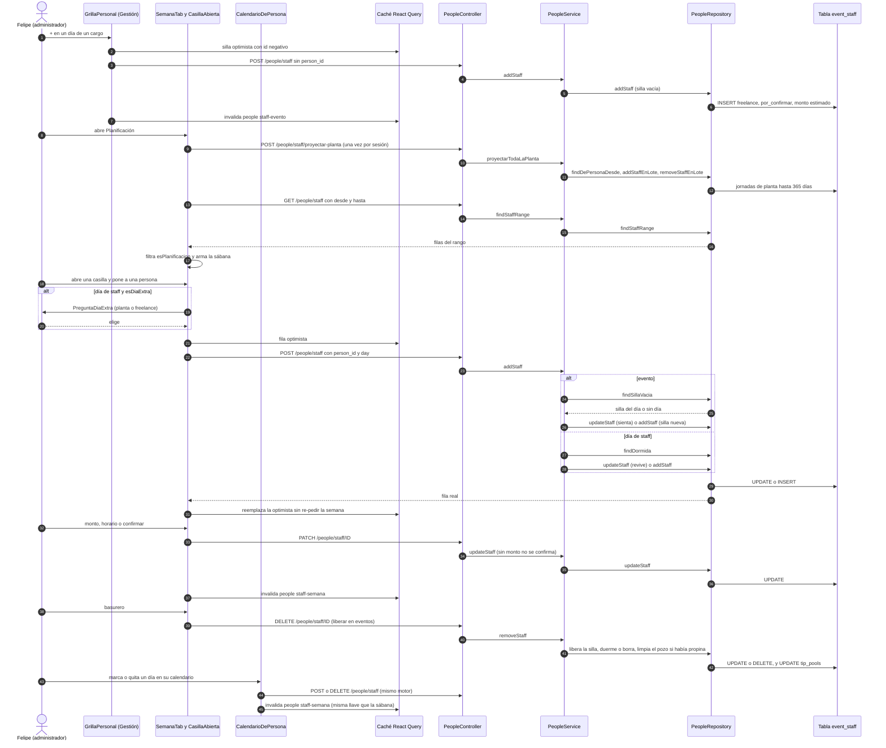

# Flujo: Planificar el personal de un evento y de un día de staff

> **Estado: verificado una vez contra el código** (commit 0de0ddb, 11-09-2026). Falta la etapa de completar lo que no quedó escrito. Parte del atlas; índice de flujos en flujos/00_INDICE_DE_FLUJOS.md y del sistema en ../00_MAPA_DEL_SISTEMA.md.

## 1. En palabras simples

Planificar el personal es decidir **quién trabaja, qué día, en qué cargo y por cuánto**. Pasa en dos mesas que escriben en la **misma tabla** (`event_staff`):

- En **Post-Venta → Gestión** se ponen las **sillas** de un evento: "necesito 3 garzones el sábado a $27.000". Son cupos sin nombre, y ya cuentan para el costo del evento.
- En **Personal → Planificación** (la "sábana" de 28 días) se les pone **nombre**. Al sentar a alguien se ocupa una silla de su cargo; si no queda ninguna, nace otra. Ahí mismo se arma el **día de staff** (restaurante, patio, recepción: todo lo que no es evento), se ajustan monto y horario, y se confirma.
- La **planta** se carga sola un año hacia adelante según los días laborales de su ficha. Si a alguien de planta se le pone en un día que no le toca, el sistema **pregunta** si va como planta o como freelance. Si se le quita un día de su patrón, la jornada queda "dormida" para que la carga automática no la reviva.
- Un freelance **no se confirma sin monto**, y la casilla no se deja cerrar mientras falte. Lo que se escribe aquí es lo que después leen la Liquidación, la nómina y el costo del evento.

## 2. El recorrido paso a paso

**Antes del flujo (precondición)**

1. **Existen los cargos y las fichas de las personas.**
   - Los cargos viven en `management_resources` con `type = 'personal'` (`PeopleRepository.findRoles`). Se administran en Personal → Staff → Cargos.
   - La ficha de cada persona se edita en `PersonaForm` (`frontend/src/pages/personas/PersonaForm.tsx`). Guarda `default_kind` (planta o freelance), `default_role_id`, `days_off` (0 = domingo; la pantalla muestra los días laborales y guarda los libres), `weekly_schedule` y `default_starts_at` / `default_ends_at` / `default_break_minutes`.
   - Guardar va por `PATCH /people/:id` → `PeopleController.update` → `PeopleService.update` → `PeopleRepository.update` (tabla `people`). En el mismo viaje llama a `proyectarSiCorresponde` → `proyectarPlanta` de esa persona (paso 7). Si la proyección falla, solo queda en el log y el guardado se mantiene. Crear (`POST /people` → `PeopleService.create`) hace lo mismo.
   - La pantalla invalida la llave `["people"]` completa (`PersonasPage.invalidar`, `PersonaFichaPage.guardar`).

**Parte A: Gestión pone las sillas (Post-Venta → Gestión)**

2. **Se abre la grilla del evento.** `GestionTab` (`frontend/src/pages/postventa/GestionTab.tsx`) monta `GrillaPersonal` solo si la cotización tiene `event_date`, y le pasa `congelado = quotation_status === "realizada"`. `GrillaPersonal` (`frontend/src/pages/postventa/GrillaPersonal.tsx`) lee tres cosas:
   - **Las sillas.** Llave `["people","staff-evento",quotationId]` → `getStaff` (`frontend/src/services/people.service.ts`) → `GET /people/staff?evento=` → `PeopleController.findStaff` → `PeopleService.findStaff` → `PeopleRepository.findStaff`. Trae `event_staff` con `people` y `management_resources`, filtrado por `company_id` y `quotation_id`. Después pasa por `esPlanificacion` (`frontend/src/pages/personas/estadoDelPago.ts`), que saca la planta traída por la Liquidación, las filas `solo_propina` y las dormidas.
   - **Las fichas.** `["people","sheets"]` → `GET /people/sheets` → `PeopleService.findSheets` → `PeopleRepository.findSheets` (`staff_sheets` más la marca `en_nomina`).
   - **El catálogo de cargos.** `recursosQueryOpts` (de `EventResourcesSection`).

   `soloLectura = congelado || fichaCerrada` (`staff_sheets.closed_at` no nulo). Son los dos candados de Gestión.
3. **Agregar un cargo o un día de preparativos o desarme no escribe nada.** El cargo queda en el estado local `cargosNuevos` y el día en `extras`, con un tope de `TOPE_DIAS_EXTRA = 4` antes del inicio y 4 después del término. Se guardan recién cuando cae la primera silla ahí.
4. **El + y el − de un día.** Los maneja la mutación `cambiar`, con parche optimista de id negativo; al terminar, `refrescar` invalida `["people","staff-evento",quotationId]`.
   - **+ con una silla sin día en el cargo:** se le pone el día → `updateStaff(id, { day })` → `PATCH /people/staff/:id` → `PeopleService.updateStaff` → `PeopleRepository.updateStaff`.
   - **+ sin silla sin día:** nace una silla → `addStaff({ quotation_id, role_id, day, amount: valorDe(fila) || null })` → `POST /people/staff` → `PeopleController.addStaff` → `PeopleService.addStaff`.
     - `sonDeLaEmpresa` comprueba evento y cargo (`esCotizacionDeLaEmpresa`, `esRecursoDeLaEmpresa`; si no calzan, 404).
     - Como no trae `person_id`, exige `quotation_id` y `role_id`. Si falta alguno, 400: "El staff no lleva sillas vacías…" o "Una silla vacía necesita su cargo".
     - `PeopleRepository.addStaff` hace `INSERT` en `event_staff` con `person_id` NULL, `kind = 'freelance'`, `status = 'por_confirmar'`, el `amount` estimado y horarios NULL.
   - **−:** solo quita una silla **vacía** del día → `removeStaff(id)` sin `liberar` → `DELETE /people/staff/:id` → `PeopleService.removeStaff` → `PeopleRepository.removeStaff` (`DELETE`). Si todas las sillas del día tienen nombre, la pantalla corta con "Los de ese día tienen nombre: sácalos en Personas → Planificación."
5. **El valor c/u y los "por ubicar".**
   - El valor se edita en `NumberInput` con `onCommit` (al salir del campo). `cambiarValor` recorre las sillas **vacías** del cargo y hace un `updateStaff(id, { amount })` por cada una, en fila. Las sillas con nombre no se tocan.
   - Con todas las sillas sentadas y confirmadas, el valor se muestra en gris como promedio real (`valorSoloLectura`).
   - La ✕ de "por ubicar" (`descartarSinDia`) borra una a una las sillas vacías sin día.

**Parte B: Planificación les pone nombre (Personal → Planificación)**

6. **Se entra a la sábana.** La ruta `/personas` usa `PermissionGuard allowedRoles={SECTION_ROLES.people}` (`frontend/src/App.tsx`), y en `frontend/src/constants/permissions.ts` `people` es `ROLE_GROUPS.ADMIN_ONLY`. `PersonasPage` abre la pestaña "armar" (o la última usada, guardada en `localStorage` como `eventia_personal_pestana`) y monta `SemanaTab` (`frontend/src/pages/personas/SemanaTab.tsx`). La ventana es fija: 28 días desde el domingo de `hoyEnChile()`, y las flechas mueven ±28. Carga en paralelo:
   - **Eventos.** `["people","eventos-semana"]` → `getQuotations(undefined, [ACEPTADA, REALIZADA], "event_date", "desc")` → `GET /quotations?statuses=…` → `QuotationsController.findAll` → `QuotationsService.findAll`. No manda `event_date_from`, así que trae toda la historia de aceptadas y realizadas.
   - **Cargos.** `["people","catalogo-recursos"]` → `getManagementResources` (`frontend/src/services/logistics.service.ts`) → `GET /logistics/resources` → `LogisticsController.findAllResources`. Si falla, devuelve `[]` sin avisar.
   - **Jornadas.** `["people","staff-semana",domingo,28]` → `getStaffSemana(domingo, hasta)` → `GET /people/staff?desde=&hasta=` → `PeopleService.findStaffRange` → `PeopleRepository.findStaffRange`: `event_staff` de todos los eventos y del staff con `day` entre las dos fechas. Después pasa por `esPlanificacion`.
   - **Personas.** `peopleQueryOptions` (`["people"]`) → `GET /people` → `PeopleRepository.findAll`.
7. **Reloj de la sesión: la planta se proyecta sola.** Un `useEffect` de `SemanaTab` revisa `sessionStorage["planta-proyectada"]`. Si no está, lo marca y llama a `proyectarPlanta()` → `POST /people/staff/proyectar-planta` → `PeopleController.proyectarPlanta` → `PeopleService.proyectarTodaLaPlanta`. Esa función toma a las personas `activa` y `planta` y corre `proyectarPlanta(companyId, personId)` para todas a la vez (`Promise.all`). Por cada persona:
   - Lee la ficha (`findOne`) y sus jornadas desde hoy (`findDePersonaDesde`, que trae `kind`, `amount`, `tip_amount`, sellos de nómina y `ajuste`).
   - Recorre desde hoy (hora de Santiago) hasta hoy + 365 y se salta todo día cuya fila tenga `ajuste`. Un día "debe venir" si la persona está activa, no es su día libre y no la mandaron a un evento ese día (`laMandaronAUnEvento`: fila de evento con `kind` distinto de planta).
   - Las jornadas que faltan se insertan en **un solo** viaje (`addStaffEnLote`), con `kind = 'planta'`, `status = 'confirmado'`, `amount` NULL, el cargo de la ficha y el horario de `horarioDelDia`.
   - Las que sobran se borran en un viaje (`removeStaffEnLote`), pero solo si la proyección puede quitarlas (`laPuedeQuitarLaProyeccion`: planta sin plata ni nómina).
   - Las diferencias de horario o cargo se corrigen de a una (`updateStaff`).

   Si `creadas > 0`, la pantalla invalida la llave de la sábana. Si la llamada falla, borra la marca de `sessionStorage` para reintentar la próxima vez.
8. **Se arma la sábana (solo pantalla, `filas` en `SemanaTab`).**
   - **Eventos:** por cada par (evento, cargo), `necesita` cuenta por día **todas** las filas del evento, con o sin nombre (las sillas). La casilla muestra solo a los sentados (`puestos`, `enCasilla`).
   - **Staff:** abajo van "Personal de planta" (cargos con alguna jornada `planta`) y "Personal Staff" (los ocasionales). El "+ cargo" solo agrega a `cargosPlanta` en memoria.
   - **Colores en eventos:** verde solo si están todos y todos confirmados; ámbar todo lo demás. Un día del evento vacío sale como recuadro ámbar con +.
   - **Colores en el staff:** ámbar si alguien está por confirmar, lila el ocasional y azul la planta.
   - Arriba aparece "Faltan N por conseguir".
9. **El resumen de un día.** Al pinchar el encabezado del día se abre `ResumenDelDia`, que muestra la cobertura por cargo (`coberturaDelDia`) y permite dos escrituras laterales:
   - **Notas del día** (`NotasDelDia`). Lee `["people","notas-dia",dia]` → `GET /people/day-notes`. Agregar → `POST /people/day-notes` → `PeopleService.createDayNote` (rechaza texto vacío) → `INSERT` en `day_notes` (`company_id`, `day`, `quotation_id` NULL, `text`). Marcar → `PATCH /people/day-notes/:id` (`done`). Borrar → `DELETE`.
   - **Hora de cada servicio del evento** (`CabeceraEvento` → `setEventServiceTime`, en `frontend/src/services/logistics.service.ts`). Es el mismo dato de la Ficha de Cocina. Al guardar invalida `["people","horarios-servicios",id]` y `["postventa","cocina"]`.
10. **Se abre una casilla** (`CasillaAbierta`, dentro de `Modal`).
    - **Arriba, los asignados**, ordenados por `puesto_en` (o por `created_at` si la fila es anterior a la migración 90). La fila optimista va al final.
    - **Abajo, el buscador** `AgregadorDeItems`, que ofrece **solo disponibles**: personas `activa` que no estén ya en la casilla ni en `ocupados` (con fila ese día en otra casilla; las sillas vacías no ocupan a nadie).
    - **En un evento** quedan fuera, además, las personas de planta cuyo patrón dice que ese día trabajan (`conTurnoDeRestaurante`, que mira `days_off`, no las filas).
    - **En la banda de planta** solo aparece la planta de ese mismo cargo (`soloPlantaDeEsteCargo`).
    - **En el staff**, la planta en su día libre lleva el chip "libre este día".
11. **Poner a alguien en un evento.** No hay pregunta. `poner.mutate` hace esto:
    - **Cruce en pantalla.** Si esa persona ya tiene jornada de staff ese día, sale el error "Ese día viene de planta: no se le puede asignar además un evento." (y el inverso en el staff). Si su ficha es planta, avisa con `toast.warn`: "Es un día extra… Ponle el monto."
    - **Fila optimista** con id negativo, `kind = 'freelance'` y `por_confirmar`.
    - **Alta en el motor.** `addStaff({ quotation_id, person_id, day, role_id: cargoId || undefined, amount: null })` → `POST /people/staff` → `PeopleService.addStaff`. Exige `day`, lee a la persona (`findOne`, 404 si no es de la empresa) y busca silla con `findSillaVacia(company, quotation, role_id ?? default_role_id, day)`: primero la del día, después una sin día.
      - **Si hay silla** → `updateStaff(silla.id, …)` con `person_id`, `day`, `puesto_en = ahora`, `role_id`, `status = 'por_confirmar'` y el horario de `horarioDelDia`. El `kind` es freelance si `esJornadaExtra` (en eventos siempre lo es para la planta); si no, el de la ficha. El monto es `dto.amount ?? silla.amount`: como la pantalla manda `null`, **hereda el estimado de la silla**.
      - **Si no hay silla** → `INSERT` de una fila nueva con `amount` NULL, `status = 'por_confirmar'` y horario. Si la persona ya estaba, el índice único `event_staff_evento_persona_dia_uniq` (`quotation_id, person_id, day`) responde 409 "Esa persona ya está puesta ese día".
    - **De vuelta en pantalla.** `onSuccess` reemplaza la fila optimista por la real **sin volver a pedir la semana**. `onError` devuelve la foto anterior y muestra `humanizeApiError`.
12. **Poner a alguien en un día de staff.**
    - **La pregunta.** Si `esDiaExtra(persona, dia, cargo)` es verdadero (planta en su día libre o con otro cargo), se abre `PreguntaDiaExtra`: "¿Este día va como planta o como freelance?". Planta manda `{ kind: 'planta', ajuste: 'trabaja' }`; freelance manda `{ kind: 'freelance' }`. Sin pregunta no se manda tipo. El monto siempre viaja como `amount: null`.
    - **El tipo en el motor.** En `PeopleService.addStaff`, rama sin evento: `kind = dto.kind ?? (esJornadaExtra ? 'freelance' : default_kind)`.
    - **Fila dormida.** `findDormida(company, person, day)` busca una fila con `ajuste = 'descansa'`. Si existe, la **revive** con `updateStaff(…, cambiosParaRevivir + horarioDelDia)` (`api-rest/src/people/utils/alta-de-jornada.ts`): `ajuste = dto.ajuste ?? null`, planta sin monto y confirmada, freelance por confirmar, `puesto_en` nuevo.
    - **Fila nueva.** Si no hay dormida, hace `INSERT`. Nace `confirmado` si la ficha es planta y además hay `ajuste = 'trabaja'` o no es día extra; en cualquier otro caso nace `por_confirmar`. Si la persona ya estaba ese día, el índice parcial `event_staff_restaurante_persona_dia_uniq` (`company_id, person_id, day` con `quotation_id` NULL) responde 409.
13. **Ajustar la fila dentro de la casilla.** Lo maneja la mutación `cambiar`: parche optimista, `onSuccess` invalida `["people","staff-semana",domingo,28]` y `onError` revierte. Todo viaja por `PATCH /people/staff/:id` → `PeopleService.updateStaff` → `PeopleRepository.updateStaff`.
    - **Monto** (solo filas que no son planta). Se edita en `NumberInput` con `onChange`, que se dispara con cada tecla: sale un PATCH de `amount` por cada cifra.
    - **Confirmar o desconfirmar.** Si falta el monto, la pantalla avisa "Ponle el monto del día antes de confirmarla". El motor lo exige igual: con `status = 'confirmado'` lee la fila (`findStaffPorId`) y, si no es planta y no tiene monto, responde 400.
    - **Horario** (`HorarioDelDia`). `HoraInput` guarda `starts_at` y `ends_at` al salir del campo; `SelectorColacion` guarda `break_minutes`. Las horas se calculan en pantalla (`horasTrabajadas`); sobre 12 salen en ámbar, solo como aviso.
    - **Advertencia de horas** (solo filas planta). `AdvertenciaHorasSemana` suma las jornadas `planta` de la semana de domingo a sábado, sin dormidas ni `solo_propina`, y las compara con la jornada definida de la ficha (días no libres × horario habitual).
    - **Freno del monto.** `intentarCerrar` no deja cerrar la casilla mientras haya un freelance con nombre y sin monto: vibra la cajita y avisa una vez.
14. **El mini calendario desde la casilla** (ícono de calendario → `MiniCalendario`). En la casilla de un evento es de solo lectura. En el staff:
    - Pinchar un día vacío pasa por la misma pregunta (`esDiaExtra`) y llama a `onPonerEnDia`, que es el paso 12 para ese otro día.
    - Pinchar un día marcado llama a `onSacarDelDia`, que es el paso 15.
    - Los días en evento se ven como cajitas (verde confirmado, ámbar por confirmar) y no se tocan. Un día de staff freelance ya confirmado queda cerrado (`staffCerrado`).
    - El reloj rojo marca los días con exceso de horas (`diasConExceso`).
15. **Sacar a alguien** (basurero). `sacar.mutate(id)` → `removeStaff(id, liberar = hay evento)` → `DELETE /people/staff/:id` (con `?liberar=1` en eventos) → `PeopleService.removeStaff`:
    - **Chequeos previos.** 404 si la fila no existe. 400 "Esa jornada ya está en una nómina: no se puede sacar" si tiene `payroll_id` o `tip_payroll_id`.
    - **Evento con persona y `liberar`.** `UPDATE` que la vuelve silla vacía: `person_id` NULL, `kind = 'freelance'`, `por_confirmar`, horarios NULL, `tip_amount` y `tip_pool_id` NULL. Se conservan `role_id`, `day`, `amount`, `no_tip`, `notes` y `puesto_en`.
    - **Staff de planta sin `ajuste = 'trabaja'`.** `UPDATE ajuste = 'descansa'`: la duerme para que la proyección no la recree.
    - **Todo lo demás** (freelance, día agregado con 'trabaja'): `DELETE`.
    - **Si la fila tenía propina repartida.** `clearTips(pozo)` limpia `tip_amount` y `tip_pool_id` de **todas** las filas de ese pozo, y `updatePool(distributed_at = null)` deja el pozo sin repartir.
    - **Si era de un evento.** Busca con `findPlantaDelDia` la fila `solo_propina` de esa persona ese día. Si no está en nómina la borra y, si tenía propina, también deshace el reparto de ese pozo del día.
    - **En pantalla.** En el staff la fila desaparece al tiro; en un evento queda como silla vacía. Solo se vuelve a pedir la semana si hubo error, si la fila era de evento o si tenía propina (`onSettled`).

**Parte C: la otra puerta, el calendario de la persona**

16. **Personal → Staff → una persona → "Su calendario"** (`PersonaFichaPage` → `CalendarioDePersona`). Usa **la misma llave** que la sábana (`["people","staff-semana",domingo,28]`). Si el mes está vacío, salta al primer día futuro con jornada (`["people","proximo-dia",id]`, `staleTime` 0). Contra el motor hace los mismos pasos:
    - **`marcar`.** Si `esDiaExtra`, abre la pregunta. Si no, `addStaff({ quotation_id: null, person_id, day, … })`: con `{ kind: 'planta', ajuste: 'trabaja' }` si la ficha es planta, o `{ kind: 'freelance' }` si se eligió freelance. En el motor es el paso 12.
    - **`desmarcar`** → `removeStaff(id)` (paso 15, sin liberar). **`cambiarHorario`** → `updateStaff`.
    - A diferencia de la sábana, las tres invalidan la llave al terminar (`onSettled: refrescar`). La caja "Este mes" del encabezado cuenta las jornadas de esa misma llave.

**Después: quién lee lo planificado**

17. **Costo y liquidación.**
    - `GrillaPersonal`, `EventResourcesSection` y `ServiciosTab` suman `amount` de `["people","staff-evento",id]` para el costo del evento: las sillas con nombre al monto acordado y las vacías al estimado.
    - El Dashboard pide `GET /people/costo-personal` → `PeopleController.costoPersonal` → `PeopleService.costoPersonal` → `PeopleRepository.costoPersonalPorEvento`, con la llave `["dashboard-costo-personal", companyId]`.
    - La Liquidación (`FichasTab`) abre la ficha del evento con `staleTime` 0 y llama a `traerPlantaAlEvento`, que inserta la planta con turno esos días como filas `kind = 'planta'` del evento. Al cerrar, `PeopleService.cerrarFicha` borra las sillas vacías (`deleteSillasVacias`). Eso ya es otro flujo.
18. **Efecto común del motor.**
    - Toda escritura exitosa (POST, PATCH o DELETE) pasa por `PanelInvalidationInterceptor` (`api-rest/src/cache/panel-invalidation.interceptor.ts`, global en `app.module.ts`). Ese interceptor borra la memoria del panel de análisis de la empresa (`invalidarPanelEmpresa`).
    - Este flujo no manda correos ni tiene cron: el módulo `people` no tiene `*-cron.service.ts`.

## 3. Diagrama

## 4. Datos que cambian

| Tabla | Columnas | En qué paso | Quién escribe |
|---|---|---|---|
| `event_staff` | `INSERT` de silla: `company_id`, `quotation_id`, `person_id` NULL, `day`, `role_id`, `kind = 'freelance'`, `status = 'por_confirmar'`, `amount` estimado, `starts_at`/`ends_at`/`break_minutes` NULL, `notes` | 4 | `GrillaPersonal.cambiar` → `PeopleService.addStaff` → `PeopleRepository.addStaff` |
| `event_staff` | `day` (ubicar silla sin día); `amount` (valor de sillas vacías) | 4, 5 | `GrillaPersonal` → `PeopleService.updateStaff` |
| `event_staff` | `DELETE` de silla vacía | 4, 5 | `GrillaPersonal` → `PeopleService.removeStaff` (sin `liberar`) |
| `event_staff` | Jornadas de planta: `INSERT` (`kind = 'planta'`, `status = 'confirmado'`, `amount` NULL, `role_id`, horario), `UPDATE` de horario o `role_id`, `DELETE` de lo que la proyección puso | 1, 7 | `PeopleService.proyectarPlanta` (`addStaffEnLote`, `updateStaff`, `removeStaffEnLote`) |
| `event_staff` | Sentar en silla: `person_id`, `day`, `puesto_en`, `kind`, `role_id`, `amount`, `status`, `starts_at`, `ends_at`, `break_minutes` | 11 | `SemanaTab.poner` → `PeopleService.addStaff` (rama silla) |
| `event_staff` | `INSERT` de persona (evento sin silla o día de staff), con `puesto_en` y horario | 11, 12, 14, 16 | `SemanaTab.poner`, `CalendarioDePersona.marcar` → `PeopleService.addStaff` |
| `event_staff` | Revivir la fila dormida: `ajuste`, `kind`, `role_id`, `amount`, `status`, `puesto_en`, horario | 12, 14, 16 | `PeopleService.addStaff` + `cambiosParaRevivir` |
| `event_staff` | `amount`, `status`, `starts_at`, `ends_at`, `break_minutes` | 13, 16 | `SemanaTab.cambiar`, `CalendarioDePersona.cambiarHorario` → `PeopleService.updateStaff` |
| `event_staff` | Liberar: `person_id` NULL, `kind = 'freelance'`, `status = 'por_confirmar'`, horarios NULL, `tip_amount` NULL, `tip_pool_id` NULL | 15 | `PeopleService.removeStaff` con `liberar` |
| `event_staff` | `ajuste = 'descansa'` | 14, 15, 16 | `PeopleService.removeStaff` |
| `event_staff` | `DELETE` (freelance, día 'trabaja', fila `solo_propina` del mismo día) | 14, 15, 16 | `PeopleService.removeStaff` |
| `event_staff` | `tip_amount` NULL y `tip_pool_id` NULL en **todas** las filas del pozo | 15 | `PeopleRepository.clearTips` desde `removeStaff` |
| `tip_pools` | `distributed_at` NULL | 15 | `PeopleRepository.updatePool` desde `removeStaff` |
| `day_notes` | `INSERT` (`company_id`, `day`, `quotation_id` NULL, `text`); `UPDATE` de `done`; `DELETE` | 9 | `NotasDelDia` → `PeopleService.createDayNote` / `updateDayNote` / `removeDayNote` |
| `people` | `days_off`, `weekly_schedule`, `default_kind`, `default_role_id`, `default_*`, `status` | 1 (precondición) | `PersonaForm` → `PeopleService.update` / `create` |
| Horas de servicio de la Ficha de Cocina | La hora de cada servicio del evento | 9 | `CabeceraEvento` → `setEventServiceTime` (la tabla no se verificó en este mapa) |
| Memoria del panel (no es tabla) | Caché de análisis de la empresa | Toda escritura | `PanelInvalidationInterceptor` → `invalidarPanelEmpresa` |

## 5. Efectos automáticos y colaterales

**En el motor**

- **Proyección de la planta.** Corre al abrir la sábana (una vez por pestaña, por `sessionStorage`) y al crear o guardar cualquier persona. Crea, corrige y borra jornadas hasta 365 días hacia adelante. Se salta los días con `ajuste` y los días en que la persona fue mandada a un evento, y no toca filas con plata o nómina (`proyectarPlanta`).
- **Sacar a alguien con propina deshace el reparto de todo el pozo** (`clearTips` + `distributed_at = null`). Ese día o ese evento vuelve a aparecer en Liquidación para repartir de nuevo.
- **Sacar a alguien de un evento borra su fila `solo_propina` del pozo del día** y, si tenía propina, deshace ese reparto también.
- **Liberar en vez de borrar:** en un evento, la persona se va y la silla queda, con su costo.
- **Memoria del panel de análisis:** se borra en cada escritura exitosa (`PanelInvalidationInterceptor`).
- **No hay correos, crons ni notificaciones** en este flujo.

**Cachés de la app que se actualizan**

- `["people","staff-semana",domingo,28]`:
  - `poner` la parcha con `setQueryData` (fila optimista y luego la real, sin re-pedir).
  - `sacar` la parcha y solo re-pide si hubo error, si la fila era de evento o si tenía propina.
  - `cambiar` la parcha y la invalida al terminar bien.
  - La proyección la invalida si creó filas.
  - `CalendarioDePersona` la invalida siempre al terminar.
  - La comparten `SemanaTab`, `PersonaFichaPage` (caja "Este mes") y `CalendarioDePersona`: lo que haga una se ve en la otra.
- `["people","staff-evento",quotationId]`: la invalida `GrillaPersonal` tras cada cambio de sillas.
- `["people","notas-dia",dia]`: la invalidan las tres mutaciones de `NotasDelDia`.
- `["people","horarios-servicios",id]` y `["postventa","cocina"]`: se invalidan al guardar una hora en `ResumenDelDia`.
- `["people"]` completa (por prefijo, **todas** las llaves del módulo): se invalida al crear o guardar una persona (`PersonasPage`, `PersonaFichaPage`), porque la proyección cambió jornadas en el motor.

**Cachés que quedan desactualizadas**

- **Planificación no invalida `["people","staff-evento",id]`.** Gestión (`GrillaPersonal`), Recursos (`EventResourcesSection`) y Servicios (`ServiciosTab`) siguen mostrando el conteo y el costo viejos hasta que pasan los 30 s de `staleTime` por defecto (`frontend/src/lib/queryClient.ts`) y la pantalla se vuelve a montar o la ventana recupera el foco. La Liquidación no sufre esto: usa `staleTime` 0.
- **Gestión no invalida `["people","staff-semana",…]`.** Una silla nueva no aparece en una sábana abierta hasta el refresco.
- **`["dashboard-costo-personal", companyId]` no la invalida nadie de este flujo.**
- **`["people","eventos-semana"]`** no se invalida al aceptar, cancelar o cambiar la fecha de una cotización. Ojo: `FichasTab` usa `["people","eventos-semana",SEIS_MESES_ATRAS]`, con otra forma de datos bajo el mismo prefijo.

**En el navegador**

- `sessionStorage["planta-proyectada"]`: marca de proyección hecha en esa pestaña.
- `localStorage["eventia_personal_pestana"]` y `["eventia_personal_busqueda"]`: la pestaña y la búsqueda de Personal.

## 6. Reglas de negocio que gobiernan el flujo

- **Plan y realidad viven en una sola tabla** (17-08). Felipe: *"una tabla que primero se rellena parcialmente solo con cargos, días, valor, y luego en planificación se le pone apellido"*. Evidencia: doc 10 "Las sillas", migración `84_las_sillas.sql`, comentario de cabecera de `GrillaPersonal`.
- **Sentar consume una silla; si no queda, nace otra** ("planificaste 3 y pusiste 4: son 4"). Evidencia: `PeopleService.addStaff`, `PeopleRepository.findSillaVacia` (primero la del día, luego la sin día).
- **Sacar desde Planificación libera la silla; borrar es bajar el plan o "no se presentó".** Evidencia: `removeStaff` con `liberar`; el − de Gestión solo borra sillas vacías.
- **Una silla vacía jamás llega a la nómina y al cerrar la ficha se retira.** Evidencia: `cerrarFicha` → `deleteSillasVacias`; `FichasTab` filtra `person_id != null`.
- **En un evento, lo planificado es siempre freelance, y `kind = 'planta'` en un evento significa "lo trajo la ficha de liquidación"** (18-08). Evidencia: `esJornadaExtra` (evento = día extra), `esPlanificacion` y su prueba.
- **Un cargo no lleva precio: el monto vive en cada silla** (17-08, *"si eso lo asignaremos día a día, caso a caso"*). Evidencia: `valorDe` en `GrillaPersonal`, clase `Cargo` en `person.entity.ts`.
- **Gestión solo se bloquea por evento realizado o ficha liquidada** (18-08, *"se debería bloquear solo cuando se marca como realizado o bien se liquidan los pagos"*). Evidencia: `soloLectura` en `GrillaPersonal`.
- **Preparativos y desarme: máximo 4 días antes y 4 después** (15-08). Evidencia: `TOPE_DIAS_EXTRA`.
- **La planta se proyecta 12 meses y la ficha manda hacia adelante; el pasado no se toca** (15-08). Evidencia: `proyectarPlanta`, desde hoy en `America/Santiago`.
- **La proyección solo borra lo que ella misma puso** (16-08). Evidencia: `laPuedeQuitarLaProyeccion` y `proyeccion-no-borra-lo-ajeno.spec.ts`.
- **La proyección no pone planta encima de un evento al que la mandaron** (15-08, corregida el 18-08). Evidencia: `laMandaronAUnEvento`.
- **La jornada normal de planta nace confirmada; el día extra, por confirmar** (18-08: *"el 25 no se debe confirmar porque es su jornada de planta"*). Evidencia: el cálculo de `status` en `addStaff`, `jornada-extra.spec.ts`.
- **El sistema pregunta, no adivina, el tipo del día extra** (04-09, *"creo que las reglas están mal, quizás es más fácil preguntar"*). Planta: sin monto, confirmada y suma a su semana. Freelance: por confirmar y fuera de su semana. Aplica igual desde las dos puertas del staff; en eventos no se pregunta. Evidencia: doc 10 cap. 11, `PreguntaDiaExtra`, `esDiaExtra`, `addStaff`.
- **Sin monto no se confirma** (15-08) **y la casilla no se cierra con un freelance sin monto** (04-09, "sin salida"). Evidencia: `PeopleService.updateStaff`, `CasillaAbierta.intentarCerrar`, `alta-de-jornada.spec.ts`.
- **La planta no lleva monto en su jornada** (15-08: su sueldo la cubre). Evidencia: `CasillaAbierta` no muestra la caja; `addStaff` y `cambiosParaRevivir` fuerzan `amount` NULL.
- **Cambio de día de la planta: 'trabaja' agrega, 'descansa' duerme, y la proyección pasa de largo** (24-08, migración 89). **Quitar vale igual desde cualquier puerta** (04-09). Evidencia: `removeStaff`, `proyectarPlanta` (`if (yaEsta?.ajuste) continue`), `cambio-de-dia.spec.ts`.
- **Una persona hace una sola cosa por día** (15-08) **y solo se ofrece gente disponible** (18-08, *"si el de planta tiene turno no debería mostrármelo, y si viene como staff tampoco"*). Evidencia: `SemanaTab.poner` (cruce) y `disponibles` en `CasillaAbierta`. Es solo de pantalla (ver sección 8).
- **La banda de planta solo administra a su gente y su cargo; para traer a alguien está Personal Staff** (15-08). Evidencia: `soloPlantaDeEsteCargo`.
- **Verde solo con todos puestos y todos confirmados** (15-08: *"Dos nombres puestos que no han confirmado no son un día resuelto"*). Evidencia: `renderCelda` en `SemanaTab`.
- **El horario llega puesto, en escalera:** lo escrito para el día manda sobre el horario de ese día de la semana, que manda sobre el horario único de la ficha, que manda sobre el estándar de la casa (09:00 a 19:00 con una hora de colación). Evidencia: `horarioDelDia` (motor) y su gemelo `horarioHabitual` (`MiniCalendario.tsx`).
- **La semana laboral suma solo las jornadas planta, estén donde estén** (04-09). Evidencia: `resumenSemanaDePlanta` en `AdvertenciaHorasSemana.tsx`.
- **La casilla es una lista de agregado: el último puesto va al final** (25-08). Evidencia: `puesto_en`, migración 90.
- **En nómina no hay vuelta atrás** (24-08). Evidencia: `removeStaff` rechaza filas con `payroll_id` o `tip_payroll_id`.
- **Sacar a alguien con propina deshace el reparto** (16-08) **y si se va del evento se va del pozo del día** (24-08). Evidencia: `removeStaff`.
- **Personal lo ve solo el administrador** ("ahí viven los RUT y las cuentas bancarias"). Evidencia: `App.tsx`, `SECTION_ROLES.people = ADMIN_ONLY`.

## 7. Si cambias algo en este flujo

1. **Si cambias** `esPlanificacion` (o dejas de usarlo en `SemanaTab`, `GrillaPersonal` o `CalendarioDePersona`), **pasa** que la planta traída por la Liquidación aparece como cupos o como segunda jornada, y resucitan en pantalla las filas dormidas y las `solo_propina`, **porque** en un evento `kind = 'planta'` no es planificación. Evidencia: comentario de `esPlanificacion` (18-08); doc 10: "la sábana mostró la planta del 423 como cupos".
2. **Si cambias** `laPuedeQuitarLaProyeccion`, **pasa** que guardar la ficha de alguien le borra días con plata adentro, **porque** la proyección borra todo lo que cree suyo. Evidencia: `proyeccion-no-borra-lo-ajeno.spec.ts` (caso Matías Zapata: $30.000 de jornada y $14.000 de propina, 16-08).
3. **Si cambias** `laMandaronAUnEvento` o el uso de `conEvento` en `proyectarPlanta`, **pasa** que la proyección borra turnos de staff de gente que además reparte en un evento, **porque** confunde la fila traída por la ficha con una asignación. Evidencia: comentario de `laMandaronAUnEvento` ("les borró el turno de restaurante a las cuatro", 18-08), `jornada-extra.spec.ts`.
4. **Si cambias** el salto por `ajuste` en `proyectarPlanta` o el filtro de dormidas en `plantaEnDias` / `findPlantaDelDia`, **pasa** que un cambio de día se deshace solo o que alguien que descansaba recibe propina, **porque** la fila dormida es la única memoria del cambio. Evidencia: migración 89, `cambio-de-dia.spec.ts`, comentario de `plantaEnDias` (Soledad, 04-09).
5. **Si cambias** la pregunta del día extra para que el sistema vuelva a decidir solo el tipo, **pasa** otra vez el caso Alejandra/Soledad: la propina va a la persona equivocada y un freelance nace confirmado sin monto, **porque** eran reglas automáticas e invisibles. Evidencia: doc 10 cap. 11, comentario de cabecera de `PreguntaDiaExtra`.
6. **Si cambias** `removeStaff` para que la decisión dormir/borrar vuelva a vivir en la pantalla, **pasa** que un día quitado desde el modal resucita al abrir la sábana, **porque** antes la ficha dormía y el modal borraba. Evidencia: doc 10 cap. 11 ("el día quitado desde el modal resucitaba"), `alta-de-jornada.spec.ts`, commit `41b38c3`.
7. **Si cambias** `addStaff` y quitas la búsqueda con `findDormida`, **pasa** un 409 "Esa persona ya está puesta ese día" al volver a poner a alguien, **porque** el índice único del staff también cuenta las filas dormidas. Evidencia: migración 74 (`event_staff_restaurante_persona_dia_uniq`), doc 10 cap. 11.
8. **Si cambias** `onSuccess` / `onSettled` de `poner` y `sacar` en `SemanaTab` para volver a pedir la semana, **pasa** el pestañeo y el desorden de la casilla, **porque** un refresco viejo aterriza encima de las filas provisorias. Evidencia: comentarios "SIN REFRESCO MASIVO AL PONER" (25-08) y "AL SACAR" (04-09), commit `3ec2f15`.
9. **Si cambias** el `kind` de la fila optimista en eventos, **pasa** que la persona de planta puesta en un evento queda invisible hasta el refresco, **porque** `esPlanificacion` esconde `kind = 'planta'` en eventos. Evidencia: comentario "EN UN EVENTO LA FILA OPTIMISTA NACE FREELANCE" (25-08).
10. **Si cambias** la marca `planta-proyectada` o la inserción en lote, **pasa** que abrir la sábana vuelve a tardar segundos y guardar una ficha puede tardar unos 12 s, **porque** se proyecta un año entero de toda la planta. Evidencia: comentario del `useEffect` de `SemanaTab` (18-08), `proyectarTodaLaPlanta` (3,1 s medidos en producción), `addStaffEnLote` (12 s).
11. **Si cambias** el candado de `updateStaff` o el freno `intentarCerrar`, **pasa** que llegan a nómina jornadas confirmadas sin saber cuánto pagar, **porque** desde el 04-09 el alta ya no exige monto y ese candado carga toda la regla. Evidencia: `alta-de-jornada.spec.ts`, doc 10 cap. 11.
12. **Si cambias** el `amount: null` del alta en `SemanaTab` por `0` o por otro valor, **pasa** que al sentar a alguien se pisa el estimado de la silla, **porque** `addStaff` usa `dto.amount ?? silla.amount` y `??` solo deja pasar `null` o `undefined`. Evidencia: `PeopleService.addStaff` (rama silla) y el comentario de `poner` ("en un evento la SILLA ya trae el suyo").
13. **Si cambias** `horarioDelDia` sin tocar `horarioHabitual`, o `esJornadaExtra` sin tocar `esDiaExtra`, **pasa** que la pantalla muestra horarios o pregunta en casos distintos de lo que guarda el motor, **porque** son gemelos escritos dos veces. Evidencia: comentarios de `horarioHabitual` ("si cambia uno, cambia el otro") y de `esDiaExtra`.
14. **Si cambias** la llave `["people","staff-semana",domingo,RANGO]` o el `RANGO` en una sola pantalla, **pasa** que la sábana y la ficha de la persona dejan de compartir caché y la caja "Este mes" se desfasa, **porque** hoy `SemanaTab`, `PersonaFichaPage` y `CalendarioDePersona` usan exactamente la misma llave. Evidencia: sus `useQuery`.
15. **Si cambias** `findStaffRange` o `findStaff`, **pasa** que cambian a la vez la sábana, la Liquidación (`["people","liquidacion-ventana"]`), Gestión, Servicios y el costo, **porque** todas leen esas dos consultas. Evidencia: `FichasTab`, `GrillaPersonal`, `ServiciosTab`, `EventResourcesSection`.
16. **Si cambias** el orden por `puesto_en`, **pasa** que la casilla se desordena al sentar en sillas viejas, **porque** ni el id ni `updated_at` dicen cuándo se sentó la persona. Evidencia: migración 90 (25-08).
17. **Si agregas código a** `api-rest/src/people/people.service.ts`, **pasa** que el portero de CI frena el commit, **porque** el archivo está congelado por nombre (techo de 2040 líneas en `frontend/scripts/portero-kit-de-la-casa.sh`). Lo nuevo va en su propio archivo, como `utils/alta-de-jornada.ts`. Evidencia: CLAUDE.md, script del portero.
18. **Si cambias** los permisos de la pantalla Personal, **pasa** que el motor no te respalda, **porque** `PeopleController` no tiene `@Roles` y `RolesGuard` deja pasar cualquier ruta sin `@Roles` con solo tener sesión. Evidencia: `api-rest/src/auth/roles.guard.ts`, `PeopleController`, mapa 04 ("sin `@Roles`").
19. **Si reutilizas** `staffQueryOptions` de `frontend/src/services/people.service.ts`, **pasa** que su llave `["people","staff",id]` no la invalida nadie, **porque** todas las pantallas usan `["people","staff-evento",id]`. Evidencia: búsqueda en `frontend/src`, sin usos fuera del servicio. Lo mismo pasa en el motor con `PeopleRepository.findPlantaDesde` (la "marca de agua" del 15-08): cero llamadas fuera de su propia definición (búsqueda en `api-rest/src`); es código muerto, no parte de este flujo.

## 8. Casos borde y estados raros

**Si falla un paso a la mitad**

- **Nada es transaccional.** `removeStaff` puede hacer hasta cinco escrituras seguidas: liberar, dormir o borrar; `clearTips`; `updatePool`; borrar la `solo_propina`; limpiar su pozo. Si falla la tercera, la persona ya salió pero el pozo sigue marcado como repartido, o al revés.
- **`cambiarValor` de Gestión actualiza las sillas de a una.** Si falla una, el cargo queda con valores mezclados; la pantalla solo muestra el error y refresca.
- **`proyectarTodaLaPlanta` usa `Promise.all`.** Si falla una persona, la respuesta es error aunque otras ya escribieron. Dentro de cada persona, las correcciones de horario se hacen antes del lote de altas y bajas. La pantalla borra la marca de sesión y reintenta la próxima vez. Guardar una ficha no se cae por esto: `proyectarSiCorresponde` solo registra el error.
- **Si `GET /logistics/resources` falla**, `getManagementResources` devuelve `[]` en silencio. La banda del staff queda sin cargos y todo cae en "Sin cargo".

**Si se repite**

- **Poner dos veces a la misma persona el mismo día:** la lista ya no la ofrece. Si igual llega (por ejemplo, desde dos pestañas), el índice único responde 409 "Esa persona ya está puesta ese día" sin decir dónde (cajón del doc 10, punto 2).
- **Volver a poner a alguien a quien se le quitó el día:** se revive la fila dormida en vez de chocar.
- **Abrir la sábana en varias pestañas:** la marca vive en `sessionStorage`, que es por pestaña, así que cada pestaña nueva vuelve a proyectar.
- **Sacar una fila optimista** (id negativo): no se puede. Sale "Esa fila se está guardando todavía".
- **El monto viaja por cada tecla** (`NumberInput.onChange`): escribir 25000 son cinco PATCH y cinco invalidaciones, y las respuestas pueden llegar desordenadas. No verifiqué el límite del `ThrottlerGuard` global.

**Si dos personas actúan a la vez**

- **Dos personas sentando en la misma silla.** `findSillaVacia` lee y después `updateStaff` escribe por `id`, sin exigir `person_id IS NULL`. Si ambas leen la misma silla, la segunda pisa a la primera y esa persona desaparece del evento sin error.
- **El cruce staff/evento vive solo en pantalla** (`SemanaTab.poner`). El motor permite a la misma persona en el staff y en un evento el mismo día (la migración 74 lo dejó así a propósito), y también en dos eventos distintos el mismo día (el índice es por evento). Dos pestañas o una sábana desactualizada pueden duplicar.
- **Dos proyecciones a la vez** (dos pestañas o dos usuarios abriendo la sábana). Ambas calculan los mismos días faltantes. El segundo `addStaffEnLote` choca con el índice parcial del staff y lanza el error de Postgres sin traducir (no 409), y se pierde el lote entero de esa persona.
- **Gestión y Planificación abiertas a la vez.** Cada una invalida solo su llave (`staff-evento` o `staff-semana`), así que la otra ve datos de hasta 30 s o hasta volver a la pestaña.

**Datos incompletos o estados raros**

- **Las sillas sin día no se ven en la sábana.** `findStaffRange` filtra `day` entre dos fechas y en SQL eso descarta los NULL. Por eso el aviso "Hay N cupos sin día asignado" y el "+N sin día" de `SemanaTab` nunca cuentan nada. Esas sillas solo se ven en Gestión ("por ubicar"). La migración 85 llevó las existentes al primer día del evento; hoy solo nacerían por API directa.
- **Evento cancelado o con fecha cambiada.** Fuera del módulo `people` nada del motor toca `event_staff` (búsqueda en `api-rest/src` sin resultados): sillas y personas quedan en los días viejos. Un evento cancelado deja de venir en `["people","eventos-semana"]`, pero sus filas del rango siguen en la sábana bajo el grupo genérico "Evento" (segundo recorrido de `filas`). Solo borrar la cotización las borra (`ON DELETE CASCADE`, migración 71).
- **Evento realizado o ficha liquidada.** Gestión se bloquea; Planificación no. `SemanaTab` carga eventos `realizada` y no mira `staff_sheets`, y el motor tampoco revisa la ficha en `addStaff` ni en `updateStaff`. Se puede sentar gente o cambiar montos en un evento ya liquidado; solo `removeStaff` frena lo que tiene sello de nómina.
- **Liberar una silla conserva el monto acordado con quien se fue** (no vuelve al estimado), y también su `no_tip` y sus `notes`. Quien se siente después hereda ese `no_tip`.
- **Día revivido desde la ficha y vuelto a quitar.** `CalendarioDePersona` revive un día de patrón con `ajuste = 'trabaja'`. Si se quita de nuevo, cae en la rama que borra (no la que duerme) y la próxima proyección lo recrea. Desde la sábana no pasa: ahí se revive con `ajuste` NULL y al quitar se duerme.
- **Planta con cambio de día y un evento.** `conTurnoDeRestaurante` mira `days_off`, no las filas. Una persona de planta que descansa por cambio de día en un día de su patrón igual no se ofrece para un evento ese día.
- **Fila traída por la Liquidación.** `ocupados` usa la lista ya filtrada por `esPlanificacion`, así que no ve la planta que `traerPlantaAlEvento` puso en ese evento. La persona puede ofrecerse y el motor responde 409 sin explicar.
- **El freno del monto solo cubre la casilla abierta y su día.** Un freelance creado desde el mini calendario para otro día, o desde el calendario de la persona, no frena nada: queda por confirmar y sin monto.
- **Persona sin cargo por defecto en la fila "Sin cargo".** `poner` manda `role_id` indefinido y el motor usa `default_role_id`. Si también es NULL, no encuentra silla (toda silla exige cargo, restricción `event_staff_silla_con_cargo`) y crea una fila sin cargo.
- **Persona que deja de estar activa o de ser planta.** Deja de ofrecerse, pero sus filas quedan. Al guardar la ficha, la proyección solo limpia hacia adelante lo que puso la máquina.
- **Evento sin `event_date`.** `GestionTab` no monta la grilla y `traerPlantaAlEvento` devuelve 0.
- **Más de 12 horas en un día:** solo aviso ámbar, no bloquea.

**Donde el documento y el código no dicen lo mismo**

- **Proyección.** Doc 10 §2: "Al abrir la sábana o mover el rango… desde hoy o desde el último día ya cargado". Código: `SemanaTab` proyecta una vez por sesión, y `proyectarPlanta` recorre día por día de hoy a hoy + 365.
- **Mover de día.** Doc 10 §2: "se pincha el nuevo y la asignación se muda con su horario y todo… el backend lo rechaza con aviso". Código: en `CasillaAbierta` + `MiniCalendario`, pinchar un día **agrega** una jornada nueva y pinchar uno marcado la **saca**; en eventos es solo lectura. Hoy `updateStaff({ day })` solo lo usa Gestión para ubicar sillas sin día.
- **Tipo del día y tamaño de la ventana.** Doc 10 §5 ("Las DOS grillas") dice que en la semanal se puede "cambiar planta/freelance del día". Código: `CasillaAbierta` lo muestra como etiqueta ("El tipo es una ETIQUETA, no un botón", 15-08). La misma tabla del doc habla de una semana de domingo a sábado; el código es una ventana fija de 28 días ("LA SÁBANA ES MENSUAL Y FIJA").
- **Cruce staff/evento.** El comentario de la migración 74 dice que una persona "SÍ puede tener restaurante Y un evento el mismo día". `SemanaTab.poner` lo impide (15-08) y el doc 10 (24-08) confirma que "el cruce del 15-08 sigue". El motor no lo impide.
- **Cabecera de `GrillaPersonal`.** Dice que con todas las sillas confirmadas "la sección se apaga". El cuerpo del mismo archivo ("LOS DOS CANDADOS", 18-08) y el doc 10 dicen que solo se bloquea por evento realizado o ficha liquidada.

## 9. Pruebas que protegen el flujo y huecos

**Backend (Jest; CI corre `npx jest --silent` en `api-rest`)**

- `api-rest/src/people/tests/alta-de-jornada.spec.ts`: un freelance sin monto no se confirma y la planta no lo necesita; sacar un día de patrón lo duerme; 'trabaja' y freelance se borran; `cambiosParaRevivir` para planta y para freelance.
- `api-rest/src/people/tests/cambio-de-dia.spec.ts`: la proyección no borra 'trabaja', no recrea ni corrige 'descansa', y sin ajuste sí quita el domingo que puso.
- `api-rest/src/people/tests/jornada-extra.spec.ts`: `esJornadaExtra` (día libre, cargo ajeno, evento, freelance) y `laMandaronAUnEvento`.
- `api-rest/src/people/tests/proyeccion-no-borra-lo-ajeno.spec.ts`: `laPuedeQuitarLaProyeccion`.
- `api-rest/src/people/tests/invitados-del-evento.spec.ts`: crea y borra filas `solo_propina` al repartir. Toca las filas que borra `removeStaff`, pero no prueba `removeStaff`.

**Frontend (Vitest; CI corre `npm run test`)**

- `frontend/src/pages/personas/estadoDelPago.test.ts` → `esPlanificacion`: tres casos (staff, planta en evento, freelance en evento).
- `frontend/src/components/inputs/HoraInput.test.tsx`: la pieza de hora.

**Huecos**

- `PeopleService.addStaff` completo no tiene prueba: silla del día contra silla sin día, herencia del monto con `null`, silla nueva cuando no queda ninguna, estado con que nace cada caso, revivir la dormida desde el alta.
- `removeStaff` con `liberar` (qué se limpia y qué queda) y el borrado de la `solo_propina` al salir de un evento.
- Las consultas `findSillaVacia`, `findStaffRange` (y su exclusión de sillas sin día), `plantaEnDias` y `findPlantaDelDia` con el filtro de dormidas.
- `esPlanificacion` no prueba `solo_propina` ni `ajuste = 'descansa'`.
- Los gemelos de pantalla `esDiaExtra` y `horarioHabitual`, y `diasConExceso` / `resumenSemanaDePlanta`, no tienen prueba ni se comparan con sus pares del motor.
- `proyectarTodaLaPlanta` en paralelo y el choque de dos proyecciones.
- La lógica de `SemanaTab` (filas, colores, cruce, `ocupados`, freno del monto) y la de `GrillaPersonal`.
- Las carreras: misma silla, cruce entre pestañas.
- No hay prueba de punta a punta del flujo.

## 10. Preguntas abiertas

1. ¿Planificación debería respetar los dos candados de Gestión (evento realizado, ficha liquidada)? Hoy no los mira ni `SemanaTab` ni `PeopleService.addStaff` / `updateStaff`. El mapa 04 deja la misma duda para el motor.
2. ¿Existen hoy sillas sin día en producción? Si existen, la sábana no las ve (`findStaffRange`). No se consultó la base.
3. Al liberar una silla, ¿debe volver al valor estimado y limpiar `no_tip` y `notes`? Hoy conserva lo de la persona que se fue.
4. ¿El cruce staff/evento debe vivir también en el motor? Hoy es solo de pantalla, y la migración 74 lo permitía a propósito.
5. ¿Es aceptable la carrera de dos usuarios en la misma silla, donde se pierde a uno sin aviso? Hoy solo entra el administrador, así que es poco probable.
6. ¿`CalendarioDePersona` debe revivir un día de patrón con `ajuste = 'trabaja'`? Con eso, quitarlo de nuevo lo borra y la proyección lo recrea.
7. ¿Qué debe pasar con el personal de un evento que se cancela o cambia de fecha? Hoy nada lo mueve ni lo limpia.
8. Documento contra código (sección 8): proyección, mover de día, tipo editable, semana contra 28 días. ¿Cuál manda para actualizar el doc 10?
9. Del cajón del doc 10 que toca este flujo, no se ve en el código: que el 409 nombre dónde está la persona (punto 2) ni `traer-planta` una sola vez por ficha (punto 7). El aviso de choque de fechas (punto 3) es de cotizaciones (`GET /quotations/check-conflicts`); estas pantallas no lo usan.
10. ¿El límite del `ThrottlerGuard` global aguanta el PATCH por cada tecla del monto? No verificado.
11. Los encabezados de las migraciones 84 y 85 dicen "Aplicada en PRODUCCIÓN: pendiente". No se verificó la base (fuera del alcance de este mapa).
12. ¿En qué tabla quedan las horas de servicio que escribe `ResumenDelDia` (`setEventServiceTime`)? No se verificó aquí; corresponde al mapa de Logística.
13. `PeopleController` no tiene `@Roles`: ¿se quiere que el motor exija administrador, igual que la pantalla?
