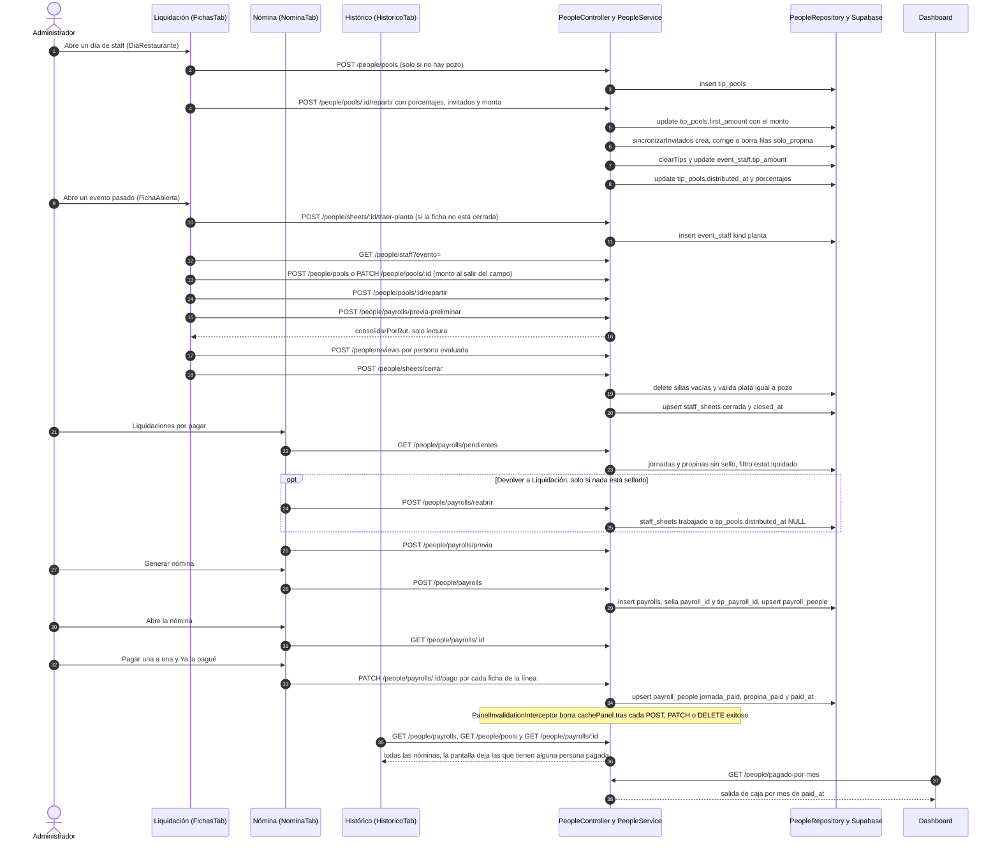

# Flujo: Liquidar, armar nómina, pagar y pasar al histórico
> **Estado: verificado una vez contra el código** (commit 0de0ddb, 11-09-2026). Falta la etapa de completar lo que no quedó escrito. Parte del atlas; índice de flujos en flujos/00_INDICE_DE_FLUJOS.md y del sistema en ../00_MAPA_DEL_SISTEMA.md.

## 1. En palabras simples

Cuando la gente ya trabajó, su plata pasa por tres mesas. En **Liquidación** se valida cada día de staff (el ex "día de restaurante") y cada evento que ya ocurrió: horas, montos, quién no lleva propina y el reparto de la propina **por puntos** (horas × valor de la hora del cargo), al peso y sin sobrantes. Un día sin propina también se liquida. Un evento se cierra después de una revisión y de la evaluación del equipo (evaluar es optativo).

Lo liquidado aparece solo en **Nómina → Liquidaciones por pagar**. Ahí se marcan varias, se revisa y se genera **una nómina consolidada por RUT**: una transferencia por persona. Sin RUT no se genera. Mientras nada haya entrado a una nómina, la liquidación se puede **devolver a Liquidación**.

El pago se hace a mano en el portal del banco: el sistema muestra **una persona a la vez** y "Ya la pagué" deja la marca en ese momento. La nómina queda **pagada** cuando no queda nadie por pagar. Apenas tiene una persona pagada ya aparece en el **Histórico de pagos** (como "Parcial" hasta completarse), y cada pago marcado sale en la **Caja** del panel con su fecha. Regla de Felipe (24-08): *en nómina no hay vuelta atrás*.

## 2. El recorrido paso a paso

### Bloque A — Entrar a Liquidación

1. **El administrador abre Personal.**
   - La ruta `/personas` está en `frontend/src/App.tsx`, protegida con `PermissionGuard` y `SECTION_ROLES.people`, que en `frontend/src/constants/permissions.ts` vale `ROLE_GROUPS.ADMIN_ONLY`.
   - `PersonasPage` (`frontend/src/pages/personas/PersonasPage.tsx`) recuerda la pestaña en `localStorage` (`eventia_personal_pestana`). La pestaña interna `fichas` se rotula "Liquidación" y monta `FichasTab`.
   - **Ojo en el motor:** `PeopleController` (`api-rest/src/people/people.controller.ts`) no tiene ningún `@Roles`. `RolesGuard` (`api-rest/src/auth/roles.guard.ts`) dice "Ruta sin @Roles → basta la sesión". O sea, el candado de administrador existe solo en la pantalla.

2. **`FichasTab` carga lo que pide acción** (`frontend/src/pages/personas/FichasTab.tsx`). Las consultas de plata van con `staleTime: 0`. El comentario lo explica: "ACÁ SE REPARTE PLATA: sin caché"; con caché, un garzón recién agregado no aparecía al liquidar.
   - `eventosQueryOptions` (llave `["people","eventos-semana", SEIS_MESES_ATRAS]`, 5 minutos) pide con `getQuotations` las cotizaciones `aceptada` y `realizada` con evento desde hace seis meses.
   - `["people","sheets"]` → `GET /people/sheets` → `PeopleService.findSheets` → `PeopleRepository.findSheets`. Lee `staff_sheets` y hace una segunda consulta a `event_staff` para calcular `en_nomina`.
   - `["people","pools"]` → `GET /people/pools` → `findPools` → `tip_pools`.
   - `["people","dia-mas-viejo"]` → `GET /people/dias/mas-viejo` → `diaMasViejoDeRestaurante`, que devuelve `{ day }`: el día de la fila de `event_staff` sin evento más antigua, liquidada o no.
   - `["people","liquidacion-ventana", desde, hoy]` → `GET /people/staff?desde&hasta` → `findStaffRange`. La ventana es de 42 días, o parte desde el día más viejo si ese es anterior.
   - Con eso arma dos listas:
     - **Días de staff pendientes** (`diasPendientes`): días hasta hoy con al menos una fila sin evento en la ventana y sin un pozo de ese día con `distributed_at`. Cuenta cualquier fila sin evento: `findStaffRange` no descarta las dormidas (`ajuste = 'descansa'`).
     - **Eventos por liquidar** (`pendientes`): eventos cuyo término (o inicio) ya pasó, sin `cierre_administrativo` (migración 86) y con ficha distinta de `cerrada`. Un evento sin ficha se trata como `armando`.

### Bloque B — Liquidar un día de staff

3. **El administrador abre el modal del día.**
   - "Repasar N días" o un chip ámbar fija la `tanda`: la lista queda congelada mientras el modal está abierto. Se abre `DiaRestaurante` (dentro de `FichasTab.tsx`).
   - La tabla es la pieza `TablaDeJornadas` (`frontend/src/components/personas/TablaDeJornadas.tsx`) y junta dos grupos:
     - `delDia`: filas sin evento de ese día, sin `solo_propina` y sin `ajuste = 'descansa'`.
     - `invitadosFilas`: gente que ese día trabajó en un evento y **no** tiene jornada de staff. Si todavía no tiene fila solo-de-propina, se pinta una fila virtual con id negativo.
   - El monto y los porcentajes salen del pozo de ese día (`tip_pools.porcentajes`, migración 87). Sin pozo, parten en blanco.

4. **Ajustes de fila: horas, colación, monto y chip "sin propina".** Los maneja `cambiarStaff`.
   - **Fila real:** `updateStaff` → `PATCH /people/staff/:id` → `PeopleService.updateStaff` → `PeopleRepository.updateStaff`.
     - `TablaDeJornadas` solo manda cinco campos (`CambiosDeJornada`), uno por gesto: `event_staff.starts_at`, `ends_at`, `break_minutes`, `amount` o `no_tip`.
     - Por eso las dos reglas de `updateStaff` que miran `kind` y `status` (planta sin monto borra `amount`; confirmar sin monto responde 400 "Ponle el monto del día antes de confirmarla") **no se activan desde Liquidación**. Un freelance sin monto solo queda con la caja en ámbar (caso borde 19).
     - En una fila solo-de-propina, entrada, salida y colación salen en gris y no se editan: vienen del evento.
   - **Fila virtual del invitado:** `crearSoloPropina` → `POST /people/staff/del-evento-al-dia` → `PeopleService.soloPropinaDelDia`.
     - Lee la jornada del evento con `findStaffPorId` (400 "Esa no es una jornada de evento" si no lo es) y busca la solo-de-propina de esa persona con `findPlantaDelDia`.
     - Si existe, le corrige `amount` o `no_tip` con `updateStaff`.
     - Si no existe, la inserta con `addStaffEnLote`: `quotation_id NULL`, `kind freelance`, cargo y horario del evento, `amount` = el extra o NULL, `no_tip` si vino el chip, `status confirmado`, `solo_propina true`.
   - **Pantalla optimista:** `pintarStaff` pinta de inmediato `["people","staff-evento"]` y `["people","liquidacion-ventana"]`, y deshace si el motor falla. Al terminar invalida `["people","pools"]` y `["people","liquidacion-ventana"]`.
   - Si el día ya estaba repartido, el modal avisa que hay que volver a repartir. El motor **no** recalcula la propina solo.

5. **"Repartir".** Lo hace la mutación `liquidar` de `DiaRestaurante`.
   - **Si el día no tiene pozo:** `createPool` → `POST /people/pools` `{day, first_amount}` → `PeopleService.createPool`. En un pozo de día no hay id que validar contra la empresa (`sonDeLaEmpresa` solo mira `quotation_id` y `role_id`). Si `findPoolDe` ya encuentra uno, lo devuelve en vez de crear otro (índices únicos de la migración 83). Si no, inserta en `tip_pools`.
   - **Luego:** `repartirPool` → `POST /people/pools/:id/repartir` `{porcentajes, invitados, monto}` → `PeopleService.repartir`, en este orden:
     1. Con `monto`, `updatePool` deja `first_amount` = monto redondeado y `second_amount = 0`. Lo hace **antes** de validar: un 400 posterior deja el monto nuevo guardado.
     2. `findPool`. Responde 400 si el pozo está en cero o si los porcentajes no suman 100.
     3. `sincronizarInvitados`:
        - valida que cada invitado sea una jornada de evento de ese día;
        - deja fuera a quien ya tiene jornada de staff ese día (el "cinturón" del caso #423);
        - borra con `removeStaffEnLote` las solo-de-propina que sobran, con 400 si alguna ya tiene `tip_payroll_id`;
        - corrige horario y cargo de las que existen y crea las que faltan con `addStaffEnLote`.
     4. Toma las filas del día: si `sincronizarInvitados` no creó ni borró nada, reutiliza la lista que ya leyó, con los horarios corregidos en memoria (25-08); si no, vuelve a leer con `findPlantaDelDia`, que excluye las dormidas `descansa`. Si alguna tiene `tip_payroll_id`, responde 400 "Hay propinas de este grupo ya liquidadas en una nómina".
     5. Descarta las filas `no_tip` y las sillas vacías. Reparte con `repartirPorPuntos`: minutos trabajados × % del cargo, 540 minutos si falta el horario, y 400 si hay % para un cargo sin nadie. Después `repartirAlPeso`: pisos primero y los pesos que faltan, de a uno.
     6. `clearTips` pone `tip_amount` y `tip_pool_id` en NULL en las filas del pozo. Luego escribe en paralelo, con `updateStaff`, el `tip_amount` y el `tip_pool_id` de cada fila. Al final, `updatePool` guarda `distributed_at = ahora` y `porcentajes`.
   - **Vuelta a la pantalla:** toast, invalidación de pozos y ventana, y el modal **avanza solo al día siguiente** (Felipe, 24-08).
   - **Efecto:** el día ya cuenta como liquidado (`diasLiquidados` ve su `distributed_at`). Sale de la lista de Liquidación al cerrar el modal (mientras está abierto, la tanda sigue congelada) y aparece en Nómina → Liquidaciones por pagar si tiene jornadas o propinas con monto.

6. **"Sin propina este día".** Lo hace `sinPropinaHoy`.
   - Si no hay pozo, lo crea en 0.
   - Si hay pozo con `first_amount > 0`, lo deja en 0 con `updatePool` (`PATCH /people/pools/:id` → `PeopleService.updatePool`). Solo mira `first_amount`: un pozo antiguo con `second_amount` mayor que cero hace fallar el paso siguiente.
   - Después `sinPropina` → `POST /people/pools/:id/sin-propina` → `PeopleService.marcarSinPropina`: 400 si el pozo tiene plata; si no, `tip_pools.distributed_at = ahora`.
   - El modal avanza. El día pasa directo al Histórico, sección "Días sin propina".
   - Ojo: este camino no borra propinas ya repartidas (caso borde 1).

7. **"Listo" solo cierra el modal.** No escribe nada: el día nunca crea nóminas (Felipe, 16-08: *"mandé unos días a liquidación y pasó directo a nómina de pago"*).

### Bloque C — Liquidar un evento

8. **El administrador abre un evento por liquidar.** Se monta `FichaAbierta` (`FichasTab.tsx`). Su consulta `["people","staff-evento", id]` (staleTime 0) hace dos cosas:
   - **Si la ficha no está cerrada,** llama a `traerPlantaAlEvento` → `POST /people/sheets/:quotationId/traer-planta` → `PeopleService.traerPlantaAlEvento`.
     - Saca los días con `diasDeEvento` (desde `quotations.event_date` hasta `event_end_date`).
     - Busca la planta de staff con `plantaEnDias`: `kind planta`, con persona y sin `ajuste = descansa`.
     - Mira lo que ya existe con `findStaff`.
     - Inserta con `addStaffEnLote` una fila por cada persona y día que falte: `kind planta`, `status confirmado`, `amount NULL`, horario de su turno.
     - Es idempotente, pero se repite en **cada** relectura. Es el pendiente 7 del cajón del documento 10, todavía abierto.
   - **Después** pide `getStaff` → `GET /people/staff?evento=` → `findStaff`. La pantalla descarta las sillas vacías (`person_id NULL`) y avisa cuántas se retirarán al cerrar.
   - `FichaAbierta` lee `["people","pools"]` con el `staleTime` por defecto (30 s); la lista de `FichasTab` sí la pide en 0.

9. **Ajustes de fila.** Es la misma `TablaDeJornadas` y el mismo `PATCH /people/staff/:id` del paso 4: horas, colación, jornada del freelance o asignación extra de la planta, y chip "sin propina".
   - **No hay papelera.** El comentario de `TablaDeJornadas` dice: "SIN PAPELERA (Felipe, 18-08)… Quien no vino se saca desde Planificación".
   - Sacar a alguien desde Planificación (la mutación `sacar` de `SemanaTab`) llama a `removeStaff(id, liberar)`. Si la fila es de un evento va con `liberar`: `DELETE /people/staff/:id?liberar=1` → `PeopleService.removeStaff`:
     - 400 "Esa jornada ya está en una nómina: no se puede sacar" si la fila tiene `payroll_id` o `tip_payroll_id`;
     - la fila del evento **no se borra**: vuelve a ser silla vacía (`person_id`, horario, `tip_amount` y `tip_pool_id` a NULL, `kind freelance`, `status por_confirmar`) y conserva cargo, día y monto. Liquidación deja de mostrarla y `cerrarFicha` la retira;
     - si tenía propina, `clearTips` borra el reparto de todo el pozo y `distributed_at` vuelve a NULL, así que hay que repartir de nuevo;
     - si esa persona tenía fila solo-de-propina en el pozo de ese día (y su propina no está en una nómina), la borra; si esa fila tenía propina, reabre también ese pozo.

10. **La propina del evento.** Vive en el componente `Reparto` (`FichasTab.tsx`).
    - La caja del monto guarda al salir del campo (`onCommit`), con `updatePool` o con `createPool` `{quotation_id, first_amount}`.
    - "Repartir" (o "Volver a repartir") → `POST /people/pools/:id/repartir` `{porcentajes}`, sin `invitados` ni `monto` → `PeopleService.repartir`, rama evento:
      - 400 si `findSheetByQuotation` dice que la ficha está `cerrada`;
      - toma las filas con `findStaff`, incluida la planta traída;
      - aplica el mismo candado de `tip_payroll_id`, el mismo reparto por puntos y el mismo `clearTips`;
      - escribe `tip_amount` y `tip_pool_id` por fila, y `distributed_at` y `porcentajes` en el pozo.
    - Con el pozo en cero la sección de reparto no se muestra, y la ficha puede cerrarse sin repartir.

11. **"Liquidar este evento…" abre la revisión.**
    - El componente es `RevisionAntesDeLiquidar` (`frontend/src/pages/personas/RevisionDeNomina.tsx`). Consulta `["people","previa-preliminar", id]` (staleTime 0 y `refetchOnMount: "always"`) → `POST /people/payrolls/previa-preliminar` → `PeopleService.previaPreliminar`.
    - Junta `jornadasPendientes` y `propinasPendientes` del evento (con persona, sin sello y con monto mayor que cero), **sin** preguntar si la ficha está cerrada, y las pasa por `consolidarPorRut`.
    - Devuelve `personas`, `total`, `sin_rut`, `sin_cuenta` y `fichas_repetidas`. No escribe nada.
    - El cuerpo de la tabla (`CuerpoDeRevision`) es el mismo que usa Nómina. Si falta un RUT, la celda dice "falta" en rojo y el botón de aprobar no se bloquea.

12. **"Aprobar y evaluar al equipo →" lleva al cierre.** Se abre `EvaluacionesModal` (`FichasTab.tsx`) y el botón es "Guardar y cerrar la ficha".
    - **Evaluaciones:** por cada persona con estrellas o nota, `createReview` → `POST /people/reviews` → `PeopleService.createReview`, que inserta en `person_reviews` (`person_id`, `quotation_id`, `stars`, `note`).
    - **Cierre:** `cerrarFicha` → `POST /people/sheets/cerrar` → `PeopleService.cerrarFicha`, en este orden:
      1. `deleteSillasVacias` borra de `event_staff` las filas del evento con `person_id NULL` (migración 84).
      2. 400 si algún pozo del evento con plata no tiene `distributed_at`.
      3. Suma el `tip_amount` de `findStaff` y lo compara, redondeado, con el pozo. Si no calza: 400 "La plata repartida ($X) no suma el pozo ($Y)".
      4. `upsertSheet` deja `staff_sheets.status = 'cerrada'` y `closed_at = ahora`.
    - **Vuelta a la pantalla:** toast "Ficha cerrada: lista para la nómina." e invalidación de `["people","pools"]`, `["people","staff-evento", id]` y `["people","sheets"]`.
    - **Efectos:**
      - el evento sale de "Eventos por liquidar";
      - `fichasCerradas` lo deja pasar a la nómina;
      - Gestión → Personal, en Post-Venta, queda de solo lectura (`frontend/src/pages/postventa/GrillaPersonal.tsx`: `soloLectura = congelado || fichaCerrada`);
      - el costo de personal del evento cambia, porque ya no hay sillas vacías.

### Bloque D — Liquidaciones por pagar y nómina

13. **El administrador abre la pestaña Nómina.** Se monta `NominaTab` (`frontend/src/pages/personas/NominaTab.tsx`).
    - **Liquidaciones por pagar:** el componente `LiquidacionesPorPagar` consulta `["people","liquidaciones-pendientes"]` (staleTime 0) → `GET /people/payrolls/pendientes` → `PeopleService.liquidacionesPendientes`.
      - Junta `jornadasPendientes({})` y `propinasPendientes({})` de toda la empresa, más `fichasCerradas` y `diasLiquidados`.
      - Filtra con `estaLiquidado`.
      - Agrupa por evento o por día (clave `dia:`): personas, jornadas, propinas, total y los nombres de quienes están **sin RUT**. Los eventos (sin día) salen primero.
    - **Nombres:** los pone la pantalla con `eventosQueryOptions`: "N° · cliente · fecha" o "Staff · fecha". Un evento que no está en esa lista se lee solo "Evento".
    - **Nóminas de pago:** debajo, `["people","payrolls"]` → `GET /people/payrolls` → `findPayrolls`, que lista todas (también las pagadas) y les suma personas, pagadas y total con `pagosDeNominas` y `montosDeNominas`.

14. **Marca liquidaciones y aprieta "Revisar y generar · $X".**
    - El botón queda deshabilitado si alguna liquidación marcada tiene gente sin RUT.
    - Se abre `RevisarAntesDeGenerar`, que consulta `["people","previa-nomina", seleccion]` (staleTime 0, `refetchOnMount: always`) → `POST /people/payrolls/previa` `{quotation_ids, dias}` → `PeopleService.previaPayroll` → `reunirLiquidado` → `consolidarPorRut`. `reunirLiquidado` es la **misma** función que después genera la nómina.
    - **Modo mezcla:** si vienen días y eventos, se piden por separado y se suman. El filtro `{dias}` es excluyente: solo filas sin evento, de esos días.
    - Si no queda nada liquidado, responde 400 diciendo cuántas jornadas esperan el cierre de su evento o de su día.
    - En la revisión, "Generar nómina" queda deshabilitado si `previa.sin_rut` trae a alguien.

15. **"Generar nómina".** La mutación `generar` llama a `createPayroll` → `POST /people/payrolls` `{label: "Nómina <fecha>", quotation_ids, dias}` (`CreatePayrollDto`) → `PeopleService.createPayroll`:
    1. `reunirLiquidado` otra vez. Se paga lo que dice la base en ese instante, no lo que se vio en la revisión.
    2. Si alguna fila es de una persona sin `people.rut`: 400 con los nombres.
    3. `PeopleRepository.createPayroll` inserta en `payrolls` (`company_id`, `label`).
    4. `stampRows` sella las jornadas: `event_staff.payroll_id = id`.
    5. `stampRows` sella las propinas: `event_staff.tip_payroll_id = id`.
    6. `insertPagos` hace upsert en `payroll_people` (`company_id`, `payroll_id`, `person_id`), una fila por ficha. `jornada_paid` y `propina_paid` nacen en `false` (migración 77).
    7. `poolsSinRepartir`, y devuelve `{...payroll, personas, fuera, sinLiquidar}`.
    - **Vuelta a la pantalla:** toast "Nómina generada: N personas por pagar", invalidación de `["people","liquidaciones-pendientes"]` y `["people","payrolls"]`, y se abre la nómina (`NominaAbierta`).
    - **Efecto del sello:** desde ahora esas filas no se pueden sacar (`removeStaff`), su propina no se puede volver a repartir (`repartir`) y su liquidación no se puede devolver (`reabrirLiquidacion`).
    - Son cuatro escrituras separadas, sin transacción. **No existe ningún endpoint para borrar o anular una nómina.**

### Bloque E — Devolver a Liquidación (antes del sello)

16. **Desde Liquidaciones por pagar.**
    - Cada fila tiene "Reabrir para corregir" con `ConfirmInline`. El mismo botón aparece en la revisión cuando hay una sola liquidación marcada.
    - La llamada es `reabrirLiquidacion` → `POST /people/payrolls/reabrir` `{quotation_id}` o `{day}` → `PeopleService.reabrirLiquidacion`:
      - `hayPagosEn` cuenta las filas de ese evento (o las filas sin evento de ese día) con `payroll_id` o `tip_payroll_id`. Si hay alguna: 400 "Ya hay pagos de esta liquidación en una nómina…".
      - **Evento:** `upsertSheet` deja `staff_sheets.status = 'trabajado'` y `closed_at = NULL`.
      - **Día:** `desrepartirPozoDelDia` deja `tip_pools.distributed_at = NULL`.
    - No borra propinas, porcentajes ni evaluaciones. Tampoco devuelve las sillas vacías retiradas al cerrar.
    - **Vuelta a la pantalla:** invalida `liquidaciones-pendientes`, `sheets`, `pools` y `liquidacion-ventana`. El evento o el día reaparece en Liquidación y Gestión se destraba.

17. **Desde Histórico, sección "Días sin propina".** El botón "Devolver a Liquidación" usa una confirmación propia de dos botones y llama al mismo endpoint con `{day}`. Después invalida **todo** `["people"]`.

### Bloque F — Pagar una a una

18. **El administrador abre una nómina.** `NominaAbierta` consulta `["people","payroll", id]` → `GET /people/payrolls/:id` → `PeopleService.getPayroll`:
    - `findPayroll` responde 404 si la nómina es de otra empresa.
    - `rowsDeNomina` trae las filas de `event_staff` con `payroll_id = id` y, aparte, las que tienen `tip_payroll_id = id`, con `people(*)` completo (incluidos los datos bancarios).
    - `findPagos` trae las filas de `payroll_people`.
    - La pantalla consolida con `porPersonaDe` (`frontend/src/pages/personas/porPersona.ts`): por RUT, o por ficha si no hay RUT.
    - El estado de cada línea sale de `estadoDelPago` (`estadoDelPago.ts`): pagada solo si todas sus fichas tienen marcado lo que corresponde. Una línea sin nada que pagar cuenta como pendiente.

19. **"Pagar una a una" y luego "Ya la pagué".**
    - `PagoUnoAUno` muestra solo las pendientes, con flechas, RUT, banco, cuenta y `DesgloseDePago`.
    - "Ya la pagué" recorre **en serie** cada `personId` de la línea: `marcarPago` → `PATCH /people/payrolls/:id/pago` `{person_id, jornada_paid: true, propina_paid: true}` → `PeopleService.marcarPago`.
    - `marcarPago` llama primero a `findPayroll`, lo que cierra el agujero de nóminas ajenas encontrado en la revisión del 16-08. Después `upsertPago` escribe en `payroll_people` `jornada_paid`, `propina_paid` y `paid_at = ahora`.
    - **Vuelta a la pantalla:** invalida `["people","payroll", id]` y `["people","payrolls"]` (arreglo del 03-09, commit `dbd9d0f`). El modal se cierra cuando la persona marcada es la última de la lista de pendientes; si se llegó a ella con › y quedaron otras atrás, igual se cierra.
    - **Estado "pagada":** no hay columna. `findPayrolls` dice `pagada` cuando la nómina tiene al menos una fila en `payroll_people` y todas tienen `jornada_paid` y `propina_paid`; en cualquier otro caso, `banco` ("En el banco").

### Bloque G — Histórico de pagos y panel

20. **Pestaña Histórico de pagos.** Se monta `HistoricoTab` (`frontend/src/pages/personas/HistoricoTab.tsx`).
    - **Gráficos:** `["people","historico-graficos"]` → `GET /people/historico/graficos` → `PeopleService.graficosHistorico`. Usa `filasEnNominaDesde` (filas con cualquier sello, desde hace 11 meses) y `findPools`, y arma todo con `armarGraficosHistorico`.
    - **Pagos:** pide `["people","payrolls"]` (la misma lista completa de `findPayrolls`) y la pantalla deja solo las nóminas con `pagadas > 0` (`nominasConPagos`), la más nueva primero.
      - Precarga sus detalles con `prefetchQuery` (60 segundos).
      - Al abrir una, `porConceptoDe` (`porConcepto.ts`) muestra una fila por evento o día de staff, con su total.
      - El sello de fila solo aparece en la excepción ("Parcial" o "Sin pagar"). La cabecera dice "Pagada" o "Parcial".
    - **"Días sin propina":** lee `["people","pools"]` y muestra los pozos de día con `distributed_at` y total 0 (ver paso 17).

21. **Dashboard, Caja y costo.** Viven en `DashboardPage` (`frontend/src/pages/dashboard/DashboardPage.tsx`).
    - **Caja:** `["dashboard-pagado-personal", empresa]` → `getPagadoPersonalPorMes` → `GET /people/pagado-por-mes` → `PeopleService.pagadoDePersonalPorMes` → `PeopleRepository.pagadoDePersonalPorMes` (tres lecturas: `payroll_people` con `paid_at`, las filas selladas de `event_staff` y los nombres de `people`) → `pagadoDePersonalPorMes` (`api-rest/src/people/utils/pagado-por-mes.ts`). Suma por mes de `payroll_people.paid_at` lo marcado como pagado, jornada y propina por separado, con el desglose por persona.
    - **Costo:** `["dashboard-costo-personal", empresa]` → `getCostoPersonal` → `GET /people/costo-personal` → `PeopleService.costoPersonal` → `PeopleRepository.costoPersonalPorEvento`, que suma `event_staff.amount` por evento y cargo, sillas vacías incluidas.

## 3. Diagrama

## 4. Datos que cambian

| tabla | columnas | en qué paso | quién escribe |
|---|---|---|---|
| `event_staff` | `starts_at`, `ends_at`, `break_minutes`, `amount`, `no_tip` | 4, 9 | `PeopleService.updateStaff` (`PATCH /people/staff/:id`) |
| `event_staff` (alta) | fila solo-de-propina: `company_id`, `quotation_id NULL`, `person_id`, `day`, `role_id`, horario del evento, `kind freelance`, `status confirmado`, `amount` (extra o NULL), `solo_propina true`, `no_tip` | 4, 5 | `soloPropinaDelDia` y `sincronizarInvitados` → `addStaffEnLote` |
| `event_staff` | `amount`, `no_tip` de una fila solo-de-propina que ya existe | 4 | `soloPropinaDelDia` → `updateStaff` |
| `event_staff` | `starts_at`, `ends_at`, `break_minutes`, `role_id` de las solo-de-propina que siguen invitadas (copiados del evento) | 5 | `sincronizarInvitados` → `updateStaff` |
| `event_staff` (baja) | filas solo-de-propina que sobran | 5 | `sincronizarInvitados` → `removeStaffEnLote` |
| `event_staff` (alta) | planta traída: `quotation_id`, `person_id`, `day`, `role_id`, `kind planta`, `status confirmado`, `amount NULL`, horario | 8 | `traerPlantaAlEvento` → `addStaffEnLote` |
| `event_staff` | `tip_amount`, `tip_pool_id` (primero a NULL, después el reparto) | 5, 10 | `repartir` → `clearTips` + `updateStaff` |
| `event_staff` | fila del evento liberada como silla vacía: `person_id`, `starts_at`, `ends_at`, `break_minutes`, `tip_amount`, `tip_pool_id` a NULL, `kind freelance`, `status por_confirmar` | 9 (sacar desde Planificación) | `removeStaff` con `liberar` → `updateStaff` |
| `event_staff` | `tip_amount`, `tip_pool_id` a NULL en todo el pozo, si la fila sacada tenía propina | 9 | `removeStaff` → `clearTips` |
| `event_staff` (baja) | la fila solo-de-propina de esa persona ese día | 9 | `removeStaff` → `PeopleRepository.removeStaff` |
| `event_staff` (baja) | sillas vacías (`person_id NULL`) del evento | 12 | `cerrarFicha` → `deleteSillasVacias` |
| `event_staff` | `payroll_id` | 15 | `createPayroll` → `stampRows` |
| `event_staff` | `tip_payroll_id` | 15 | `createPayroll` → `stampRows` |
| `tip_pools` (alta) | `company_id`, `quotation_id` o `day`, `area` (NULL), `first_amount`, `second_amount` | 5, 6, 10 | `createPool` |
| `tip_pools` | `first_amount`, `second_amount` | 5 (monto en el mismo viaje), 6, 10 | `repartir` / `updatePool` |
| `tip_pools` | `distributed_at`, `porcentajes` | 5, 10 | `repartir` |
| `tip_pools` | `distributed_at` | 6 | `marcarSinPropina` |
| `tip_pools` | `distributed_at = NULL` | 9, 16, 17 | `removeStaff` → `updatePool`; `reabrirLiquidacion` → `desrepartirPozoDelDia` |
| `person_reviews` (alta) | `company_id`, `person_id`, `quotation_id`, `stars`, `note` | 12 | `createReview` |
| `staff_sheets` (upsert) | `status = 'cerrada'`, `closed_at` | 12 | `cerrarFicha` → `upsertSheet` |
| `staff_sheets` | `status = 'trabajado'`, `closed_at = NULL` | 16 | `reabrirLiquidacion` → `upsertSheet` |
| `payrolls` (alta) | `company_id`, `label` | 15 | `createPayroll` |
| `payroll_people` (upsert) | `company_id`, `payroll_id`, `person_id` (marcas en `false` por defecto) | 15 | `createPayroll` → `insertPagos` |
| `payroll_people` (upsert) | `jornada_paid`, `propina_paid`, `paid_at` | 19 | `marcarPago` → `upsertPago` |

Ningún paso de este flujo escribe en `quotations`, `payments` ni en otras tablas fuera de estas.

## 5. Efectos automáticos y colaterales

- **Ni correos ni relojes.** `api-rest/src/people` no tiene `*-cron.service.ts`, y `PeopleService` no importa el módulo de correo. Nadie recibe aviso cuando se genera o se paga una nómina.
- **Caché del motor.** `PanelInvalidationInterceptor` (`api-rest/src/cache/panel-invalidation.interceptor.ts`, registrado como `APP_INTERCEPTOR` en `api-rest/src/app.module.ts`) borra el `cachePanel` de la empresa en cada POST, PATCH o DELETE que termina bien. Eso incluye las dos "previas", que solo leen. Ningún módulo del motor fuera de `people` lee `event_staff`, `staff_sheets`, `tip_pools` ni las tablas `payroll*` (búsqueda en `api-rest/src`), así que el borrado no tiene efecto sobre estos datos.
- **Cachés de la app (React Query).** Por defecto, `staleTime` 30 s y relectura al volver a la pestaña (`frontend/src/lib/queryClient.ts`).

| Acción (paso) | La app invalida | Queda viejo hasta que se relea |
|---|---|---|
| Ajustar una fila del día (4) | `["people","pools"]`, `["people","liquidacion-ventana"]` (con pintado optimista) | `["people","staff-semana", …]` de Planificación y `["people","historial", persona]` de la ficha de persona |
| Ajustar una fila del evento (9) | `["people","pools"]`, `["people","staff-evento", id]`, `["people","sheets"]` | ídem |
| Repartir o "sin propina" de un día (5, 6) | `["people","pools"]`, `["people","liquidacion-ventana"]` | `["people","historico-graficos"]`. `["people","liquidaciones-pendientes"]` tiene staleTime 0 y se relee al abrir Nómina |
| Cerrar la ficha (12) | `["people","pools"]`, `["people","staff-evento", id]`, `["people","sheets"]` (la comparte `GrillaPersonal`, así que Gestión se bloquea de inmediato) | `["dashboard-costo-personal", empresa]`: el costo cambió al borrar las sillas vacías |
| Generar la nómina (15) | `["people","liquidaciones-pendientes"]`, `["people","payrolls"]` | `["people","sheets"]` (su `en_nomina`), `["people","historial", persona]`, `["people","historico-graficos"]` |
| Devolver desde Nómina (16) | `liquidaciones-pendientes`, `sheets`, `pools`, `liquidacion-ventana` | `["people","staff-evento", id]` (se relee al abrir la ficha, staleTime 0) |
| Devolver desde Histórico (17) | todo `["people"]`, incluidos la lista de personas y las evaluaciones | — |
| "Ya la pagué" (19) | `["people","payroll", id]` (misma llave que el detalle del Histórico), `["people","payrolls"]` | `["dashboard-pagado-personal", empresa]` (la Caja) |

- **Cascadas dentro del flujo:**
  - al cerrar la ficha se borran las sillas vacías;
  - sacar a alguien de un evento desde Planificación no borra su fila: la deja como silla vacía, que `cerrarFicha` retira después;
  - sacar a alguien que tenía propina borra el reparto de **todo** el pozo y lo reabre (en un evento, el cierre queda trabado hasta repartir de nuevo; un día vuelve a Liquidación);
  - sacar a alguien de un evento borra su fila solo-de-propina del día y, si esa fila tenía propina, reabre ese pozo (`removeStaff`).
- **Pantallas de otros módulos que leen lo mismo:**
  - Gestión → Personal en Post-Venta: `GrillaPersonal` usa `["people","sheets"]` como candado (mira `closed_at`) y comparte `["people","staff-evento", id]`; `EventResourcesSection` y `ServiciosTab` usan esa misma llave para el costo.
  - Dashboard: costo y Caja.
  - `PagosDePersona` (`frontend/src/pages/personas/PagosDePersona.tsx`): su "Se le debe" cuenta como **pagado** todo lo que tiene sello (`pagado: a.payroll_id !== null`), aunque todavía no se haya pagado en el banco.
- **Datos que el motor calcula y ninguna pantalla muestra:**
  - `en_nomina` de `findSheets`: solo aparece en `frontend/src/types/people.types.ts`, y cuesta una consulta extra en cada carga;
  - `fuera` y `sinLiquidar` que devuelve `createPayroll`;
  - `pagadoEl` de `porConceptoDe`.
- **`traer-planta` se repite:** cada relectura de `["people","staff-evento", id]` con la ficha abierta (una invalidación, o volver a la pestaña del navegador por `refetchOnWindowFocus`) vuelve a hacer el POST. Es inocuo por idempotente, pero cada vez borra el caché del panel.

## 6. Reglas de negocio que gobiernan el flujo

1. **Repartir no es liquidar, y liquidar no crea nóminas** (Felipe, 16-08). Quien crea nóminas es un solo lugar, la pestaña Nómina, porque ahí se revisan los datos del banco. Evidencia: comentario "EL DÍA NO CREA NÓMINAS" en `DiaRestaurante`; documento 10, "Repartir y liquidar son dos pasos distintos".
2. **A la nómina solo entra lo liquidado** (16-08). En laboratorio se midieron $100.000 en 4 filas de eventos a medio liquidar que se colaban. "Liquidado" depende del origen:
   - un evento, cuando su ficha tiene `closed_at`;
   - un día, cuando su pozo tiene `distributed_at`.

   Evidencia: `estaLiquidado`, `fichasCerradas` y `diasLiquidados` en `people.service.ts` y `people.repository.ts`.
3. **Reparto por puntos** (21-08): el % es el valor de la hora del cargo. *"Es lo más defendible y refleja mejor el espíritu de cómo queremos repartir esto."* Va al peso y sin sobrantes; si falta el horario se asumen 9 h. Evidencia: `repartirPorPuntos`, `repartirAlPeso`, `minutosTrabajados`.
4. **El candado mira la plata, no los porcentajes.** Es la lección del 24 de enero en el Excel: $15.715 en el aire con la casilla en 100 %. Evidencia: `cerrarFicha` compara la suma de `tip_amount` contra el pozo.
5. **Un pozo por evento y uno por día** (migración 83). Los pozos de sobra trababan el cierre para siempre. Evidencia: `createPool` devuelve el existente con `findPoolDe`; índices `tip_pools_uno_por_evento` y `tip_pools_uno_por_dia`.
6. **"Sin propina" por persona es del día, no de la persona** (migración 82). Su jornada se paga igual. **Un día sin propina también se liquida**, pero solo con el pozo en cero (15-08). Evidencia: `no_tip`, `marcarSinPropina`.
7. **Los invitados del evento entran al pozo del día por defecto** (24-08, migración 88) mediante una fila solo-de-propina. Quien ya tiene jornada de staff ese día no se invita (el cinturón del #423). Evidencia: `sincronizarInvitados`, `invitadosFilas`.
8. **La planta con turno entra a la ficha del evento** (18-08) con `kind planta`, sin monto y con propina; no duplica a nadie. En un evento, `kind planta` significa "viene de la ficha". Evidencia: `traerPlantaAlEvento`, `esPlanificacion`.
9. **Una silla vacía jamás llega a nómina, y al cerrar se retira** (migración 84). Evidencia: `.not('person_id','is',null)` en `jornadasPendientes` y `propinasPendientes`; `deleteSillasVacias`.
10. **Se liquida solo lo que ya pasó** (15-08: *"no pago un evento de diciembre en agosto"*), **y todo evento pasado se liquida** (21-08). Los cierres administrativos del arranque no se listan (migración 86). Evidencia: `filas` y `pendientes` en `FichasTab`.
11. **Hay revisión antes de liquidar** (18-08): la misma tabla y la misma consolidación que Nómina. Sin RUT no bloquea liquidar. Evidencia: `previaPreliminar` y `CuerpoDeRevision`.
12. **El RUT es regla de avance para generar** (16-08: *"los RUT deben estar antes de poder generar las nóminas"*). Se corta en el motor y en la pantalla. Evidencia: `createPayroll` y `faltanRut` en `LiquidacionesPorPagar`.
13. **Se consolida por RUT, no por ficha** (16-08). El Excel tenía 11 pares de personas duplicadas por $9.520.018. Sin RUT se va por ficha y nunca se junta con otros. Evidencia: `consolidarPorRut` (motor) y `porPersonaDe` (pantalla).
14. **La nómina no es una semana: es un selector.** El modo "días sueltos" es excluyente. Evidencia: `SeleccionPayrollDto.dias` y `reunirLiquidado`.
15. **El estado de la nómina se deduce, no se guarda** (16-08: "en el banco" = subida y pendiente). Evidencia: `findPayrolls`.
16. **Un monto por persona, dos estados** (17-08: *"no existe el parcial"*). La base conserva dos marcas y la pantalla marca las dos. Evidencia: `estadoDelPago` y `PagoUnoAUno`.
17. **La salida de caja manda por la fecha del pago** (29-08: *"cuando los marque como pagados en la pestaña de nómina"*), con la propina incluida. Evidencia: `pagadoDePersonalPorMes`.
18. **En nómina no hay vuelta atrás** (24-08). Da lo mismo si ya se pagó en el banco. Evidencia:
    - `removeStaff`, `repartir` y `reabrirLiquidacion` rechazan lo sellado;
    - no existe endpoint para borrar una nómina.
19. **Devolver a Liquidación es un ajuste, no todo de nuevo** (18-08). No borra nada y solo se permite si nada está sellado. Evidencia: `reabrirLiquidacion`, `desrepartirPozoDelDia`.
20. **Tres estados: Liquidación, Nómina e Histórico** (08-09: *"un hito es pagado, es un sello que no debería tener reapertura"*). El Histórico muestra solo nóminas con pagos; la excepción son los días sin propina. Evidencia: `nominasConPagos` y `diasSinPropina` en `HistoricoTab`.
21. **Se dice "día de staff", no "día de restaurante"** (08-09). El código interno sigue diciendo restaurante.
22. **Dos candados de Gestión → Personal** (18-08: *"se debería bloquear solo cuando se marca como realizado o bien se liquidan los pagos"*). Evidencia: `GrillaPersonal`.
23. **No se genera archivo para el banco y siempre se transfiere a la persona** (documento 10, "El pago"). El sistema acompaña, no transfiere.

## 7. Si cambias algo en este flujo

1. **Si cambias** el modal del día o la ficha para que creen la nómina directo, **pasa** que se sube al banco sin revisar RUT ni cuentas, **porque** la revisión solo existe en la pestaña Nómina. Evidencia: incidente del 16-08 (*"mandé unos días a liquidación y pasó directo a nómina de pago"*), comentario en `DiaRestaurante`.
2. **Si cambias** `estaLiquidado` o las consultas `jornadasPendientes` y `propinasPendientes` para que entre "todo lo que tenga monto", **pasa** que se paga plata de eventos a medio liquidar, **porque** la ficha abierta todavía se puede corregir. Evidencia: $100.000 en 4 filas medidos el 16-08; `nomina-solo-lo-liquidado.spec.ts`.
3. **Si cambias** `previaPayroll` o `createPayroll` para que dejen de compartir `reunirLiquidado`, **pasa** que la revisión puede mostrar una cosa y la nómina pagar otra, **porque** hoy son la misma consulta por construcción. Evidencia: comentario sobre `reunirLiquidado` y `RevisarAntesDeGenerar`.
4. **Si cambias** `cerrarFicha` para validar porcentajes en vez de plata, **pasa** que se cierran eventos con propina sin dueño, **porque** los porcentajes pueden sumar 100 con la plata sin cuadrar. Evidencia: 24 de enero, $15.715 (documento 10, capítulo 10.3, caso 10).
5. **Si quitas** los índices únicos de `tip_pools` o el `findPoolDe` de `createPool`, **pasa** que nacen pozos fantasma que traban el cierre para siempre, **porque** la pantalla solo ve el primero y `cerrarFicha` suma todos. Evidencia: migración 83 (cotización 7b5833f2 con cinco pozos en laboratorio).
6. **Si cambias** la caja del monto del pozo del evento de `onCommit` a `onChange`, **pasa** que se graba un valor por tecla (1, 10, 100…) y la respuesta pisa lo escrito, **porque** cada tecla es una escritura. Evidencia: comentario en `Reparto` (15-08: *"ingresé 100.000 y quedó en 100"*).
7. **Si cambias** `consolidarPorRut` o `porPersonaDe` para agrupar por `person_id`, **pasa** que salen dos transferencias al mismo RUT; y si juntas a los sin RUT, **pasa** que personas distintas quedan en un solo pago, **porque** la llave del pago es el RUT. Evidencia: 11 pares por $9.520.018 en el Excel; `consolidar-por-rut.spec.ts`.
8. **Si quitas** el cinturón de `sincronizarInvitados` o de `invitadosFilas`, **pasa** que la planta traída al evento cobra doble propina del día, **porque** ya está en el pozo por su jornada de staff. Evidencia: caso 14-08 del #423 (*"muestra mucha gente"*); `invitados-del-evento.spec.ts`.
9. **Si cambias** `plantaEnDias` o `findPlantaDelDia` y dejas de filtrar `ajuste = 'descansa'`, **pasa** que reciben propina personas que ese día descansaban, **porque** la fila dormida sigue existiendo. Evidencia: caso Soledad del 04-09 (documento 10, capítulo 11).
10. **Si cambias** `laMandaronAUnEvento` o el `kind` de la planta que trae la ficha, **pasa** que la proyección de planta borra turnos de staff de gente que sí vino, **porque** confunde "traída por la ficha" con "mandada al evento". Evidencia: 18-08, cuatro turnos borrados (comentario en `people.service.ts`).
11. **Si agregas** `staleTime` mayor que cero a las consultas de `FichasTab`, **pasa** que se reparte la propina sin la persona recién agregada en Planificación, **porque** la ventana y los pozos se mostrarían desde caché. Evidencia: comentario "ACÁ SE REPARTE PLATA: sin caché".
12. **Si quitas** el `findPayroll` de `marcarPago`, **pasa** que cualquier sesión puede marcar como pagada una nómina de otra empresa, **porque** la llave única de `payroll_people` no incluye la empresa. Evidencia: revisión del 16-08 (comentario en `marcarPago`).
13. **Si quitas** la invalidación de `["people","payrolls"]` en `NominaAbierta.refrescar`, **pasa** que la lista sigue diciendo "0 de 10 · En el banco" después de pagar, **porque** solo se refrescaría el detalle. Evidencia: 03-09, commit `dbd9d0f`.
14. **Si cambias** `pagadoDePersonalPorMes` para usar la fecha del evento o la de creación de la nómina, **pasa** que la Caja muestra salidas antes de pagar, **porque** la regla es la fecha de pago. Evidencia: regla del 29-08; `pagado-por-mes.spec.ts` ("manda la fecha del PAGO").
15. **Si quitas** de `removeStaff` el reabrir del pozo, **pasa** que la propina de quien se sacó queda sin dueño y el día sigue liquidado, **porque** en los días no hay candado de plata como `cerrarFicha`. Evidencia: revisión del 16-08 (comentario en `removeStaff`).
16. **Si agregas** una forma de borrar o anular nóminas, o dejas que `reabrirLiquidacion` pase con sellos, **pasa** que se rompe "en nómina no hay vuelta atrás" y la Caja pierde salidas ya pagadas, **porque** `paid_at` y los sellos son la única historia del pago. Evidencia: 24-08 y 08-09 en el documento 10.
17. **Si pones** `@Roles(administrador)` a nivel de clase en `PeopleController`, **pasa** que Post-Venta se rompe para el cargo operaciones, **porque** `GrillaPersonal` llama a `GET /people/sheets` y la ruta `post-venta` está abierta a `OPERATIONS_AND_UP`. Evidencia: `SECTION_ROLES.payments` en `frontend/src/constants/permissions.ts`. Si se quiere cerrar la nómina al administrador, va `@Roles` por handler (`payrolls*`).
18. **Si cambias** `eventosQueryOptions` (seis meses) o la ventana de `FichasTab`, **pasa** que eventos o días sin liquidar desaparecen de la lista y quedan impagables, **porque** la lista de eventos por liquidar sale de ese catálogo. Evidencia: 17-08 (lentitud) y 16-08 (`dia-mas-viejo`: *"la jornada de quien trabajó quedaba impagable"*).

## 8. Casos borde y estados raros

1. **"Sin propina este día" después de repartir deja la propina viva.** Confirmado leyendo el código; no verificado en datos.
   - La tanda del modal permite volver con ‹ a un día ya repartido, o reabrir uno y entrar de nuevo.
   - `sinPropinaHoy` pone `first_amount = 0` y `marcarSinPropina` estampa `distributed_at`, pero nadie llama a `clearTips`: las filas conservan su `tip_amount`.
   - Resultado: el día sale en el Histórico como "sin propina" y, a la vez, esas propinas entran a Liquidaciones por pagar (`propinasPendientes` solo mira `tip_amount > 0`).
   - En un evento esto lo ataja `cerrarFicha`; en un día no hay candado equivalente.
2. **Un cierre que falla deja rastros.** `cerrarFicha` borra las sillas vacías **antes** de validar la plata, así que un 400 deja la ficha abierta y sin sillas (el costo del evento ya cambió). Además, `EvaluacionesModal` guardó las evaluaciones antes de llamar a `cerrarFicha`: al reintentar se duplican, porque `person_reviews` no tiene llave única (migración 77). Lo mismo pasa al devolver un evento y volver a liquidarlo. El documento 10 dice "una evaluación por persona por evento".
3. **Un reparto a medias.** `repartir` hace `clearTips`, luego escrituras en paralelo y al final `updatePool`. Si una escritura falla, el pozo queda sin `distributed_at` y con propinas parciales. Se sana solo: el día o el evento siguen pendientes y el siguiente "Repartir" limpia y reescribe.
4. **Una nómina a medias.** `createPayroll` hace cuatro escrituras sin transacción (crear, sellar jornadas, sellar propinas, pagos). Si falla entre medio queda una nómina con parte de las filas selladas y sin `payroll_people`: aparece "En el banco" con 0 personas y no hay endpoint para anularla.
5. **Dos administradores generan a la vez con la misma selección.** Deducido del código; no verificado en datos. `stampRows` no filtra `payroll_id IS NULL`, así que la segunda nómina reescribe los sellos de la primera. La primera queda con filas de `payroll_people` sin plata detrás: `porPersonaDe` no las muestra, no se pueden marcar y esa nómina nunca llega a "pagada". El doble clic de una misma persona sí está cubierto (botón deshabilitado con `isPending`).
6. **Una línea con dos fichas del mismo RUT se marca por partes.** `PagoUnoAUno` marca cada ficha en serie. Si la segunda falla, la línea sigue "pendiente" y al reintentar se reescribe el `paid_at` de la primera, que puede caer en otro mes de la Caja.
7. **Pagos marcados de noche a fin de mes.** `llaveDelMes` en `pagado-por-mes.ts` usa `getMonth()` con la zona del servidor. Según un comentario de `DashboardPage`, el backend corre en UTC, así que un pago marcado después de las 20:00 o 21:00 de Chile el último día del mes caería en el mes siguiente. Por confirmar.
8. **Filas selladas o pagadas se pueden editar desde otras puertas.**
   - `PeopleService.updateStaff` no revisa `payroll_id`, `tip_payroll_id` ni si la ficha está cerrada. `UpdateEventStaffDto` acepta `amount`, `day`, `kind`, `role_id` y horas.
   - Ni `SemanaTab` ni `PersonaFichaPage` tienen un candado por sello (búsqueda sin resultados).
   - Resultado: cambiar el monto o el día de una jornada ya en nómina cambia de forma retroactiva el total de la nómina, el Histórico y la Caja, porque `rowsDeNomina`, `montosDeNominas` y `pagadoDePersonalPorMes` leen el valor vivo.
   - Solo `removeStaff` está protegido.
9. **Horas cambiadas después de repartir.** La propina no se recalcula. El modal del día avisa; la ficha del evento no. `cerrarFicha` deja cerrar igual, porque la suma sigue calzando con el pozo.
10. **Un evento liquidado sin plata desaparece de todas las pantallas.** Liquidación lista solo pendientes, Liquidaciones por pagar solo agrupa filas con monto y el Histórico solo nóminas con pagos. No queda ningún botón para devolverlo, aunque el endpoint lo aceptaría. El 24-08 decía "nada desaparece"; el 08-09 redefinió el Histórico, sin cubrir este caso. El 21-08 Felipe había dicho que el flujo sin gente *"no se ha probado todavía en producción"*.
11. **Un evento con más de seis meses sin liquidar no aparece en "Eventos por liquidar"** (filtro de `eventosQueryOptions`). Si igual llega a por pagar, se lee solo "Evento".
12. **La ventana de días de staff crece con la historia.** `diaMasViejoDeRestaurante` devuelve el día de la fila sin evento más antigua, liquidada o no, así que `liquidacion-ventana` termina pidiendo todo desde el primer día registrado.
13. **Un día con jornadas freelance y "sin propina" aparece en dos lugares:** sus jornadas en Liquidaciones por pagar y el día en Histórico → "Días sin propina". Si esas jornadas ya están en una nómina, el botón "Devolver a Liquidación" se muestra igual y el motor lo rechaza.
14. **Datos incompletos.**
    - Sin RUT: se puede liquidar y revisar (sale "falta"), pero no generar.
    - Sin cuenta bancaria: la nómina se genera igual y la revisión avisa.
    - Dos fichas con el mismo RUT: un solo pago, con aviso "(2 fichas)".
15. **Una cotización se borra con filas ya en nómina.** `QuotationsService.remove` solo bloquea las `realizada`. Las migraciones 71 y 79 borran en cascada `event_staff`, `staff_sheets`, `tip_pools` y `person_reviews`. Una cotización `aceptada` borrada (si su guardia de pagos lo permite) se llevaría filas selladas: la nómina perdería esas líneas y `payroll_people` quedaría huérfano.
16. **Estado de la nómina: motor y pantalla miden distinto.** `findPayrolls` exige las dos marcas por ficha; `estadoDelPago` ignora la marca de lo que vale cero. Como la pantalla siempre marca las dos, hoy coinciden. Una marca parcial hecha por API las separaría.
17. **Cualquier usuario con sesión puede llamar a estos endpoints** (`RolesGuard` sin `@Roles`), y `GET /people/payrolls/:id` devuelve `people(*)` completo, con datos bancarios.
18. **Nombres de nómina repetidos.** Dos nóminas generadas el mismo día se llaman igual (`Nómina <fecha>`).
19. **Un freelance sin monto no frena nada.** Deducido del código; no verificado en datos.
    - Desde Liquidación nunca se cambia `status`, así que el candado "sin monto no se confirma" de `updateStaff` no corre.
    - Ni `liquidar` del día ni `cerrarFicha` revisan montos, y `jornadasPendientes` exige `amount > 0`.
    - Resultado: esa jornada no sale en la revisión, no entra a la nómina y el único aviso es la caja ámbar de `TablaDeJornadas`.

## 9. Pruebas que protegen el flujo y huecos

**Lo que corre en la CI** (`.github/workflows/ci.yml`): el motor con `npx jest --silent` y el frontend con `npm run test` (vitest).

**Pruebas del motor** (`api-rest/src/people/tests/`):
- `nomina-solo-lo-liquidado.spec.ts`: `estaLiquidado` con evento cerrado o abierto, día resuelto o no, y fecha con hora.
- `reparto-por-puntos.spec.ts`: `repartirPorPuntos`, con los ejemplos 50/50 y 60/30/10 con $104.000, el caso #423, sin pesos en el aire, cargo en 0 % y % sin nadie.
- `consolidar-por-rut.spec.ts`: `consolidarPorRut`, con una línea por persona, mismo RUT, sin RUT, filas en cero, origen y desglose día a día.
- `invitados-del-evento.spec.ts`: `repartir` con invitados y `soloPropinaDelDia`, incluido el cinturón.
- `reabrir-liquidacion.spec.ts`: `reabrirLiquidacion` para evento, día, regla de fierro y sin origen.
- `graficos-historico.spec.ts`: `armarGraficosHistorico`.
- `pagado-por-mes.spec.ts`: `pagadoDePersonalPorMes` (fecha de pago, jornada y propina por separado, la persona correcta).
- `alta-de-jornada.spec.ts`: el candado de `updateStaff` (un freelance sin monto no se confirma) y `removeStaff` que duerme o borra una jornada del día. Toca el flujo solo de lado: no prueba `liberar`, la propina ni el sello.

**Pruebas del frontend** (vitest):
- `frontend/src/pages/personas/estadoDelPago.test.ts`: `estadoDelPago` y `esPlanificacion`.
- `frontend/src/pages/personas/porConcepto.test.ts`: `porConceptoDe` y `estadoDelConcepto`.
- `frontend/src/components/personas/TablaDeJornadas.test.tsx`: `tituloDelMonto`, los títulos de columna, el chip "sin propina" que invierte `no_tip` y la tabla de solo lectura con la ficha cerrada.
- Nota: `CLAUDE.md` dice "There is no frontend test suite", pero `frontend/package.json` define `"test": "vitest run"` y la CI la corre. Ese texto quedó viejo.

**Huecos.** Ninguna spec llama a estas funciones (búsqueda en `api-rest/src`):
- `cerrarFicha`: el candado de plata y el borrado de sillas.
- `createPayroll`: el corte por RUT, los sellos y `payroll_people`.
- El modo mezcla de `reunirLiquidado`.
- `liquidacionesPendientes`: la agrupación y los sin RUT.
- `marcarPago`: el control de empresa.
- `marcarSinPropina`, `previaPreliminar` y `traerPlantaAlEvento`.
- `findPayrolls`: el estado "pagada".
- `removeStaff` con propina, con sello o con `liberar`.

Tampoco hay pruebas para:
- los casos borde 1, 2, 5, 8 y 19;
- `porPersonaDe`;
- ninguna pantalla (`FichasTab`, `NominaTab`, `HistoricoTab`), ni para las invalidaciones de caché.

## 10. Preguntas abiertas

1. **"Sin propina este día" sobre un día ya repartido** (caso borde 1): ¿debe borrar las propinas escritas? Hoy no lo hace y esas propinas se pagarían.
2. **Un evento liquidado sin plata no se ve en ninguna parte** (caso borde 10): ¿dónde debe quedar y cómo se devuelve si se liquidó por error?
3. **El texto del botón.** El documento 10 (08-09) dice que la palabra "Reabrir" desaparece del módulo y que siempre es "Devolver a Liquidación". En `NominaTab` sigue "Reabrir para corregir", con `ConfirmInline` y `yesLabel="Reabrir"`. ¿Se cambia el texto o el documento?
4. **El sello del Histórico.** El documento 10 (08-09) habla del sello "Pagado el…" por concepto. El commit `2fb51de` del mismo día dejó solo el total y los sellos de excepción: `pagadoEl` se calcula y no se muestra. ¿Se actualiza el documento?
5. **Qué nóminas viven en la pestaña Nómina.** El documento 10 (08-09) dice que ahí viven "las nóminas en el banco con gente aún sin pagar". `NominaTab` lista **todas**, también las pagadas. ¿Se filtra?
6. **"Se le debe" en la ficha de persona.** `PagosDePersona` cuenta como pagado lo que solo entró a una nómina. ¿Es intencional, o debería mirar `payroll_people`?
7. **Los gráficos del Histórico.** "En nóminas por mes" y "Quiénes más reciben" suman lo **sellado**, esté pagado o no, y agrupan por día trabajado. ¿Calza con "Histórico = lo que ya se pagó"?
8. **Filas selladas editables** (caso borde 8): ¿debe `updateStaff` rechazar cambios en filas con `payroll_id` o `tip_payroll_id`, igual que `removeStaff`?
9. **Roles en el motor:** ¿los endpoints `payrolls*`, `pools/*/repartir` y `sheets/cerrar` deberían exigir administrador? Hoy basta la sesión.
10. **El cajón del documento 10, sin implementar en el código leído:**
    - pendiente 1, revalidar la revisión al generar (no hay comparación en `cerrarFicha` ni en `createPayroll`);
    - pendiente 4, avisar propinas anotadas en los pagos del evento (no hay aviso en `Reparto`);
    - pendiente 5, alertar montos menores a $1.000 (`CuerpoDeRevision` solo avisa fichas repetidas y falta de cuenta);
    - pendiente 7, `traer-planta` una sola vez (se repite en cada relectura).

    ¿Siguen en ese orden?
11. **La zona horaria de la Caja:** ¿el servidor de Railway corre en UTC? Si es así, los pagos de fin de mes pueden cambiar de mes (caso borde 7).
12. **Borrar una cotización aceptada con filas en nómina** (caso borde 15): ¿se bloquea como las realizadas?
13. **El documento contra el código en Liquidación:**
    - el documento 10 (15-08) dice "quien no vino se saca" dentro de la liquidación; `TablaDeJornadas` (18-08) dice que se saca desde Planificación;
    - el documento (16-08) dice "un día sale de la lista cuando llega a la nómina"; el código lo saca al repartir (regla del 24-08, "Liquidación es puramente operativa"), y el comentario de `diasPendientes` en `FichasTab` aún describe la regla vieja.

    ¿Se anotan esas notas como reemplazadas?
14. **Datos que nadie usa:** `en_nomina` en `findSheets` y `fuera` y `sinLiquidar` en `createPayroll` ya no los muestra ninguna pantalla. ¿Se retiran para ahorrar consultas, o se piensan mostrar?
15. **Jornadas freelance sin monto al liquidar** (caso borde 19): ¿deben `cerrarFicha` y el reparto del día rechazarlas, o basta la caja ámbar?
