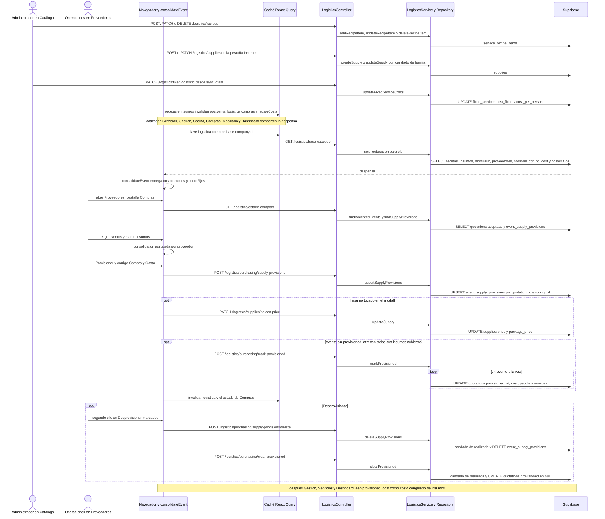

# Flujo: Del menú cotizado a las compras: costos y provisión
> **Estado: verificado una vez contra el código** (commit 0de0ddb, 11-09-2026). Falta la etapa de completar lo que no quedó escrito.

> Verificado contra el código en el commit 0de0ddb (rama `pruebas`) el 11-09-2026, con una segunda pasada escéptica el mismo día. Parte del atlas: el índice de flujos (`00_INDICE_DE_FLUJOS.md`, en esta misma carpeta) y el mapa del sistema (`../00_MAPA_DEL_SISTEMA.md`) están previstos, pero **aún no existían** al verificar.

## 1. En palabras simples

Cada servicio del catálogo tiene su **receta**: cuánto insumo y cuánto mobiliario lleva por persona. Los variables llevan insumos y mobiliario; los fijos, solo mobiliario. Los servicios fijos, además, tienen un **costo armado con recursos** (arriendos y servicios externos) que queda guardado como dos totales: uno fijo y uno por persona.

Mientras se cotiza, el navegador multiplica esas recetas por las personas y muestra un **costo estimado y el margen**. Solo lo ven operaciones y administración. Los servicios marcados "sin costo en Eventia" no se reclaman como "sin receta".

Cuando la cotización queda **aceptada**, operaciones entra a Proveedores → **Compras**, elige eventos y ve la lista de compra sumada y agrupada por proveedor. Al **provisionar** confirma lo que compró y lo que gastó de verdad. Eso deja una fila por evento × insumo. Si al evento ya no le falta ningún insumo y todavía no tenía foto, además se guarda una **foto** en la cotización: fecha, costo de insumos, personas y servicios.

Si en esa confirmación se corrige lo comprado o lo gastado de un insumo, la compra real también **reescribe el precio de ese insumo en el catálogo**. Eso mueve el costo estimado de todas las cotizaciones futuras y de los eventos que aún no se compran.

Después, Gestión, Servicios y el Dashboard usan la foto como **costo congelado de insumos**. Solo Gestión compara la foto con el evento actual y avisa si cambió. Toda la cuenta ocurre en el navegador: el motor guarda, lee, redondea el costo de la foto y aplica el candado del evento realizado. No hay correos, relojes ni transacción.

## 2. El recorrido paso a paso

**Antes del flujo: el catálogo de costos**

1. **Proveedores.** Operaciones o administración, en `/logistica` → pestaña Proveedores (`frontend/src/pages/logistica/components/ProveedoresTab.tsx`).
   - Para crear o editar, la pantalla llama `createSupplier` / `updateSupplier` (`frontend/src/services/logistics.service.ts`). Viajan por `POST /logistics/suppliers` / `PATCH /logistics/suppliers/:id` → `LogisticsController.createSupplier` / `updateSupplier` (el controlador lleva `@Roles(...OPERATIONS_AND_UP)` a nivel de clase) → `LogisticsService` (pasada directa) → `LogisticsRepository.createSupplier` / `updateSupplier` → tabla `suppliers` (`name`, `contact_name`, `phone`, `notes`, `is_active`). El `company_id` siempre sale de la sesión.
   - "Dar de baja" (`ProveedoresTab.doBaja`) es un `PATCH` con `is_active = false`.
   - Eliminar (`DELETE /logistics/suppliers/:id`) pasa por `LogisticsService.deleteSupplier`, que responde 409 si `LogisticsRepository.suppliersUsage` encuentra insumos o recursos apuntándole.
   - Caché: la pantalla solo invalida `["logistica","proveedores"]` (`ProveedoresTab.load`). **No** toca la despensa compartida del paso 6.
2. **Insumos.** Pestaña Insumos (`InsumosTab.tsx`) → `createSupply` / `updateSupply` → `POST /logistics/supplies` / `PATCH /logistics/supplies/:id` → `LogisticsService.createSupply` (pasada directa) / `LogisticsService.updateSupply`.
   - Si el parche trae `unit_family` y es distinta de la guardada, aplica el **candado de familia** (31-07): `LogisticsRepository.findSupplyById` + `recipeLinesForSupply`, y 409 si alguna línea de receta usa una unidad que no pertenece a la familia nueva. El mensaje nombra los servicios y la pantalla lo muestra tal cual.
   - Luego `LogisticsRepository.createSupply` / `updateSupply` escribe en `supplies`: `name`, `price` (por unidad base kg, L o u), `unit_family`, `supplier_id`, `waste_pct`, `package_name`, `package_qty` y `package_price`. El ojo de activar o desactivar (`InsumosTab.toggleActive`) manda solo `is_active`.
   - La pantalla invalida `["logistica","insumos"]` y llama `notifyCostsChanged`, que invalida `["postventa"]`, `["logistica","compras"]` (arrastra la despensa y el estado de Compras) y `["recipeCosts"]`.
3. **Recetas.** El administrador, en el Catálogo (`/services`, `SECTION_ROLES.services = ADMIN_ONLY`), abre la pestaña Receta de un servicio (`frontend/src/pages/services/components/RecipeTab.tsx`, montada en `VariableServiceForm.tsx` y `FixedServiceForm.tsx`). Cada línea se guarda sola.
   - Llamadas: `addRecipeItem` → `POST /logistics/recipes`; `updateRecipeItem` → `PATCH /logistics/recipes/:id`; `deleteRecipeItem` → `DELETE /logistics/recipes/:id`. Las tres llevan `@Roles(...ADMIN_ONLY)` y pasan por `LogisticsService` hasta `LogisticsRepository.addRecipeItem` / `updateRecipeItem` / `deleteRecipeItem`.
   - Tabla `service_recipe_items` (migración 11): `service_type` (variable o fixed), `service_id` (sin llave foránea), `item_kind` (insumo o mobiliario), `supply_id` o `furniture_id`, `qty_per_person` (mayor que 0) y `unit`.
   - Al editar, la pantalla solo cambia `qty_per_person`; el DTO `UpdateRecipeItemDto` también aceptaría `unit`.
   - Los ingredientes solo se ofrecen en variables (`showIngredients = serviceType === "variable"`). La regla vive solo en la pantalla: la migración 11 dice "se aplica en la UI" y `AddRecipeItemDto` acepta insumos para un fijo.
   - Cada guardado pasa por `flashSaved` → `notifyCostsChanged`, con las mismas tres invalidaciones del paso 2. Al cerrar el modal, `ServicesPage.handleCloseServiceForm` → `loadRecipeCosts` invalida `["recipeCosts"]` y `["fixedCosts"]`.
4. **Costo de un servicio fijo.** En la ficha del fijo (`FixedServiceForm.tsx`), `FixedCostSection.tsx` agrega, edita o quita líneas que apuntan a recursos: `POST /logistics/fixed-cost-items`, `PATCH|DELETE /logistics/fixed-cost-items/:id` (ADMIN_ONLY; la lectura `GET` es de operaciones+) → `fixed_service_cost_items` (`fixed_service_id`, `resource_id`, `quantity`).
   - Atajo: `FixedCostSection.createResource` crea el recurso al vuelo (`createManagementResource` → `POST /logistics/resources` → `management_resources`) y lo agrega como línea.
   - Después de cada cambio, `reloadAndSync` relee las líneas y `syncTotals` suma `list_price_fixed × quantity` y `list_price_per_person × quantity`, usando los recursos que la sección cargó al abrirse (`getManagementResources`).
   - Luego `updateFixedServiceCosts` hace `PATCH /logistics/fixed-costs/:id` (ADMIN_ONLY) → `LogisticsService` → `LogisticsRepository.updateFixedServiceCosts` → `fixed_services.cost_fixed` y `cost_per_person`, redondeados. No revisa el error.
   - Ese par es **el caché** que el cotizador y Servicios usan como costo del fijo. `updateFixedServiceCosts` solo se llama desde `FixedCostSection`, y la sección no invalida ninguna consulta de React Query.
5. **Servicios "sin costo en Eventia".** En la ficha del servicio (`FixedServiceForm.tsx`, `VariableServiceForm.tsx`), el interruptor `no_cost` viaja con el guardado del servicio (módulo de catálogo, mapa 05) y queda en `variable_services.no_cost` / `fixed_services.no_cost` (migración 57, 03-08). `ServicesPage.handleServiceFormSuccess` invalida `["logistica","compras","base"]` "para que Gestión se entere sin esperar los 5 minutos de frescura".

**La despensa compartida (lectura, en cada pantalla)**

6. Cotizador, Servicios, Gestión, Cocina, Compras, Mobiliario y Dashboard piden lo mismo con la llave `["logistica","compras","base", companyId]` y `staleTime` de 5 minutos.
   - Algunas usan `useBaseLogistica` (`frontend/src/hooks/useBaseLogistica.ts`): GestionTab, CocinaTab, MobiliarioTab y ServiciosTab. Otras escriben la consulta a mano con la misma llave: `ComprasTab.baseQuery`, `QuotationForm.marginBaseQuery` y `DashboardPage.marginBaseQuery`.
   - `getBaseCatalogo` → `GET /logistics/base-catalogo` → `LogisticsController.baseCatalogo` (`SALES_AND_UP`; el `@Roles` del método reemplaza al de la clase porque `RolesGuard` usa `getAllAndOverride`), que lanza seis lecturas en paralelo vía `LogisticsService`, todas por `company_id`:
     - `findAllRecipeItems` → `service_recipe_items`;
     - `findAllSupplies` → `supplies`;
     - `findAllFurniture` → `furniture_items`;
     - `findAllSuppliers` → `suppliers`;
     - `catalogServiceNames` → `variable_services` y `fixed_services` (`id, name, no_cost`);
     - `fixedServiceCosts` → `fixed_services` (`id, cost_fixed, cost_per_person`).
   - En la app, `mapNameIds` arma el mapa nombre canónico → id (`canonicalServiceName`, en `frontend/src/utils/searchMatch.ts`) y separa `sinCostoVariable` (nombres canónicos) y `sinCostoFijoIds` (ids). `mapFixedCosts` indexa los costos fijos por id.
   - `getBaseCatalogo` no tiene `try/catch` ("sin try/catch tragón a propósito"): si falla, React Query reintenta (`retry: 2` en `frontend/src/lib/queryClient.ts`).

**La cuenta: `consolidateEvent` (en el navegador, sin escribir nada)**

7. `buildConsolidationContext(recipes, supplies, furniture, nameIds, fixedCosts)` agrupa las recetas por `tipo-id` y arma mapas de insumos y mobiliario **sin filtrar `is_active`**. Después, `consolidateEvent(items, personas, ctx, acc)` (`frontend/src/utils/eventConsolidation.ts`) hace esto:
   - **`resolveId`:** si el `codigo` es numérico **y** ese id tiene receta, usa ese id. Si no, busca por nombre canónico. Si tampoco lo encuentra, devuelve el número tal cual, o `undefined` si el código no es numérico.
   - **Variables**, por grupo, con `group.people ?? personas` (las cajas del cotizador 2.0 traen sus propias personas; las cotizaciones antiguas usan el total). Por cada línea de insumo, `neta = toBaseQty(qty_per_person, unit) × personas del grupo × cantidad` y `costo = grossQty(neta, insumo) × price`, donde `grossQty = neta / (1 − waste_pct/100)` si la merma está entre 0 y 100. El mobiliario se suma dentro de cada servicio. Un variable sin receta va a `acc.noRecipe`.
   - **Fijos:** suman sus líneas de receta con las personas del evento. En la práctica son solo mobiliario, porque la pantalla no ofrece insumos a los fijos, pero la cuenta no lo distingue. Además, `costoFijos += (cost_fixed + cost_per_person × personas) × cantidad`. Un fijo sin receta **no** va a `noRecipe` ("acordado con Felipe el 22-07: la marca a fijos era puro ruido").
   - **Mobiliario del evento (`furnPeak`):** el máximo entre servicios, o la suma si el ítem es `preassembled`.
   - **Devuelve** `costoInsumos`, `costoFijos`, `supplyUse` (insumo → cantidad neta), `furnPeak` y `fixedServices`. El acumulador `acc` suma varios eventos en `supplyTotals`, con `totalBase` neta y `costTotal` bruto, y en `furnTotals`.
   - **No mira el `day`** de los grupos: la cantidad es la del evento completo.

**Costo estimado mientras se cotiza**

8. **Cotizador.** Un vendedor, operaciones o administración edita en `frontend/src/pages/quotations/QuotationForm.tsx`.
   - `puedeVerMargen` es verdadero solo para administrador y operaciones; si es falso, `marginBaseQuery` ni siquiera se pide.
   - `margenCotizador` (useMemo) llama `consolidateEvent(buildItemsSnapshot(), Number(formData.people_count) || 0, ctx, acc)` con los costos fijos del catálogo. El comentario lo explica: el evento "todavía no existe y no tiene recursos asignados con precio negociado. Es una estimación previa a propósito".
   - `costo = costoInsumos + costoFijos`. `sinReceta` es `acc.noRecipe` sin repetidos y sin los `sinCostoVariable` (Felipe, 09-09, #516).
   - La tarjeta "Margen y costos" muestra `venta = total_amount − tipAmountUI`, el costo estimado y el margen. Si hay descuento, agrega el "Margen sin descuento". Con `costo <= 0` dice "Todavía no hay costos".
   - **No escribe nada.** Guardar la cotización (`POST /quotations` o `PATCH /quotations/:id`, flujo 02) no guarda ningún costo. El cotizador tampoco lee ni avisa la provisión: en el archivo no hay ninguna referencia a "provision".
9. **Servicios antes de vender.** `frontend/src/pages/postventa/ServiciosTab.tsx` (montada en `PostVentaPage` y en la ficha del negocio, `NegocioPage`) arma `margenEvento` con la misma cuenta del cotizador: `consolidateEvent(buildItemsSnapshot(), personas, …)`, con `personas = adultsN + kidsN`. La usa tal cual mientras el estado no sea `aceptada`, `realizada` ni `cancelada` (`enPostVenta`).

**Costo en Post-Venta (después de aceptar)**

10. **Servicios en Post-Venta.** Con `enPostVenta`, `costo = costoBaseReal + costoRecursos` (12-08, "cargar recursos no movía este cuadro").
    - `provInfo` sale de un `useEffect` sobre `quote.id`: `getQuotationProvisioning` → `GET /logistics/purchasing/provisioning/:quotationId` → `LogisticsController.quotationProvisioning` (OPERATIONS_AND_UP) → `LogisticsService` → `LogisticsRepository.quotationProvisioning`, que lee `quotations.provisioned_at, provisioned_cost, provisioned_people, provisioned_services`. **No pasa por React Query**: se lee una vez al montar. Si la llamada falla, la función se traga el error y devuelve todo en `null`.
    - `costoBaseReal` es `provisioned_cost` si hay `provisioned_at` y costo; si no, `margenEvento.costoInsumos`.
    - `costoRecursos = costoDeRecursos(líneas de event_resources, personas) + Σ amount de las sillas del personal` (tabla `event_staff`, leída con `getStaff`). Las líneas llegan por `recursosQueryOpts` (llave `["postventa","recursos",companyId,id]`) y las sillas por la llave `["people","staff-evento",id]`.
    - El aviso "sin receta" se oculta solo si el evento está en Post-Venta **y** provisionado (`(!enPostVenta || !provisionado)`).
11. **Gestión.** `frontend/src/pages/postventa/GestionTab.tsx`, en Post-Venta → Gestión. La ruta `/post-venta` exige `SECTION_ROLES.payments = OPERATIONS_AND_UP`.
    - `PostVentaPage` precalienta `gestionQueryOpts` y `recursosQueryOpts` apenas se abre el evento.
    - `gestionQueryOpts` (llave `["postventa","gestion",companyId,quoteId]`, `staleTime` 0) llama `getQuotationProvisioning` + `getAcceptedEvents` (`GET /logistics/purchasing/accepted-events`). Los eventos aceptados sirven para ver quién compite por el mismo mobiliario en fechas que se topan, no para el costo.
    - Consolida con `fixedCosts = {}` y `personas = quote.people_count`: los fijos no se estiman, porque llegan como recursos.
    - `costoBase` es `provisioned_cost` o `costoInsumos`; `costoTotal = costoBase + costoRecursos`; la venta es `saleWithoutTip(quote)`.
    - `EventResourcesSection` calcula `costoDeRecursos(lines) + Σ sillas.amount` y lo sube por `onCostChange`. Recibe `noCostIds = sinCostoFijoIds` para no reclamar por fijos sin costo.
    - **Abrir la pestaña puede escribir.** Si el evento no tiene líneas y hay fijos vendidos con líneas de costo, `importFromFixed` arma una fila por línea (cantidad × cantidad vendida, precios de lista, `origin_fixed_service_id` y el día si el evento dura uno) → `addEventResources` (quita `company_id`) → `POST /logistics/event-resources` → `LogisticsRepository.addEventResources` (`assertEventosEditables`, `conDiaUnico`) → `INSERT event_resources`. La pantalla no lo intenta si el evento está `realizada` (`congelado`). El detalle de recursos está en el mapa 06.

**Compras: armar la lista**

12. **Entrar.** Operaciones o administración abre `/logistica` (`PermissionGuard` con `SECTION_ROLES.logistics = OPERATIONS_AND_UP`; en el menú, "Proveedores"). `LogisticaPage` abre en la pestaña `compras` y monta `ComprasTab`, que hace dos consultas:
    - `baseQuery`: la despensa del paso 6.
    - `estadoQuery`: llave `["logistica","compras","estado",companyId]`, con la frescura por defecto de 30 s. `getEstadoCompras` → `GET /logistics/estado-compras` → `LogisticsController.estadoCompras` (`SALES_AND_UP`), que lanza en paralelo:
      - `LogisticsRepository.findAcceptedEvents`: `quotations` con `quotation_status = 'aceptada'`, columnas `id, quotation_number, event_date, event_end_date, people_count, total_amount, items, provisioned_at, provisioned_cost, clients(name)`, ordenadas por fecha;
      - `findSupplyProvisions`: todas las `event_supply_provisions` de la empresa.

      `mapEvento` aplana `clients.name` a `client_name`.
13. **Filtrar y elegir eventos.**
    - `desde` parte en `hoyLocal()` y `hasta` vacío. La búsqueda es por N° exacto o por `matchesSearch` sobre el cliente (`filtered`). Un evento sin `event_date` solo aparece si los dos filtros de fecha están vacíos.
    - Un evento que el filtro esconde se des-selecciona solo (efecto sobre `filtered`).
    - `perEvent` corre `consolidateEvent` por cada evento visible, cada uno con su propio acumulador.
    - `eventStatus` pinta **Completo** si el evento tiene `provisioned_at` **o** todos sus insumos usados tienen fila en `event_supply_provisions`. Pinta **Parcial n/m** si tiene alguno y **Pendiente** si no tiene ninguno.
14. **La lista de compra.**
    - `consolidation` suma los eventos seleccionados en un acumulador común y agrupa `supplyTotals` por `supply.supplier_id`. El 0 es "Sin proveedor asignado" y va al final.
    - Deja fuera el mobiliario ("no se compra: se reutiliza").
    - Devuelve `sinReceta = acc.noRecipe` sin repetidos, pero **sin** filtrar los "sin costo".
    - `resumen` separa lo faltante de lo provisionado por par evento × insumo, con `grossQty × price`.
    - El filtro Faltantes/Provisionados/Todos y las casillas (por insumo o por proveedor) alimentan `checkedFalt` (marcados que aún no están completos en todos los seleccionados) y `checkedProv` (marcados completos en todos los seleccionados).
15. **Descargas (sin escritura).**
    - `downloadPDF` abre una ventana con un HTML continuo, una sección por proveedor, según el filtro activo: cantidad neta, formato calculado con la neta y costo bruto.
    - `downloadExcel` genera un CSV con `;` y BOM. Ojo: su "Subtotal" por proveedor usa `totalBase × price`, o sea neto y sin merma.

**Compras: provisionar**

16. **Abrir la confirmación.**
    - "Provisionar marcados (n)" → `abrirConfirmacion("marcados")` con `checkedFalt`.
    - El enlace "Provisionar todo" → `abrirConfirmacion("todo")` con **todos** los insumos de la lista, incluidos los ya provisionados y sin mirar el filtro.
    - Para cada insumo arma `compradoSug = compradoSugerido(c)` (la cantidad bruta con merma, redondeada hacia arriba a múltiplos de `package_qty`, o a dos decimales si no hay formato) y `gastadoSug = round(costTotal)`.
    - Se abre el modal "Confirmar la compra", agrupado por proveedor, con las columnas "Necesito" (neta, bloqueada), "Compro", "Gasto total" y "$ / unidad". El botón queda deshabilitado si algún "Compro" está en 0.
17. **`confirmarCompra`, en este orden y sin transacción:**
    1. **`tocadas`:** las líneas donde "Compro" o "Gasto" difieren de lo sugerido.
    2. **`buildRows(objetivo)`:** una fila por cada evento seleccionado × insumo del objetivo que ese evento usa. Lleva `qty_base` neta, `cost = round(grossQty × price)` y la foto del proveedor (`supplier_id`, `supplier_name`) tomada de la despensa en caché.
    3. **Reparto del gasto real:** en cada línea tocada, `repartirGastado(round(gastado), qty_base de cada evento)` reemplaza el `cost` de sus filas, al peso y sin sobrantes.
    4. **Guardar las filas.**
       - Recorrido: `upsertEventSupplyProvisions(rows)` quita `company_id` → `POST /logistics/purchasing/supply-provisions` → `ValidationPipe` contra `UpsertSupplyProvisionsDto` / `SupplyProvisionRowDto` → `LogisticsController.upsertSupplyProvisions` → `LogisticsService.upsertSupplyProvisions` → `LogisticsRepository.upsertSupplyProvisions`.
       - En la base: `UPSERT event_supply_provisions` con `onConflict: 'quotation_id,supply_id'`, el `company_id` de la sesión y `provisioned_at = now`.
       - No llama `assertEventosEditables`. El comentario del candado deja abierto "a propósito" tomar la foto de costos (provisionar), pero no nombra este método. Tampoco verifica que la cotización o el insumo sean de la empresa.
       - Si falla, aparece "Error al provisionar, intenta de nuevo", el modal queda abierto y el proceso se detiene.
    5. **El catálogo aprende.**
       - Para cada línea tocada con "Compro" > 0 calcula `price = round(gastado ÷ comprado, 2 decimales)`. Si lo comprado es múltiplo exacto del formato, calcula también `package_price = round(gastado ÷ formatos)`.
       - Recorrido: `updateSupply(sid, cambios)` → `PATCH /logistics/supplies/:id` → `LogisticsService.updateSupply` (no pasa por el candado, porque no trae `unit_family`) → `LogisticsRepository.updateSupply` → `supplies.price` / `package_price`.
       - Va de a un insumo; **el error se ignora** (`updateSupply` devuelve `{ error }` y nadie lo mira).
    6. **Costo por evento:** arma `provMap` y `costoPorEvento` con lo ya provisionado (según la caché de `estadoQuery`) que no se reescribió, más las filas nuevas.
    7. **Sellar los eventos completos (`stampCompleted`).**
       - Entra cada evento seleccionado con insumos que cumpla dos condiciones: **todos** sus insumos quedan en `provMap` **y** no tiene `provisioned_at`, según la caché de `estadoQuery`.
       - Viaja con `cost = costoPorEvento` (o `costoInsumos` si no hay), `people = people_count || 0` y `services = servicesSignature(items)`.
       - Recorrido: `markQuotationsProvisioned` → `POST /logistics/purchasing/mark-provisioned` → validación de `MarkProvisionedDto` (`id` UUID, `cost`, `people`, `services[].nombre` no vacío y `services[].quantity` numérico) → `LogisticsController.markProvisioned` → `LogisticsService` (pasada directa) → `LogisticsRepository.markProvisioned`.
       - En la base: un `UPDATE quotations SET provisioned_at = now, provisioned_cost = round(cost), provisioned_people, provisioned_services WHERE id AND company_id` por evento, en serie.
       - **El error se ignora** (`markQuotationsProvisioned` devuelve `{ error }` y `stampCompleted` no lo mira), y el aviso igual informa "n evento(s) completo(s)".
    8. **Cierre:** aviso verde ("n insumo(s) provisionado(s) · n costo(s) actualizado(s) · n evento(s) completo(s)"), se cierra el modal y se limpian las casillas (y la selección, si fue "todo"). Luego `invalidateQueries(["logistica"])` y `refresh()`, que invalida `["logistica","compras","estado"]`.

**Compras: desprovisionar**

18. Con insumos completos marcados aparece "Desprovisionar marcados (n)". El primer clic deja `confirmAction = "desprovisionar"`: el mismo botón se pone rojo y pregunta "¿Quitar n insumo(s)?". El segundo clic corre `unprovision`:
    - **Borrar filas.** Recorrido: `deleteEventSupplyProvisions(ids de TODOS los eventos seleccionados, checkedProv)` → `POST /logistics/purchasing/supply-provisions/delete` → `DeleteSupplyProvisionsDto` → `LogisticsService` → `LogisticsRepository.deleteSupplyProvisions`. Primero corre `assertEventosEditables` (400 `EVENTO_REALIZADO_CONGELADO` si alguno está `realizada`); después hace `DELETE event_supply_provisions` por empresa, `quotation_id IN` y `supply_id IN`.
    - **Borrar la foto**, solo si no hubo error. Recorrido: `clearQuotationsProvisioned(ids)` → `POST /logistics/purchasing/clear-provisioned` → `ClearProvisionedDto` → `LogisticsService` → `LogisticsRepository.clearProvisioned`. Aplica el mismo candado y hace `UPDATE quotations SET provisioned_at, provisioned_cost, provisioned_people, provisioned_services = null` para **todos** los ids. El error de esta segunda llamada no se revisa.
    - **Refrescar:** `refresh()`, solo el estado de Compras.
    - La rama "sin `supplyIds` se borra todo el evento" existe en el servicio de la app y en el motor. Pero la pantalla siempre manda `checkedProv` (el botón solo aparece con marcados y cualquier cambio de casilla reinicia la confirmación), así que el mensaje "desprovisionado(s) por completo" nunca se alcanza.

**Después: quién lee la foto**

19. **Gestión** congela los insumos con `provisioned_cost` y compara la foto contra el evento actual (`cambios`):
    - personas: `provisioned_people` contra `quote.people_count`;
    - servicios: `provisioned_services` contra `servicesSignature(quote.items)` (agregado, quitado o cambio de cantidad).

    Si algo cambió, muestra el cartel rojo "El evento cambió después de provisionarse — revisa las compras", que sugiere re-provisionar.
20. **Servicios** muestra el cartel ámbar "Evento provisionado el … con N personas". En `save()` rechaza que alguien que no es administrador **baje** las personas bajo `provisioned_people`. La regla vive solo en la pantalla: `QuotationsService.update` no la revisa.
21. **Dashboard** (`DashboardPage.marginData`; la ruta `/dashboard` es `SECTION_ROLES.dashboard = ADMIN_ONLY`).
    - Los eventos llegan por `wonEventsQuery` (llave `["dashboard-margin-events", companyId, rango…]`) → `getWonEventsSince` → `GET /logistics/purchasing/won-events` → `findWonEventsSince`: `aceptada` y `realizada` con `event_date` desde el inicio del rango, con los campos de propina.
    - `provQuery` (llave `["dashboard-proveedores",companyId]`) trae en paralelo las `event_supply_provisions`, los `management_resources` y **todas** las `event_resources`. El margen espera a esta consulta: de ahí salen los recursos de cada evento (`costoDeRecursos`). El personal sale aparte, de `costoPersonalQuery` (`["dashboard-costo-personal"]`).
    - Por evento, los insumos son `provisioned_cost` o el estimado. `proveedores = insumos + recursos` si el evento tiene recursos o personal cargado; si no tiene nada cargado, `insumos + costoFijos`. Se marca con "~" si falta la foto o si no tiene ni recursos ni personal cargado.
    - `salidas` de caja suma ese `proveedores` completo (insumos más recursos, o más `costoFijos`) en el mes de `provisioned_at`. Si el evento está `realizada` sin provisión, lo suma en el mes del evento (regla del 29-08). Un evento aceptado sin provisión no suma.
    - Las `event_supply_provisions` de `provQuery` alimentan además la compra real y la última compra del análisis de proveedores.
22. **Otros que usan la misma cuenta**, sin costo: la ficha de cocina (`FichaCocinaSection`, retiro de bodega) y el radar de `MobiliarioTab` (llave `["logistica","eventos-aceptados",companyId]`).

## 3. Diagrama

## 4. Datos que cambian

| tabla | columnas | en qué paso | quién escribe |
|---|---|---|---|
| `suppliers` | `name`, `contact_name`, `phone`, `notes`, `is_active` | 1 | `ProveedoresTab` → `LogisticsRepository.createSupplier` / `updateSupplier` |
| `supplies` | `name`, `unit_family`, `price`, `supplier_id`, `waste_pct`, `package_name`, `package_qty`, `package_price`, `is_active` | 2 | `InsumosTab` → `LogisticsService.createSupply` / `updateSupply` → `LogisticsRepository.createSupply` / `updateSupply` |
| `service_recipe_items` | fila completa al agregar; `qty_per_person` al editar (la pantalla no cambia `unit`); borrado | 3 | `RecipeTab` → `LogisticsRepository.addRecipeItem` / `updateRecipeItem` / `deleteRecipeItem` |
| `fixed_service_cost_items` | `fixed_service_id`, `resource_id`, `quantity` | 4 | `FixedCostSection` → `LogisticsRepository.addCostItem` / `updateCostItem` / `deleteCostItem` |
| `management_resources` | fila nueva: `name`, `type`, `list_price_fixed`, `list_price_per_person`, `supplier_id` | 4, atajo de crear recurso | `FixedCostSection.createResource` → `LogisticsRepository.createResource` |
| `fixed_services` | `cost_fixed`, `cost_per_person` (caché) | 4 | `FixedCostSection.syncTotals` → `LogisticsRepository.updateFixedServiceCosts` |
| `variable_services`, `fixed_services` | `no_cost` | 5 | formularios del Catálogo (mapa 05) |
| `event_resources` | fila nueva: `quotation_id`, `resource_id`, `quantity`, `price_fixed`, `price_per_person`, `origin_fixed_service_id`, `day`, `company_id` | 11, al abrir Gestión | `EventResourcesSection.importFromFixed` → `LogisticsRepository.addEventResources` |
| `event_supply_provisions` | `quotation_id`, `supply_id`, `qty_base`, `cost`, `supplier_id`, `supplier_name`, `provisioned_at`, `company_id` (UPSERT) | 17.4 | `ComprasTab.confirmarCompra` → `LogisticsRepository.upsertSupplyProvisions` |
| `supplies` | `price`, `package_price` | 17.5 | `ComprasTab.confirmarCompra` → `LogisticsRepository.updateSupply` |
| `quotations` | `provisioned_at`, `provisioned_cost`, `provisioned_people`, `provisioned_services` | 17.7 | `ComprasTab.stampCompleted` → `LogisticsRepository.markProvisioned` |
| `event_supply_provisions` | filas borradas | 18 | `ComprasTab.unprovision` → `LogisticsRepository.deleteSupplyProvisions` |
| `quotations` | `provisioned_*` en `null` | 18 | `ComprasTab.unprovision` → `LogisticsRepository.clearProvisioned` |
| `event_supply_provisions`, `event_resources` | borrado en cascada | §8, borrar la cotización | `QuotationsRepository.remove` (ON DELETE CASCADE, migraciones 16 y 17) |

Los pasos 6 a 10, 12 a 16 y 19 a 22 solo leen.

## 5. Efectos automáticos y colaterales

**Correos, relojes y notificaciones**
- **No hay.** `api-rest/src/logistics` no tiene `*-cron.service.ts`, `@Cron`, `@Interval` ni `EmailService`. `LogisticsModule` solo importa `SupabaseModule`.

**Escrituras que ocurren "de rebote"**
- **Confirmar una compra con líneas corregidas reescribe el catálogo.** `supplies.price` (y `package_price`) cambia para todas las cotizaciones futuras y para todos los eventos no provisionados, en el cotizador, Servicios, Gestión, Compras y el Dashboard. No avisa cuando el salto es grande (ver §6, documento vs código).
- **Abrir Gestión puede insertar recursos** (`EventResourcesSection.importFromFixed`). Es "el ÚNICO punto del sistema que escribe por el solo hecho de ABRIR una pantalla" (comentario OJO del 13-08).
- **`EventResourcesSection.updateLastPrice`** escribe `management_resources.last_price` al editar una línea de recurso, sin esperar respuesta y tragándose el error.

**Cascadas de la base**
- **Borrar una cotización** borra sus `event_supply_provisions` (migración 16) y sus `event_resources` (migración 17). `QuotationsService.remove` lo frena si está `realizada`. `QuotationsRepository.assertDeletable` además lo frena con 409 si hay pagos (`payment_transactions`), reembolsos, plan de pagos (`payments`) o encuesta respondida.
- **Borrar un insumo** borra sus provisiones (migración 16) y sus líneas de receta (migración 11). `LogisticsService.deleteSupply` lo impide con 409 si tiene alguna de las dos.
- **Borrar un proveedor** deja `NULL` en `supplies.supplier_id` (migración 10), `management_resources.supplier_id` (migración 13) y `event_supply_provisions.supplier_id` (migración 30). Como `deleteSupplier` no deja borrar un proveedor con insumos o recursos, en la práctica solo se nota en la foto de las provisiones. El `supplier_name` de la foto se conserva.

**Cachés de la app**

| Acción | Invalida | Queda desactualizado |
|---|---|---|
| Confirmar compra (`confirmarCompra`) | todo `["logistica"]`: despensa, estado, radar de mobiliario, mobiliario, insumos, proveedores y recursos | `provInfo` de un `ServiciosTab` ya abierto (se lee en `useEffect`, no se refresca); `["recipeCosts"]` del Catálogo (el precio cambió), `["dashboard-margin-events"]` y `["dashboard-proveedores"]` (30 s por defecto o al volver a la ventana). `["postventa","gestion",…]` no se invalida, pero tiene `staleTime` 0 y se re-pide al montar |
| Desprovisionar (`unprovision`) | solo `["logistica","compras","estado"]` | `provInfo` de un `ServiciosTab` ya abierto, `["dashboard-margin-events"]` y `["dashboard-proveedores"]`. Los precios no cambian |
| Editar insumo o receta (`notifyCostsChanged`) | `["postventa"]`, `["logistica","compras"]`, `["recipeCosts"]` | — (la despensa se re-pide; `provInfo` no depende de precios ni recetas) |
| Guardar un servicio (`handleServiceFormSuccess`) | `["logistica","compras","base"]`, `["recipeCosts"]` y `["fixedCosts"]` | — |
| Editar líneas de costo de un fijo (`FixedCostSection`) | nada (al cerrar el modal sin guardar, `handleCloseServiceForm` solo invalida `["recipeCosts"]` y `["fixedCosts"]`) | la despensa con el `cost_fixed` viejo hasta 5 minutos: el cotizador, Servicios y el Dashboard (evento sin nada cargado) estiman con el costo anterior |
| Editar o dar de baja un proveedor (`ProveedoresTab.load`) | `["logistica","proveedores"]` | la despensa hasta 5 minutos: Compras agrupa con el nombre viejo y `buildRows` puede guardar ese nombre viejo en `supplier_name` |
| Cambiar el precio de lista de un recurso (`RecursosTab`) | `["logistica","recursos"]` | el caché `fixed_services.cost_fixed/cost_per_person` en la base de datos, hasta que alguien edite las líneas de ese fijo |

**Puertas que no dejan salir el costo, y una que sí**
- El portal del cliente arma la hoja con `listaBlancaDeHoja` (`QuotationsService.getPortalQuotation`): "los costos internos (provisioned_*) … jamás salen por esta puerta".
- La lista de cotizaciones (`QuotationsRepository.findAll`, `COLUMNAS_LISTA`) sí trae `provisioned_at`, `provisioned_cost` y `provisioned_people`. No trae `provisioned_services`. `GET /quotations` (`QuotationsController.findAll`) no lleva `@Roles`, ni en el método ni en la clase, y `QuotationsService.findAll` no quita columnas según el cargo: el costo congelado viaja en la respuesta a **cualquier** usuario con sesión de la empresa, recepción y vendedor incluidos, aunque la pantalla no lo muestre. Ver §10.

## 6. Reglas de negocio que gobiernan el flujo

**Quién ve y quién toca**
- **Solo operaciones y administración ven el costo** en el cotizador y en Servicios ("decisión de Felipe"; "El vendedor sigue pudiendo descontar, pero sin ver el margen"). Evidencia: `puedeVerMargen` en `QuotationForm.tsx` y `ServiciosTab.tsx`.
- **Compras, provisión y recursos son de operaciones y administración.** Las lecturas de la despensa y del estado de compras se abren a vendedor+. Evidencia: `@Roles(...OPERATIONS_AND_UP)` de clase y `@Roles(...SALES_AND_UP)` en `baseCatalogo` y `estadoCompras` (`LogisticsController`), con el comentario "Mismos permisos que las lecturas sueltas (vendedor+, medido en pantallas el 28-07)". La cifra "medido en 8 pantallas (28-07)" está en el comentario de la lectura de proveedores.
- **Recetas y costos de fijos son solo del administrador**, desde el Catálogo. Evidencia: `@Roles(...ADMIN_ONLY)` en `/logistics/recipes` (incluida la lectura por servicio), `/fixed-costs` y las escrituras de `/fixed-cost-items`. La lectura de `/fixed-cost-items` queda en operaciones+ porque la usa Post-Venta.
- **`company_id` nunca viaja en el cuerpo: sale de la sesión.** Evidencia: comentario en `event-operations.dto.ts`; `upsertEventSupplyProvisions` quita `company_id: _omitido`.

**Cantidades, merma y precios**
- **Regla de merma (Felipe, 22-07).** La cantidad es siempre la **neta** de la receta ("lo que se cocina, retira y compra"); la merma ("caducidad, robo, pérdida") solo infla el **costo**. Evidencia: `ConsolidatedSupply` y `addRecipeLines` en `eventConsolidation.ts`; `buildRows` (`qty_base: base, // NETA (regla de merma 22-07)`); commit ee334a7 del 22-07.
- **Unidad base y familias** (convención Fudo): masa kg/gr, volumen L/ml, unidad u. El precio se guarda por unidad base. Evidencia: `UNIT_FAMILY_INFO`, `UNITS_BY_FAMILY` y `toBaseQty` en `frontend/src/types/logistics.types.ts`; `LogisticsService.UNITS_BY_FAMILY`; migración 10.
- **Candado de familia (31-07).** Es un pedido de Felipe "tras pasar naranja y manzana de gramos a unidades a mano": cambiar la familia reescribe el significado de las recetas ("100 gr pasarían a leerse como 100 unidades"). Evidencia: `LogisticsService.updateSupply`.
- **Confirmar la compra real (Felipe, 24-08).** "Al apretar provisionar debería aparecer un modal para confirmar los valores... total comprado y total gastado... esto es solamente para mantener los costos actualizados." Lo que el evento necesita va bloqueado. Si un ítem no se toca, mantiene los valores del catálogo. Si se toca, el costo real alimenta la provisión y el catálogo aprende: `$/unidad = gastado ÷ comprado`. "Sin inventario: comprado ≠ necesitado es la realidad, no un stock." Evidencia: comentario y `confirmarCompra` en `ComprasTab.tsx`; commits b348ac3, f4e3098 y f40a93f (24-08).
- **Se compra por proveedor (24-08):** el modal agrupa como la lista, con el subtotal real de cada proveedor. Evidencia: comentario "SE COMPRA POR PROVEEDOR" en `ComprasTab.tsx`.
- **Doc 10 (14-08 y 15-08): los precios y las cantidades se trabajan en Compras.** Palabras de Felipe: *"en compras debe estar la actualización de precios y cantidades, que es donde trabajamos esta parte del evento"*. El modal de insumos de Gestión es solo informativo y va agrupado por proveedor. La división: "Gestión decide qué comprar · Compras compra · Ficha de cocina saca de bodega". Evidencia: `docs/arquitectura/10_MODULO_DE_PERSONAS.md`, "El modal de insumos"; comentario de `proveedoresQuery` en `GestionTab.tsx`.

**Provisión**
- **La provisión es por partes; `provisioned_at` significa "evento completo".** El abastecimiento real es "martes carnes, miércoles verduras, condimentos al final". Evidencia: `docs/migrations/16_event_supply_provisions.sql`; `UNIQUE (quotation_id, supply_id)`.
- **Foto del proveedor al comprar.** La estadística por proveedor no se reescribe si el insumo cambia de proveedor, se renombra o se elimina. Evidencia: migración 30; `buildRows`.
- **Foto de personas y servicios al provisionar**, para advertir cambios posteriores. Evidencia: migración 17 (`provisioned_people`, `provisioned_services`); `GestionTab.cambios`.
- **Evento provisionado: bajar personas es solo para administradores.** Evidencia: `ServiciosTab.save`. Regla solo de pantalla.
- **El mobiliario no va en Compras** ("no se compra: se reutiliza"). Evidencia: comentario en `ComprasTab.consolidation`.
- **Candado del evento realizado (13-08).** Borrar la foto (`clearProvisioned`) y las provisiones (`deleteSupplyProvisions`) se rechaza con `EVENTO_REALIZADO_CONGELADO`. Tomar la foto (provisionar) queda **abierto a propósito**: "es justamente lo que congela el margen". Evidencia: `LogisticsRepository.assertEventosEditables` y su comentario; `api-rest/src/logistics/tests/candado-logistica.spec.ts`.
- **Las fechas de evento se muestran en UTC** ("el reloj chileno (UTC-4) las corría un día hacia atrás", bug del 22-07). Evidencia: `fmtDate` en `ComprasTab.tsx`.

**Cómo se arma el costo en cada pantalla**
- **Cotizador y Servicios antes de vender:** insumos por receta + `costoFijos` del catálogo. El cotizador lo explica: el evento "todavía no existe y no tiene recursos asignados con precio negociado. Es una estimación previa a propósito". Servicios lo copia: "la MISMA estimación del cotizador". Evidencia: comentarios de `margenCotizador` y de `margenEvento`.
- **Post-Venta (Gestión y Servicios):** insumos congelados (o estimados) + recursos del evento + sillas del personal, **sin** `costoFijos`. Los recursos importados ya traen los fijos con el precio negociado. Evidencia: comentario del 12-08 en `ServiciosTab.tsx`; `GestionTab` consolida con `fixedCosts = {}`.
- **Dashboard:** los recursos **reemplazan** a `costoFijos`; si el evento no tiene nada cargado, manda `costoFijos` ("24-07 (lo pilló Felipe)"). Evidencia: comentario en `DashboardPage.marginData`.
- **Costo de recursos por evento, con el fijo cobrado una vez** (revisión del 16-08). Evidencia: `frontend/src/utils/costoDeRecursos.ts`.
- **La propina no es venta ni margen** (24-07; doc 10: *"es plata que entra y sale, somos intermediarios"*). Evidencia: `saleWithoutTip` en `frontend/src/utils/quotationMoney.ts`; su uso en `GestionTab` y `DashboardPage`; `venta = total − propina` en el cotizador y en Servicios.
- **Servicios "sin costo en Eventia" no son pendientes** (migración 57, 03-08): "Ticket diario, alojamientos o la Exclusividad no llevan costos dentro de Eventia". Se filtran en Gestión, en Servicios ("pillado en la #470 con 'Ticket Diario'", commit 825f31b del 05-08) y en el cotizador ("Felipe, 09-09, en la #516", commit 07ccb1b). **Compras no aplica el filtro** (`consolidation.sinReceta`).
- **La plata a proveedores sale el día que se provisiona** (Felipe, 29-08). Si no se provisionó y el evento se realizó, sale el día del evento, "nunca el día que lo marcaste realizado". Evidencia: comentario "LA PLATA QUE SALIÓ HACIA PROVEEDORES" en `DashboardPage.marginData`.

**Proveedores**
- **Lo que tiene historia se da de baja, no se elimina** (migración 30: "con historia, el ojo lo DA DE BAJA"). Evidencia: `LogisticsService.deleteSupplier` y `deleteSupply`; `ProveedoresTab.doBaja`.
- **Proveedores es lo que se COMPRA; Inventario es lo que ya es nuestro** (Felipe, 15-08). Evidencia: encabezado de `docs/arquitectura/10_MODULO_DE_PERSONAS.md`; comentario del 15-08 en `LogisticaPage.tsx`.

**Documento vs código (anotado sin elegir)**
1. **Merma: ¿cantidad bruta o neta?**
   - Documento: `docs/migrations/31_supply_waste_and_package.sql` dice "Compras, Gestión, bodega de la ficha y costos usan la bruta". El comentario de `Supply` en `logistics.types.ts` dice "compras y costos usan la cantidad BRUTA".
   - Código: la "REGLA DE MERMA (Felipe, 22-07)" de `eventConsolidation.ts` deja la cantidad neta; `buildRows` guarda `qty_base` neta; el pie del PDF dice "Cantidades netas de receta · la merma va incluida solo en el costo". Pero `compradoSugerido` sugiere la **bruta**.
2. **Re-provisionar actualiza la foto.**
   - Documento: la migración 15 dice "re-provisionar está permitido y actualiza la foto". El comentario de `markQuotationsProvisioned` repite "Re-provisionar está permitido: actualiza la foto completa". Los carteles de `GestionTab` y `ServiciosTab` dicen "puedes re-provisionar para actualizar la foto".
   - Código: `ComprasTab.stampCompleted` filtra `!ev.provisioned_at`, así que un evento ya completo **no** se re-estampa desde Compras.
3. **Aviso por salto grande de precio.**
   - Documento: doc 10, "El modal de insumos": "El precio actualiza el catálogo a propósito… Con aviso cuando el salto es grande, para que una compra de apuro en el almacén de la esquina no contamine todas las cotizaciones futuras".
   - Código: `confirmarCompra` escribe `price = gastado ÷ comprado` sin comparar contra el precio anterior.
4. **El resumen de insumos de Gestión.**
   - Documento: doc 10 dice "34 insumos · 3 con cantidad por confirmar [ revisar ]".
   - Código: `GestionTab.tsx` no contiene "por confirmar" ni "revisar".
5. **"Todos los servicios que lo referencian se actualizan solos."**
   - Documento: encabezado de `FixedCostSection.tsx`.
   - Código: vale para lo que muestra esa sección, que calcula en vivo. El caché `fixed_services.cost_fixed/cost_per_person`, que usan el cotizador, Servicios y el Dashboard, solo se reescribe en `FixedCostSection.syncTotals`. `RecursosTab` solo invalida `["logistica","recursos"]`.
6. **Doc 10 §9, abierto: "El ajuste de insumos antes de comprar".**
   - Código: el modal "Confirmar la compra" (24-08) corrige compra y gasto, pero no la cantidad necesitada, que va bloqueada. El documento no se actualizó.
7. **Suite de pruebas del frontend.**
   - Documento: `CLAUDE.md` dice "There is no frontend test suite".
   - Código: `frontend/package.json` tiene `"test": "vitest run"` y `.github/workflows/ci.yml` corre "Pruebas (vitest)".

## 7. Si cambias algo en este flujo

1. **Si sumas** `costoFijos` del catálogo encima de los recursos del evento (en Gestión, en Servicios en Post-Venta o en el Dashboard), **pasa** que los fijos se cuentan dos veces y el margen se muestra más bajo de lo real, **porque** los recursos importados desde los fijos ya traen ese costo con el precio negociado. Ya pasó al revés, con el margen inflado: Dashboard el 24-07 ("lo pilló Felipe") y Servicios el 12-08 ("cargar recursos no movía este cuadro"). Evidencia: comentarios en `DashboardPage.marginData` y en `ServiciosTab.tsx`; `GestionTab` con `fixedCosts = {}`.
2. **Si copias** la cuenta de recursos en otra pantalla en vez de usar `costoDeRecursos`, **pasa** que el fijo de un recurso mixto repartido en días se cobra una vez por día, **porque** hay que agrupar por recurso y no por línea. Ya pasó el 16-08: "el mismo evento mostraba dos costos distintos en dos pestañas de la misma ventana". Evidencia: encabezado de `frontend/src/utils/costoDeRecursos.ts` y su prueba.
3. **Si agregas** una pantalla que avise "sin receta" con `acc.noRecipe`, **pasa** que los servicios "sin costo en Eventia" (Ticket Diario) vuelven a salir como pendientes, **porque** el filtro `sinCostoVariable` se aplica a mano en cada pantalla. Ya pasó dos veces: #470 en Servicios (05-08) y #516 en el cotizador (09-09). Compras hoy todavía los muestra. Evidencia: `margenCotizador`, `margenEvento`, `GestionTab` y `ComprasTab.consolidation`.
4. **Si tocas** `canonicalServiceName`, `mapNameIds` o `resolveId`, **pasa** que las cotizaciones antiguas (códigos tipo "P001", o catálogo renombrado) dejan de encontrar su receta y su marca "sin costo": el costo, la lista de compra y la ficha de cocina bajan sin aviso, **porque** `resolveId` busca por nombre canónico cuando el `codigo` no es un id con receta. Nació el 22-07 (commit f6b2b31, "Smart service-name resolver") para que "las fotos de items de cotizaciones antiguas encuentran su servicio aunque el catálogo haya sido renombrado". Evidencia: `eventConsolidation.ts`, `utils/searchMatch.ts`, `getCatalogServiceNameIds` y `mapNameIds`. No tiene pruebas.
5. **Si mueves** la merma (`grossQty`) a la cantidad en vez del costo, **pasa** que se inflan `qty_base`, la lista, el PDF y el retiro de bodega, y la compra deja de calzar con la receta, **porque** la regla del 22-07 separa cantidad neta y costo bruto (commit ee334a7). Hoy ya conviven lecturas distintas: "Compro" sugerido en bruto; formato del PDF y CSV en neto; subtotal del CSV neto sin merma, mientras cada fila es bruta. Evidencia: `compradoSugerido`, `downloadPDF` y `downloadExcel` en `ComprasTab.tsx`.
6. **Si cambias** `stampCompleted` (el filtro `!ev.provisioned_at`) o el orden de `confirmarCompra`, **pasa** que cambia cuándo se congela el costo del evento y en qué mes el Dashboard cuenta la salida de caja, **porque** `provisioned_cost` alimenta `GestionTab.costoBase`, `ServiciosTab.costoBaseReal` y `DashboardPage.marginData`, y `provisioned_at` alimenta `salidas`. Hoy re-provisionar un evento completo con un gasto distinto **no** actualiza `provisioned_cost` (§6, documento vs código 2).
7. **Si cambias** `buildRows` o el alcance de "Provisionar todo", **pasa** que puedes reescribir costos reales ya confirmados, **porque** el UPSERT por `quotation_id,supply_id` reemplaza la fila entera. "Provisionar todo" incluye los insumos ya provisionados, y "Provisionar marcados" genera filas para **todos** los eventos seleccionados que usan el insumo, incluso los que ya lo tenían. Las líneas no tocadas vuelven al costo de catálogo. Evidencia: `abrirConfirmacion`, `buildRows` y `LogisticsRepository.upsertSupplyProvisions`.
8. **Si agregas** un campo a las filas de provisión o a las entradas de `mark-provisioned`, **pasa** que el motor responde 400, **porque** el `ValidationPipe` global de `api-rest/src/main.ts` rechaza propiedades desconocidas (`forbidNonWhitelisted`). En `mark-provisioned` la pantalla **ignora el error** y avisa "evento(s) completo(s)" igual. Por eso `upsertEventSupplyProvisions` quita `company_id` antes de enviar. Evidencia: `SupplyProvisionRowDto`, `MarkProvisionedEntryDto`, `ProvisionedServiceDto` (`nombre` con `@IsNotEmpty`) y `stampCompleted`.
9. **Si tocas** `assertEventosEditables` o agregas una escritura de provisión, **pasa** que se abre o se cierra el candado del evento realizado, **porque** la regla vive método por método en el repositorio: `clearProvisioned` y `deleteSupplyProvisions` la llaman; `markProvisioned` y `upsertSupplyProvisions` no. Evidencia: `LogisticsRepository` y `candado-logistica.spec.ts`, que prueba tres de las cuatro (rechaza `clearProvisioned` y `deleteSupplyProvisions`, deja pasar `markProvisioned`); `upsertSupplyProvisions` no tiene prueba.
10. **Si agregas** una columna a `quotations` que Compras o el Dashboard necesiten, **pasa** que no llega, **porque** `findAcceptedEvents` y `findWonEventsSince` usan un `select` con columnas explícitas. Así se sumaron los campos de propina el 31-08 ("para que el panel calcule la venta SIN propina POR EVENTO"). Evidencia: `LogisticsRepository.findWonEventsSince`.
11. **Si cambias** la llave `["logistica","compras","base",companyId]`, la forma de `/logistics/base-catalogo` o `getBaseCatalogo`, **pasa** que se descuadran siete pantallas, **porque** comparten una sola caché y tres la escriben a mano (`ComprasTab`, `QuotationForm`, `DashboardPage`): la que llega primero llena la caché para todas. Evidencia: `useBaseLogistica.ts` ("FASE VELOCIDAD (28-07)") y las tres consultas.
12. **Si cambias** cómo se aprende el precio (`gastado ÷ comprado`) o permites corregir solo "Compro", **pasa** que se mueve el costo estimado de todo lo no provisionado y de todo lo futuro, **porque** `supplies.price` es la única fuente del costo por receta. Subir solo "Compro" baja el precio del catálogo en la misma proporción, y no hay umbral de aviso. Evidencia: `confirmarCompra`.
13. **Si cambias** precios de lista en `RecursosTab`, **pasa** que el costo de los fijos en el cotizador y en Servicios no se mueve, **porque** el caché `fixed_services.cost_fixed/cost_per_person` solo se recalcula en `FixedCostSection.syncTotals`. Evidencia: `FixedCostSection.reloadAndSync` y `RecursosTab`.
14. **Si agregas** más de 50 líneas a `ComprasTab.tsx` (hoy 1.744), **pasa** que el portero lo rechaza, **porque** es uno de los gigantes congelados: `congelar "src/pages/logistica/components/ComprasTab.tsx" 1794`. Hay que extraer la pieza nueva a su propio archivo. Evidencia: `frontend/scripts/portero-kit-de-la-casa.sh` y el paso del portero en `.github/workflows/ci.yml`.

## 8. Casos borde y estados raros

**Si falla un paso a la mitad (no hay transacción)**
- **Falla `updateSupply` después del UPSERT:** las provisiones quedan guardadas con el costo real, pero el catálogo no aprende. No hay aviso.
- **Falla `markProvisioned`:** cualquier 400 o 500, por ejemplo un ítem viejo con `nombre` vacío en `items`, que `ProvisionedServiceDto` rechaza. La pantalla igual avisa "n evento(s) completo(s)". El evento se ve **Completo** en Compras, porque `eventStatus` también cuenta "todos los insumos provisionados". Pero queda sin `provisioned_at`, y entonces:
  - Gestión, Servicios y el Dashboard siguen usando el costo estimado;
  - no aparece el cartel de cambios;
  - la compra no entra en `salidas` de caja.

  Que exista hoy un ítem con `nombre` vacío es plausible, no confirmado: `ServiciosTab` documenta "Filas fantasma de fotos antiguas (fijo sin código/nombre…)" del 04-08.
- **`markProvisioned` actualiza evento por evento:** si falla el tercero, los dos primeros ya quedaron estampados.
- **Desprovisionar:** si `deleteSupplyProvisions` funciona y `clearProvisioned` falla, las filas desaparecen pero la foto sigue. El evento queda **Completo** por `provisioned_at` sin tener insumos provisionados.

**Si se repite o actúan dos personas a la vez**
- **Doble clic:** `saving` deshabilita los botones. El UPSERT es idempotente por `UNIQUE (quotation_id, supply_id)`.
- **Dos personas provisionan lo mismo:** gana la última en `event_supply_provisions` y en `supplies.price`. Las dos pueden estampar el mismo evento, porque `stampCompleted` mira `provisioned_at` en su propia caché. La segunda reescribe fecha y costo de la foto.
- **Una persona compra mientras otra tiene Servicios abierto:** `provInfo` no se refresca. Esa pantalla no ve el cartel de provisión ni la regla de "bajar personas solo admin" hasta volver a abrirla.

**Si el dato viene incompleto o cambia después**
- **Evento sin insumos** (solo fijos, servicios sin receta o "sin costo"): `supplyUse.size === 0`. `eventStatus` queda en **Pendiente** para siempre y `stampCompleted` lo salta. Nunca tiene `provisioned_at`, así que el Dashboard no cuenta su salida a proveedores hasta que se realice.
- **El menú cambia después de completar el evento:** Compras sigue diciendo "Completo · fecha", porque `provisioned_at` basta. Los insumos nuevos aparecen como faltantes, pero al provisionarlos **no** se actualiza `provisioned_cost`. Para rehacer la foto hay que desprovisionar, lo que limpia `provisioned_at` en todos los eventos seleccionados, y volver a provisionar.
- **Provisiones de insumos que el menú ya no usa:** siguen sumando en `costoPorEvento`, porque se suma todo lo provisionado del evento sin mirar si hoy lo usa. Entran al `provisioned_cost` del próximo sellado.
- **Insumo desactivado o proveedor dado de baja:** siguen apareciendo en la lista de compra. Ni `buildConsolidationContext` ni `consolidation` filtran `is_active`.
- **Insumo sin precio:** la fila muestra "—", el grupo dice "n sin precio" y lo sugerido es $0. Si se toca solo "Compro", el catálogo queda en $0 por unidad.
- **Insumo sin proveedor:** va a "Sin proveedor asignado", con `supplier_id` y `supplier_name` en `null`.
- **Evento sin `people_count`:** se consolida con 0 personas. Las cajas de variables que traen su propio `people` (cotizador 2.0) siguen sumando con esas personas; las cajas antiguas sin `people` y la parte por persona de los fijos dan $0.
- **Evento de varios días:** la cantidad es la del evento completo; `consolidateEvent` no reparte por `day`. `daysOf` solo pinta "n días" en la lista.

**Estados del evento**
- **Pasa a `realizada`:** sale de Compras (`findAcceptedEvents` solo trae `aceptada`), pero sigue en el Dashboard. Ya no se puede desprovisionar (candado). Tomar la foto sigue permitido en el motor, aunque desde Compras no se alcanza.
- **Pasa a `cancelada` o vuelve a pre-venta:** ningún código limpia `provisioned_*` ni `event_supply_provisions`. Solo `src/logistics` las escribe. El Dashboard deja de contarlo (`findWonEventsSince` trae `aceptada` y `realizada`), así que esa compra desaparece de las salidas de caja.
- **Se borra la cotización** (no realizada, sin pagos, reembolsos, plan de pagos ni encuesta respondida): sus provisiones y recursos se van en cascada sin aviso. El precio que el catálogo aprendió de esa compra se queda.

**Roles y rarezas**
- **Vendedor o recepción en la ficha del negocio:** `NegocioPage` se abre con `SECTION_ROLES.quotations` (recepción incluida) y monta `ServiciosTab`. `GET /logistics/purchasing/provisioning/:id` es OPERATIONS_AND_UP, así que responde 403 y `getQuotationProvisioning` devuelve todo en `null`. Ese usuario no ve el cartel de provisión y la regla de "bajar personas" no se activa. No se verificó si `ServiciosTab` le deja editar un evento aceptado.
- **Rama muerta en el encabezado de Compras:** `confirmAction === "todo"` pinta "¿Provisionar TODO…?", pero nada llama `setConfirmAction("todo")`. El enlace abre el modal directo.
- **Otra empresa:** `upsertSupplyProvisions` guarda con el `company_id` de la sesión, pero no verifica que `quotation_id` y `supply_id` sean de esa empresa.

## 9. Pruebas que protegen el flujo y huecos

| Archivo | Qué cubre | Corre en CI |
|---|---|---|
| `api-rest/src/logistics/tests/candado-logistica.spec.ts` | Candado del evento realizado en `LogisticsRepository`: no deja borrar la foto de costos (`clearProvisioned`) ni las provisiones (`deleteSupplyProvisions`); **sí** deja tomar la foto (`markProvisioned`); en un evento vivo, borrar la foto pasa; sin filas no consulta la base. Además cubre recursos, horarios y notas. No prueba `upsertSupplyProvisions` | sí, job `backend` (carpeta `api-rest`): `npx jest --silent` |
| `api-rest/src/logistics/tests/logistics.service.spec.ts` | `LogisticsService.deleteSupplier`: elimina sin referencias; 409 con insumos o recursos | sí |
| `frontend/src/utils/costoDeRecursos.test.ts` | La cuenta de recursos del evento: solo fijo, solo variable, el fijo del mixto una vez, recursos que no se mezclan, el personal línea por línea, números como texto, sin líneas | sí, job `frontend`: `npm run test` (vitest) |
| `frontend/src/utils/quotationMoney.test.ts` | `tipAmountOf` y `saleWithoutTip`: la base de venta y margen sin propina | sí |

**Huecos (nada los prueba):**
- **El corazón del costo:** `consolidateEvent`, `buildConsolidationContext`, `resolveId`, `servicesSignature`, `toBaseQty`, `grossQty`, `canonicalServiceName`, `mapNameIds` y `mapFixedCosts`.
- **Compras completa:** `confirmarCompra`, `buildRows`, `repartirGastado`, `stampCompleted`, `compradoSugerido` y `unprovision`, incluido el orden de las llamadas y los errores ignorados.
- **Motor:** la forma de `upsertSupplyProvisions` (`onConflict`, sin candado) y de `markProvisioned`; el candado de familia de `updateSupply`; las reglas 409 de `deleteSupply`.
- **El filtro "sin costo"** en las tres pantallas que lo aplican (y su ausencia en Compras).
- **Pantallas:** la regla "bajar personas solo admin" de `ServiciosTab.save`; la composición del margen en `GestionTab`, `ServiciosTab` y `DashboardPage.marginData`; `salidas`.
- **Catálogo:** `FixedCostSection.syncTotals` y el caché `cost_fixed/cost_per_person`.

## 10. Preguntas abiertas

- **Re-estampar la foto.** ¿Compras debe actualizar `provisioned_cost`, `provisioned_people` y `provisioned_services` cuando se re-provisiona un evento ya completo? La migración 15, el comentario de `markQuotationsProvisioned` y los carteles de Gestión y Servicios dicen que sí; `stampCompleted` no lo hace.
- **"Provisionar todo" sobre lo ya comprado.** ¿Es intencional que reescriba con costo de catálogo las filas de insumos ya provisionados con gasto real? ¿Y que "Provisionar marcados" reescriba el insumo en eventos donde ya estaba provisionado?
- **Aviso por salto grande de precio.** ¿Sigue vigente la regla del doc 10 ("con aviso cuando el salto es grande")? Hoy no existe.
- **"Sin costo" en Compras.** ¿El aviso "Servicios sin receta" de Compras (pantalla y CSV) debe filtrar `sinCostoVariable`, como Gestión, Servicios y el cotizador?
- **Tomar la foto en eventos realizados.** ¿Debe `markProvisioned` poder **reescribir** el costo congelado de un evento `realizada`? El candado deja abierto "tomar la foto", pero no distingue la primera foto de una posterior. ¿Y `upsertSupplyProvisions`, que el comentario del candado no nombra, debe quedar abierto también?
- **Evento cancelado o devuelto a pre-venta.** ¿Qué debe pasar con su provisión (`provisioned_*` y `event_supply_provisions`)? Nadie la limpia, y el Dashboard deja de contar esa salida de caja.
- **Evento sin insumos.** Si solo lleva fijos o servicios sin costo, ¿debería poder marcarse completo? Hoy queda "Pendiente" para siempre y sin `provisioned_at`.
- **Errores silenciosos.** ¿Deben avisarse las fallas de `markQuotationsProvisioned`, `updateSupply` y `clearQuotationsProvisioned`, que hoy se ignoran?
- **El cotizador y la provisión.** ¿Debe el cotizador avisar o limitar bajar personas en un evento provisionado, igual que Servicios? ¿Debe esa regla vivir en `QuotationsService.update`?
- **Costo en la lista de cotizaciones.** Confirmado (§5): `GET /quotations` no tiene `@Roles` y entrega `provisioned_cost` y `provisioned_people` a cualquier cargo, recepción y vendedor incluidos. ¿Se quitan esas columnas de `COLUMNAS_LISTA` para esos cargos, o se acepta porque la pantalla no las muestra ("solo operaciones y administrador ven el costo")?
- **Nombre del proveedor en la foto.** ¿Debe `ProveedoresTab` invalidar la despensa, para que `supplier_name` no guarde un nombre viejo durante 5 minutos?
- **Documentos pendientes de actualizar.** ¿El modal del 24-08 cierra el punto abierto del doc 10 §9 ("El ajuste de insumos antes de comprar")? ¿Se retira la línea "3 con cantidad por confirmar [revisar]" del doc 10? ¿Se corrige en `CLAUDE.md` la frase "There is no frontend test suite"?
