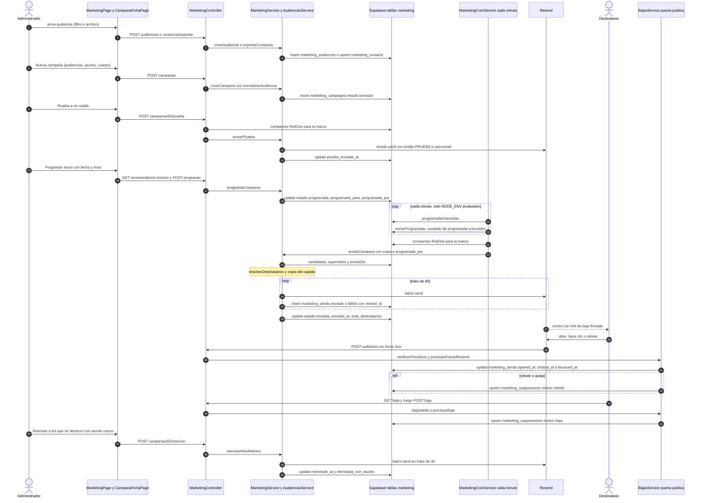

# Flujo: Crear, probar, programar y despachar una campaña

> **Estado: verificado una vez contra el código** (commit 0de0ddb, 11-09-2026). Falta la etapa de completar lo que no quedó escrito. Parte del atlas; índice de flujos en flujos/00_INDICE_DE_FLUJOS.md y del sistema en ../00_MAPA_DEL_SISTEMA.md.

Documento de arquitectura que manda sobre este flujo: `docs/arquitectura/11_MODULO_DE_MARKETING.md` (en adelante, "doc 11"). Pesan sobre todo sus capítulos "Las reglas de fierro", "Audiencias guardadas y el flujo definitivo", "A personas, no a fichas" y "Programar envío + la recomendación de horario". Donde el código y el doc 11 no calzan, se anotan las dos evidencias sin elegir (final de la sección 6). El mapa 09 (`docs/arquitectura/mapa/09_CLIENTES.md`) llama al mapa del módulo `10_MARKETING.md` (mismo directorio `docs/arquitectura/mapa/`, ya escrito y con su propia cabecera de verificado).

## 1. En palabras simples

Solo un administrador entra a Marketing. Lo primero es decidir **a quién** se le escribe. Hay dos formas:

- una **audiencia guardada**: una pregunta sobre la base de Eventia ("empresas que nos compraron") que se recalcula sola cada vez que se usa;
- una **audiencia importada**: una lista fija de correos traída de un archivo.

Después se crea la campaña. Se eligen una o varias audiencias y se escriben el asunto, el título y el cuerpo, con `{nombre}` y `{empresa}` si se quiere personalizar. La campaña queda como **borrador**. Para poder enviarla o programarla, antes **hay que mandarse la prueba a la propia casilla**. Si después se edita el texto, esa prueba deja de valer y hay que repetirla.

Con la prueba hecha se puede apretar "Enviar" o "Programar envío" para un día y una hora. Al programar, la pantalla recomienda un horario según la audiencia. Un reloj del servidor revisa cada minuto y despacha las programadas cuya hora llegó; no depende de que algún computador esté encendido.

Al despachar, el motor:

1. recalcula la audiencia con los datos de ese momento;
2. saca a los dados de baja y a quienes ya recibieron esa campaña;
3. le escribe a cada persona por Resend, en tandas de 40;
4. le manda una copia a quien despachó.

Todo correo lleva su link de baja. Después, Resend avisa quién abrió, quién hizo clic y quién rebotó; un correo que rebota queda bloqueado para siempre, sin que nadie haga nada. Unos días más tarde se puede hacer **una sola** segunda pasada a los que no abrieron, con un asunto distinto.

## 2. El recorrido paso a paso

**Paso 1. Entrar al módulo.** Actúa: administrador.
- Menú "Marketing" en `frontend/src/layout/Sidebar.tsx`: sección `marketing`, precarga `MarketingPage`.
- Rutas `marketing` y `marketing/campana/:id` en `frontend/src/App.tsx`:
  - las dos son `React.lazy`;
  - las dos van envueltas en `PermissionGuard` con `SECTION_ROLES.marketing`, que es `ROLE_GROUPS.ADMIN_ONLY` (`frontend/src/constants/permissions.ts`).
- Motor, `MarketingController` (`api-rest/src/marketing/marketing.controller.ts`):
  - Lleva `@Roles(...ADMIN_ONLY)` en la clase. El comentario lo fecha en la revisión del 26-08: antes, cualquier sesión podía disparar campañas por API.
  - `AuthGuard` deja en `request.user` los campos `{ id, company_id, role, email }`. El perfil se recuerda 1 hora en `cachePerfiles`.
  - `RolesGuard` responde 403 "Tu cargo no tiene permiso para esta función." si el cargo no es administrador.
  - Las rutas `@Public()` (webhook y baja) se saltan los dos guardias.
- `MarketingPage` (`frontend/src/pages/marketing/MarketingPage.tsx`) pide la clave `["marketing","campanas"]`:
  - llama a `getCampanasMarketing` → `GET /marketing/campanas` → `MarketingService.campanas` → `MarketingRepository.campanas`;
  - el repositorio hace `select *` sobre `marketing_campaigns`, filtra por `company_id`, ordena por `created_at desc` y **no pagina**.
- La pestaña elegida se recuerda en `sessionStorage` (`mk.pestana`). La búsqueda y el orden del historial también (`mk.busca`, `mk.sortCol`, `mk.sortDir`).

**Paso 2. La estantería de audiencias.** Actúa: pantalla (pestaña Audiencias, o formulario de nueva campaña abierto).
- Clave `["marketing","audiencias"]`, con `staleTime` de 5 minutos. Solo corre (`enabled`) en la pestaña Audiencias o con `creando` activo. El comentario la llama "LA consulta pesada del módulo".
- `GET /marketing/audiencias` → `MarketingController.audiencias`, que llama en paralelo a cuatro métodos de `AudienciasService` (`api-rest/src/marketing/audiencias.service.ts`):
  - **`listarAudiencias`**:
    - lee `marketing_audiences`, `clients` (`clientesSegmentables`), `quotations` (`cotizacionesSegmentables`), `client_contacts` (`contactosDeClientes`) y `marketing_suppressions` (`suprimidos`);
    - pasa cada guardada por `resolverSegmento` (`api-rest/src/marketing/segmento.ts`) y descuenta las bajas;
    - devuelve además `clientes_con_correo`, que es el conteo del filtro vacío: personas, no fichas.
  - **`audienciasImportadas`**: `marketing_contacts` agrupado por `audiencia`, con las bajas contadas aparte.
  - **`tiposDeCliente`** y **`tiposDeEvento`**: la materia prima de los filtros. Ninguno pagina.
- Tablas: solo lectura.

**Paso 3a. Crear una audiencia guardada (la "pregunta viva").** Actúa: administrador.
- **La previa.** `SegmentoBuilder` (`frontend/src/pages/marketing/SegmentoBuilder.tsx`):
  - espera 350 ms sin cambios y pide la clave `["marketing","segmento-previa", <filtro en JSON>]`;
  - llama a `previaSegmento` → `POST /marketing/segmento/previa` (DTO `PreviaSegmentoDto`).
- **Qué hace el motor.** `AudienciasService.previaSegmento` llama a `resolverSegmentoDe`:
  1. Trae `quotations` solo si el filtro las necesita: estados, tipos de evento, fechas, dormidos, aniversario o monto mínimo.
  2. `resolverSegmento` elige por la historia del **cliente**.
  3. Cada cliente que calza se abre en sus **personas**: todos sus `client_contacts` con correo, o el `clients.email` de la ficha si no tiene ninguno.
  4. Deja una sola fila por correo.
  5. Descuenta los suprimidos y devuelve `total` y `muestra` (hasta 500 filas).
- **Guardar.** "Guardar audiencia" → `crearAudienciaMarketing` → `POST /marketing/audiencias` (`CrearAudienciaDto`) → `AudienciasService.crearAudiencia` → `MarketingRepository.crearAudiencia`.
  - Inserta en `marketing_audiences` las columnas `company_id`, `nombre` y `filtro`.
  - Un nombre repetido choca con el índice `marketing_audiences_unicas` (`company_id, lower(nombre)`, migración 93). Postgres responde 23505 y el motor lo convierte en 400 "Ya existe una audiencia con ese nombre".
- **Pantalla.** Toast y `invalidateQueries({ queryKey: ["marketing"] })`.

**Paso 3b. Importar una audiencia (lista fija).** Actúa: administrador.
- **Leer la lista.** Hay dos formas:
  - elegir un archivo `.txt`, `.csv` o `.xlsx`, que lee `leerArchivoDeContactos`;
  - pegar texto, que `parsearContactos` (dentro de `MarketingPage.tsx`) separa en `correo, nombre, empresa` por línea.
- **Enviar.** "Importar" → `importarContactosMarketing` → `POST /marketing/contactos/importar`.
  - El DTO `ImportarContactosDto` exige `audiencia` de hasta 80 caracteres.
  - `contactos[]` **no tiene tope de cantidad**.
- **Qué hace el motor.** `AudienciasService.importarContactos`:
  1. pasa cada correo a minúsculas y lo valida con una expresión simple;
  2. descarta los repetidos dentro del mismo archivo;
  3. llama a `MarketingRepository.importarContactos`, que hace `upsert` en `marketing_contacts` con `onConflict: 'company_id,audiencia,email'`. Reimportar no duplica: pisa el nombre y la empresa.
- **Respuesta.** `importados`, `duplicados_en_archivo` e `invalidos`.
- **Tabla.** `marketing_contacts`: `company_id`, `audiencia`, `email`, `name`, `empresa`. La columna `datos` (jsonb, migración 91) no la escribe este código.

**Paso 4. Crear la campaña (borrador).** Actúa: administrador en "+ Nueva campaña" (componente `NuevaCampana`, dentro de `MarketingPage.tsx`).
- **Elegir audiencias.** "¿A quién va?" es un `MultiSelect` con buscador.
  - `opcionesDeAudiencias` (`frontend/src/pages/marketing/audienciasDeCampana.ts`) arma las opciones: "Todos los clientes", las guardadas (`g:<id>`) y las importadas (`i:<nombre>`).
  - `unaAudiencia` traduce cada opción:

    | Opción | Se envía como |
    |---|---|
    | "todos" | `{audiencia_tipo:'segmento', filtro:{}, audiencia_ref:'Todos los clientes'}` |
    | `g:<id>` | `{audiencia_tipo:'segmento', audiencia_id}` |
    | `i:<nombre>` | `{audiencia_tipo:'importada', audiencia_ref}` |

  - La pantalla ya no ofrece el tipo `clientes`. El motor lo sigue aceptando.
- **Campos.**
  - Nombre interno, asunto, preencabezado, título y cuerpo.
  - Botoncitos `{nombre}` y `{empresa}` que se insertan donde está el cursor.
- **Marca propia (optativa)**, componente `CampanaMarcaPropia`:
  - El banner se sube con `uploadCampaignBanner`, que llama a `StorageService` con `kind: 'campaign-banner'`. Queda en el balde público `company-logos`, con el nombre `<companyId>_campaign_banner_<ts>.<ext>` (`api-rest/src/storage/storage.service.ts`).
  - El WhatsApp propio se escribe como texto.
- **Guardar.** "Guardar borrador" → `crearCampanaMarketing` → `POST /marketing/campanas`. El DTO es `CrearCampanaDto`, con `audiencias` de 1 a 10.
- **Validar audiencias.** `MarketingService.crearCampana` pasa cada una por `normalizarAudiencia`:
  - importada sin `audiencia_ref` → 400;
  - `clientes` sin tipos → 400;
  - guardada → lee `marketing_audiences` con `audienciaGuardada` y copia su `nombre` y una **foto** de su `filtro`. Si ya no existe → 400 "Una audiencia elegida ya no existe".
- **Insertar.** `MarketingRepository.crearCampana` inserta en `marketing_campaigns`:
  - `company_id`, `nombre`, `asunto`, `titulo`, `cuerpo` y `preencabezado`;
  - `audiencias`: jsonb con la lista completa;
  - las columnas espejo de compatibilidad:
    - `audiencia_tipo` toma el tipo de la primera audiencia;
    - `audiencia_id`, `tipos_cliente` y `filtro` se llenan solo si hay una sola audiencia;
    - `audiencia_ref` junta los nombres con " + " y se corta en 120 caracteres;
  - `banner_url` y `whatsapp`.
  - `estado` queda en su valor por defecto, `'borrador'` (migración 91).
- **Pantalla.** Toast "Campaña guardada como borrador. Mándate la prueba antes de enviar." e invalidación de `["marketing"]`.

**Paso 5. Abrir la ficha de la campaña.** Actúa: administrador pincha la fila del historial, que navega a `/marketing/campana/<id>`.
- `CampanaFichaPage` (`frontend/src/pages/marketing/CampanaFichaPage.tsx`) hace dos consultas.
- **Detalle**, clave `["marketing","campana-detalle",id]` → `GET /marketing/campanas/:id/detalle` → `MarketingService.detalleDe`. Junta tres cosas y calcula los KPIs:
  - la campaña;
  - `destinatariosDetalle`: `marketing_sends`, paginado;
  - `bajasDe`: `marketing_suppressions` con `motivo='baja'` y ese `campaign_id`, sin paginar.
- **Vista del correo**, clave `["marketing","campana-html",id]`, con `staleTime` de 5 minutos → `GET /marketing/campanas/:id/html`:
  - `MarketingController.empresaDe` arma la marca: `CompaniesRepository.findOne` → `marcaDesdeFila` (`api-rest/src/marketing/marca.ts`);
  - `MarketingService.htmlDe` llama a `renderizar` con un destinatario ficticio `vista-previa@eventia`, sin nombre, así que sale "estimado cliente";
  - la pantalla lo muestra en un `iframe` con `sandbox=""` y 600 px de ancho.
- **Tablas.** Solo lectura.

**Paso 6 (opcional). Editar el borrador.** Actúa: administrador, botón "Editar" del recuadro Contenido.
- `EditorDeBorrador` (`frontend/src/pages/marketing/EditorDeBorrador.tsx`) → `editarCampanaMarketing` → `PATCH /marketing/campanas/:id`.
- El DTO `EditarCampanaDto` no incluye `nombre`: el nombre interno no se puede cambiar.
- `MarketingService.editarCampana`:
  1. solo acepta `estado === 'borrador'`;
  2. si vienen audiencias, las normaliza igual que al crear;
  3. llama a `actualizarCampana`, que escribe `asunto`, `titulo`, `cuerpo`, `preencabezado`, `banner_url`, `whatsapp`, las audiencias con sus columnas espejo, y **`prueba_enviada_at = null`**. Editar invalida la prueba (Felipe, 26-08).
- Pantalla:
  - antes de guardar, aviso ámbar;
  - después, toast "La prueba anterior quedó invalidada…" e invalidación de `["marketing"]`.

**Paso 7. La prueba obligatoria.** Actúa: administrador, botón "Prueba a mi casilla".
- **Llamada.** `enviarPruebaCampana` → `POST /marketing/campanas/:id/prueba`.
- **La marca.** `MarketingController.prueba` la arma con `empresaDe`:
  - `companies.findOne` falla con un error distinto de `PGRST116` → 503 "No se pudo cargar la marca de la empresa; intenta de nuevo";
  - la empresa no existe → marca por defecto.
- **El correo.** `MarketingService.enviarPrueba` (no revisa el estado de la campaña):
  1. `renderizar` con `name:'Prueba'` y `empresa:'Prueba'`;
  2. `resend.emails.send` con:
     - `from` = `remitente(marca.nombre)`: `MARKETING_FROM` si existe, si no `"<empresa> <hola@eventi-app.com>"`;
     - `to` = `user.email`;
     - asunto `"[PRUEBA] " + asunto`;
     - cabeceras `List-Unsubscribe` de `BajasService.cabecerasDeBaja`;
     - `replyTo`, si la marca lo tiene.
  3. Si Resend devuelve error → 400 "Resend: …".
- **Tabla.** `marketing_campaigns.prueba_enviada_at = ahora`. No crea filas en `marketing_sends`.
- **Pantalla.** Toast "Prueba enviada a …" e invalidación de `["marketing"]`. Con `prueba_enviada_at` puesto se habilitan "Enviar" y "Programar envío".

**Paso 8. Programar el envío.** Actúa: administrador, botón `BotonProgramar` (`frontend/src/pages/marketing/ProgramarEnvio.tsx`). Está deshabilitado mientras no haya prueba.
- **La recomendación.** Al abrir la ventana se pide la clave `["marketing","recomendacion-horario",id]` (`staleTime` 5 min) → `GET /marketing/campanas/:id/recomendacion-horario` → `MarketingService.recomendacionesDe`:
  1. `MarketingRepository.aperturasPorCampana` lee, sin paginar, las campañas con `estado='enviada'` y sus audiencias, y las filas de `marketing_sends` con `opened_at` no nulo.
  2. Para cada audiencia de esta campaña, `mismaAudiencia` junta las aperturas de campañas pasadas con la misma guardada (`audiencia_id`) o la misma etiqueta (`audiencia_ref`).
  3. Con 30 aperturas o más (`UMBRAL_APERTURAS`), `mejorVentana` entrega el día y el bloque de 2 horas con más aperturas, en hora de Chile.
  4. Con menos, entrega `RECOMENDACION_ESTUDIOS[publicoDeAudiencia(...)]` (`api-rest/src/marketing/programacion.ts`).
- **Fecha y hora en pantalla.**
  - Fecha: `input type="date"`, con mínimo hoy.
  - Hora: `HoraInput`, 10:00 por defecto.
  - La pantalla arma `new Date(fecha + "T" + hora + ":00")` en la **zona horaria del navegador** y exige al menos 60 segundos hacia adelante.
- **Llamada.** "Programar" → `programarCampana(id, cuando.toISOString())` → `POST /marketing/campanas/:id/programar`. El DTO `ProgramarCampanaDto` valida con `@IsISO8601()`.
- **Validaciones.** `MarketingService.programarCampana` responde 400 si:
  - la campaña no es borrador: "Ya está programada: cancela la programación para cambiarla" o "Esa campaña ya se envió";
  - no hay prueba;
  - la fecha no se entiende;
  - la hora es anterior a ahora + 60 segundos.
- **Tabla.** `marketing_campaigns`: `estado='programada'`, `programada_para` (ISO) y `programada_por = user.email`.
- **Pantalla.** Toast con la fecha larga e invalidación de `["marketing"]`. La ficha pasa a mostrar `CajaProgramada`, y la cabecera, el chip "programada · <fecha>".

**Paso 8b. Cancelar la programación.** Actúa: administrador en `CajaProgramada`.
- `cancelarProgramacion` → `DELETE /marketing/campanas/:id/programar` → `MarketingService.cancelarProgramacion`.
- Si la campaña no está programada → 400.
- Tabla: `estado='borrador'`, `programada_para=null`, `programada_por=null`. La prueba se conserva.

**Paso 8c. "Enviar ahora" una campaña programada.** Actúa: administrador en `CajaProgramada`.
1. `preguntarEnvio` → `GET /marketing/campanas/:id/destinatarios`. `destinatariosDe` hace el mismo cálculo del paso 10, sin sumar la copia.
2. `ConfirmInline` pregunta "¿Enviar AHORA a N destinatarios? La programación queda sin efecto.".
3. "Sí, enviar ahora" → `POST /marketing/campanas/:id/enviar`: el mismo paso 10, con la campaña todavía en `estado='programada'`.
- Este `ConfirmInline` no recibe `busy`: el botón sigue activo mientras la llamada está en curso (sección 8).

**Paso 9. El reloj dispara la campaña programada.** Actúa: `MarketingCronService.despacharProgramadas` (`api-rest/src/marketing/marketing-cron.service.ts`), con `@Cron(CronExpression.EVERY_MINUTE)`.
- **Dónde corre.** Solo si `NODE_ENV === 'production'`: `ScheduleModule.forRoot({ cronJobs: process.env.NODE_ENV === 'production' })` en `api-rest/src/app.module.ts`. En el laboratorio las programadas nunca salen solas (doc 11, regla 4 del capítulo "Programar envío").
- **Qué campañas mira.** `MarketingRepository.programadasVencidas` busca en `marketing_campaigns` las filas con `estado='programada'` y `programada_para <= ahora`. **No filtra por empresa, a propósito**: barre todas y cada fila trae su `company_id`.
- **El candado.** Por cada campaña, `tomarProgramada(id, company_id)` ejecuta un único `UPDATE`:
  - pone `estado='borrador'` y `programada_para=null`;
  - solo si la fila sigue con ese `id`, esa empresa y `estado='programada'`;
  - devuelve si logró tomarla (`boolean`, no la fila en sí). Si no la tomó, "otro reloj se la llevó" y el reloj pasa a la siguiente.
  - `programada_por` **no** se limpia.
- **La marca.** `CompaniesRepository.findOne(company_id)`:
  - error distinto de `PGRST116` → se lanza, y la campaña queda en borrador;
  - sin fila → `marcaDesdeFila({ name: 'Eventia' })`.
- **El despacho.** Llama a `MarketingService.enviarCampana(id, company_id, marca, programada_por)` (paso 10).
- **Registro.** Anota en el log "campaña programada N despachada: X ok, Y fallidos", o "falló al dispararse (queda en borrador)". No manda correo ni aviso en pantalla al administrador.

**Paso 10. El despacho (común al botón "Enviar" y al reloj).** Actúa: `MarketingService.enviarCampana` (`api-rest/src/marketing/marketing.service.ts`).
- **Entrada manual.**
  - `CampanaFichaPage` → "Enviar" (deshabilitado sin prueba) → `preguntarEnvio` → `GET .../destinatarios` → confirmación "¿Enviar a N destinatarios?". El "Sí, enviar" se deshabilita con N = 0 y mientras `isPending`.
  - Luego `enviarCampana` → `POST /marketing/campanas/:id/enviar` → `MarketingController.enviar`, que arma la marca con `empresaDe` y pasa `user.email` como `copiaPara`.
1. **Revisar la campaña.** `repo.campana`:
   - no existe → 404;
   - no es `borrador` ni `programada` → 400 "Esa campaña ya se envió";
   - falta `prueba_enviada_at` → 400 "Primero mándate la prueba a tu casilla: sin prueba no hay envío".
2. **Leer, en paralelo:**
   - **`candidatosDe`**: con `audiencias` jsonb, une las listas que da `candidatosDeUna` para cada una. En campañas viejas usa las columnas sueltas. `candidatosDeUna` resuelve según el tipo:
     - importada → `contactosDeAudiencia` (`marketing_contacts` filtrado por `audiencia`);
     - segmento → si tiene `audiencia_id` y la guardada existe, usa **su filtro de hoy**; si no, la foto guardada. En ambos casos pasa por `AudienciasService.resolverSegmentoDe`;
     - clientes (camino viejo) → `clientesPorTipo`, que usa solo `clients.email`.
   - **`suprimidos`**: todas las bajas y rebotes de la empresa, paginado.
   - **`enviosDe(id)`**: los correos que ya tienen fila en `marketing_sends` para esta campaña, estén `enviado` o `fallido`.
3. **Limpiar la lista.** `resolverDestinatarios` (`api-rest/src/marketing/plantilla.ts`):
   - pasa cada correo a minúsculas y exige que tenga `@`;
   - quita los repetidos, los suprimidos y los que ya la recibieron;
   - lista vacía → 400 "La audiencia quedó vacía".
4. **Copia del capitán.** Si `copiaPara` viene y no está en la lista, se agrega al final `{ email, name:null, empresa:null }`. No se revisa si ese correo está suprimido.
5. **Mandar por lotes de 40 (`LOTE`).** Para cada lote:
   - **Armar cada correo.** `renderizar`, por destinatario:
     - `personalizar` en asunto, título, cuerpo y preencabezado: `{nombre}` pasa a "estimado cliente" si falta y `{empresa}` a "su organización";
     - `cuerpoAHtml`: arma párrafos, escapa el HTML y traduce `*negrita*` y `_cursiva_`;
     - el banner y el WhatsApp propios de la campaña pisan los de la marca;
     - `plantillaCampana` recibe:
       - `bajaUrl`, el link de baja firmado de ese destinatario (`BajasService.urlDeBaja`, con `&ca=<campaña>`);
       - `cotizarUrl` = `FRONTEND_URL/public-quotation/<companyId>`;
       - `iconosBase` = `FRONTEND_URL`.
   - **Enviar el lote.** `resend.batch.send(payloads)`. Cada correo lleva `from`, `to`, `subject`, `html`, las cabeceras `List-Unsubscribe` y `List-Unsubscribe-Post`, y el `replyTo` de la marca.
   - **Registrar el lote.** `registrarEnvios` inserta las 40 filas en `marketing_sends`:
     - `company_id`, `campaign_id`, `email`, `name`, `empresa`;
     - `estado`: `enviado` o `fallido`, **para todo el lote a la vez**, según si Resend devolvió error;
     - `error`;
     - `resend_id`, tomado por posición de `data.data[j].id`.
6. **Cerrar la campaña.** `actualizarCampana` escribe:
   - `estado='enviada'` y `enviada_at=ahora`;
   - `total_destinatarios = enviados`: incluye la copia y excluye los fallidos;
   - `programada_para=null`.
7. **Responder.** Devuelve `{ enviados, fallidos }`. La pantalla muestra el toast "Campaña enviada a N destinatarios · M fallidos" e invalida `["marketing"]`. Desde ahí la ficha muestra los KPIs y la tabla de personas.

**Paso 11. Resend avisa aperturas, clics, rebotes y quejas.** Actúa: Resend, llamando a `POST /marketing/webhook`.
- **La puerta.**
  - `@Public()` y `@Throttle` de 1200 llamadas por minuto. Un freno más bajo botaba rebotes reales (barredora del 26-08).
  - `main.ts` usa `rawBody: true` para verificar la firma sobre el cuerpo crudo.
- **La firma.** `BajasService.verificarFirmaSvix` (`api-rest/src/marketing/bajas.service.ts`):
  - sin `RESEND_WEBHOOK_SECRET`: en producción rechaza todo; fuera de producción acepta;
  - con secreto: exige las cabeceras `svix-id`, `svix-timestamp` y `svix-signature`, admite ±300 segundos de diferencia y compara el HMAC-SHA256 en tiempo constante;
  - firma inválida → responde `{ ok:false }` con código HTTP de éxito y anota un aviso en el log.
- **Los sellos.** `BajasService.procesarEventoResend` traduce cada evento:

  | Evento de Resend | Sello en `marketing_sends` |
  |---|---|
  | `email.opened` | `opened_at=ahora` |
  | `email.clicked` | `clicked_at=ahora` y `opened_at=ahora` |
  | `email.bounced` o `email.complained` | `bounced_at=ahora` |
  | cualquier otro | se ignora |

- **Dónde se escriben.** `MarketingRepository.marcarEvento(resend_id, sello)` hace `UPDATE marketing_sends … WHERE resend_id` y devuelve `company_id`, `email` y `campaign_id`. Si ese id no está en la tabla, no pasa nada: es el caso de la prueba, del reenvío y de los correos de cotizaciones o del embudo.
- **Rebote o queja.** Si hubo `bounced_at` y la fila existía, se llama a `suprimir(company_id, email, 'rebote', campaign_id)`: un `upsert` en `marketing_suppressions` con `onConflict: 'company_id,email'` e `ignoreDuplicates: true`.
- **Efecto hacia otro flujo.** El clic en "Cotiza aquí" lleva al formulario público `/public-quotation/:company_id`, que es el flujo `01_CONSULTA_PUBLICA_A_COTIZACION.md`.

**Paso 12. El destinatario se da de baja.** Actúa: persona externa, sin sesión.
- **Primer tiempo: confirmar (GET).**
  1. El link del pie "Dejar de recibir estos correos" abre `GET /marketing/baja?c=<empresa>&e=<correo en base64url>&t=<firma>&ca=<campaña>`. Es `@Public`, con freno de 10 llamadas por minuto.
  2. `BajasService.bajaValida` recalcula el HMAC sobre `companyId|correo` con `MARKETING_BAJA_SECRET` (respaldo: `RESEND_API_KEY`) y lo compara en tiempo constante.
  3. Si no calza → "El enlace no es válido.".
  4. Si calza, **solo muestra** una página con el botón "Sí, darme de baja" (un formulario POST). El GET no da de baja: los escáneres corporativos abren todos los links (revisión 26-08).
- **Segundo tiempo: ejecutar (POST).** `POST /marketing/baja`, la misma ruta que usan Gmail y Outlook con `List-Unsubscribe-Post`:
  - `BajasService.procesarBaja` → `suprimir(companyId, email, 'baja', campaignId)`;
  - responde "Listo: no recibirás más correos de este tipo. Puedes cerrar esta página.".
- **Tabla.** `marketing_suppressions`: `company_id`, `email` en minúsculas, `motivo='baja'`, `campaign_id`. Si el correo ya estaba suprimido, no cambia nada.

**Paso 13. Revisar los resultados.** Actúa: administrador en la ficha.
- `detalleDe` (paso 5) calcula:
  - `enviados`;
  - `entregados` = enviados − rebotes;
  - tasas de apertura y de clics, sobre entregados;
  - CTOR (clics sobre aperturas);
  - rebotes, reenviados y bajas.
- La tabla de personas se filtra en pantalla: Todos, Abrieron, Clicaron, Sin abrir, Rebotes. El filtro elegido se recuerda en `sessionStorage` (`mk.ficha.<id>.filtro`).
- Los sellos del webhook aparecen recién cuando la consulta se vuelve a pedir: después de los 30 s de `staleTime` global, al volver a la pestaña o al volver a entrar a la ficha. No hay refresco periódico.

**Paso 14. La segunda pasada: "Reenviar a los que no abrieron".** Actúa: administrador.
- **Cuándo aparece el botón.** La campaña está `enviada`, no tiene `reenviada_con_asunto`, y alguna fila no tiene apertura ni rebote.
- **Abrir el modal.** `abrirReenvio` → `GET /marketing/campanas/:id/sin-abrir` → `MarketingService.sinAbrirDe`: filas de `marketing_sends` con `estado='enviado'` y `opened_at`, `bounced_at` y `reenviado_at` nulos, menos los suprimidos. El modal muestra:
  - el conteo;
  - la guía de 2 a 7 días: ámbar si es antes, verde dentro de la ventana, gris si es después. No bloquea;
  - el asunto prellenado "¿Lo viste? <asunto>".
- **Validaciones.** "Reenviar a N" → `POST /marketing/campanas/:id/reenviar` (`ReenviarDto`) → `MarketingService.reenviarANoAbiertos`, que responde 400 si:
  - la campaña no está enviada;
  - ya tuvo su segunda pasada ("el máximo sano son 2 envíos");
  - no queda nadie sin abrir;
  - `validarAsuntoDeReenvio` rechaza el asunto: vacío, o igual al original sin contar mayúsculas ni espacios.
- **El envío.**
  - Lotes de 40 con `resend.batch.send`, la marca de hoy y el mismo `renderizar`, pero con el asunto nuevo. `{empresa}` sale de `marketing_sends.empresa` (migración 97).
  - Después de cada lote exitoso, `marcarReenviados(ids)` pone `marketing_sends.reenviado_at=ahora`.
  - Si Resend devuelve error → 400 y el reenvío se corta.
- **Al terminar.** `marketing_campaigns.reenviada_con_asunto = asunto`.
- **Lo que no hace.** No manda copia del capitán y **no guarda el `resend_id`** de los correos reenviados.

## 3. Diagrama

## 4. Datos que cambian

| Tabla | Columnas | En qué paso | Quién escribe |
|---|---|---|---|
| `marketing_audiences` | insert: `company_id`, `nombre`, `filtro` | 3a | `AudienciasService.crearAudiencia` → `MarketingRepository.crearAudiencia` |
| `marketing_contacts` | upsert: `company_id`, `audiencia`, `email`, `name`, `empresa` | 3b | `AudienciasService.importarContactos` → `MarketingRepository.importarContactos` |
| Storage, balde `company-logos` | objeto `<companyId>_campaign_banner_<ts>.<ext>` (público) | 4 y 6 (optativo) | `StorageService`, `kind: 'campaign-banner'` |
| `marketing_campaigns` | insert: `company_id`, `nombre`, `asunto`, `titulo`, `cuerpo`, `preencabezado`, `audiencias`, `audiencia_tipo`, `audiencia_id`, `audiencia_ref`, `tipos_cliente`, `filtro`, `banner_url`, `whatsapp`; `estado` por defecto `borrador` | 4 | `MarketingService.crearCampana` → `MarketingRepository.crearCampana` |
| `marketing_campaigns` | update de contenido y audiencias, y `prueba_enviada_at = null` | 6 | `MarketingService.editarCampana` |
| `marketing_campaigns` | `prueba_enviada_at` | 7 | `MarketingService.enviarPrueba` |
| `marketing_campaigns` | `estado='programada'`, `programada_para`, `programada_por` | 8 | `MarketingService.programarCampana` |
| `marketing_campaigns` | `estado='borrador'`, `programada_para=null`, `programada_por=null` | 8b | `MarketingService.cancelarProgramacion` |
| `marketing_campaigns` | `estado='borrador'`, `programada_para=null` (`programada_por` queda) | 9 | `MarketingRepository.tomarProgramada`, llamado por `MarketingCronService` |
| `marketing_sends` | insert: `company_id`, `campaign_id`, `email`, `name`, `empresa`, `estado`, `error`, `resend_id` | 10 | `MarketingService.enviarCampana` → `MarketingRepository.registrarEnvios` |
| `marketing_campaigns` | `estado='enviada'`, `enviada_at`, `total_destinatarios`, `programada_para=null` | 10 | `MarketingService.enviarCampana` → `actualizarCampana` |
| `marketing_sends` | `opened_at`, `clicked_at`, `bounced_at` | 11 | `BajasService.procesarEventoResend` → `MarketingRepository.marcarEvento` |
| `marketing_suppressions` | upsert: `company_id`, `email`, `motivo='rebote'`, `campaign_id` | 11 | `BajasService.procesarEventoResend` → `MarketingRepository.suprimir` |
| `marketing_suppressions` | upsert: `company_id`, `email`, `motivo='baja'`, `campaign_id` (nulo en links viejos) | 12 | `BajasService.procesarBaja` → `MarketingRepository.suprimir` |
| `marketing_sends` | `reenviado_at` | 14 | `MarketingService.reenviarANoAbiertos` → `MarketingRepository.marcarReenviados` |
| `marketing_campaigns` | `reenviada_con_asunto` | 14 | `MarketingService.reenviarANoAbiertos` |

Solo se leen, nunca se escriben: `clients`, `client_contacts`, `quotations`, `companies` y `users` (este último vía `AuthGuard`). Es la regla de fierro 1 del doc 11.

## 5. Efectos automáticos y colaterales

**Correos que salen (todos por Resend, desde `MarketingService`)**

| Correo | Destinatario | Cuándo | Detalle |
|---|---|---|---|
| Prueba | `user.email` | paso 7 | 1 correo, asunto con prefijo `[PRUEBA]`. No se registra en `marketing_sends` |
| Campaña | cada persona de la lista, en lotes de 40 | paso 10 | Cabeceras `List-Unsubscribe` + `List-Unsubscribe-Post: List-Unsubscribe=One-Click`, y `replyTo` desde `companies.notifications.replyTo` |
| Copia del capitán | quien apretó "Enviar" (`user.email`) o quien programó (`programada_por`) | paso 10 | Entra como una fila más de `marketing_sends` y cuenta en los KPIs |
| Segunda pasada | los que no abrieron | paso 14 | Asunto nuevo, sin copia |

- Las respuestas de los destinatarios llegan a la casilla de "Responder a" (Configuración → Notificaciones), no al dominio de envío: `marcaDesdeFila` lee `notifications.replyTo`.
- El remitente es `MARKETING_FROM`. Si esa variable no está puesta, se usa `"<empresa> <hola@eventi-app.com>"`: la deuda anotada en la regla 5 del doc 11.

**Relojes**
- `MarketingCronService.despacharProgramadas` corre cada minuto, **solo en producción**.
  - No trae un candado propio contra corridas que se pisen. Si una corrida dura más de un minuto, la siguiente puede empezar igual; lo que evita que tome la misma campaña es `tomarProgramada`.
  - No hay reintentos: un fallo deja la campaña en borrador y el error solo en el log.

**Supresiones automáticas por webhook**
- Un rebote (`email.bounced`) o una queja (`email.complained`) de un correo con `resend_id` conocido crea una supresión con motivo `rebote`.
- Desde ese momento, ninguna campaña de esa empresa le vuelve a escribir a ese correo, porque `resolverDestinatarios` descuenta `suprimidos`.

**Cascadas en la base**
- Borrar una campaña borrador (`MarketingService.borrarCampana`) borra sus `marketing_sends`, por el `ON DELETE CASCADE` de la migración 91.
- Borrar una audiencia guardada deja `marketing_campaigns.audiencia_id` en `NULL` (`ON DELETE SET NULL`, migración 93).
  - Eso afecta **solo la columna espejo**, no el jsonb `audiencias`.
  - Al despachar, `audienciaGuardada` no la encuentra y se usa la foto del filtro.
- Borrar o renombrar una audiencia importada (`borrarImportada`, `renombrarImportada`) no toca las campañas que la nombran: esas quedan apuntando a un nombre vacío (sección 8). Las supresiones no se tocan nunca: "una baja es para siempre" (`MarketingRepository.borrarImportada`).
- `marketing_suppressions.campaign_id` no tiene llave foránea (migración 98): la atribución sobrevive aunque se borre la campaña.

**Otros módulos que usan piezas de este flujo**
- `plantillaCampana` (`api-rest/src/marketing/plantilla.ts`) y `marcaDesdeFila` (`api-rest/src/marketing/marca.ts`) también arman el correo del embudo de consultas (`api-rest/src/consultas/consultas.service.ts`) y el correo de envío de cotizaciones (`api-rest/src/quotations/envio-cotizacion.service.ts`). Los dos la llaman sin `bajaUrl` ni `cotizarUrl`.
- `esClaro` y `textoSobre` los usa `api-rest/src/quotations/correo-cotizacion.ts`.
- `MARKETING_BAJA_SECRET` lo comparte la impresión de cotizaciones: HMAC "con el mismo secreto de las bajas de marketing", según `docs/arquitectura/13_ENVIO_DE_COTIZACIONES.md` y el mapa `02_NEGOCIO_ENVIO_Y_SEGUIMIENTO.md`.
- El botón "Cotiza aquí" de cada correo abre el flujo `01_CONSULTA_PUBLICA_A_COTIZACION.md`.

**Cachés de la app (React Query, `frontend/src/lib/queryClient.ts`)**

Política global: `staleTime` 30 s, `gcTime` 30 min, `refetchOnWindowFocus` activo y `retry: 2` en las consultas.

| Clave | `staleTime` | Qué la invalida |
|---|---|---|
| `["marketing","campanas"]` | 30 s | toda mutación del módulo (prefijo `["marketing"]`) |
| `["marketing","audiencias"]` | 5 min (`MarketingPage` y `EditorDeBorrador`) | crear, borrar o renombrar audiencias, importar, sacar un contacto |
| `["marketing","segmento-previa", filtro]` | 30 s | prefijo `["marketing"]` |
| `["marketing","ver-audiencia", tipo, nombre]` | 30 s | prefijo `["marketing"]`. Clave propia a propósito: compartirla con la previa dejaba la pantalla en blanco (comentario en `VerAudiencia`, barredora 26-08) |
| `["marketing","campana-detalle", id]` | 30 s | prueba, editar, programar, cancelar, enviar, reenviar |
| `["marketing","campana-html", id]` | 5 min | prefijo `["marketing"]` |
| `["marketing","recomendacion-horario", id]` | 5 min | prefijo `["marketing"]` |

Lo que queda desactualizado, porque nada lo invalida:
- **Lo que hace el reloj.** Una ficha abierta sigue mostrando "programada" con el botón "Enviar ahora" hasta el próximo refetch (foco o 30 s al remontar). No hay polling.
- **Los sellos del webhook.** Aperturas, clics, rebotes y bajas llegan sin tocar la pantalla.
- **Cambios de marca en Configuración.** No invalidan `["marketing","campana-html", id]`. Y "el correo que salió" **se vuelve a pintar con la marca de hoy**: no es una copia congelada de lo que efectivamente llegó (`MarketingService.htmlDe`).
- **Clientes nuevos o editados en el CRM.** Los conteos de `["marketing","audiencias"]` tardan hasta 5 minutos en reflejarlos. El despacho igual recalcula al momento.
- **El correo del usuario.** `AuthGuard` recuerda el perfil 1 hora (`cachePerfiles`), y de ahí salen el destino de la prueba y `programada_por`. Según su comentario, `users.service` lo olvida al editar el usuario.

**Lo que NO pasa**
- No hay notificación en la app ni correo al administrador cuando una campaña programada falla. Solo queda el log de Railway.
- Una baja o un rebote de marketing **no** frena los correos de cotizaciones ni del embudo: `marketing_suppressions` no se lee fuera de `api-rest/src/marketing` (búsqueda de `marketing_` en `api-rest/src` sin resultados en otros módulos).
- Marketing no escribe en `clients` ni en `quotations`.

## 6. Reglas de negocio que gobiernan el flujo

1. **Solo administrador.**
   - Frontend: `SECTION_ROLES.marketing = ROLE_GROUPS.ADMIN_ONLY`.
   - Backend: `@Roles(...ADMIN_ONLY)` en `MarketingController`, puesto en la revisión del 26-08 porque "cualquier sesión podía exportar correos o disparar campañas por API".
2. **Marketing lee el CRM, jamás le escribe** (doc 11, regla 1). El repositorio escribe solo en tablas `marketing_*`.
3. **Baja obligatoria** (doc 11, regla 2, "ley chilena de correos comerciales").
   - `plantillaCampana` pone la línea de baja cuando recibe `bajaUrl`, y el despacho siempre se la pasa.
   - `BajasService.cabecerasDeBaja` agrega el estándar de un clic.
   - La baja va en dos tiempos (GET confirma, POST ejecuta) desde la revisión del 26-08, porque "los escáneres de seguridad corporativos (Outlook SafeLinks y compañía) abren todos los links".
4. **Regla de una vez por correo** (doc 11, regla 3). Tres candados:
   - el índice único `marketing_sends_una_vez` sobre `(campaign_id, lower(email))` (migración 91);
   - `enviosDe` + `resolverDestinatarios`;
   - la unión de varias audiencias se deduplica: "quien está en dos audiencias recibe UN solo correo" (`MarketingService.candidatosDe`, 27-08).
5. **Sin prueba no hay envío** (doc 11, regla 4).
   - Se exige en `enviarCampana` y en `programarCampana`.
   - Editar invalida la prueba: "'sin prueba no hay envío' vale para la versión REAL del correo" (`editarCampana`, Felipe 26-08).
6. **Reputación separada** (doc 11, regla 5). `MARKETING_FROM`, con respaldo al dominio actual anotado como deuda (`MarketingService.remitente`).
7. **Sin editor libre** (doc 11, regla 6). La plantilla de la casa lleva campos fijos y dos botones por defecto: "Cotiza aquí" al formulario público ("decisión de Felipe 25-08", `urlDeCotizar`) y WhatsApp.
8. **La audiencia es una pregunta viva** ("si mañana entran 2 que calzan, quedan adentro solos", doc 11). Al despachar manda el filtro **de hoy** de la guardada, y la foto queda solo de respaldo (`candidatosDeUna`).
9. **A personas, no a fichas** (doc 11, 26-08).
   - El filtro decide por cliente y se escribe a cada `client_contacts` con correo. Si el cliente no tiene contactos con correo, se usa el correo de la ficha (`resolverSegmento`).
   - `{nombre}` es la persona y `{empresa}` el cliente.
10. **La copia del capitán** (Felipe 26-08, commit 38a32f6): "toda campaña real le llega también a quien la despachó, registrada como un enviado más". Si la despachó el reloj, le llega a quien la programó (doc 11, regla 2 del capítulo "Programar envío").
11. **Programar exige lo mismo que enviar**: borrador, prueba hecha y hora futura (doc 11, capítulo "Programar envío", regla 1, "ok vamos" del 04-09).
    - El código pide al menos 60 s de anticipación.
    - Una programada no se edita; para editarla hay que cancelar la programación.
12. **Ruta B: el reloj del motor, no el `scheduled_at` de Resend.** Motivo del doc 11: "el batch de Resend no acepta programación", y partir el despacho en dos caminos "duplicaría el flujo ya validado".
13. **Candado atómico y cero reintentos silenciosos** (doc 11, reglas 2 y 3 del capítulo; `tomarProgramada`).
14. **Crones solo en producción** (`app.module.ts`, doc 11 regla 4 del capítulo). El disparo real se valida "en producción con una campaña a una audiencia de una sola persona (el propio Felipe)".
15. **La recomendación de horario es por audiencia** (regla de Felipe, doc 11):
    - con 30 aperturas propias o más, manda el dato medido;
    - si no, público de oficina "Martes o jueves, 9:30–11:00" y público de casa "Martes a jueves, 17:00–19:00";
    - una mezcla de tipos o una audiencia sin señales cae en casa (`publicoDeAudiencia`);
    - "el paseo de curso lo cotiza el apoderado, no el colegio" (comentario de `programacion.ts`).
16. **Segunda pasada** (doc 11, Fase 2 y punto 5 de "Audiencias guardadas"):
    - solo sobre enviadas;
    - solo no abiertos, no rebotados, no suprimidos y no reenviados;
    - asunto nuevo obligatorio y distinto (`validarAsuntoDeReenvio`);
    - **máximo 2 envíos por campaña**: "Una tercera va justo al grupo menos interesado: suben los reclamos de spam y eso quema la reputación del remitente" (Felipe 26-08, commit 64a049a);
    - la guía de 2 a 7 días solo orienta: no bloquea.
17. **El rebote duro o la queja suprimen solos** (doc 11, Fase 2; `procesarEventoResend`).
18. **Las enviadas son registro histórico**: no se editan ni se borran ("es el registro de lo que salió", `editarCampana` y `borrarCampana`).
19. **Webhook cerrado en producción sin secreto**, con ±5 min anti-replay (revisión 26-08, `verificarFirmaSvix`).
20. **Lotes de 40**: "Lote del batch de Resend: hasta 100 por llamada; 40 deja aire" (`LOTE` en `marketing.service.ts`).
21. **Toda lectura sin tope conocido se pagina**, porque Supabase corta en 1000 filas. Es una lección ya pagada (`MarketingRepository.todas`, revisión 26-08). Con más de 1000 bajas truncadas, "se les volvería a escribir a personas que se dieron de baja" (`suprimidos`).
22. **Sin marca no hay despacho**: si falla la consulta de la empresa se corta, en vez de enviar "toda la campaña con marca genérica y sin replyTo" (`empresaDe`, revisión 26-08; el reloj hace lo mismo).
23. **Banner y WhatsApp propios de la campaña mandan sobre la marca**, en un solo punto que "cubre prueba, envío, segunda pasada y vista" (`renderizar`, Felipe 28-08).

**Donde el doc 11 y el código no calzan (se anotan ambas evidencias)**

| Tema | Doc 11 dice | El código hace |
|---|---|---|
| Selector de audiencias | "un solo selector (`SelectWithSearch` con grupos)" | `NuevaCampana` y `EditorDeBorrador` usan `MultiSelect` con buscador y varias audiencias. El doc 11 no menciona la selección múltiple en ninguna parte (verificado: no hay "múltiple", "MultiSelect" ni "99" en el archivo); el cambio del 27-08 solo queda documentado en el comentario de `docs/migrations/99_campana-multiaudiencia.sql`, fuera del doc 11 |
| Botón del correo | Fase 1: "título, cuerpo, botón"; "botón opcional" | No hay botón configurable. Las columnas `boton_texto` y `boton_url` (migración 91) no las usa nadie, y la plantilla trae botones fijos ("Cotiza aquí" y WhatsApp) |
| Webhook sin secreto | Fase 2: "sin él procesa igual" | En producción rechaza todo sin `RESEND_WEBHOOK_SECRET` (`verificarFirmaSvix`, revisión 26-08). Fuera de producción sí procesa |
| "Programación limpia" al fallar | "la campaña vuelve a borrador con su programación limpia" | `tomarProgramada` pasa a borrador ANTES de despachar (también cuando el despacho sale bien) y limpia `programada_para`, pero **no** `programada_por` |
| Rebote "duro" | "el rebote duro o queja suprime solo" | El código suprime ante cualquier evento `email.bounced` y ante `email.complained`, sin mirar el tipo de rebote. La queja queda con motivo `rebote` |
| Contadores en la fila | Fase 2: "contadores en la fila de la campaña (👁 · 🔗 · ↩)" | El historial muestra N°, fecha, campaña, audiencia, destinatarios y estado. Los indicadores viven en la ficha (`CampanaFichaPage`, 26-08) |

## 7. Si cambias algo en este flujo

1. **Si cambias** el orden de las rutas del controlador y pones `audiencias/:id` antes de `audiencias/importada`, **pasa** que borrar o renombrar una importada busca la audiencia `NaN`, **porque** "importada" calza en `:id`. Evidencia: comentario "OJO CON EL ORDEN" en `MarketingController.borrarImportada` y "ANTES de :id por el orden" en `renombrarImportada`.

2. **Si cambias** la baja para que el GET la ejecute, **pasa** que se da de baja gente sin querer, **porque** los escáneres corporativos abren todos los links del correo. Evidencia: comentario "DOS TIEMPOS (revisión 26-08)" en `MarketingController.bajaConfirmar`, commit 6773cff.

3. **Si cambias** `MarketingRepository.todas`, quitas el `.order('id')` de una consulta paginada o agregas una lectura masiva sin paginar, **pasa** que los conteos y envíos quedan cortos en silencio y se les escribe a desuscritos, **porque** Supabase corta en 1000 filas y sin orden estable las páginas repiten o saltan filas. Evidencia: comentarios de `todas` y `suprimidos`, commit 1732e62 ("con >1000 bajas truncadas se les escribia a desuscritos").

4. **Si cambias** el `@Throttle` del webhook a un número bajo, **pasa** que se pierden rebotes reales (y con ellos las supresiones), **porque** una campaña de cientos dispara cientos de avisos en el primer minuto y un 429 los bota. Evidencia: comentario sobre `@Throttle` en `MarketingController.webhook`, commit 1732e62.

5. **Si cambias** `personalizar` para que escape HTML, **pasa** que el asunto muestra `&amp;`, **porque** el asunto es texto plano y los sumideros HTML (título, cuerpo, preencabezado) ya escapan. Evidencia: comentario de `personalizar` en `plantilla.ts`, commit 1732e62 ("Fuera el doble escape").

6. **Si cambias** `plantillaCampana`, **pasa** que cambian también el correo del embudo de consultas y el de envío de cotizaciones. Además, volver a `div` con `max-width` rompe Outlook de escritorio, **porque**:
   - las tres piezas la importan;
   - Outlook dibuja con el motor de Word, que ignora `max-width` y el fondo de un `div`.

   Evidencia: imports en `consultas.service.ts` y `envio-cotizacion.service.ts`; comentario "TODO EN TABLAS, POR OUTLOOK DE ESCRITORIO (Felipe, 10-09-2026)", commit f92be99; pruebas "la estructura va en TABLAS" y "los botones son celdas con mso-padding-alt" en `audiencias-y-reenvio.spec.ts`.

7. **Si cambias** los índices únicos de `marketing_contacts` o `marketing_suppressions` a una fórmula como `lower(email)`, **pasa** que los `upsert` fallan con 42P10, **porque** el `onConflict` se declara por columnas y Postgres no reconoce el índice por fórmula como el mismo candado. Evidencia: `docs/migrations/94_indices_upsert_marketing.sql`.

8. **Si creas** una tabla nueva del módulo por SQL sin `GRANT ... TO service_role`, **pasa** que todo responde 42501 "permission denied", **porque** las tablas creadas por SQL directo no heredan los permisos del rol del backend. Evidencia: comentario "PERMISOS (25-08, aprendido a golpe en el laboratorio)" en `91_modulo_marketing.sql`.

9. **Si cambias** `BajasService.baseApi()` para que su respaldo apunte a un dominio fijo, **pasa** que los links de baja de un ambiente llevan a otro, **porque** así fue: "el enlace de baja del laboratorio llevaba a una puerta inexistente". Evidencia: comentario de `baseApi`, commit ee6670f.

10. **Si cambias** `empresaDe` o el reloj para usar la marca por defecto cuando falla `companies.findOne`, **pasa** que una campaña completa sale con marca genérica y sin `replyTo`, y las respuestas se pierden, **porque** el error transitorio se confunde con "no hay empresa". Evidencia: comentarios en `MarketingController.empresaDe` y `MarketingCronService.despacharProgramadas` (revisión 26-08).

11. **Si cambias** `tomarProgramada` (por ejemplo, tomar la campaña DESPUÉS de despachar o sin `.eq('estado','programada')`), **pasa** que dos corridas del reloj, o dos réplicas, despachan la misma campaña. Si además dejas la campaña en `programada` cuando falla, se reintenta cada minuto para siempre, **porque** el `UPDATE` condicionado es el único candado y el fallo se detecta solo por log. Evidencia: `MarketingRepository.tomarProgramada` y doc 11, reglas 2 y 3 del capítulo.

12. **Si cambias** el orden dentro de `enviarCampana` (marcar `enviada` antes del loop, o registrar en `marketing_sends` antes de llamar a Resend), **pasa** que:
    - un corte a mitad deja la campaña "enviada" sin haber salido; o
    - quedan filas `enviado` de correos que Resend nunca recibió;

    **porque** la regla de una vez se apoya en esas filas (`enviosDe`). Evidencia: `MarketingService.enviarCampana`.

13. **Si cambias** `resolverSegmento` y quitas la deduplicación por correo, **pasa** que la previa y la estantería muestran más personas de las que el envío despacha, **porque** `resolverDestinatarios` sí deduplica al enviar. Evidencia: comentario "UNA VEZ POR CORREO desde la fuente (revisión 26-08)" en `segmento.ts`; prueba "el mismo correo en dos lugares cuenta UNA sola vez" en `segmento.spec.ts`.

14. **Si cambias** el alias `'anulada'` → `'cancelada'`, **pasa** que los filtros guardados antes del 26-08 dejan de calzar con cualquier cotización, **porque** `'anulada'` no existe como estado real. Evidencia: comentario de `FiltroSegmento.con_estados` en `segmento.ts`; prueba "'cancelada' filtra de verdad, y el alias viejo 'anulada' significa lo mismo".

15. **Si cambias** `marketing_sends.empresa` o dejas de guardarla, **pasa** que la segunda pasada saluda "en Sandra Saez tenemos…", **porque** `{empresa}` del reenvío sale de esa columna. Evidencia: `docs/migrations/97_empresa_en_envios.sql`; `reenviarANoAbiertos`.

16. **Si cambias** `MARKETING_BAJA_SECRET`, **pasa** que todos los links de baja ya enviados responden "El enlace no es válido." y, según el doc 13, también cambia la firma de la impresión de cotizaciones, **porque** el HMAC se calcula con ese secreto (o con `RESEND_API_KEY` si no está). Evidencia: `BajasService.secreto` y `firmaDeBaja`; `docs/arquitectura/13_ENVIO_DE_COTIZACIONES.md`.

17. **Si agregas** un estado nuevo a la campaña, **pasa** que la base lo rechaza y la pantalla lo pinta como borrador, **porque**:
    - el `CHECK` de la migración 103 solo admite `borrador`, `programada` y `enviada`;
    - los chips de `MarketingPage` y `CampanaFichaPage` caen en "Borrador" por defecto.

    Evidencia: `docs/migrations/103_campana-programada.sql`; ternarios de estado en ambos componentes.

18. **Si agregas** lógica a `marketing.service.ts` (729 líneas) o a `CampanaFichaPage.tsx` (698), **pasa** que el portero del CI puede frenar el commit, **porque** la cantidad de archivos de más de 800 líneas no puede crecer. Ya dos veces se tuvo que extraer una pieza "higuera" (`bajas.service.ts` el 26-08, `audiencias.service.ts` y `EditorDeBorrador` el 28-08). `MarketingPage.tsx` ya tiene 1279 líneas. Evidencia: CLAUDE.md, sección del portero; commits 62346fa y f525e43.

19. **Si cambias** el cálculo de la hora en `BotonProgramar` o el uso de `toISOString()`, **pasa** que la campaña sale a otra hora, **porque** la hora se interpreta en la zona del navegador y el motor compara instantes absolutos (`programadasVencidas` con `lte` contra `new Date().toISOString()`). Evidencia: `ProgramarEnvio.tsx` y `MarketingRepository.programadasVencidas`.

## 8. Casos borde y estados raros

Todos salen de leer el código; ninguno se reprodujo en vivo.

**Dos despachos a la vez de la misma campaña**

1. **"Enviar ahora" contra el reloj.**
   - Mientras corre un despacho manual de una programada, la campaña sigue en `estado='programada'` con `programada_para` puesto: `enviarCampana` recién los cambia al final.
   - Si en ese rato llega la hora, el reloj la encuentra, `tomarProgramada` la toma y lanza un segundo `enviarCampana` en paralelo.
   - Los dos calcularon la lista con la misma foto de `enviosDe`, así que Resend recibe correos duplicados.
   - El índice único rechaza el `insert` del segundo despacho recién después de que Resend ya los mandó.
2. **Doble clic en "Sí, enviar ahora".**
   - En el recuadro de una programada, el `ConfirmInline` no recibe `busy` (`CampanaFichaPage`), así que el botón sigue activo mientras la llamada está en curso.
   - Un doble clic lanza dos `POST .../enviar`.
   - En el borrador, en cambio, "Sí, enviar" se deshabilita con `enviar.isPending`.
3. **Dos administradores, o dos pestañas, que envían a la vez.**
   - No hay candado en memoria (el envío de cotizaciones sí tiene `enviosEnCurso` en `envio-cotizacion.service.ts`).
   - Pasa lo mismo del caso 1: salen duplicados y el segundo termina en error por el índice `marketing_sends_una_vez`.
4. **La programada queda "borrador" mientras el reloj la despacha.**
   - `tomarProgramada` la deja en borrador antes de empezar. Si alguien abre o refresca la ficha en ese rato, ve "Prueba", "Programar", "Enviar", "Editar" y "Eliminar" habilitados.
   - **Enviar** → despacho paralelo (caso 1).
   - **Eliminar** → el `CASCADE` borra los envíos ya registrados, y el siguiente `insert` falla por la llave foránea. Los correos salieron sin registro.
   - **Editar** → pone `prueba_enviada_at=null` y cambia audiencias. No afecta al despacho en curso, que ya leyó la campaña, pero al final la campaña queda "enviada" con un contenido que no fue el que salió.
5. **Ficha vieja después de la hora programada.** Sin refetch, la ficha sigue mostrando "programada" y "Enviar ahora". Al apretarlo:
   - si el reloj ya está despachando (estado `borrador`), empieza un despacho paralelo;
   - si ya terminó, el motor responde 400 "Esa campaña ya se envió".

**Fallas a mitad de camino**

6. **Resend rechaza un lote.**
   - Las 40 filas quedan `fallido` y el loop sigue con el lote siguiente.
   - Al final la campaña queda `enviada`, aunque todos los lotes hayan fallado (`total_destinatarios = 0`).
   - Los fallidos no se pueden reintentar: la campaña ya no es borrador, y `enviosDe` los cuenta como "ya enviados".
   - Con el modo de validación por defecto del SDK (el código no pasa `batchValidation`), un solo correo problemático puede tumbar el lote entero. El registro no distingue.
7. **Resend aceptó el lote pero el `insert` en `marketing_sends` falló** (red o base).
   - La excepción corta el despacho y la campaña queda como estaba (borrador o programada).
   - Esos 40 correos salieron sin fila. Si se vuelve a enviar, les llegan de nuevo.
8. **Todo salió y se registró, pero falló el `actualizarCampana` final.**
   - La campaña queda en borrador con todos sus envíos registrados.
   - Cada nuevo intento responde "La audiencia quedó vacía", porque `enviosDe` excluye a todos y la validación de lista vacía corre antes de sumar la copia.
   - La ficha tampoco muestra la tabla de personas, que solo aparece con `estado='enviada'`.
   - Queda trabada sin salida desde la pantalla.
9. **El reloj falla** (audiencia vacía, error de marca, error de Resend a nivel de cliente): la campaña queda en borrador, con `programada_por` todavía puesto y la prueba vigente. El administrador no recibe aviso; lo descubre al mirar la ficha.
10. **El reenvío falla a mitad.** Los lotes ya marcados con `reenviado_at` no se repiten, y `reenviada_con_asunto` sigue nulo, así que se puede reintentar. Si Resend aceptó un lote y falló `marcarReenviados`, ese lote se reenvía de nuevo.
11. **Ruta HTTP larga.**
    - `frontend/src/services/api.ts` no configura `timeout`, y la pantalla espera todo el despacho, que es secuencial y de 40 en 40.
    - Si un proxy corta antes, la pantalla muestra error mientras el motor sigue enviando.
    - Si el usuario reintenta, cae en el caso 3.

**Audiencias que cambian después de crear la campaña**

12. **Importada renombrada o borrada.** La campaña guarda el nombre viejo en `audiencias[].audiencia_ref` y no tiene foto, así que esa audiencia resuelve a cero contactos.
    - Si era la única, el despacho responde "La audiencia quedó vacía"; si era programada, eso pasa en silencio, dentro del reloj.
    - Si había otras, sale a menos gente sin avisar.
13. **Guardada borrada.** `audienciaGuardada` devuelve null y se usa la foto del filtro del momento de crear o editar la campaña. Funciona, pero con la pregunta vieja.
14. **Campaña vieja con tipo `clientes`.** En el editor, `seleccionDeCampana` la marca como "a medida": no se puede volver a elegir desde la estantería, y si se eligen audiencias, se reemplaza.

**Datos y sellos**

15. **Aperturas y rebotes del reenvío.** Nunca se registran: `reenviarANoAbiertos` no guarda `resend_id` y `marcarEvento` busca por ese id. Un rebote de la segunda pasada tampoco suprime.
16. **`opened_at` se sobrescribe.** Cada apertura o clic lo pisa con la hora en que llegó el aviso, así que queda la **última**, no la primera. Además, `email.clicked` también escribe `opened_at`. La recomendación de horario usa esas horas.
17. **Webhook con firma inválida o sin secreto en producción.** Responde con código de éxito y `{ ok:false }`: Resend no reintenta, y los sellos y rebotes de ese aviso se pierden.
18. **Copia del capitán.**
    - Cuenta en `total_destinatarios` y en los KPIs.
    - La confirmación dice "¿Enviar a N?" y el aviso final dice N+1.
    - Llega aunque el administrador esté suprimido.
    - Si una programada no tiene `programada_por`, no hay copia.
19. **Baja de un correo ya suprimido por rebote.** El `upsert` con `ignoreDuplicates` no cambia `motivo` ni `campaign_id`, así que la cajita "Bajas" de esa campaña no la cuenta.
20. **Prueba enviada a una campaña programada o enviada.** La API la acepta (`enviarPrueba` no mira el estado) y actualiza `prueba_enviada_at`; la pantalla no ofrece el botón en esos estados.
21. **Editar una programada.**
    - La ficha muestra "Editar", porque el recuadro Contenido aparece en todo estado que no sea enviada.
    - Al guardar, el motor responde "Una campaña enviada no se edita: es el registro de lo que salió": el mensaje no corresponde al estado.
    - Lo mismo pasaría con `borrarCampana` por API.

**Fechas y zonas horarias**

22. **Fechas en hora UTC.**
    - `fechaCorta` y la columna "Fecha envío" usan `formatISOUTCDateToString(iso.slice(0,10))`, que toma la fecha UTC de un instante.
    - Una campaña enviada o programada después de las ~20:00–21:00 de Chile aparece con la fecha del día siguiente en el chip de la cabecera, en el historial y en "abrió <fecha>".
    - `CajaProgramada` usa `toLocaleDateString` en hora local: en la misma pantalla pueden verse dos fechas distintas para la misma programación.
    - `frontend/src/utils/dates.ts` tiene `formatMomento` para instantes en hora de Chile.
23. **Navegador fuera de la zona de Chile.** "10:00" se programa en la hora de ese computador.

**Límites de volumen**

24. **Lecturas sin paginar**: `aperturasPorCampana`, `bajasDe`, `campanas`, `tiposDeCliente` y `tiposDeEvento`. Con más de 1000 filas se cortan, y la recomendación, la tasa de bajas o el historial quedan incompletos. Choca con la regla que el mismo repositorio escribió en `todas`.
25. **Importar listas enormes.** `ImportarContactosDto` no tiene tope de cantidad; el límite real lo pone el tamaño máximo del cuerpo JSON (pregunta abierta).

**Relojes y ambientes**

26. **Laboratorio.** El reloj no corre, así que las programadas nunca salen solas: quedan `programada` hasta que alguien cancela o aprieta "Enviar ahora".
27. **Varias réplicas o corridas que se pisan.** `tomarProgramada` garantiza que solo un reloj despacha cada campaña. Una corrida lenta no bloquea a la siguiente, que atiende las otras campañas.

## 9. Pruebas que protegen el flujo y huecos

**Pruebas que existen.** Corren en CI: `.github/workflows/ci.yml`, con `npx jest --silent` en `api-rest` y `npm run test` (vitest) en `frontend`, en cada push y PR.

| Archivo | Qué protege |
|---|---|
| `api-rest/src/marketing/tests/resolver-destinatarios.spec.ts` | `resolverDestinatarios`: deduplica sin importar mayúsculas ni espacios, "NINGUNA campaña se salta la lista de supresión (regla 2)", la regla de una vez (regla 3), correos malformados fuera. `personalizar` con respaldos |
| `api-rest/src/marketing/tests/segmento.spec.ts` | `resolverSegmento`: aniversario de 11 a 13 meses, dormidos, monto mínimo, estados con rango, condiciones que se suman, expansión a personas, respaldo al correo de la ficha, alias `anulada`, dedupe por correo |
| `api-rest/src/marketing/tests/audiencias-y-reenvio.spec.ts` | `validarAsuntoDeReenvio`, `linkDeWhatsApp`, `urlAbsoluta`; `plantillaCampana` (baja siempre, banner, botones, tablas con `bgcolor`, `mso-padding-alt`, preencabezado oculto); colores legibles; escape de datos; "Todos los clientes" = filtro vacío; `*negrita*` y `_cursiva_` sin inyección |
| `api-rest/src/marketing/tests/programacion.spec.ts` | `publicoDeAudiencia` (oficina, casa, mezcla, importada por nombre, segmento por filtro), `mejorVentana` en hora de Chile, `rotuloDeAudiencia` |
| `frontend/src/pages/marketing/leerArchivoDeContactos.test.ts` | El lector de planillas del importador: columnas en español, sin encabezados, comas dentro de campos, planilla sin columna de correo |

**Huecos (sin prueba automática)**
- `MarketingService.enviarCampana`:
  - exigir prueba y estado;
  - orden lote → registro → estado;
  - copia del capitán;
  - `estado='fallido'` para todo el lote;
  - `programada_para=null` al final.
- `programarCampana` y `cancelarProgramacion`: fecha inválida, menos de 60 s, estados.
- `MarketingCronService.despacharProgramadas` y `MarketingRepository.tomarProgramada`: el candado y el dejar en borrador si falla.
- `BajasService`: `firmaDeBaja`, `bajaValida` (parámetros basura), `verificarFirmaSvix` (sin secreto en producción, ±300 s, `v1,`) y `procesarEventoResend` (suprime al rebotar).
- `reenviarANoAbiertos`: el tope de 2 envíos, lotes y `marcarReenviados`.
- `recomendacionesDe` y `mismaAudiencia`: juntar historial por audiencia y el umbral de 30.
- `editarCampana`: que invalide la prueba.
- El orden de rutas del controlador (`audiencias/importada` antes de `audiencias/:id`).
- La paginación de `MarketingRepository.todas`.
- La concurrencia: doble despacho humano + reloj, doble clic, dos administradores.
- La pantalla: `CampanaFichaPage`, `ProgramarEnvio` y `MarketingPage` no tienen pruebas de componente.
- El disparo real del reloj: el doc 11 lo deja como validación manual en producción, con una audiencia de una sola persona.

## 10. Preguntas abiertas

1. **¿Se hizo la validación del disparo real del reloj en producción** que pide el doc 11 (regla 4 del capítulo "Programar envío")? En el código no hay evidencia.
2. **¿Están puestos en Railway `RESEND_WEBHOOK_SECRET`, `MARKETING_BAJA_SECRET`, `PUBLIC_API_URL` y `MARKETING_FROM`, y está creado el webhook en el panel de Resend?**
   - El doc 11 lo deja como "Pendiente de Felipe".
   - `validate-env.ts` solo advierte (el servidor parte igual) si faltan `RESEND_WEBHOOK_SECRET`, `MARKETING_BAJA_SECRET` o `PUBLIC_API_URL` (lista `IMPORTANTES`). `MARKETING_FROM` no está en esa lista ni en ninguna otra del archivo: si falta, no hay ni siquiera esa advertencia en el log.
   - Sin el secreto, en producción los contadores quedan en cero y los rebotes no se suprimen.
3. **¿Cuántas réplicas corre el motor en Railway, y cuánto aguanta el proxy una petición `POST .../enviar` larga?** Define el tamaño práctico de audiencia para el botón manual.
4. **¿Qué límite de velocidad aplica Resend a `batch.send`?** El código manda los lotes seguidos, sin pausa.
5. **¿Es intencional que la segunda pasada no guarde `resend_id`?** Hoy sus aperturas, clics y rebotes son invisibles, y un rebote del reenvío no suprime.
6. **¿`opened_at` debería guardar la primera apertura y la hora del evento que manda Resend?** Hoy guarda la última, con la hora de llegada al motor, y eso alimenta la recomendación de horario.
7. **¿Qué se espera cuando un lote queda `fallido`?** Hoy la campaña se marca `enviada` y los fallidos no tienen reintento.
8. **¿Debería haber un aviso (correo o notificación) cuando una campaña programada falla?** Hoy solo queda el log (`MarketingCronService`).
9. **¿Debería haber un candado contra el doble despacho humano** (como `enviosEnCurso` del envío de cotizaciones) y pasar `busy` al `ConfirmInline` de "Enviar ahora"?
10. **¿Las fechas de `enviada_at`, `programada_para` y `opened_at` deberían mostrarse con `formatMomento` (hora de Chile)** en vez de `formatISOUTCDateToString`?
11. **¿Cuál es el tope real de tamaño del cuerpo JSON al importar contactos?** El DTO no limita la cantidad, y no se revisó la configuración del parser del cuerpo en `main.ts`.
12. **¿Sigue en uso el tipo de audiencia `clientes` (`clientesPorTipo`, solo el correo de la ficha)?** La pantalla ya no lo crea. La misma pregunta está abierta en el mapa 09.
13. **¿Se actualiza el doc 11** en los puntos donde no calza con el código (selector múltiple, botón fijo, webhook cerrado sin secreto, `programada_por` que no se limpia, contadores en la ficha)? Según la regla de la casa, lo decide Felipe y se escribe en el documento.
14. **¿Una baja de marketing debería frenar también los correos del embudo de consultas?** Hoy no los frena. El doc 12 dice que el correo del embudo es respuesta a una solicitud, no campaña, y anota como "a futuro" usar las consultas como audiencia de remarketing.
15. **¿Las columnas `boton_texto`, `boton_url` y `marketing_contacts.datos` tienen algún uso previsto,** o son restos de la Fase 1?
