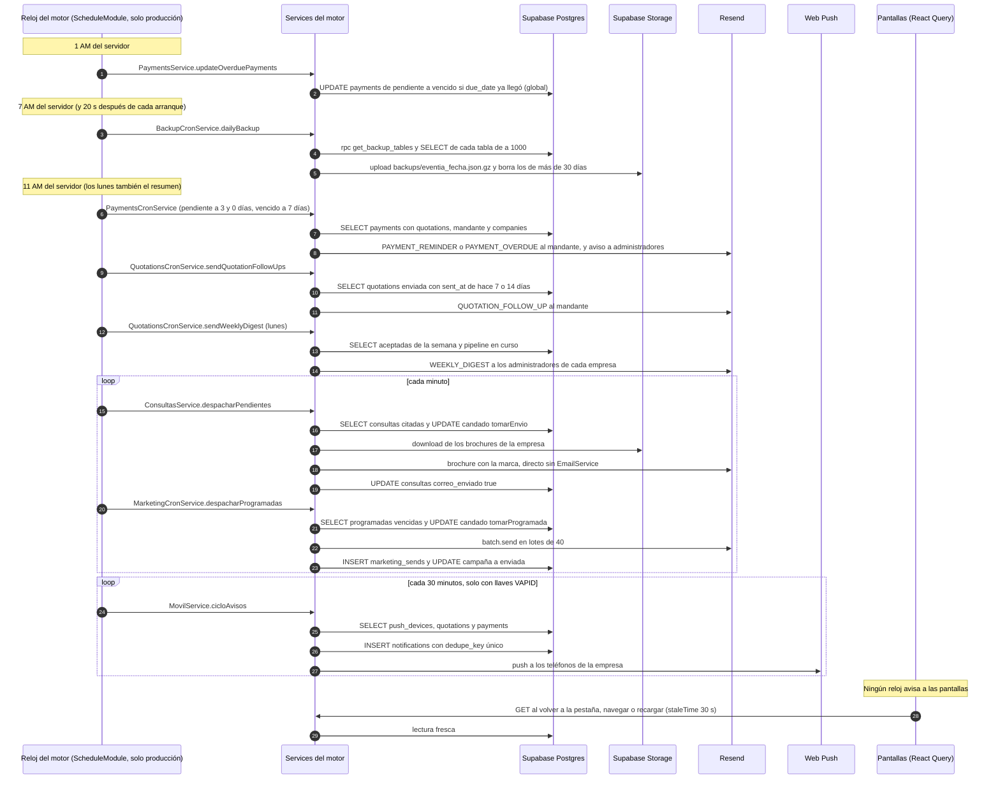

# Flujo: Un día de relojes: lo que el motor hace solo

> **Estado: verificado una vez contra el código** (commit 0de0ddb, 11-09-2026). Falta la etapa de completar lo que no quedó escrito. Parte del atlas; índice de flujos en flujos/00_INDICE_DE_FLUJOS.md y del sistema en ../00_MAPA_DEL_SISTEMA.md.

Documentos que mandan sobre este flujo: `docs/arquitectura/11_MODULO_DE_MARKETING.md` (capítulo "Programar envío", 04-09-2026) y `docs/arquitectura/12_MODULO_DE_CONSULTAS.md` (punto 3, el delay del embudo). Los demás relojes no tienen documento de arquitectura propio. Su evidencia son los comentarios con fecha del código y los commits. Mapas vecinos: `02_NEGOCIO_ENVIO_Y_SEGUIMIENTO.md`, `03_PAGOS_REEMBOLSOS_Y_PORTAL.md`, `10_MARKETING.md`, `11_CONSULTAS_Y_FORMULARIOS_PUBLICOS.md` y `12_CORREOS_INTERNOS_Y_NOTIFICACIONES.md`. Flujos vecinos: 01 (consulta pública), 03 (enviar cotización) y 07 (cancelar evento).

## 1. En palabras simples

Aunque nadie abra Eventia, el motor trabaja solo con **9 relojes**, y **solo en producción**. En el laboratorio y en el computador están apagados.

- **De noche** marca como vencidas las cuotas cuya fecha llegó. De madrugada guarda un respaldo completo de la base.
- **Temprano en la mañana de Chile** escribe a los clientes: la cuota que vence en 3 días, la que lleva 7 días vencida y los dos toques de seguimiento (día 7 y día 14) de las cotizaciones enviadas. Los lunes, además, manda a los administradores el resumen de la semana.
- **Cada minuto** despacha el brochure de las consultas que entraron hace 10 minutos y las campañas programadas cuya hora llegó.
- **Cada 30 minutos** calcula los avisos push de Eventia Móvil, pero duerme si faltan sus llaves.
- Las pantallas no se enteran en el momento: lo ven al recargar. Si la base no responde, unos relojes reintentan al minuto siguiente y otros pierden el día sin avisar.

## 2. El recorrido paso a paso

### La agenda del día

| Expresión | Hora de Chile si el servidor está en UTC (invierno UTC−4 / verano UTC−3) | Reloj | Archivo y método |
|---|---|---|---|
| `*/1 * * * *` (`EVERY_MINUTE`) | cada minuto | Brochure de consultas | `consultas/consultas-cron.service.ts` → `ConsultasCronService.despachar` |
| `*/1 * * * *` (`EVERY_MINUTE`) | cada minuto | Campañas programadas | `marketing/marketing-cron.service.ts` → `MarketingCronService.despacharProgramadas` |
| `*/30 * * * *` | cada 30 minutos | Avisos push de Eventia Móvil | `movil/movil.service.ts` → `MovilService.cicloAvisos` |
| `0 01 * * *` (`EVERY_DAY_AT_1AM`) | 21:00 / 22:00 del día anterior | Cuotas cumplidas pasan a vencidas | `payments/payments.service.ts` → `PaymentsService.updateOverduePayments` |
| `0 7 * * *` | 03:00 / 04:00 | Respaldo diario | `backup/backup-cron.service.ts` → `BackupCronService.dailyBackup` |
| `0 11 * * *` (`EVERY_DAY_AT_11AM`) | 07:00 / 08:00 | Cobranza: cuota por vencer (3 y 0 días) | `payments/payments-cron.service.ts` → `PaymentsCronService.checkUpcomingOverduePayments` |
| `0 11 * * *` (`EVERY_DAY_AT_11AM`) | 07:00 / 08:00 | Cobranza: cuota vencida hace 7 días | `payments/payments-cron.service.ts` → `PaymentsCronService.checkOverduePayments` |
| `0 11 * * *` | 07:00 / 08:00 | Seguimiento de cotizaciones, días 7 y 14 | `quotations/quotations-cron.service.ts` → `QuotationsCronService.sendQuotationFollowUps` |
| `0 11 * * 1` | lunes 07:00 / 08:00 | Resumen semanal a administradores | `quotations/quotations-cron.service.ts` → `QuotationsCronService.sendWeeklyDigest` |

Todas las rutas van bajo `api-rest/src/`. Los valores de `CronExpression` salen de `node_modules/@nestjs/schedule/dist/enums/cron-expression.enum.js`.

> **Hora del servidor.** Ningún `@Cron` fija `timeZone`, así que la librería `cron` usa la hora local del proceso. Los comentarios del código asumen UTC: en `backup-cron.service.ts`, "07:00 UTC = madrugada en Chile"; en `quotations-cron.service.ts`, "Lunes 11:00 UTC = 07:00 de Chile (horario de invierno)". Que Railway corra en UTC no está confirmado (pregunta abierta 1).

### Paso 0. La llave general: quién enciende los relojes

1. **Quién:** el arranque del motor (`api-rest/src/main.ts`, `bootstrap`). No hay persona ni pantalla.
2. **La llave:** `api-rest/src/app.module.ts` registra `ScheduleModule.forRoot({ cronJobs: process.env.NODE_ENV === 'production' })`.
3. **Cómo se apaga:** en `@nestjs/schedule` 6.0.1, `ScheduleExplorer.explore` recorre al iniciar todos los controllers y providers. Si `cronJobs` es falso, `lookupSchedulers` sale antes de `addCron`. El método queda como uno común y nadie lo llama.
4. **Lo que la llave NO apaga:** los ganchos de arranque de Nest.
   - `BackupCronService.onModuleInit` repite la condición con su getter `enabled`.
   - `QuotationsCronService.onApplicationBootstrap` depende solo de `RUN_FOLLOWUPS_ON_BOOT` y corre en cualquier ambiente si la variable vale `1`.
5. **Red de seguridad:** cada `@Cron` queda envuelto por `ScheduleExplorer.wrapFunctionInTryCatchBlocks`. Un error no atrapado lo anota el logger `Scheduler` de Nest y el proceso sigue vivo.
6. **Montaje:** `SchedulerOrchestrator.mountCron` crea cada tarea con `CronJob.from({ ...options, onTick, start })`, sin `waitForCompletion`. En `cron` 4.3.3 eso tiene dos efectos:
   - un tick nuevo parte aunque el anterior no haya terminado;
   - si el tick llega más de 250 ms tarde (`threshold`), se salta con un `console.warn`, que no pasa por pino.
7. **Registro único:** cada clase con reloj aparece una sola vez en `providers`:
   - `PaymentsModule`: `PaymentsService` (exportado, no re-declarado) y `PaymentsCronService`;
   - `QuotationsModule`: `QuotationsCronService`;
   - `ConsultasModule`: `ConsultasCronService`. `AppModule` no importa este módulo; entra a través de `QuotationsModule`;
   - `MarketingModule`: `MarketingCronService`;
   - `MovilModule`: `MovilService`;
   - `BackupModule`: `BackupCronService`.

   Como `explore` recorre instancias, una clase declarada en dos módulos registraría su reloj dos veces.
8. **Relojes jubilados** (ya no existen en el código):
   - `analytics/analyitics-cront.service.ts`, borrado el 31-07 (commit `51948d6`) porque mezclaba empresas;
   - los diarios "eventos en 3 días" y "resumen de cotizaciones", fusionados el 29-07 en el resumen semanal (commit `1ae1fe3`);
   - la encuesta "a ciegas 3 días después", retirada según `docs/migrations/26_event_done_survey.sql`.

### Paso 1. 1 AM: las cuotas cumplidas pasan a vencidas

1. **Quién:** `PaymentsService.updateOverduePayments` (`api-rest/src/payments/payments.service.ts`), con `@Cron(CronExpression.EVERY_DAY_AT_1AM)`. Vive en el service, no en `PaymentsCronService`.
2. **Repository:** `PaymentsRepository.updateOverduePayments` hace UPDATE en `payments`:
   - pone `status = 'vencido'`;
   - donde `status = 'pendiente'` y `due_date <= new Date().toISOString()`;
   - con `.select()` para devolver las filas tocadas.
3. **Alcance:** global. No filtra por `company_id` ni mira `quotations.quotation_status`, así que las cuotas de un evento `cancelada` también se vencen (el flujo 07 lo advierte).
4. **La cuota de hoy:** `due_date` es `date` (`docs/migrations/0_initial_models.sql`). Por el `<=`, la cuota que vence **hoy** queda `vencido` a esta hora, antes de la cobranza de las 11 AM (sección 8; pregunta abierta 2).
5. **Log y errores:**
   - si todo sale bien, anota "Updated N overdue payments…" con los ids;
   - si Supabase devuelve `error`, el service lo anota y lo lanza, y lo atrapa el envoltorio de Nest.
6. **Comentario engañoso:** dentro del método dice "Update status of overdue payments to PENDIENTE", pero hace lo contrario (también lo anota el mapa 03).
7. **Efectos:** no manda correos ni borra la memoria del panel (sección 5).

### Paso 2. 7 AM: el respaldo diario (y al arrancar)

1. **Quién:** `BackupCronService.dailyBackup` (`api-rest/src/backup/backup-cron.service.ts`), con `@Cron('0 7 * * *')`. Vuelve a revisar `enabled`, que es `NODE_ENV === 'production'`. Lo pidió Felipe el 23-07.
2. **Al arrancar:** `onModuleInit` agenda `backupIfMissingToday` a los 20 segundos.
   - Lista el balde `backups` con `storage.list('', { limit: 100 })`.
   - Si falta `eventia_<fecha UTC>.json.gz`, llama a `runBackup('arranque sin respaldo de hoy')`.
3. **Lectura:**
   - `supabase.client.rpc('get_backup_tables')` entrega los nombres de las tablas. Según el comentario salen de `pg_tables`, así que las tablas nuevas entran solas;
   - de cada tabla lee `select('*')`, de a 1.000 filas por página.
4. **Escritura:**
   - arma `{ generated_at, reason, tables }`;
   - lo comprime con `gzipSync`;
   - lo sube a Storage `backups/eventia_YYYY-MM-DD.json.gz` con `upsert: true`;
   - anota "BACKUP OK (…): N filas, X KB en Y ms".
5. **Retención:** `cleanupOld` lista hasta 200 archivos y borra los de más de 30 días.
6. **Sin definición versionada:** la función `get_backup_tables` no aparece en `docs/migrations` (pregunta abierta 7).
7. **Efectos:** nada visible en la app. El archivo trae todas las tablas públicas, de todas las empresas.

### Paso 3. 11 AM: la cobranza (dos relojes a la misma hora)

1. **Quién:** `PaymentsCronService` (`api-rest/src/payments/payments-cron.service.ts`). Tiene dos métodos con `@Cron(CronExpression.EVERY_DAY_AT_11AM)` que parten juntos:
   - `checkUpcomingOverduePayments`: cuotas `pendiente` con `UPCOMING_OVERDUE_PAYMENTS_DAYS_NOTIFICATION = [3, 0]`. Manda `PAYMENT_REMINDER`.
   - `checkOverduePayments`: cuotas `vencido` con `OVERDUE_PAYMENTS_DAYS_NOTIFICATION = [-7]`. Manda `PAYMENT_OVERDUE`.

   Los dos llaman a `checkUpcomingOrOverduePayments(status, days, emailTemplate)`. Las constantes viven en `api-rest/src/payments/constants/index.ts`.
2. **Fechas objetivo:** para cada desfase, toma `new Date()`, le suma los días con `setDate` y aplica `normalizeDateToUtc` (`api-rest/src/utils/dates.ts`), que deja la medianoche UTC.
3. **Lectura:** `PaymentsRepository.findAllPaymentsWithTransactions(undefined, [status], fechas)` trae `payments` con:
   - `quotations!inner`: `company_id`, `quotation_number`, `quotation_status`, fechas y montos;
   - el mandante: `client_contacts` por `quotations_client_contact_id_fkey`, con `name`, `email` y `portal_token`;
   - `clients!inner`, `companies!inner (name)` y `payment_transactions`.

   Filtra `status` y `due_date`. Es global: no filtra empresa ni estado de la cotización, y no usa los abonos que trae.
4. **Correo al cliente, cuota por cuota:**
   - si el mandante no tiene correo, solo deja un `warn` "Cobranza sin destinatario";
   - si tiene, llama a `EmailService.sendEmail(mandante.email, plantilla, params, company_id, portal_token)`;
   - `params` lleva `clientName`, `companyName`, `quotationId` (el número) y `payment` (`payment_number`, `amount` de la cuota completa, `due_date`).
5. **Dentro de `EmailService.sendEmail`** (`api-rest/src/email/email.service.ts`):
   - Con `EMAILS_SILENCED=1` no sale nada; solo queda el log.
   - `shouldSendEmail` lee la empresa con `CompaniesRepository.findOne`:
     - si `notifications.emails[<estructura>] === false`, no sale;
     - si la empresa no tiene configuración, sale (decisión del 29-07);
     - si la lectura falla, **no** sale.
   - `getBranding` pone nombre, logo, color y `replyTo` de la empresa. El botón del portal apunta a `FRONTEND_URL/portal/<token>`.
   - Asuntos:
     - "Hoy vence tu cuota de $X — {empresa}" si `daysToDue <= 0`;
     - "Tu cuota vence pronto — {empresa}" en los demás casos;
     - "Cuota pendiente de tu evento — necesitamos regularizarla" para la vencida.
   - Remitente: `{empresa} <hola@eventi-app.com>`.
   - Si Resend devuelve error, se anota ("cura 05-08") y no se lanza.
6. **Aviso a administradores, también cuota por cuota:**
   - `UsersService.findAll(company_id, UserRole.ADMINISTRADOR)` → `UsersRepository.findAll` → `user_profiles` filtrado por `role`;
   - si hay alguno, `sendEmail(correos, PAYMENT_REMINDER_ADMIN | PAYMENT_OVERDUE_ADMIN, params, company_id)`;
   - remitente `Eventia <hola@eventi-app.com>` y sin interruptor;
   - si vencen 5 cuotas, salen 5 avisos.
   - En esos dos `case` de `sendEmail`, `sendTo = [to as string]` recibe una lista y la mete dentro de otra. El SDK `resend` 6.1.3 pasa `to` sin tocarlo (sección 7; pregunta abierta 3).
7. **Escritura:** ninguna. No queda rastro en la base de que el toque salió.
8. **Interruptores:** en Configuración, la categoría "Ciclo de cobranza (máx. 3 avisos por cuota)" tiene "Cuota por vencer" y "Cuota vencida" (`frontend/src/pages/configuration/constants.ts`). `ConfigurationPage` las guarda en `companies.notifications.emails`.

### Paso 4. 11 AM: los toques de seguimiento de los días 7 y 14

1. **Quién:** `QuotationsCronService.sendQuotationFollowUps` (`api-rest/src/quotations/quotations-cron.service.ts`), con `@Cron('0 11 * * *')`. Lo diseñó Felipe el 30-07.
2. **Ventanas:** calcula `hoyUtc = normalizeDateToUtc(new Date())`. Para `{ dias: 7, toque: 1 }` y `{ dias: 14, toque: 2 }`, la ventana va de `hoyUtc − dias` a un día después.
3. **Lectura:** `QuotationsRepository.findFollowUps(desde, hasta, hoyUtc)` trae de `quotations`: `id`, `quotation_number`, `event_type`, `event_date`, `company_id`, `client_contact_id` y `companies (name)`.
   - Filtra `quotation_status = 'enviada'`, `sent_at` dentro de la ventana y `event_date >= hoy`.
   - Es global. Si falla, lanza.
4. **Destinatario:** `QuotationsRepository.findContactById(client_contact_id)` lee `client_contacts` (`name`, `email`, `portal_token`).
   - Ignora el error y devuelve `null`.
   - Sin correo, deja un `warn` "Seguimiento sin destinatario" y sigue con la siguiente.
5. **Correo:** `sendEmail(email, QUOTATION_FOLLOW_UP, { clientName, companyName, quotationNumber, eventType, eventDate, toque }, company_id, portal_token)`.
   - Asuntos: toque 1, "¿Pudiste revisar tu cotización? — {empresa}"; toque 2, "Seguimos disponibles para tu evento — {empresa}".
   - Interruptor "Seguimiento" en Configuración. Remitente y `replyTo` de la empresa.
6. **Escritura:** ninguna. Un `try/catch` envuelve todo: si algo falla, se corta lo que quedaba de los dos toques, se anota y no se relanza.
7. **De dónde sale `sent_at`:** solo `QuotationsService.update` lo sella, cuando la cotización pasa a `enviada` desde otro estado (`docs/migrations/51_seguimiento_sent_at.sql`).
   - El botón "Enviar cotización" (`EnvioCotizacionService.enviarDeVerdad`, `api-rest/src/quotations/envio-cotizacion.service.ts`) pasa de Solicitada a Enviada con `QuotationsRepository.update(id, { quotation_status: ESTADO_TRAS_ENVIAR })`, sin `sent_at`.
   - Resultado: esas cotizaciones nunca reciben los toques. El mapa 02 lo detectó y el código lo confirma.
8. **Palanca de rescate:** con `RUN_FOLLOWUPS_ON_BOOT=1`, `onApplicationBootstrap` lanza `sendQuotationFollowUps` al encender. Nació con el rescate de Marcia del 31-07 (commit `fbeec81`).

### Paso 5. Lunes 11 AM: el resumen semanal a los administradores

1. **Quién:** `QuotationsCronService.sendWeeklyDigest`, con `@Cron('0 11 * * 1')`. Reemplazó a los dos correos diarios el 29-07.
2. **Eventos de la semana:** para cada día, de hoy a hoy + 6, llama a `QuotationsRepository.findAll({ company_id: undefined, statuses: [ACEPTADA], request_type: COTIZACION, event_date: normalizeDateToUtc(dia) })`.
   - Son 7 lecturas globales de `quotations`: las columnas de `COLUMNAS_LISTA` más mandante, cliente y empresa.
   - Agrupa los resultados en `porEmpresa`.
3. **Pipeline:** `findAll({ company_id: undefined, statuses: [SOLICITADA, ENVIADA, EN_NEGOCIACION] })`. No filtra `request_type`, así que cuenta requerimientos y cotizaciones.
4. **Etiqueta:** "semana del … al …", con `toLocaleDateString('es-CL')` sin zona horaria, o sea con la del servidor.
5. **Envío por empresa:**
   - si no hay eventos ni pipeline, salta la empresa;
   - si hay, busca los administradores con `UsersService.findAll(companyId, ADMINISTRADOR)`;
   - llama a `sendEmail(correos, WEEKLY_DIGEST, { companyName, weekLabel, eventos, pipeline })` sin `companyId`: remitente `Eventia <hola@eventi-app.com>` y sin interruptor;
   - asunto "Tu semana en {empresa}: N eventos · M cotizaciones en curso".
6. **Escritura:** ninguna. Un error se anota y se relanza (el envoltorio lo anota otra vez). No hay reintento hasta el lunes siguiente.

### Paso 6. Cada minuto: el brochure de las consultas

**Lo que arma la cita** (detalle en el flujo 01):

1. **Quién:** un visitante en `CreateQuotationPublic`. La cadena es `POST /quotations/public/:company_id` → `QuotationsController.createPublic` → `QuotationsService.createPublic`.
2. `ConsultasService.embudoPara` pregunta a `EventTypesService.entradaDe` si el tipo es `'consulta'`. Si lo es, llama a `ConsultasService.registrar`:
   - `ConsultasRepository.consultaReciente` revisa si ese correo ya recibió el brochure de ese tipo en los últimos 14 días (`DIAS_SIN_REPETIR`);
   - `ConsultasRepository.crear` inserta en `consultas` con `estado = 'respondida'`, `correo_enviado = false` y `correo_programado_para` = ahora + `RETRASO_DEL_CORREO_MS` (10 minutos), o `NULL` si era repetida.

**El reloj:**

3. **Quién:** `ConsultasCronService.despachar` (`api-rest/src/consultas/consultas-cron.service.ts`), con `@Cron(CronExpression.EVERY_MINUTE)`. Llama a `ConsultasService.despacharPendientes` dentro de un `try/catch` que anota "el reloj del embudo tropezó".
4. **Lectura:** `ConsultasRepository.pendientesDeEnvio(ahora)` trae de `consultas` las que cumplen todo esto, con tope de 20. Es global.
   - `correo_enviado = false`;
   - `correo_programado_para` no nulo y ya cumplido;
   - `created_at` dentro de las últimas 24 horas.
5. **Candado:** por cada una, `ConsultasRepository.tomarEnvio(id, company_id)` hace UPDATE `correo_programado_para = NULL` donde coinciden `id` y `company_id` y la cita todavía existe, devolviendo `id`. Si no devuelve fila, otro reloj se la llevó.
6. **Config fresca:** `ConsultasRepository.config(company_id, event_type)` lee `consulta_config` (`texto`, `brochures`) al momento de enviar.
7. **Envío (`ConsultasService.enviarBrochure`):**
   - **Marca:** `CompaniesRepository.findOne` y `marcaDesdeFila`. Un error distinto de `PGRST116` lanza.
   - **Brochures:** solo las rutas que empiezan con `c{empresa}/`. `ConsultasRepository.descargarBrochure` los baja del balde privado `payment-receipts`.
   - **Texto:** el de la config o `TEXTO_DE_LA_CASA`, con `{nombre}` reemplazado. El HTML sale de `plantillaCampana`, sin link de baja.
   - **Resend directo:** usa `new Resend(...)` y no pasa por `EmailService`.
     - Remitente `{marca} <hola@eventi-app.com>`.
     - Asunto "{marca}: valores para tu {tipo}".
     - Lleva los adjuntos y el `replyTo` de la marca.
     - Si Resend devuelve error, lanza.
8. **Marca de enviado:** `ConsultasRepository.actualizar(id, company_id, { correo_enviado: true })`.
9. **Si fallan los pasos 6, 7 u 8:** `logger.error` "el brochure no salió". La consulta queda sin cita y con `correo_enviado = false`. No se reintenta.
10. **Pantalla:** `ConsultasPage` (`/consultas`) usa `useQuery(["consultas"], getConsultas)`, que llama a `GET /consultas` → `ConsultasController.listar`.
    - `textoEstado` muestra "Sale a las HH:MM" en hora de Chile (`America/Santiago`) mientras hay cita.
    - Después muestra "Respondida" o, si falló, "Sin brochure" en ámbar.
    - No hay sondeo: la pantalla no se refresca sola.

### Paso 7. Cada minuto: las campañas programadas

**Lo que arma la cita:**

1. **Quién:** una persona en la ficha de la campaña. Aprieta `BotonProgramar` (`frontend/src/pages/marketing/ProgramarEnvio.tsx`), que llama a `programarCampana(id, cuando)` (`frontend/src/services/marketing.service.ts`).
   - La cadena sigue con `POST /marketing/campanas/:id/programar` → `MarketingController.programar` → `MarketingService.programarCampana(id, company_id, cuando, user.email)`.
   - Exige campaña en `borrador`, `prueba_enviada_at` puesto y una hora al menos 60 segundos en el futuro.
   - `MarketingRepository.actualizarCampana` escribe en `marketing_campaigns`: `estado = 'programada'`, `programada_para` y `programada_por` (el correo de quien programó).
2. **Cancelar:** `CajaProgramada` llama a `cancelarProgramacion`, que va a `DELETE /marketing/campanas/:id/programar` → `MarketingService.cancelarProgramacion`. La campaña vuelve a `borrador` con `programada_para` y `programada_por` en `NULL`.
3. **Enviar ahora:** el botón de la ficha llama a `POST /marketing/campanas/:id/enviar` → `MarketingController.enviar` → `MarketingService.enviarCampana`, que acepta una campaña `programada`.

**El reloj:**

4. **Quién:** `MarketingCronService.despacharProgramadas` (`api-rest/src/marketing/marketing-cron.service.ts`), con `@Cron(CronExpression.EVERY_MINUTE)`.
5. **Lectura:** `MarketingRepository.programadasVencidas()` trae de `marketing_campaigns` el `id`, `company_id` y `programada_por` de las campañas con `estado = 'programada'` y `programada_para <= ahora`. Es global.
   - Si falla, lanza. No tiene `try` propio: lo anota el envoltorio de Nest.
   - Como nada cambió en la base, se reintenta al minuto siguiente.
6. **Candado:** `MarketingRepository.tomarProgramada(id, company_id)` hace UPDATE `estado = 'borrador'` y `programada_para = NULL`, solo si `estado = 'programada'`, devolviendo `id`. Si no devuelve fila, la salta.
7. **Marca:** `CompaniesRepository.findOne`.
   - Un error distinto de `PGRST116` lanza: nunca sale con marca genérica.
   - Si la empresa no existe, usa `marcaDesdeFila({ name: 'Eventia' })`.
8. **Despacho (`MarketingService.enviarCampana(id, company_id, marca, programada_por)`):**
   - **Chequeos:** `repo.campana`; estado `borrador` o `programada`; `prueba_enviada_at` puesto.
   - **Destinatarios**, leídos en paralelo:
     - `candidatosDe`, la audiencia recalculada al momento;
     - `repo.suprimidos`;
     - `repo.enviosDe`, que lee `marketing_sends`.

     Con eso `resolverDestinatarios` arma la lista. Si queda vacía, error 400.
   - **Copia del capitán:** agrega a `programada_por` si no estaba en la lista.
   - **Envío en lotes:** grupos de `LOTE = 40` con `resend.batch.send`, cabeceras de `bajas.cabecerasDeBaja` y remitente `MarketingService.remitente` (`MARKETING_FROM` o `{empresa} <hola@eventi-app.com>`).
   - **Registro de cada lote:** `MarketingRepository.registrarEnvios` inserta en `marketing_sends` una fila por destinatario: `company_id`, `campaign_id`, `email`, `name`, `empresa`, `estado` ('enviado' o 'fallido'), `error` y `resend_id`.
   - **Cierre:** `actualizarCampana` pone `estado = 'enviada'`, `enviada_at`, `total_destinatarios` = enviados y `programada_para = NULL`.
9. **Si fallan los pasos 7 u 8:** `logger.error` "falló al dispararse (queda en borrador)". No se reintenta.
10. **Después:** el webhook de Resend marca aperturas, clics y rebotes sobre `marketing_sends` (mapa 10). No es parte del reloj.

### Paso 8. Cada 30 minutos: los avisos push de Eventia Móvil

1. **Quién:** `MovilService.cicloAvisos` (`api-rest/src/movil/movil.service.ts`), con `@Cron('*/30 * * * *')`.
2. **Llaves:** el constructor marca `listo` solo si existen `VAPID_PUBLIC_KEY` y `VAPID_PRIVATE_KEY`. Si faltan, anota "Push del móvil dormido" y el ciclo sale de inmediato. El commit `23efab6` (28-07) decía que producción aún no las tenía (pregunta abierta 5).
3. **Dispositivos:** lee todo `push_devices` e ignora el error. Si no hay teléfonos, sale.
4. **Avisos por empresa con teléfonos (`avisosDeEmpresa`):**
   - **Base:** `hoy = new Date().toISOString().slice(0, 10)`, la fecha en UTC. Lee `quotations` de la empresa en `solicitada`, `enviada`, `aceptada` y `realizada`, con `clients (name)`.
   - **Regla 1, pago vencido:** lee `payments` de los eventos (`cotizacion` aceptada o realizada) con `status != 'pagado'` y `due_date < hoy`, más `payment_transactions`. Si lo abonado no cubre la cuota, arma la clave `vencido-{id}-{due_date}`.
   - **Regla 2, evento en los próximos 3 días:** clave `evento-{id}-{fecha}`.
   - **Regla 3, solicitud nueva** (`requerimiento` en `solicitada`): clave `solicitud-{id}`.
   - **Regla 4, cotización fría** (`enviada` con `created_at` de más de 7 días, no `sent_at`): clave `frio-{id}`.
5. **Registro:** inserta cada aviso en `notifications`. `dedupe_key` es `UNIQUE` (`docs/migrations/45_movil_push.sql`). Si el insert falla, sea por clave repetida o por otra cosa, salta el aviso.
6. **Empuje:** `empujar` llama a `webPush.sendNotification` para cada teléfono de la empresa. Si responde 404 o 410, borra esa fila de `push_devices`.
7. **Quién lo recibe:** la app `eventia-movil`, que según el mapa 12 vive fuera de este repositorio. En este repo nadie lee `notifications`; solo se inserta.

### Paso 9. Cuando Supabase no responde

Lo que hacen las librerías:

- `@supabase/postgrest-js` 1.21.4 (`PostgrestBuilder.then`) atrapa el error de red y lo **devuelve** como `{ data: null, error: { message: '<nombre>: <mensaje>', code }, status: 0 }`. No lanza.
- `@supabase/storage-js` 2.12.1 convierte los errores de red en `StorageUnknownError`, hijo de `StorageError`. `download` y `list` devuelven `{ data: null, error }`.
- `SupabaseService` crea el cliente con `createClient(url, key)`, sin reintentos ni tiempos máximos.

Por eso **cada repositorio decide** qué hacer, y cada reloj termina distinto:

| Reloj | Qué falla | Qué hace el código | Resultado para el negocio |
|---|---|---|---|
| 1 AM vencidas | `updateOverduePayments` devuelve `error` | El service lo lanza y el envoltorio de Nest lo anota | Esa noche no marca. Se pone al día la noche siguiente, porque el filtro `due_date <= ahora` acumula. Las pantallas ya la ven vencida por fecha (`sumarPorCobrar`, `cuotaStatus`). |
| 7 AM respaldo | `rpc('get_backup_tables')` o la subida | Lanza y anota "BACKUP FALLÓ" | Ese día no hay respaldo hasta el próximo arranque o las 7 AM siguientes. |
| 7 AM respaldo | La página de una tabla | `logger.error` y `break` | **La tabla queda incompleta o vacía en el archivo, y el log termina diciendo "BACKUP OK".** |
| Respaldo al arrancar | `storage.list` | Ignora el `error`; `data` es null | Cree que falta el de hoy e intenta respaldar. |
| 11 AM cobranza | `findAllPaymentsWithTransactions` | El repositorio devuelve `{ data: [], error }` y el reloj no mira `error` | **Anota "No payments found" y ese día no sale ningún recordatorio.** No hay reintento, porque la ventana es de fecha exacta. |
| 11 AM cobranza | `UsersService.findAll` | Lanza; el `catch` anota y relanza | Se corta el resto de la lista: unos mandantes recibieron y otros no. |
| 11 AM cobranza y seguimiento | `shouldSendEmail` al leer la empresa | Devuelve `false` y anota "Failed to get company" | El correo al cliente no sale. |
| 11 AM cobranza y seguimiento | `getBranding` | Usa el nombre de respaldo | Sale con marca mínima. |
| 11 AM seguimiento | `findFollowUps` | Lanza y el `catch` general lo anota | Se pierden los toques del día, como en el caso de Marcia. |
| 11 AM seguimiento | `findContactById` | Ignora el error y devuelve `null` | Anota el engañoso "sin mandante con correo" y ese toque se pierde. |
| Lunes resumen | `findAll` o `UsersService.findAll` | Lanza | No hay resumen hasta el lunes siguiente. |
| Consultas | `pendientesDeEnvio` o `tomarEnvio` | Lanza y `despachar` lo atrapa | Reintenta cada minuto. Sale tarde cuando vuelve la base, si no pasaron 24 horas desde la entrada. |
| Consultas | Después del candado: `config`, `findOne`, `descargarBrochure` | Lanza y se atrapa por consulta | Queda "Sin brochure", sin reintento. |
| Consultas | `actualizar(correo_enviado)` después de que Resend aceptó | Lanza y se atrapa por consulta | **El correo SÍ salió, pero queda `false` y el log dice "no salió".** |
| Campañas | `programadasVencidas` o `tomarProgramada` | Lanza, sin `try` propio; lo anota Nest | Reintenta cada minuto y sale tarde. |
| Campañas | Después del candado: `findOne`, `campana`, audiencia | Lanza y se atrapa | La campaña queda en borrador sin programación, con el error en el log. |
| Campañas | `registrarEnvios` a mitad de camino | Lanza y se atrapa | Los correos de ese lote salieron sin registro y la campaña queda en borrador. |
| Push | Cualquier lectura | Ignora los errores | Ciclo vacío; lo intenta de nuevo en 30 minutos. |

### Paso 10. Candados contra la doble ejecución

| Reloj | Candado | Si corre dos veces |
|---|---|---|
| Consultas | `ConsultasRepository.tomarEnvio`: UPDATE condicional | No duplica. |
| Campañas | `MarketingRepository.tomarProgramada`: UPDATE condicional | El reloj no duplica, pero "Enviar ahora" no tiene candado (sección 8). |
| Push | `notifications.dedupe_key UNIQUE` | No duplica. |
| 1 AM vencidas | El UPDATE de pendiente a vencido se puede repetir sin efecto | No duplica. |
| Respaldo | Mismo nombre por día y `upsert: true` | Sobrescribe el archivo. |
| 11 AM cobranza | Ninguno, y no escribe nada | **Duplica** los correos al mandante y a los administradores. |
| 11 AM seguimiento | Ninguno | **Duplica** los toques. |
| Lunes resumen | Ninguno | **Duplica** el resumen. |

La doble ejecución puede venir de tres lados:

1. **Dos procesos a la vez**, por ejemplo réplicas o el traslape de un deploy en Railway. Fuera de los candados de base de datos no hay otro freno (pregunta abierta 4).
2. **`RUN_FOLLOWUPS_ON_BOOT=1` olvidada** y un reinicio el mismo día. El comentario lo advierte: "cada reinicio con ella puesta re-evalúa el día".
3. **Dentro del mismo proceso**, porque `cron` corre sin `waitForCompletion`. Solo pesa en los relojes de cada minuto, y ahí los candados protegen.

### Paso 11. Lo que NO corre en el laboratorio

1. **Apagado en el laboratorio y en el computador:**
   - todo `@Cron`, por la llave `cronJobs`;
   - el respaldo al arrancar, por `BackupCronService.enabled`.

   Lo dice el doc 11, regla 4: "En el laboratorio el cron no corre (los crones son solo de producción)". En el computador tampoco corre: `startApi.sh` ejecuta `npm run start:dev` sin `NODE_ENV`.
2. **Lo que se ve en el laboratorio por eso:**
   - una consulta del embudo queda para siempre en "Sale a las HH:MM", porque nadie la despacha;
   - una campaña programada sigue `programada` después de su hora y solo sale con "Enviar ahora";
   - las cuotas no pasan a `vencido` por reloj. Sí lo hacen con `normalizePaymentAfterTransactions` o `updatePaymentSchedule`, y las pantallas las ven vencidas por fecha;
   - no se respalda la base del laboratorio.
3. **Lo que sí corre en el laboratorio:**
   - `RUN_FOLLOWUPS_ON_BOOT=1`, si alguien la pone, porque no mira `NODE_ENV`;
   - los envíos manuales: "Enviar ahora", la prueba de campaña y el push de prueba (`POST /movil/push/probar`);
   - el silenciador `EMAILS_SILENCED=1`, que según el comentario de `sendEmail` existe solo en el laboratorio. Apaga `EmailService`, pero **no** `ConsultasService.enviarBrochure` ni `MarketingService.enviarCampana`, que crean su propio cliente de Resend.
4. **Otras diferencias atadas a `NODE_ENV`:**
   - `EmailPreviewsController.sendPreviews` responde 404 en producción;
   - `verificarFirmaSvix` (`api-rest/src/marketing/bajas.service.ts`) rechaza los webhooks sin `RESEND_WEBHOOK_SECRET` solo en producción.

## 3. Diagrama

## 4. Datos que cambian

| tabla | columnas | en qué paso | quién escribe |
|---|---|---|---|
| `payments` | `status`: pendiente → vencido | Paso 1 | `PaymentsRepository.updateOverduePayments` (reloj 1 AM) |
| Storage `backups` | archivo `eventia_YYYY-MM-DD.json.gz` (crea o sobrescribe); borra los de más de 30 días | Paso 2 | `BackupCronService.runBackup` y `cleanupOld` |
| `consultas` | `correo_programado_para` → NULL (candado) | Paso 6.5 | `ConsultasRepository.tomarEnvio` (reloj) |
| `consultas` | `correo_enviado` → true | Paso 6.8 | `ConsultasRepository.actualizar` (reloj) |
| `marketing_campaigns` | `estado` → 'borrador' y `programada_para` → NULL (candado) | Paso 7.6 | `MarketingRepository.tomarProgramada` (reloj) |
| `marketing_sends` | una fila por destinatario: `company_id`, `campaign_id`, `email`, `name`, `empresa`, `estado`, `error`, `resend_id` | Paso 7.8 | `MarketingRepository.registrarEnvios` |
| `marketing_campaigns` | `estado` 'enviada', `enviada_at`, `total_destinatarios`, `programada_para` NULL | Paso 7.8 | `MarketingRepository.actualizarCampana` |
| `notifications` | fila nueva: `company_id`, `dedupe_key`, `tipo`, `titulo`, `detalle`, `destino` | Paso 8.5 | `MovilService.cicloAvisos` |
| `push_devices` | borra la fila de un teléfono muerto (404 o 410) | Paso 8.6 | `MovilService.empujar` |
| ninguna | cobranza, seguimiento y resumen semanal solo leen y mandan correos | Pasos 3, 4 y 5 | nadie |
| *antes del reloj:* `consultas` | fila nueva con `correo_programado_para` = entrada + 10 min | Paso 6.2 | `ConsultasRepository.crear` (formulario público) |
| *antes del reloj:* `marketing_campaigns` | `estado` 'programada', `programada_para`, `programada_por` (o su limpieza al cancelar) | Paso 7.1 y 7.2 | `MarketingService.programarCampana` y `cancelarProgramacion` |
| *antes del reloj:* `quotations` | `sent_at` al pasar a `enviada` por `update` (el botón de envío no lo sella) | Paso 4.7 | `QuotationsService.update` |

## 5. Efectos automáticos y colaterales

### Correos que salen solos

| Correo | Reloj | A quién | Remitente | Interruptor | Deja rastro |
|---|---|---|---|---|---|
| `PAYMENT_REMINDER`: "Tu cuota vence pronto — {empresa}" o "Hoy vence tu cuota de $X — {empresa}" | 11 AM | Mandante | `{empresa} <hola@eventi-app.com>` con `replyTo` de la empresa | "Cuota por vencer" | No |
| `PAYMENT_REMINDER_ADMIN` | 11 AM, uno por cuota | Administradores | `Eventia <hola@eventi-app.com>` | Ninguno | No |
| `PAYMENT_OVERDUE`: "Cuota pendiente de tu evento — necesitamos regularizarla" | 11 AM | Mandante | Empresa | "Cuota vencida" | No |
| `PAYMENT_OVERDUE_ADMIN` | 11 AM, uno por cuota | Administradores | Eventia | Ninguno | No |
| `QUOTATION_FOLLOW_UP`, toques 1 y 2 | 11 AM | Mandante | Empresa | "Seguimiento" | No |
| `WEEKLY_DIGEST` | Lunes 11 AM | Administradores, por empresa | Eventia | Ninguno | No |
| Brochure del embudo | Cada minuto | Quien consultó | `{marca} <hola@eventi-app.com>` con `replyTo` de la marca | Que el tipo sea 'consulta' | `consultas.correo_enviado` |
| Campaña programada | Cada minuto | Audiencia + copia a `programada_por` | `MARKETING_FROM` o empresa | Supresiones y bajas | `marketing_sends` |

Todos los correos de `EmailService` al cliente llevan el botón a su portal si el mandante tiene `portal_token`.

### Push

- `MovilService.cicloAvisos` empuja una sola vez cada aviso: pago vencido, evento próximo, solicitud nueva y cotización fría. Solo llega a las empresas con teléfonos registrados y solo si hay llaves VAPID.
- Los teléfonos muertos se borran solos.

### Cascadas

- Ningún reloj llama a `QuotationsService.update`, así que ninguno dispara la cascada del plan de pagos ni `QUOTATION_IS_SENT`.
- Después de una campaña, el webhook de Resend va sellando aperturas, clics y rebotes (mapa 10).

### Memoria del motor (`api-rest/src/cache/memoria.ts`)

- **La borran las escrituras, no los relojes.** `cachePanel` guarda el panel de análisis una hora (`AnalyticsService`, clave `{empresa}:dash:…`). Solo lo borra `PanelInvalidationInterceptor`, cuando termina bien una escritura HTTP (POST, PATCH o DELETE) con usuario. Los relojes no pasan por HTTP, así que **ninguna escritura de reloj borra esa memoria**.
- **Impacto bajo:** el cambio de pendiente a vencido de la 1 AM ocurre de noche y el panel suma "por cobrar" pendiente y vencido juntos por mes (comentario de "FASE 3" en `analytics.service.ts`).
- **La fila HOY no usa esa memoria.** `sumarPorCobrar` (`api-rest/src/analytics/hoy.controller.ts`) cuenta como vencida la cuota con `status = 'vencido'` o con `due_date < hoy`, sin esperar al reloj.
- `cacheTokens` y `cachePerfiles` no se tocan.

### Memoria de la app (React Query, `frontend/src/lib/queryClient.ts`)

- **Valores por defecto:** `staleTime: 30_000`, `refetchOnWindowFocus: true` y `retry: 2`.
- **Sin sondeo:** `["consultas"]`, `["marketing", "campanas"]` y `["marketing", "campana-detalle", id]`. Quien tenga la pantalla abierta sigue viendo "Sale a las HH:MM" o "programada · fecha" hasta que vuelva a la pestaña, navegue o recargue.
- **Con sondeo de 5 minutos:** `["dashboard-hoy", company.id]` (`DashboardPage`) y `["postventa", "comprobantes"]` (`PostVentaPage`). Este último no depende de relojes.
- **Post-Venta no depende de la 1 AM:** calcula el estado de la cuota por fecha con `cuotaStatus` (mapa 04).
- **Eventia Móvil:** la app calcula los mismos avisos con las mismas claves (comentario de `movil.service.ts`). Lo que guarda en caché no está en este repositorio.

### Rastro para diagnosticar

- Todo queda en el log de pino (Railway), salvo los avisos de `cron` por tick saltado, que van a `console.warn`.
- `/health` (`HealthController.check`) no dice cuándo corrió cada reloj.

## 6. Reglas de negocio que gobiernan el flujo

1. **Los relojes son solo de producción.**
   - Evidencia: `ScheduleModule.forRoot({ cronJobs: … })` en `app.module.ts`; los comentarios "Como todos los crones de la casa, corre SOLO en producción" en `consultas-cron.service.ts` y `marketing-cron.service.ts`.
   - Doc 11, regla 4: el disparo real se valida en producción "con una campaña a una audiencia de una sola persona (el propio Felipe)".
2. **Máximo 3 toques por cuota** (plan anti-spam de Felipe, 29-07): 3 días antes, el día del vencimiento y a los 7 días de vencida.
   - Evidencia: `payments/constants/index.ts` ("Antes eran hasta 6: [7,3,0] y [-3,7,14]"); commit `8876576`.
   - Ver en la sección 8 por qué el toque del día 0 probablemente no sale.
3. **Un resumen semanal en vez de dos correos diarios** (29-07): lunes en la mañana y solo si hay algo que contar.
   - Evidencia: cabecera de `quotations-cron.service.ts`; commit `1ae1fe3`.
4. **Correos a personas y punto** (30-07): cobranza y seguimiento le escriben solo al mandante (`client_contact_id`). Sin persona con correo no sale nada al cliente; en la cobranza, el aviso a administradores sale igual.
   - Evidencia: comentario en `checkUpcomingOrOverduePayments`; commit `5456115`.
5. **Seguimiento amable** (diseño de Felipe, 30-07): dos toques, a los 7 y 14 días exactos desde `sent_at`, solo si el evento no pasó. Se apaga por empresa. "Después del día 14, silencio".
   - Evidencia: comentario sobre `sendQuotationFollowUps`; migración 51.
6. **Sin configuración de avisos, todo encendido** (29-07). Antes estaban "mudos los correos al cliente de todas las empresas sin configurar".
   - Evidencia: `EmailService.shouldSendEmail`.
7. **Un reloj global agrupa por empresa.** Emergencia del 31-07: el viejo análisis semanal mandaba un correo con los administradores de todas las empresas en el mismo Para.
   - Evidencia: commit `51948d6`; `sendWeeklyDigest` arma `porEmpresa`.
8. **El brochure sale 10 minutos después** (Felipe, 05-09: "un delay de 10 min para las respuestas automáticas"). Una respuesta instantánea delata al robot, y Resend no programa correos con adjuntos: por eso el reloj es del motor.
   - La config se relee al enviar.
   - La regla de una vez es de 14 días.
   - Solo mira consultas de las últimas 24 horas: "jamás reintentos infinitos".
   - Evidencia: doc 12, puntos 3 y 4; `ConsultasService.registrar` y `despacharPendientes`; migración 106.
9. **Programar envío con el reloj del motor, ruta B** (04-09, "ok vamos"): no el `scheduled_at` de Resend, porque el batch no se puede programar.
   - Programar exige lo mismo que enviar: borrador y prueba hecha, más una hora futura.
   - Al dispararse va la copia del capitán a quien programó.
   - Si falla, la campaña vuelve a borrador con el error en el log.
   - Evidencia: doc 11, "Programar envío"; `MarketingService.programarCampana`; migración 103.
10. **Candado de dueño doble para los brochures:** jamás se descarga una ruta que no empiece con `c{empresa}/`.
    - Evidencia: `ConsultasService.guardarConfig` y `enviarBrochure`.
11. **Respaldo diario automático** (23-07, pedido de Felipe): 30 días de retención, y en cada deploy se asegura el respaldo del día.
    - Evidencia: cabecera de `backup-cron.service.ts`.
12. **Un push por aviso**, y sin llaves VAPID el módulo duerme.
    - Evidencia: cabecera de `movil.service.ts`; migración 45.
13. **La palanca de rescate se retira después de usarla** (31-07).
    - Evidencia: comentario de `onApplicationBootstrap`; commit `fbeec81`.
14. **La encuesta ya no es un reloj:** sale al marcar el evento realizado.
    - Evidencia: `docs/migrations/26_event_done_survey.sql`.

## 7. Si cambias algo en este flujo

1. **Si cambias** un reloj global para mandar un correo a varios destinatarios de una sola vez, **pasa** que se mezclan empresas, **porque** todos los relojes leen sin `company_id` (`findAll({ company_id: undefined })`, `findAllPaymentsWithTransactions(undefined, …)`, `findFollowUps`). Evidencia: emergencia del 31-07 (commit `51948d6`); `sendWeeklyDigest` agrupa `porEmpresa` justamente por eso.
2. **Si cambias** la hora, la ventana o la lectura de la cobranza o del seguimiento, **pasa** que un día fallido no se recupera, **porque** buscan fechas exactas (`due_date` = hoy + desfase, `sent_at` dentro de un día) y no dejan registro de lo enviado. Evidencia: rescate de Marcia, 31-07 (commit `fbeec81`: "su día 14 era HOY"); `checkUpcomingOrOverduePayments`; `findFollowUps`.
3. **Si cambias** cómo `EnvioCotizacionService.enviarDeVerdad` o `QuotationsService.update` tratan `sent_at`, **pasa** que los toques de los días 7 y 14 aparecen o desaparecen, **porque** `findFollowUps` filtra por `sent_at` y hoy el botón de envío no lo sella. Evidencia: `QuotationsRepository.update(id, { quotation_status: ESTADO_TRAS_ENVIAR })` en `envio-cotizacion.service.ts`; el sello en `QuotationsService.update`; mapa 02, zona de riesgo.
4. **Si cambias** `NODE_ENV` en un ambiente, **pasa** que se encienden o apagan todos los relojes y el respaldo al arrancar, **porque** dependen de `NODE_ENV === 'production'`.
   - Un laboratorio con `NODE_ENV=production` mandaría cobranza real a los mandantes de su base.
   - Con `EMAILS_SILENCED=1` se frena `EmailService`, pero **igual saldrían brochures y campañas**, que usan Resend directo.
   - Evidencia: `app.module.ts`; `BackupCronService.enabled`; `new Resend(...)` en `ConsultasService.enviarBrochure` y `MarketingService.enviarCampana`.
5. **Si cambias** las horas de la 1 AM o de las 11 AM, o cualquier regla de "vencido", **pasa** que el recordatorio del día del vencimiento sigue muerto o revive, **porque**:
   - a la 1 AM `updateOverduePayments` pasa a `vencido` todo lo que tenga `due_date <= ahora`, y como `due_date` es `date`, eso incluye la cuota de hoy;
   - a las 11 AM `checkUpcomingOverduePayments` busca cuotas `pendiente` con `due_date` = hoy.

   Evidencia: los dos métodos; `0_initial_models.sql`. El mapa 03 lo deja "no confirmado" (pregunta abierta 2).
6. **Si cambias** `shouldSendEmail`, **pasa** que se pueden silenciar los correos al cliente de todas las empresas sin configuración, **porque** eso ya pasó antes del 29-07. Evidencia: comentario "Sin configuración de avisos = TODO ENCENDIDO por defecto".
7. **Si cambias** `EmailService.sendEmail` para que lance el error de Resend, **pasa** que un correo caído corta el resto de la cobranza (su `catch` relanza) y del seguimiento (su `catch` corta ambos toques), **porque** hoy el error solo se anota y el ciclo sigue. Evidencia: "Resend DEVUELVE el error en vez de lanzarlo (cura 05-08)".
8. **Si cambias** los candados `tomarEnvio` o `tomarProgramada`, por ejemplo marcando después de enviar, **pasa** que un mismo brochure o campaña sale dos veces, **porque** hay un tick cada minuto, `cron` no espera a que termine el anterior y puede haber dos procesos. Evidencia: prueba "si otro reloj se la llevó, no se envía dos veces"; `CronJob.from` sin `waitForCompletion`.
9. **Si cambias** el `limit(20)` o la ventana de 24 horas de `pendientesDeEnvio`, **pasa** que se reintentan consultas viejas o que una avalancha tarda más, **porque** esas dos cotas son el único freno contra los reintentos y fijan el ritmo de 20 brochures por minuto. Evidencia: comentario de `pendientesDeEnvio`; doc 12, punto 3.
10. **Si cambias** `LOTE` o agregas un reintento dentro de `enviarCampana`, **pasa** que hay destinatarios duplicados, **porque** `registrarEnvios` se escribe después de `resend.batch.send` y la regla de una vez (`enviosDe`) solo conoce lo registrado. Evidencia: `MarketingService.enviarCampana`; `resolverDestinatarios`.
11. **Si cambias** una cotización a `cancelada`, **pasa** que sus cuotas se siguen venciendo y el mandante sigue recibiendo cobranza, **porque** ni `updateOverduePayments` ni `findAllPaymentsWithTransactions` miran `quotation_status`. Evidencia: los dos repositorios; flujo 07.
12. **Si cambias** los avisos de cuota al administrador, **pasa** que puedes encontrarte con que nunca llegaron, **porque** `sendTo = [to as string]` recibe la lista de correos y la mete dentro de otra, y el SDK `resend` 6.1.3 la pasa tal cual a la API. Así nació en el commit `4c3ceae` (07-11-2025) y ninguna prueba lo cubre. Evidencia: `case EmailStructure.PAYMENT_REMINDER_ADMIN` y `PAYMENT_OVERDUE_ADMIN`; pregunta abierta 3.
13. **Si cambias** `get_backup_tables` o la paginación del respaldo, **pasa** que un respaldo incompleto se anota igual como "BACKUP OK", **porque** el error de una tabla hace `break` y el ciclo sigue. Evidencia: `BackupCronService.runBackup`.
14. **Si agregas** réplicas del motor en Railway, **pasa** que la cobranza, el seguimiento y el resumen salen duplicados, **porque** no tienen candado ni registro. Evidencia: sección 2, paso 10.
15. **Si agregas** un reloj nuevo, **pasa** que no corre en el laboratorio, no tiene candado ni prueba, y correría dos veces si su clase se declara en dos módulos, **porque** así funcionan la llave `cronJobs` y `ScheduleExplorer.explore`. Evidencia: sección 2, paso 0.

## 8. Casos borde y estados raros

- **El toque del día del vencimiento probablemente no sale.** Si la 1 AM corrió bien, la cuota de hoy ya está en `vencido` cuando la cobranza de las 11 AM busca las `pendiente` con `due_date` = hoy.
  - La rama del asunto "Hoy vence tu cuota…" (`daysToDue <= 0`) quedaría sin uso.
  - Pasa igual con el servidor en UTC o en hora de Chile, porque las dos horas caen el mismo día.
  - Falta medirlo en los registros de Resend (pregunta abierta 2).
- **Cuota con abonos parciales.** El recordatorio lleva `payment.amount`, la cuota completa. El reloj trae `payment_transactions`, pero no los resta.
- **Cuota pagada que sigue "pendiente".** `sumarPorCobrar` reconoce que el estado puede decir "pendiente" con saldo cero ("el cron la marca por fecha, no por saldo"). Esa cuota podría recibir recordatorio, porque el reloj filtra por `status` y no por saldo.
- **Evento cancelado:** sigue en la cobranza (sección 7, punto 11).
- **Muchas cuotas el mismo día:** un aviso a administradores por cuota.
- **El día del seguimiento es un día UTC.** Una cotización enviada después de las 21:00 de Chile en verano, o de las 20:00 en invierno, cuenta como enviada al día siguiente.
- **La "cotización fría" del móvil** usa `created_at`, no `sent_at`. Una cotización creada hace un mes y enviada ayer ya aparece fría.
- **El "hoy" del móvil es el de UTC** (`toISOString().slice(0, 10)`). Entre las 21:00 y medianoche de Chile en verano, o entre las 20:00 y medianoche en invierno, "hoy" ya es mañana. Es el mismo "reloj de Londres" del doc 09, tanda A1.
- **El brochure salió pero la marca no se guardó.** Si `actualizar(correo_enviado)` falla, la bandeja dice "Sin brochure" aunque el cliente lo recibió. Además, la regla de una vez (`consultaReciente` exige `correo_enviado = true`) no cuenta ese envío: si vuelve a consultar dentro de 14 días, recibe el brochure otra vez.
- **Consulta vieja con cita.** Si el motor estuvo caído más de 24 horas, `pendientesDeEnvio` ya no la ve, pero la cita no se limpia. La bandeja muestra para siempre "Sale a las HH:MM" con una hora pasada. En el laboratorio pasa con todas.
- **Tipo o config cambiados durante los 10 minutos.** Sale con la config nueva. Si ya no hay config, sale con `TEXTO_DE_LA_CASA` y sin adjuntos, como dice el doc 12 para un tipo sin brochure.
- **"Enviar ahora" en el mismo minuto que el reloj.** `enviarCampana` no tiene candado en el camino humano. Si el reloj ya tomó la campaña (queda `borrador` mientras envía), el humano también la puede despachar, y ambos calculan `enviosDe` al principio: puede haber duplicados.
- **Ventana de edición al dispararse.** Entre `tomarProgramada` y el cierre de `enviarCampana`, la campaña está en `borrador` y la pantalla la dejaría editar.
- **Cancelar mientras el reloj la envía.** `cancelarProgramacion` responde 400 "Esa campaña no está programada", y el envío sigue.
- **El motor estaba caído a la hora programada.** Las campañas salen en el primer tick después del arranque (`programada_para <= ahora`), tarde pero salen. Las consultas también, si no pasaron 24 horas.
- **Deploy a mitad de un envío.** `main.ts` no llama a `enableShutdownHooks`, así que el trabajo en curso se corta.
  - Una campaña puede quedar en `borrador` con parte de `marketing_sends` escrito.
  - Un "Enviar ahora" posterior salta a los ya registrados, pero no a los de un lote que salió sin alcanzar a registrarse.
- **Respaldo de arranque y respaldo de las 7 AM el mismo día.** El segundo sobrescribe al primero (`upsert: true`), y está bien.
- **`gzipSync` del respaldo bloquea el proceso unos instantes.** Un tick de cada minuto que llegue más de 250 ms tarde se salta y sale en el minuto siguiente.
- **Pipeline del resumen.** Cuenta también los requerimientos, porque no filtra `request_type`.
- **`RUN_FOLLOWUPS_ON_BOOT` olvidada.** Cada reinicio repite los toques de ese día.
- **Mandante sin correo.** Cobranza y seguimiento lo saltan con un `warn`, sin aviso en pantalla. En la cobranza, el aviso a administradores sale igual.
- **Comentario viejo en `QuotationsService.createPublic`.** Dice que la consulta nace "si el tipo de evento tiene brochures configurados" y recibe el brochure "al tiro". El código decide por `EventTypesService.entradaDe` y cita a 10 minutos (doc 12).

## 9. Pruebas que protegen el flujo y huecos

**Pruebas que existen:**

- `api-rest/src/consultas/tests/consultas.service.spec.ts`:
  - "el reloj despacha la cita: relee la config, envía y marca";
  - "si otro reloj se la llevó, no se envía dos veces";
  - "si el envío del reloj falla, queda visible como no-enviada";
  - "el reloj tampoco adjunta rutas ajenas aunque estén en la config";
  - "la regla de una vez: consulta repetida queda registrada SIN cita".
- `api-rest/src/analytics/tests/por-cobrar.spec.ts`: la fila HOY no depende del reloj de la 1 AM. Incluye "la cuota totalmente abonada deja de contarse" y el caso de la cuota vencida por fecha que el reloj no marcó.
- `api-rest/src/marketing/tests/resolver-destinatarios.spec.ts`: la pieza de destinatarios que usa el despacho, con "NINGUNA campaña se salta la lista de supresión" y "la regla de una vez".
- `api-rest/src/marketing/tests/programacion.spec.ts`: la recomendación de horario (`publicoDeAudiencia`, `mejorVentana`), no el disparo.
- `api-rest/src/quotations/tests/unit/quotations.service.spec.ts`: "sin rol (llamado interno) pasa igual". Su comentario nombra al "cron de seguimiento", pero `sendQuotationFollowUps` no llama a `QuotationsService.update`, así que esa prueba no lo protege.

**Huecos:**

- No hay prueba de `ConsultasCronService.despachar` ni de `MarketingCronService.despacharProgramadas`. Sin cubrir: el candado `tomarProgramada`, el caso de marca fallida que deja la campaña en borrador y la copia a `programada_por`.
- No hay prueba de `MarketingService.programarCampana` ni de `cancelarProgramacion`: la hora mínima de 60 segundos, la prueba obligatoria y el cambio de estado.
- No hay prueba de `PaymentsCronService` ni de `PaymentsService.updateOverduePayments`. Una sola prueba que corra los dos en orden habría mostrado el choque del día del vencimiento.
- No hay prueba de `QuotationsCronService`: ni la ventana de 7 y 14 días, ni la omisión sin mandante, ni `RUN_FOLLOWUPS_ON_BOOT`, ni el resumen (el mapa 02 también lo anota).
- No hay prueba de `MovilService.cicloAvisos` ni de `BackupCronService`.
- No hay prueba de que `ScheduleModule` quede apagado fuera de producción.
- No hay prueba de la lista anidada en `PAYMENT_REMINDER_ADMIN` y `PAYMENT_OVERDUE_ADMIN`.
- No hay prueba de cómo reacciona cada reloj a un `{ data: null, error }` de Supabase. Caso más grave: la cobranza anota "No payments found".
- **No se ve si los relojes corrieron:** `/health` no lo informa y ningún reloj escribe su última corrida en la base.
- **Nadie obliga a correr las pruebas:** el pre-commit no las ejecuta (`CLAUDE.md`, "Pre-commit").

## 10. Preguntas abiertas

1. **¿En qué zona horaria corre el proceso en Railway?** Ningún `@Cron` fija `timeZone` y los comentarios asumen UTC. De eso depende a qué hora de Chile sale todo.
   - El mapa 03, pregunta 1, llega a la misma conclusión, casi con las mismas palabras: "Ningún `@Cron` del motor lo fija (los `America/Santiago` que hay son cálculos de fecha, no relojes)". No hay contradicción entre los dos documentos. `America/Santiago` solo aparece al dar formato a fechas, en `marketing/programacion.ts`, `quotations/correo-cotizacion.ts` y `people/people.service.ts`.
2. **¿Sale de verdad el recordatorio del día del vencimiento?** Según el código, no (sección 8). Hay que medirlo buscando en Resend asuntos "Hoy vence tu cuota…".
3. **¿Resend acepta `to` con una lista dentro de otra en `PAYMENT_REMINDER_ADMIN` y `PAYMENT_OVERDUE_ADMIN`?** Se puede medir buscando en el log de Railway "Resend devolvió error para paymentReminderAdmin". El mapa 12 los marca como "Vivo".
4. **¿Cuántas instancias del motor corren a la vez en Railway, y hay traslape durante un deploy?** Si hay más de una, la cobranza, el seguimiento y el resumen salen duplicados.
5. **¿Producción tiene hoy `VAPID_PUBLIC_KEY` y `VAPID_PRIVATE_KEY`?** El commit `23efab6` (28-07) decía que no. Sin ellas, el reloj de 30 minutos no hace nada.
6. **¿El laboratorio tiene `NODE_ENV` distinto de `production` y `EMAILS_SILENCED=1`?** Lo afirman el doc 11 y el comentario de `sendEmail`. No lo verifiqué contra las variables del servicio.
7. **¿Dónde está versionada la función `get_backup_tables`?** No está en `docs/migrations`. ¿Alguien restauró alguna vez desde un `eventia_*.json.gz`? El formato está descrito, pero en el repositorio no hay script de restauración.
8. **¿El botón "Enviar cotización" debe arrancar el seguimiento de los días 7 y 14?** Hoy no sella `sent_at`. Es una decisión de Felipe: el doc 13 no lo menciona.
9. **Cobranza y eventos:** ¿debe excluir los eventos `cancelada`? ¿El recordatorio debe mostrar el saldo en vez del monto de la cuota?
10. **¿El pipeline del resumen semanal debe contar los requerimientos?** Hoy los cuenta.
11. **Contradicción con `CLAUDE.md`:** en la sección Cron nombra `analyitics-cront.service.ts` como ejemplo de reloj. Ese archivo se borró el 31-07 (commit `51948d6`). No lo corregí porque este trabajo es solo de lectura.
12. **Contradicción de comentarios:** el de `QuotationsService.createPublic` todavía describe el embudo antiguo (según brochures y envío inmediato), mientras que el doc 12 y `ConsultasService.embudoPara` describen el actual (según la entrada del catálogo y 10 minutos de espera).
