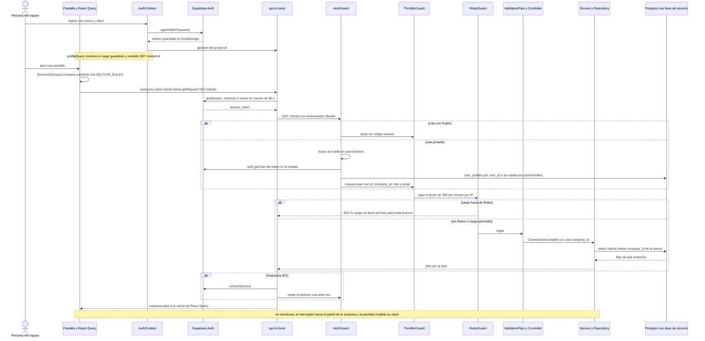

# Flujo: Una petición cualquiera: sesión, roles y aislamiento por empresa

> **Estado: verificado una vez contra el código** (commit 0de0ddb, 11-09-2026). Falta la etapa de completar lo que no quedó escrito. Parte del atlas; índice de flujos en flujos/00_INDICE_DE_FLUJOS.md y del sistema en ../00_MAPA_DEL_SISTEMA.md.

Documentos que mandan sobre este flujo: `CLAUDE.md` (secciones "Backend architecture" y "Frontend architecture"). Ningún documento de `docs/arquitectura/` (09 a 13) trata el acceso. Los mapas de módulo que tocan este flujo citan `15_ACCESO_EMPRESA_USUARIOS_Y_PLANES.md` y `16_CALENDARIO_MOVIL_E_INFRAESTRUCTURA_DEL_MOTOR.md`, que no estaban en la carpeta cuando se verificó este flujo.

## 1. En palabras simples

Cada vez que alguien del equipo abre una pantalla, la app le pide los datos al motor y le muestra el "pase" que Supabase le entregó al iniciar sesión. Antes de tocar la base, el motor revisa tres cosas: que el pase sea auténtico, quién es la persona (su empresa y su cargo) y si ese cargo puede usar la función pedida.

La empresa nunca la dice la pantalla: el motor la saca de la ficha del usuario, y cada consulta a la base lleva "solo de esta empresa". **La base de datos no pone ese muro por su cuenta.** Si una consulta del motor olvida el filtro, cruza empresas.

El menú y los candados de la pantalla son solo lo que se ve. La palabra final la tiene el motor, pero hoy no en todas las rutas: Personas, por ejemplo, está cerrada solo en la pantalla.

Para ir rápido, el motor recuerda pases y fichas hasta una hora, y la app muestra lo que ya vio mientras lo revalida por detrás.

## 2. El recorrido paso a paso

### Paso 0. La app arranca (nadie ha hecho nada todavía)

1. **Quién:** el navegador, al abrir cualquier dirección.
   - `frontend/src/main.tsx` monta, de afuera hacia adentro: `RedDeSeguridad`, `QueryClientProvider` con `queryClient` (`frontend/src/lib/queryClient.ts`) y `App`.
   - `App` (`frontend/src/App.tsx`) monta `AuthProvider` y dentro el `Router`.
2. **Cliente de Supabase:** `frontend/src/lib/supabase.ts` llama `createClient(VITE_SUPABASE_URL, VITE_SUPABASE_ANON_KEY)`.
   - Si falta una de las dos variables, lanza "Missing Supabase environment variables" y la app no parte.
   - No pasa opciones, así que rigen las por defecto de auth-js: `persistSession` y `autoRefreshToken` en true. **Corregido:** la versión instalada de `@supabase/supabase-js` en `frontend/node_modules` es la 2.54.0 (`package.json` pide ^2.44.4); esa versión trae adentro `@supabase/auth-js` 2.71.1, la librería que maneja sesión y refresco — de ahí las citas a "auth-js 2.71.1" más abajo (el borrador había puesto 2.71.1 como si fuera la versión de `supabase-js`).
   - La sesión queda en `localStorage` con la clave `sb-<ref>-auth-token` (`SupabaseClient.js` de supabase-js).
3. **`AuthProvider`** (`frontend/src/contexts/AuthContext.tsx`), en su `useEffect`:
   - `getInitialSession` llama `supabase.auth.getSession()` y hace `setUser`. Si el error dice "Invalid Refresh Token", llama `supabase.auth.signOut()`. Siempre termina en `setLoading(false)`.
   - Se suscribe a `supabase.auth.onAuthStateChange`. Cada evento (sesión inicial, inicio, refresco, cierre) hace `setUser(session?.user ?? null)` y `setLoading(false)`.
4. **`profileQuery`** (React Query, clave `["profile", user.id]`) se activa apenas hay `user`:
   - `initialData`: el perfil guardado en `localStorage` bajo `eventia_profile_<userId>` (`readCachedProfile`). Así el cargo aparece al instante.
   - `initialDataUpdatedAt: 0`: ese valor nace viejo y se revalida siempre al montar ("mostrar lo conocido y refrescar por detrás", Etapa 0, 21-07-2026).
   - `queryFn`: `getUser(user.id)`, que hace `GET /users/:id` (pasos 4 a 12). Guarda `role`, `full_name` y `companies` con `writeCachedProfile`.
   - `staleTime` de 5 minutos y `retry` 3.
   - Expone `userRole`, `userName`, `company` y `roleLoading` (`!!user && !data && isPending`).
5. **Precarga:** a los 2,5 s `App` descarga en segundo plano las pantallas más usadas (`importDashboard`, `importQuotations` y otras). No llama al motor.

### Paso 1. Iniciar sesión

1. **Quién:** una persona del equipo en `/login`. `LoginPage.handleSubmit` (`frontend/src/pages/LoginPage.tsx`) llama `useAuth().signIn(email, password)`.
2. **`signIn`** llama `supabase.auth.signInWithPassword` directo a Supabase Auth. **No pasa por el motor.**
   - Supabase guarda la sesión en `localStorage` y emite el evento de inicio.
   - `onAuthStateChange` hace `setUser`, y con eso arranca `profileQuery` (paso 0.4).
3. **Si el login salió bien**, `signIn` además llama `getUser(result.data.user.id)`, la primera petición al motor, para devolver `userRole` y `companyId`.
   - Si esa llamada falla, devuelve igual el resultado del login, pero sin cargo.
   - Al entrar se hacen entonces **dos** `GET /users/:id` casi juntos: el de `signIn` y el de `profileQuery`. El motor valida el pase con Supabase una vez; la segunda sale de su memoria (paso 6).
4. **`LoginPage` decide a dónde entrar:**
   - error "invalid login credentials": muestra "Correo o contraseña incorrectos.";
   - otro error: "No se pudo iniciar sesión. Intenta de nuevo.";
   - entró: `administrador` va a `/dashboard` y cualquier otro cargo a `/requests` (compara con el enum `UserRole` de `frontend/src/constants/users.ts`).
5. **Registro propio:** desactivado solo en pantalla.
   - El enlace "Regístrate aquí" está comentado ("TEMP: self-service registration disabled").
   - `AuthContext.signUp` existe, pero no tiene llamadores.
   - En el motor siguen abiertas `POST /users/signup` y `POST /super-admin/suscription`, ambas `@Public` (sección 8).
6. **Rama lateral, recuperar contraseña:**
   - `POST /auth/password/recovery` (`@Public`) llama `AuthController.requestPasswordRecovery` y luego `AuthService.requestPasswordRecovery`, que usa `supabase.auth.resetPasswordForEmail` con `redirectTo = SUPABASE_PASSWORD_RECOVERY_REDIRECT_URL`.
   - `ResetPasswordPage` lee `access_token` del hash o de la query y llama `resetPasswordWithToken`, que hace `POST /auth/password/reset`.
   - `AuthService.resetPasswordWithToken` valida el pase con `supabase.auth.getUser` y cambia la clave con `auth.admin.updateUserById`.

### Paso 2. La pantalla decide qué mostrar (solo cosmético)

1. **`Layout`** (`frontend/src/layout/Layout.tsx`):
   - mientras `loading`, muestra `PageSkeleton`;
   - si `!loading && !user`, hace `navigate("/login")`;
   - muestra el letrero "LABORATORIO" cuando `VITE_SUPABASE_URL` apunta a la base de pruebas (`ES_LABORATORIO`; 28-07: "Felipe entró al lab sin querer");
   - si `company.is_premium === false`, muestra el aviso de prueba gratuita.
2. **Menú:** `Sidebar` y el menú de usuario de `Layout` usan `canAccessSection(userRole, section)`. Sin `userRole` devuelven false: "si la consulta del rol falla, el menú se queda vacío en vez de mentir" (12-08).
3. **Rutas:** cada ruta interna va dentro de `PermissionGuard allowedRoles={SECTION_ROLES.x}` (`frontend/src/components/PermissionGuard.tsx`).
   - `loading || roleLoading`: muestra `PageSkeleton`. Antes mostraba un falso "Permisos Insuficientes" (bug del 21-07-2026).
   - Sin `user`: "Acceso Denegado", con botón a `/login`.
   - Cargo fuera de la lista: "Permisos Insuficientes".
4. **La matriz** vive en `frontend/src/constants/permissions.ts` (`ROLE_PERMISSIONS`, `ROLE_GROUPS`, `SECTION_ROLES`). Frente a frente con el motor:

| Sección de la app | Cargos que la ven (`SECTION_ROLES`) | Candado en el motor |
|---|---|---|
| `dashboard`, `analytics` | administrador | `@Roles(...ADMIN_ONLY)` en la clase de `AnalyticsController` y de `HoyController` |
| `requests`, `clients`, `configuration`, `plans` | todos | `ClientsController`, `ClientContactsController` y `PlansController`: sin `@Roles` |
| `quotations` (ver), `calendar` | recepción y más | `QuotationsController`: 2 rutas con `@Roles` más candados a mano para recepción. `CalendarController`: sin `@Roles` |
| `quotations_edit` | vendedor y más | no existe un `@Roles` de vendedor; solo el candado a mano de recepción (paso 8.6) |
| `payments` | operaciones y administrador | `PaymentsController`: `OPERATIONS_AND_UP` ruta por ruta, salvo sus 2 `GET` (lista y `transactions`), sin `@Roles` — cualquier sesión los lee (ver sección 8). `RefundsController`: en la clase |
| `logistics` | operaciones y administrador | `LogisticsController`: `OPERATIONS_AND_UP` en la clase, lecturas con `SALES_AND_UP` y recetas con `ADMIN_ONLY` |
| `services`, `company_configuration`, `user_management`, `admin` | administrador | `ServicesController` y `SectionsController` con `@Roles` en casi todas las rutas; `PATCH /companies`; `POST`, `PATCH` y `DELETE` de `/users` |
| `people` | administrador (14-08: "ahí vive la cuenta corriente de cada persona") | **ninguno**: `PeopleController` no tiene `@Roles` |
| `marketing` | administrador (25-08) | `@Roles(...ADMIN_ONLY)` en la clase de `MarketingController` (revisión 26-08) |
| `customer_satisfaction_survey` | administrador | solo `POST template` lleva `ADMIN_ONLY`; `GET answers` exige solo sesión |

5. **Excepciones en `App.tsx`:**
   - Las tres rutas `customer-satisfaction-survey` (lista, plantilla y respuestas) están dentro de `Layout`, pero **sin** `PermissionGuard`.
   - `/superAdminqweasdzxc` está fuera de `Layout` y lleva un `TODO: add authentication`. El motor la protege con la lista de correos (paso 8.6).
6. **Nada de esto protege datos.** Lo dice el comentario de `AuthContext.tsx`: "La autoridad real vive en el backend (valida cada operación con el token); esto solo decide qué se muestra en pantalla".

### Paso 3. Una pantalla pide datos (React Query)

1. **Quién:** cualquier pantalla. Ejemplo de referencia, la lista de clientes:
   - `ClientsPage` (`frontend/src/pages/ClientsPage.tsx`) usa `useQuery` con `clientsQueryOptions` (`frontend/src/services/clients.service.ts`, clave `["clients"]`);
   - la consulta llama `getClients`, que hace `apiRequest("/clients", "GET")`;
   - la ruta sale de `API_ROUTES.CLIENTS` (`frontend/src/constants/api.routes.ts`).
2. **Qué hace React Query con la caché:**
   - dato fresco (menos de 30 s): no llama al motor;
   - dato viejo: lo muestra y revalida por detrás;
   - sin dato: `isPending`, y la pantalla dibuja su esqueleto.
3. **Política global de `queryClient`** (Etapa 0, 21-07-2026):
   - `staleTime` 30 s, `gcTime` 30 minutos, `refetchOnWindowFocus` true y `retry` 2;
   - las pantallas de plata bajan a `staleTime: 0`. **Corregido:** no son solo esas cuatro — grep cuenta 13 archivos (24 consultas): `PaymentPlanEditor`, `NominaTab`, `RevisionDeNomina`, `PersonaFichaPage` y `FichasTab` (Personas); `PostVentaPage`, `GestionTab`, `FichaCocinaSection` y `EventResourcesSection` (Post-Venta); `NegocioPage`, `QuotationsPage` y `SeguimientoPanel` (cotizaciones); y una consulta de `DashboardPage`.
4. **Camino único:** no hay `fetch` ni `axios` sueltos en `frontend/src`. `storage.service.ts` y `PortalPage.tsx` usan la instancia `api` directo (`api.request`), que igual pasa por los interceptores.

### Paso 4. `api.ts` pone el pase

1. **La llamada:** `apiRequest(url, method, data, params)` hace `api.request(...)` (`frontend/src/services/api.ts`). La instancia `api` lleva `baseURL = VITE_EVENTIA_API_REST`, `withCredentials: true` y `Content-Type: application/json`.
2. **Interceptor de salida:** `getSupabaseToken` llama `supabase.auth.getSession()`.
   - En auth-js 2.71.1, `__loadSession` da la sesión por vencida si le quedan menos de `EXPIRY_MARGIN_MS` (3 × 30 s = 90 s) y la refresca antes de devolverla.
   - Con `access_token`, pone `Authorization: Bearer <token>`.
   - Sin sesión, o si hubo error, la petición sale **sin pase**: el motor responde 401, salvo en rutas `@Public`.
3. **Refresco en segundo plano:** con `autoRefreshToken`, Supabase también refresca solo y emite `TOKEN_REFRESHED`. Eso hace `setUser` en `AuthContext` con el mismo `user.id`, así que la clave del perfil no cambia.

### Paso 5. El motor recibe la petición

1. **`bootstrap`** (`api-rest/src/main.ts`):
   - **Configuración:** `validateEnv` (`api-rest/src/config/validate-env.ts`). Sin `SUPABASE_URL`, `SUPABASE_SERVICE_ROLE_KEY` o `PORT`, el servidor no parte. Si faltan `FRONTEND_URL`, `SUPER_ADMIN_EMAILS` u otras importantes, solo advierte en el log.
   - **Proxy:** `trust proxy` en 1, porque "Railway pone un proxy adelante". Sin eso, todas las peticiones parecerían venir de la misma IP.
   - **CORS:** acepta `FRONTEND_URL`, `MOVIL_URL`, `https://www.eventi-app.com`, `https://eventia-dev.netlify.app` y los localhost. Permite la cabecera `Authorization`.
   - **`maxAge` 86400:** desde el 12-08 el navegador recuerda el permiso 24 horas. Antes repetía el `OPTIONS` antes de cada consulta, "~430 ms" por viaje desde Chile.
2. **Registros:** `LoggerModule` (`api-rest/src/app.module.ts`) configura pino-http para redactar `req.headers.authorization` y `req.headers.cookie` como `[REDACTADO]`. Fase 3, 28-07: "el token de sesión completo quedaba escrito en el log de CADA petición".
3. **Orden de entrada:**
   - Los guardianes globales (`APP_GUARD` en `AppModule.providers`) corren en este orden: `AuthGuard`, `ThrottlerGuard` y `RolesGuard`.
   - Después entra el interceptor global `PanelInvalidationInterceptor`, que solo actúa a la vuelta (paso 11.3).
   - Luego el `ValidationPipe` global y, al final, el controller.

### Paso 6. `AuthGuard`: ¿el pase es auténtico y quién es?

Archivo `api-rest/src/auth/auth.guard.ts`, método `AuthGuard.canActivate`.

1. **Rutas públicas:** `Reflector.getAllAndOverride(IS_PUBLIC_KEY)` mira el handler y la clase. Si la ruta tiene `@Public()` (`api-rest/src/auth/public.decorator.ts`), deja pasar **sin cargar usuario**, y `request.user` queda vacío.
2. **Sin pase:** `extractTokenFromHeader` busca `Authorization: Bearer X`. Si no hay, responde 401 "No token provided".
3. **`AuthService.validateToken(token)`** (`api-rest/src/auth/auth.service.ts`):
   - calcula la huella SHA-256 del pase y la busca en `cacheTokens` (`api-rest/src/cache/memoria.ts`, tope de 5.000 entradas);
   - si no está, llama `supabase.auth.getUser(token)` con un cliente propio creado con `SUPABASE_SERVICE_ROLE_KEY`. Si Supabase lo rechaza, responde 401 "Token validation failed";
   - arma la identidad `{ id: user.id, ...user.user_metadata }` y la guarda por `vidaRestante`: lo que le queda al `exp` del JWT, con tope de 1 hora, o 5 minutos si no se puede leer.
   - Comentario de la FASE VELOCIDAD (28-07): "Solo se recuerdan pases que Supabase aprobó; uno alterado jamás entra a la memoria".
4. **Perfil:** busca `cachePerfiles.get(user.id)` (tope de 2.000 entradas). Si no está, llama `UsersRepository.findOne(user.id)` (`api-rest/src/users/users.repository.ts`):
   - tabla `user_profiles`, filtro `user_id = id`, con `.single()`;
   - trae `*` más la empresa embebida: `companies (id, name, logo_url, colors, is_premium, currency, is_active, tagline, bank_details, high_value_threshold, banner_url, whatsapp, instagram, facebook, sitio_web)`;
   - si la fila existe, la guarda 1 hora (`HORA_MS`).
5. **Resultado:** cuelga en `request.user` el objeto `{ id, company_id, role, email }`.
   - `id` es el id de Supabase Auth (igual a `user_profiles.user_id`), **no** `user_profiles.id`.
   - `role` alimenta a `RolesGuard` (Fase 3, 28-07) y `email` a la lista de super-admin (mudanza #7, 28-07).
6. **Errores:** cualquier error que no sea `UnauthorizedException` sale como 401 "Invalid token". Eso incluye al usuario sin fila en `user_profiles`: `fullUser!.company_id` revienta y termina en 401 (sección 8).
7. **Empresa inactiva:** el guardián no mira `companies.is_active`.

### Paso 7. `ThrottlerGuard`: frecuencia

1. **Techo general:** `ThrottlerModule.forRoot([{ ttl: 60_000, limit: 300 }])`, o sea 300 peticiones por minuto por IP en todas las rutas.
2. **Techos más estrictos con `@Throttle`:**
   - 10 por minuto: `POST /quotations/public/:company_id`, `POST /super-admin/suscription`, `POST /super-admin/lead`, `POST /customer-satisfaction-survey/answer`, el comprobante del portal (`PortalController`) y `GET` y `POST` de la baja de marketing;
   - 30 por minuto: `GET /event-types/public/:companyId` y `GET /quotations/imprimir/:token`;
   - 1.200 por minuto: `POST /marketing/webhook`.
3. **Al pasar el techo:** responde 429. Como corre después de `AuthGuard`, una petición sin pase a una ruta privada recibe 401 antes de contar.
4. **En la app:** no hay manejo propio del 429 (grep sin resultados en `frontend/src`). React Query lo reintenta como cualquier error.

### Paso 8. `RolesGuard`: ¿el cargo puede usar esta función?

Archivo `api-rest/src/auth/roles.guard.ts`, método `RolesGuard.canActivate`. El decorador vive en `api-rest/src/auth/roles.decorator.ts`.

1. **`@Public`:** pasa.
2. **Lectura de `@Roles`:** lee `ROLES_KEY` con `getAllAndOverride`, primero el handler y después la clase. Regla escrita: "El @Roles de un handler MANDA sobre el del controller".
3. **Sin `@Roles`:** pasa. Regla escrita: "basta la sesión (compatibilidad: se van marcando rutas por etapas, empezando por las mutaciones)".
4. **Con `@Roles`:** si `request.user.role` no está en la lista, o no hay cargo, responde 403 "Tu cargo no tiene permiso para esta función.".
5. **Grupos:** `ADMIN_ONLY`, `OPERATIONS_AND_UP`, `SALES_AND_UP` y `RECEPTION_AND_UP` (12-08). Llevan los mismos nombres que `ROLE_GROUPS` del frontend.
6. **Candados que no son `@Roles`:**
   - `QuotationsController.create`: recepción solo crea con `request_type = REQUERIMIENTO`. Si no, 403 "Recepción puede registrar requerimientos, no crear cotizaciones." (regla de Felipe, 28-07).
   - `QuotationsService.update`: el espejo, 403 "Recepción puede editar requerimientos, no cotizaciones." (12-08).
   - `SuperAdminService.assertSuperAdmin(user.email)`: el correo debe estar en `SUPER_ADMIN_EMAILS`. Si no, 403 "Solo super-administradores.".
7. **Inventario en el commit** (conteo de decoradores con grep):
   - **`@Roles` en la clase:** `AnalyticsController`, `HoyController`, `MarketingController`, `LogisticsController`, `RefundsController`, `EventDocumentsController` (`OPERATIONS_AND_UP`; **corregido:** el borrador lo tenía en la lista de abajo, pero el decorador está sobre la clase, no sobre una ruta) y `QuotationFollowupsController` (`RECEPTION_AND_UP`).
   - **`@Roles` ruta por ruta:** `PaymentsController` (**ojo:** sus dos rutas `GET` —lista y `transactions`— no llevan `@Roles`; ver sección 8), `ServicesController`, `SectionsController`, `ServiceGroupsController`, `ServiceGroupCollectionsController`, `PortalReceiptsController`, `UsersController`, `CompaniesController`, `QuotationsController` y el controller de encuestas.
   - **Sin ningún `@Roles`:** `PeopleController` (44 rutas), `ClientsController`, `ClientContactsController`, `ConsultasController`, `EventTypesController`, `StorageController`, `CalendarController`, `PlansController`, `MovilController` y `SuperAdminController` (este usa la lista de correos). `PortalController`, `AuthController`, `HealthController` y `EmailPreviewsController` solo tienen rutas `@Public`.
8. **Rutas `@Public` del motor:**
   - acceso: `POST /auth/password/recovery`, `POST /auth/password/reset` y `GET /health`;
   - catálogos públicos: `GET /clients/types/public/:company_id`, `GET /event-types/public/:companyId` y `GET /companies/public/:id`;
   - cotizaciones: `POST /quotations/public/:company_id`, `GET /quotations/imprimir/:token` y `GET /quotations/:id`;
   - portal del cliente: las 3 rutas `:token` de `PortalController`;
   - registro: `POST /super-admin/suscription`, `POST /super-admin/lead` y `POST /users/signup`;
   - marketing: `POST /marketing/webhook`, `GET /marketing/baja` y `POST /marketing/baja`;
   - encuestas: `GET` y `POST` de `/customer-satisfaction-survey` (plantilla, `answered` y `answer`);
   - laboratorio: `POST /email-previews`, que responde 404 en producción.

### Paso 9. `ValidationPipe`

1. **Configuración** (`main.ts`): `new ValidationPipe({ whitelist: true, forbidNonWhitelisted: true, transform: true })`.
2. **Cuerpo o query con clase DTO:**
   - cada campo necesita un decorador de `class-validator`;
   - un campo que no está en el DTO responde 400 "property X should not exist";
   - un campo inválido responde 400, con `message` como lista.
3. **`transform: true`** convierte el cuerpo en instancia del DTO. Con los parámetros de la URL hay que cuidarse:
   - los controllers de este flujo los declaran como `string` (`@Param('id') id: string`) y convierten a mano (`+id`, `+companyId`), o usan `ParseIntPipe` (`SuperAdminController.updateCompany`);
   - `QuotationsController.createPublic` declara `company_id: Company['id']` (número en la entidad), pero en ejecución puede llegar como texto. Lo advierte `EmailService.sendEmail`: "en runtime puede llegar como TEXTO ("1", viene de la URL pública) — por eso el Number()".
4. **Tipos literales no se validan.** Un `@Body()` tipado con un tipo literal en vez de una clase, como `body: { name: string }` en `SuperAdminController.createCompany`, pasa sin validar: Nest solo valida clases.
5. **La empresa no se manda.** La regla de la app es que `company_id` no viaje desde el navegador en las rutas privadas: "company_id NO viaja desde el navegador: el backend lo saca de la sesión del usuario que crea/edita (aislamiento por empresa)" (`frontend/src/types/users.types.ts`).

### Paso 10. Controller, service, repository y tabla

1. **El controller lee al usuario** con `@CurrentUser()` (`api-rest/src/auth/user.decorator.ts`, exportado en `api-rest/src/auth/index.ts`).
   - Devuelve `request.user` tipado como la entidad `User`, pero en la práctica trae solo `id`, `company_id`, `role` y `email`.
2. **Ejemplo de lectura:**
   - `ClientsController.findAll` llama `ClientsService.findAll(user.company_id)`, y este `ClientsRepository.findAll(companyId)`.
   - La consulta: `from('clients').select('*, quotations(id, quotation_status), client_contacts(id, name, email, phone, is_primary)').eq('company_id', companyId).order('name')`.
   - A cada cliente le agrega `quotation_count` y `quotation_statuses`.
3. **Ejemplo de escritura:**
   - `ClientsController.create` llama `ClientsService.create(dto, user.company_id)`, que arma `{ ...clientFields, company_id: companyId }`.
   - `ClientsRepository.create` hace el INSERT en `clients`.
   - Luego crea la persona principal con `ClientContactsRepository.create(companyId, ...)` ("GARANTÍA DE NACIMIENTO", 31-07).
   - `ClientsRepository.update` y `remove` filtran por `id` **y** `company_id`.
4. **La base no aísla.**
   - Los repositories usan `SupabaseService.client` (`api-rest/src/supabase/supabase.service.ts`), creado con `SUPABASE_SERVICE_ROLE_KEY`, que salta RLS. `AuthService` crea además su propio cliente con la misma llave.
   - La migración 40 (`docs/migrations/40_cerrar_acceso_directo.sql`, "APLICADA 28-07-2026") borró toda política `app_authenticated` y revocó el acceso de `authenticated` a las tablas de `public`: "ni siquiera una SESIÓN VÁLIDA puede leer o escribir tablas directo".
   - La 39 cerró el último INSERT anónimo, el de `leads`.
   - Resultado: **el filtro `company_id` del repository es el único muro entre empresas.**
5. **Muro para archivos:** `StorageService.verificarDueno` (`api-rest/src/storage/storage.service.ts`) exige que la ruta empiece con `c{companyId}`. Las rutas nuevas se arman con la empresa de la sesión.
6. **Lecturas y escrituras que no filtran por empresa** (verificado en el código):
   - `UsersRepository.findOne`: filtra por `user_id`. Lo usan el guardián y `GET /users/:id`.
   - `UsersRepository.update`: filtra por `id`. Lo usa `PATCH /users/:id`.
   - `CompaniesRepository.findOne`: filtra por `id` con `select *`. Lo usa `GET /companies/:id`.
   - `QuotationsRepository.findOne`: filtra por `id`. Lo usa `GET /quotations/:id`, que además es `@Public`.
   - `UsersRepository.findAll` filtra por empresa solo si `companyId` viene con valor.

### Paso 11. La respuesta vuelve al navegador

1. **No hay filtro global de excepciones** (grep sin `@Catch`, `APP_FILTER` ni `useGlobalFilters`), así que Nest responde con su formato por defecto:
   - `HttpException` (400, 401, 403, 404, 409): su código y `{ statusCode, message, error }`;
   - cualquier otro error lanzado (un `PostgrestError` o un `Error` común): 500 "Internal server error".
2. **Dos convenciones de éxito conviven:**
   - **A. El repository desarma la respuesta y lanza el error** (`if (error) throw error; return data`), como `ClientsRepository`. La app recibe el dato pelado, con 200 o 201.
   - **B. El repository devuelve la respuesta cruda de Supabase** (`return await this.supabase.client...`). La app recibe `{ data, error, ... }` con 200 o 201, **aunque `error` venga lleno**.
   - Métodos de convención B por archivo (grep): `services.repository.ts` 21, `payments.repository.ts` 13, `users.repository.ts` 7, `service-group-collections.repository.ts` 6, `refunds.repository.ts` 5, `service-groups.repository.ts` 5, `customer_satisfaction_survey/repository.ts` 4, `companies.repository.ts` 3, `quotations.repository.ts` 2 y `plans.repository.ts` 1.
   - Llegan crudos a la app cuando el service los pasa tal cual: por ejemplo `GET /users/:id`, `POST /users`, `PATCH /users/:id`, `GET /companies/:id` y `GET /quotations/:id`.
3. **`PanelInvalidationInterceptor`** (`api-rest/src/cache/panel-invalidation.interceptor.ts`):
   - actúa si el método no es GET y hay `request.user.company_id`;
   - cuando el controller termina **sin excepción**, llama `invalidarPanelEmpresa(companyId)`, que borra de `cachePanel` todas las claves que empiezan con `${companyId}:`, o sea las del panel de análisis;
   - regla del comentario: "borrar de más es gratis, mostrar números viejos no";
   - las rutas `@Public` no invalidan, porque no hay `request.user`;
   - en la convención B, una escritura que falló en la base igual invalida.

### Paso 12. La app desenvuelve la respuesta

1. **`apiRequest`** devuelve `response.data` de Axios, es decir, el cuerpo tal cual.
2. **Cada service del frontend lo envuelve a su manera:**
   - `clients.service.ts` hace `return { data: response }` (convención A), sin try/catch: el error sube a la pantalla.
   - `getUser` (`users.service.ts`), `getQuotationById` (`quotations.service.ts`), `getCompany` y `getCompanyPublic` (`companies.service.ts`) devuelven `{ data: response.data, error: response.error }` (convención B).
   - `getUsers`, `createUser`, `updateUser` y `deleteUser` (`users.service.ts`) hacen `try { return { data } } catch { return { data: null, error } }`.
   - Ojo con estos últimos: `createUser` y `updateUser` pegan contra endpoints de convención B. Su `data` es `{ data, error }` y el error de la base queda **adentro**, donde `UserManagementPage` no lo mira (sección 8).
3. **Errores HTTP:** `humanizeApiError` (`frontend/src/utils/apiErrors.ts`, 82 apariciones) lee `error.response.data.message`, sea texto o lista.
   - Traduce campos conocidos (`event_date`, `client_id` y otros).
   - Si no reconoce el campo, muestra el primer mensaje del servidor, por ejemplo el 403 "Tu cargo no tiene permiso para esta función.".
   - Error de red: "No hay conexión con el servidor. ¿Está corriendo la API?".
4. **401, en el interceptor de respuesta de `api.ts`:**
   - si `status === 401` y la petición no tiene `_retry`, la marca, llama `supabase.auth.refreshSession()` y, con pase nuevo, repite la petición **una sola vez** con `api(originalRequest)`, que vuelve a pasar por el interceptor de salida;
   - si el refresco falla o no trae sesión, rechaza con el 401 original. El comentario dice "Redirect to login or handle auth failure", pero el código no redirige ni cierra sesión;
   - si varias peticiones reciben 401 a la vez, auth-js refresca una sola vez: reutiliza el refresco en curso (`refreshingDeferred` en `_callRefreshToken`).
5. **403:** no hay manejo global. Las pantallas esconden de antemano lo que el motor negaría (comentarios del 12-08 en `NegocioPage`, `QuotationsPage`, `EventoCajitas` y `ConfigurationPage`).
6. **Fallas en React Query:** si `queryFn` lanza, reintenta 2 veces (el perfil 3) antes de marcar error. Mientras tanto, la pantalla sigue mostrando lo que tenía en caché.

### Paso 13. Después de escribir: la caché de la app

1. **Cada pantalla invalida por clave lo que cambió:**
   - `ClientsPage` invalida `["clients"]` después de guardar;
   - `UserManagementPage.loadUsers` invalida `["users"]`;
   - `CompanyConfiguration` llama `loadUserProfile()`, que hace `profileQuery.refetch()`. Así el logo, los colores y la marca se ven en toda la app, y se reescribe `eventia_profile_<id>`.
2. **Escala** medida con grep en el commit: 128 `useQuery(`, 54 `useMutation(`, 97 `invalidateQueries`, 32 `setQueryData` y 207 `queryKey: [`.
3. **Claves sin empresa:** la mayoría no la lleva (`["clients"]`, `["users"]`, `["clientTypes"]`). Solo algunas sí: las del Dashboard, `["company", id]` y `["logistica", "compras", "base", companyId]`. Por eso, entre cuentas, la caché se aísla solo con `queryClient.clear()` al cerrar sesión (paso 14).
4. **El motor no avisa a la app:** que borre `cachePanel` no le llega a la pantalla. El Dashboard ve el cambio cuando su consulta se revalida.

### Paso 14. Cerrar sesión

1. **Quién:** la persona, desde el menú de usuario.
   - `Layout.handleSignOut` llama `AuthContext.signOut`.
   - `signOut` llama `supabase.auth.signOut()`; en auth-js 2.71.1 el alcance por defecto es `global`.
   - Luego `queryClient.clear()`, "para que otra cuenta en el mismo navegador parta limpia", y `navigate("/login")`.
2. **Lo que no se borra:**
   - `eventia_profile_<userId>` en `localStorage`;
   - en el motor, la huella del pase en `cacheTokens` (hasta que venza) y el perfil en `cachePerfiles` (hasta 1 hora).

### Paso 15. Rama lateral: cuando cambia el usuario que alimenta `request.user`

1. **Crear un usuario:**
   - `UserManagementPage.createUser` llama `createUser`, que hace `POST /users` (`@Roles(...ADMIN_ONLY)`).
   - `UsersService.create(dto, user.company_id)` llama `UsersRepository.createAuthUser` (`supabase.auth.signUp` con la llave de servicio) y después `UsersRepository.createUser`.
   - `createUser` hace el INSERT en `user_profiles`: `email`, `full_name`, `role`, `user_id` y el `company_id` de la sesión.
   - `CreateUserDto` valida `role` con `@IsEnum(UserRole)`.
2. **Editar un usuario:**
   - `openEditModal` guarda `userProfile.id`, y `updateUser(id, { full_name, role })` hace `PATCH /users/:id` (`ADMIN_ONLY`).
   - `UsersService.update` llama `UsersRepository.update`, que hace UPDATE en `user_profiles` con `.eq('id', id)`, **sin** filtro por `company_id` y **sin** `olvidarPerfil`.
   - `UpdateUserDto` es `PartialType(OmitType(CreateUserDto, ['password', 'email']))`: acepta solo `full_name` y `role`. El pipe rechaza un `company_id`.
3. **Eliminar un usuario:** `UserManagementPage.deleteUser` llama `deleteUser(deletingUser.id)`, que hace `DELETE /users/:id` (`ADMIN_ONLY`). `UsersService.remove(id, user.company_id)` hace tres cosas:
   - `olvidarPerfil(id)` con el `user_profiles.id`, mientras la memoria del guardián usa el id de Supabase Auth (`user_id`): no borra nada;
   - `UsersRepository.remove`: DELETE en `user_profiles` por `id` y `company_id`;
   - `UsersRepository.removeAuthUser`, que llama `auth.admin.deleteUser(id)` con el mismo `user_profiles.id`. El repository dice "TODO: check because it's not working". Si falla, lanza el error y la app lo recibe **después** de que el perfil ya se borró.
4. **Cambiar de empresa:** no existe ruta. `company_id` solo se fija al crear.

## 3. Diagrama

## 4. Datos que cambian

Una petición común de lectura no escribe en la base. Lo que sí cambia son las memorias y el almacenamiento del navegador, y las filas de `user_profiles` que definen el `request.user` de todas las demás peticiones.

| tabla | columnas | en qué paso | quién escribe |
|---|---|---|---|
| `localStorage` del navegador, clave `sb-<ref>-auth-token` | sesión de Supabase (`access_token`, `refresh_token`, `expires_at`, `user`) | 1, 4, 12, 14 | supabase-js: `signInWithPassword`, refresco automático, `refreshSession`, `signOut` |
| `localStorage`, clave `eventia_profile_<userId>` | `role`, `full_name`, `companies` | 0, 1, 13 | `AuthContext.writeCachedProfile`, dentro de `profileQuery` |
| `sessionStorage`, clave `eventia_recarga` | sello de la última recarga automática | 0 (red de seguridad) | `main.tsx` y `RedDeSeguridad` |
| Caché de React Query (memoria de la pestaña) | todas las `queryKey` | 3, 12, 13, 14 | `queryClient`: consultas, `invalidateQueries`, `setQueryData`, `clear` |
| Esquema `auth` de Supabase | sesiones y tokens de refresco (el código no muestra filas ni columnas) | 1, 12, 14 | Supabase Auth |
| `cacheTokens` (RAM del motor) | huella SHA-256 del pase → `{ id, ...user_metadata }` | 6 | `AuthService.validateToken` |
| `cachePerfiles` (RAM del motor) | id de Supabase Auth → fila de `user_profiles` con `companies` | 6, 15 | `AuthGuard.canActivate` escribe; `UsersService.remove` intenta borrar (con el id equivocado) |
| `cachePanel` (RAM del motor) | claves `${companyId}:...` del panel de análisis | 11 | `AnalyticsService` escribe; `PanelInvalidationInterceptor` borra |
| Contadores de `ThrottlerGuard` (RAM del motor) | peticiones por IP en la ventana de 60 s | 7 | `ThrottlerGuard` |
| `user_profiles` | se leen `user_id`, `company_id`, `role`, `email` y la empresa embebida | 6 | nadie escribe: solo lectura en cada petición sin memoria |
| `clients` (ejemplo de escritura de negocio) | todas, con `company_id` tomado de la sesión | 10 | `ClientsService.create` → `ClientsRepository.create` |
| `user_profiles` | INSERT: `user_id`, `email`, `full_name`, `role`, `company_id` | 15.1 | `UsersRepository.createUser` |
| `user_profiles` | UPDATE: `full_name`, `role` | 15.2 | `UsersRepository.update` |
| `user_profiles` | DELETE de la fila | 15.3 | `UsersRepository.remove` |
| Usuarios de Supabase Auth | alta (`signUp`) e intento de baja (`auth.admin.deleteUser`) | 15.1, 15.3 | `UsersRepository.createAuthUser` y `removeAuthUser` |

## 5. Efectos automáticos y colaterales

**Correos.**
- Una petición común no manda correos.
- Recuperar contraseña: el correo lo envía Supabase (`resetPasswordForEmail`).
- `SuperAdminService.createSuscription`, detrás de `POST /super-admin/suscription` y `POST /users/signup`: envía `NEW_ACCOUNT` al nuevo administrador y dispara `alertNuevaEmpresa` sin esperar.

**Relojes.**
- No hay cron en este flujo.
- En el navegador, auth-js refresca el pase solo (`autoRefreshToken`, revisión cada 30 s según `AUTO_REFRESH_TICK_DURATION_MS`) y emite `TOKEN_REFRESHED`.
- `getSession` refresca antes de enviar si faltan menos de 90 s.

**Memorias del motor** (`api-rest/src/cache/memoria.ts`, FASE VELOCIDAD 28-07):
- `cacheTokens` vive hasta el vencimiento del pase, con tope de 1 hora;
- `cachePerfiles` vive 1 hora;
- `cachePanel` vive 1 hora;
- cada una tiene un tope de cantidad y, al llenarse, bota la entrada más antigua;
- "La memoria vive en el proceso: un redeploy la parte de cero (bien)".

**Invalidación en cascada.** Toda escritura privada que termina bien borra el panel de análisis de esa empresa (`PanelInvalidationInterceptor`). Las escrituras `@Public` y las de los relojes no pasan por ahí.

**Registros.**
- Cada repository escribe su consulta en el log con pino, y los DTOs pasan por `logSafe`.
- La cabecera `authorization` y las cookies salen como `[REDACTADO]`.

**Navegador.**
- El permiso CORS se recuerda 24 horas (`maxAge`).
- Si falta una pieza de una versión vieja de la app, la página se recarga sola una vez (`vite:preloadError` en `main.tsx`, 03-08; `RedDeSeguridad`, 02-09).

**Cachés de la app que se refrescan solas:**
- `refetchOnWindowFocus`: al volver a la pestaña, cada consulta vieja vuelve a pedir datos, y cada petición pasa por los tres guardianes;
- `profileQuery` revalida al montar, aunque haya perfil guardado;
- los reintentos (`retry` 2, el perfil 3) repiten peticiones fallidas, incluidas las que dieron 403 o 429.

**Cachés que quedan desactualizadas:**
- el cargo en el motor, hasta 1 hora después de editar un usuario (`UsersService.update` no llama `olvidarPerfil`);
- la sesión en el motor, hasta 1 hora después de eliminar un usuario (`olvidarPerfil` recibe el id equivocado);
- el pase en `cacheTokens`, después de cerrar sesión, hasta su vencimiento;
- el perfil en `localStorage` (`eventia_profile_<id>`), después de eliminar al usuario o cambiarle el cargo, hasta que `profileQuery` revalide;
- la caché de React Query, si la sesión termina sin pasar por `signOut` (no se llama `queryClient.clear()`);
- `company` en `AuthContext` de los demás usuarios de la empresa, después de editar la configuración de empresa: solo quien guarda llama `loadUserProfile`; el resto espera a que su perfil se revalide (`staleTime` 5 minutos).

## 6. Reglas de negocio que gobiernan el flujo

1. **La empresa sale de la sesión, nunca del navegador.** Evidencia: `frontend/src/types/users.types.ts` ("company_id NO viaja desde el navegador"), `StorageController` ("la empresa sale SIEMPRE de la sesión") y `ClientsService.create`.
2. **La base no aísla; el motor sí.** Evidencia: `SupabaseService` con llave de servicio; migración 40 (28-07-2026: "todo pasa por el backend y sus guardias (sesión, cargo, empresa, frecuencia, registros limpios)"); `CLAUDE.md`: "tenant isolation is enforced in application code via the `company_id` filter in repositories, NOT by the database".
3. **Toda ruta exige sesión, salvo las marcadas `@Public`.** Evidencia: `AuthGuard` registrado como `APP_GUARD` en `app.module.ts`.
4. **El cargo se aplica en el motor desde el 27 y 28-07 (Fase 3), por etapas.** Evidencia: commit `02ab6eb` ("Fase 3: el cargo del usuario se APLICA en el backend") y `roles.guard.ts`: "Antes solo se comprobaba que existiera sesión: cualquier usuario conectado podía, técnicamente, llamar funciones administrativas". Las rutas sin `@Roles` siguen abiertas a cualquier sesión.
5. **La matriz de cargos es espejo en los dos lados.** Evidencia: `roles.decorator.ts`: "La matriz espejo vive en el frontend (constants/permissions.ts) — si se cambia un lado, se cambia el otro". Y sobre `RECEPTION_AND_UP` (12-08): "los dos lados tienen que decir lo mismo o la pantalla muestra algo que el servidor niega".
6. **Recepción mira, no edita (12-08).** Evidencia: `permissions.ts` separa `quotations` de `quotations_edit` ("Recepción mira; no edita"). Recepción crea requerimientos, no cotizaciones (Felipe, 28-07): `QuotationsController.create` y `QuotationsService.update`.
7. **Recepción ve el calendario (12-08, definido con Felipe).** Motivo: "sin él no puede responder '¿tienen el 20 libre?', que es la pregunta más común del mostrador" (`permissions.ts`).
8. **Personas y Marketing son solo de administrador en la app.** Personas desde el 14-08 ("ahí vive la cuenta corriente de cada persona") y Marketing desde el 25-08 (`permissions.ts`). En el motor, Marketing lo exige en la clase y Personas no lo exige.
9. **Super-admin por lista de correos.** Evidencia: `SuperAdminService.assertSuperAdmin` con `SUPER_ADMIN_EMAILS` (mudanza #7, 28-07).
10. **"Mostrar lo conocido y refrescar por detrás"** (Etapa 0 de React Query, 21-07-2026, definida con Felipe): 30 s de frescura, revalidar al volver a la pestaña y 2 reintentos. Las pantallas de plata usan `staleTime: 0` (13 archivos, ver paso 3.3).
11. **Memoria con seguros** (FASE VELOCIDAD, 28-07):
    - pases hasta que vencen;
    - perfiles 1 hora, "pero si alguien edita un usuario se olvida su ficha AL INSTANTE" (el código no lo cumple, ver sección 7);
    - panel 1 hora, borrado ante cualquier escritura.
    - Evidencia: `memoria.ts`.
12. **Frecuencia:** techo holgado de 300 por minuto por IP ("el uso normal de la app queda lejos") y techos estrictos en las rutas públicas (Fase 3, 28-07). Evidencia: `app.module.ts`.
13. **El pase nunca va a los registros** (Fase 3, 28-07). Evidencia: `app.module.ts`.
14. **Menú vacío antes que mentir** (12-08), y esqueleto en vez de "Permisos Insuficientes" mientras llega el cargo (21-07). Evidencia: `Layout.tsx`, `Sidebar.tsx` y `PermissionGuard.tsx`.
15. **Al cerrar sesión, la caché se limpia** "para que otra cuenta en el mismo navegador parta limpia". Evidencia: `AuthContext.signOut`.
16. **Pantallas nuevas detrás del login van con `React.lazy`.** Evidencia: `App.tsx` ("Regla para pantallas nuevas: si vive detrás del login, va lazy") y `CLAUDE.md`.

## 7. Si cambias algo en este flujo

1. **Si cambias** el orden de los `APP_GUARD` y `RolesGuard` queda antes que `AuthGuard`, **pasa** que toda ruta con `@Roles` responde 403 a todos, **porque** `RolesGuard` lee `request.user.role` y ese dato lo cuelga `AuthGuard`. Evidencia: comentario "DEBE ir después de AuthGuard" en `app.module.ts`; prueba "sin cargo en la sesión, 403 (nunca dejar pasar por defecto)" en `roles.guard.spec.ts`.
2. **Si cambias** a `@Public()` una ruta que usa `@CurrentUser()`, **pasa** que revienta con 500 al leer `user.company_id` o `user.email`, **porque** en las rutas públicas `AuthGuard` no carga al usuario. **Ya ocurrió:** "se retiró un @Public() huérfano que quedó pegado aquí en la Fase 3 — hacía que el guardia no cargara al usuario y la lista de empresas tronara con 500 al leerle el correo" (10-08, `super-admin.controller.ts`).
3. **Si cambias** o agregas una consulta de repository sin `.eq('company_id', companyId)`, **pasa** que una empresa lee o escribe datos de otra, **porque** el motor usa la llave de servicio y la migración 40 lo dejó como única puerta. Ya hay casos sin filtro: `UsersRepository.findOne` y `update`, `CompaniesRepository.findOne` y `QuotationsRepository.findOne`. Evidencia: `supabase.service.ts`, `40_cerrar_acceso_directo.sql` y `CLAUDE.md`.
4. **Si cambias** el cargo de un usuario en Gestión de Usuarios, **pasa** que el motor le sigue aplicando el cargo anterior hasta 1 hora, **porque** `UsersService.update` no llama `olvidarPerfil` y `AuthGuard` sirve el perfil desde `cachePerfiles`.
   - Los comentarios de `auth.guard.ts` ("editar un usuario lo hace olvidar AL INSTANTE (users.service llama olvidarPerfil)") y de `memoria.ts` dicen lo contrario; el código solo lo llama en `remove`.
   - En la app de esa persona, el cargo nuevo aparece cuando `profileQuery` se revalida: 5 minutos de `staleTime`, al volver a la pestaña o al recargar.
   - Evidencia: `users.service.ts`, `auth.guard.ts` y `AuthContext.tsx`.
5. **Si cambias** (eliminas) un usuario, **pasa** que su sesión sigue sirviendo hasta 1 hora y además la pantalla muestra error, **porque** `UsersService.remove` olvida el perfil con `user_profiles.id` (la memoria usa `user_id`) y `removeAuthUser` pasa ese mismo id a `auth.admin.deleteUser`, con "TODO: check because it's not working". Cuando llega el error, el perfil ya se borró. Evidencia: `users.service.ts`, `users.repository.ts` y `UserManagementPage.deleteUser`.
6. **Si cambias** la forma de respuesta de un endpoint de convención B (`{ data, error }` crudo) a la A (dato pelado), o al revés, **pasa** que la pantalla recibe `undefined` o un objeto con otra forma, sin error visible, **porque** los services del frontend leen `response.data` y `response.error` según el caso. El perfil, y con él todos los permisos de la app, depende de `getUser`. Evidencia: `users.service.ts`, `quotations.service.ts` y `companies.service.ts`; `01_COTIZADOR.md` también lo anota.
7. **Si cambias** un `@Roles` en el motor sin tocar `permissions.ts`, o al revés, **pasa** que la app ofrece botones que el motor rechaza con 403, o esconde lo que el motor permite, **porque** la matriz está duplicada a mano. **Ya ocurrió varias veces:**
   - comentarios del 12-08 en `NegocioPage` ("en el bucket y DESPUÉS rebotaba con 403"), `QuotationsPage`, `EventoCajitas` y `ConfigurationPage`;
   - `03_PAGOS_REEMBOLSOS_Y_PORTAL.md` documenta el caso de aceptar una cotización con `POST /payments/plan`.
8. **Si cambias** la lista de cargos (agregas uno nuevo), **pasa** que el cargo queda a medias si falta un lugar, **porque** está escrito a mano en siete sitios:
   - el `CHECK` de `user_profiles.role` (esquema de contexto en `docs/migrations/0_initial_models.sql`; **corregido:** el borrador citaba `frontend/databaseSchema/database_schema.sql`, pero ese archivo ya no existe en el repo — se borró en el commit "remove unused db files in frontend", antes de este flujo — y `CLAUDE.md` sigue citándolo, ver sección 10.13);
   - `UserRole` en `api-rest/src/users/entities/user.entity.ts`, validado por `CreateUserDto`;
   - los grupos de `roles.decorator.ts`;
   - el tipo `UserRole` y las tres tablas de `frontend/src/constants/permissions.ts`;
   - el enum `UserRole` de `frontend/src/constants/users.ts`, que `LoginPage` usa para decidir a dónde entrar;
   - la lista `roles` de `UserManagementPage`.
9. **Si cambias** qué entra a la identidad en `AuthService.validateToken`, **pasa** que puedes abrir o cerrar un cruce de empresas, **porque** hoy la identidad es `{ id: user.id, ...user.user_metadata }`.
   - Si `user_metadata` trajera una clave `id`, reemplazaría al id verificado, y `AuthGuard` cargaría el perfil (empresa y cargo) de ese otro id.
   - En Supabase, `user_metadata` normalmente lo puede escribir el propio usuario con la llave pública. No se verificó la configuración de este proyecto (sección 10).
   - Evidencia: `auth.service.ts` y `auth.guard.ts`.
10. **Si cambias** `signOut` y quitas `queryClient.clear()`, **pasa** que la siguiente cuenta en el mismo navegador ve por un momento datos de la anterior, **porque** casi ninguna `queryKey` lleva la empresa. Evidencia: `AuthContext.signOut`; claves `["clients"]` y `["users"]`.
11. **Si cambias** `initialData`, `initialDataUpdatedAt: 0` o el cálculo de `roleLoading` del perfil, **pasa** que vuelven el falso "Permisos Insuficientes" o el menú que muestra secciones ajenas por un parpadeo, **porque** `PermissionGuard`, `Sidebar` y `Layout` deciden con `userRole`. **Ya ocurrió:** bug del 21-07-2026 (`PermissionGuard.tsx`) y parpadeo de recepción del 12-08 (`Layout.tsx`).
12. **Si cambias** el interceptor de respuesta de `api.ts` y quitas la marca `_retry`, **pasa** que un 401 permanente (por ejemplo, un usuario sin perfil) queda en un bucle de refresco y reintento, **porque** cada reintento vuelve a caer en el mismo interceptor. Evidencia: `api.ts`.
13. **Si cambias** la lista de orígenes de CORS o `FRONTEND_URL`, **pasa** que la app entera deja de hablar con el motor, **porque** toda llamada lleva `Authorization` y el navegador la bloquea sin permiso CORS. El dominio productivo y el alias de Netlify están fijos "para que el switchover de DNS (Plan B) no corte a nadie". Evidencia: `main.ts`.
14. **Si cambias** `trust proxy`, **pasa** que todos los usuarios comparten el techo de 300 por minuto y reciben 429 juntos, **porque** detrás del proxy de Railway todas las peticiones parecerían venir de la misma IP. Evidencia: `main.ts`.
15. **Si cambias** el despliegue a más de una instancia del motor, **pasa** que `olvidarPerfil`, `invalidarPanelEmpresa` y los contadores de frecuencia solo afectan a la instancia que atendió, **porque** las tres memorias son un `Map` dentro del proceso. Evidencia: `CacheMemoria` en `memoria.ts`.
16. **Si cambias** la redacción de `pinoHttp`, **pasa** que el pase completo de cada usuario queda en los registros, **porque** viaja en la cabecera `authorization`. **Ocurrió hasta el 28-07.** Evidencia: `app.module.ts`.
17. **Si cambias** (agregas) una pantalla detrás del login sin `PermissionGuard`, **pasa** que cualquier cargo la abre escribiendo la dirección, **porque** `Layout` solo exige sesión. Ya ocurre con las rutas `customer-satisfaction-survey` de `App.tsx`.
18. **Si cambias** un DTO y un campo queda sin decorador de `class-validator`, **pasa** que toda petición que traiga ese campo recibe 400 "property ... should not exist", **porque** el pipe global usa `whitelist` y `forbidNonWhitelisted`. Evidencia: `main.ts`. Posible caso vivo: `MarcarDto.marcado` en `movil.controller.ts` (sección 10).

## 8. Casos borde y estados raros

1. **Cuenta de Supabase Auth sin fila en `user_profiles`:**
   - en el motor, `AuthGuard` revienta en `fullUser!.company_id` y responde 401 "Invalid token" en todas las rutas privadas; `api.ts` refresca, reintenta una vez y vuelve a recibir 401;
   - en la app, `signIn` vuelve sin cargo y `LoginPage` la manda a `/requests`;
   - `profileQuery` falla tras 3 reintentos, `userRole` queda en null y la persona ve el menú vacío y "Permisos Insuficientes".
2. **Falla el INSERT del perfil al crear un usuario:**
   - `UsersService.create` devuelve la respuesta cruda del repository y el motor responde 201 con `error` adentro;
   - `createUser` (`users.service.ts`) devuelve `{ data }`, y `UserManagementPage` revisa `response.error`, que queda vacío: la pantalla no avisa;
   - queda una cuenta de Auth sin perfil (caso 1);
   - lo mismo pasa con `updateUser`: un error de base en `PATCH /users/:id` muestra igual "Usuario actualizado.".
3. **Usuario eliminado que tenía la app abierta:**
   - el motor lo sigue dejando pasar hasta 1 hora, con su empresa y cargo de antes (paso 15.3);
   - después recibe 401 en todo, pero su navegador sigue sacando el cargo de `eventia_profile_<id>` (`initialData`);
   - resultado: ve el menú completo y cada pantalla falla.
4. **Pase a punto de vencer con la pestaña en segundo plano:** `getSession` refresca antes de enviar si faltan menos de 90 s, así que el 401 por vencimiento es raro. Si ocurre, el interceptor lo cubre una vez.
5. **Muchas consultas con 401 a la vez** (por ejemplo, al volver a la pestaña con `refetchOnWindowFocus`): cada una pide refresco, auth-js hace uno solo (`refreshingDeferred`) y cada consulta se repite una vez.
6. **Refresh token inválido o revocado** (por ejemplo, un `signOut` global desde otro dispositivo):
   - `refreshSession` devuelve error y el interceptor rechaza el 401;
   - cuando el error no es reintentable, auth-js borra la sesión guardada Y emite `SIGNED_OUT` (`_removeSession` llama `_notifyAllSubscribers('SIGNED_OUT', null)`, desde el `catch` de `_callRefreshToken`). **Corregido:** el borrador dejaba esto sin confirmar; se verificó en `frontend/node_modules/@supabase/auth-js/dist/main/GoTrueClient.js`;
   - ese evento dispara el `onAuthStateChange` de `AuthContext`, que hace `setUser(null)`: la persona queda deslogueada (menú vacío, `PermissionGuard` manda a "Acceso Denegado") en el siguiente render;
   - pero la caché de React Query NO se limpia por ese camino: `queryClient.clear()` solo se llama desde `signOut` (paso 14), no desde `onAuthStateChange`. Los datos de la cuenta desconectada quedan en caché hasta que expiren (`gcTime` 30 minutos) o se recargue la página.
7. **Otra cuenta entra en la misma pestaña sin haber pasado por `signOut`** (sesión vencida, o cerrada en otra pestaña): la caché de React Query no se limpió y la mayoría de las claves no llevan empresa. Mientras los datos sigan en caché (`gcTime` 30 minutos), la pantalla muestra primero lo de la cuenta anterior y lo reemplaza al revalidar.
8. **Cerrar sesión no invalida el pase en el motor:** la huella queda en `cacheTokens` hasta el `exp`, con un máximo de 1 hora. Quien tuviera copia de ese `access_token` seguiría pasando `AuthGuard` sin que el motor le pregunte de nuevo a Supabase.
9. **Cambio de cargo con la persona conectada:** por un rato la app (hasta 5 minutos) y el motor (hasta 1 hora) pueden no coincidir. Se ven botones que dan 403, o secciones escondidas que el motor ya permite.
10. **Dos administradores editan el mismo usuario a la vez:** `UsersRepository.update` no tiene control de versión y gana el último.
11. **Administrador de otra empresa:** `PATCH /users/:id` no filtra por empresa, así que con el `user_profiles.id` (un UUID) de otra empresa podría cambiarle nombre y cargo. `GET /users` lista solo la propia empresa, por lo que esos ids no se ven en la app.
12. **Lecturas sin filtro de empresa con cualquier sesión:**
    - `GET /companies/:id` entrega la fila completa de `companies` (`select *`, con `bank_details` y `notifications`) de cualquier id, y los ids de empresa son números (`company_id bigint`);
    - `GET /users/:id` entrega perfil y empresa de cualquier `user_id`;
    - `GET /quotations/:id` ni siquiera pide sesión: es `@Public` y hace `select *` (ver `02_NEGOCIO_ENVIO_Y_SEGUIMIENTO.md`);
    - una sesión se consigue sin invitación: `POST /users/signup` y `POST /super-admin/suscription` son `@Public` y crean una empresa activa con su administrador (`SuperAdminService.createSuscription`). El primero solo tiene el techo general de 300 por minuto; el segundo, 10;
    - el código no muestra si Supabase exige confirmar el correo antes de entrar.
13. **Error de base en la convención B:** el motor responde 200 o 201 con `error` lleno y el interceptor igual borra el panel. La app solo se entera si su service mira `response.error`.
14. **Oficina detrás de una sola IP:** todos comparten los 300 por minuto. Al volver a la pestaña, `refetchOnWindowFocus` revalida a la vez todas las consultas viejas, y un 429 se reintenta 2 veces sin manejo propio. No se midió si el uso real se acerca al techo.
15. **Empresa inactiva:** `AuthGuard` no mira `companies.is_active`, y en este flujo no se encontró dónde se aplica.
16. **Redeploy del motor:** las memorias parten vacías. La primera petición de cada usuario vuelve a consultar a Supabase y a la base: es más lenta, no incorrecta.
17. **Supabase Auth caído:** los pases ya recordados siguen funcionando hasta su vencimiento. Los pases nuevos reciben 401, y el refresco de la app también falla.
18. **Persona con sesión que visita una ruta pública:** `api.ts` igual adjunta el pase, pero `AuthGuard` lo ignora y `request.user` queda vacío. Por eso las escrituras públicas no invalidan el panel.
19. **Agregado (verificado en el código, no estaba en el borrador): pagos legibles por cualquier cargo.** `PaymentsController` es `OPERATIONS_AND_UP` ruta por ruta salvo sus dos `GET` — `GET /payments` (lista de pagos de una cotización) y `GET /payments/transactions` — que no llevan `@Roles`. Con `RolesGuard` ("sin `@Roles` basta la sesión"), cualquier cargo de la empresa —incluida recepción, que en `SECTION_ROLES` ni siquiera tiene `payments`— puede leer esos datos pegándole directo a la API con su propio token, aunque la pantalla nunca se lo ofrezca. Evidencia: `payments.controller.ts`.

## 9. Pruebas que protegen el flujo y huecos

**Lo que hay:**
- `api-rest/src/auth/tests/roles.guard.spec.ts`: 5 casos reales.
  - Ruta pública pasa.
  - Sin `@Roles` basta la sesión.
  - El cargo correcto pasa.
  - Un cargo insuficiente recibe 403.
  - Sin cargo en la sesión, 403.
- `api-rest/src/auth/tests/auth.guard.spec.ts`: solo "should be defined". El comentario lo reconoce: "las pruebas de comportamiento se agregan cuando se toque este módulo".
- `api-rest/src/auth/tests/auth.service.spec.ts`: construye el servicio y verifica que se niegue a partir sin configuración. No prueba la memoria de pases, `vidaRestante` ni la identidad armada.
- `api-rest/src/users/tests/users.controller.spec.ts` y `users.service.spec.ts`: solo "should be defined".
- `api-rest/test/app.e2e-spec.ts`: espera "Hello World!" en `GET /`, ruta que no existe en los controllers actuales (la de salud es `GET /health`). No protege nada de este flujo.
- `CLAUDE.md` dice "There is no frontend test suite", pero existen 19 archivos `*.test.ts`/`*.test.tsx` en `frontend/src` (conteo con `find`; **corregido**, el borrador solo nombraba tres): además de `utils/phone.test.ts`, `selects/SelectWithSearch.test.tsx` y `selects/AgregadorDeItems.test.tsx`, están `utils/rut.test.ts`, `utils/dates.test.ts`, `utils/quotationMoney.test.ts`, `utils/bancos.test.ts`, `utils/estadoCotizacion.test.ts`, `utils/costoDeRecursos.test.ts`, `utils/validation.test.ts`, `selects/valorSePuedeMostrar.test.ts`, `personas/TablaDeJornadas.test.tsx`, `inputs/RutInput.test.tsx`, `inputs/HoraInput.test.tsx`, `pages/personas/estadoDelPago.test.ts`, `pages/personas/porConcepto.test.ts`, `pages/dashboard/tendencias.test.ts`, `pages/marketing/leerArchivoDeContactos.test.ts` y `pages/quotations/paqueteFijos.test.ts`. Ninguna toca `api.ts`, `AuthContext`, `PermissionGuard` ni `permissions.ts`.
- El portero (`frontend/scripts/portero-kit-de-la-casa.sh`) vigila piezas de interfaz y tamaño de archivos, no permisos.

**Huecos:**
- Ninguna prueba verifica que cada método de repository filtre por `company_id`: el muro principal no tiene red.
- Ninguna prueba compara `SECTION_ROLES` del frontend con los `@Roles` del motor, aunque ambos lados deben decir lo mismo.
- Ninguna prueba de `AuthGuard`: pase ausente, pase inválido, usuario sin perfil y uso de `cachePerfiles`.
- Ninguna prueba de `olvidarPerfil` con el id correcto, ni de que editar un usuario invalide su perfil.
- Ninguna prueba del orden de los `APP_GUARD` ni de la configuración del `ValidationPipe`.
- Ninguna prueba del interceptor de 401 de `api.ts` ni de `queryClient.clear()` al cerrar sesión.
- Ninguna prueba de la identidad de `validateToken` frente a un `user_metadata` con `id`.

## 10. Preguntas abiertas

1. ¿En este proyecto de Supabase un usuario puede escribir su propio `user_metadata`, incluida una clave `id`? `validateToken` la esparce después de `id` (sección 7, punto 9).
2. ¿Cuántas instancias del motor corren en Railway? Con más de una, las tres memorias y los contadores de frecuencia dejan de ser únicos.
3. `UsersService.update` no llama `olvidarPerfil`, aunque `auth.guard.ts` y `memoria.ts` dicen que sí. `UsersService.remove` lo llama con `user_profiles.id`, mientras la memoria usa `user_id`. ¿Se da por error confirmado o hubo una razón?
4. `removeAuthUser` recibe `user_profiles.id` en vez de `user_id` ("TODO: check because it's not working"). ¿Hay cuentas de Supabase Auth huérfanas de usuarios eliminados?
5. ¿`PeopleController` sin `@Roles` es una etapa pendiente o una decisión? La app lo trata como solo de administrador (también lo pregunta `08_PERSONAS_LIQUIDACION_NOMINA_E_HISTORICO.md`).
6. `GET /companies/:id`, `GET /users/:id` y `PATCH /users/:id` no filtran por empresa. ¿Es intencional? `GET /quotations/:id` es `@Public` por la encuesta, con un TODO en el controller (ver `01_COTIZADOR.md` y `04_POST_VENTA.md`).
7. ¿`POST /users/signup` debe seguir `@Public`? Hace lo mismo que `POST /super-admin/suscription`, sin su techo de 10 por minuto, y el registro está desactivado en pantalla ("TEMP"). ¿Supabase exige confirmar el correo al registrarse?
8. ¿Dónde se aplica `companies.is_active` o `is_premium`? `AuthGuard` no los mira, y `Layout` solo muestra el aviso de prueba gratuita.
9. En el motor, `GET /customer-satisfaction-survey/answers` exige solo sesión, y en `App.tsx` esas pantallas no tienen `PermissionGuard`, aunque `SECTION_ROLES` las marca solo de administrador. ¿Es a propósito?
10. `MarcarDto.marcado` en `movil.controller.ts` no tiene decorador de `class-validator`. Con `whitelist` y `forbidNonWhitelisted`, `POST /movil/cocina/:quotationId/marcas` debería responder 400 al recibirlo. La app móvil no vive en este repo y no se probó: ¿funciona hoy?
11. **Corregido (ya no es abierta, se verificó en el código de auth-js):** cuando falla el refresco del pase, auth-js SÍ emite `SIGNED_OUT` y `AuthContext` limpia `user` (sección 8, caso 6). Lo que queda abierto: ¿debería ese camino limpiar también la caché de React Query con `queryClient.clear()`, igual que `signOut` (paso 14)? Hoy no lo hace.
12. El comentario de `api.ts` promete "Redirect to login or handle auth failure" tras un refresco fallido, pero el código solo rechaza. ¿Se quiere redirigir?
13. Contradicciones de `CLAUDE.md` con el código:
    - dice que el usuario se lee con `@User()`, pero el decorador real es `CurrentUser` (`api-rest/src/auth/user.decorator.ts`);
    - dice que el guardián adjunta `{ id, company_id }`, pero adjunta también `role` y `email`;
    - dice que `SupabaseService` es el único cliente, pero `AuthService` crea el suyo;
    - dice que "Every repo method takes `companyId`", pero hay excepciones (paso 10.6);
    - dice que no hay pruebas en el frontend, pero existen 19 archivos (sección 9);
    - dice que `frontend/databaseSchema/database_schema.sql` es un snapshot de contexto del esquema, pero ese archivo ya no existe en el repo (se borró antes de este commit).
    - ¿Se actualiza `CLAUDE.md`?
14. ¿El techo de 300 peticiones por minuto por IP se ha acercado en el uso real de una oficina con varias personas? No hay medición en el código.
