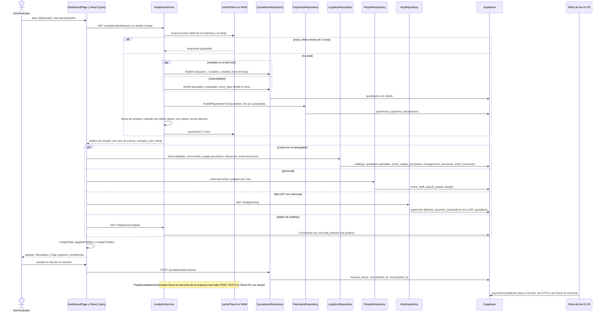

# Flujo: Del número del dashboard al dato de la base
> **Estado: verificado una vez contra el código** (commit 0de0ddb, 11-09-2026). Falta la etapa de completar lo que no quedó escrito. Parte del atlas; índice de flujos en flujos/00_INDICE_DE_FLUJOS.md y del sistema en ../00_MAPA_DEL_SISTEMA.md.

## 1. En palabras simples

El Dashboard no guarda cifras propias ni tiene un reloj que se las deje listas: cada vez que un administrador lo abre, el sistema lee cotizaciones, cuotas, abonos, compras y nómina, y saca las cuentas en ese momento.
**Venta** es lo aceptado o realizado, siempre **sin propina**. **Cobrado** son las cuotas pagadas, **con propina**, en el mes de su último abono. **Por cobrar** es lo que falta de cada cuota, ya descontados los abonos.
El **costo** suma insumos, recursos del evento y las sillas del personal. La "salida a proveedores" de la Caja **no es un pago registrado**: el sistema no anota pagos a proveedores ni gastos generales, así que la estima con ese mismo costo. El personal sí sale con la fecha real en que se marcó pagado en Nómina.
El motor guarda el panel una hora, pero lo borra con cualquier cambio hecho con sesión. El navegador guarda cada consulta 30 segundos, y ninguna otra pantalla la borra.
La misma palabra se cuenta distinto según dónde se mire: por fecha de creación o del evento, con o sin propina, con o sin reembolsos. Por eso el Dashboard no calza al peso con Post-Venta ni con la ficha del cliente (sección 8).

## 2. El recorrido paso a paso

### Bloque A — Abrir la pantalla

1. **Administrador, en pantalla.** Entra a `/dashboard`.
   - `frontend/src/App.tsx` la envuelve en `PermissionGuard` con `SECTION_ROLES.dashboard`, que es `ROLE_GROUPS.ADMIN_ONLY` (`frontend/src/constants/permissions.ts`). La página se carga con `React.lazy` (`importDashboard`).
   - En el motor, `AnalyticsController` y `HoyController` llevan `@Roles(...ADMIN_ONLY)`.
   - Las lecturas de logística que usa el panel heredan `OPERATIONS_AND_UP` de `LogisticsController`; `base-catalogo` es `SALES_AND_UP`.
   - `GET /people/costo-personal`, `GET /people/pagado-por-mes` y `GET /portal-receipts` no llevan `@Roles`: basta la sesión.
   - La ruta vieja `/analytics` redirige a `/dashboard` ("analytics vive ahora dentro del Dashboard (Fase 2, 23-07)").

2. **Pantalla: el período.** `DashboardPage` (`frontend/src/pages/dashboard/DashboardPage.tsx`) parte en "Último año" (`selectedTimeRange = "1_year"`).
   - Cada preset de `timeRangeOptions` arma `start_date` y `end_date` como texto `AAAA-MM-DD` con `toISOString().split("T")[0]`, o sea, la fecha **UTC** del navegador.
   - Si se toca "desde" o "hasta", manda `customRange`. `resolveRange()` decide cuál vale.

3. **Pantalla: once consultas en paralelo.** Todas pasan por `apiRequest` (`frontend/src/services/api.ts`) y por el `queryClient` de `frontend/src/lib/queryClient.ts`.

| Clave de React Query | Función del front | Endpoint | ¿Obedece el período? |
|---|---|---|---|
| `["dashboard", empresa, preset, desde, hasta]` | `getDashboardStats` | `GET /analytics/dashboard` | Sí |
| `["dashboard-complete", empresa, preset, desde, hasta]` | `getCompleteStats` | `GET /analytics/complete` | Sí |
| `["logistica","compras","base", empresa]` | `getBaseCatalogo` | `GET /logistics/base-catalogo` | No |
| `["dashboard-margin-events", empresa, preset, desde, hasta]` | `getWonEventsSince` | `GET /logistics/purchasing/won-events?from=` | Solo el inicio |
| `["dashboard-costo-personal", empresa]` | `getCostoPersonal` | `GET /people/costo-personal` | No; se cruza en el front |
| `["dashboard-pagado-personal", empresa]` | `getPagadoPersonalPorMes` | `GET /people/pagado-por-mes` | No |
| `["dashboard-proveedores", empresa]` | `getEventSupplyProvisions`, `getManagementResources`, `getAllEventResources` | `GET /logistics/purchasing/supply-provisions`, `GET /logistics/resources`, `GET /logistics/event-resources` | No; se cruza en el front |
| `["dashboard-tendencia", empresa]` | `getQuotations(COTIZACION)` | `GET /quotations?request_type=cotizacion` | No, a propósito |
| `["dashboard-motivos", empresa, preset]` | `getQuotations(COTIZACION, [RECHAZADA, CANCELADA])` | `GET /quotations?request_type=cotizacion&statuses=rechazada,cancelada` | Solo el inicio, filtrado en el front |
| `["dashboard-hoy", empresa]` | `getHoyAlerts` | `GET /analytics/hoy` | No, a propósito |
| `["postventa","comprobantes"]` | `listPortalReceipts` | `GET /portal-receipts` | No |

### Bloque B — El panel del motor (`GET /analytics/dashboard`)

4. **Motor: controller.** `AnalyticsController.getDashboardStats` (`api-rest/src/analytics/analytics.controller.ts`) valida `GetDashboardStatsDto` (`start_date` y `end_date` opcionales, `@IsDateString`) y llama a `AnalyticsService.getDashboardStats(user.company_id, rango)` (`api-rest/src/analytics/analytics.service.ts`).
   - Sin fechas usa desde el día 1 de hace 12 meses hasta ahora. La pantalla siempre las manda.
   - `new Date('AAAA-MM-DD')` es la medianoche UTC de ese día (ver sección 8: el día de hoy queda fuera).

5. **Motor: la memoria.** Arma la clave `<empresa>:dash:<desde>:<hasta>` y la busca en `cachePanel` (`api-rest/src/cache/memoria.ts`): una `CacheMemoria` de 300 entradas que vence en `HORA_MS` (1 hora). Si la encuentra, responde sin tocar la base.

6. **Motor: tres lecturas en paralelo** (`Promise.all`).
   - **Creadas en el período.** `QuotationsService.findAll` → `QuotationsRepository.findAll` sobre `quotations`, con `COLUMNAS_LISTA` más `mandante:client_contacts`, `clients(...)` y `companies(name)`.
     - Filtros: `company_id`, `request_type = 'cotizacion'`, `quotation_status` en los 7 estados, `created_at >= desde` y `created_at <= hasta`.
   - **Concretadas.** El mismo `findAll` con `quotation_status IN ('aceptada','realizada')` y `event_date >= desde`, **sin tope**: entran los eventos futuros ya confirmados.
   - **Clientes.** `ClientsService.findAll` → `ClientsRepository.findAll` (`clients` con `quotations(id, quotation_status)` y `client_contacts`). Solo alimenta `totalClients`, que la pantalla ya no muestra ("'Clientes' era un total de vanidad").

7. **Motor: cuotas y abonos.**
   - Junta los ids de ambas listas sin repetir y **sin las `cancelada`**: "conservan su historia de pagos, pero no son caja esperada".
   - `PaymentsService.findAllPaymentsFromQuotation(ids, empresa)` → `PaymentsRepository.findAllPaymentsFromQuotation` lee:
     - `payments.*`;
     - `quotations(company_id, quotation_number, clients(name))`;
     - `payment_transactions(id, amount, transaction_date, notes, payment_method, receipt_photo_url, created_at)`.
   - Filtra por `quotation_id IN (ids)` y ordena por `payment_number`.
   - Ojo: todos los ids viajan de una vez en la URL. El filtro `quotations.company_id` va sin `!inner`; la empresa queda protegida porque los ids ya vienen de consultas filtradas por empresa.

8. **Motor: las cuentas.**
   - `totalQuotations` = cuántas cotizaciones se crearon en el período.
   - `totalQuotationsByStatus[estado]` = `{count, amount}`, con `amount += saleWithoutTip(q)` (`api-rest/src/quotations/utils/tip.ts`).
   - `totalQuotationsByEventDate[mes]` = eventos y venta sin propina de las concretadas, por mes de `event_date`. El eje va de `desde` hasta el evento confirmado más lejano (`generateMonthRange`, `api-rest/src/analytics/utils/index.ts`).
   - `totalPaymentsDetailByMonth[mes]` usa un eje de `desde` al vencimiento más lejano.
     - **Cuota `pagado`:** suma `payment.amount` a `cobrado` en el mes de `fechaDelUltimoAbono(payment_transactions)` (`api-rest/src/payments/payments.service.ts`). Sin abonos usa `paid_date`, y si tampoco hay, `due_date`.
     - **Cuota `pendiente` o `vencido`:** suma a `porCobrar` el saldo `max(0, amount − Σ payment_transactions.amount)` en el mes de `due_date`.
     - **Mes fuera del eje:** la cuota **se descarta sin aviso** (`if (!(key in totalPaymentsDetailByMonth)) return`).
     - **Desglose:** `cobros` y `deudores` anotan cliente, número y monto; `porEvento` los junta por número de cotización.
   - `totalQuotationsByMonth` (por `created_at`) y `totalPaymentsByMonth` (por `due_date`) también se calculan, pero la pantalla ya no los dibuja.
   - Las claves de mes son `año-mesBase0` con la hora del servidor (`getFullYear()` y `getMonth()`): `2026-8` es septiembre.

9. **Motor: guarda y responde.** `cachePanel.set(clave, respuesta, HORA_MS)`. Si algo falla, responde 500 con el mensaje del error.

10. **Pantalla: arma sus filas** (`dashboardQuery.queryFn`).
    - `totalSales` = `amount` de `aceptada` + `amount` de `realizada` de `totalQuotationsByStatus`.
    - `moneyByMonth` = la unión ordenada de los meses de `totalQuotationsByEventDate` y `totalPaymentsDetailByMonth`, con `eventos`, `ventas`, `cobrado`, `porCobrar`, `cobros` y `deudores`.
    - `salesPipeline` = los 7 estados tal cual.

### Bloque C — Costos, márgenes y salidas (se calculan en el navegador)

11. **Base del catálogo.** `GET /logistics/base-catalogo` → `LogisticsController.baseCatalogo` junta en paralelo `findAllRecipeItems`, `findAllSupplies`, `findAllFurniture`, `findAllSuppliers`, `catalogServiceNames` y `fixedServiceCosts` de `LogisticsService` (tablas en el mapa 06). La clave se comparte con `useBaseLogistica` (Gestión, Cocina, Servicios, Mobiliario), `ComprasTab` y `QuotationForm`.

12. **Eventos ganados.** `GET /logistics/purchasing/won-events?from=<desde>` → `LogisticsService.findWonEventsSince` → `LogisticsRepository.findWonEventsSince` lee `quotations`.
    - Columnas: `id, quotation_number, event_date, event_end_date, people_count, total_amount, subtotal_amount, fixed_value, tip_percentage, tip_amount, items, provisioned_at, provisioned_cost, quotation_status, clients(name)`.
    - Filtros: `quotation_status IN ('aceptada','realizada')` y `event_date >= from`. A diferencia del paso 6, **no filtra `request_type`**.
    - Si falla, `getWonEventsSince` (`frontend/src/services/logistics.service.ts`) devuelve `[]` sin avisar.

13. **Costo del personal.** `GET /people/costo-personal` → `PeopleService.costoPersonal` → `PeopleRepository.costoPersonalPorEvento`.
    - Lee `event_staff (quotation_id, role_id, amount)` con `quotation_id` no nulo y agrupa por evento y cargo (`total`, `sillas`).
    - Es el costo "desde las sillas" (`84_las_sillas.sql`): las sillas con nombre van al monto acordado y las vacías al estimado. `tip_amount` no entra.

14. **Provisiones y recursos.** `provQuery` pide tres listas completas de la empresa:
    - `GET /logistics/purchasing/supply-provisions` → `findSupplyProvisions` → `event_supply_provisions.*`;
    - `GET /logistics/resources` → `findAllResources` → `management_resources.*`;
    - `GET /logistics/event-resources` sin `quotationId` → `findAllEventResources` → `event_resources.*`.

15. **`marginData`**, una función que se ejecuta dentro de `DashboardPage` en cada render.
    - Si falta la base, falta `provQuery.data` o no hay eventos, devuelve mapas vacíos: costo cero.
    - Por cada evento ganado, con clave de mes **UTC** de `event_date`:
      - **Estimación:** `consolidateEvent(items, people_count, ctx, acc)` (`frontend/src/utils/eventConsolidation.ts`) da `costoInsumos` (receta × precio del insumo, con merma) y `costoFijos` (costos fijos del catálogo).
      - **Insumos:** `provisioned_cost` si hay `provisioned_at` y `provisioned_cost`; si no, la estimación.
      - **Recursos:** `costoDeRecursos(líneas de event_resources del evento, personas)` (`frontend/src/utils/costoDeRecursos.ts`).
      - **Personal:** la suma de `costo-personal` de ese evento.
      - **Proveedores:** `insumos + (recursos, si el evento tiene recursos o personal cargados; si no, costoFijos)`.
      - **Estimado:** es `true` si el evento no está provisionado **o** no tiene nada cargado.
    - Suma `proveedores` y `personal` en `byMonth` y anota el desglose: `ventas` (con `saleWithoutTip(ev)` de `frontend/src/utils/quotationMoney.ts`), `proveedores` y `personal`.
    - **Salida a proveedores** (`salidas`), siempre por el mismo monto `proveedores`:
      - con `provisioned_at`, sale en ese mes (UTC);
      - sin provisión y con el evento `realizada`, sale en el mes del evento;
      - `aceptada` sin provisionar: no sale nada.
    - El acumulador `acc` alimenta también el "Análisis de proveedores" (paso 23).

16. **Lo pagado al personal.** `GET /people/pagado-por-mes` → `PeopleRepository.pagadoDePersonalPorMes` lee en paralelo:
    - `payroll_people (payroll_id, person_id, jornada_paid, propina_paid, paid_at)` con `paid_at` no nulo;
    - `event_staff (person_id, payroll_id, tip_payroll_id, amount, tip_amount)`;
    - `people (id, name)`.

    La función pura `pagadoDePersonalPorMes` (`api-rest/src/people/utils/pagado-por-mes.ts`) suma por mes de `paid_at` (hora del servidor) la jornada si `jornada_paid` y la propina si `propina_paid`, con el desglose por persona.

17. **Totales de la pantalla.**
    - `pagadoPorMes` = `salidas` (proveedores) + `jornadas + propinas` (personal).
    - `margenTotales` suma `ventas` de **todas** las filas de `moneyByMonth` y el costo de `marginByMonth`, y queda `estimado` si algún mes lo está.

### Bloque D — Lo que se ve

18. **Tarjetas del período.**
    - "Ventas concretadas" = `totalSales` ("del período, sin propina").
    - "Eventos concretados" = conteo de `aceptada` + `realizada`, "de N cotizadas".
    - "Tasa de conversión" = concretadas × 100 / `totalQuotations`.
    - "Ticket promedio" = `totalSales` / concretadas.
    - "Margen del período" = `margenTotales.ventas − margenTotales.costo`, con "~" si hay costo estimado.
    - Las cuatro primeras cuentan por **fecha de creación**; el margen, por **fecha del evento**.

19. **"Ingresos y Caja por Mes"** (`frontend/src/pages/dashboard/IngresosYCaja.tsx`). Recibe `moneyByMonth.slice(-12)` (las **últimas** 12 columnas), `marginByMonth`, `pagadoPorMes` y `marginData.desglose`.
    - **Resultado, por fecha del evento:** Eventos, Ventas, Costo proveedores, Costo personal, Margen (`ventas − costo`) y Margen %.
    - **Caja, por fecha del movimiento:** Cobrado, Pagado proveedores, Pagado personal, Por cobrar (en rojo si el mes no es futuro) y Flujo de caja = `cobrado − pagado proveedores − pagado personal + por cobrar`.
    - Las cifras van en miles. La columna TOTAL suma solo las columnas visibles. El globo de cada cifra lista sus clientes o personas.

20. **"Pipeline de Negocio".** Las 7 columnas de `salesPipeline` en zonas vivas, ganadas y perdidas, con monto sin propina por fecha de creación. "Venta viva en juego" = `enviada` + `en_negociacion`.

21. **Tendencias interanuales** (no obedecen el período). Salen de `tendenciaQuery`, que trae todas las cotizaciones de la empresa (`frontend/src/pages/dashboard/tendencias.ts`):
    - "Cotizaciones por Mes" y "Cotizado por Mes": `agruparPorMes(filas, "created_at")`, todos los estados;
    - "Eventos por Mes" y "Vendido por Mes": solo `ES_EVENTO` (`aceptada`, `realizada`), por `event_date`;
    - el monto es `total_amount`, **con propina**, y el mes sale de cortar el texto ISO (`slice(0, 7)`);
    - muestran 12 meses atrás y 4 adelante (`ventanaMeses(12, 4)`); antes del primer mes con datos no se dibuja nada.

22. **La cosecha: la única escritura del Dashboard.** Pinchar una barra abre `cosechaDelMes`: quién cotizó ese mes, o qué eventos se hicieron. Al cambiar el chip "¿Volvió a pedirlo?":
    - `estadoMut` escribe primero en la caché `["dashboard-tendencia"]` (optimista).
    - `guardarEstadoCosecha` → `POST /quotations/:id/cosecha` → `QuotationsController.setHarvestStatus` → `QuotationsService.setHarvestStatus`. Este verifica que la cotización sea de la empresa y llama a `QuotationsRepository.update` con `harvest_status` (o `null` para volver a "Automático"), `recontacted_at` y `recontacted_by`.
    - Si falla, `onError` repone la foto anterior y avisa con `toast.error`. Al terminar el último guardado en vuelo, `onSettled` invalida `["dashboard-tendencia"]`.
    - Como es un POST con sesión, además se borra la memoria del panel de la empresa (paso 26).

23. **Secciones de análisis.**
    - **Tablas (`GET /analytics/complete`).** `AnalyticsService.getCompleteStats` busca la clave `<empresa>:stats:<desde>:<hasta>` en `cachePanel` (1 hora). Si no está, hace 9 llamadas `supabase.client.rpc` en paralelo con `p_company_id`, `p_from_date` y `p_to_date`; si una falla, responde 500.
      - Las funciones están en `db_functions_analytics_23_07.sql`, en la raíz del repo.
      - Filtran por `created_at::date`, cuentan venta como `aceptada` + `realizada` y suman `total_amount` **con propina**.
      - **No filtran `request_type`**.
    - **"Por qué perdimos"** (`perdidasQuery`): rechazadas y canceladas con `updated_at` (o `created_at`) desde el inicio del período, agrupadas por `loss_reason`, con `total_amount` con propina.
    - **"Análisis de proveedores"** (`proveedores`) cruza:
      - el catálogo y `acc.supplyTotals` del margen;
      - `event_supply_provisions` de los eventos ganados;
      - `costoDeRecursos` por evento y recurso;
      - el personal de las sillas.

24. **Fila "Para actuar hoy".** No obedece el período y se refresca cada 5 minutos.
    - `GET /analytics/hoy` → `HoyController.alerts` → `HoyRepository.alerts` (`api-rest/src/analytics/hoy.controller.ts`), **sin memoria**. Hace cuatro lecturas en paralelo:
      - `payments (id, amount, status, due_date)` con `quotations!inner(company_id, quotation_status)`: cuotas `pendiente` o `vencido` de cotizaciones que no estén `cancelada`;
      - `quotations` `aceptada` con `event_date` entre hoy y hoy + 30 días;
      - `quotations` de tipo `requerimiento` en `solicitada`;
      - `quotations` `enviada` con `updated_at` de hace más de 7 días.
    - Después lee `payment_transactions (payment_id, amount)` de a 200 ids. `sumarPorCobrar(cuotas, abonadoPorCuota, hoy)` devuelve `{pendiente, vencido}`:
      - resta los abonos y el saldo nunca baja de cero;
      - una cuota es vencida si `status = 'vencido'` o `due_date < hoy` (fecha UTC).
    - La tarjeta "Por cobrar" muestra `pendiente + vencido` y, si hay vencido, lleva a `/post-venta?plata=vencido`.
    - "Comprobantes del portal": `GET /portal-receipts` → `PortalReceiptsController.list` → `PortalReceiptsRepository.listPending` (`portal_receipts` con `status = 'pendiente'`).

### Bloque E — Relojes y memoria

25. **Relojes que tocan lo que el panel lee.** Solo corren en producción: `ScheduleModule.forRoot({ cronJobs: process.env.NODE_ENV === 'production' })` en `api-rest/src/app.module.ts`.
    - `PaymentsService.updateOverduePayments` (`@Cron(CronExpression.EVERY_DAY_AT_1AM)`) → `PaymentsRepository.updateOverduePayments`: `payments.status = 'vencido'` donde `status = 'pendiente'` y `due_date <= ahora`.
    - Los demás relojes solo leen para mandar correos o avisos:
      - `PaymentsCronService`, a las 11:00, cobranza;
      - `QuotationsCronService`, a las 11:00 el seguimiento y los lunes el resumen semanal;
      - `MovilService`, cada 30 minutos; inserta en `notifications`.
    - **Ningún reloj precalcula cifras del Dashboard.** No hay archivo de cron en `api-rest/src/analytics`.

26. **Borrado de la memoria del panel.** `PanelInvalidationInterceptor` (`api-rest/src/cache/panel-invalidation.interceptor.ts`, registrado como `APP_INTERCEPTOR` en `app.module.ts`) funciona así:
    - deja pasar sin tocar nada los GET y las peticiones sin `req.user.company_id`;
    - en todo POST, PATCH o DELETE con sesión que termina bien, llama a `invalidarPanelEmpresa(companyId)`;
    - esa función borra de `cachePanel` todas las claves `<empresa>:`, o sea `dash` y `stats`.

### Bloque F — De vuelta: quién produce cada dato

27. **Los escritores de lo que el panel suma.** Todos trabajan con sesión, así que todos borran la memoria del motor al guardar.
    - `quotations.total_amount`, `tip_amount`, `items`, `quotation_status` y `event_date`:
      - cotizador (flujo 02);
      - aceptar (flujo 04);
      - cambiar total (flujo 05), que además mueve cuotas y crea o consume `refunds` en `QuotationsService.update`;
      - anular (flujo 07);
      - marcar realizado (flujo 08).
    - `payments` y `payment_transactions`: plan de pagos (flujo 04), abonos y `normalizePaymentAfterTransactions` (flujo 06).
    - `provisioned_at`, `provisioned_cost`, `event_supply_provisions` y `event_resources`: Compras y recursos del evento (flujo 11).
    - `event_staff.amount` y `payroll_people.paid_at`: planificación (flujo 09) y "Ya la pagué" en Nómina (flujo 10).
    - `refunds`: **ninguna cifra del panel la lee**.

## 3. Diagrama

## 4. Datos que cambian

El Dashboard es casi todo lectura. Esto es lo único que escribe o cambia mientras se usa:

| tabla | columnas | en qué paso | quién escribe |
|---|---|---|---|
| `quotations` | `harvest_status`, `recontacted_at`, `recontacted_by` | 22 | `QuotationsService.setHarvestStatus`, desde el chip de la cosecha |
| `payments` | `status` (`pendiente` → `vencido`) | 25 | reloj `PaymentsService.updateOverduePayments` |
| `cachePanel` (RAM del motor, no es tabla) | claves `<empresa>:dash:<desde>:<hasta>` y `<empresa>:stats:<desde>:<hasta>` | 5, 9, 23, 26 | `AnalyticsService` la llena; `PanelInvalidationInterceptor` la borra |
| caché de React Query (navegador) | las 11 claves del paso 3 | 3, 22 | `DashboardPage` |

Y esto es lo que lee, con quién lo escribió antes:

| tabla | columnas | en qué paso | quién escribe |
|---|---|---|---|
| `quotations` | `quotation_status`, `request_type`, `created_at`, `event_date`, `total_amount`, `tip_amount`, `tip_percentage`, `subtotal_amount`, `fixed_value`, `people_count`, `items`, `provisioned_at`, `provisioned_cost`, `quotation_number`, `loss_reason`, `updated_at`, `harvest_status` | 6, 12, 21, 23, 24 | flujos 02, 04, 05, 07, 08 y 11 |
| `payments` | `amount`, `status`, `due_date`, `paid_date`, `payment_number`, `quotation_id` | 7, 24 | flujos 04, 05 y 06; reloj de vencidas |
| `payment_transactions` | `amount`, `transaction_date`, `payment_id` | 7, 24 | flujo 06 |
| `clients` | fila completa (para contar), `name` en los desgloses | 6, 7, 12 | mapa 09 y formularios públicos |
| `event_supply_provisions` | `quotation_id`, `supply_id`, `cost`, `provisioned_at`, `supplier_id`, `supplier_name` | 14, 23 | Compras (flujo 11) |
| `management_resources` | `id`, `name`, `type` | 14, 23 | catálogo de recursos (mapa 06) |
| `event_resources` | `quotation_id`, `resource_id`, `quantity`, `price_fixed`, `price_per_person` | 14, 15, 23 | recursos del evento (flujo 11) |
| `event_staff` | `quotation_id`, `role_id`, `amount`, `person_id`, `payroll_id`, `tip_payroll_id`, `tip_amount` | 13, 16 | planificación y liquidación (flujos 09 y 10) |
| `payroll_people` | `payroll_id`, `person_id`, `jornada_paid`, `propina_paid`, `paid_at` | 16 | "Ya la pagué" (flujo 10) |
| `people` | `id`, `name` | 16 | directorio (mapa 07) |
| `portal_receipts` | `status`, más `quotations`, `payments` y `client_contacts` | 24 | portal del cliente (flujo 06) |
| recetas, insumos, mobiliario, proveedores y costos fijos del catálogo | lo que devuelve `base-catalogo` | 11, 15 | catálogo y logística (mapas 05 y 06) |
| `refunds` | ninguna | — | se nombra porque **no** se lee |

## 5. Efectos automáticos y colaterales

- **Correos y notificaciones:** abrir el Dashboard no manda nada, y guardar la cosecha tampoco.

- **Memoria del motor (`cachePanel`, `api-rest/src/cache/memoria.ts`):**
  - Dura 1 hora y guarda hasta 300 entradas entre todas las empresas; al llenarse bota la más antigua. Cada combinación de fechas es una entrada distinta.
  - Se borra con cualquier escritura con sesión, a propósito de más: "borrar de más es gratis, mostrar números viejos no" (`PanelInvalidationInterceptor`, 28-07). El borrado va **después** de la escritura: "borrar antes dejaría una carrera que re-guarda datos viejos".
  - **No** se borra con:
    - el reloj de vencidas. No cambia ninguna cifra del panel, que solo distingue `pagado`.
    - los endpoints públicos, como `POST /quotations/public/:company_id`, que crea un `requerimiento` (`QuotationsService`, `request_type: RequestType.REQUERIMIENTO`). No entra al panel, pero sí a las funciones de análisis, que no filtran `request_type`: la tabla de estados puede quedar hasta 1 hora atrasada.
    - SQL corrido a mano en Supabase.
  - Un redeploy la deja vacía.

- **Fila HOY:** no tiene memoria en el motor; en el navegador se refresca cada 5 minutos (`refetchInterval`).

- **React Query** (`frontend/src/lib/queryClient.ts`): `staleTime` 30 s, `gcTime` 30 min, `refetchOnWindowFocus` y `retry: 2`. Una búsqueda de `dashboard` fuera de `pages/dashboard/` no encuentra ninguna invalidación.

| Clave | Frescura | Quién la invalida |
|---|---|---|
| `["dashboard", …]` | 30 s, `keepPreviousData` | Solo el botón "Actualizar datos ahora" (`dashboardQuery.refetch()`) |
| `["dashboard-complete", …]`, `["dashboard-margin-events", …]`, `["dashboard-proveedores", …]`, `["dashboard-costo-personal", …]`, `["dashboard-pagado-personal", …]`, `["dashboard-motivos", …]` | 30 s | Nadie |
| `["dashboard-tendencia", …]` | 30 s | La cosecha (paso 22) |
| `["dashboard-hoy", …]` | 30 s y recarga cada 5 min | Nadie |
| `["logistica","compras","base", empresa]` | 5 min | La comparten Compras, Gestión y el cotizador (mapa 06) |
| `["postventa","comprobantes"]` | 0 | `refreshAfterSave` de `PostVentaPage` (prefijo `["postventa"]`) |

- **Consecuencia práctica:** si se registra un abono en Post-Venta y se vuelve al Dashboard antes de 30 segundos desde su última carga, se ven las cifras viejas hasta volver a enfocar la pestaña o apretar Actualizar. Pasado ese plazo, se muestran las viejas y se reemplazan solas por detrás. El motor ya borró su memoria, así que la recarga trae datos frescos.
- **El botón "Actualizar"** solo recarga el panel del motor: no recarga márgenes, análisis, HOY, personal ni tendencias.
- **Colateral:** guardar la cosecha borra la memoria del panel de toda la empresa. Es inofensivo.

## 6. Reglas de negocio que gobiernan el flujo

**Qué cuenta cada cifra.**

| Cifra | Sale de | Estados | Fecha que manda | Propina | Reembolsos | Abonos parciales |
|---|---|---|---|---|---|---|
| Ventas concretadas (tarjeta) | `totalQuotationsByStatus` | `aceptada` + `realizada`, solo `cotizacion` | `created_at` en el período | Sin | No | — |
| Eventos concretados y conversión | conteos de `totalQuotationsByStatus` / `totalQuotations` | concretadas / los 7 estados | `created_at` | — | — | — |
| Margen del período (tarjeta) | todas las filas de `moneyByMonth` − `marginByMonth` | `aceptada` + `realizada` | `event_date` desde el inicio, sin tope | Sin | No | — |
| Resultado · Ventas | `totalQuotationsByEventDate` | `aceptada` + `realizada` | `event_date` desde el inicio, sin tope | Sin | No | — |
| Resultado · Costo proveedores | insumos (congelados o por receta) + recursos, o `costoFijos` si no hay nada cargado | idem | `event_date` (UTC) | — | — | — |
| Resultado · Costo personal | Σ `event_staff.amount` | idem | `event_date` (UTC) | Sin (`tip_amount` no entra) | — | — |
| Caja · Cobrado | `payments.amount` de cuotas `pagado` | cotizaciones creadas en el período o concretadas con evento desde el inicio; nunca `cancelada` | último `transaction_date`, si no `paid_date`, si no `due_date` | Con | No se restan | Solo cuenta cuando la cuota queda `pagado` |
| Caja · Pagado proveedores | el mismo costo proveedores, **no un pago real** | `aceptada` + `realizada` con evento desde el inicio | `provisioned_at`; si no, `event_date` solo si `realizada` | — | — | — |
| Caja · Pagado personal | `event_staff.amount` + `tip_amount` de nóminas marcadas | todas las nóminas | `payroll_people.paid_at` | Con | — | — |
| Caja · Por cobrar | `payments.amount − Σ payment_transactions.amount` | igual que Cobrado, cuotas `pendiente` o `vencido` | `due_date` | Con | No | Se restan |
| Caja · Flujo de caja | cobrado − pagado proveedores − pagado personal + por cobrar | — | — | — | — | — |
| HOY · Por cobrar | cuotas abiertas menos abonos (`sumarPorCobrar`) | toda cotización no `cancelada`, sin período | vencido si `status = 'vencido'` o `due_date < hoy` | Con | Excluidos a propósito | Se restan |
| Pipeline · Monto | `totalQuotationsByStatus` | los 7 | `created_at` | Sin | — | — |
| Cotizado / Vendido por Mes | `total_amount` | todos / `aceptada` + `realizada` | `created_at` / `event_date`, sin período | **Con** | — | — |
| Tablas de análisis (RPC) | `SUM(total_amount)` | venta = `aceptada` + `realizada`; incluye `requerimiento` | `created_at::date` | **Con** | — | — |
| Por qué perdimos | `total_amount`, `loss_reason` | `rechazada` + `cancelada` | `updated_at` o `created_at` desde el inicio | **Con** | — | — |

**Las reglas, con su evidencia.**

1. **La propina no es venta ni margen** (Felipe, 24-07). "La propina pasa por la empresa pero NO es venta ni margen. Va entera al equipo" (`api-rest/src/quotations/utils/tip.ts` y su espejo `frontend/src/utils/quotationMoney.ts`). En `docs/arquitectura/10_MODULO_DE_PERSONAS.md`: *"es plata que entra y sale, somos intermediarios"*. Lo cobrado sí la lleva, porque el plan de cuotas debe calzar al peso con `total_amount` (`PaymentsService.createPaymentPlan`, "EL PORTERO DEL PLAN (caso 501, 06-09)").
2. **El monto de la propina se guarda, no se recalcula** (25-07, `37_tip_amount.sql`): "el monto es el hecho". `tipAmountOf` solo lo reconstruye para borradores o filas a medias.
3. **Venta es `aceptada` + `realizada`** (23-07). En `db_functions_analytics_23_07.sql`: "Antes solo 'aceptada': cada evento marcado realizado DESAPARECÍA de ingresos/conversión/uso". El mismo criterio usan `getDashboardStats`, `findWonEventsSince` y `ES_EVENTO`.
4. **El período gobierna todo el tablero, con dos lecturas** (Fase 1, 23-07, comentario en `AnalyticsService.getDashboardStats`): las creadas para contadores y pipeline; las concretadas por fecha de evento para eventos, ventas y caja. Hay dos excepciones a propósito: la tendencia interanual (06-08, "estos gráficos NO obedecen al filtro del período") y la fila HOY ("el hoy no se filtra").
5. **Las anuladas no son caja esperada**, pero conservan su historia de pagos (comentario en `getDashboardStats`; enum `QuotationStatus.CANCELADA`).
6. **Cobrado va en el mes en que entró la plata** (28-08). "Medido ese día en producción: de 174 cuotas pagadas así, 55 caían en el mes equivocado ($101.066.964; la peor, 410 días de desfase)". `fechaDelUltimoAbono` toma el máximo explícito porque la consulta no ordena: "de 52 cuotas pagadas en varios abonos, 38 mostraban la fecha equivocada".
7. **Por cobrar descuenta los abonos.** En HOY desde el 07-08: la #332 mostraba $1.623.600 vencidos cuando faltaban $823.600 (commit `d8cfe01`). En el panel desde el 28-08: "la cuota de Brito Pradenas ($1.623.600) figuraba entera aunque tenía $800.000 abonados" (commit `763f0f0`).
8. **Un reembolso no es deuda** (07-08, `HoyRepository.alerts`): "un reembolso nace cuando el cliente pagó de MÁS (la #93 abonó $1.638.000 sobre un total de $1.170.000)".
9. **Resultado por fecha del evento; Caja por fecha del movimiento** (Felipe, 29-08, `IngresosYCaja.tsx`): *"este gráfico mezcla flujo de caja y EERR (puede ser el mismo pero partido)"*. Costo y pago van separados en proveedores y personal "para poder validar tus cálculos".
10. **Cuándo sale la plata a proveedores** (Felipe, 29-08, `DashboardPage.marginData`): si se provisionó, el día que se provisionó; si no, pero el evento se realizó, el día del evento ("nunca el día que lo marcaste realizado"); aceptado sin provisionar, todavía no.
11. **El personal sale de caja cuando se marca pagado en Nómina, con propina** (Felipe, 29-08, `pagado-por-mes.ts`): "en el resultado no es costo (...) pero en la CAJA sí es plata que sale".
12. **Costo del evento = insumos + recursos asignados** (24-07, "lo pilló Felipe"). Los recursos **reemplazan** a `costoFijos`, porque ya traen los fijos con el precio negociado. El fijo de un recurso mixto se cobra una vez por evento (16-08, `costoDeRecursos.ts`). El personal sale de las sillas (`84_las_sillas.sql`).
13. **El flujo de caja no es caja pura** (`IngresosYCaja.tsx`): "mezcla lo cobrado con lo que aún deben, es la POSICIÓN del mes".
14. **El desglose va por evento, no por cuota** (Felipe, 31-08): "un evento cobrado en nueve cuotas es UNA línea".
15. **Cifras en miles** (Felipe, 23-07), con el monto exacto al pasar el mouse.
16. **Un mes sin historia es un hueco, no un cero** (06-08, `serieInteranual`): "un cero dice 'no vendimos nada' y es mentira cuando en realidad el sistema todavía no existía".
17. **En la cosecha, la máquina sugiere y Felipe decide** (07-08, `tendencias.ts`, migraciones 61 a 63): "ninguna regla le gana al ojo de quien vende". Cada fila manda sobre sí misma.
18. **El Dashboard es solo de administrador** (Fase 3): `@Roles(...ADMIN_ONLY)` en el motor y `ADMIN_ONLY` en `permissions.ts`.

## 7. Si cambias algo en este flujo

1. **Si cambias** el mes en que cae "Cobrado" (volver a `due_date` o tomar el primer abono), **pasa** que la plata aparece en el mes equivocado, **porque** una cuota se paga cuando se paga, no cuando vence. Ya pasó: 55 de 174 cuotas y $101.066.964 mal ubicados, y 38 de 52 cuotas con la fecha del primer abono (28-08). Evidencia: `fechaDelUltimoAbono` y el comentario de `getDashboardStats`.
2. **Si sumas** cuotas abiertas sin restar `payment_transactions` (en el panel o en HOY), **pasa** que se muestra hasta el doble de deuda, **porque** la cuota conserva su monto original y lo abonado vive aparte. Ya pasó dos veces: #332 en HOY (07-08) y Brito Pradenas en el panel (28-08). Evidencia: `sumarPorCobrar`, `por-cobrar.spec.ts` y commit `763f0f0`. La ficha del cliente todavía suma así (sección 8).
3. **Si sumas** `costoFijos` del catálogo encima de los recursos del evento, **pasa** que el margen sale inflado por doble conteo, **porque** los recursos importados ya traen los fijos. Ya pasó en el Dashboard (24-07) y en Servicios (12-08). Si quitas la guarda `tieneCargados`, un evento con solo personal también cuenta los fijos encima. Evidencia: comentarios de `DashboardPage.marginData` y mapa 06.
4. **Si cambias** la fórmula del costo en una sola pantalla, **pasa** que el mismo evento muestra dos costos en Gestión, Servicios y Dashboard, **porque** las tres deben usar `costoDeRecursos` y `consolidateEvent`. Ya pasó (revisión del 16-08). Evidencia: encabezado de `frontend/src/utils/costoDeRecursos.ts`.
5. **Si tocas** las funciones SQL de análisis o migras la base, **pasa** que las tablas de análisis pueden desaparecer, **porque** no viven en ninguna migración numerada. Su única copia es `db_functions_analytics_23_07.sql`. Ya pasó: "el switchover del 22-07 migró datos, no funciones → Analytics quedó caída". Evidencia: encabezado de ese archivo.
6. **Si sumas** montos `numeric` con `+` sin `Number()`, **pasa** que se pegan como texto, **porque** "Supabase entrega los numeric como TEXTO". Ya pasó con la cuota fantasma de $0 de la #486 (20-08, `normalizePaymentAfterTransactions`). Hoy `getDashboardStats` suma `payment.amount` sin `Number()` en `cobrado` y `totalPaymentsByMonth` (pregunta abierta 2).
7. **Si fechas** la salida a proveedores con el día en que se marcó realizado, **pasa** que el costo cae semanas después, **porque** marcar realizado no es cuando se compró (Felipe, 29-08). Evidencia: `DashboardPage.marginData`.
8. **Si usas** `total_amount` en vez de `saleWithoutTip` para venta o margen, **pasa** que la propina infla la venta, **porque** va entera al equipo (regla 1). Y al revés: **si restas** propina en Cobrado o en el plan, deja de calzar con lo que el cliente paga. Evidencia: `tip.ts` y `quotationMoney.ts`, "si cambias uno, cambia el otro".
9. **Si agregas** una escritura de cotizaciones o pagos que no pase por HTTP con sesión (un reloj, un endpoint `@Public`, un script), **pasa** que el panel y las tablas muestran números viejos hasta por 1 hora, **porque** el interceptor solo borra la memoria cuando hay `req.user.company_id`. Evidencia: `PanelInvalidationInterceptor.intercept`.
10. **Si mueves** `invalidarPanelEmpresa` antes de `next.handle()`, **pasa** que una lectura en paralelo vuelve a guardar datos viejos por 1 hora, **porque** borrar antes deja la carrera abierta. Evidencia: comentario del interceptor.
11. **Si agregas** un filtro nuevo al panel (estado, tipo de evento, vendedor) sin sumarlo a `clavePanel` o `claveStats`, **pasa** que un filtro recibe la respuesta guardada de otro, **porque** la clave hoy solo lleva empresa y fechas. Evidencia: `AnalyticsService.getDashboardStats` y `getCompleteStats`.
12. **Si agregas** una columna a `quotations` que el panel necesite, **pasa** que no llega, **porque** `COLUMNAS_LISTA` ("columna nueva en la tabla ⇒ agregarla acá") y el `select` de `findWonEventsSince` son listas explícitas. Así se agregaron los campos de propina el 31-08. Evidencia: `QuotationsRepository.findAll` y `LogisticsRepository.findWonEventsSince`.
13. **Si mezclas** claves de mes, **pasa** que una columna queda vacía y otra doble, **porque** hay dos formatos:
    - el motor, `pagado-por-mes.ts` e `IngresosYCaja` usan `año-mesBase0` sin cero (`2026-8` = septiembre);
    - `tendencias.ts` usa `AAAA-MM` en base 1 (`2026-09`).
    Evidencia: `generateMonthRange`, `llaveDelMes` ("la misma que usa el panel") y `claveDe` en `tendencias.ts`.
14. **Si agregas** un estado a `ESTADOS_COSECHA` solo en el front, **pasa** que el chip vuelve solo a su valor anterior, **porque** su gemela en `api-rest/src/quotations/dto/estado-cosecha.dto.ts` lo rechaza. Evidencia: comentario "Se tocan las dos o ninguna" en `tendencias.ts`.
15. **Si renombras** `aceptada` o `realizada`, **pasa** que se rompen en silencio las funciones SQL, `findWonEventsSince`, `ES_EVENTO` y HOY, **porque** hay literales de texto repartidos. Evidencia: `db_functions_analytics_23_07.sql`, `logistics.repository.ts`, `tendencias.ts` y flujo 08, sección 7.
16. **Si agregas** código a `DashboardPage.tsx`, **pasa** que el portero lo frena, **porque** es uno de los 7 gigantes congelados por tamaño. Hay que sacar la pieza a su propio archivo, como se hizo con `IngresosYCaja.tsx` (commit `829695c`, "Bajó de 2900 a 2712"). Evidencia: `CLAUDE.md` y `frontend/scripts/portero-kit-de-la-casa.sh`.
17. **Si cambias** la clave `["logistica","compras","base", empresa]` o su `queryFn` en una pantalla, **pasa** que Compras, Gestión, el cotizador y el Dashboard reciben lo que llegue primero, **porque** comparten una sola caché. Evidencia: mapa 06 y `useBaseLogistica`.
18. **Si pones** `@Roles(...ADMIN_ONLY)` al `PeopleController` completo, **pasa** que se rompen Post-Venta y el Dashboard, **porque** también llaman rutas de `/people`. Evidencia: mapa 08, sección 7.

## 8. Casos borde y estados raros

**Por qué el Dashboard no calza con otras pantallas.**

| Pantalla | Cómo cuenta | Diferencia con el Dashboard | Evidencia |
|---|---|---|---|
| Post-Venta, lista y totales | saldo por evento = `total_amount − (Σ paid_amount − reembolsos pagados)`; excluye anulados; sin período | Resta reembolsos y parte del total de la cotización, no de la suma de cuotas. HOY y Caja no miran reembolsos. | `PostVentaPage.fetchEvents` y `totals`; `getPaidRefundsByQuotation` |
| Ficha del cliente | `saldoPendiente` = Σ `amount` de cuotas `pendiente` o `vencido` | **No resta abonos** (el error ya corregido en HOY y en el panel) e incluye cuotas de eventos anulados. `totalVendido` va con propina. | `ClientsRepository.findSummary`; `ClientDetailPage` |
| Cotizador, cuadro de margen | insumos por receta + `costoFijos` del catálogo | No usa recursos del evento ni sillas, "a propósito", porque el evento aún no existe | `QuotationForm.margenCotizador` |
| Gráfico "Vendido por Mes" | `total_amount` por `event_date` | Con propina y sin período; el Resultado va sin propina y dentro del período | `tendencias.ts`; `getDashboardStats` |
| Tablas de análisis | `SUM(total_amount)` por `created_at::date` | Con propina e incluye requerimientos; la tarjeta de ventas va sin propina y solo cotizaciones | `db_functions_analytics_23_07.sql` |
| Tarjeta "Margen del período" vs TOTAL del Resultado | todas las filas vs últimas 12 columnas | Si el eje pasa de 12 meses (eventos o cuotas futuras), no calzan | `margenTotales`; `moneyByMonth.slice(-12)` |

**Fechas y horas.**
- **El día de hoy queda fuera de los contadores.** `end_date` llega como `AAAA-MM-DD` y `new Date()` lo convierte en medianoche UTC. `created_at <= hasta` deja fuera todo lo creado desde las 00:00 UTC de hoy, que en Chile son las 20:00 o 21:00 de ayer. Esas cotizaciones no cuentan en tarjetas ni pipeline, pero sí en las tablas de análisis (`created_at::date BETWEEN`).
- **El navegador también corre la fecha.** Después de esa hora en Chile, `toISOString()` ya da la fecha de mañana.
- **Las funciones de uso de servicios cortan el último día.** `get_variable_services_usage` y `get_fixed_services_usage` comparan `created_at BETWEEN` sin `::date`, así que el último día del rango queda afuera.
- **Mes de creación y de pago por hora del servidor.** `getDashboardStats` y `pagado-por-mes.ts` usan `getMonth()` con la zona del servidor. Una cotización creada a las 23:00 de Chile del 31-08 cae en septiembre si el servidor corre en UTC (pregunta abierta 3; ver también flujo 10, caso borde 7).
- **Una cuota que vence hoy.** El reloj de la 01:00 marca `due_date <= ahora`, así que ese mismo día ya queda `vencido`. `sumarPorCobrar` dice "el día de hoy NO está vencido", pero respeta primero el `status` guardado: en producción esa cuota ya se ve vencida. En desarrollo, sin reloj, se ve pendiente.

**Plata que no aparece.**
- **Cobro fuera del eje.** Una cuota pagada cuyo último abono es anterior al inicio del período se descarta sin aviso.
- **Cobros de eventos viejos.** Las cuotas de cotizaciones creadas antes del período y con evento anterior al inicio no se leen. Un pago recibido este mes por un evento del año pasado no sale en "Cobrado".
- **Anuladas con abonos.** La plata que sí entró no aparece en Caja ni en HOY.
- **Reembolsos pagados.** Nunca se restan de "Cobrado" ni del flujo, así que la Caja queda por encima de lo neto.
- **Abono parcial en una cuota antigua sin partir.** No suma en "Cobrado" (la cuota no está `pagado`) y sí se resta de "Por cobrar", así que ese monto no aparece en ninguna de las dos filas. Desde la regla del 20-07 los abonos parciales parten la cuota (`normalizePaymentAfterTransactions`), pero quedan casos antiguos (la #332).
- **Sobrepago.** "Cobrado" cuenta el `amount` de la cuota, no la suma de sus abonos; el exceso vive en `refunds`, que no se lee.

**Cargas a medias o con error.**
- **Margen al 100 % mientras carga.** Mientras falte la base, `provQuery` o los eventos, `marginData` devuelve costo cero y la tarjeta muestra margen igual a la venta.
- **Margen al 100 % con error.** Si `getWonEventsSince` falla, devuelve `[]` y el margen queda así hasta la próxima carga. `getCostoPersonal` no se espera: el personal entra en cero hasta que llega.
- **HOY con error.** `getHoyAlerts` devuelve ceros y la tarjeta dice "Nada vencido" en verde, aunque haya deuda.
- **Muchos ids en una URL.** `findAllPaymentsFromQuotation` manda todos los ids de una vez. `HoyRepository` los parte de a 200 justamente porque "una lista larga se pasa del largo que acepta el servidor y ahí (...) se cae el panel de alertas completo". Con "Últimos 5 años" el panel corre ese riesgo; no está medido.
- **"Por qué perdimos" con fechas libres.** Su clave no incluye `customRange`: al cambiar las fechas libres no se vuelve a pedir y la lista queda del rango anterior.
- **Cosecha sobre una cotización ajena o inexistente.** `setHarvestStatus` lanza `new Error('Quotation not found')`, que llega como 500, no como 404.

**Concurrencia.**
- **Dos cambios seguidos en la cosecha.** `onSettled` recién invalida cuando queda un solo guardado en vuelo, para que un `onError` no borre un cambio bueno. Gana la última escritura y `recontacted_by` queda con la última persona.
- **Dos administradores.** Uno registra un pago y el otro no se entera hasta que su consulta envejezca (30 s) o enfoque la pestaña.
- **Varias instancias del motor.** `cachePanel` vive en el proceso: el borrado solo alcanza a la instancia que atendió la escritura (pregunta abierta 4).

**Cálculos que nadie mira.** `totalClients` (con una lectura completa de `clients` y sus cotizaciones), `totalQuotationsByMonth`, `totalPaymentsByMonth`, `requestsByMonth` y `eventsByMonth` se calculan en cada carga, pero no se dibujan.

## 9. Pruebas que protegen el flujo y huecos

**Lo que está protegido.** Todo corre en CI (`.github/workflows/ci.yml`: backend `npx jest --silent`, frontend `npm run test` con vitest y el portero).

| Prueba | Qué fija |
|---|---|
| `api-rest/src/analytics/tests/por-cobrar.spec.ts` | `sumarPorCobrar`: resta abonos, cuota en cero no cuenta, un abono de más no descuenta de otra, vencido por estado **y** por fecha, montos en texto |
| `api-rest/src/analytics/tests/analytics.service.spec.ts` | Que `AnalyticsService` se construye, y la regla del mes del cobro con `fechaDelUltimoAbono` |
| `api-rest/src/analytics/tests/analytics.controller.spec.ts` | Solo que el controller se construye |
| `api-rest/src/people/tests/pagado-por-mes.spec.ts` | `pagadoDePersonalPorMes`: manda la fecha del pago, jornada y propina por separado, desglose por persona |
| `api-rest/src/quotations/tests/unit/money.spec.ts` | `computeMoney` y `verifyMoney`: totales, descuento y propina del cotizador |
| `frontend/src/utils/quotationMoney.test.ts` | `tipAmountOf` y `saleWithoutTip` |
| `frontend/src/utils/costoDeRecursos.test.ts` | El costo de recursos (fijo una vez por evento) |
| `frontend/src/pages/dashboard/tendencias.test.ts` | `perteneceAlMes` y `cosechaDelMes` con las miradas "cotizado" y "evento" |

**Huecos.**
- **`getDashboardStats` no tiene prueba de comportamiento.** La prueba del mes del cobro copia la regla dentro del test (`mesDeCobro`) en vez de llamar al servicio. Si alguien cambia el servicio, esa prueba sigue en verde. Tampoco se prueban la exclusión de anuladas, la resta de abonos, el descarte de meses fuera del eje ni la clave de memoria.
- **Márgenes y caja del navegador sin prueba.** `marginData`, `pagadoPorMes`, `margenTotales` y la fórmula del flujo de caja viven dentro de `DashboardPage.tsx` e `IngresosYCaja.tsx`. `consolidateEvent` tampoco tiene prueba (mapa 06).
- **Memoria sin prueba.** No hay ninguna para `CacheMemoria` ni para `PanelInvalidationInterceptor`.
- **Consultas sin prueba.** Las 9 funciones SQL no tienen prueba ni migración numerada. `HoyRepository.alerts`, `findWonEventsSince` y `costoPersonalPorEvento` solo se prueban en su parte pura, si la tienen.
- **Horas sin prueba.** No hay prueba de zona horaria para `end_date`, `created_at` a fin de mes o `paid_at` de noche.
- **Prueba que no modela el reloj.** La prueba "el día de hoy NO está vencido" no considera que el reloj de la 01:00 ya lo marcó.

## 10. Preguntas abiertas

1. **¿Las funciones de análisis que corren en la base son las de `db_functions_analytics_23_07.sql`?** No hay migración numerada ni otra copia en el repo, así que desde el código no se puede confirmar.
2. **¿`payments.amount` llega al motor como número o como texto?** Hay dos evidencias en tensión:
   - `docs/migrations/0_initial_models.sql` declara `amount numeric`, y el comentario del 24-08 en `normalizePaymentAfterTransactions` dice "Supabase entrega los numeric como TEXTO";
   - `getDashboardStats` suma `payment.amount` con `+=` sin `Number()`.
   Si llegara como texto, "Cobrado" saldría pegado. Que Felipe haya revisado esas cifras con los globos (31-08) sugiere que llega como número, o que la columna en producción es de otro tipo. Por confirmar.
3. **¿El motor corre en UTC?** La única evidencia es un comentario en `DashboardPage.marginData` ("igual que el backend que corre en UTC"). No se encontró configuración de `TZ` en el repo. De eso dependen el mes de `created_at` y `paid_at`, y la hora real de los relojes.
4. **¿El motor corre en una sola instancia?** `cachePanel` vive en la memoria del proceso; con dos instancias, una podría mostrar números viejos hasta por 1 hora.
5. **¿Es a propósito que la Caja ignore reembolsos pagados, cobros de eventos anteriores al período y abonos de eventos anulados?** Hoy "Cobrado" no representa toda la plata que entró en el mes.
6. **¿Es a propósito que "Ventas concretadas" (por creación) y "Ventas" del Resultado (por evento) midan cosas distintas con nombres casi iguales?** Y que la tarjeta de margen sume meses que la tabla no muestra.
7. **¿La ficha del cliente debería restar abonos y excluir anulados como HOY y el panel?** Hoy `ClientDetailPage.saldoPendiente` suma la cuota entera.
8. **Contradicción: la leyenda de la propina.** `frontend/src/utils/quotationMoney.ts` dice que "Ventas (sin propina) y Cobrado (con propina) NO calzan al peso. Está dicho en la leyenda". El pie de `IngresosYCaja.tsx` ya no lo dice: se recortó y "quedan solo las claves de los símbolos".
9. **Contradicciones de `CLAUDE.md` con el código:**
   - nombra `analyitics-cront.service.ts` como ejemplo de cron, pero no hay cron en `api-rest/src/analytics`;
   - dice "There is no frontend test suite", pero `frontend/package.json` tiene `vitest` y CI lo corre.
10. **¿`findWonEventsSince` debería filtrar `request_type` como el panel?** Si un `requerimiento` pudiera quedar `aceptada`, entraría al costo pero no a la venta. No se verificó que eso sea imposible.
11. **¿`frontend/src/pages/analytics/index.tsx` sigue en uso?** `App.tsx` redirige `/analytics` y no se encontró quién importe ese archivo; sus componentes sí se usan desde `DashboardPage`. Parece código muerto, y no está autorizado tocarlo.
12. **¿Existen ya el mapa del módulo y los índices?** Otros mapas citan `13_DASHBOARD_Y_ANALITICA.md`; al verificar este flujo ese archivo está en el repo pero sin commitear (no aparece en el historial de git), así que a efectos del código en el commit `0de0ddb` no existe. Tampoco existen `flujos/00_INDICE_DE_FLUJOS.md` ni `../00_MAPA_DEL_SISTEMA.md`.
